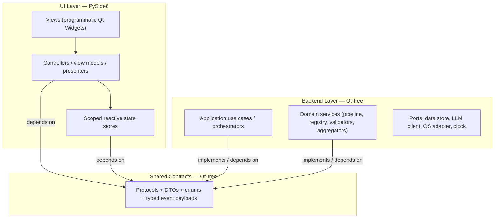
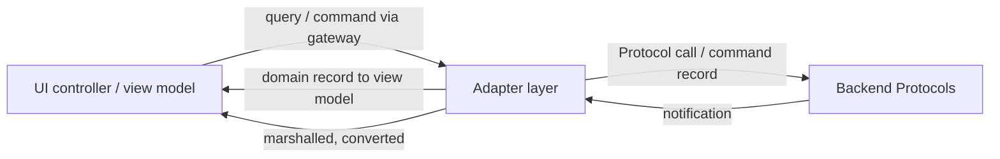
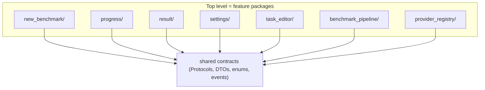

# Architecture Principles

**Status:** Draft
**Owner:** architect
**Audience:** architect, coder
**Last Updated:** 2026-06-06
**Cross-references:** 08_Cross_Cutting/08-M_app_lifecycle.md, 08_Cross_Cutting/08-K_platform_specifics.md, 10_Domain_and_Data/01_DOMAIN_MODEL.md, 10_Domain_and_Data/02_DTOS_AND_ENUMS.md, 11_Services_and_Algorithms/01_SERVICE_INVENTORY.md

This document fixes the binding architecture of the application: the rules that every module, every service, and every UI component must obey. It defines a two-layer split between a Qt-free backend and a PySide6 user-interface layer, both built over a shared set of Protocols; a hexagonal arrangement of each layer around its domain; an MVC-family presentation pattern inside the UI; an adapter layer that converts domain records into view models and marshals cross-thread notifications; a single manual composition root; and a feature-first module organisation with no god services. The rules below are non-negotiable. When a design choice is ambiguous, choose the option that preserves these rules.

---

## Table of Contents

1. Purpose and scope
2. The two-layer split: backend and UI
3. Shared Protocols as the only cross-layer contract
4. Hexagonal arrangement within each layer
5. Presentation pattern inside the UI layer
6. The adapter layer
7. Cross-thread marshalling
8. The composition root
9. Feature-first module organisation
10. No god services
11. State ownership and reactive stores
12. The typed event bus
13. What this specification fixes and what it leaves open
14. The replaceability test
15. Non-negotiable rules — summary

---

## 1. Purpose and scope

The application must be easy to adopt, modify, extend, and partially replace without rewriting unrelated parts. Every rule in this document exists to preserve that property. The rules govern *structure and dependency direction*. They do not prescribe internal algorithms; those are specified per service in `11_Services_and_Algorithms/`.

The architecture has two goals that override convenience:

- A change confined to one feature must not force edits to another feature.
- A swap of one technology (the data store engine, a provider SDK, the UI toolkit) must not ripple across layer boundaries.

## 2. The two-layer split: backend and UI

The application is two top-level layers — a Qt-free backend and a PySide6 UI — with **no dependency in either direction between them**. The only thing connecting them is the adapter layer of section 6, which is **by design** the place where Qt-specific glue lives: it is part of the frontend side of the split and is rewritten along with the UI if the toolkit ever changes. The backend is frontend-agnostic: any frontend (the Qt app, a CLI, a test harness, a different toolkit) drives the same backend modules unchanged.

**Backend layer.** Implements every business behaviour: the benchmark pipeline, the provider registry, the evaluation phases, the validators, the chart aggregators, the data store, the readiness service, the settings service. It owns the domain records defined in `10_Domain_and_Data/02_DTOS_AND_ENUMS.md`. It imports no Qt module. It is runnable headlessly — in a test harness, in a script, or behind an alternate frontend — with no UI present.

**UI layer.** Built with PySide6. It renders views, captures user input, holds reactive presentation state, and subscribes to backend notifications. It holds no business logic. It depends on the backend only through the shared Protocols of section 3.

**Hard rules.**

1. The backend layer is frontend-agnostic: building or replacing a frontend (a different UI technology, a CLI, a test harness) modifies **no backend module**. The Qt-specific adapter layer (gateways, marshalling, runner, table models) belongs to the frontend side of this split and is replaced together with the UI — that is its designed role, not a leak.
2. The backend layer runs with no UI dependency present in the process.
3. Commands flow one way (UI to backend); notifications flow one way (backend to UI, over the event bus of section 12).
4. Neither layer imports a concrete type from the other. Only the shared Protocols, DTOs, enums, and event payloads cross the boundary.
5. No Qt symbol — no `QObject`, no `Signal`, no widget — appears anywhere in the backend layer or in the shared contracts.

## 3. Shared Protocols as the only cross-layer contract

A single Qt-free shared module holds everything both layers agree on:

- The service **Protocols** (structural interfaces) the backend implements and the UI consumes.
- The **DTOs and enums** of `10_Domain_and_Data/02_DTOS_AND_ENUMS.md` — `msgspec.Struct` records and `StrEnum` enumerations.
- The **typed event payloads** carried on the event bus (section 12).

The shared module depends on nothing but the standard library and `msgspec`. Both layers depend on it; it depends on neither of them. A Protocol is the *only* permitted cross-layer type. A UI controller never names a concrete backend class; it names a Protocol. A backend service never names a UI class at all.

Because Protocols are structural, a backend service satisfies a Protocol by shape alone, and a test fake satisfies the same Protocol the same way. Swapping an implementation never touches a caller.

## 4. Hexagonal arrangement within each layer

Each layer is internally hexagonal: a domain core surrounded by ports, with adapters at the edges.

- The **backend core** holds domain records and pure domain logic. It defines **ports** — Protocols for everything outside its control: the data store port, the LLM client port, the OS adapter port, the clock port.
- **Driven adapters** implement those ports: the SQLite data store implements the data store port; each provider SDK wrapper implements the LLM client port; the OS adapter implements the OS port.
- The **driving side** is the application use cases — orchestrators that drive the domain in response to commands.

The dependency rule is absolute: dependencies point inward. The domain core depends on nothing but the shared contracts. Adapters depend on the core's ports. Nothing in the core imports an adapter.

The UI layer mirrors this: its core is the presentation logic (controllers, view models, stores); its ports are the backend Protocols; the views are the adapters at the rendering edge.

## 5. Presentation pattern inside the UI layer

Inside the UI layer the project fixes **one presentation dialect, used identically by every widget**. Its established project name is the **"MVC-family layout"** (the term used throughout the widget `implementation_structure.md` documents and the module inventory), and it is defined normatively here and structurally in `16_Engineering_Standards/01_PROJECT_STRUCTURE.md` §6: a **passive View**, a **Controller**, and a **frozen ViewModel** derived by **pure select functions**. The dialect is not an implementer's choice — every widget module follows the same four-file shape (`view.py`, `controller.py`, `models.py`, `view_model_select.py`).

Note on vocabulary: there is **no MVC "Model" role in the UI layer**. Domain state belongs to the backend; presentation state lives in the scoped reactive stores (section 11) and in the immutable ViewModel the view renders. The pattern is closest to MVVM with explicit selectors; the project keeps its established "MVC-family" label.

| Role | Responsibility |
|---|---|
| **View** | Renders the ViewModel; captures user gestures; owns no business logic; performs no service call directly. Views are built as programmatic Qt Widgets (section 13). |
| **Controller** | Orchestrates one view against **adapter-provided UI-facing interfaces (gateways)** — never against backend Protocols directly; translates gestures into adapter calls; subscribes to adapter-delivered (marshalled) notifications; triggers ViewModel re-derivation through the select functions. |
| **ViewModel** | Immutable presentation state — a frozen `msgspec.Struct` (`models.py`) — derived from store state and backend domain records by the pure select functions of `view_model_select.py`. |

Concrete rules:

- A view never calls a backend service. It calls its controller.
- A controller receives its dependencies as **adapter-provided UI-facing interfaces** through constructor injection — **never backend Protocols directly**, and never a concrete service. The adapter holds the backend Protocols; the controller depends only on the adapter's interfaces (so the backend can be replaced without touching the UI, and vice versa).
- A controller never imports a backend module, never holds a backend Protocol, and never subscribes to a backend reactive primitive directly. All backend interaction — both immediate queries/commands and push notifications — crosses the adapter (section 6).
- A view is the only place that subscribes to widget-level UI events and the only place that renders UI primitives.
- A view model carries presentation state only. It never carries a live Qt object and never carries unconverted backend internals.

## 6. The adapter layer

An **adapter layer** is the single, mandatory boundary between the UI controllers and the backend Protocols. It is the **only** layer that holds backend Protocols; the UI depends solely on the adapter's UI-facing interfaces. Its responsibilities:

- **UI-facing interfaces (gateways)** — expose the small set of query and command methods a controller needs for *immediate, in-place* interaction (for example `is_inference_busy()`, `start_run(...)`, `pause()`). The adapter decides how to satisfy each one — a direct backend Protocol call, a converted command record, etc. The controller calls the gateway; it never sees the Protocol.
- **View-model conversion** — translate a backend domain record (for example a `BenchmarkRun` or a `BenchmarkResult`) into the UI-shaped view model a view renders.
- **Command construction** — translate a UI gesture into a backend command record (for example a `RunStartRequest`).
- **Cross-thread marshalling of push notifications** — deliver a backend notification, raised on a worker thread, onto the UI thread (section 7), converted into a view-model update.
- **A stable seam** — let either side change shape, threading, or timing without dragging the other along.

**Single-inference gate UI consistency (SPEC-118).** Every inference-initiating control (Start, Resume, Provider-Edit Test, Generate Analysis, readiness re-probe) is built from one shared **gated-control mixin/factory** that binds the control's enabled state to the `InferenceActivityStore` gate (delivered via `_inference_activity_changed`), so a new inference-initiating surface cannot be added without the gate binding by construction. The service-side `try_acquire` remains the safety net (DD-50), and an architecture test asserts that every controller which calls a gate-acquiring command also constructs its trigger control through the shared gated-control mixin.

The adapter layer is **mandatory**, not optional: the UI never holds a backend Protocol, so even a trivial query (for example "is an inference in flight?") is exposed as an adapter gateway method rather than a direct Protocol call from the controller. This is what keeps the UI and the backend free of any dependency on each other — each side sees only the adapter, and every Qt-specific accommodation lives in the adapter by design (the adapter is frontend-side glue, replaced along with the UI; the backend never changes for a frontend's sake). The adapter chooses the most efficient mechanism for each interaction: a direct backend Protocol call for an immediate check, a command record for a gesture, a marshalled event for a push notification. The rule: **all UI↔backend communication crosses the adapter; when the two sides disagree about shape, threading, or timing, the divergence lives in the adapter — never in a backend service and never in a view.**

## 7. Cross-thread marshalling

The backend may raise notifications from a background worker (for example the benchmark pipeline reporting progress; see `08-M_app_lifecycle.md`). Qt widgets are touched only on the UI thread.

- Every backend-to-UI notification crosses into the UI thread through the adapter layer's marshalling step before any widget is updated.
- A controller never assumes the thread a notification arrived on; it relies on the adapter to have marshalled it.
- The marshalling mechanism is an implementation choice. The contract is: by the time a controller's handler runs, it runs on the UI thread.
- High-frequency notifications may be coalesced or throttled in the adapter so the UI thread is not flooded; coalescing rules belong to the adapter, never to the emitting service. This rule governs **UI repaint rate** (how often a widget is asked to redraw) — it is adapter/controller-owned. It is distinct from **backend emission cadence** (how often the backend chooses to publish a domain notification). A backend liveness heartbeat — for example the progress emitter ticking at ≥ 1 Hz so a stalled-but-alive run is still observable — is a legitimate backend-owned cadence and is **not** a violation of this rule: the emitter decides what and how often to *publish*, the adapter decides how often the UI *repaints* from those publications. The two cadences are independent.

## 8. The composition root

Every concrete implementation is wired exactly once, in a single **composition root**, by hand.

- The composition root reads the runtime configuration, constructs each driven adapter, constructs each service, and assembles the object graph.
- No service constructs another service inline. No view constructs a service inline. No module reaches for a global singleton.
- Construction is manual and explicit — no dependency-injection framework, no service locator, no global registry.
- The composition root is the only module that names concrete classes from both layers. Every other module names Protocols.
- Tests use a parallel composition root that wires fakes, stubs, and in-memory implementations against the same Protocols.

The composition root is built during launch, after the data store is open and seeded, and before the UI is constructed. The exact step is fixed in `08-M_app_lifecycle.md`.

## 9. Feature-first module organisation

The top level of the codebase is a set of **feature packages**, not a set of technical layers. A feature package contains everything that feature needs and is internally layered.

- A top-level package corresponds to one feature or one cohesive capability — for example the new-benchmark feature, the progress feature, the result feature, the settings feature, the task-editor feature, the benchmark-pipeline feature, the provider-registry feature.
- Each feature package is internally layered along the hexagonal lines of section 4: a domain part, a service part, an adapter part, and — for UI features — a view part.
- The internal **depth varies by feature**. A small feature is a handful of files; a large feature splits its internals into sub-packages. Depth follows the feature's real complexity; it is not forced uniform.
- A feature package exposes a small public surface — a factory function or a small set of entry points — and keeps the rest internal.
- A feature package never imports another feature package's internals. Features collaborate only through shared Protocols and the event bus.

## 10. No god services

Functionality is split across many small, focused services and many small, focused controllers. Each owns exactly one concern.

- A service that does more than one thing is split.
- A controller that drives more than one view is split.
- A model that mixes presentation state with domain state is split.

This is why the specification names many distinct services rather than collapsing them — for example the run validator, the task-file validator, the YAML formatter, the adaptive-timeout service, the provider circuit breaker, the chart aggregators, the readiness service. Each has a single purpose, is independently testable, and is independently replaceable. The full set is catalogued in `11_Services_and_Algorithms/01_SERVICE_INVENTORY.md`.

## 11. State ownership and reactive stores

State has exactly one owner, and the owner depends on what the state is.

- **Persistent domain state** is owned by the backend and lives in the data store (see `10_Domain_and_Data/03_PERSISTENCE_SCHEMA.md`). The UI never holds the authoritative copy of a `BenchmarkRun` or a `BenchmarkResult`.
- **Transient run state** is owned by the benchmark pipeline. The persisted `RunStatus` is one of `INCOMPLETE`, `COMPLETED`, `FAILED`, `STOPPED`; the finer in-memory states `RUNNING` and `PAUSED` are derived by the pipeline and never written to the data store (see `10_Domain_and_Data/02_DTOS_AND_ENUMS.md`). The UI reads "is a run currently active (non-terminal)?" from a **single source** — one adapter-provided run-activity gateway backed by the pipeline's `is_running()` / `current_run()`, with the canonical `_run_*` lifecycle events (`08_Cross_Cutting/08-J_event_bus_catalog.md`) as the push signal (D-R-05). No widget re-derives run-active state independently from the raw event stream: Main Window, Progress, and Result all observe the same gateway/events, so they never disagree about whether a run is active.
- **Presentation state** is owned by the UI layer in **scoped reactive stores**. A store is scoped to a feature or a screen, not global. A store holds the view-facing state for its scope, exposes it as immutable snapshots, and notifies its subscribers when it changes.
- A store is the single source of truth for its scope. State is never duplicated across stores. When a controller subscribes to more than a few stores, that is a signal to split the controller.

A reactive store never holds business logic. It holds state and notifies on change. Logic that decides *what the next state is* lives in a controller or a backend service.

**Single-inference invariant.** At most one inference-using activity class may be in flight at any moment across the whole application. `InferenceActivity` (`10_Domain_and_Data/02_DTOS_AND_ENUMS.md`) is the `IDLE` sentinel (not-holding) plus the **four holding activities** — `BENCHMARK_RUN` (a benchmark run), `JUDGE_ANALYSIS` (a judge-analysis generation), `PROVIDER_TEST` (a Provider Edit Test Connection probe), and `READINESS_PROBE` (a readiness probe). `IDLE` does not "count" as an activity — it is the absence of a held activity; consistent with `11_Services_and_Algorithms/16_CONCURRENCY_MODEL.md` §6.0. The invariant is enforced by the `InferenceActivityStore` (`08_Cross_Cutting/08-E_interfaces_contracts.md`): every backend service that issues an inference call acquires the gate at the start of its activity (an atomic test-and-set under one `threading.Lock`) and releases it in `finally`. The store is a backend service with a **method-only** Protocol (`try_acquire`/`release`/`state`/`is_busy`) — it carries no Qt or `psygnal` surface. Its state changes are published as the typed `_inference_activity_changed` event on the Qt-free event bus; the adapter marshals that event onto the UI thread and also exposes an immediate-check gateway method. Every UI surface that initiates an inference observes the gate state through the adapter (the marshalled event) and is disabled while another activity holds the gate; the service-side `try_acquire` is the safety net. The UI never subscribes to a backend reactive primitive directly.

## 12. The typed event bus

Backend-to-UI notification flows over a single **typed event bus**.

- Every event is a typed payload — a `msgspec.Struct` record defined in the shared contracts.
- The bus is Qt-free. It belongs to the shared layer; both backend and UI depend on it; it depends on neither.
- A publisher names the event type; a subscriber names the event type. Publishers and subscribers never name each other.
- An event payload carries data only — identifiers and values from the shared DTOs. It never carries a live Qt object and never carries a mutable structure.
- Events flow backend to UI. Commands flow UI to backend through Protocol method calls, not through the bus.
- Delivery onto the UI thread is the adapter layer's responsibility (section 7).

## 13. What this specification fixes and what it leaves open

The specification fixes *what* and *what contract*; it leaves *how* to the implementer.

**Fixed (contractual):**

- The two-layer split and the dependency direction.
- The shared Protocols, DTOs, enums, and event payloads.
- Every observable behaviour, transition, restriction, and edge case.
- The presentation pattern family, the adapter layer, the single composition root, the feature-first organisation.
- UI is built with **programmatic Qt Widgets** — widgets are constructed and styled in code. Design tokens (colours, spacing, typography) are **Python objects**, not stylesheet files.

**Left to the implementer (how):**

- The internal algorithm of any service, within its stated observable contract.
- How background work is scheduled and how cancellation is propagated.
- How the data store executes its queries.
- How the UI toolkit and its event loop are configured.
- How the project is built and packaged.

When a service description states an observable contract — for example that the adaptive-timeout service raises the next attempt's ceiling after a timeout — the contract is binding and the formula is the implementer's choice, provided the observable contract holds.

## 14. The replaceability test

Any proposed implementation must answer "yes" to every question below. A "no" means the architecture has been violated.

| Question | Guaranteed by |
|---|---|
| Can the UI toolkit be replaced without touching the backend? | Two-layer split (section 2) |
| Can the data store engine be swapped without touching the UI or the controllers? | Port abstraction (section 4) |
| Can a new provider type be added by writing one new LLM-client adapter? | LLM client port (section 4) |
| Can a benchmark run headlessly, with no UI in the process? | Backend independence (section 2) |
| Can any controller be unit-tested without instantiating a real backend service? | Constructor-injected Protocols (sections 5, 8) |
| Can a whole service be swapped without modifying any caller? | Protocol-only contracts (section 3) |
| Can one feature change without forcing edits to another feature? | Feature-first organisation (section 9) |

## 15. Non-negotiable rules — summary

1. **Two-layer split** — a Qt-free, frontend-agnostic backend layer and a PySide6 UI layer, with no dependency in either direction; the adapter layer is the sole, frontend-side bridge.
2. **Shared Protocols only** — Protocols, DTOs, enums, and typed event payloads are the only types crossing the layer boundary; no Qt symbol exists in the backend or the shared contracts.
3. **Hexagonal** — each layer is a domain core surrounded by ports and adapters; dependencies point inward.
4. **MVC-family presentation (fixed dialect)** — passive View, Controller, frozen ViewModel + pure select functions, in the same four-file shape in every widget; views own no logic; controllers receive **adapter gateways** (never backend Protocols) by constructor injection.
5. **Adapter layer** — view-model conversion, command construction, and cross-thread marshalling live in the adapter, never in a service or a view.
6. **Single composition root** — every concrete implementation is wired once, by hand; no service or view constructs a dependency inline.
7. **Feature-first modules** — the top level is feature packages, each internally layered, with depth following the feature's complexity; no feature imports another feature's internals.
8. **No god services** — many small focused services and controllers, one concern each.
9. **One owner per state** — domain state in the data store, transient run state in the pipeline, presentation state in scoped reactive stores; no duplication.
10. **Typed event bus** — backend-to-UI notifications are typed payloads on a Qt-free bus; commands flow UI-to-backend through Protocol calls.
11. **Headless backend** — the backend runs and a benchmark completes with no UI present.
