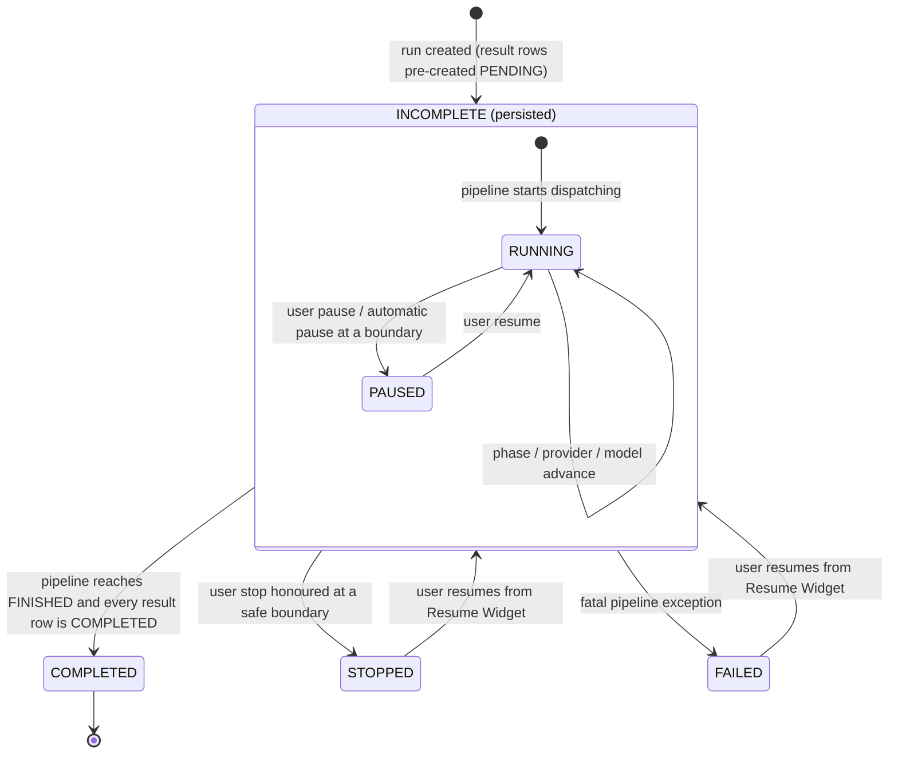
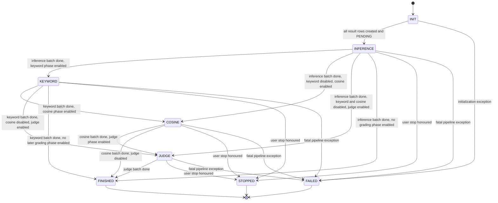
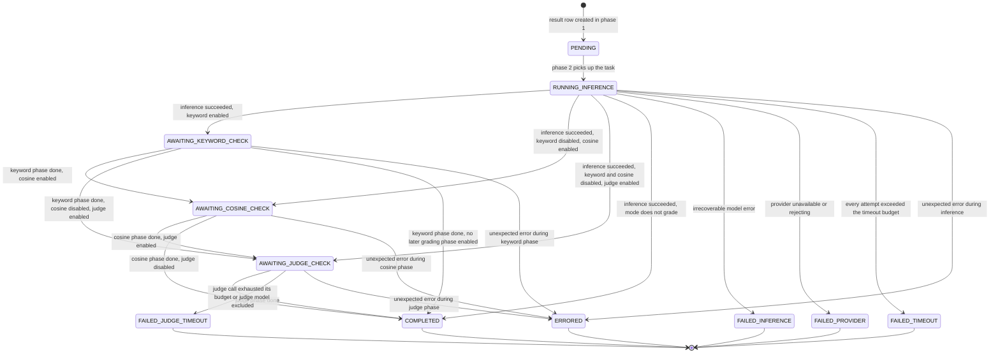
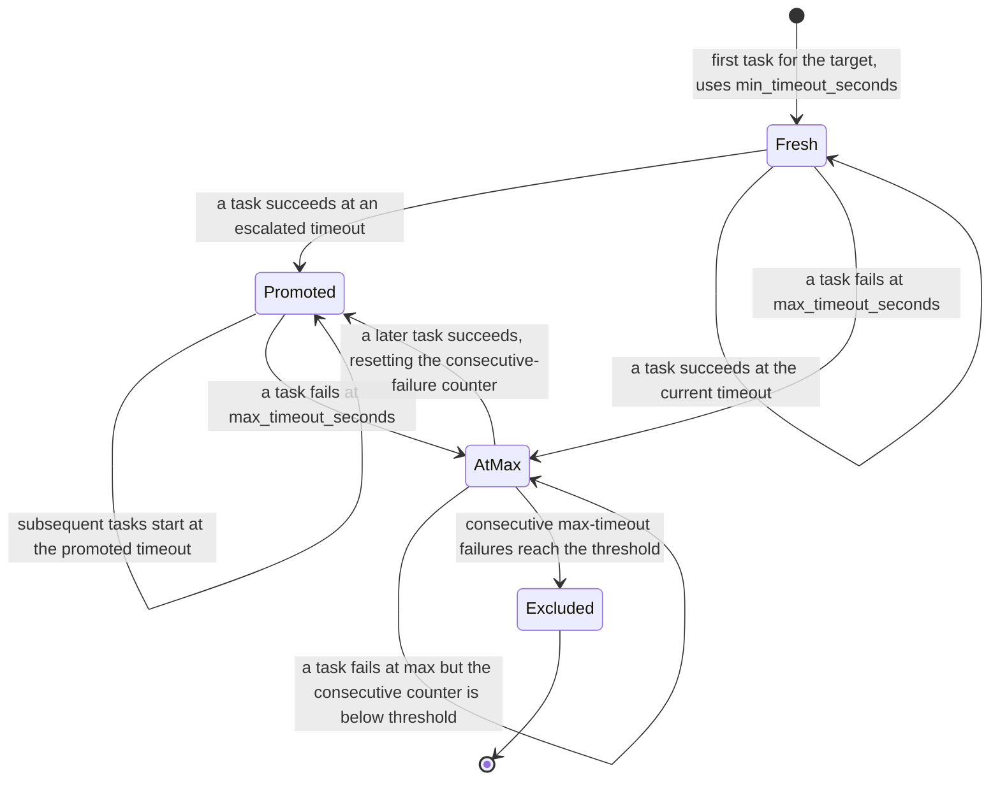
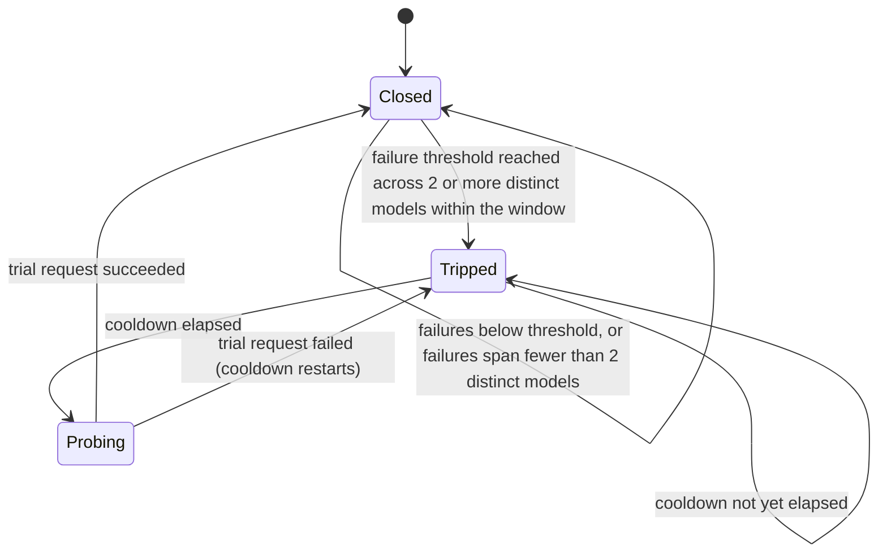

# Benchmark State Machine

**Status:** Draft
**Owner:** architect
**Audience:** arch, coder, tester
**Last Updated:** 2026-06-06
**Cross-references:** `10_Domain_and_Data/02_DTOS_AND_ENUMS.md`, `10_Domain_and_Data/01_DOMAIN_MODEL.md`, `10_Domain_and_Data/03_PERSISTENCE_SCHEMA.md`, `08_Cross_Cutting/08-I_edge_cases.md`, `04_Progress_Widget/state_machine.md`, `03_Resume_Benchmark_Widget/description.md`

This document is the authoritative lifecycle model for a single benchmark run. It defines the persisted run status set, the in-memory transient states the pipeline maintains while executing, the five-phase batched pipeline, the per-task result lifecycle, the adaptive-timeout and circuit-breaker sub-state-machines, and the exact semantics of pause, resume, stop, and crash recovery. It is the binding contract that every implementation of the benchmark pipeline, the Progress Widget, and the Resume Widget must satisfy.

---

## Table of Contents

1. Scope and vocabulary
2. Run status — persisted and in-memory
3. The five-phase batched pipeline
4. Provider and model grouping
5. Per-task result lifecycle
6. Adaptive-timeout state machine
7. Provider circuit-breaker state machine
8. Pause, resume, and stop
9. Crash recovery
10. Terminal status resolution
11. Settings snapshot
12. Invariants

---

## 1. Scope and vocabulary

A **run** is one benchmark execution: a fixed set of test models evaluated against a fixed set of tasks, in one of three run modes. A **result** (also called a per-task result, or a result row) is the record for one `(provider_id, model_name, task_id)` combination within a run. A run owns one result row per combination.

The three run modes are fixed:

| Mode | Pipeline phases | Grading |
|---|---|---|
| `SYNTHETIC` | Phases 1–2 only | None. Synthetic tasks; no golden answer. |
| `TASKS` | Phases 1–2 only | None. Task Benchmark never grades — phases 3–5 do not run in this mode. The only difference from `SYNTHETIC` is the prompt source (user task files vs synthetic prompts). |
| `GRADED` | All five phases by default; phases 3–5 individually disable-able in Settings → Evaluation | On. The five-phase pipeline applies only in this mode. |

The quality outcome of a graded result is a strictly binary `Verdict` — `PASS` or `FAIL`. There is no `UNKNOWN` verdict and no numeric score. The judge phase produces a binary verdict and a free-text reasoning string; it produces no number. The only numeric quality value anywhere in the system is the cosine similarity score.

A benchmark target is always the composite identity `(provider_id, model_name)`. Two providers exposing the same underlying model name are two distinct targets throughout execution, grading, aggregation, and export. The application never identifies a target by `model_name` alone.

---

## 2. Run status — persisted and in-memory

### 2.1 Persisted run statuses

The data store persists exactly four run statuses in `benchmark_runs.status`, modelled by the `RunStatus` enum:

| Status | Meaning |
|---|---|
| `INCOMPLETE` | The run has been created and has result rows that have not all reached a terminal status. This covers a freshly created run, a run currently executing, a run that is paused, and a run whose process died mid-execution. |
| `COMPLETED` | Every result row reached a terminal status and the run finished normally. |
| `FAILED` | A fatal pipeline error halted the run before completion. |
| `STOPPED` | The user stopped the run before completion. |

### 2.2 In-memory transient states

While the pipeline is executing a run, it maintains two finer-grained transient states that are **never written to the database**: `RUNNING` and `PAUSED`. These are derived, in-memory-only states held by the pipeline and surfaced to the UI through the event bus. They are not members of `RunStatus`.

- A run is `RUNNING` in memory while its persisted status is `INCOMPLETE` and the pipeline is actively dispatching tasks.
- A run is `PAUSED` in memory while its persisted status is `INCOMPLETE`, the pipeline is loaded for that run, and execution is halted at a safe boundary awaiting a resume.
- When the pipeline is not loaded — for example after a stop, after a fatal failure, or after the process exited — there is no transient state; only the persisted `RunStatus` describes the run.

### 2.3 Run status state machine



Notes on the diagram:

- `RUNNING` and `PAUSED` are shown nested inside `INCOMPLETE` because they are sub-states of the single persisted status `INCOMPLETE`. The database never distinguishes them.
- How the pipeline decides which of these transitions to take when it halts is the **outcome matrix (DD-42)**: one atomic `token.snapshot()` per halt maps `(CancelLevel, CancelReason)` to PAUSED / STOPPED / INCOMPLETE — see `11_Services_and_Algorithms/16_CONCURRENCY_MODEL.md` §6.8. A hard cancel arriving after a run parked as `PAUSED` wakes the parked dispatcher (the `Paused → Stopping` path) and the matrix is applied again, so a late Stop is never lost.
- Resume of a `STOPPED` or `FAILED` run flips the persisted status back to `INCOMPLETE` before the pipeline starts dispatching. The run record itself, including its `run_id` and its settings snapshot, is reused; no new run is created.
- A `COMPLETED` run is terminal and is never resumed. The Resume Widget does not list `COMPLETED` runs.

---

## 3. The five-phase batched pipeline

A run executes as **five phases in strict order**. The defining rule is batching: a phase processes every eligible task in the run before the next phase begins. The pipeline never carries a single task through all five phases before starting the next task.

| Phase | Name | Work | Model used |
|---|---|---|---|
| 1 | Initialization | Result rows confirmed `PENDING`, settings snapshot applied, task set and grouping resolved | none |
| 2 | Inference | The test model runs inference for the task; timings, tokens, and the response are recorded; a deterministic sanity check runs on the response | the test model |
| 3 | Keyword check | The response is checked against the task's exact, semantic, and forbidden term lists | embedding model (for semantic terms) |
| 4 | Cosine check | The response is compared to the golden answer by embedding similarity | embedding model |
| 5 | Judge check | The judge model evaluates the response and returns a binary verdict plus reasoning | the judge model |

### 3.1 Pipeline stage state machine



The stage is the pipeline's own in-memory cursor. It is not a separate persisted column; the run's progress is reconstructible from the result rows. The diagram shows every legal phase-skip path: a disabled grading phase is skipped entirely, and the pipeline advances directly to the next enabled phase or to `FINISHED`.

### 3.2 The batching rule

> A phase cannot begin until every eligible task from the previous phase has reached the state that phase produces.

The pipeline runs:

```
run every eligible task through Phase 1
then run every eligible task through Phase 2
then run every eligible task through Phase 3
then run every eligible task through Phase 4
then run every eligible task through Phase 5
```

An **eligible task** for a phase is one whose result row has not already failed irrecoverably in an earlier phase. A task whose inference failed irrecoverably is excluded from phases 3–5; the pipeline waits only for the eligible tasks before advancing the stage.

Batching exists so the user can insert automatic pauses between phases and manually unload the test models before the judge model loads — essential on memory-constrained local hardware where the test model and the judge model cannot be resident at once.

### 3.3 Phase applicability per mode

| Phase | `SYNTHETIC` | `TASKS` | `GRADED` |
|---|---|---|---|
| 1 — Initialization | always | always | always |
| 2 — Inference | always | always | always |
| 3 — Keyword check | never | never | toggleable (default on) |
| 4 — Cosine check | never | never | toggleable (default on) |
| 5 — Judge check | never | never | toggleable (default on) |

The three grading phases run only in `GRADED` and are each independently toggleable in Settings → Evaluation. `TASKS` and `SYNTHETIC` never run any grading phase — they execute init → inference → finalize and report timing and throughput only. A `GRADED` run may, for example, run with the judge phase off so that only keyword and cosine grade the responses.

The run-level **judge analysis narrative** — a consolidated written analysis of the whole run — is a separate post-run report, not a pipeline phase. It is generated after the pipeline reaches `FINISHED` **when the run's snapshot has `feature.judge_run_analysis_enabled = true`** — and is conditional on that snapshot flag in **every mode**, not on the run mode itself. The flag defaults ON in `GRADED` and OFF in `SYNTHETIC` and `TASKS`; the user can override either default at run start. When the snapshot flag is false the pipeline skips the analysis call, `BenchmarkRun.run_analysis` stays null, and the user can generate one post-run from the Run Analysis tab. The narrative is not modelled by the stage state machine above; it can be regenerated later from stored results in any mode.

### 3.4 Response sanity check

Immediately after phase 2 produces a response, a deterministic sanity check runs on that response. It flags an empty response, a response that merely echoes the prompt, an implausibly short response, or a response containing an error marker. The outcome is recorded on `BenchmarkResult.sanity_check_passed`.

A response that fails the sanity check still exists. The task carries a failing signal forward but is still keyword-checked, cosine-checked, and judged. Only a task with **no response at all** — an irrecoverable inference or provider failure — skips phases 3–5.

---

## 4. Provider and model grouping

Within the LLM-using phases, tasks are ordered by `(provider_id, model_name)`:

- Every task for one provider completes before any task for the next provider begins. **No provider switch occurs mid-phase.**
- Within a provider, every task for one model completes before the next model starts.

Phase 2 (inference) executes in this shape:

```
Provider A
    Model 1: task, task, task, ...
    Model 2: task, task, task, ...
Provider B
    Model 1: task, task, task, ...
    Model 3: task, task, task, ...
```

Grouping minimises model load and unload churn on local hardware: a local provider keeps one model resident and serves all of that model's tasks before the next model loads. Phase 5 (judge) uses a single judge model from a single provider, so grouping within it is trivial. Phases 3 and 4 use the embedding model and likewise touch a single provider and model.

---

## 5. Per-task result lifecycle

Each result row moves through the `ResultStatus` lifecycle. The first five members are non-terminal pipeline-position states; the last six are terminal.

| Status | Group | Meaning |
|---|---|---|
| `PENDING` | non-terminal | Row created; task not started. The reset target for retry and crash recovery. |
| `RUNNING_INFERENCE` | non-terminal | The phase-2 inference call for this task is in progress. |
| `AWAITING_KEYWORD_CHECK` | non-terminal | Inference done; queued for the keyword phase. |
| `AWAITING_COSINE_CHECK` | non-terminal | Keyword phase done; queued for the cosine phase. |
| `AWAITING_JUDGE_CHECK` | non-terminal | Cosine phase done; queued for the judge phase. |
| `COMPLETED` | terminal | Every applicable phase ran. `verdict` is set to `PASS` or `FAIL` for a graded run; unset for a non-grading mode. Never retried automatically. |
| `FAILED_INFERENCE` | terminal | Inference failed irrecoverably with a model-side error. Retryable. |
| `FAILED_PROVIDER` | terminal | The provider was unavailable or rejected the request. Retryable. |
| `FAILED_TIMEOUT` | terminal | Inference exceeded its adaptive-timeout budget after every attempt. Retryable. |
| `ERRORED` | terminal | An unexpected error halted the task. Retryable. |

`COMPLETED` is the only non-retryable terminal status. A `COMPLETED` row carrying a `FAIL` verdict is a legitimate validation result, not an error; it is never retried automatically. The five failure statuses — `FAILED_INFERENCE`, `FAILED_PROVIDER`, `FAILED_TIMEOUT`, `FAILED_JUDGE_TIMEOUT`, `ERRORED` — are retryable: a resume or a manual retry resets the row to `PENDING` (a `FAILED_JUDGE_TIMEOUT` retry re-runs the WHOLE task end-to-end — re-inference + re-grade — uniform with the other `FAILED_*` retries; the original attempt's inference text and timings are NOT preserved — DD-34).

### 5.1 Result lifecycle state machine



### 5.2 Grading, verdicts, and short-circuit rules

A task moves through every **enabled** grading phase. A keyword `FAIL` or a low cosine score does not short-circuit later phases when those phases are enabled: when the judge phase is on, the judge evaluates every task with a response regardless of the keyword and cosine outcomes. Each enabled grading phase records its own per-phase verdict — `keyword_verdict`, `cosine_verdict`, `judge_verdict` — independently.

The result's combined `verdict` and its `resolution_layer` are assigned after the last enabled grading phase completes:

- `resolution_layer` records which layer decided the combined verdict — `KEYWORD`, `COSINE`, `JUDGE`, or `SKIP` (non-grading mode).
- The combined `verdict` is set only when the row reaches `COMPLETED`. A row that ends in a failure status carries no verdict.

A keyword check that flags missing exact terms, a forbidden term, or a low semantic similarity is a validation **result**, not an error. The same holds for a low cosine score and a judge `FAIL`. None of these is ever retried. Only the five failure statuses are retryable.

### 5.3 Recoverable failures and retry within a run

Phase 2 inference applies adaptive timeout and retry (Section 6). Retry within a run applies only to recoverable failures: provider unavailability, connection interruptions, and inference timeouts. When every attempt for a task is exhausted, the row receives the terminal failure status matching the last error — `FAILED_PROVIDER` for a provider or connection failure, `FAILED_TIMEOUT` for a timeout, `FAILED_INFERENCE` for a model error — and the pipeline advances. These rows remain eligible for a later manual retry from the Resume Widget.

---

## 6. Adaptive-timeout state machine

Inference can be slow or can hang. The pipeline adapts the per-attempt timeout for each `(provider_id, model_name)` target. The user configures four per-run-snapshotted values:

| Setting key | Meaning |
|---|---|
| `benchmark.min_timeout_seconds` | The starting per-attempt time budget. |
| `benchmark.max_timeout_seconds` | The ceiling — no attempt waits longer than this. |
| `benchmark.retry_count` | How many attempts a task gets; the per-attempt timeout escalates from minimum toward maximum across these steps. |
| `benchmark.consecutive_max_timeouts_to_exclude` | How many consecutive max-timeout failures for one target trigger its exclusion from the run. |

### 6.1 Escalation and promotion

- The first task for a target uses the last-known-good timeout, which starts at `min_timeout_seconds`.
- On a timeout failure, the pipeline retries with a longer timeout, escalating from the last-known-good value toward `max_timeout_seconds` across the configured retry count.
- On a success at an escalated timeout, the last-known-good timeout for that target is **promoted** so future tasks for the same target start at the value that worked.

### 6.2 Exclusion

A target is excluded from the run only after it accumulates `consecutive_max_timeouts_to_exclude` failures **in a row at the maximum timeout**. The counter is consecutive by design: a target that alternates success and timeout at the maximum is not excluded — that pattern means a few individual tasks are heavy, not that the target is broken. When a target is excluded, its remaining un-run tasks are marked `FAILED_TIMEOUT` with the reason "did not fit the allotted time", and the pipeline moves on so one hopeless target never stalls the run.

### 6.3 Adaptive-timeout state machine



The per-target last-known-good timeout and the running consecutive-max-timeout-failure counter are tracked on the run record per `(provider_id, model_name)`, so the state is auditable and survives pause and resume. The full promotion and exclusion algorithm is specified in `11_Services_and_Algorithms/07_ADAPTIVE_TIMEOUT.md`.

---

## 7. Provider circuit-breaker state machine

Beyond per-target timeout adaptation, the pipeline protects against a whole provider going bad. The circuit breaker is scoped per `provider_id`.

- The breaker tracks failures per provider within a sliding time window.
- It **trips** when a provider accumulates repeated failures spanning two or more distinct models within the window — evidence that the provider itself, not one model, is the problem. A failure run confined to a single model never trips the breaker; that case is handled by adaptive-timeout exclusion.
- While tripped, the pipeline stops dispatching tasks to that provider.
- After a cooldown the breaker enters a **probing** state and allows one trial request. A success closes the breaker; a failure re-trips it and restarts the cooldown.
- If the setting `benchmark.stop_on_provider_health_failure` is true, a tripped provider stops the whole run with an error message identifying the provider, so the user can fix the provider and resume.

### 7.1 Circuit-breaker state machine



The full circuit-breaker algorithm — window length, threshold, cooldown duration, and probe behaviour — is specified in `11_Services_and_Algorithms/08_CIRCUIT_BREAKER.md`.

---

## 8. Pause, resume, and stop

### 8.1 Pause

Pause temporarily halts execution while keeping the run an active, resumable `INCOMPLETE` run. The benchmark interface stays active and the Progress Widget remains visible; the idle three-panel layout is **not** restored.

Pause takes effect only at a safe boundary. The defining guarantee is:

> The in-flight task finishes and is persisted, then the pipeline halts cleanly before the next task starts.

When the user requests a pause, the pipeline sets a pause flag and lets the current task run to completion. The task's result row is written to its proper next status. The pipeline then stops dispatching, before picking up the next task. There are no stale or detached worker threads after a pause: every worker that was running at pause time has finished and saved its result. The run's transient state becomes `PAUSED`; the persisted status stays `INCOMPLETE`.

Pause can take effect at a task boundary, a model boundary, a provider boundary, or a phase boundary. It never interrupts a task mid-inference in a way that corrupts the result row.

The interval between the Pause request and the clean halt is a transient **Pausing** sub-state of `RUNNING`: execution is strictly serial (D-R-16), so **at most one unit is in flight**, and the worst-case wait is that single unit's remaining budget (≤ `benchmark.max_timeout_seconds` for a unit mid-inference, or `eval.judge_timeout_max_seconds` for a unit mid-judge) — always finite. While pausing, the Progress widget shows `Pausing — finishing the current call…` (`04_Progress_Widget/description.md` §3.4); `_run_paused` fires only when that unit is saved. A **Stop clicked during a pending Pause** upgrades the cancellation to hard (DD-39): the draining call is aborted promptly (its row stays `PENDING`) and the run settles to `STOPPED`; a Pause clicked during a pending Stop is a no-op (hard is sticky). The full mechanics and the worst-case-latency bound are in `11_Services_and_Algorithms/16_CONCURRENCY_MODEL.md` §6.8.

### 8.2 Automatic pause

The user can enable automatic pauses at model switches, provider switches, and phase switches. When an automatic pause is configured for a boundary, the pipeline halts at that boundary exactly as for a user pause — the in-flight task is finished and saved first — and waits for an explicit resume. Automatic pauses give the user time to unload the previous local model and load the next.

### 8.3 Resume

Resume continues a `PAUSED` run, or restarts a `STOPPED` or `FAILED` run, from where it left off. On resume:

1. The persisted run status is set to `INCOMPLETE` if it was `STOPPED` or `FAILED`.
2. The pipeline re-reads the run's result rows. It selects all rows in a non-terminal status — `PENDING`, `RUNNING_INFERENCE`, `AWAITING_KEYWORD_CHECK`, `AWAITING_COSINE_CHECK`, `AWAITING_JUDGE_CHECK` — plus any retryable failure rows (`FAILED_INFERENCE`, `FAILED_PROVIDER`, `FAILED_TIMEOUT`, `FAILED_JUDGE_TIMEOUT`, `ERRORED`) the user elects to retry.
3. Any row left in `RUNNING_INFERENCE` is reset to `PENDING` for re-execution from phase 2 (see Section 9).
4. The run's **settings snapshot is reused**. Global setting changes made since the run was created do not apply.
5. `COMPLETED` rows are skipped; they are never re-run.
6. The pipeline re-validates provider availability, model availability, and — when the run needs embeddings — repeats the run-start embedding fail-fast probe (one `embed()` call, DD-48). If a required provider or model is now unavailable, the user is warned before execution proceeds.

By default the Resume Widget pre-selects all unfinished rows and all retryable failure rows. The user may narrow this selection.

### 8.4 Stop

Stop halts execution and returns the application to its idle state: the three-panel layout is restored so the user can start or resume another run. Stop is a **hard cancellation (DD-39)**: after the confirmation, the in-flight task is **aborted promptly** (the LLM client stops at the next chunk boundary or the token's abort hook closes the stream, bounded by `provider.hard_cancel_max_ms`); nothing partial is persisted — the aborted task's row stays `PENDING` and is simply re-run on a later resume, and the cancelled attempt reports no outcome to the breaker or the adaptive-timeout service. All previously completed tasks remain saved. The run's persisted status is set to `STOPPED`. A `STOPPED` run remains resumable from the Resume Widget. Stop requires a confirmation dialog.

The distinction between pause and stop is the layout: stop restores the idle three-panel layout; pause does not.

### 8.5 Pause, resume, stop summary

| Operation | In-flight task | Persisted status after | Transient state after | Layout |
|---|---|---|---|---|
| Pause | finished and saved | `INCOMPLETE` | `PAUSED` | progress panel stays visible |
| Resume | — | `INCOMPLETE` | `RUNNING` | progress panel visible |
| Stop | aborted promptly (hard cancel, DD-39); nothing partial saved — row stays `PENDING` | `STOPPED` | none (pipeline unloaded) | idle three-panel restored |

---

## 9. Crash recovery

If the application process exits while a run is executing — a crash, a force-quit, or an OS shutdown — the run is left persisted as `INCOMPLETE` because `RUNNING` and `PAUSED` are never written to disk. Some result rows may be left in a non-terminal status, in particular `RUNNING_INFERENCE`, because the worker that owned them did not finish.

At the next application launch an **orphan-run sweep** runs as part of startup:

1. Every run found persisted as `INCOMPLETE` whose pipeline is not loaded is treated as an orphan from a previous session.
2. The sweep **leaves each orphan run `INCOMPLETE`** — its persisted status is unchanged — and records a recovery note on the run ("Recovered from a previous session."). No status flip is needed: `resume()` already operates on `INCOMPLETE` runs, so the run is directly resumable from the Resume Widget and continues from the last finished task. The recovery note is recorded only for a run that actually began executing (it has a `started_at` or at least one non-`PENDING` result row); a run that was created but never started is left `INCOMPLETE` with no note, because there is nothing to recover.
3. Any result row of an orphan run left in a non-terminal state — `RUNNING_INFERENCE` or any `AWAITING_*` state that was not properly written — is reset to `PENDING` so that, on a later resume, it re-executes cleanly from its phase rather than being trusted as partially complete.

The reset-to-`PENDING` rule is the safe default: a result row whose owning process died is assumed incomplete and is re-run. No partially written result is trusted. A user who later resumes the recovered run picks up exactly the rows that did not reach a terminal status, plus any retryable failures they elect to retry.

---

## 10. Terminal status resolution

When the pipeline stops dispatching, the persisted run status is resolved as follows:

| Pipeline outcome | Stop requested | Result-row summary | Persisted run status |
|---|---|---|---|
| Reached `FINISHED` | no | every row is `COMPLETED` | `COMPLETED` |
| Reached `FINISHED` | no | one or more rows are not `COMPLETED` (some failure rows remain) | `STOPPED` |
| Reached `FAILED` | — | — | `FAILED` |
| Halted before `FINISHED` | yes | — | `STOPPED` |

A run is `COMPLETED` only when the pipeline reached `FINISHED` and the true-completion test passes — every result row is `COMPLETED`. A run that finished its phases but left retryable failure rows is `STOPPED`, not `COMPLETED`, so the user can resume and retry those rows. `BenchmarkRun.completed_tasks` counts rows in any terminal status and is always less than or equal to `total_tasks`.

---

## 11. Settings snapshot

At run-create time the run record captures a frozen snapshot of every per-run-overridable setting into `benchmark_run_settings`. Every settings read the pipeline performs during the run — timeouts, retry count, exclusion threshold, grading-phase toggles, automatic-pause toggles, the provider-health-stop toggle — reads from the snapshot, never from the live settings service.

The snapshot is reused unchanged across every pause, resume, stop, and crash recovery of the same run. A run resumed on a later app version that has removed or added setting keys reuses the snapshot it has: unknown snapshot keys are ignored, and keys missing from the snapshot fall back to current defaults, with a soft warning recorded to the run log. Visual settings such as the theme are excluded from the snapshot and may change live during the run.

---

## 12. Invariants

The following invariants hold for every run and are the basis for both implementation review and test design:

1. The database stores only `INCOMPLETE`, `COMPLETED`, `FAILED`, or `STOPPED` for a run. `RUNNING` and `PAUSED` are never persisted.
2. A phase never begins until every eligible task of the previous phase has completed.
3. The pipeline never switches providers within a phase; all of one provider's tasks complete before the next provider's begin.
4. A pause and an automatic pause (soft cancellation) always let the in-flight task finish and persist before halting. A stop or shutdown (hard cancellation, DD-39) aborts the in-flight task promptly and persists nothing for it — its row stays `PENDING`. Either way no partial row is ever written and no worker thread is left running after the pipeline reports `PAUSED` or `STOPPED`.
5. A `COMPLETED` result row is never re-run. A retryable failure row is reset to `PENDING` only by an explicit resume or retry.
6. Resume always reuses the original run's settings snapshot, never the live settings.
7. A result row left non-terminal when the process died is reset to `PENDING` by the orphan-run sweep before any resume.
8. The combined `verdict` is binary — `PASS` or `FAIL` — and is set only on a `COMPLETED` row. A failure row carries no verdict. The judge produces no numeric score.
9. Every benchmark target is the composite `(provider_id, model_name)`; the application never aggregates or identifies a target by `model_name` alone.
10. The application-wide single-inference gate is held for the entire run. It is acquired **synchronously at admission** — the first step of `BenchmarkFlowApi.start`/`resume` on the GUI thread, before any run is created or any row is reset (SPEC-036, DD-50) — and the resulting `GateLease` is handed to the dispatcher thread, which calls `release(lease)` in a `try/finally` at run terminal — whether the run reaches `COMPLETED`, `STOPPED`, or `FAILED`. While the gate is held, no other inference-using activity (judge analysis, provider test, readiness probe) can acquire it; this is the single-inference invariant fixed by `08_Cross_Cutting/08-A_architecture_principles.md` §11 and enforced by the `InferenceActivityStore` (`08_Cross_Cutting/08-E_interfaces_contracts.md` §13). The `BENCHMARK_RUN` activity has **no** watchdog auto-release: a process death is handled by the orphan-run sweep (§9), not by the gate's watchdog.
