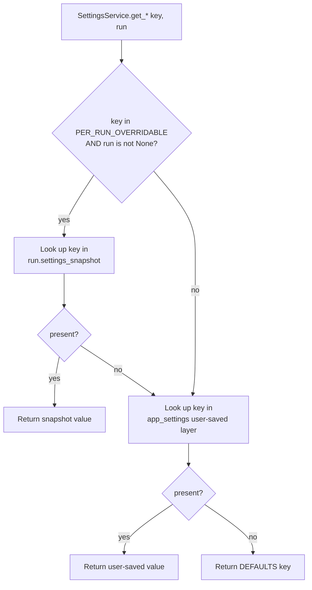

# 08-C — Settings Hierarchy

**Status:** Draft
**Owner:** architect
**Audience:** coder, architect, tester
**Last Updated:** 2026-06-06
**Cross-references:** `08_Cross_Cutting/08-G_feature_flags.md`, `08_Cross_Cutting/08-H_app_modes.md`, `10_Domain_and_Data/02_DTOS_AND_ENUMS.md`, `10_Domain_and_Data/03_PERSISTENCE_SCHEMA.md`

This document defines the authoritative resolution model for every setting in the application: a three-layer cascade of a per-run snapshot over a user-saved value over an in-code default. It states which keys may be overridden per run, how a run snapshot is created and frozen at run start, and why a running pipeline reads only the snapshot. The full registry of keys — type, default, per-run flag, consumers — lives in `08-G_feature_flags.md`; this document defines only the resolution mechanics.

---

## Table of Contents

1. The three layers
2. Resolution order
3. The settings accessor
4. Which keys are per-run-overridable
5. Creating the per-run snapshot
6. Reading during a run
7. Resume and snapshot immutability
8. Mid-run setting changes
9. Resolution diagram

---

## 1. The three layers

A setting value can be supplied by three sources. They are ordered from most specific to most general.

| Layer | Source | Mutability | Lifetime |
|---|---|---|---|
| **Per-Run Snapshot** | `BenchmarkRun.settings_snapshot` — the `BenchmarkRunSettingEntry` rows captured for the run | Immutable — written once at run creation, never changed | The run's lifetime |
| **User-Saved** | The `app_settings` table — `AppSettingRecord` rows written through the Settings dialog | Mutable — changed whenever the user saves the Settings dialog | The application's lifetime |
| **Default** | The in-code defaults map | Immutable — a constant compiled into the application | The release's lifetime |

The Default layer is the floor: every key has a default, so resolution never returns "absent". The User-Saved layer holds only the keys the user has explicitly changed from their defaults. The Per-Run Snapshot layer holds only per-run-overridable keys, and only for a specific run.

---

## 2. Resolution order

A setting read resolves top-down through the layers, returning the first value found.

- For a **per-run-overridable key read in the context of a run**, the cascade is `Per-Run Snapshot ▶ User-Saved ▶ Default`.
- For a **non-overridable key, or any key read outside a run context**, the cascade is `User-Saved ▶ Default`. The Per-Run Snapshot layer is skipped entirely.

A read therefore needs two inputs: the key, and — optionally — the run whose snapshot to consult. When no run is supplied, or the key is not per-run-overridable, the snapshot layer is never consulted.

---

## 3. The settings accessor

A single **Settings Service** is the sole accessor for setting values; no widget or service reads `app_settings` or the snapshot directly. Its read methods are typed per logical value type and accept an optional run:

```text
interface SettingsService:
    get_str(key: SettingKey, run: BenchmarkRun | None) -> str
    get_bool(key: SettingKey, run: BenchmarkRun | None) -> bool
    get_int(key: SettingKey, run: BenchmarkRun | None) -> int
    get_float(key: SettingKey, run: BenchmarkRun | None) -> float
    set(key: SettingKey, value: str) -> None
    upsert(values: Mapping[SettingKey, str]) -> None
```

**Calling convention.**

- The benchmark pipeline and every service running inside a run pass `run = current_run`. Because the pipeline always passes the run, every per-run-overridable read inside a run resolves from the frozen snapshot.
- UI code reading a setting outside a run — the Settings dialog, the Task Editor, theme application, the Result widget — passes `run = None`. These reads resolve from the live user-saved layer and the default.

The `set` and `upsert` write methods write only to the User-Saved layer (`app_settings`). There is no API to mutate a snapshot after the run is created.

---

## 4. Which keys are per-run-overridable

The per-run-overridable set, named `PER_RUN_OVERRIDABLE` in the in-code defaults, is exactly the keys that influence how a run computes its results. Including a key in this set guarantees the run is reproducible from its own snapshot.

**Per-run-overridable — frozen into the snapshot:**

| Group | Reason |
|---|---|
| Every `benchmark.*` key except `benchmark.last_mode` | Warm-up, retry count, the sampling `benchmark.temperature`, the adaptive-timeout bounds for **role=INFERENCE**, the pause flags, and the provider-health-failure policy all change how the pipeline executes a run. |
| Every `feature.*` key | Streaming-log behaviour, the default reasoning effort, and the run-analysis flag are run inputs. |
| Every `eval.*` key | The three phase toggles, the force-judge flag, the three cosine thresholds, the **four `eval.judge_timeout_*` keys (adaptive-timeout bounds for role=JUDGE)**, and the **fixed `eval.embedding_timeout_seconds` budget** all determine how every result is graded. |

**Not per-run-overridable — always read live from the user-saved layer:**

| Group | Reason |
|---|---|
| `benchmark.last_mode` | A UI convenience that preselects the run mode in the New Benchmark widget; it is not a run input. |
| Every `ui.*` key | Visual preferences — theme, log verbosity, log buffer size, export destination, restored geometry. They affect presentation, not the run's computed results. |
| Every `logging.*` key | They configure the log writers, not the run computation. |
| Every `embedding.*` key | They tune the embedding-model classifier and the test-model picker; the embedding-model selection itself is the `embedding.selected_provider_name` / `embedding.selected_model_name` pair — global configuration resolved at run start and captured into the run's provider/model snapshot (and the `embedding_provider_name` / `embedding_model_name` header fields), not the per-run settings snapshot. |
| Every `task_editor.*` key | Editor preferences with no bearing on a run. |

The authoritative per-key membership is the **Per-Run** column in `08-G_feature_flags.md`.

---

## 5. Creating the per-run snapshot

The per-run snapshot is built once, by the run-creation use case, at the moment it handles the New Benchmark start event. The procedure:

1. **Capture every per-run-overridable key.** For each key in `PER_RUN_OVERRIDABLE`, read its currently effective value through the `User-Saved ▶ Default` cascade and record it as one `BenchmarkRunSettingEntry`.
2. **Apply the per-run overrides from the New Benchmark form (DD-47).** The New Benchmark widget exposes **every** per-run-overridable key as a form control — `feature.judge_run_analysis_enabled` as the primary analysis toggle, everything else in the Advanced Options section (`02_New_Benchmark_Widget/description.md` §4.7), each control seeded from the `User-Saved ▶ Default` value. The user's **changed** keys are carried on `RunStartRequest.setting_overrides` as registry-keyed `BenchmarkRunSettingEntry` rows and replace the captured values before the snapshot is frozen; an absent key simply keeps its captured saved value. Every carried key MUST be a member of `PER_RUN_OVERRIDABLE` — an unknown or non-overridable key is a run-creation validation error, rejected before anything is frozen.
3. **Freeze the snapshot.** The collected `BenchmarkRunSettingEntry` rows become `BenchmarkRun.settings_snapshot` and persist as `benchmark_run_settings` rows. From this point the snapshot is immutable.

In pseudo-code:

```text
snapshot: dict[SettingKey, str] = {}
for key in PER_RUN_OVERRIDABLE:
    snapshot[key] = settings.get(key, run=None)        # User-Saved ▶ Default

# Apply per-run overrides carried on the RunStartRequest from the New Benchmark form (DD-47):
snapshot["feature.judge_run_analysis_enabled"] = str(request.judge_analysis_enabled)
for entry in request.setting_overrides:                       # only the keys the user changed
    require entry.setting_key in PER_RUN_OVERRIDABLE          # else: run-creation validation error
    snapshot[entry.setting_key] = entry.setting_value         # registry key, registry storage form

run = BenchmarkRun(..., settings_snapshot = freeze(snapshot))
```

**Mode-driven default.** The default value of `feature.judge_run_analysis_enabled` depends on the run mode: **ON in `GRADED`, OFF in `SYNTHETIC` and `TASKS`** (DD-30, see `08-H_app_modes.md` §3 and `08-G_feature_flags.md` §4). The New Benchmark "Generate run analysis" toggle is **visible in every mode**; the **widget initialises the toggle to the mode default**, the user can override it in either direction, and whatever value the toggle holds at Start is carried on `RunStartRequest.judge_analysis_enabled` and captured verbatim into the run snapshot (DD-47 — the widget, not the use case, owns the mode defaulting).

The snapshot is exhaustive: it contains every per-run-overridable key, never a partial set. The running pipeline therefore never falls through to the user-saved layer for a per-run key — every such read resolves at the snapshot layer.

---

## 6. Reading during a run

While a run executes, the pipeline reads every setting through the Settings Service with `run = current_run`.

- For a **per-run-overridable key**, the snapshot is complete, so the read always resolves at the snapshot layer. The live user-saved layer is never consulted for these keys during the run.
- For a **non-overridable key** (a `ui.*`, `logging.*`, `embedding.*`, or `task_editor.*` key the pipeline happens to consult), the read falls straight through to the user-saved layer, picking up the live value.

This split is deliberate. Run inputs — retry counts, timeout bounds, phase toggles, thresholds — are frozen, so a run produces the same results no matter what the user changes in Settings afterward. Presentation and writer settings are live, so a user can, for example, change the on-screen log verbosity or the app-log level without disturbing the run's computation.

---

## 7. Resume and snapshot immutability

When a run is resumed — continued after a stop, a pause-then-quit, or a crash — the pipeline reads the run's existing `settings_snapshot` exactly as it was frozen at the original run creation. The resumed segment uses the same retry count, timeout bounds, phase toggles, and thresholds as the original segment.

The user **cannot** change the per-run settings for a resumed segment. There is no UI path to edit a snapshot. To run with different settings, the user must start a new run, which captures a fresh snapshot of the then-current values. A run is thus internally consistent end to end: every result in it was computed under one single, immutable set of inputs.

---

## 8. Mid-run setting changes

The Settings dialog **cannot be opened while a run is in any non-terminal state**, paused included. The menu action is disabled; see `08-H_app_modes.md` §6 and §10, and `08-G_feature_flags.md` §11.3.

This restriction makes the snapshot model airtight. Because the user-saved layer cannot change while a run is in progress, there is no window in which a per-run key's live value could diverge from its snapshot in a way the user might mistake for taking effect. A run's inputs are fixed from the instant it starts until it reaches a terminal state, and only then can Settings be opened again.

---

## 9. Resolution diagram



Because the snapshot is built exhaustively over `PER_RUN_OVERRIDABLE` (§5), the `present?` test after the snapshot lookup is always true for a per-run-overridable key read with a run — the fall-through path from `snap` to `user` is reached only in the defensive case of a snapshot missing a key, which a correctly created run never produces.
