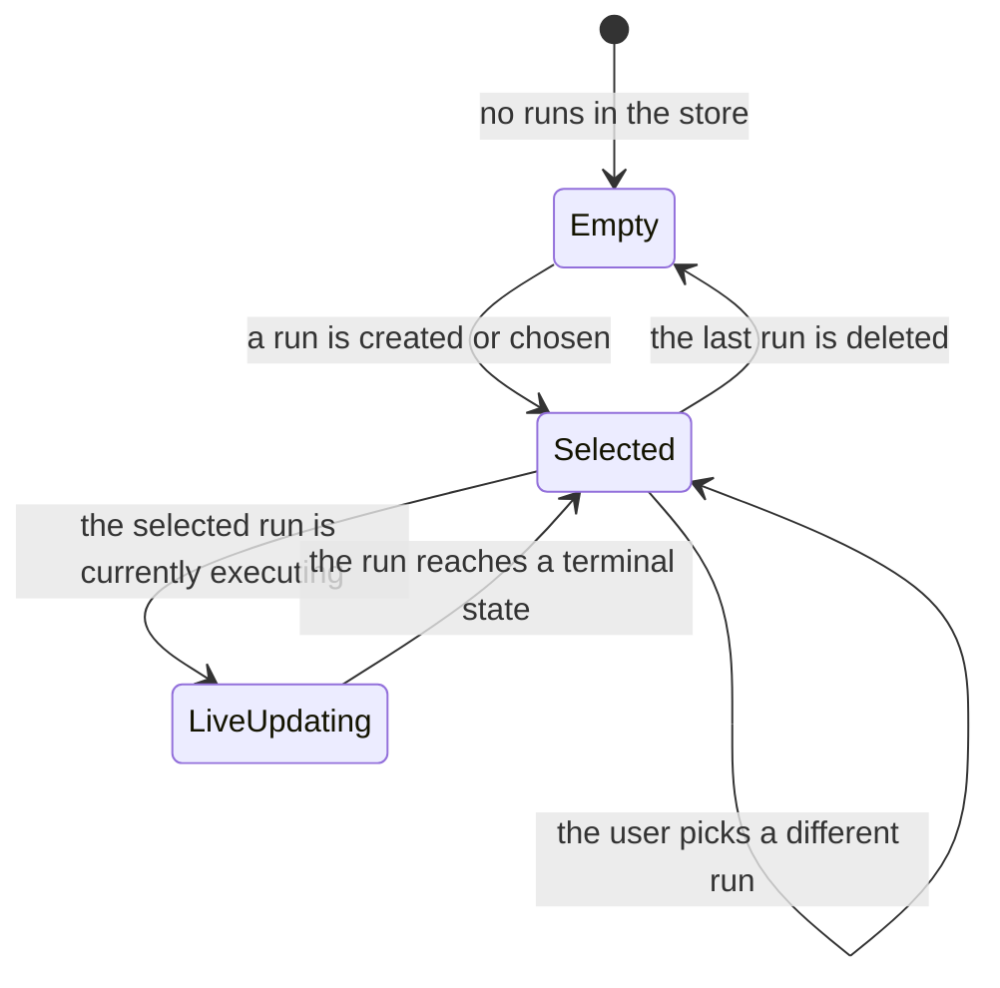
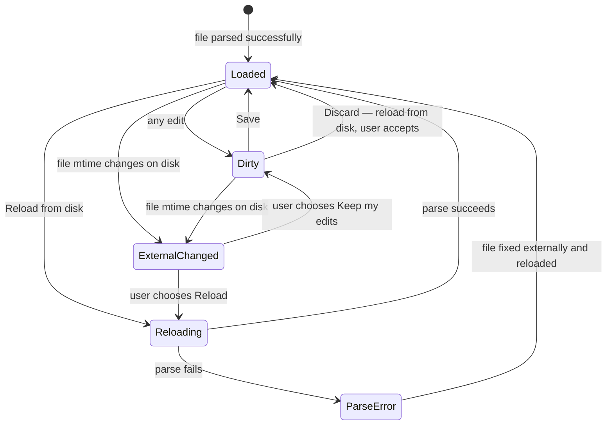
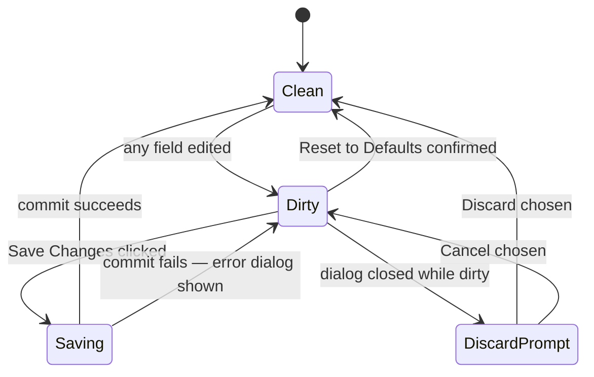
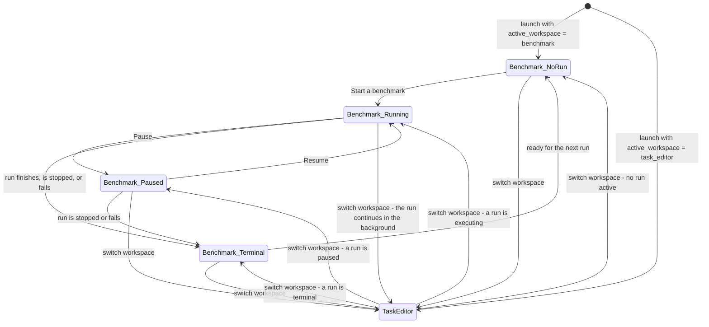

# 08-H — Application Modes and State Matrix

**Status:** Draft
**Owner:** architect
**Audience:** coder, tester, architect
**Last Updated:** 2026-06-06
**Cross-references:** `08_Cross_Cutting/08-G_feature_flags.md`, `08_Cross_Cutting/08-C_settings_hierarchy.md`, `10_Domain_and_Data/02_DTOS_AND_ENUMS.md`

This document enumerates every distinct mode the application can be in — every high-level state the user occupies — and states which functions are available in each. It is the reference for the question "what can the user do right now?". Read it together with `08-G_feature_flags.md`, which defines every setting that gates a behaviour described here.

---

## Table of Contents

1. Workspace mode
2. Run-state function matrix
3. Run modes (a property of a run)
4. Result widget — selection state
5. Task Editor — buffer state
6. Settings dialog — open / closed state
7. Settings dialog — dirty state
8. Provider — per-row state
9. Embedding — readiness state
10. Composite blocked-states summary
11. Mode-transition diagram

---

## 1. Workspace mode

The top-level mode is which **workspace** is active. The two workspaces are mutually exclusive; exactly one is active at any time. The active workspace is driven by `ui.active_workspace` and restored on launch.

| Workspace | Central content | Status-bar role |
|---|---|---|
| **Benchmark** | A three-panel splitter — New / Resume on the left, Progress in the centre, Result on the right | Provider readiness dot and app version |
| **Task Editor** | A three-pane editor — Files, Tasks, Field editor | Editor counts and aggregate dirty state |

The workspace switcher is visible in both workspaces. Switching to the Task Editor is always permitted. Switching from the Task Editor to the Benchmark workspace while any open file has unsaved edits first raises a modal: `Save changes to N file(s)?` with `Save All`, `Discard All`, and `Cancel`. Switching never stops or disturbs a benchmark run — the pipeline runs on a background worker independent of the active workspace.

---

## 2. Run-state function matrix

The Benchmark workspace has a cross-cutting run state derived from `BenchmarkRun.status` together with the pipeline's in-memory execution state. `RunStatus` has four persisted members — `INCOMPLETE`, `COMPLETED`, `FAILED`, `STOPPED`; the transient `RUNNING` and `PAUSED` states are in-memory only, maintained by the pipeline while it executes (see `10_Domain_and_Data/02_DTOS_AND_ENUMS.md` §4.2). The table below combines them into the user-visible run states and states the function matrix.

| Run state | New Benchmark | Resume | Progress shows | Result reads from | Settings dialog | Workspace switch |
|---|:--:|:--:|---|---|:--:|:--:|
| **No run yet** | enabled | enabled (empty) | empty state | empty selector | enabled | allowed |
| **Initializing** | disabled | disabled | initialization banner | live — the current run | disabled | allowed |
| **Running — inference** | disabled | disabled | live counters and log | live — the current run | disabled | allowed |
| **Running — keyword / cosine / judge phase** (GRADED only) | disabled | disabled | grading-phase banner | live — the current run | disabled | allowed |
| **Paused** | disabled | enabled — Resume only | paused banner | live — the current run | disabled | allowed |
| **Completed** | enabled | enabled | terminal summary | persisted | enabled | allowed |
| **Stopped** | enabled | enabled | stopped summary | persisted | enabled | allowed |
| **Failed** | enabled | enabled | error summary | persisted | enabled | allowed |

A **non-terminal** run state is any of Initializing, Running, or Paused. A **terminal** run state is Completed, Stopped, or Failed, plus the No-run case. Disabled controls carry the tooltip `A benchmark is in progress.` Workspace switching is never blocked by run state.

---

## 3. Run modes (a property of a run)

A run's **run mode** is a property of the run, set at run start and immutable for the run's lifetime — it is not a global application state. The enum is `RunMode`, with exactly three members. They appear on the New Benchmark widget, and in this specification, in the fixed order **Synthetic Benchmark, then Task Benchmark, then Graded Benchmark**; `SYNTHETIC` is the default selection.

| Run mode | Enum member | New Benchmark shows | Evaluation phases | Run-level analysis |
|---|---|---|---|---|
| **Synthetic Benchmark** | `SYNTHETIC` | Input Sizes, Output Sizes, Repeats, Advanced options; a judge model only for the optional run analysis | None — timing and throughput only; no grading | Optional — controlled by the "Generate run analysis" toggle |
| **Task Benchmark** | `TASKS` | Task Files, Advanced options; a judge model only for the optional run analysis | None — timing and throughput only; no grading | Optional — controlled by the "Generate run analysis" toggle |
| **Graded Benchmark** | `GRADED` | Task Files, Advanced options; a judge model required if the per-task judge phase or the run-analysis toggle is on | Keyword, cosine, judge — each individually toggleable in Settings → Evaluation | **Optional — controlled by the "Generate run analysis" toggle; default ON in GRADED, OFF in SYNTHETIC and TASKS** |

**Run mode and the evaluation phases.** The three evaluation phases — keyword, cosine, judge — are each governed by an independent toggle (`eval.phase_keyword_enabled`, `eval.phase_cosine_enabled`, `eval.phase_judge_enabled`). **These toggles apply only in `GRADED`.** A Graded Benchmark run may run with the judge phase off, or with only one phase active. A force-judge flag (`eval.force_judge_on_prior_failure`) makes the judge phase run for a task even after an earlier enabled phase produced a `FAIL`; with the flag off, an earlier `FAIL` short-circuits the remaining phases. `TASKS` and `SYNTHETIC` never run any of the grading phases — these toggles and the force-judge flag are ignored in those two modes.

**Run mode and the run analysis.** The per-task judge phase and the run-level judge analysis are independent toggles. Disabling one does not disable the other. The run-level analysis is governed by `feature.judge_run_analysis_enabled` in every mode: visible everywhere, default OFF in `SYNTHETIC` and `TASKS`, default ON in `GRADED`. The user can turn it off in `GRADED` to skip the extra inference cost when they only care about per-task verdicts. A judge model must be configured when either the per-task judge phase is enabled (only possible in `GRADED`) or the run-analysis toggle is ON (any mode); when neither holds, no judge model is required.

`SYNTHETIC` and `TASKS` never grade — they measure timing and throughput only — and the difference between them is purely the prompt source (synthetic size-matrix prompts vs user task files). The judge produces a binary `PASS` / `FAIL` verdict and a reasoning comment but no numeric score; the cosine phase produces the **Cosine Score**, the application's only numeric quality metric. The verdict vocabulary is strictly binary — `PASS` or `FAIL`, with no `UNKNOWN` as a final result. Grading-related fields on `BenchmarkResult` (verdict, per-phase verdicts, `cosine_similarity`, `resolution_layer`, etc.) stay null on every `TASKS` and every `SYNTHETIC` result.

---

## 4. Result widget — selection state

The Result widget operates over one selected run at a time.

| State | Meaning |
|---|---|
| **Empty** | No runs exist; the run selector is empty and the tabs show their empty states. |
| **Selected** | A run is selected and its persisted results are displayed. |
| **LiveUpdating** | The selected run is the one currently executing; the tabs subscribe to pipeline events and repaint on a debounce. |

While in **LiveUpdating**, the run selector stays enabled — the user may switch to a past run for comparison. Doing so moves the widget to **Selected** on that past run; it does not stop the executing run, whose updates continue to accrue and are reflected when the user selects it again. The per-run table view state for the selected run (filters, column visibility, column order) is resolved per the rule in `08-G_feature_flags.md` §10 — defaults for a never-opened run, last-saved state for a previously-opened run.

---

## 5. Task Editor — buffer state

Each open file in the Task Editor has an independent buffer state.

| State | Meaning | Files-pane badge |
|---|---|---|
| **Loaded** | The buffer matches the file on disk and parses cleanly. | clean |
| **Dirty** | The buffer has unsaved edits. | modified |
| **Reloading** | The file is being re-read from disk. | busy |
| **ParseError** | The file on disk could not be parsed. | error |
| **ExternalChanged** | The file changed on disk while open; the user must choose. | conflict |

`Save` is enabled only when the active file has no hard validation errors. The aggregate dirty state across all open buffers drives the workspace-switch and quit prompts.

---

## 6. Settings dialog — open / closed state

The Settings dialog is **modal**. While it is open:

- The Main Window is dimmed and non-interactive behind it.
- A benchmark run, if one is somehow in progress, continues unaffected — but see the open restriction below, which makes this case unreachable.
- The dialog is parented to the Main Window, so it stays on top within whichever workspace is active.

**Open is blocked while a run is in any non-terminal state — Initializing, Running, or Paused.** The Settings menu action is disabled; the status-bar hint reads `Disabled during a run`. This restriction is what makes the per-run settings snapshot airtight: the user-saved settings layer cannot change while a run is executing (see `08-C_settings_hierarchy.md` §8). Settings can be opened only when the run state is terminal or there is no run.

---

## 7. Settings dialog — dirty state

A successful save commits every changed key to the user-saved settings layer. Because Settings cannot be open during a run (§6), a save never races a running pipeline; the next run created after the save captures the new values into its fresh snapshot.

---

## 8. Provider — per-row state

Each row in the Settings Providers table carries the outcome of its most recent test or readiness probe, the `ProviderTestStatus` enum.

| State | Enum member | Health dot | Actions enabled |
|---|---|---|---|
| **Untested** | `UNTESTED` | neutral | Test, Edit, Reset, Delete |
| **Testing** | `TESTING` | neutral with spinner | Test (acts as cancel) |
| **Ready** | `READY` | success | all |
| **Zero models** | `ZERO_MODELS` | warning | all, with a warning |
| **Unreachable** | `UNREACHABLE` | error | all, with a warning |
| **Missing env var** | `MISSING_ENV` | warning | all; the api-key field holds an env-var name whose variable is unset/empty — set the variable to resolve it |

A reachability test (`LLMClient.probe_health()`) sets the row's `last_probe_status`, and the Health column dot reflects the latest value. The independent end-to-end inference test (`LLMClient.test_inference()`) records its outcome in the distinct `last_inference_test_*` column set without affecting the Health column.

---

## 9. Embedding — readiness state

The embedding model is needed by the cosine phase. Its readiness is a derived state.

| State | When |
|---|---|
| **Ready** | An embedding provider is enabled and reachable and the embedding model resolves. |
| **Not configured** | No embedding selection exists (the `embedding.selected_*` keys are unset or do not resolve). |
| **Unreachable** | The embedding provider probe fails. |

A `GRADED` run requires the embedding state to be **Ready**, because that mode runs the cosine phase against the embedding model. When the embedding state is not Ready, the New Benchmark Start button is disabled for `GRADED` with the tooltip `Configure an embedding model in Settings - Providers.`

---

## 9a. Inference-activity gate — application-wide

Independent of any one widget's state, the application maintains a single in-memory **inference-activity gate** owned by `InferenceActivityStore` (`08_Cross_Cutting/08-E_interfaces_contracts.md`). At most one inference-using activity is in flight at any moment — one of `IDLE`, `BENCHMARK_RUN`, `JUDGE_ANALYSIS`, `PROVIDER_TEST`, `READINESS_PROBE` (see `10_Domain_and_Data/02_DTOS_AND_ENUMS.md`). Every control that triggers an inference subscribes to the gate's state through the `adapters/qt_inference_activity_bridge/` adapter and is disabled with a tooltip while a conflicting activity holds the gate. This applies whether or not a benchmark run is non-terminal — for example, a readiness probe blocks a Test Connection click for the duration of the probe, even when no run is active. The composite blocked-states summary below incorporates the gate.

## 10. Composite blocked-states summary

When the user attempts an action that is currently impossible, the following table is the contract for what they see. It consolidates every gating rule across the application.

| Operation | Pre-condition | When unmet, show |
|---|---|---|
| Start a benchmark | At least one test model selected | Disabled Start button; tooltip `Select at least one model.` |
| Start `TASKS` or `GRADED` | At least one task file loaded | Disabled Start button; tooltip `Add at least one task file.` |
| Start `GRADED` | Embedding state is Ready | Disabled Start button; tooltip `Configure an embedding model in Settings - Providers.` |
| Start a benchmark | `InferenceActivityStore.is_busy()` is `False` | Disabled Start button; tooltip `Another inference activity is in flight - please wait.` See the single-inference invariant in `08-A` §11. |
| Open the Settings dialog | No run in any non-terminal state, paused included | Disabled menu action with tooltip `Disabled - a benchmark is in progress.` |
| Run Provider Test connection | `InferenceActivityStore.is_busy()` is `False` (and no run non-terminal) | Disabled Test button; tooltip `Another inference activity is in flight - please wait.` See `06_Settings_Dialog/sub_dialogs/provider_edit.md` §8. |
| Generate or Regenerate the judge analysis | No run in any non-terminal state, AND the gate is either `IDLE` or held by `JUDGE_ANALYSIS` for the same run | Disabled button; tooltip `A benchmark run is in progress; analysis can be generated when it finishes.` or `Another inference activity is in flight; analysis can be generated when it finishes.` See `07_Common_Dialogs/generate_analysis_dialog.md`. |
| Save in the Task Editor | The active file has no hard validation errors | Disabled Save; toolbar status indicator shows error; clicking focuses the first error |
| Pause a run | Run is in a Running phase (inference always; keyword, cosine, or judge only in `GRADED`) | Disabled Pause button |
| Resume a run | Run is Paused, or is a terminal run with pending results | Disabled Resume button |
| Delete a run | The run is not currently executing | Delete hidden in the run context menu |
| Rename a run | The run is the active run, or no run is non-terminal | Rename allowed only on the Progress widget header for the active run; otherwise hidden or disabled |
| Resume a past run from the Resume panel | No run in any non-terminal state | Disabled |
| Export Summary, Details, Charts, or Run Analysis | No run in any non-terminal state | Export buttons disabled in all four Result tabs and in detached chart windows; tooltip `Disabled - a benchmark is in progress.` |
| Generate or Regenerate the judge analysis (also see row above) | No run non-terminal, the run has at least one completed result, and the inference-activity gate is `IDLE` or `JUDGE_ANALYSIS` for this run | Disabled Generate/Regenerate button with the matching tooltip |
| Use the "Generate run analysis" toggle | Always available | Visible in every mode; default OFF in `SYNTHETIC` and `TASKS`, default ON in `GRADED`; the user can override in either direction |
| Switch to the Benchmark workspace with dirty editor buffers | — | Modal: `Save changes to N file(s)?` — Save All / Discard All / Cancel |
| Quit while a run is non-terminal | — | Modal: `Stop the benchmark and quit?` |
| Quit while the editor has dirty buffers | — | Modal: `Save changes to N file(s)?` |

---

## 11. Mode-transition diagram

The diagram below composes the workspace mode and the Benchmark run state into the full picture. Every individual widget state machine is a refinement of one of these nodes.

The diagram is the canonical reference for how the application's modes compose. The `Benchmark_Running` node abstracts the Initializing and the four executing-phase states of §2; the `Benchmark_Terminal` node abstracts the Completed, Stopped, and Failed states. Switching into the Task Editor never changes the Benchmark run state — the run continues on its background worker — so the return transition lands in whatever run state the run has reached in the meantime.
