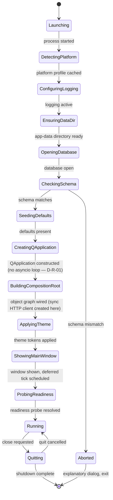
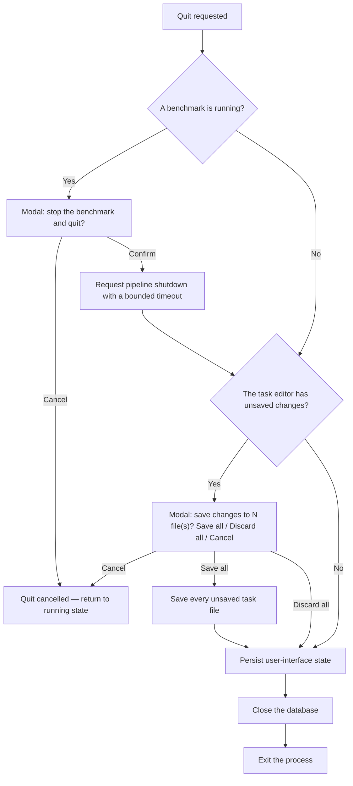

# Application Lifecycle

**Status:** Draft
**Owner:** architect
**Audience:** architect, coder, tester
**Last Updated:** 2026-06-06
**Cross-references:** 08_Cross_Cutting/08-A_architecture_principles.md, 08_Cross_Cutting/08-K_platform_specifics.md, 10_Domain_and_Data/02_DTOS_AND_ENUMS.md, 10_Domain_and_Data/03_PERSISTENCE_SCHEMA.md, 10_Domain_and_Data/07_FILE_LAYOUT.md, 11_Services_and_Algorithms/01_SERVICE_INVENTORY.md

This document fixes the lifecycle of the application from process launch, through its running state, to a clean quit. It defines the ordered launch sequence — platform detection, logging, the application data directory, the SQLite database with its strict schema check, default seeding, the composition root, the user interface, theme, the main window, and the deferred readiness probe — the quit sequence with its confirmation prompts, and the crash policy for both the user-interface thread and background workers. There are no data migrations (DD-53): an older same-major schema is brought forward by additive structural steps; a newer or cross-major schema is a hard startup error.

---

## Table of Contents

1. Lifecycle overview
2. Launch — order of operations
3. The schema check and the no-migration rule
4. Default seeding
5. The readiness probe
6. Running state
7. Quit sequence
8. Crash policy
9. Lifecycle edge cases

---

## 1. Lifecycle overview

The application has three lifecycle phases: launch, run, and quit. Launch is a fixed, ordered sequence; each step depends on the previous step having succeeded. The run phase is the normal interactive state. Quit is an ordered shutdown with confirmation prompts.

## 2. Launch — order of operations

Launch runs the steps below in order. Each step must succeed before the next begins. A failure in steps 1 through 5 aborts launch with an explanatory modal dialog.

1. **Parse command-line arguments.** Read the supported launch arguments — the logging-level override and the optional dataset-path override. Invalid arguments abort launch with a message on the standard error stream.

2. **Detect the platform.** Run the platform detector (`08-K_platform_specifics.md`). Build the immutable platform profile and hold it for the rest of launch. Every later step that needs an OS-specific value reads it from this profile.

3. **Configure logging.** Initialise the two logging streams — the application log and the run log — with their file locations taken from the platform profile's application data root. Logging is active from this point; every later step logs its progress. The full logging layout is fixed in `10_Domain_and_Data/07_FILE_LAYOUT.md`.

4. **Ensure the application data directory.** Resolve `<app-data>` from the platform profile and create it and its subtree if absent (`08-K_platform_specifics.md` section 3, `10_Domain_and_Data/07_FILE_LAYOUT.md`). Creation is recursive and idempotent. A permission failure aborts launch with a modal dialog naming the path and the required permission.

5. **Open the SQLite database and check the schema.** Open or create the SQLite database under `<app-data>`, applying the database pragmas fixed in `10_Domain_and_Data/03_PERSISTENCE_SCHEMA.md`. When the database is newly created, create the full schema and write the schema marker. When the database already exists, run the schema check of section 3. A schema mismatch aborts launch.

6. **Seed defaults.** Seed the default application settings into the settings table when it is empty, and seed the bundled default providers when the provider catalog is empty. The seeding rules are in section 4.

7. **Create the QApplication.** Construct the single `QApplication` instance (in `__main__.py`, before any widget or adapter that needs a live Qt application). This only constructs the application object; the Qt event loop is **entered** later, at step 11 (`app.exec()`). There is **no asyncio / qasync event loop to install** (D-R-01) — the backend is synchronous on a `TaskRunner` (`QThreadPool`), so this step creates the Qt application object and nothing more.

8. **Build the composition root (the object graph).** Wire the object graph by hand in the single composition root (`08-A_architecture_principles.md` section 8). The composition root constructs, at minimum: the event bus, the data store, the settings service, the provider registry, the readiness service, the benchmark pipeline, the task-file loader, the task-file validator, the YAML formatter, the adaptive-timeout service, the provider circuit breaker, the workspace controller, the notification service, the OS adapter, the `TaskRunner`, the clock, and **the synchronous HTTP client** used by the provider adapters (a plain blocking client — no async client, no event loop). Construction is synchronous and performs no network call.

9. **Apply the theme.** Resolve the effective theme from the theme setting — light, dark, or `system` — and apply the design-token objects (`08-K_platform_specifics.md` section 8). When the setting is `system`, subscribe to the host colour-scheme change signal.

10. **Construct and show the main window.** Build the main window and show it. The window's show handler schedules a single deferred tick that triggers the readiness probe (section 5). The workspace controller reads the persisted active workspace and installs the matching workspace content; the alternate workspace is constructed lazily on its first activation.

11. **Enter the Qt event loop.** Call `app.exec()` on the `QApplication` created in step 7. The application enters its running state and waits for user input and for the readiness probe to resolve. This is the **only** event loop — the Qt loop; there is no asyncio loop (D-R-01). The full launch order is therefore: QApplication (7) → object graph incl. the synchronous HTTP client (8) → theme + main window mounted (9–10) → run the Qt loop (11).

## 3. The schema check and the no-migration rule

The application performs **no data migrations or conversions** (DD-53). Within a major lineage an older database is brought forward at startup by purely structural additive steps (existing rows never touched); a newer-than-app or cross-major schema is a hard startup error.

On launch, when the database already exists, the application reads the persisted schema marker and compares it to the schema version the running application expects:

- **Match** — launch continues to default seeding.
- **Mismatch** — launch aborts immediately with a hard startup error. The application shows an explanatory modal dialog stating that the database schema does not match the application version, naming the database file path, and instructing the user to remove or relocate the database file so a fresh one can be created. The application then exits. The database is never altered, never auto-upgraded, and never downgraded.

A newly created database is written at the current schema version and passes the check trivially.

## 4. Default seeding

After the schema check passes, the application seeds defaults so a first launch produces a usable, internally consistent state.

- **Application settings.** When the settings table is empty, every setting is written with its specified default value. When the table already holds values, seeding is skipped. Individual missing settings are not back-filled; the table is either empty and fully seeded, or non-empty and left untouched.
- **Providers.** When the provider catalog is empty, the bundled default providers are written. When the catalog already holds providers, seeding is skipped.

Seeding is idempotent and runs only against an empty target. It performs no network call.

## 5. The readiness probe

The main window's show handler schedules one **deferred tick**. When that tick fires, the readiness service runs the startup readiness probe. The probe is the application's startup self-check.

The probe runs on a **background worker** and reports its result over the event bus; it never blocks the user interface thread. While it runs, the user interface is fully navigable and the application status is `CHECKING`.

The probe performs a complete operability self-check:

- Validate the persisted application settings.
- Probe every enabled provider for reachability and for at least one available model.
- Verify that the configured embedding model resolves.

The probe resolves the application readiness into one of three states:

| State | Meaning | Effect on the user interface |
|---|---|---|
| `READY` | Every check passed. | Every run mode is fully available. |
| `DEGRADED` | Some checks passed and some failed. | The status bar shows the degraded state; modes whose prerequisites failed are gated. |
| `NOT_READY` | Every operability check failed. | The status bar shows the not-ready state; run start is gated. The user interface remains navigable. |

A problem that blocks the user is surfaced twice: in the status bar, and through an explanatory modal dialog that states what is wrong and how to correct it. The user must never reach an enabled run-start affordance for an environment that cannot run a benchmark. The probe re-runs on demand from the user interface and after a settings change that affects providers or the embedding model.

## 6. Running state

In the running state the application processes user input on the user interface thread and runs background work — readiness probes and benchmark execution — on background workers.

- A benchmark run has the persisted statuses `INCOMPLETE`, `COMPLETED`, `FAILED`, and `STOPPED` (see `10_Domain_and_Data/02_DTOS_AND_ENUMS.md`). The finer states `RUNNING` and `PAUSED` are derived in memory by the benchmark pipeline and are never persisted.
- A benchmark runs in one of three modes — `SYNTHETIC`, `TASKS`, or `GRADED`. A graded result carries a binary verdict, `PASS` or `FAIL`.
- The benchmark pipeline reports progress to the user interface over the event bus; the adapter layer marshals every notification onto the user interface thread (`08-A_architecture_principles.md` section 7).

## 7. Quit sequence

A quit is requested by closing the main window through the window's close (X) control. The quit sequence runs in order and may be cancelled by the user.

1. **Quit requested** — by the user clicking the window close (X) button.
2. **Running-benchmark confirmation.** When a benchmark is running, show a modal dialog asking whether to stop the benchmark and quit. Cancel aborts the quit and returns the application to its running state. Confirm requests a pipeline shutdown with a bounded timeout; the affected run is left at the persisted status its pipeline records (`STOPPED` for a user stop).
3. **Unsaved-changes confirmation.** When the task editor holds one or more unsaved buffers, show a modal dialog offering "Save all", "Discard all", and "Cancel". Cancel aborts the quit. "Save all" writes every unsaved task file. "Discard all" proceeds without saving. When both confirmations apply, they are shown in sequence — the running-benchmark prompt first, then the unsaved-changes prompt.
4. **Persist user-interface state.** Through the settings service, persist the window geometry, the active workspace, the last task-editor folder, and the splitter sizes.
5. **Close the database.** Close the SQLite database cleanly so its write-ahead log is checkpointed.
6. **Exit the process.**

## 8. Crash policy

- **Uncaught exception on the user interface thread.** A top-level exception hook catches it, logs it to the application log, shows a blocking modal error dialog describing the failure, and then exits the application gracefully — the database is closed cleanly before exit.
- **Uncaught exception on a background worker.** The exception is caught and logged to the application log. When the worker was executing a benchmark run, the pipeline marks the affected run `FAILED` (see `10_Domain_and_Data/02_DTOS_AND_ENUMS.md`); the application stays running and the user interface stays usable.
- **Orphan-run recovery on launch.** A run found persisted as `INCOMPLETE` at launch — the trace of a previous process that exited before the run reached a terminal status — is left as `INCOMPLETE` so the user can resume it. The application never silently discards an interrupted run.
- The application performs no automatic crash reporting and sends no telemetry. The application log and the run logs under `<app-data>` are the only crash evidence, and the user controls them.

## 9. Lifecycle edge cases

| ID | Concern | Handling |
|---|---|---|
| EC-M-1 | The application data directory cannot be created at launch (permission denied). | Launch aborts at step 4 with a modal dialog naming the path and the required permission; the process exits. |
| EC-M-2 | The persisted database schema does not match the application version. | Launch aborts at step 5 with the hard schema-mismatch dialog of section 3; the database is left untouched; the process exits. |
| EC-M-3 | The SQLite database file is present but unreadable or corrupt. | Launch aborts at step 5 with an explanatory modal dialog naming the database file; the file is never overwritten automatically. |
| EC-M-4 | A run is found persisted as `INCOMPLETE` at launch. | The run is left as `INCOMPLETE` and is offered for resume; it is never discarded (section 8). |
| EC-M-5 | The readiness probe fails completely. | Application readiness resolves to `NOT_READY`; run start is gated; the user interface stays navigable; the failure is surfaced in the status bar and through an explanatory modal dialog (section 5). |
| EC-M-6 | Quit is requested while a benchmark is running. | The running-benchmark confirmation of section 7 is shown; on confirm the pipeline is asked to shut down within a bounded timeout. |
| EC-M-7 | Quit is requested while the task editor has unsaved changes and a benchmark is running. | Both confirmations are shown in sequence — running-benchmark first, then unsaved-changes; a cancel at either step aborts the quit (section 7). |
| EC-M-8 | An uncaught exception reaches the user interface thread. | The top-level hook logs it, shows a blocking modal error dialog, closes the database, and exits gracefully (section 8). |
