# Task Editor — Flow Diagrams

**Status:** Draft
**Owner:** architect
**Audience:** coder, tester
**Last Updated:** 2026-05-22
**Cross-references:** `09_Task_Editor/description.md`, `09_Task_Editor/state_machine.md`, `09_Task_Editor/field_reference.md`, `11_Services_and_Algorithms/14_VALIDATION_CASCADE.md`, `11_Services_and_Algorithms/12_YAML_FORMATTER.md`, `08_Cross_Cutting/08-J_event_bus_catalog.md`

This document specifies the Task Editor's major user actions as Mermaid sequence and flow diagrams: entering and leaving the workspace, opening a file, creating a file, adding and duplicating tasks, the validation cascade, Save and Save All, drag-drop, external file changes, the cross-workspace open, and the effect of a running benchmark. Each diagram is the binding interaction contract for that action, including its error branches.

---

## Table of Contents

1. Enter and leave the workspace
2. Open a file
3. Create a new file
4. Add a task
5. Duplicate a task
6. Validation cascade
7. Save and Save All
8. Drag-drop a file or folder
9. External file changed on disk
10. Open in Task Editor from the Benchmark workspace
11. Saving a file in use by a running benchmark

---

## 1. Enter and leave the workspace

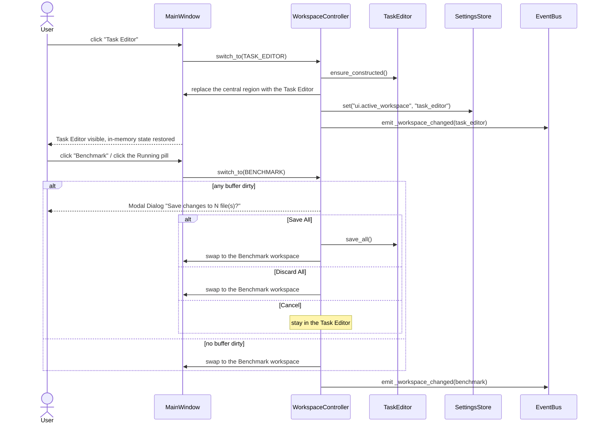

`Save All` writes only files free of hard errors. A dirty file with a hard error cannot be saved; the dialog reports it and the switch is held until the user resolves or discards.

## 2. Open a file

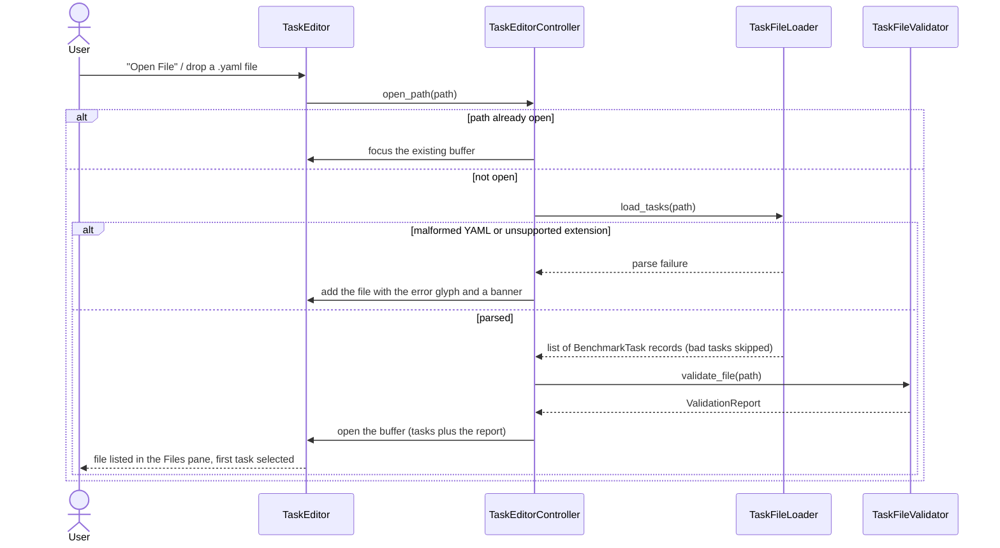

The editor runs two passes. The **Task File Loader** is loader-tolerant — the same parse the Benchmark Pipeline uses; tasks with missing required fields are skipped. The **Task File Validator** is editor-strict — it re-reads the raw YAML and emits per-row diagnostics, including "this task would be dropped by the loader", which is what powers the error badges.

## 3. Create a new file

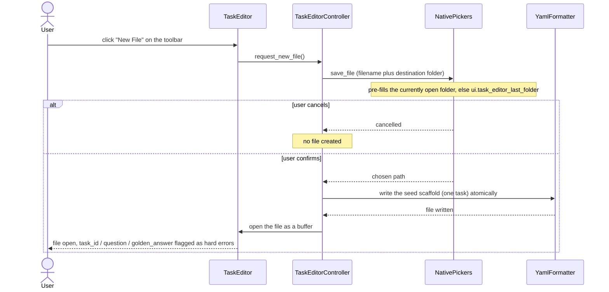

The file exists on disk the moment New File completes. There is never an untitled in-memory file; unsaved edits to an already-created file are tracked normally as dirty state.

## 4. Add a task

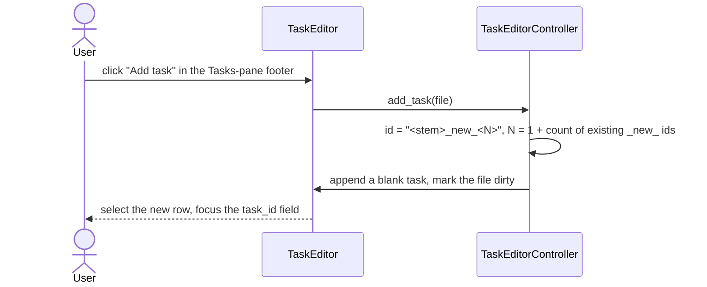

## 5. Duplicate a task

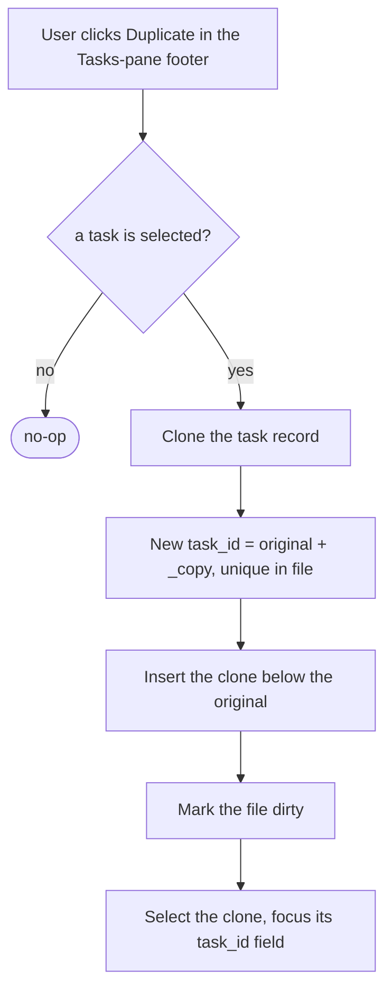

## 6. Validation cascade

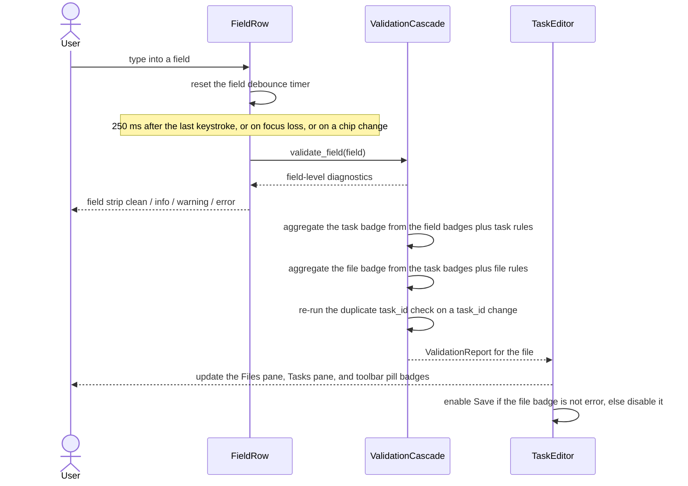

The cascade and its debounce timing, severity aggregation, and Save gating are specified in `11_Services_and_Algorithms/14_VALIDATION_CASCADE.md`.

## 7. Save and Save All

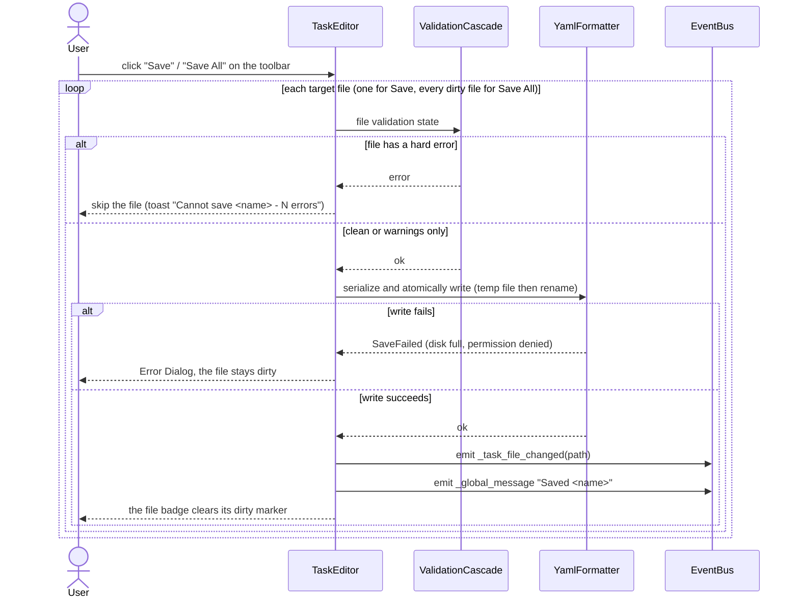

`_task_file_changed` lets the New Benchmark task-files panel recount tasks in the saved file and clear its stale dirty marker, and lets the Resume Benchmark widget refresh runs whose snapshot referenced that path.

## 8. Drag-drop a file or folder

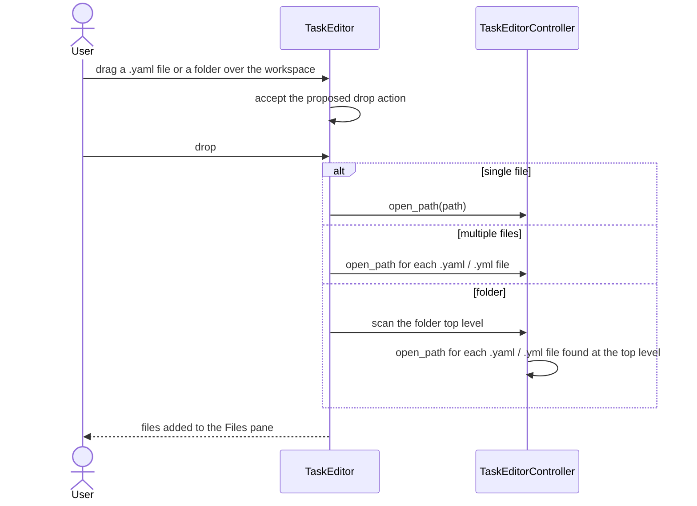

A dropped folder is equivalent to Open Folder — only the top-level task files are loaded, and the Files pane shows the "Showing top-level task files only" line. A dropped file already open focuses the existing buffer rather than opening a duplicate.

## 9. External file changed on disk

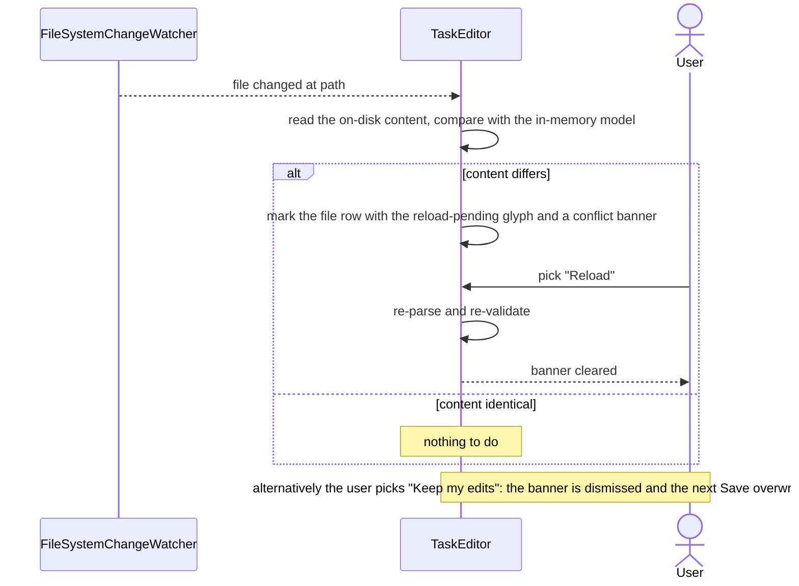

## 10. Open in Task Editor from the Benchmark workspace

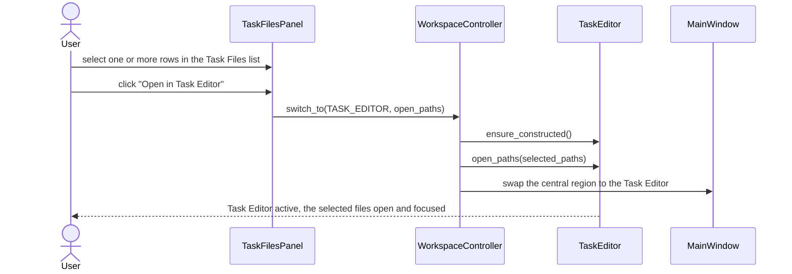

## 11. Saving a file in use by a running benchmark

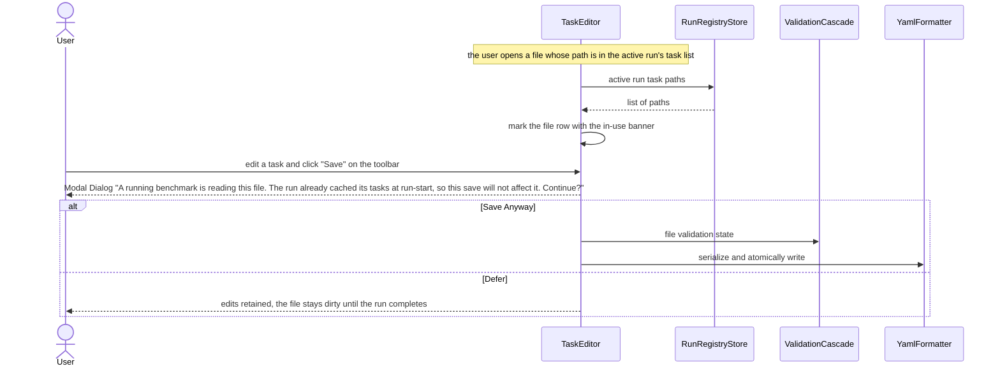

The Benchmark Pipeline reads task files once at run-start and caches the parsed list, so a mid-run save never affects tasks already scheduled. The dialog exists only to make that guarantee explicit to the user.
