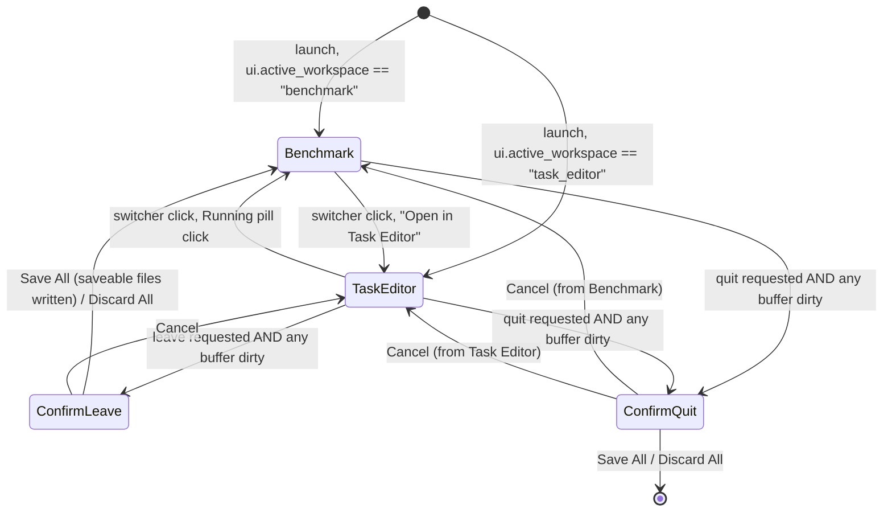
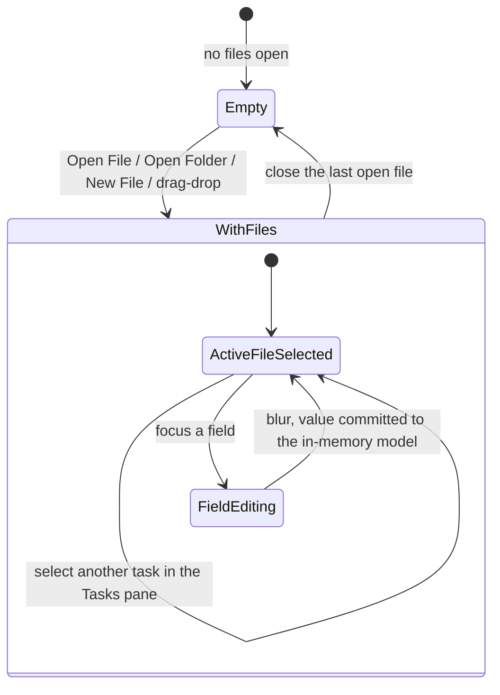
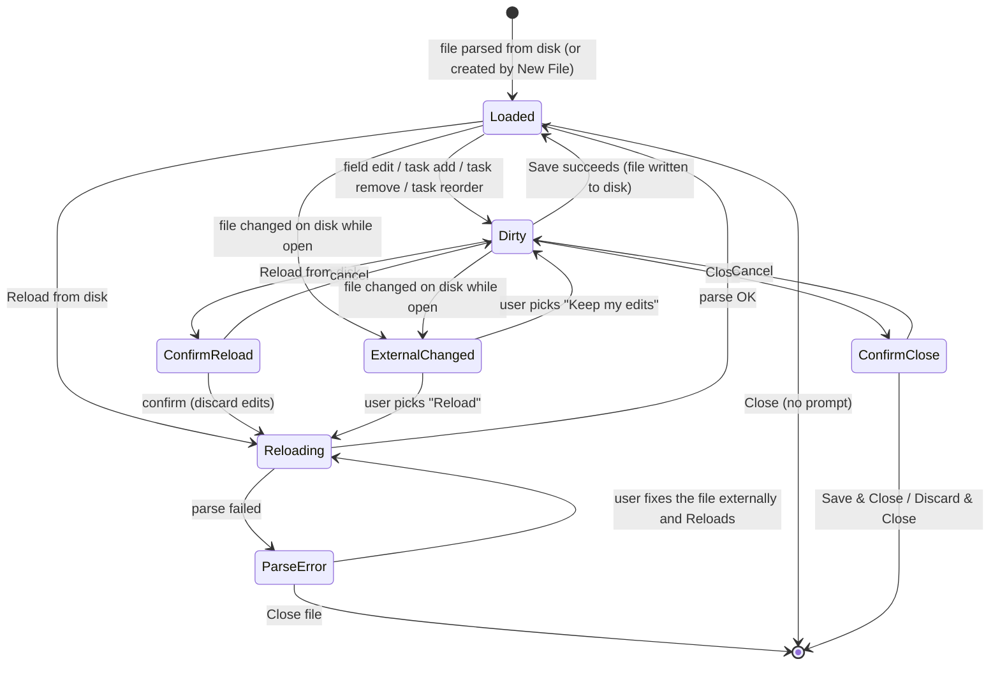
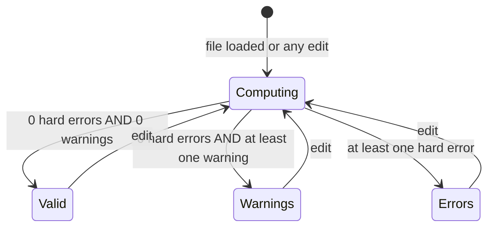
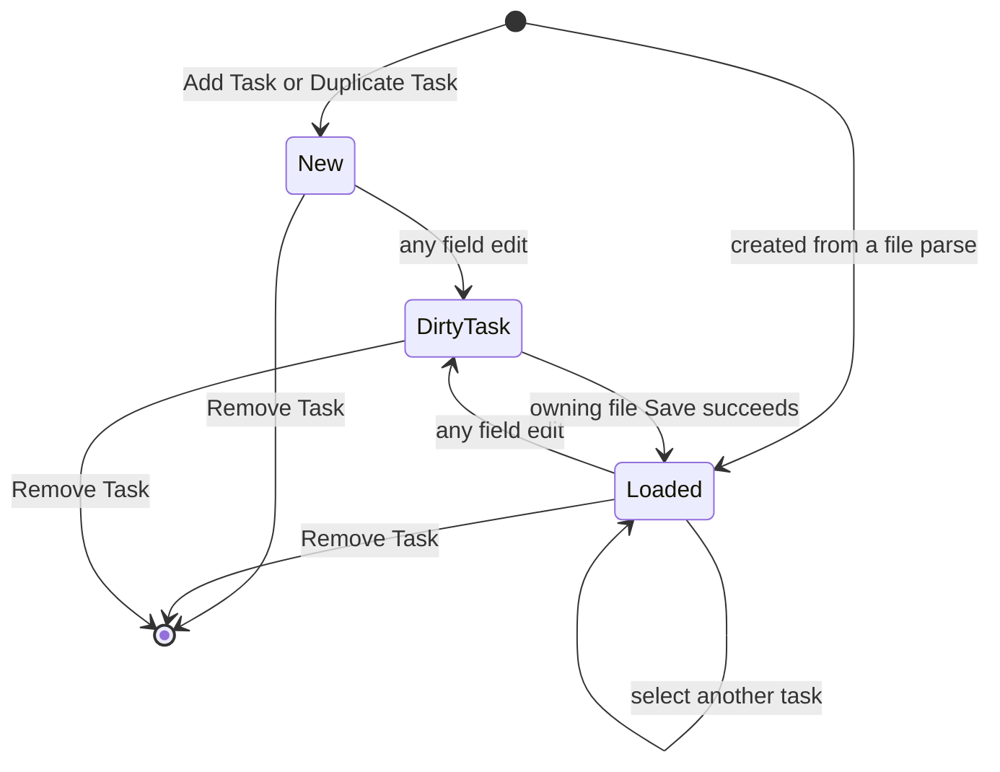
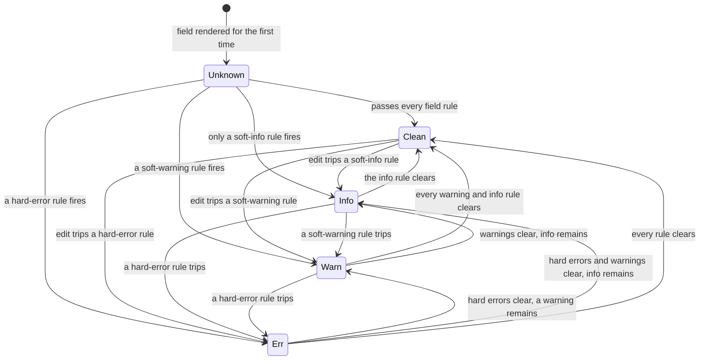
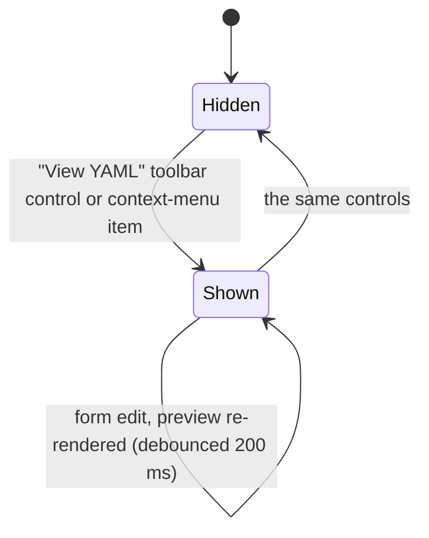
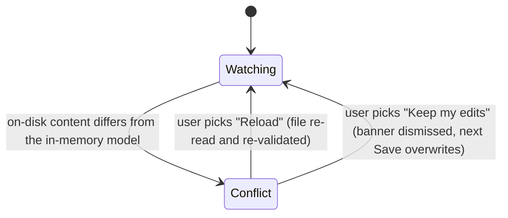

# Task Editor — State Machine

**Status:** Draft
**Owner:** architect
**Audience:** coder, tester
**Last Updated:** 2026-05-22
**Cross-references:** `09_Task_Editor/description.md`, `09_Task_Editor/flow_diagram.md`, `09_Task_Editor/field_reference.md`, `11_Services_and_Algorithms/14_VALIDATION_CASCADE.md`, `01_Main_Window/state_machine.md`

This document specifies the Task Editor's states and transitions as a set of Mermaid state diagrams: the workspace-level state shared with the Benchmark workspace, the editor-level state, the per-file lifecycle, the per-file and per-field validation states, the per-task state, the YAML-preview state, and the external-file-change watch. Each diagram is followed by the rules that govern its transitions. The diagrams are the binding reference for the order in which states may change and for which transitions trigger a confirmation dialog.

---

## Table of Contents

1. Workspace-level state
2. Editor-level state
3. Per-file state
4. Per-file validation state
5. Per-task state
6. Per-field validation state
7. YAML-preview state
8. External-file-change watch

---

## 1. Workspace-level state

The Main Window is in exactly one workspace at a time. The Task Editor's in-memory state is preserved across a switch — switching to the Benchmark workspace and back restores every open buffer, the active file, the selected task, and the preview-shown flag exactly as they were.

Transition rules:

- A leave or quit request with no dirty buffer proceeds directly, with no dialog.
- `Save All` in the confirmation saves only files free of hard errors. A dirty file that still has a hard error cannot be saved; the dialog reports it and the leave or quit is held until the user resolves it or discards.
- The active workspace is persisted to `ui.active_workspace` on every switch and restored on the next launch.
- A workspace switch emits `_workspace_changed` on the Event Bus.

## 2. Editor-level state

The editor is either empty or holding files.

Transition rules:

- `Empty` shows the centred drop target and the recent-files list; `WithFiles` shows the three-pane body (four panes when the YAML preview is shown).
- Opening any file, or creating one with New File, moves `Empty` to `WithFiles`. Closing the last buffer returns to `Empty`.
- Within `WithFiles`, exactly one file is active and exactly one of its tasks is selected.
- Focusing a field enters `FieldEditing`; blurring commits the edited value to the in-memory model and returns to `ActiveFileSelected`. Clicking the inline "Discard" glyph attached to the field while editing discards the in-flight edit and returns to `ActiveFileSelected` with the field's prior value.

## 3. Per-file state

Each open buffer has its own lifecycle state.

Transition rules:

- A file created by New File enters `Loaded` directly — the file exists on disk from the moment of creation; there is no untitled in-memory state.
- Any edit, task add, task remove, or task reorder moves `Loaded` to `Dirty`. A successful Save returns `Dirty` to `Loaded` and emits `_task_file_changed`.
- A failed Save (disk full, permission denied) leaves the file in `Dirty`; the on-disk file is unchanged.
- `Reload` of a clean file goes straight to `Reloading`; `Reload` of a dirty file routes through a confirmation.
- `ParseError` arises only when a reload encounters malformed YAML; the prior in-memory model is kept and the reload is aborted. The file shows the error glyph and a banner.

## 4. Per-file validation state

A file's validation state is recomputed on every edit by the validation cascade. It is independent of the lifecycle state of §3.

The Files pane row badge mirrors this state:

| Validation state | Badge | Save |
|---|---|---|
| `Valid` | Clean glyph | Allowed. |
| `Warnings` | Warning glyph | Allowed; the toolbar pill reports the warning count. |
| `Errors` | Error glyph | Disabled until every hard error is cleared. |

Soft-info findings do not change the file badge — a file with only soft-info notices stays `Valid`. The badge state machine and severity aggregation are specified in `11_Services_and_Algorithms/14_VALIDATION_CASCADE.md`.

## 5. Per-task state

Transition rules:

- A task created by Add Task or Duplicate Task enters `New`; once any field is edited it becomes `DirtyTask`.
- `DirtyTask` is a per-task signal that drives only the YAML-preview highlight. The file-level dirty flag — the flag that gates Save — is the union of every task edit plus every structural change (add, remove, reorder). A structural change marks the file dirty even when no task is in `DirtyTask`.
- A successful Save of the owning file returns every task to `Loaded`.

## 6. Per-field validation state

Each Field Row carries its own validation state, recomputed by the field-level pass of the validation cascade.

Transition rules:

- A field's state is the maximum severity of the rules that fired for it, on the ordering `Clean < Info < Warn < Err`.
- The field-level pass runs `task_editor.validation_debounce_ms` (default 250 ms) after the last keystroke, immediately on focus loss, and immediately on a chip add or remove.
- The validation strip colour follows the state: `Clean` neutral, `Info` blue, `Warn` amber, `Err` red.
- A field's state changes only when a field-level pass completes; it does not flash to a transient state while the debounce is pending.

## 7. YAML-preview state

Transition rules:

- The preview is read-only; it never accepts edits. While `Shown`, a form edit re-renders the preview after a 200 ms debounce.
- Showing the preview adds a fourth splitter pane on the right edge; hiding it returns to the three-pane layout.
- The preview-shown flag is in-memory state preserved across a workspace switch but not across an application restart.

## 8. External-file-change watch

The File-System Change Watcher tracks each open file. When a file changes on disk while open, the editor compares the on-disk content with the in-memory model.

Transition rules:

- The watcher only raises `Conflict` when the on-disk content actually differs; a touch that does not change content is ignored.
- In `Conflict`, the file's row carries the reload-pending glyph and a banner "This file changed on disk. [Reload] [Keep my edits]".
- `Reload` drives the per-file state through `Reloading` (§3). `Keep my edits` dismisses the banner; the file stays `Dirty` and the next Save overwrites the on-disk version.
