# Domain Model

**Status:** Draft
**Owner:** architect
**Audience:** arch, coder
**Last Updated:** 2026-06-06
**Cross-references:** `10_Domain_and_Data/02_DTOS_AND_ENUMS.md`, `10_Domain_and_Data/03_PERSISTENCE_SCHEMA.md`

This document defines the entity-relationship model for Ollama LLM Bench: every domain entity, how the entities relate, what each entity owns, where each entity is persisted, and which module is responsible for its lifecycle. It is the conceptual anchor for the data layer; the concrete record shapes are in `02_DTOS_AND_ENUMS.md` and the concrete SQLite tables in `03_PERSISTENCE_SCHEMA.md`.

---

## Table of Contents

1. Scope and modelling principles
2. Entity-relationship diagram
3. Entity catalog
4. Relationship rules
5. Persistence boundary
6. Lifecycle ownership
7. Run snapshot and immutability
8. Verdict, status, and score model
9. Crash-recovery model

---

## 1. Scope and modelling principles

The domain has two clearly separated concerns:

- **Catalog** — configuration that exists independently of any run: provider configurations, the embedding-model selection, user settings, and probed model capabilities. The catalog lives for the lifetime of the installation and is edited from the Settings dialog.
- **Run data** — the immutable record of each benchmark run: the run header, the frozen configuration snapshot (models, providers, settings), the frozen task definitions, and the per-task results. Run data is created when a run starts and is deleted only when the user deletes the run.

Six modelling principles govern the data layer:

1. **Fully relational, no opaque blobs.** Every multi-valued or structured field becomes its own child table with one row per element. A run's models, its provider snapshot, its settings snapshot, a task's required terms, a result's per-term keyword outcomes, and a result's inference attempts are all child tables. No table stores a JSON-encoded list or map. Every value is individually addressable, queryable, and type-checked.
2. **Composite model identity.** A benchmark target is always the pair `(provider_id, model_name)`. The same model name served by two different providers is two distinct targets. No table, aggregation, or chart ever collapses targets on `model_name` alone.
3. **Run snapshot immutability.** When a run starts, it freezes a complete copy of everything that affects its logic — tasks, provider configurations, model list, settings and feature flags. The running pipeline reads only the snapshot. The original task files and the live catalog may be changed or deleted afterwards without affecting the run.
4. **No data migration; additive structural steps only (DD-53).** The database carries a `schema_version` marker. An **older same-major** database is brought forward at startup by purely structural additive steps (ADD COLUMN nullable/default, CREATE TABLE/INDEX, new settings keys) that never touch existing rows; a **newer-than-app or cross-major** version is a hard, clearly reported startup error. There is **no data migration/conversion** — no UPDATE, backfill, or row rewriting — ever.
5. **Persisted state is durable; in-memory state is derived.** Only the four persisted run statuses (`INCOMPLETE`, `COMPLETED`, `FAILED`, `STOPPED`) and the persisted per-result statuses are written to the database. The transient `RUNNING` and `PAUSED` run states exist only in memory and are derived by the pipeline while it executes.
6. **ID strategy by transferability (SPEC-101).** An entity that must be **stable and transferable across machines, imports/exports, or renames** uses a **stable string id** generated by the application (a UUID4 textual representation — e.g. `provider_id`). An entity that is **purely local and never transferred** uses an **integer autoincrement rowid** (e.g. `run_id`, `result_id`). The rule: if an id could ever leave this database or must survive a display-name change, it is a generated string id; otherwise it is an int rowid. A future entity follows this same test.

---

## 2. Entity-relationship diagram

The diagram below shows every persisted entity, its columns, and every relationship. Column tags: `PK` primary key, `FK` foreign key. Types: `int`, `str`, `bool`, `real`, `ts` (ISO-8601 UTC text).

```mermaid
erDiagram
    app_meta ||--|| providers : "schema scope"
    providers ||--o{ provider_models     : "manual model list"
    providers ||--o{ model_capabilities  : "probed capabilities"

    benchmark_runs ||--|{ benchmark_run_models     : "models (test/judge/embedding)"
    benchmark_runs ||--|{ benchmark_run_providers  : "provider config snapshot"
    benchmark_runs ||--|{ benchmark_run_settings   : "settings + feature-flag snapshot"
    benchmark_runs ||--|{ benchmark_tasks          : "frozen task definitions"
    benchmark_runs ||--|{ benchmark_results        : "per (task,provider,model) records"
    benchmark_tasks ||--o{ benchmark_task_terms    : "required terms"
    benchmark_tasks ||--|{ benchmark_results       : "executed as"
    benchmark_results ||--o{ benchmark_result_terms    : "keyword-phase term outcomes"
    benchmark_results ||--o{ benchmark_result_attempts : "inference attempt history"

    app_meta {
        int id PK "always 1 (single row)"
        int schema_version "expected-version check at startup"
        ts  created_at "database creation time"
    }
    providers {
        str  provider_id PK "UUID4; INTERNAL, auto-generated by store on insert; never user-entered, never displayed"
        str  name UK "user-entered unique display label; UNIQUE constraint"
        str  provider_type "ProviderType enum"
        bool enabled
        str  base_url
        str  api_key_raw "env-var name (or empty)"
        str  azure_endpoint_raw "plain config value (endpoint URL)"
        str  azure_deployment_raw "plain config value (deployment name)"
        str  azure_api_version_raw "plain config value (api version)"
        str  last_probe_status "ProviderTestStatus enum (probe_health)"
        ts   last_probe_at
        bool last_probe_reachable
        int  last_probe_model_count "NULL = discovery unsupported or not attempted"
        str  last_probe_message
        ts   last_inference_test_at
        str  last_inference_test_outcome "InferenceTestOutcome enum (test_inference)"
        str  last_inference_test_model
        str  last_inference_test_message
        int  provider_order "display order"
    }
    provider_models {
        str provider_id PK,FK "-> providers.provider_id"
        str model_name PK "one manually-entered model"
        int model_order "display order"
    }
    app_settings {
        str setting_key PK
        str setting_value "value serialised to text"
        ts  updated_at
    }
    model_capabilities {
        str provider_id PK,FK "-> providers.provider_id"
        str model_name PK
        str capability PK "ModelCapability enum"
        int supported "1 yes | 0 no | -1 unknown"
        ts  last_observed_at
        str observed_via "CapabilitySource enum"
        str detail "optional note"
    }
    benchmark_runs {
        int run_id PK
        str run_name "user override; null -> generated name"
        ts  timestamp "creation time; basis of generated name"
        str run_mode "RunMode enum"
        str status "RunStatus enum (persisted subset)"
        int total_tasks "expected benchmark_results rows"
        int completed_tasks "rows that reached a terminal status"
        int total_elapsed_ms "cumulative execution time; survives stop/resume"
        str run_analysis "consolidated run-level analysis narrative"
        str judge_provider_id "FK->providers (logical); snapshot of judge provider id at run start; null when no judge"
        str judge_provider_name "snapshot of judge provider name at run start; historical fidelity across rename"
        str embedding_provider_name "snapshot of selected embedding provider name at run start; null when no embedding"
        str embedding_model_name "snapshot of selected embedding model at run start; historical fidelity"
        int schema_version "schema generation that wrote the run"
        ts  created_at
        ts  started_at "first inference"
        ts  finished_at "terminal status reached"
    }
    benchmark_run_models {
        int  run_id PK,FK "-> benchmark_runs.run_id"
        str  role PK "ModelRole enum"
        str  provider_id PK
        str  model_name PK
        str  model_family "parsed; e.g. qwen3"
        real model_params_b "parsed parameter count, billions"
        str  quantization "parsed; e.g. q4_K_M"
    }
    benchmark_run_providers {
        int run_id PK,FK "-> benchmark_runs.run_id"
        str provider_id PK "internal UUID4 id of the snapshotted provider"
        str name "snapshot of the provider's name at run start (historical fidelity across rename)"
        str provider_type "ProviderType enum"
        str base_url
        str api_key_raw "env-var name (or empty)"
        str azure_endpoint_raw "plain config value (endpoint URL)"
        str azure_deployment_raw "plain config value (deployment name)"
        str azure_api_version_raw "plain config value (api version)"
    }
    benchmark_run_settings {
        int run_id PK,FK "-> benchmark_runs.run_id"
        str setting_key PK "feature-flag / eval / timeout / pause key"
        str setting_value "frozen effective value"
    }
    benchmark_tasks {
        int run_id PK,FK "-> benchmark_runs.run_id"
        str task_id PK "unique within the run"
        str task_origin "TaskOrigin enum"
        str category
        str sub_category
        str difficulty "Difficulty enum"
        str question "prompt put to the model"
        str golden_answer "reference answer (null for synthetic)"
        str pass_criteria
        str fail_criteria
        str source_language
        str target_language
        str source_material
        str fail_example
        str input_size_label "synthetic only"
        str output_size_label "synthetic only"
        int repeat_index "synthetic only (1..repeats)"
        int task_order "stable display order within the run"
    }
    benchmark_task_terms {
        int run_id PK,FK "-> benchmark_tasks.run_id"
        str task_id PK,FK "-> benchmark_tasks.task_id"
        str term_kind PK "TaskTermKind enum"
        int term_order PK "order within the kind"
        str term_text "the required/forbidden term"
    }
    benchmark_results {
        int  result_id PK
        int  run_id FK "-> benchmark_runs.run_id"
        str  task_id FK "-> benchmark_tasks.task_id"
        str  provider_id "TEST model provider (internal UUID4)"
        str  provider_name "snapshot of provider name at task start (historical fidelity across rename)"
        str  model_name "TEST model"
        str  status "ResultStatus enum"
        str  verdict "Verdict enum (PASS|FAIL); null until COMPLETED"
        ts   created_at "row creation (phase 1)"
        ts   started_at "inference start (phase 2)"
        ts   finished_at "terminal status reached"
        str  system_prompt_sent
        str  user_prompt_sent
        str  raw_response "exactly as returned"
        str  sanitized_response "reasoning blocks stripped; graded text"
        bool has_thinking_block
        int  response_char_length
        int  total_time_ms
        int  ttft_ms "null if backend streaming unsupported"
        int  prompt_tokens
        int  completion_tokens
        real tokens_per_second
        bool sanity_check_passed "deterministic pre-check after phase 2"
        str  keyword_verdict "Verdict enum (phase 3); null if not run"
        real cosine_similarity "phase 4 measurement 0..1 — the Cosine Score"
        str  cosine_verdict "Verdict enum (phase 4); null if not run"
        str  judge_verdict "Verdict enum (phase 5); null if not run"
        str  judge_reasoning "judge one-sentence explanation"
        int  judge_time_ms
        int  judge_completion_tokens
        str  resolution_layer "ResolutionLayer enum"
        str  error_kind "ErrorKind enum"
        str  error_message
    }
    benchmark_result_terms {
        int  result_id PK,FK "-> benchmark_results.result_id"
        str  term_kind PK "ResultTermKind enum"
        int  term_order PK
        str  term_text
        real similarity_score "SEMANTIC only; null otherwise"
    }
    benchmark_result_attempts {
        int result_id PK,FK "-> benchmark_results.result_id"
        int attempt_index PK "1-based"
        int timeout_ms "adaptive timeout budget for this attempt"
        int duration_ms "actual time the attempt took"
        str outcome "AttemptOutcome enum"
        str error_kind "ErrorKind enum; null on success"
        str error_message
    }
```

The model has **fifteen tables** in total: six catalog tables and nine run-data tables.

---

## 3. Entity catalog

Each entity below names its storage, its lifecycle owner, the module that creates it, its mutability, and its relationships. Concrete field-by-field definitions are in `02_DTOS_AND_ENUMS.md`; concrete DDL is in `03_PERSISTENCE_SCHEMA.md`.

### 3.1 BenchmarkRun

**Storage:** SQLite table `benchmark_runs` (header only; the run's models, providers, settings, tasks, and results are child tables).
**Lifecycle owner:** the benchmark pipeline.
**Created by:** the run-creation use case when the user confirms Start in the New Benchmark widget (or when a run is cloned for retry).
**Mutability:** the header columns `status`, `completed_tasks`, `total_elapsed_ms`, `run_analysis`, `started_at`, and `finished_at` are updated after creation. `run_id`, `run_name` basis, `timestamp`, `run_mode`, `total_tasks`, `schema_version`, and `created_at` are frozen at creation; `run_name` may be changed by an explicit rename action.
**Relationships:** has-many `BenchmarkRunModel`, `BenchmarkRunProvider`, `BenchmarkRunSetting`, `BenchmarkTask`, `BenchmarkResult`. Deleting a run cascades to all child rows.

The run header holds only scalar run-level data. The persisted `status` is one of the four durable values `INCOMPLETE`, `COMPLETED`, `FAILED`, `STOPPED`. While the pipeline executes a run it derives the in-memory `RUNNING` and `PAUSED` states; those are never written to the database. `run_analysis` is a single consolidated narrative covering every run mode — there is no separate performance-analysis or judge-summary field. The header also carries the **judge provider name snapshot** (`judge_provider_name`) and the **embedding selection snapshot** (`embedding_provider_name`, `embedding_model_name`), each captured at run start (DD-33): historical UI surfaces render these snapshotted values, never re-look up the current name through `ProvidersStore` or the current embedding selection in `AppSettingsStore`, so renaming a Provider or changing the embedding selection after the run ends does not retroactively relabel the run.

### 3.2 BenchmarkRunModel

**Storage:** SQLite table `benchmark_run_models`.
**Lifecycle owner:** the run snapshot.
**Created by:** the run-creation use case.
**Mutability:** frozen at run creation.
**Relationships:** belongs-to one `BenchmarkRun`.

One row per model the run uses, discriminated by `role` (`TEST`, `JUDGE`, `EMBEDDING`). A run has one row per test model, one `JUDGE` row when the run grades, and one `EMBEDDING` row when the run runs a cosine check. The parsed `model_family`, `model_params_b`, and `quantization` are populated once at creation and drive family- and quantization-level comparison.

**Parser contract (D-R-11, MISS-14).** These three fields are derived by a best-effort parser over the `model_name` string and are **all nullable**. The parser applies simple, documented heuristics over the common local-model naming convention `family[:|-]<params>b[-quant]` (e.g. `qwen3:8b-q4_K_M` → family `qwen3`, params `8.0`, quant `q4_K_M`): `model_family` is the leading family token; `model_params_b` is a number immediately followed by `b`/`B` (billions); `quantization` is a recognised quant tag (`q2_K`…`q8_0`, `f16`, `bf16`, etc.). When a token cannot be parsed — which is the norm for cloud model names such as `gpt-4o-mini`, `claude-3-7-sonnet`, or `models/gemini-1.5-pro`, which carry no parseable parameter count or quantization — the corresponding field is left `NULL` (never guessed). Charts and aggregations that group by family or quantization simply omit models whose grouping key is `NULL` (surfacing them in an "unparsed" bucket where relevant), so an unparseable name degrades the family/quant views gracefully rather than producing garbage.

### 3.3 BenchmarkRunProvider

**Storage:** SQLite table `benchmark_run_providers`.
**Lifecycle owner:** the run snapshot.
**Created by:** the run-creation use case.
**Mutability:** frozen at run creation.
**Relationships:** belongs-to one `BenchmarkRun`.

A verbatim copy of every provider configuration the run references — the providers of its test models, its judge model, and its embedding model. The run connects through this snapshot; editing or deleting a provider in Settings after run creation never affects the run, its execution, or its resume. Each row carries the provider's `name` as it was at run start, so historical UI surfaces render the original name even after a later rename (DD-33).

### 3.4 BenchmarkRunSetting

**Storage:** SQLite table `benchmark_run_settings`.
**Lifecycle owner:** the run snapshot.
**Created by:** the run-creation use case.
**Mutability:** frozen at run creation.
**Relationships:** belongs-to one `BenchmarkRun`.

One row per per-run-overridable setting key. This is the run's immutable copy of every feature flag, evaluation toggle, cosine threshold, timeout parameter, and pipeline-event toggle in effect at Start, after the New Benchmark panel's per-run overrides are applied. Every settings read during the run consults these rows, never the live `app_settings` table. Display-only keys (for example the UI theme) are not snapshotted.

### 3.5 BenchmarkTask

**Storage:** SQLite table `benchmark_tasks` (header) plus child table `benchmark_task_terms` (required terms).
**Lifecycle owner:** the run snapshot.
**Created by:** the run-creation use case, which copies each task into the database at run creation.
**Mutability:** frozen at run creation.
**Relationships:** belongs-to one `BenchmarkRun`; has-many `BenchmarkTaskTerm`; is executed as one or more `BenchmarkResult` rows.

Every task used by a run is copied verbatim into the database at run creation. After this copy the original task files are never read again — the run is fully self-contained. A task carries `task_origin` (`FILE` for a task loaded from a YAML file, `SYNTHETIC` for a task generated for `SYNTHETIC` mode from the input/output size matrix). The `cosine_enabled` flag (DD-46) is the task-level cosine opt-out: cosine runs only when it is `true` and a `golden_answer` exists.

### 3.6 BenchmarkTaskTerm

**Storage:** SQLite table `benchmark_task_terms`.
**Lifecycle owner:** the run snapshot.
**Created by:** the run-creation use case.
**Mutability:** frozen at run creation.
**Relationships:** belongs-to one `BenchmarkTask`.

One row per keyword term declared by a task. The `term_kind` discriminator splits the task's `exact`, `semantic`, and `forbidden` term lists into addressable rows. A task with no required terms simply has no rows here.

### 3.7 BenchmarkResult

**Storage:** SQLite table `benchmark_results` (the scalar execution record) plus child tables `benchmark_result_terms` (keyword-phase per-term outcomes) and `benchmark_result_attempts` (inference attempt history).
**Lifecycle owner:** the benchmark pipeline.
**Created by:** the run-creation use case creates one `BenchmarkResult` row per `(task, provider, model)` combination, all in status `PENDING`. The pipeline then advances each row through the evaluation phases.
**Mutability:** the status, verdict, prompt/response, metrics, per-phase outcome, resolution, and error columns are written as the pipeline progresses. Identity and snapshot columns (`result_id`, `run_id`, `task_id`, `provider_id`, `provider_name`, `model_name`, `created_at`) are frozen at creation; the `provider_name` snapshot is set once when the result row is created and is never updated afterwards (DD-33).
**Relationships:** belongs-to one `BenchmarkRun`; references one `BenchmarkTask` by `(run_id, task_id)`; references one `BenchmarkRunModel` (role `TEST`) by `(run_id, provider_id, model_name)`; has-many `BenchmarkResultTerm` and `BenchmarkResultAttempt`.

The result is the core run-data entity. Its `status` is the per-task `ResultStatus` lifecycle value; its `verdict` is a separate binary `Verdict` field that is null while the result is pending and set to `PASS` or `FAIL` only when `status` reaches `COMPLETED`. The single numeric quality value is `cosine_similarity` (surfaced in the UI as the "Cosine Score"); a task with no cosine check has no score. The LLM judge produces no numeric score. The row carries both `provider_id` (the stable internal foreign-key value used for linkage and aggregation) and `provider_name` (the snapshot of the provider's display name at task start). Historical UI surfaces (Result widget, exports, run-log file) render the snapshot `provider_name`; only the data layer and live Event Bus events use `provider_id` (DD-33).

### 3.8 BenchmarkResultTerm

**Storage:** SQLite table `benchmark_result_terms`.
**Lifecycle owner:** the benchmark pipeline (keyword evaluation phase).
**Created by:** the keyword evaluation phase.
**Mutability:** cleared and rewritten when a result is retried.
**Relationships:** belongs-to one `BenchmarkResult`.

The per-term result of the keyword phase for one task execution: which required exact terms were missing, which forbidden terms appeared, and the embedding similarity of each semantic term. Populated only when the keyword phase runs and the task declared terms.

### 3.9 BenchmarkResultAttempt

**Storage:** SQLite table `benchmark_result_attempts`.
**Lifecycle owner:** the benchmark pipeline (inference phase).
**Created by:** the inference phase appends one row per inference attempt.
**Mutability:** cleared and rewritten when a result is retried.
**Relationships:** belongs-to one `BenchmarkResult`.

One row per inference attempt for a result, recording the adaptive-timeout budget used and the outcome. The number of these rows is the result's retry count; reading them in order reconstructs the adaptive-timeout escalation for the model.

### 3.10 ProviderConfig

**Storage:** SQLite table `providers` (the catalog) plus child table `provider_models` (manual model lists).
**Lifecycle owner:** the catalog / Settings dialog.
**Created by:** seeded with three built-in rows on first start; thereafter created and edited by the user from the Settings dialog.
**Mutability:** every column except `provider_id` is editable from the Settings dialog. The `last_test_*` columns are updated by a provider test or a readiness probe.
**Relationships:** has-many `provider_models` rows; logically referenced by `model_capabilities` and by the embedding selection in `app_settings` (by provider name). A run never writes to a `ProviderConfig`; it copies what it needs into `benchmark_run_providers`.

A configured LLM provider. The `provider_id` is the **internal primary key** — a UUID4 textual representation (for example `"a3b8c1d2-7f04-4b8e-9c1d-2e5f0a1b3c4d"`) generated by the `ProvidersStore` on insert. It is never entered by the user, never displayed in the UI, never carried by import/export files, and is stable across renames. The user-entered unique display label is `name`; the `providers` table enforces `UNIQUE (name)` and the `ProvidersStore.add` / `update` paths pre-check uniqueness via `get_by_name`. The Settings UI, every dropdown, every dialog, the event log, and every export render `name`; only the data layer and event payloads use `provider_id`. `api_key_raw` stores the **NAME of an environment variable** (for example `OPENAI_API_KEY`, or empty for a keyless local provider) — never a literal secret and never a resolved value; the named variable is read from the process environment at use time (D-R-18). The `azure_*_raw` columns store **plain literal configuration values** (endpoint URL, deployment name, api version) — these are not secrets and are stored as-is. The `provider_models` child rows are the models entered by hand for provider types with no model-discovery endpoint; providers that support discovery leave this empty. See DD-33 (`08_Cross_Cutting/08-F_spec_issues_log.md`).

### 3.11 Embedding selection (not an entity)

Per D-R-13 the embedding feature is **one selected `(provider, embedding model)`**, stored as settings, not a domain entity. There is no `EmbeddingConfig` entity, no `embedding_configs` table, and no `EmbeddingConfigStore`. Embeddings have no user-facing name.

**Storage:** two `app_settings` keys — `embedding.selected_provider_name` (the stable provider **name**) and `embedding.selected_model_name` (the embedding model string).
**Lifecycle owner:** the settings service (`AppSettingsStore`).
**Created by:** auto-selected on first start by probing enabled providers (the two keys are written when an embedding-capable model is found); thereafter changed by the user in the Settings dialog by picking from the dynamic per-provider embedding-model list.
**Mutability:** the user changes the selection at any time in Settings; it is global configuration (not per-run-overridable, `08_Cross_Cutting/08-C_settings_hierarchy.md` §4) and the resolved pair is frozen into each run's snapshot at run start.
**Relationships:** references one `ProviderConfig` by name (logical, validated at use time).

Used for the cosine check (phase 4) and for semantic keyword terms (phase 3). The per-provider embedding-model list is **dynamic** — discovered from the provider (including providers with a preconfigured list) — and is **not** persisted; only the last selection is stored. A start-up capability probe re-validates the selection still resolves. When no working selection exists, `GRADED` mode is disabled until the user picks one. See DD-33 (`08_Cross_Cutting/08-F_spec_issues_log.md`).

### 3.12 AppSetting

**Storage:** SQLite table `app_settings` (a key-value table).
**Lifecycle owner:** the settings service.
**Created by:** the table starts empty; one row is written per setting key the user has changed from its built-in default.
**Mutability:** rows are written on Save in Settings, on settings import, and on Reset to Defaults.
**Relationships:** none. This is the user-saved layer of the settings hierarchy (built-in default, then this table, then the per-run snapshot).

### 3.13 ModelCapability

**Storage:** SQLite table `model_capabilities`.
**Lifecycle owner:** the model-capability service.
**Created by:** a capability probe, or an inference that reveals a capability.
**Mutability:** a row's `supported`, `last_observed_at`, `observed_via`, and `detail` are updated each time the capability is re-observed.
**Relationships:** logically references one `ProviderConfig`.

A cache of capabilities discovered per `(provider, model)` so they need not be re-probed every run. Each row records one capability (`streaming`, `reasoning_effort`, `thinking`) as a tri-state value.

### 3.14 AppMeta

**Storage:** SQLite table `app_meta` (a single-row table).
**Lifecycle owner:** the persistence layer.
**Created by:** written once at database creation.
**Mutability:** frozen after creation.
**Relationships:** none. Holds the `schema_version` marker compared against the expected version at startup.

### 3.15 In-memory-only entities

The following entities are never persisted; they are rebuilt from live probes or derived state.

| Entity | Description |
|---|---|
| `ProviderHealth` | The result of a single provider reachability + conditional-discovery probe — `reachable`, `discovery_supported`, `model_count` (`None` when discovery skipped), `last_probe_ms`, `last_error`, `probed_at`. Rebuilt on every probe; never stored. |
| `InferenceTestResult` | The result of one user-initiated end-to-end inference test (`LLMClient.test_inference`) — `outcome` (`InferenceTestOutcome`), `provider_id`, `model_name`, optional `latency_ms`, redacted `response_excerpt`, redacted `last_error`, `tested_at`. Rebuilt on every test; never stored (a redacted summary is persisted on `ProviderConfig.last_inference_test_*`). |
| `AppReadinessSnapshot` | The aggregate readiness of the application — overall state plus a per-provider `ProviderHealth` map plus embedding reachability. Recomputed on demand. |
| `RunSettingsSnapshot` (in-memory view) | The in-memory map assembled from the `benchmark_run_settings` rows so the pipeline can read settings without per-key SQL. The durable form is the child table. |
| Derived run states `RUNNING` and `PAUSED` | The pipeline's in-flight state. Derived while the pipeline executes a run; never written to `benchmark_runs.status`. |

---

## 4. Relationship rules

- `benchmark_run_models`, `benchmark_run_providers`, `benchmark_run_settings`, `benchmark_tasks`, and `benchmark_results` each belong to exactly one `benchmark_runs` row. Deleting a run cascades to all of them.
- `benchmark_task_terms` belongs to one `benchmark_tasks` row; `benchmark_result_terms` and `benchmark_result_attempts` each belong to one `benchmark_results` row. All cascade with their parent.
- A `benchmark_results` row references its task by the composite `(run_id, task_id)` and its model by `(run_id, provider_id, model_name)` against the `benchmark_run_models` row whose `role` is `TEST`.
- `provider_models` and `model_capabilities` each belong to one `providers` row and cascade with it.
- Catalog tables (`app_meta`, `providers`, `provider_models`, `app_settings`, `model_capabilities`) are never deleted by a run and a run never writes to them. Their `provider_id` links into run-data tables are logical only: a provider may be deleted from the catalog while run history still names it, because the run keeps its own frozen copy in `benchmark_run_providers` (and its snapshot name fields on `benchmark_runs` and `benchmark_results`). The embedding selection lives in `app_settings` (by provider/model name) and is likewise only ever snapshotted into run history, never linked.
- Catalog-to-run-data relationships are intentionally not enforced by a foreign key, so catalog edits cannot break historical runs.

---

## 5. Persistence boundary

| Entity | Storage | Persistence kind |
|---|---|---|
| `AppMeta` | SQLite `app_meta` | Catalog (single row) |
| `ProviderConfig` | SQLite `providers` + `provider_models` | Catalog |
| Embedding selection | SQLite `app_settings` keys (`embedding.selected_provider_name`, `embedding.selected_model_name`) | Catalog (key-value) |
| `AppSetting` | SQLite `app_settings` | Catalog (key-value) |
| `ModelCapability` | SQLite `model_capabilities` | Catalog |
| `BenchmarkRun` | SQLite `benchmark_runs` | Run data |
| `BenchmarkRunModel` | SQLite `benchmark_run_models` | Run data (snapshot) |
| `BenchmarkRunProvider` | SQLite `benchmark_run_providers` | Run data (snapshot) |
| `BenchmarkRunSetting` | SQLite `benchmark_run_settings` | Run data (snapshot) |
| `BenchmarkTask` | SQLite `benchmark_tasks` + `benchmark_task_terms` | Run data (snapshot) |
| `BenchmarkResult` | SQLite `benchmark_results` + `benchmark_result_terms` + `benchmark_result_attempts` | Run data |
| Benchmark task source files | YAML files on disk | External input; copied into `benchmark_tasks` at run creation, then unnecessary |
| Provider config import/export files | YAML files on disk | External transfer format; the live store is `providers` |
| Settings import/export files | YAML files on disk | External transfer format; the live store is `app_settings` |
| `ProviderHealth` | None | In-memory only; rebuilt on every probe |
| `AppReadinessSnapshot` | None | In-memory only; recomputed on demand |
| Derived run states `RUNNING`, `PAUSED` | None | In-memory only; never persisted |

No domain entity is stored as a JSON blob. Every structured field is decomposed into child-table rows. The only persistence engine is a single SQLite database file in WAL mode in the application data folder; task files, provider config files, and settings files are external YAML used for transfer only.

---

## 6. Lifecycle ownership

| Entity | Created by | Updated by | Deleted by |
|---|---|---|---|
| `AppMeta` | Persistence layer at database creation | Never | Never (only with the whole database) |
| `ProviderConfig` | First-start seed; Settings dialog | Settings dialog; provider test; readiness probe (`last_test_*` only) | Settings dialog |
| Embedding selection | First-start auto-selection (the two `app_settings` keys); thereafter Settings dialog | Settings dialog | Reset to Defaults |
| `AppSetting` | Settings service on first user change | Settings service (Save, Import, Reset) | Reset to Defaults |
| `ModelCapability` | Capability probe | Capability probe; revealing inference | Cascades when its provider is deleted |
| `BenchmarkRun` | Run-creation use case | Benchmark pipeline (status, counters, analysis, timestamps); rename action (`run_name`) | Resume widget (the only delete surface) |
| `BenchmarkRunModel` | Run-creation use case | Never (frozen) | Cascades with its run |
| `BenchmarkRunProvider` | Run-creation use case | Never (frozen) | Cascades with its run |
| `BenchmarkRunSetting` | Run-creation use case | Never (frozen) | Cascades with its run |
| `BenchmarkTask` | Run-creation use case | Never (frozen) | Cascades with its run |
| `BenchmarkTaskTerm` | Run-creation use case | Never (frozen) | Cascades with its run |
| `BenchmarkResult` | Run-creation use case | Benchmark pipeline (every phase transition); Resume/Retry (reset to `PENDING`) | Cascades with its run |
| `BenchmarkResultTerm` | Keyword evaluation phase | Never (rewritten on retry) | Cascades with its result; cleared on retry |
| `BenchmarkResultAttempt` | Inference phase | Never (rewritten on retry) | Cascades with its result; cleared on retry |

---

## 7. Run snapshot and immutability

When the user confirms Start, the run-creation use case freezes a complete, self-contained copy of everything the run's logic depends on:

1. **Every task** is copied verbatim into `benchmark_tasks` and its keyword lists into `benchmark_task_terms`. After this copy the source YAML files are never read again and may be deleted.
2. **Every provider configuration** the run references is copied into `benchmark_run_providers`; each row carries the provider's `name` as it was at run start.
3. **Every model** under test, plus the judge model and the embedding model, is copied into `benchmark_run_models` with the appropriate `role`.
4. **Every per-run-overridable setting and feature flag**, after the New Benchmark panel's overrides are applied, is copied into `benchmark_run_settings`.
5. **The judge provider's name** is copied into `benchmark_runs.judge_provider_name` (with the matching `judge_provider_id` FK linkage value), and the **selected embedding provider and model names** are copied into `benchmark_runs.embedding_provider_name` and `benchmark_runs.embedding_model_name` (DD-33). The embedding snapshot is two plain name fields — there is no embedding catalog id to link to; all are display-fidelity snapshots.
6. **One `benchmark_results` row** is created per `(task, provider, model)` combination, all in status `PENDING`. When the pipeline subsequently stamps the per-task `provider_name` into each row at task start, it copies the current display name from the run's provider snapshot — not from the live catalog — so a rename during the run does not interleave new and old names.

Together, `benchmark_run_models`, `benchmark_run_providers`, `benchmark_run_settings`, and the snapshot name fields on `benchmark_runs` / `benchmark_results` form the run's complete configuration snapshot. For the remainder of the run — including any later resume — every configuration read consults this snapshot, never the live catalog. A change to Settings (including a Provider or embedding-configuration rename) therefore never alters an in-flight or past run; only a future run picks it up.

---

## 8. Verdict, status, and score model

The result entity separates three orthogonal concerns. Implementers must keep them distinct.

**Status** — the position of a result in the evaluation pipeline. `ResultStatus` has eleven members. The first five (`PENDING`, `RUNNING_INFERENCE`, `AWAITING_KEYWORD_CHECK`, `AWAITING_COSINE_CHECK`, `AWAITING_JUDGE_CHECK`) are pipeline-position states. The last six (`COMPLETED`, `FAILED_INFERENCE`, `FAILED_PROVIDER`, `FAILED_TIMEOUT`, `FAILED_JUDGE_TIMEOUT`, `ERRORED`) are terminal. The five terminal states other than `COMPLETED` are retryable. `FAILED_JUDGE_TIMEOUT` was added in DD-34 to mark a task whose Phase 4 (judge) call exhausted its role=JUDGE adaptive-timeout ladder, or whose judge phase was skipped because the judge model was excluded mid-run after consecutive max-budget timeouts.

**Verdict** — a separate, strictly binary field. `Verdict` has exactly two members, `PASS` and `FAIL`. There is no `UNKNOWN` verdict. The verdict is null while the result is pending and is set only when `status` reaches `COMPLETED`. A result that ends in any terminal-failure status has no verdict; its outcome is conveyed by `status`, `error_kind`, and `error_message`.

**Score** — the single numeric quality value is `cosine_similarity`, a real number in `0.0`–`1.0` surfaced in the UI as the "Cosine Score". It is set only by the cosine check (phase 4). A task that did not run a cosine check has no score. The LLM judge produces no numeric score.

**Verdict combination.** The final verdict is decided by the highest enabled grading phase, and the deciding phase is recorded in `resolution_layer`:

- If only the keyword phase is enabled, the keyword phase decides `PASS`/`FAIL`; `resolution_layer = KEYWORD`.
- If the cosine phase is also enabled and the keyword phase passed, the cosine threshold decides; `resolution_layer = COSINE`. If the keyword phase failed, the result is `FAIL` at the keyword layer.
- If the judge phase is also enabled, and no prior phase produced a `FAIL` (unless a force-judge flag is set, in which case the judge runs regardless), the judge decides; `resolution_layer = JUDGE`.
- If a run mode does not grade at all, no verdict is set and `resolution_layer = SKIP`.

The per-phase outcome columns `keyword_verdict`, `cosine_verdict`, and `judge_verdict` each record that phase's own binary outcome; `verdict` records the combined result; `resolution_layer` records which layer was decisive.

---

## 9. Crash-recovery model

The application performs no data migration or conversion (DD-53). An older same-major `app_meta.schema_version` is brought forward at startup by purely structural additive steps (existing rows never touched); a newer-than-app or cross-major version is a hard startup error, reported clearly.

Because the persisted run statuses are durable and the in-memory `RUNNING`/`PAUSED` states are never written, crash recovery operates entirely at the persisted level:

- **Run level.** A run that was executing when the application died was last persisted with `status = INCOMPLETE`. On the next startup it remains `INCOMPLETE`; there is no `RUNNING` row to sweep, because that state was only in memory. The user resumes the run from the Resume widget. The recovery sweep therefore does nothing to the run header — `INCOMPLETE` is already correct.
- **Result level.** Individual `benchmark_results` rows, however, can be left in a non-terminal in-flight status (`RUNNING_INFERENCE`, `AWAITING_KEYWORD_CHECK`, `AWAITING_COSINE_CHECK`, or `AWAITING_JUDGE_CHECK`) when the application died mid-task. On the next startup, or when the affected run is resumed, the recovery sweep resets every such row to `PENDING` and clears its in-flight error columns, its `benchmark_result_terms` rows, and its `benchmark_result_attempts` rows, so the task re-runs cleanly. Rows already in a terminal status are left untouched.

The concrete sweep query is defined in `03_PERSISTENCE_SCHEMA.md`.
