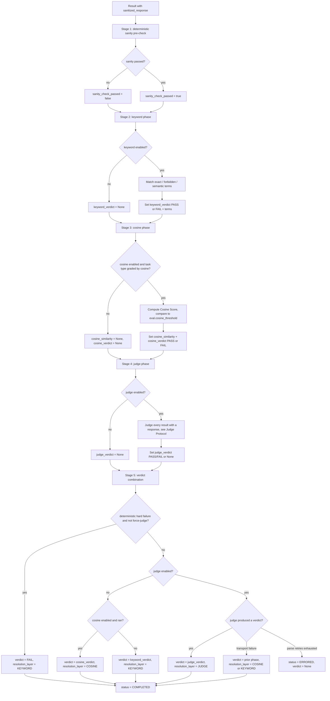

# Evaluation Pipeline

**Status:** Draft
**Owner:** coder
**Audience:** coder, tester
**Last Updated:** 2026-06-06
**Cross-references:** `08_Cross_Cutting/08-B_benchmark_state_machine.md`, `08_Cross_Cutting/08-E_interfaces_contracts.md`, `08_Cross_Cutting/08-P_judge_protocol.md`, `10_Domain_and_Data/02_DTOS_AND_ENUMS.md`, `11_Services_and_Algorithms/05_JUDGE_PROTOCOL.md`, `11_Services_and_Algorithms/06_EMBEDDING_SERVICE.md`

This document specifies the response-evaluation algorithm: the deterministic sanity pre-check applied to a model response, the three toggleable grading phases (keyword, cosine similarity, LLM judge), the conditions under which each phase runs, the short-circuit behaviour, and the rule that combines per-phase outcomes into one binary `PASS` / `FAIL` verdict. The pipeline produces exactly one binary verdict per graded result and records which evaluation layer decided it. There is no `UNKNOWN` final verdict; a result's verdict is null only while grading is still in progress.

---

## Table of Contents

1. Purpose
2. Inputs
3. Outputs
4. Preconditions
5. Postconditions
6. Algorithm
   - 6.9 Live inference-progress emission
7. Configuration
8. Error handling
9. Threading and concurrency
10. Examples
11. Test cases

---

## 1. Purpose

The evaluation pipeline turns a model's response to one task into a binary quality verdict. It is the grading half of a benchmark run; the inference half produces the response, this pipeline grades it.

Evaluation runs only in `RunMode.GRADED`. `RunMode.TASKS` and `RunMode.SYNTHETIC` never grade — Task Benchmark never grades, regardless of any toggle. For those two modes the pipeline is not invoked; every result is finalized with `verdict = None` and `resolution_layer = SKIP` (the explicit "not graded" marker, distinct from the `NULL` carried by a result still awaiting resolution). The other grading-only fields on `BenchmarkResult` (`keyword_verdict`, `cosine_verdict`, `judge_verdict`, `cosine_similarity`, `terms`) all stay null on every `TASKS` and every `SYNTHETIC` result.

The pipeline is built from one deterministic pre-check and three grading phases. Each grading phase is independently toggleable in Settings. The pipeline never invents a verdict: when a phase is disabled it contributes nothing, and the combination rule decides the final verdict only from the phases that actually ran.

Evaluation is **batched, not per-task**. Each phase processes the whole task set before the next phase begins, matching the staged benchmark execution model. A result carries each phase's individual outcome forward; the final-verdict combination runs once, after the last enabled grading phase completes for every result.

## 2. Inputs

The pipeline operates on, per result:

| Input | Source | Notes |
|---|---|---|
| `BenchmarkResult` | the run's result rows | Carries `sanitized_response`, `raw_response`, `status`. The graded text is always `sanitized_response`. |
| `BenchmarkTask` | the run's frozen task rows | Carries `category`, `sub_category`, `question`, `golden_answer`, `pass_criteria`, `fail_criteria`, `required_terms`, `cosine_enabled`. |
| Run mode | `BenchmarkRun.run_mode` | Decides whether grading runs at all. |
| Frozen run settings | `BenchmarkRun.settings_snapshot` | The phase toggles, thresholds, and force-judge flag; read from the snapshot, never from live `app_settings`. |
| Embedding service | injected port | Required by the cosine phase and by the keyword phase's semantic terms; see `06_EMBEDDING_SERVICE.md`. |
| Judge port | injected port | Required by the judge phase; see `05_JUDGE_PROTOCOL.md` and `08-P_judge_protocol.md`. |

A result with no response (a terminal-failure status — `FAILED_INFERENCE`, `FAILED_PROVIDER`, `FAILED_TIMEOUT`, `ERRORED`) is not an input to any grading phase; it never reached evaluation and keeps `verdict = None`.

## 3. Outputs

For every graded result the pipeline writes, through a `ResultPatch` (see `10_Domain_and_Data/02_DTOS_AND_ENUMS.md` §8.1), the following fields of `BenchmarkResult`:

| Field | Written by | Value |
|---|---|---|
| `sanity_check_passed` | sanity pre-check | `True` / `False`. |
| `keyword_verdict` | keyword phase | `PASS` / `FAIL`; `None` if the keyword phase did not run. |
| `terms` | keyword phase | The per-term `BenchmarkResultTerm` rows (missing exact, found forbidden, semantic with similarity). |
| `cosine_similarity` | cosine phase | The Cosine Score (`0.0`–`1.0`); `None` if no cosine check ran. The only numeric quality value. |
| `cosine_verdict` | cosine phase | `PASS` / `FAIL`; `None` if the cosine phase did not run or was skipped for the task type. |
| `judge_verdict` | judge phase | `PASS` / `FAIL`; `None` if the judge phase did not run or produced no verdict. |
| `judge_reasoning`, `judge_time_ms`, `judge_completion_tokens` | judge phase | See `08-P_judge_protocol.md` §10. |
| `verdict` | combination step | The combined binary `PASS` / `FAIL`. Always one of the two on a `COMPLETED` result. |
| `resolution_layer` | combination step | `KEYWORD`, `COSINE`, or `JUDGE` — the layer that decided `verdict`. |
| `status` | combination step | `COMPLETED` on a resolved result; `ERRORED` only on an exhausted-judge-parse failure (see §8). |

The inference phase (Phase 2) additionally writes the timing and throughput fields — `total_time_ms`, `ttft_ms`, `prompt_tokens`, `completion_tokens`, `tokens_per_second`, and `tokens_estimated` — in **every** mode that produces a completed inference. Throughput is computed per `11_Services_and_Algorithms/02_LLM_CLIENT_PROTOCOL.md` §6.5: from the provider's `completion_tokens` when present (`tokens_estimated = False`), or from a `ceil(len(raw_response) / 4)` character estimate when the provider reported no usage (`tokens_estimated = True`, `completion_tokens` left `None`). `tokens_per_second` is therefore never silently `None` for a completed inference in a throughput mode (SPEC-047).

The combined `verdict` is **binary**: exactly `PASS` or `FAIL` on every `COMPLETED` result. No phase produces an `UNKNOWN` verdict; the `Verdict` enum has no such member.

## 4. Preconditions

- The run grades — that is, `RunMode.GRADED`. The pipeline is not invoked for `TASKS` or `SYNTHETIC`; those modes never grade.
- The result has a non-`None` `sanitized_response` (inference completed; the result reached `AWAITING_KEYWORD_CHECK`).
- **Embedding fail-fast probe (DD-48).** If the run needs embeddings — the cosine phase is
  enabled with at least one cosine-graded task (`cosine_enabled = true` and a
  `golden_answer` — DD-46), or the keyword phase is enabled and any task declares semantic
  terms — the pipeline issues **one `embed("probe")` call against the run's embedding
  `(provider, model)` pair before any inference begins**, under the already-held
  `BENCHMARK_RUN` gate (user-initiated via Start/Resume, so the cost-safety invariant
  holds). On success the run proceeds. On failure the run **fails fast**: it settles
  `FAILED` before Phase 2 starts, with an error naming the embedding pair and carrying the
  provider's redacted detail ("embedding endpoint cannot embed"), so the user does not
  wait through the whole inference phase to discover a broken embedding endpoint at the
  cosine stage. A `FAILED` run remains resumable; resume repeats the probe.
- If the cosine phase is enabled and any task declares semantic terms or is cosine-graded (`cosine_enabled = true` with a `golden_answer` — DD-46), an embedding model is configured for the run.
- If the judge phase is enabled, a `JUDGE`-role model is configured for the run.
- The phase toggles, thresholds, and force-judge flag are present in the frozen settings snapshot.

## 5. Postconditions

- Every graded result has `sanity_check_passed` set, plus a non-`None` value for each `*_verdict` field whose phase was enabled and ran.
- Every graded result has a binary `verdict` and a non-`None` `resolution_layer` (`KEYWORD`, `COSINE`, or `JUDGE`).
- Each phase's individual outcome (`keyword_verdict`, `cosine_verdict`, `judge_verdict`) is preserved on the result regardless of which layer decided the combined `verdict`, so the Result widget's detail panel can show the full per-phase breakdown.
- A result whose judge call could not be parsed after the retry limit ends `ERRORED` with `verdict = None` (see §8); it is retryable.
- No result that reached evaluation ends with `verdict = None` and `status = COMPLETED`.

## 6. Algorithm

### 6.0 Provider and embedding-configuration name snapshot (DD-33)

Before the first stage runs, the run-creation use case (in cooperation with the `RunSnapshotBuilder`) captures the **display-fidelity name snapshots** that the historical UI will render after the run completes:

1. **Run header.** When the run has a judge, the pipeline reads the live `ProviderConfig` of the judge provider and stamps both `BenchmarkRun.judge_provider_id` and `BenchmarkRun.judge_provider_name` (the provider's current `name` at run start). When the run has an embedding configuration (any run that runs the cosine phase or uses semantic keyword terms), the pipeline resolves the live embedding selection and stamps `BenchmarkRun.embedding_provider_name` and `BenchmarkRun.embedding_model_name`.

2. **Per-task results.** For each `BenchmarkResult` row, when the row is created (in phase 1 of the existing `08_Cross_Cutting/08-B_benchmark_state_machine.md` pipeline) the pipeline stamps the row's `provider_name` from the run's already-frozen `benchmark_run_providers` snapshot — NOT from the live `ProvidersStore`. This guarantees that a rename mid-run (which is in practice prevented by the "Settings unreachable during a run" rule DD-03 but is captured as a defensive invariant here) does not interleave two names across the result rows of the same run. The `provider_name` snapshot is set exactly once per row and is never updated thereafter, even on a retry of that row.

3. **Rendering rule.** From this point on, every historical UI surface (the Resume widget run list, the Result widget Summary / Details / Charts / Run Analysis tabs, every export, the per-run log file) renders these SNAPSHOT names. The pipeline itself, the registry, and the live registry are never consulted for a provider's display name during result rendering of a completed run. Live surfaces (the Settings provider table, the in-flight Progress widget) continue to render the CURRENT registry name. See `11_Services_and_Algorithms/03_PROVIDER_REGISTRY.md` §1.1 for the binding live-vs-snapshot rule.

### 6.1 Stage ordering

The pipeline runs five stages in fixed order over the run's result set:

1. **Sanity pre-check** — deterministic, no model call. Sets `sanity_check_passed`.
2. **Keyword phase** — when `eval.phase_keyword_enabled` is on. Sets `keyword_verdict` and `terms`.
3. **Cosine phase** — when `eval.phase_cosine_enabled` is on. Sets `cosine_similarity` and `cosine_verdict`.
4. **Judge phase** — when `eval.phase_judge_enabled` is on. Sets `judge_verdict` and the judge metadata.
5. **Combination** — always runs once after the last enabled grading phase. Sets `verdict`, `resolution_layer`, `status`.

Each grading stage processes every result before the next stage starts. A disabled stage is skipped entirely — its `*_verdict` field stays `None`.

### 6.2 Stage 1 — sanity pre-check

The sanity pre-check is a deterministic inspection of the response. It uses **no thresholds that depend on the task** and **no model call**. It fails the response when any of the following holds against `sanitized_response`:

- the response is empty or whitespace-only;
- the response is, after trimming, an echo of the task `question` — case-insensitive equality, OR one fully contains the other AND their trimmed lengths differ by less than 20% (so a short valid answer that merely shares a prefix with a long question is NOT flagged), when both are at least 16 characters (D-R-04, MISS-07);
- the response is implausibly short — its character length is below `eval.sanity_min_chars` (default `2`) and the task is not a `SYNTHETIC` synthetic task. The floor is deliberately low: only an empty or single-character response trips it, so a legitimately short correct answer (e.g. `factual_qa` "42", two characters) is never sanity-failed;
- the response contains an explicit error marker — a line that, trimmed and upper-cased, begins with one of the configured markers in `eval.sanity_error_markers` (default `["ERROR:", "EXCEPTION:", "[ERROR]"]`).

The pre-check writes `sanity_check_passed`. A response that fails the pre-check is a **deterministic hard failure**: the result settles `FAIL` and the **judge phase is skipped for it** (DD-62) — an empty or error-marker response has nothing for the judge to grade, so no judge call is spent regardless of the force-judge flag. Any enabled keyword/cosine phases may still run and fail on their own merits, but the sanity `FAIL` is final. (This is the one case where the judge is never consulted; for a *gradeable* response a keyword/cosine failure may still be sent to the judge when force-judge is on — §6.6.)

The only responses that skip the grading phases are those that do not exist at all — irrecoverable inference or provider failures — and those never reach this pipeline.

### 6.3 Stage 2 — keyword phase

The keyword phase checks `sanitized_response` against the task's `required_terms` (`RequiredTerms`, three lists: `exact`, `semantic`, `forbidden`).

**Exact terms.** Each `exact` term must appear in the response, matched **case-insensitively** by default (an optional per-task/per-term word-boundary mode is available; D-R-04). Matching is substring-based unless word-boundary mode is set. Every missing exact term is recorded as a `BenchmarkResultTerm` with `term_kind = EXACT_MISSING`. One or more missing exact terms makes the keyword outcome `FAIL`.

**Forbidden terms.** Each `forbidden` term must not appear in the response, matched **case-insensitively** by default (optional word-boundary mode; D-R-04). Every present forbidden term is recorded as a `BenchmarkResultTerm` with `term_kind = FORBIDDEN_FOUND`. One or more present forbidden terms makes the keyword outcome `FAIL`.

**Semantic terms.** Each `semantic` term and the response are embedded; the cosine similarity between the term and the response is computed (see `06_EMBEDDING_SERVICE.md`). Each semantic term is recorded as a `BenchmarkResultTerm` with `term_kind = SEMANTIC` and its `similarity_score`. The semantic outcome contributes to the keyword `FAIL` decision when **any** semantic term's similarity is below `eval.keyword_semantic_pass_threshold` (default `0.70`) — i.e. **each** required concept must individually clear the threshold (per-term, not a mean; D-R-04).

**Keyword outcome.** The keyword phase produces a binary `keyword_verdict`:

- `FAIL` if any exact term is missing, any forbidden term is present, or any semantic term's similarity is below the semantic pass threshold;
- `PASS` otherwise, including the case where the task declares no `required_terms` at all (nothing to violate).

A task that declares no terms therefore yields `keyword_verdict = PASS` — there is no separate "inconclusive" keyword state. The result advances to `AWAITING_COSINE_CHECK`.

### 6.4 Stage 3 — cosine phase

The cosine phase compares `sanitized_response` to the task `golden_answer` using embedding similarity, producing the numeric **Cosine Score** stored in `cosine_similarity`.

The cosine phase is **skipped** for tasks that opt out via `cosine_enabled: false` or that have no `golden_answer` (DD-46) — whether whole-text similarity is meaningful is the task author's decision. For a skipped task `cosine_similarity` and `cosine_verdict` both stay `None`. Every other task is graded by cosine against `eval.cosine_threshold`.

For a graded task the phase delegates the Cosine Score computation and the threshold lookup (`eval.cosine_threshold` — DD-45) to the embedding service (`06_EMBEDDING_SERVICE.md`). The returned Cosine Score is compared against the single pass/fail threshold for the task's `response_scope` (`EXACT`, `CONTAINS`, or `COVERS`):

- Cosine Score at or above the scope threshold → `cosine_verdict = PASS`;
- Cosine Score below the scope threshold → `cosine_verdict = FAIL`.

The cosine threshold is a single value per scope; the cosine phase produces a binary `cosine_verdict` and a numeric `cosine_similarity`. There is no "inconclusive" band. The result advances to `AWAITING_JUDGE_CHECK`.

**Embedding timeout (fixed budget, no adaptive logic).** Every embedding call inside this phase — the main golden-vs-response cosine call, AND each semantic-term embedding inside Stage 2 — uses the **fixed** `eval.embedding_timeout_seconds` budget (default 30 s; see `08_Cross_Cutting/08-G_feature_flags.md` §5). The Embedding Service does NOT consult the Adaptive Timeout Service (see `11_Services_and_Algorithms/07_ADAPTIVE_TIMEOUT.md` §1.2 and DD-34). On an embedding timeout for a task: `cosine_similarity = None`, `cosine_verdict = None`; the verdict combination (§6.6) treats the cosine phase as not-run for this task and falls back per D-012. The embedding model is **not excluded** after consecutive timeouts; the next task tries the embedding call afresh with the same fixed budget. A chronically stalled embedding model therefore produces a stream of per-task cosine failures task after task, but never aborts the run.

### 6.5 Stage 4 — judge phase

The judge phase is the third grading phase. When `eval.phase_judge_enabled` is on, the judge evaluates **every** result that has a response — including results the keyword or cosine phase already marked passing or failing. The judge is a full independent pass, not a tie-breaker.

The judge call, the universal prompt (DD-46 — expertise steered by `category`/`sub_category`; no per-type rubric), the JSON schema, parsing, retry, and context-overflow handling are specified in full by `08_Cross_Cutting/08-P_judge_protocol.md`. This pipeline document does not duplicate that contract. The judge phase writes `judge_verdict` (`PASS` / `FAIL`, or `None` on a transport failure or exhausted parse retries), `judge_reasoning`, `judge_time_ms`, and `judge_completion_tokens`. The judge produces no numeric score.

**Adaptive timeout — role=JUDGE.** Every per-task judge call consults the Adaptive Timeout Service with `role = AdaptiveTimeoutRole.JUDGE` (see `11_Services_and_Algorithms/07_ADAPTIVE_TIMEOUT.md` §1.1, §6.5 and DD-34). The per-attempt budget is read from the role=JUDGE ladder parameterised by `eval.judge_timeout_min_seconds`, `eval.judge_timeout_max_seconds`, `eval.judge_timeout_escalation_steps`, and `eval.judge_timeout_consecutive_threshold`. The ladder runs **separately** for each task that enters this phase. Two exhaustion outcomes are possible:

1. **Per-task exhaustion.** When one task's judge call exhausts the role=JUDGE ladder for that task — every attempt timed out, the final attempt at `eval.judge_timeout_max_seconds` — the result settles to `status = FAILED_JUDGE_TIMEOUT`, `error_kind = ErrorKind.JUDGE_TIMEOUT`, `error_message = "Judge call exhausted adaptive budget for this task."`, `verdict = None`. The combination step (§6.6) is **not** applied to this result; `FAILED_JUDGE_TIMEOUT` is its own terminal class and the cascade does not run for it. The pipeline continues to the next task. The judge model is NOT excluded yet — the per-role consecutive-timeout counter is incremented but has not necessarily crossed the threshold.

2. **Run-wide judge-model exclusion.** When the role=JUDGE bucket crosses `eval.judge_timeout_consecutive_threshold` consecutive max-budget timeouts during the run, the Adaptive Timeout Service signals exclusion. The pipeline then:
   - emits `_judge_model_excluded` (payload `JudgeModelExcludedEvent`, see `08_Cross_Cutting/08-Q_event_payload_schemas.md` §3.6a) exactly once with `run_id`, the judge `(provider_id, model_name)`, `consecutive_timeouts` equal to the threshold, and `remaining_tasks_affected` equal to the count of still-pending results that would have entered this phase;
   - sets a local **`judge_excluded`** flag on the pipeline state for the rest of the run;
   - settles every remaining task that would have entered the judge phase to `FAILED_JUDGE_TIMEOUT` directly — the judge call is NOT attempted for those tasks, with `error_message = "Judge model excluded: did not fit the allotted time."`;
   - **does NOT abort the run.** Phase 2 (inference) and Phase 3 (cosine) work for those remaining tasks continues normally — only Phase 4 (judge) is skipped per affected task.

The Progress widget Event Log renders the exclusion as a single warning row: `"Judge model '<name>' excluded: <N> consecutive max-budget timeouts. Remaining tasks' judge phase will be skipped."` See `04_Progress_Widget/description.md` for the event log surface and `08_Cross_Cutting/08-I_edge_cases.md` (EC-PROV-4a, EC-PROV-4b, EC-PROV-4d) for the per-task exhaustion, run-wide exclusion, and retry edge cases.

**Per-role independence (DD-34).** The role=JUDGE adaptive-timeout state is keyed on `(judge_provider_id, judge_model_name, role=JUDGE)`. A judge model that happens to also be selected as a test model uses a separate role=INFERENCE bucket; judge exclusion does NOT exclude the same `(provider, model)` at role=INFERENCE, and vice versa.

### 6.6 Stage 5 — verdict combination

After the last enabled grading phase completes for every result, the pipeline computes each result's combined `verdict` and `resolution_layer`. The combination is a cascade over the **enabled** phases. The force-judge flag is `eval.force_judge_on_prior_failure` (default `false`; DD-62): by default a deterministic keyword `FAIL` short-circuits and stands as final (no judge call), and a **sanity** failure always stands as final without a judge call. When force-judge is set `true` and the judge phase is enabled, the judge is the authoritative final gate whose verdict decides even over an earlier *keyword/cosine* failure (but a sanity failure is still never sent to the judge). Each grading stage is independently optional; when the judge phase is disabled the earlier enabled stages decide.

The decision, per result:

1. **Deterministic hard failure.** A failed sanity check, or a keyword `FAIL` caused by a missing exact term or a present forbidden term, is a **deterministic hard failure**.
   - A **sanity** failure is always final `verdict = FAIL` with `resolution_layer = KEYWORD`; the judge is not called (DD-62).
   - For a **keyword** failure on a gradeable response: if the judge phase is **disabled**, or enabled with force-judge **off** (the default): the keyword failure is the final `verdict = FAIL`; `resolution_layer = KEYWORD`. If the judge phase is enabled with force-judge **on**: the keyword failure does not short-circuit; the cascade continues to the judge (step 4).

2. **Keyword-only enabled.** When the keyword phase is the only enabled grading phase, `keyword_verdict` is the final `verdict`; `resolution_layer = KEYWORD`.

3. **Keyword plus cosine, judge disabled.** When the keyword and cosine phases are enabled and the judge phase is disabled:
   - if `keyword_verdict == FAIL`, the final `verdict = FAIL`, `resolution_layer = KEYWORD`;
   - otherwise the cosine phase decides — `verdict = cosine_verdict`, `resolution_layer = COSINE`. If the cosine phase was skipped for the task type (`cosine_verdict is None`), `keyword_verdict` decides instead and `resolution_layer = KEYWORD`.

4. **Judge enabled.** When the judge phase is enabled:
   - if a prior phase produced a deterministic hard failure (step 1) **and** force-judge is **off**, that `FAIL` is the final verdict (already handled in step 1);
   - otherwise, if the judge produced a verdict, `verdict = judge_verdict`, `resolution_layer = JUDGE`;
   - if the judge produced **no** verdict because of a transport failure, the result falls back to the prior enabled phases: if the cosine phase ran, `verdict = cosine_verdict` and `resolution_layer = COSINE`; if only the keyword phase ran, `verdict = keyword_verdict` and `resolution_layer = KEYWORD`;
   - if the judge produced no verdict because parse retries were exhausted, the result is `ERRORED` with `verdict = None` (see §8) — it does not resolve through the cascade.

The combination step sets `status = COMPLETED` on every resolved result. Every phase's individual `*_verdict` is left intact.

### 6.7 Combination summary

| Enabled grading phases | Force-judge | Combined `verdict` source | `resolution_layer` |
|---|---|---|---|
| keyword only | n/a | `keyword_verdict` | `KEYWORD` |
| keyword + cosine | n/a | keyword `FAIL` short-circuits; else `cosine_verdict` (or `keyword_verdict` if cosine skipped) | `KEYWORD` or `COSINE` |
| keyword + cosine + judge | off | deterministic hard `FAIL` stands; else `judge_verdict` | `KEYWORD` / `COSINE` / `JUDGE` |
| keyword + cosine + judge | on | `judge_verdict` decides, even over a deterministic hard `FAIL` | `JUDGE` (or `COSINE`/`KEYWORD` on judge transport failure) |
| run does not grade (`TASKS` or `SYNTHETIC`) | n/a | no verdict produced | `None` (pipeline not invoked) |

### 6.8 Flow diagram



### 6.9 Live inference-progress emission

Every user-visible LLM-call surface in the application emits live progress feedback to the user through the same shared helper. The benchmark pipeline invokes it for the per-task main inference and again for the per-task judge call; the Run Analysis Service invokes it for run-analysis generation/regeneration; the `LLMClient.test_inference` flow invokes it for the Provider Edit Test inference action. The four invocations produce the same `_inference_progress` event (`08_Cross_Cutting/08-J_event_bus_catalog.md` §5.3; payload `InferenceProgressEvent`, `10_Domain_and_Data/02_DTOS_AND_ENUMS.md` §7.7a, `08_Cross_Cutting/08-Q_event_payload_schemas.md` §4.1a), differing only in the `context: InferenceContext` discriminator (and in the optional `run_id` / `result_id` / `task_id` fields, which are non-`None` only for the contexts that have those identifiers — see §7.7a's per-context nullability rules). Subscribers filter on `context` and render the surface they own. Readiness probes (`11_Services_and_Algorithms/09_READINESS_PROBE.md`) do NOT invoke this helper — they are invisible background checks.

This section specifies the helper once; the four callers reuse it verbatim. The pipeline is synchronous and Qt-free and runs on a `TaskRunner` worker thread (`16_Engineering_Standards/04_CONCURRENCY_STANDARD.md`, D-R-01); the marshalling of each emitted event to the Qt GUI thread is the existing `adapters/qt_event_bus/` bridge (a queued signal/slot connection).

**Counters only.** The payload carries `(elapsed_ms, tokens_received, first_token_received)` plus identifying fields and the `context` discriminator. **No portion of the model response text crosses this boundary as a chunk event.** Each caller keeps the response-text accumulator local to its own scope; the full formatted model response (where one exists — e.g. for the benchmark contexts) still appears at task completion through the existing log-formatting and verbosity rules. The Event Log panel is unchanged: it still renders only structured events (`_inference_started`, `_inference_completed`, `_judge_*`, `_task_completed`, …), not live token chunks.

**Token-estimation source preference.** Inside the helper, a running `tokens_received` counter is maintained from the `ChatChunk` stream (`10_Domain_and_Data/02_DTOS_AND_ENUMS.md` §7.6a). The helper uses the first available source, in order:

1. **Provider-reported per-chunk `delta_tokens`** on `ChatChunk` (`11_Services_and_Algorithms/02_LLM_CLIENT_PROTOCOL.md` §6.5a). When the field is non-`None`, the helper adds it to the running counter.
2. **Provider-reported running count** when the SDK exposes one through the chunk shape (for example a cumulative usage count on each Gemini chunk).
3. **Character-count heuristic** — when neither (1) nor (2) is available, approximate from the accumulated character count as `ceil(char_count / 4)`. This is an approximation; the Progress widget's Current-task row (and the equivalent rows in the Generate Analysis dialog and Provider Edit inference-test panel) surface that it is an approximation (`04_Progress_Widget/description.md` §7, `08_Cross_Cutting/08-I_edge_cases.md`).

The chosen source is decided per call (it is a property of the provider transport, not of the surface). A call that begins in source-3 mode and observes a non-`None` `delta_tokens` mid-stream may switch to source 1 from that point on; the counter is never reset downward.

**Shared helper — `emit_progress_during(...)`.** The helper is a **synchronous** function that runs on the inference unit's worker thread and consumes a **synchronous** `ChatChunk` iterator. The cadence is produced **without** an asyncio ticker and **without** a per-call thread: the client's streaming read uses a sub-second per-read socket timeout, and on a read that elapses with no new content the iterator yields a **heartbeat chunk** (`content == "" `, `delta_tokens is None`). The consumer therefore wakes at least once per second — when a content chunk arrives, or when a heartbeat chunk arrives during provider silence — and emits a snapshot whenever ≥ 1000 ms have elapsed since the last emission (plus an immediate emit the instant the first content token arrives). The helper takes (i) the synchronous chat-stream iterator, (ii) the `InferenceContext`, (iii) the identifying fields (`run_id`, `result_id`, `task_id`, `provider_id`, `model_name` — each `None` where the context does not carry that identifier per §7.7a), (iv) the `Clock`, (v) the `EventBus`, and (vi) the per-run `CancellationToken`, and returns the assembled `ChatResponse`. Pseudocode (specified once; every caller reuses it):

```
def emit_progress_during(
    chat_stream_iterator,           # synchronous iterator of ChatChunk, then a trailing ChatResponse
    *,
    context: InferenceContext,
    run_id: RunId | None,
    result_id: ResultId | None,
    task_id: TaskIdStr | None,
    provider_id: ProviderId,
    model_name: ModelName,
    clock: Clock,
    event_bus: EventBus,
    token: CancellationToken,
) -> ChatResponse:
    t0 = clock.monotonic_ms()
    last_emit_ms = t0
    tokens_received = None
    first_token_received = False
    accumulator = ""               # local; never emitted as a chunk event
    token_source = "estimate"      # one of "delta_tokens" | "running_count" | "estimate"

    def emit():
        nonlocal last_emit_ms
        last_emit_ms = clock.monotonic_ms()
        event_bus.emit(InferenceProgressEvent(
            context=context,
            run_id=run_id,
            result_id=result_id,
            task_id=task_id,
            provider_id=provider_id,
            model_name=model_name,
            elapsed_ms=last_emit_ms - t0,
            tokens_received=tokens_received if first_token_received else None,
            first_token_received=first_token_received,
            timestamp_ms=clock.unix_ms_utc(),
        ))

    for chunk in chat_stream_iterator:        # heartbeat chunks (empty content) arrive at >= 1 Hz during silence
        token.raise_if_cancelled()            # cooperative cancellation at every chunk boundary
        if chunk.content and not first_token_received:
            first_token_received = True
            tokens_received = 0
            emit()                            # immediate emit on first token (no wait for the next heartbeat)
        accumulator += chunk.content
        if chunk.delta_tokens is not None:
            token_source = "delta_tokens"
            tokens_received = (tokens_received or 0) + chunk.delta_tokens
        elif token_source == "estimate":
            tokens_received = math.ceil(len(accumulator) / 4)
        # else: a running count is sourced from chunk metadata (token_source == "running_count")
        if clock.monotonic_ms() - last_emit_ms >= 1000:   # >= 1 Hz cadence floor
            emit()
    return chat_stream_iterator.trailing_response()       # the trailing ChatResponse
```

No ticker task or ticker thread is created, so there is nothing to tear down: the loop simply ends when the iterator ends — on success, on failure (any taxonomy exception raised by the LLM client propagates out of the loop), or on cancellation (`raise_if_cancelled()` raises `TaskCancelledError`, on which the client closes the streaming connection per `11_Services_and_Algorithms/02_LLM_CLIENT_PROTOCOL.md` §6.6). The accumulator is local to the helper invocation; callers that need the assembled text (the benchmark contexts) read it from the returned `ChatResponse.text`.

**Cadence.** A heartbeat or content chunk arrives at least once per second (the client's sub-second read timeout guarantees the iterator yields a heartbeat chunk even when the provider is silent), and the helper emits whenever ≥ 1000 ms have elapsed since the last emission — so the live elapsed-time/token display advances at ≥ 1 Hz throughout the call, including while waiting for the first token. The "immediate emit on first token" rule is in addition to the cadence floor, letting subscribers move from sub-state A (waiting) to sub-state B (generating) without waiting up to one second. The Event Bus's repaint-coalescing rule for this channel (≤ 1 repaint per frame) is formalised in `12_Quality_and_NFRs/05_CONCURRENCY_GUARANTEES.md`.

**Boundary discipline.** The accumulated response text — `accumulator` in the pseudocode above — remains a local variable inside the helper invocation. It is returned to the caller through the trailing `ChatResponse` and from there flows through each caller's existing persistence and rendering paths (e.g. `BenchmarkResult.raw_response` for benchmark contexts; the Markdown body for `RUN_ANALYSIS`; the response excerpt for `PROVIDER_TEST`). It is never carried on `_inference_progress`.

**Pipeline invocation count per task.** Inside the Benchmark Pipeline the helper is invoked **once per task** in `TASKS` and `SYNTHETIC` (the per-task main inference only — no judge phase runs in those modes), and **twice per task** in `GRADED` with the per-task judge phase enabled (once around the main inference with `context=BENCHMARK_TASK`, once around the judge call with `context=BENCHMARK_JUDGE`). The two invocations are sequential — the judge call cannot start before the main inference completes — and both run under the **same** `BENCHMARK_RUN` activity gate already held by the pipeline (`InferenceActivityStore` from §9; no new gate acquisitions are introduced). When the per-task judge phase is disabled (GRADED with `eval.phase_judge_enabled = false`), only the `BENCHMARK_TASK` invocation runs.

**Other callers.** The Run Analysis Service (`11_Services_and_Algorithms/22_RUN_ANALYSIS_SERVICE.md` §6) invokes the helper once per `generate()` call with `context=RUN_ANALYSIS`, `result_id=None`, `task_id=None`. The `LLMClient.test_inference` flow (`11_Services_and_Algorithms/02_LLM_CLIENT_PROTOCOL.md` §6.8.2) invokes it once per Test inference action with `context=PROVIDER_TEST`, `run_id=None`, `result_id=None`, `task_id=None`. Each caller holds its own activity gate per the rules already specified in those documents (no changes to gate semantics).

---

## 7. Configuration

All keys are read from the run's frozen `settings_snapshot`, never from live `app_settings`. The settings dialog (see `06_Settings_Dialog/`) exposes them.

| Key | Type | Default | Meaning |
|---|---|---|---|
| `eval.phase_keyword_enabled` | bool | `true` | Whether the keyword phase runs. |
| `eval.phase_cosine_enabled` | bool | `true` | Whether the cosine phase runs. Disabling it removes the embedding-model requirement unless a task declares semantic terms. |
| `eval.phase_judge_enabled` | bool | `true` | Whether the judge phase runs. Applies only in `GRADED`; ignored in `TASKS` and `SYNTHETIC`. |
| `eval.force_judge_on_prior_failure` | bool | `false` | Default `false` (DD-62): a deterministic keyword `FAIL` is final and no judge call is spent. Set `true` to make the judge the authoritative gate that can override a keyword/cosine `FAIL`. A sanity failure is never sent to the judge in either setting. |
| `eval.keyword_semantic_pass_threshold` | float `0.0`–`1.0` | `0.70` | Per-term semantic similarity at or above which a semantic term passes; **every** semantic term must individually clear it (D-R-04). |
| `eval.sanity_min_chars` | int `>= 0` | `2` | Minimum sanitized-response length before the too-short sanity rule fires. |
| `eval.sanity_error_markers` | list of strings | `["ERROR:", "EXCEPTION:", "[ERROR]"]` | Line-leading markers that fail the sanity check. |
| `eval.cosine_threshold` | float `0.0`–`1.0` | see `06_EMBEDDING_SERVICE.md` | The single pass/fail threshold for the whole-text Cosine Score (DD-45). |
| `eval.judge_timeout_min_seconds` | int `1`–`3600` | `20` | Adaptive Timeout Service (role=JUDGE) — first-attempt budget for a per-task judge call. See `07_ADAPTIVE_TIMEOUT.md`. |
| `eval.judge_timeout_max_seconds` | int `1`–`3600` | `120` | Adaptive Timeout Service (role=JUDGE) — ceiling of the judge ladder; the budget at which timeouts count toward judge exclusion. |
| `eval.judge_timeout_escalation_steps` | int `0`–`10` | `2` | Adaptive Timeout Service (role=JUDGE) — number of intermediate rungs between min and max for the judge ladder. |
| `eval.judge_timeout_consecutive_threshold` | int `≥1` | `3` | Adaptive Timeout Service (role=JUDGE) — consecutive max-budget judge timeouts that exclude the judge model for the rest of the run; triggers `_judge_model_excluded`. |
| `eval.embedding_timeout_seconds` | int `1`–`3600` | `30` | Embedding Service — **fixed** per-call budget for every embedding call in this pipeline (the main cosine embedding and each semantic-term embedding). NOT adaptive. On timeout the task's cosine phase fails for that task; no exclusion of the embedding model. |

The judge-specific judge-parse-retry key (`eval.judge_max_parse_retries`) and judge sampling are owned by `08-P_judge_protocol.md`. The judge-parse retry counter and the adaptive-timeout escalation counter are independent — parse retries do NOT escalate the timeout budget.

All three phase toggles default to **on**. A run with every grading phase disabled in a grading mode is still valid: the combination step then has no phase to consult, and the run-creation use case rejects that configuration before the run starts (a grading run must have at least one enabled grading phase).

## 8. Error handling

| Condition | Handling |
|---|---|
| Result has no `sanitized_response` (terminal inference failure) | The result never enters the pipeline; `verdict` stays `None`; not graded. |
| Embedding call times out (fixed `eval.embedding_timeout_seconds` budget) | The cosine phase cannot compute a Cosine Score for the affected task; the result's `cosine_similarity` and `cosine_verdict` stay `None`; the combination step treats cosine as not-run and falls back to keyword or judge (D-012). The embedding model is **not excluded** — the next task's embedding call uses the same fixed budget afresh. The run is not failed solely for this. See `11_Services_and_Algorithms/07_ADAPTIVE_TIMEOUT.md` §1.2 and DD-34. |
| Embedding service unavailable during the cosine phase (other than timeout) | Same handling as the timeout case above — `cosine_similarity = None`, `cosine_verdict = None`, combination falls back. |
| Embedding service unavailable during the keyword phase semantic check | Semantic terms cannot be scored; each affected `BenchmarkResultTerm` records `similarity_score = None`; the semantic clause is treated as not contributing a `FAIL` (only exact and forbidden terms can fail the keyword phase in that case). |
| Judge transport failure for a task (one-shot, non-timeout) | `judge_verdict` stays `None`; the combination step falls back to the prior enabled phases (§6.6 step 4). The result is not `ERRORED` for this reason. |
| **Per-task judge call exhausts its adaptive-timeout budget (role=JUDGE)** | The result settles to `status = FAILED_JUDGE_TIMEOUT`, `error_kind = ErrorKind.JUDGE_TIMEOUT`, `error_message = "Judge call exhausted adaptive budget for this task."`, `verdict = None`. The combination step is NOT applied. Retryable — joins the retryable-terminal-state set (§6.5; `10_Domain_and_Data/02_DTOS_AND_ENUMS.md` §4.3); a retry re-runs the WHOLE task end-to-end. The run continues to the next task. |
| **Judge model excluded mid-run after consecutive max-budget judge timeouts** | The pipeline emits `_judge_model_excluded` once and skips the judge call for every remaining task that would have entered this phase; those results settle to `FAILED_JUDGE_TIMEOUT` directly (§6.5). Phase 2 / Phase 3 work continues for those tasks. The run does NOT abort. |
| Judge response unparseable after the retry limit | The result `status` becomes `ERRORED`, `verdict` stays `None`, `judge_reasoning` records the diagnostic, `error_kind = OTHER`. The result is retryable. See `08-P_judge_protocol.md` §9.3. (Note: judge-parse retries are independent of judge-timeout retries — the parse-retry counter does NOT consume the adaptive-timeout escalation ladder.) |
| Run mode is `SYNTHETIC` or `TASKS` | The pipeline is not invoked; every result is finalized with `verdict = None`, `resolution_layer = SKIP`. Task Benchmark and Synthetic Benchmark never grade. |
| A grading run reaches the pipeline with every grading phase disabled | A configuration error; rejected at run creation. The pipeline assumes at least one enabled grading phase. |

The pipeline writes results through `ResultPatch` after each phase, so a crash mid-run leaves every completed phase's output durably persisted; crash recovery resumes from the first incomplete stage. The same stage-resume mechanism serves **stage-preserving retry** (DD-66): a row the Retry use case reset to `AWAITING_JUDGE_CHECK` (a judge-only failure) re-enters the pipeline at the judge stage and runs **only** the judge against its preserved `sanitized_response` — inference, keyword, and cosine outputs already on the row are not recomputed. A row reset to `PENDING` re-runs the whole task as usual.

## 9. Threading and concurrency

The pipeline runs on the benchmark worker, off the Qt UI thread. Each grading phase is a batch over the run's result set; within a phase, per-result work that involves a network call (semantic-term embeddings, cosine embeddings, judge calls) may run concurrently up to the configured per-provider concurrency limit, while purely local work (exact and forbidden term matching, the sanity pre-check, the combination step) runs without contention.

The combination step (§6.6) runs once after the last enabled grading phase has completed for **every** result; it must not start while any judge call is still in flight. Each result's `ResultPatch` write is atomic at the persistence layer (SQLite WAL); the pipeline never holds a half-written result visible to the Result widget. Phase progress is reported to the UI through the pipeline's progress signal, never by the UI polling the database.

**Single-inference gate.** The Benchmark Pipeline acquires the application-wide single-inference gate (`InferenceActivityStore`, `08_Cross_Cutting/08-E_interfaces_contracts.md` §13) before phase 1 begins and releases it in `finally` when the run reaches a terminal status — `COMPLETED`, `STOPPED`, or `FAILED`. The acquire call uses `InferenceActivity.BENCHMARK_RUN` and an `InferenceActivityContext` carrying the `run_id`. While the gate is held, no judge-analysis generation, provider test, or readiness probe can acquire it; readiness probes are deferred (`08_Cross_Cutting/08-I_edge_cases.md` EC-RUN-13) and the Result widget's Generate / Regenerate analysis buttons are disabled. The pipeline holds the gate for the full duration of the run; per-call acquisition is not used. **The automatic post-run run-analysis generation runs inside the pipeline's gate-holding scope** — the pipeline invokes `RunAnalysisService.generate(...)` with an `inside_pipeline=True` flag so the service skips its own `try_acquire(JUDGE_ANALYSIS)` (see `11_Services_and_Algorithms/22_RUN_ANALYSIS_SERVICE.md` §6.1a). `BENCHMARK_RUN` has no watchdog auto-release — a process death is reconciled by the orphan-run sweep, not by the gate. See also `08_Cross_Cutting/08-B_benchmark_state_machine.md` §12 invariant 10.

## 10. Examples

### 10.1 Happy path — keyword + cosine + judge, judge decides PASS

A `factual_qa` task. The model response is correct but paraphrased. Phases run with all three toggles on; the user has set `eval.force_judge_on_prior_failure = true` (the default is `false`).

- Sanity pre-check: response non-empty, not an echo, long enough → `sanity_check_passed = true`.
- Keyword phase: the task declares one exact term that the paraphrased response omits → `keyword_verdict = FAIL`, one `EXACT_MISSING` term recorded. This is a deterministic hard failure.
- Cosine phase: the task has a `golden_answer` and `cosine_enabled` is `true`, so cosine runs; the Cosine Score is `0.81`, `eval.cosine_threshold` is `0.82` → `cosine_verdict = FAIL`, `cosine_similarity = 0.81`.
- Judge phase: the judge reads the sanitized response and the criteria, returns `{"verdict": "PASS", ...}` → `judge_verdict = PASS`.
- Combination: a deterministic hard failure exists (missing exact term) and force-judge is off → the `FAIL` stands. `verdict = FAIL`, `resolution_layer = KEYWORD`. The `judge_verdict = PASS` is preserved on the result for the detail panel, but does not override the deterministic failure.

With `eval.force_judge_on_prior_failure = true` (set by the user), the combination step does not short-circuit on the deterministic keyword FAIL: the judge (the authoritative final gate) decides, so `verdict = PASS`, `resolution_layer = JUDGE` — the judge rescues the paraphrased-but-correct answer. Under the **default** `false`, the deterministic keyword `FAIL` is final (`verdict = FAIL`, `resolution_layer = KEYWORD`) and no judge call is spent — the user opts into judge-rescue by enabling force-judge.

### 10.2 Edge case — cosine skipped, keyword + cosine enabled, judge disabled

A `code_generation` task. Toggles: keyword on, cosine on, judge off.

- Sanity pre-check passes.
- Keyword phase: the task declares no `required_terms` → `keyword_verdict = PASS`.
- Cosine phase: the task sets `cosine_enabled: false` → cosine is **skipped**; `cosine_similarity = None`, `cosine_verdict = None`.
- Combination: keyword + cosine enabled, judge disabled; keyword did not `FAIL`, but the cosine phase was skipped for this task type, so `cosine_verdict is None`. The keyword phase decides: `verdict = PASS`, `resolution_layer = KEYWORD`.

### 10.3 Edge case — empty response

A `summarization` task. The model returned an empty string.

- Sanity pre-check: empty response → `sanity_check_passed = false` (deterministic hard failure).
- Keyword phase still runs: any exact term is missing from the empty string → `keyword_verdict = FAIL`. If the task had no terms, `keyword_verdict = PASS` — but the failed sanity check is itself a deterministic hard failure.
- Cosine phase still runs: the Cosine Score of an empty response against the golden answer is near `0.0` → `cosine_verdict = FAIL`.
- Judge phase still runs: the judge reads an empty candidate response and returns `FAIL`.
- Combination: the failed sanity check is a deterministic hard failure; with force-judge off, `verdict = FAIL`, `resolution_layer = KEYWORD`.

## 11. Test cases

1. A run in `SYNTHETIC` or `TASKS` mode never invokes the pipeline; every result has `verdict = None`, `resolution_layer = SKIP`. Task Benchmark never grades.
2. An empty response fails the sanity pre-check (`sanity_check_passed = false`) but still flows through every enabled grading phase.
3. A response equal to the task `question` (echo) fails the sanity pre-check.
4. A response containing a leading line `ERROR: timeout` fails the sanity pre-check.
5. A task with no `required_terms` yields `keyword_verdict = PASS`.
6. A task with a present forbidden term yields `keyword_verdict = FAIL` and one `FORBIDDEN_FOUND` term.
7. A task with a missing exact term yields `keyword_verdict = FAIL` and one `EXACT_MISSING` term.
8. Any semantic-term similarity below `eval.keyword_semantic_pass_threshold` makes `keyword_verdict = FAIL` (each term must individually pass).
9. A `code_generation`, `code_review`, or `reasoning` task has `cosine_similarity = None` and `cosine_verdict = None` (cosine skipped).
10. A `factual_qa` task is graded by cosine; the Cosine Score is compared to the `CONTAINS` threshold to set `cosine_verdict`.
11. Keyword-only enabled: the combined `verdict` equals `keyword_verdict` with `resolution_layer = KEYWORD`.
12. Keyword + cosine, judge disabled: a keyword `FAIL` short-circuits to `verdict = FAIL`, `resolution_layer = KEYWORD`.
13. Keyword + cosine, judge disabled: keyword `PASS` and cosine `FAIL` yields `verdict = FAIL`, `resolution_layer = COSINE`.
14. Keyword + cosine, judge disabled, cosine skipped for the task type: `keyword_verdict` decides, `resolution_layer = KEYWORD`.
15. Judge enabled, force-judge off, a missing-exact-term `FAIL`: `verdict = FAIL`, `resolution_layer = KEYWORD`; `judge_verdict` still recorded.
16. Judge enabled, force-judge on, a missing-exact-term keyword `FAIL` with `judge_verdict = PASS`: `verdict = PASS`, `resolution_layer = JUDGE`.
17. Judge enabled, judge transport failure: `judge_verdict = None`, the combined verdict falls back to `cosine_verdict` (or `keyword_verdict`); the result is not `ERRORED`.
18. Judge enabled, judge parse retries exhausted: the result is `ERRORED`, `verdict = None`, retryable.
19. Every `COMPLETED` graded result has a binary `verdict` and a non-`None` `resolution_layer`.
20. Each phase's individual `*_verdict` is preserved on the result regardless of which layer decided the combined `verdict`.
