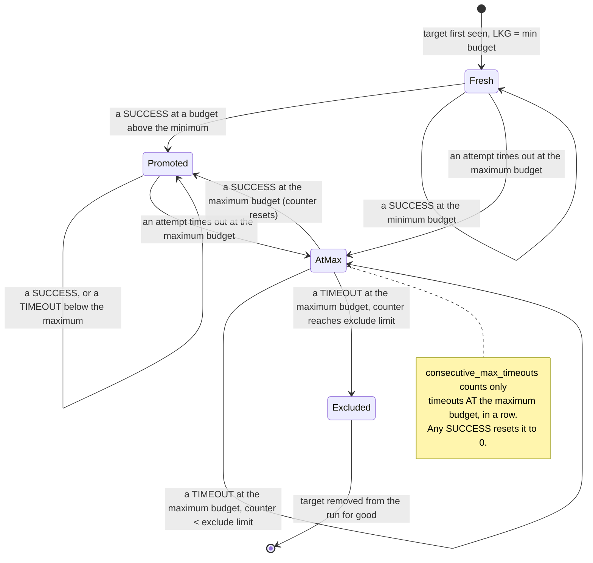

# Algorithm: Adaptive Timeout

**Status:** Draft
**Owner:** architect
**Audience:** coder, tester, architect
**Last Updated:** 2026-06-06
**Cross-references:** `08_Cross_Cutting/08-G_feature_flags.md`, `10_Domain_and_Data/02_DTOS_AND_ENUMS.md`, `11_Services_and_Algorithms/01_SERVICE_INVENTORY.md`

The Adaptive Timeout Service decides, per `(provider_id, model_name, role)` bucket, how long each LLM call may run before it is abandoned, escalates that budget across retries when calls time out, promotes a last-known-good budget when a call succeeds, and excludes a model from the remainder of the run **for that role** once it has failed too many times in a row at the maximum budget. The service exists so that one slow or hung model — at either the inference role or the judge role — can neither stall the whole run nor consume an unbounded amount of time, while a model that merely encounters a few heavy tasks is not penalised. This document defines the algorithm; it defines no implementation code.

---

## Table of Contents

1. Purpose
2. Inputs
3. Outputs
4. Preconditions
5. Postconditions
6. Algorithm
7. Configuration
8. Error handling
9. Threading and concurrency
10. Examples
11. Test cases

---

## 1. Purpose

LLM calls against a local or remote model — for inference, judging, or analysis — can be fast, slow, or hung. A fixed timeout is wrong in both directions: too short and a capable-but-slow model is failed needlessly; too long and one hung model freezes the run. The Adaptive Timeout Service replaces a fixed timeout with a per-`(provider_id, model_name, role)` budget that:

- starts at a configured **minimum** budget,
- **escalates** toward a configured **maximum** budget when an attempt times out,
- **promotes** a last-known-good budget when an attempt succeeds, so subsequent calls for the same `(provider, model, role)` bucket start from a value already proven to work,
- **excludes** a model from that **role** after a configured number of *consecutive* maximum-budget timeouts, settling the affected results to a role-appropriate failure terminal so the run moves on.

### 1.1 Scope — who consults this service

The service is consulted by **three call sites**, each on its own role/bucket:

| Activity | Phase / call site | Role | Outcome of exhaustion |
|---|---|---|---|
| `BENCHMARK_RUN` | Phase 2 — per-task main inference (test-role model) | `INFERENCE` | The result settles to `ResultStatus.FAILED_TIMEOUT` with `error_kind = TIMEOUT`. After `benchmark.consecutive_max_timeouts_to_exclude` consecutive max-budget timeouts the test model is excluded for the rest of the run; every still-pending result for that target settles to `FAILED_TIMEOUT`. |
| `BENCHMARK_RUN` | Phase 4 — per-task judge call (judge-role model) | `JUDGE` | The result settles to `ResultStatus.FAILED_JUDGE_TIMEOUT` with `error_kind = JUDGE_TIMEOUT`. After `eval.judge_timeout_consecutive_threshold` consecutive max-budget timeouts the judge model is excluded for the rest of the run; the pipeline emits `_judge_model_excluded` once, sets a local "judge_excluded" flag, and every remaining task that would have entered the judge phase settles to `FAILED_JUDGE_TIMEOUT` directly without a judge call being attempted. The run does NOT abort — Phase 2 / Phase 3 work continues for those tasks. |
| `JUDGE_ANALYSIS` | Run Analysis Service `generate(...)` — user-initiated run-analysis call | `RUN_ANALYSIS` (DD-65) | Runs on its **own** bucket (own LKG from min, own in-run counter), independent of the per-task `JUDGE` bucket, so the longer analysis prompt escalates its full ladder. The service returns `RunAnalysisResult` with `outcome = FAILED` and `reason = "judge_timeout_exhausted"`; the Generate Analysis dialog renders that failure with a "pick a different model and retry" message. The `_judge_model_excluded` event is NOT emitted from this path. The `JUDGE_ANALYSIS` gate watchdog (10 min) remains the outer safety bound. |

### 1.2 Scope — who does NOT consult this service

The service is intentionally **NOT consulted** by three other LLM-call surfaces:

- **The Embedding Service** uses a **fixed** per-call budget read from `eval.embedding_timeout_seconds` (default 30 s). On embedding timeout the task's cosine phase fails for that task; the binary verdict cascade (`04_EVALUATION_PIPELINE.md` §6.6, D-012) settles per the cosine-not-run handling; the next task tries embedding afresh with the same fixed budget. There is no escalation ladder, no consecutive-max threshold, and **no exclusion** of the embedding model — a chronically stalled embedding model keeps producing per-task cosine failures task after task, never aborting the run.
- **`LLMClient.test_inference`** (the Provider Edit Test inference action) uses its existing **fixed 60 s** `PROVIDER_TEST` watchdog (D-036, D-039). Test Inference is a one-shot manual user action; it does NOT consult the Adaptive Timeout Service and is not subject to per-role bucket state.
- **`LLMClient.probe_health`** (the readiness probe) uses its own **fixed short** deadline (`09_READINESS_PROBE.md`). Readiness probes are invisible background checks; they do NOT consult the Adaptive Timeout Service and have no escalation behaviour.

This split is deliberate. Adaptive escalation makes sense for repeated calls in the same run that the user cannot see individually (per-task inference, per-task judge, run-analysis); a manual one-shot test or an invisible health check has neither the repetition to learn from nor the user-visible stalling pattern that adaptive escalation is designed to mitigate.

### 1.3 Per-role bucket independence

State is keyed on `(provider_id, model_name, role)`. A model used as both a test model AND a judge model carries **two independent state buckets**. Exclusion in role=JUDGE does NOT exclude the same `(provider, model)` in role=INFERENCE, and vice versa. The escalation ladders, the persistent last-known-good budgets, and the in-run consecutive-timeout counters are all per-role and independent.

The **per-task** judge calls (BENCHMARK_RUN, role=JUDGE) and the **run-analysis** call (JUDGE_ANALYSIS, role=RUN_ANALYSIS) use **two independent buckets** (DD-65), both following the adaptive ladder described here and both parameterised by the `eval.judge_timeout_*` keys. They share **no** state: the run-analysis bucket keeps its own last-known-good (initialised to the min, promoted by its own successes) and its own in-run consecutive-timeout counter (fresh on each Generate Analysis click). A long analysis call therefore cannot poison the per-task judge budget, and — crucially — the analysis call never inherits a per-task judge LKG already promoted to the ceiling, so the longer analysis prompt escalates its own full ladder from min toward `eval.judge_timeout_max_seconds` with real headroom. (This supersedes both earlier models: the "shared role=JUDGE bucket" model and the "run at the configured maximum directly" model.)

---

## 2. Inputs

The service is constructed once per run from the run's frozen settings snapshot. It reads **two parallel parameter sets** — one for `role=INFERENCE` (the existing `benchmark.*` keys) and one for `role=JUDGE` (the new `eval.judge_timeout_*` keys) — and is then consulted per call.

**Construction inputs — role=INFERENCE (read once, from the snapshot):**

| Input | Type | Source |
|---|---|---|
| `min_timeout_seconds` | `TimeoutSeconds` (1–3600) | snapshot key `benchmark.min_timeout_seconds` |
| `max_timeout_seconds` | `TimeoutSeconds` (1–3600) | snapshot key `benchmark.max_timeout_seconds` |
| `retry_count` | `RetryCount` (0–10) | snapshot key `benchmark.retry_count` (also the number of escalation steps for this role) |
| `consecutive_max_timeouts_to_exclude` | `int` (≥1) | snapshot key `benchmark.consecutive_max_timeouts_to_exclude` |

**Construction inputs — role=JUDGE (read once, from the snapshot):**

| Input | Type | Source |
|---|---|---|
| `judge_min_timeout_seconds` | `TimeoutSeconds` (1–3600) | snapshot key `eval.judge_timeout_min_seconds` (default 20) |
| `judge_max_timeout_seconds` | `TimeoutSeconds` (1–3600) | snapshot key `eval.judge_timeout_max_seconds` (default 120) |
| `judge_escalation_steps` | `int` (0–10) | snapshot key `eval.judge_timeout_escalation_steps` (default 2) |
| `judge_consecutive_threshold` | `int` (≥1) | snapshot key `eval.judge_timeout_consecutive_threshold` (default 3) |

The role=INFERENCE and role=JUDGE ladders are independent. The `retry_count` parameter for role=INFERENCE is reused from the existing `benchmark.retry_count` (which also drives the pipeline's per-task retry loop for inference). The `judge_escalation_steps` parameter for role=JUDGE is a stand-alone key — judge retries are governed entirely by this ladder, not by `benchmark.retry_count`.

**Per-call query input:**

| Input | Type | Meaning |
|---|---|---|
| `target` | `ModelDescriptor` | The `(provider_id, model_name)` pair the call is for. |
| `role` | `AdaptiveTimeoutRole` | `INFERENCE` or `JUDGE`. Selects the per-role bucket and the parameter set. |
| `attempt_index` | `PositiveInt` | 1-based index of the attempt within the current task (1 = first attempt). |

**Per-call outcome input** (reported after the call completes):

| Input | Type | Meaning |
|---|---|---|
| `target` | `ModelDescriptor` | The pair the call was for. |
| `role` | `AdaptiveTimeoutRole` | The role the call ran under. |
| `attempt_index` | `PositiveInt` | The attempt index that was queried. |
| `timeout_ms` | `DurationMs` | The budget the call actually used. |
| `outcome` | `AttemptOutcome` | `SUCCESS`, `TIMEOUT`, or `ERROR`. |

The outcome input mirrors the fields the pipeline records on a `BenchmarkResultAttempt` for the inference role; for the judge role, the equivalent fields are recorded on the result's judge metadata. The service uses identical bookkeeping for both roles — only the parameter set and the bucket key differ.

---

## 3. Outputs

The service produces, on demand:

| Output | Type | Meaning |
|---|---|---|
| Current attempt budget | `int` (seconds) | The timeout to apply to the next call for a `(target, role)` bucket, given an `attempt_index`. Always within `[role.min_timeout_seconds, role.max_timeout_seconds]`. Callers multiply by 1000 to obtain milliseconds when crossing to the LLM client. |
| Exclusion verdict | `bool` | Whether a `(target, role)` bucket is excluded from the remainder of the run. **Per role** — a JUDGE exclusion does NOT exclude the target at role=INFERENCE. |
| Per-bucket audit state | see §6.1 | The `TimeoutState` (fresh / promoted / at-max / excluded), the last-known-good budget, and the consecutive-max-timeout counter — surfaced for the run log and rebuilt on resume (see §9). |

The service does not produce `BenchmarkResultAttempt` records itself. **For role=INFERENCE**, the Phase 2 inference loop builds those, copying the `timeout_ms` the service returned into `BenchmarkResultAttempt.timeout_ms`; when the test target becomes excluded the pipeline marks every still-`PENDING` result for that target `FAILED_TIMEOUT` with `error_kind = ErrorKind.TIMEOUT` and `error_message = "Model excluded: did not fit the allotted time."`. **For role=JUDGE**, the Phase 4 judge loop calls the service the same way; on a per-task exhaustion of the role=JUDGE ladder the result settles to `FAILED_JUDGE_TIMEOUT` (`error_kind = ErrorKind.JUDGE_TIMEOUT`, `error_message = "Judge call exhausted adaptive budget for this task."`), and on judge exclusion the pipeline emits `_judge_model_excluded` once and marks every still-`PENDING` result for the run that would have entered the judge phase `FAILED_JUDGE_TIMEOUT` with `error_message = "Judge model excluded: did not fit the allotted time."`. The pipeline finishes Phase 2 / Phase 3 work for those tasks normally; only the judge phase is skipped for them.

---

## 4. Preconditions

- The run's settings snapshot exists and contains all four `benchmark.*` keys AND all four `eval.judge_timeout_*` keys named in §2; each has passed its constrained-type validation (`TimeoutSeconds`, `RetryCount`, `int ≥ 0`, `int ≥ 1`).
- Per-role: `role.min_timeout_seconds <= role.max_timeout_seconds`. When the two are equal the role's escalation ladder collapses to a single rung (see §6.3) — this is valid, not an error.
- The service is consulted by the call sites named in §1.1 (Phase 2 inference at role=INFERENCE; Phase 4 per-task judge call at role=JUDGE; Run Analysis Service `generate(...)` — see SPEC-053/DD-65 for its dedicated bucket). It is NOT consulted by the Embedding Service, `LLMClient.test_inference`, or `LLMClient.probe_health` (§1.2).
- **Model-switch warmup (DD-64).** The warmup call at each model switch is **sized** by the model's `role=INFERENCE` budget (so a slow cold load gets the ladder's escalation headroom and a finite maximum, not a separate fixed deadline). Its **outcome**, however, feeds the **provider circuit breaker**, not this service's model-exclusion counter: a warmup that responds (incl. `4xx`) is provider-liveness (neutral); a warmup that exhausts the ladder without responding, or fails with a transport error, is a provider failure (`11_Services_and_Algorithms/08_CIRCUIT_BREAKER.md`). A model is excluded only by **per-task** inference timeouts, never by a warmup.
- For each `(provider_id, model_name, role)` bucket, the service is queried for a budget *before* that call runs and is told the outcome *after* it completes, in attempt-index order.

---

## 5. Postconditions

- Every call was run with a budget in `[role.min_timeout_seconds × 1000, role.max_timeout_seconds × 1000]` milliseconds — using the role's own parameter set.
- A `(target, role)` bucket's last-known-good budget is monotonically non-decreasing across the run: a success never lowers it; a timeout escalation never lowers it.
- A `(target, role)` bucket is excluded **only** after exactly `role.consecutive_threshold` timeouts in a row, every one of them at the role's maximum budget. Any `SUCCESS` between such timeouts resets the consecutive counter to zero.
- Once a `(target, role)` bucket is excluded it stays excluded for the remainder of the activity (or activities, for role=JUDGE — see §1.3); the service never readmits an excluded bucket within the same activity.
- The role=JUDGE per-task in-run counter resets at each BENCHMARK_RUN start, and the role=RUN_ANALYSIS in-run counter resets at each JUDGE_ANALYSIS click (DD-65); each bucket's persistent last-known-good survives between its own activities within the same run scope, independently of the other.
- The per-bucket audit state (state, last-known-good budget, consecutive counter) is consistent with the ordered sequence of outcomes reported, and survives pause/resume because it is reconstructed from the persisted attempt rows on resume (see §9).

---

## 6. Algorithm

### 6.1 Per-bucket state

The service keeps one `TimeoutState` per `(provider_id, model_name, role)` bucket. A model used as both a test model and a judge model has **two** independent `TimeoutState` instances — one keyed on `(p, m, INFERENCE)` and one on `(p, m, JUDGE)` — and changes in one never affect the other.

| Field | Type | Meaning |
|---|---|---|
| `state` | one of `FRESH`, `PROMOTED`, `AT_MAX`, `EXCLUDED` | The state-machine node (see §6.2). |
| `last_known_good_ms` | `DurationMs` | The budget a future call's first attempt starts from. Initialised to `role.min_timeout_seconds × 1000`. Each bucket — role=INFERENCE, role=JUDGE, and role=RUN_ANALYSIS (DD-65) — keeps its **own** learned value. The `RUN_ANALYSIS` bucket is independent of the per-task `JUDGE` bucket: it starts from its own min and escalates its own ladder, so the longer analysis prompt gets full escalation headroom instead of inheriting a per-task judge LKG already promoted to the ceiling. |
| `consecutive_max_timeouts` | `NonNegativeInt` | Count of consecutive timeouts at the role's maximum budget. Initialised to `0`. **Resets at activity boundaries for role=JUDGE** — each JUDGE_ANALYSIS click starts with `0` regardless of the count the preceding BENCHMARK_RUN ended with. |

`state` is a derived label for auditing and logging; the budget decision in §6.3 depends only on `last_known_good_ms`, `attempt_index`, the role's parameter set, and whether the bucket is excluded.

### 6.2 State machine



| State | Meaning | Recovery rule |
|---|---|---|
| `FRESH` | The target has not yet produced a success above the minimum budget. Its `last_known_good_ms` is still the minimum. | A success above the minimum promotes it; a max-budget timeout moves it to `AT_MAX`. |
| `PROMOTED` | The target has succeeded at a budget above the minimum; its `last_known_good_ms` reflects a proven value. | A max-budget timeout moves it to `AT_MAX`; further successes keep it promoted and may raise the proven value. |
| `AT_MAX` | The target has at least one timeout at the maximum budget and a non-zero consecutive counter. | A success at the maximum budget resets the counter and returns the target to `PROMOTED` — this is the recovery path. A further max-budget timeout that pushes the counter to the exclude limit moves it to `EXCLUDED`. |
| `EXCLUDED` | The target failed `consecutive_max_timeouts_to_exclude` times in a row at the maximum budget. Terminal; no recovery within the run. | None. Remaining tasks are marked `FAILED_TIMEOUT`. |

### 6.3 The escalation ladder (per role)

For one task (or one analysis call), the caller grants `1 + role.escalation_steps` attempts (the first attempt plus `role.escalation_steps` retries). For role=INFERENCE the step count comes from `benchmark.retry_count`; for role=JUDGE it comes from `eval.judge_timeout_escalation_steps`. The per-attempt budget escalates from the bucket's `last_known_good_ms` toward `role.max_timeout_seconds × 1000` across those attempts. The ladder for attempt index `i` (1-based) of a `(target, role)` bucket with last-known-good budget `LKG` is computed as follows.

```
function attempt_budget(target, role, attempt_index):
    bucket = state_of(target, role)
    if bucket.state == EXCLUDED:
        return  EXCLUDED  # the caller must not dispatch; see §6.5

    p = parameters_for(role)                 # {min, max, escalation_steps, consecutive_threshold}
    lkg   = bucket.last_known_good_ms
    floor = lkg
    ceil  = p.max_timeout_seconds * 1000
    steps = p.escalation_steps               # number of escalation gaps

    if attempt_index == 1 or steps == 0 or floor >= ceil:
        budget = floor
    else:
        # attempt_index 2..(1 + steps) walk linearly from floor to ceil
        rung   = min(attempt_index - 1, steps)
        budget = floor + (ceil - floor) * rung / steps
        budget = round(budget)

    return clamp(budget, p.min_timeout_seconds * 1000, ceil)
```

Key properties of the ladder (identical for both roles, only the parameter set changes):

- **Attempt 1 always uses the last-known-good budget.** For a fresh bucket that is the role's minimum; for a promoted bucket it is the proven value.
- **Each retry climbs one rung** of an evenly-spaced ladder of `role.escalation_steps` rungs spanning `[LKG, role.max]`. The final retry (`attempt_index = 1 + role.escalation_steps`) always lands exactly on `role.max`.
- **When `role.escalation_steps == 0`** there are no retries; every attempt uses `LKG` and the ladder is a single rung.
- **When `LKG` has already reached `role.max`** (an `AT_MAX` bucket), every rung is `role.max`; escalation has nothing left to climb.
- The result is always clamped into `[role.min, role.max]`, so a misconfigured floor above the ceiling still yields a budget no larger than `role.max`.

### 6.4 Recording an outcome

After a call completes, the caller reports `(target, role, attempt_index, timeout_ms, outcome)`. The service updates the bucket's `TimeoutState` using the role's parameter set:

```
function record_outcome(target, role, attempt_index, timeout_ms, outcome):
    bucket = state_of(target, role)
    if bucket.state == EXCLUDED:
        return                               # ignore late outcomes for an excluded bucket

    p = parameters_for(role)
    at_max = (timeout_ms >= p.max_timeout_seconds * 1000)

    if outcome == SUCCESS:
        bucket.consecutive_max_timeouts = 0
        if timeout_ms > bucket.last_known_good_ms:
            bucket.last_known_good_ms = timeout_ms       # promote — never lower
        if bucket.last_known_good_ms > p.min_timeout_seconds * 1000:
            bucket.state = PROMOTED
        else:
            bucket.state = FRESH
        return

    if outcome == TIMEOUT:
        if at_max:
            bucket.consecutive_max_timeouts += 1
            if bucket.consecutive_max_timeouts >= p.consecutive_threshold:
                bucket.state = EXCLUDED
            else:
                bucket.state = AT_MAX
        else:
            # a sub-maximum timeout escalates but does not count toward exclusion
            bucket.state = AT_MAX if bucket.last_known_good_ms >= p.max_timeout_seconds * 1000 else bucket.state
        return

    if outcome == ERROR:
        # an LLM ERROR is not a timeout; the consecutive-timeout counter
        # is left unchanged. Retry/exclusion for errors is governed by the
        # caller's retry loop, not by this service.
        return
```

The same three load-bearing rules apply per-role:

1. **A success promotes but never demotes.** `last_known_good_ms` only ever rises **within its own bucket**. A judge success at 90 s leaves the role=JUDGE floor at 90 s for that `(provider, model)` even if a later judge call succeeds at 25 s. The role=INFERENCE floor for the same `(provider, model)` is unaffected.
2. **The exclusion counter is strictly consecutive and strictly at-max — per role.** Only a timeout *at the role's maximum budget* increments the role's counter; *any* success in that role resets it to zero. A judge that alternates max-budget success and max-budget timeout is never excluded — that pattern means a few individual judge calls are heavy, not that the judge model is broken.
3. **An `ERROR` outcome is not a timeout.** A model-side error or a provider error is classified by `ErrorKind.LLM` / `ErrorKind.PROVIDER` and handled by the caller's retry loop; it leaves the consecutive-timeout counter untouched. Only `AttemptOutcome.TIMEOUT` participates in exclusion.

The two protocol methods `record_success(provider_id, model_name, role, observed_ms)` and `record_timeout(provider_id, model_name, role)` from `08_Cross_Cutting/08-E_interfaces_contracts.md` §17 are thin façades over the unified `record_outcome` algorithm above — `record_success` invokes the SUCCESS branch with `timeout_ms = observed_ms`, and `record_timeout` invokes the TIMEOUT branch with `timeout_ms` equal to the budget the caller last queried for this attempt. Callers must use the façade methods; the service does not expose `record_outcome` directly.

### 6.5 Exclusion handoff (per role)

When `record_timeout` moves a `(target, role)` bucket to `EXCLUDED`, the service does not itself touch the database. It signals the caller, which then handles the exclusion per role.

**role=INFERENCE (Phase 2 inference, BENCHMARK_RUN activity):**

1. Stops dispatching any further inference attempt for that `(provider_id, model_name)` target.
2. For every still-`PENDING` result of that target across the whole run, applies a `ResultPatch` with `status = FAILED_TIMEOUT`, `error_kind = ErrorKind.TIMEOUT`, `error_message = "Model excluded: did not fit the allotted time."`, and `finished_at` set.
3. Emits `_model_stability_changed` with `model_state = EXCLUDED` and a benchmark-event-log entry naming the excluded target and the consecutive-timeout count.

Already-`COMPLETED` results for the target are untouched: the model may have produced valid results for earlier tasks before it began timing out.

**role=JUDGE (Phase 4 per-task judge call, BENCHMARK_RUN activity):**

1. Stops dispatching any further judge call for that `(provider_id, model_name)` target.
2. Emits `_judge_model_excluded` exactly once with the `JudgeModelExcludedEvent` payload (`08_Cross_Cutting/08-Q_event_payload_schemas.md` §3.6a), including `remaining_tasks_affected` (count of still-pending results that would have entered the judge phase).
3. Sets a local "judge_excluded" flag on the pipeline state for the rest of the run.
4. For the task whose judge call just exhausted the ladder, settles the result to `status = FAILED_JUDGE_TIMEOUT`, `error_kind = ErrorKind.JUDGE_TIMEOUT`, `error_message = "Judge model excluded: did not fit the allotted time."`, `verdict = None`, `finished_at` set. The Phase 5 verdict combination is NOT applied to this result (`FAILED_JUDGE_TIMEOUT` is its own terminal class).
5. For every remaining task that would have entered the judge phase, settles the result to the same `FAILED_JUDGE_TIMEOUT` terminal directly — the judge call is not attempted. **Phase 2 (inference) and Phase 3 (cosine) for those remaining tasks continue normally**; only Phase 4 (judge) is skipped per affected task. The run does NOT abort.
6. The Progress widget Event Log renders one log entry from the event: `"Judge model '<name>' excluded: <N> consecutive max-budget timeouts. Remaining tasks' judge phase will be skipped."`.

Already-`COMPLETED` results that already went through the judge phase before the threshold was crossed are untouched.

**role=JUDGE (Run Analysis Service, JUDGE_ANALYSIS activity):**

1. Stops the analysis call — no further attempts.
2. **Does NOT emit `_judge_model_excluded`.** This event is reserved for the BENCHMARK_RUN activity, where the user is not in the loop and the Event Log warning is the user's only signal. JUDGE_ANALYSIS exhaustion has a different, more direct signal — the dialog's failure message.
3. The Run Analysis Service returns `RunAnalysisResult` with `outcome = FAILED` and `reason = "judge_timeout_exhausted"`. The Generate Analysis dialog renders the failure with a "pick a different model and retry" message.
4. The in-run consecutive-timeout counter for the role=JUDGE bucket resets when this activity ends, so a subsequent click starts a fresh count.

### 6.6 Retry scope

The escalation ladder is consumed only by **recoverable** failures of a call — timeouts. The caller's retry loop also retries `ErrorKind.PROVIDER` failures, but those do not escalate the timeout budget; they re-run at the same rung. A validation failure (a failed keyword check, a low cosine score, a `FAIL` judge verdict) is a legitimate benchmark result, never an error, and is never retried — it does not reach this service at all.

Per-role differences in retry scope:

- For **role=INFERENCE**, the caller's retry loop is the existing Phase 2 retry loop governed by `benchmark.retry_count`.
- For **role=JUDGE** (Phase 4 per-task judge call), the caller's retry loop is the judge-phase retry loop governed by `eval.judge_timeout_escalation_steps`. Judge parse-failure retries (`08_Cross_Cutting/08-P_judge_protocol.md` §9.3) are a separate concern handled inside the judge phase and use their own counter — they do NOT consume the adaptive-timeout escalation ladder.
- For **role=RUN_ANALYSIS** (Run Analysis Service, DD-65), the `generate(...)` call performs `1 + eval.judge_timeout_escalation_steps` attempts under its own independent ladder (escalating from its own LKG toward `eval.judge_timeout_max_seconds`); on exhaustion it returns the `judge_timeout_exhausted` failure (§6.5).

---

## 7. Configuration

The service is parameterised by **two parallel sets** of per-run-overridable keys — one for role=INFERENCE and one for role=JUDGE — all members of `PER_RUN_OVERRIDABLE`, all frozen into `BenchmarkRun.settings_snapshot` at run start and read only from there.

**role=INFERENCE — the existing `benchmark.*` ladder:**

| Key | Type | Default | Role |
|---|---|---|---|
| `benchmark.min_timeout_seconds` | `TimeoutSeconds` (1–3600) | `300` | The first-attempt budget for a fresh INFERENCE bucket; the floor of the ladder and of every clamp. |
| `benchmark.max_timeout_seconds` | `TimeoutSeconds` (1–3600) | `900` | The ceiling the INFERENCE ladder climbs toward; the budget at which timeouts count toward exclusion. |
| `benchmark.retry_count` | `RetryCount` (0–10) | `3` | The number of retries after the first INFERENCE attempt; the number of rungs in the INFERENCE escalation ladder. (This key also governs the pipeline's per-task retry loop in Phase 2, by design.) |
| `benchmark.consecutive_max_timeouts_to_exclude` | `int` (≥1) | `3` | The number of consecutive max-budget INFERENCE timeouts that excludes a target at role=INFERENCE. |

**role=JUDGE — the new `eval.judge_timeout_*` ladder:**

| Key | Type | Default | Role |
|---|---|---|---|
| `eval.judge_timeout_min_seconds` | `TimeoutSeconds` (1–3600) | `20` | The first-attempt budget for a fresh JUDGE bucket; the floor of the JUDGE ladder and of every clamp. |
| `eval.judge_timeout_max_seconds` | `TimeoutSeconds` (1–3600) | `120` | The ceiling the JUDGE ladder climbs toward; the budget at which timeouts count toward role=JUDGE exclusion. |
| `eval.judge_timeout_escalation_steps` | `int` (0–10) | `2` | The number of intermediate budget steps between min and max for the JUDGE ladder. `0` collapses the JUDGE ladder to a single rung. |
| `eval.judge_timeout_consecutive_threshold` | `int` (≥1) | `3` | The number of consecutive max-budget JUDGE timeouts that excludes a target at role=JUDGE for the rest of the activity. |

Because all eight keys are per-run-overridable, two runs may use different ladders, and the Settings dialog cannot change them mid-run (it is disabled while a run is non-terminal — see `08_Cross_Cutting/08-H_app_modes.md` §6). The New Benchmark advanced options may override any of the eight for a single run; the override is captured into the snapshot before the run starts.

**Not consulted by the Adaptive Timeout Service:** `eval.embedding_timeout_seconds` (default 30 s) is the fixed embedding budget used by the Embedding Service (§1.2); it is a per-run-overridable key but is NEVER read by this service.

---

## 8. Error handling

| Situation | Handling |
|---|---|
| `role.min_timeout_seconds > role.max_timeout_seconds` in the snapshot for either role | Treated as a degenerate-but-valid configuration for that role: the ladder collapses and the clamp in §6.3 caps every budget at `role.max`. The pipeline logs a warning at run start naming the affected role. It is not a fatal error. The two roles are independent — a degenerate INFERENCE configuration does not affect JUDGE, and vice versa. |
| An outcome reported for an unknown `attempt_index` (out of order) | The service applies the outcome to the bucket's state regardless of index; the index is used only for the budget query. Out-of-order reporting cannot corrupt the consecutive counter because the counter depends only on outcome and on whether the budget was at the role's max. |
| An outcome reported for an already-`EXCLUDED` bucket | Ignored (§6.4). A late attempt finishing after exclusion does not change state. |
| An `AttemptOutcome.ERROR` reported | Recorded but does not affect the consecutive-timeout counter or `last_known_good_ms` (§6.4). |
| Snapshot missing one of the eight role keys | Cannot occur past preconditions: the snapshot always carries every per-run-overridable key, falling back to the Default layer. If it somehow does, the run-creation use case fails before the pipeline starts; the service is never constructed. |
| A caller queries the service for a role the service does not implement (e.g. a hypothetical `EMBEDDING`) | The `AdaptiveTimeoutRole` enum has exactly two members (`INFERENCE`, `JUDGE`); a query with a different value is a programmer error caught at type check / construction (see §1.2). The service does not implement runtime fallback for unsupported roles. |

The service itself **never raises** an exception to the pipeline. Every input it receives has already passed constrained-type validation at snapshot time. Its only outward effect is the per-role exclusion signal of §6.5.

---

## 9. Threading and concurrency

- The Adaptive Timeout Service is **synchronous** and is owned by the benchmark pipeline (it is also reachable to the Run Analysis Service when a `JUDGE_ANALYSIS` activity is running — same service instance, same in-memory state). The pipeline runs its work units on `QThreadPool` worker threads via the adapter's `TaskRunner` (`16_Engineering_Standards/04_CONCURRENCY_STANDARD.md`, D-R-01); each provider/judge call is a plain blocking call on its worker thread, and the timeout-state bookkeeping is ordinary synchronous code — there is no event loop. The single-inference gate ensures `BENCHMARK_RUN` and `JUDGE_ANALYSIS` never overlap, so the shared in-memory state has a single writer at a time.
- Phase 2 dispatches one inference attempt at a time within a `(provider, model)` group, and Phase 4 dispatches one judge attempt at a time within a task (the pipeline never switches providers or models mid-stream — see the benchmark execution flow), so the service is never called concurrently for the same `(target, role)` bucket. The two role buckets for the same `(target)` are never written concurrently either (Phase 2 and Phase 4 are sequential within a task). No locking is required.
- The service holds **no I/O** and **no database handle**. It is pure in-memory bookkeeping; the per-role exclusion handoff (§6.5) is performed by the caller.
- **Pause/resume and crash recovery.** The per-bucket `TimeoutState` is *not* a separate persisted table. On pause or stop the in-memory state is discarded; on resume the service is reconstructed and the pipeline replays the persisted attempt history of the run — in `attempt_index` order, per `(target, role)` bucket — through the `record_success` / `record_timeout` façades, so the `last_known_good_ms`, the consecutive counter, and the `state` are rebuilt to exactly the values they held when the run paused. For role=INFERENCE the replay reads `BenchmarkResultAttempt` rows; for role=JUDGE the replay reads each result's `judge_*` metadata fields (judge calls are recorded directly on the result, not as `BenchmarkResultAttempt` rows). An excluded bucket stays excluded across resume because its affected results are already persisted as `FAILED_TIMEOUT` (role=INFERENCE) or `FAILED_JUDGE_TIMEOUT` (role=JUDGE) and are not reset by a resume.
- **Cancellation.** A Stop during an in-flight call cancels the awaited LLM call; the cancelled attempt produces no outcome and is not reported to the service, so the timeout state is unchanged and is correctly rebuilt on the next resume from the persisted attempts.
- **Activity boundary semantics.** The role=JUDGE per-task buckets reset their in-run counters at each `BENCHMARK_RUN` start; the role=RUN_ANALYSIS bucket resets its in-run counter at each `JUDGE_ANALYSIS` click (DD-65). Each bucket's persistent `last_known_good_ms` carries over within the run scope, independently of the other. When the process restarts, counters reset and persistent values are rebuilt from the run's persisted metadata as described above.

---

## 10. Examples

### 10.1 Happy path — role=INFERENCE, escalate then promote

Configuration (role=INFERENCE): `min = 300 s`, `max = 900 s`, `retry_count = 2`, `exclude limit = 3`.
Ladder for a fresh INFERENCE bucket (`LKG = 300 s`): attempt 1 → 300 s, attempt 2 → 600 s, attempt 3 → 900 s (evenly spaced rungs floor→ceil).

One target, `(ollama_local, qwen3:8b)`, runs a task:

| Attempt | Budget queried | Outcome | State after | `last_known_good` after | Consecutive after |
|---|---|---|---|---|---|
| 1 | 300 s | `TIMEOUT` (sub-max) | `FRESH` | 300 s | 0 |
| 2 | 600 s | `SUCCESS` | `PROMOTED` | 600 s | 0 |

The task's *next* task for the same target now starts attempt 1 at **600 s**, not 300 s — the proven value was promoted. The first timeout was sub-maximum, so it never touched the consecutive counter. This is the canonical intent: a slow-but-capable model converges on the budget that works for it.

A later task for the same target:

| Attempt | Budget queried | Outcome | State after | `last_known_good` after | Consecutive after |
|---|---|---|---|---|---|
| 1 | 600 s | `TIMEOUT` (sub-max) | `PROMOTED` | 600 s | 0 |
| 2 | 750 s | `TIMEOUT` (sub-max) | `PROMOTED` | 600 s | 0 |
| 3 | 900 s | `SUCCESS` | `PROMOTED` | 900 s | 0 |

`last_known_good` rises to 900 s; the consecutive counter never moved because none of the timeouts was *abandoned at the maximum* — only the budget *value* matters for the counter, and the two sub-max timeouts did not reach `max`.

### 10.2 Edge case — exclusion after consecutive max-budget timeouts

Configuration: `min = 300 s`, `max = 900 s`, `retry_count = 0`, `exclude limit = 3`.
With `retry_count = 0` there are no retries; every task gets exactly one attempt, and a target whose `LKG` has reached 900 s runs every attempt at 900 s.

Target `(remote_api, big-model)` has already been promoted to `LKG = 900 s` (state `AT_MAX` after an earlier max-budget timeout, counter at 1):

| Task | Attempt | Budget | Outcome | State after | Consecutive after |
|---|---|---|---|---|---|
| T-12 | 1 | 900 s | `TIMEOUT` at max | `AT_MAX` | 2 |
| T-13 | 1 | 900 s | `TIMEOUT` at max | `EXCLUDED` | 3 |

On the third consecutive max-budget timeout the counter reaches the exclude limit and the target becomes `EXCLUDED`. The pipeline then marks every still-`PENDING` result of `(remote_api, big-model)` — T-14, T-15, … — as `FAILED_TIMEOUT` with `error_kind = TIMEOUT` and the message `"Model excluded: did not fit the allotted time."`, and the run advances to the next model without further attempts for this one.

### 10.3 Edge case — alternation does not exclude

Same configuration as §10.2; target `(remote_api, heavy-model)` at `LKG = 900 s`:

| Task | Outcome at 900 s | Consecutive after |
|---|---|---|
| T-20 | `TIMEOUT` at max | 1 |
| T-21 | `SUCCESS` at max | 0 |
| T-22 | `TIMEOUT` at max | 1 |
| T-23 | `SUCCESS` at max | 0 |
| T-24 | `TIMEOUT` at max | 1 |

The counter never reaches 3 because every success resets it. The model is **not excluded**: the alternating pattern means a few individual tasks are simply too heavy, which is a legitimate benchmark observation, not a broken model. The three timed-out tasks are recorded as `FAILED_TIMEOUT`; the three succeeded tasks proceed normally.

### 10.4 Edge case — role=JUDGE, per-task exhaustion vs run-wide exclusion

Configuration (role=JUDGE): `min = 20 s`, `max = 120 s`, `escalation_steps = 2`, `consecutive_threshold = 3`.
Ladder for a fresh JUDGE bucket (`LKG = 20 s`): attempt 1 → 20 s, attempt 2 → 70 s, attempt 3 → 120 s.

A `GRADED` run with judge `(remote_api, claude-judge)`. Phase 4 runs for task T-30:

| Attempt | Budget | Outcome | State after | LKG after | Consecutive after |
|---|---|---|---|---|---|
| 1 | 20 s | `TIMEOUT` (sub-max) | `FRESH` | 20 s | 0 |
| 2 | 70 s | `TIMEOUT` (sub-max) | `FRESH` | 20 s | 0 |
| 3 | 120 s | `TIMEOUT` (at max) | `AT_MAX` | 20 s | 1 |

T-30's judge call has exhausted its three attempts at the ladder. The result for T-30 settles to `FAILED_JUDGE_TIMEOUT` with `error_kind = JUDGE_TIMEOUT` and `error_message = "Judge call exhausted adaptive budget for this task."`. The judge model is NOT excluded — only this task's judge phase is terminated. The pipeline continues to T-31's judge call.

Task T-31's judge call (with the JUDGE bucket now at `AT_MAX, counter=1`): every rung is at `max=120 s` (because LKG is unchanged at 20 s, but the counter is already at 1; sub-max retries can still happen on the way to max). One realistic outcome:

| Attempt | Budget | Outcome | State after | Consecutive after |
|---|---|---|---|---|
| 1 | 20 s | `TIMEOUT` (sub-max) | `AT_MAX` | 1 |
| 2 | 70 s | `TIMEOUT` (sub-max) | `AT_MAX` | 1 |
| 3 | 120 s | `TIMEOUT` (at max) | `AT_MAX` | 2 |

T-31 also settles `FAILED_JUDGE_TIMEOUT`. The judge bucket counter is at 2; one more max-budget timeout in a row will trip exclusion. For T-32:

| Attempt | Budget | Outcome | State after | Consecutive after |
|---|---|---|---|---|
| 1 | 20 s | `TIMEOUT` (sub-max) | `AT_MAX` | 2 |
| 2 | 70 s | `TIMEOUT` (sub-max) | `AT_MAX` | 2 |
| 3 | 120 s | `TIMEOUT` (at max) | `EXCLUDED` | 3 |

The third consecutive max-budget timeout trips exclusion. T-32's result settles `FAILED_JUDGE_TIMEOUT` with `error_message = "Judge model excluded: did not fit the allotted time."`. The pipeline emits `_judge_model_excluded` exactly once with `consecutive_timeouts=3` and `remaining_tasks_affected = <count of still-pending tasks>`. Every remaining task that would have entered the judge phase settles to `FAILED_JUDGE_TIMEOUT` directly — the judge call is NOT attempted for those tasks. **Phase 2 (inference) and Phase 3 (cosine) for those remaining tasks continue normally**; the run finishes when all phases finish. The Progress widget Event Log shows one line: `"Judge model 'claude-judge' excluded: 3 consecutive max-budget timeouts. Remaining tasks' judge phase will be skipped."`.

### 10.5 Edge case — role independence

A run uses `(remote_api, claude-3-opus)` as BOTH a test model AND the judge model. The role=INFERENCE bucket succeeds smoothly with `LKG = 450 s` and `consecutive=0`; meanwhile the role=JUDGE bucket reaches `EXCLUDED` after three consecutive max-budget judge timeouts. **Phase 2 (inference) for `claude-3-opus` continues normally** for every remaining task — the test-model bucket is not excluded. Phase 4 (judge) is skipped for every remaining task (judge bucket is excluded). The same physical `(provider, model)` is simultaneously usable for inference and excluded for judging, because the two role buckets are independent. The two events `_model_stability_changed` (for the role=INFERENCE bucket, on every promotion / sub-max timeout) and `_judge_model_excluded` (one-shot, for the role=JUDGE exclusion) both fire for the same `(provider, model)` pair, and that is correct.

### 10.6 Edge case — run-analysis exhaustion does NOT emit `_judge_model_excluded`

The user finishes a GRADED run that drove the per-task **JUDGE** bucket's `LKG` to, say, 90 s. The user clicks Generate Analysis with the same `(provider, model)`. The Run Analysis Service consults the **role=RUN_ANALYSIS** bucket (DD-65), which is **independent** of that per-task JUDGE bucket: `next_budget(provider, model, role=RUN_ANALYSIS, attempt_index=1)` returns this bucket's own LKG (its min, e.g. 20 s, on first use), attempt 2 escalates one rung, attempt 3 escalates again toward 120 s — the analysis prompt gets its own full ladder, not a budget pinned by the per-task run. Suppose all three time out: the service records three RUN_ANALYSIS timeouts, the RUN_ANALYSIS bucket reaches `EXCLUDED`, and the service returns `RunAnalysisResult(outcome = FAILED, reason = "judge_timeout_exhausted")` (it does **not** emit `_judge_model_excluded`). The dialog renders `"The judge model failed to respond within the time budget after 3 attempts. Pick a different model and retry."`. A successful analysis instead promotes the RUN_ANALYSIS bucket's own LKG for next time; the per-task JUDGE bucket is never touched either way.

---

## 11. Test cases

| # | Scenario | Setup | Expected |
|---|---|---|---|
| T-1 | First attempt uses minimum | Fresh target, `min = 300`, `retry = 3` | `attempt_budget(target, 1) == 300 000 ms`. |
| T-2 | Ladder is evenly spaced and lands on max | Fresh target, `min = 300`, `max = 900`, `retry = 2` | Budgets for attempts 1,2,3 are 300 s, 600 s, 900 s. |
| T-3 | `retry_count = 0` collapses the ladder | `min = 300`, `max = 900`, `retry = 0` | Every attempt budget equals `LKG`; attempt 2+ never queried by the pipeline. |
| T-4 | Success promotes the floor | Fresh target succeeds at 600 s | `last_known_good_ms == 600 000`; state `PROMOTED`; next task attempt 1 = 600 s. |
| T-5 | Success never lowers the floor | Promoted target at 900 s succeeds at 300 s | `last_known_good_ms` stays `900 000`. |
| T-6 | Sub-max timeout does not count toward exclusion | Target times out 5× in a row at sub-max budgets | `consecutive_max_timeouts` stays 0 (only state escalation occurs); never excluded. |
| T-7 | Exclusion after exactly N consecutive max timeouts | `exclude limit = 3`; 3 max-budget timeouts in a row | Target `EXCLUDED` on the 3rd; not before. |
| T-8 | Success resets the consecutive counter | 2 max timeouts, then 1 max success, then 2 max timeouts | Counter sequence 1,2,0,1,2; target not excluded. |
| T-9 | Alternation never excludes | timeout, success, timeout, success, timeout at max | Counter never exceeds 1; not excluded. |
| T-10 | Exclusion handoff marks pending results | Target excluded mid-run with pending results | Every pending result for the target → `FAILED_TIMEOUT`, `error_kind = TIMEOUT`, message set; `COMPLETED` results untouched. |
| T-11 | `ERROR` outcome leaves the counter unchanged | Target at counter 2, attempt outcome `ERROR` | `consecutive_max_timeouts` stays 2; `last_known_good_ms` unchanged. |
| T-12 | Late outcome for excluded target ignored | `record_outcome` called for an `EXCLUDED` target | State unchanged; no exception. |
| T-13 | Budget always clamped to `[min, max]` | `min = 900`, `max = 300` (misconfigured) | Every returned budget ≤ `300 000 ms`; warning logged at run start. |
| T-14 | State rebuilt on resume from persisted attempts | Replay an ordered attempt history through the façade methods | Rebuilt `state`, `last_known_good_ms`, and counter equal the values before pause. Per-role: INFERENCE replays `BenchmarkResultAttempt` rows; JUDGE replays per-result judge metadata. |
| T-15 | Excluded target stays excluded across resume | Resume a run whose target was excluded at role=INFERENCE | Target's results remain `FAILED_TIMEOUT`; no new attempts dispatched for it. |
| T-16 | Role independence | A `(provider, model)` excluded at role=JUDGE stays usable at role=INFERENCE | `is_excluded(p, m, JUDGE) == True` AND `is_excluded(p, m, INFERENCE) == False`. Phase 2 still dispatches inference attempts; Phase 4 skips judge attempts. |
| T-17 | Role=JUDGE per-task exhaustion | One task's judge call times out at every rung of the JUDGE ladder | Result settles `FAILED_JUDGE_TIMEOUT`; `error_kind = JUDGE_TIMEOUT`; `verdict = None`; status NOT `COMPLETED`. The judge bucket counter is +1 (one max-budget timeout), not at the exclusion threshold yet. |
| T-18 | Role=JUDGE run-wide exclusion | The JUDGE bucket reaches `consecutive_threshold` consecutive max-budget timeouts mid-run | `_judge_model_excluded` fires exactly once with payload `JudgeModelExcludedEvent(consecutive_timeouts=threshold, remaining_tasks_affected=<count>)`. Pipeline sets the judge_excluded flag. Every remaining task that would have entered the judge phase settles `FAILED_JUDGE_TIMEOUT` directly. Phase 2/3 for those tasks still run. Run does NOT abort. |
| T-19 | Role=JUDGE retry semantics | Resume of a run with `FAILED_JUDGE_TIMEOUT` rows the user elected to retry | Each retried row resets to `PENDING` and re-runs end-to-end (re-inference + re-grade); the original inference text is NOT preserved. The role=JUDGE bucket's persistent `last_known_good_ms` carries over from the failed attempts. |
| T-20 | JUDGE_ANALYSIS exhaustion does NOT emit `_judge_model_excluded` | Run Analysis Service exhausts the role=RUN_ANALYSIS ladder (DD-65) | Service returns `RunAnalysisResult(outcome=FAILED, reason="judge_timeout_exhausted")`. No `_judge_model_excluded` event is emitted. Dialog renders the failure message. |
| T-21 | JUDGE counter resets at activity boundary | BENCHMARK_RUN drives JUDGE counter to N (N < threshold); user then clicks Generate Analysis with the same `(provider, model)` | The analysis call's in-run counter starts at 0; the persistent `last_known_good_ms` carries over. |
| T-22 | RUN_ANALYSIS bucket is independent of per-task JUDGE (DD-65) | BENCHMARK_RUN drives the per-task JUDGE `LKG = 90 s`; user later clicks Generate Analysis | The first analysis attempt uses the **RUN_ANALYSIS** bucket's own LKG (its own min on first use), NOT the per-task JUDGE 90 s — the analysis prompt escalates its own ladder. |
| T-23 | Embedding does NOT consult the service | Pipeline cosine phase runs | The Embedding Service uses `eval.embedding_timeout_seconds` directly; the Adaptive Timeout Service is never queried for the embedding model. |
| T-24 | `LLMClient.test_inference` does NOT consult the service | Provider Edit Test inference action runs | The 60 s `PROVIDER_TEST` watchdog is the only deadline; the Adaptive Timeout Service is never queried. |
