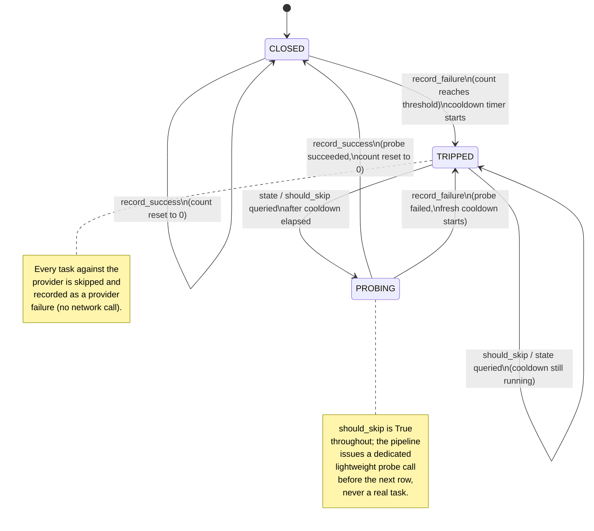

# Provider Circuit Breaker

**Status:** Draft
**Owner:** architect
**Audience:** architect, coder, tester
**Last Updated:** 2026-06-06
**Cross-references:** `08_Cross_Cutting/08-E_interfaces_contracts.md`, `10_Domain_and_Data/02_DTOS_AND_ENUMS.md`, `11_Services_and_Algorithms/03_PROVIDER_REGISTRY.md`, `11_Services_and_Algorithms/07_ADAPTIVE_TIMEOUT.md`, `11_Services_and_Algorithms/09_READINESS_PROBE.md`, `11_Services_and_Algorithms/17_ERROR_TAXONOMY.md`, `11_Services_and_Algorithms/18_RETRY_POLICY.md`, `08_Cross_Cutting/08-J_event_bus_catalog.md`, `08_Cross_Cutting/08-C_settings_hierarchy.md`

This document specifies the Provider Circuit Breaker — the per-provider failure breaker that takes a consistently-failing provider out of a benchmark run for a cooldown window, probes it once when the cooldown elapses, and either closes the breaker or re-opens it. It implements the `ProviderCircuitBreaker` Protocol declared in `08_Cross_Cutting/08-E_interfaces_contracts.md` §18 and uses the `CircuitState` enum defined there.

---

## Table of Contents

1. Purpose
2. Inputs
3. Outputs
4. Preconditions
5. Postconditions
6. Algorithm
   - 6.1 The breaker contract
   - 6.2 The three states
   - 6.3 State diagram
   - 6.4 Failure counting and the trip threshold
   - 6.5 Cooldown and the transition to probing
   - 6.6 Probe behaviour
   - 6.7 Per-provider scope
   - 6.8 Interaction with retry
   - 6.9 Interaction with adaptive timeout
7. Configuration
8. Error handling
9. Threading and concurrency
10. Examples
11. Test cases

---

## 1. Purpose

A provider can fail not for one task but for every task — its host is down, its endpoint is misconfigured, its key was revoked, or it is rate-limiting the run wholesale. When that happens, continuing to send it work wastes the entire run's time budget: every task against that provider runs out its adaptive-timeout escalation and fails slowly. The circuit breaker detects the pattern and stops it.

The breaker watches the stream of per-provider outcomes the pipeline feeds it. When one provider accumulates a run of consecutive failures, the breaker **trips** that provider: the pipeline then skips every remaining task against it without issuing a network call, so the run advances quickly through the doomed work instead of grinding through it. After a cooldown window the breaker moves to a **probing** state and issues a **lightweight liveness probe** (DD-71) — the same single-attempt, single-short-budget warmup-style call used at model switch (DD-64), **not** a full benchmark task on the retry-laddered inference path; its outcome decides whether the provider returns to service or the breaker re-trips for another cooldown. Using the lightweight probe means a still-down provider's re-trip is decided in seconds, not the minutes a `(1+retry_count)×`-escalating real task would cost while every other task waits.

The breaker is per-provider, run-scoped, and purely in-memory. It is one of three independent resilience mechanisms the pipeline coordinates:

- **Adaptive timeout** (`11_Services_and_Algorithms/07_ADAPTIVE_TIMEOUT.md`) sizes the per-attempt time budget for a `(provider, model)` target and can exclude one unstable *model*.
- **Retry** (`11_Services_and_Algorithms/18_RETRY_POLICY.md`) re-attempts one failed task within its own attempt budget.
- **The circuit breaker** removes one failing *provider* — and therefore every model under it — from the run for a cooldown window.

The breaker operates at the coarsest grain: a whole provider. It complements, and does not replace, the other two.

---

## 2. Inputs

| Input | Type | Source | Notes |
|---|---|---|---|
| Failure signal | `provider_id` | the pipeline, after a task against that provider ends in a retryable terminal failure | Drives `record_failure`. |
| Success signal | `provider_id` | the pipeline, after a task against that provider completes | Drives `record_success`. |
| State query | `provider_id` | the pipeline, before routing a task | Drives `state`, `should_skip`, `cooldown_remaining_seconds`. |
| Clock | `Clock` | composition root | `monotonic_ms()` measures the cooldown window. |
| Run settings snapshot | `tuple[BenchmarkRunSettingEntry, ...]` | the active `BenchmarkRun` | Source of the threshold, cooldown, and enable flag (§7). |

`CircuitState` and `ProviderId` are defined in `08_Cross_Cutting/08-E_interfaces_contracts.md` §18 and `10_Domain_and_Data/02_DTOS_AND_ENUMS.md` respectively.

## 3. Outputs

| Output | Type | Produced by | Notes |
|---|---|---|---|
| Breaker state | `CircuitState` | `state(provider_id)` | `CLOSED`, `TRIPPED`, or `PROBING`. |
| Skip decision | `bool` | `should_skip(provider_id)` | `True` while the provider is in cooldown. |
| Cooldown remaining | `int \| None` | `cooldown_remaining_seconds(provider_id)` | Seconds left, or `None` when not tripped. |
| Stability event | `ModelStabilityChangedEvent` | on a state transition | Emitted on the `_model_stability_changed` Event Bus signal so the Progress widget can show the breaker's state. |

## 4. Preconditions

- The breaker is constructed once per run, before the first task is dispatched, with the run's frozen settings snapshot.
- The pipeline reports every per-provider outcome exactly once — either `record_success` or `record_failure` — for each task that reached a terminal status.
- The injected `Clock` is monotonic.

## 5. Postconditions

- A provider that accumulates the configured number of consecutive failures is `TRIPPED`; `should_skip` returns `True` for it until its cooldown elapses.
- After the cooldown elapses, the breaker reports the provider as `PROBING`; it issues one **lightweight liveness probe** (DD-71, the DD-64 warmup-style call — single short budget, no retry ladder); the probe's outcome closes the breaker (`record_success`) or re-trips it for a fresh cooldown (`record_failure`).
- A `record_success` for a `CLOSED` provider resets its consecutive-failure count to zero.
- Every state transition emits exactly one `_model_stability_changed` event.
- The breaker holds no durable state — it is discarded when the run ends and reconstructed for the next run.

---

## 6. Algorithm

### 6.1 The breaker contract

The contract is the `ProviderCircuitBreaker` Protocol from `08_Cross_Cutting/08-E_interfaces_contracts.md` §18:

| Method | Kind | Purpose |
|---|---|---|
| `state(provider_id)` | `def` | Return the current `CircuitState`. |
| `record_failure(provider_id)` | `def` | Record a provider failure; may trip the breaker. |
| `record_success(provider_id)` | `def` | Record a provider success; closes a probing breaker, resets the failure count. |
| `should_skip(provider_id)` | `def` | Whether the pipeline should skip the provider right now. |
| `cooldown_remaining_seconds(provider_id)` | `def` | Seconds left in a tripped provider's cooldown, or `None`. |

All five methods are synchronous, in-memory, and never raise.

The breaker keeps, per provider, a small record: the current `CircuitState`, a consecutive-failure counter, and the monotonic instant the cooldown started (set only while `TRIPPED`). A provider not yet seen is implicitly `CLOSED` with a zero counter.

### 6.2 The three states

| State | Meaning | `should_skip` | The pipeline does |
|---|---|---|---|
| `CLOSED` | The provider is in normal use. The failure counter is below the trip threshold. | `False` | Routes tasks to the provider normally. |
| `TRIPPED` | The provider failed `failure_threshold` times in a row. A cooldown window is running. | `True` | Skips every task against the provider; each skipped task's result is recorded as a provider failure without a network call. |
| `PROBING` | The cooldown window has elapsed. The breaker will issue one **lightweight liveness probe** (DD-71), not a full task. | `True` unconditionally — the pipeline issues the dedicated lightweight probe (§6.6) before the next row instead of admitting any task through `should_skip` | Issues the lightweight warmup-style probe (single short budget, no retry ladder); on success the next real task proceeds, on failure the breaker re-trips. |

The `TRIPPED → PROBING` move is *lazy*: the breaker does not run a timer. The transition is evaluated whenever `state`, `should_skip`, or `cooldown_remaining_seconds` is called — if the provider is `TRIPPED` and `monotonic_ms() - cooldown_started >= cooldown_ms`, the call observes (and commits) the move to `PROBING`. This keeps the breaker free of background tasks.

### 6.3 State diagram



### 6.4 Failure counting and the trip threshold

The breaker counts **consecutive** failures, not total failures. A consecutive run is what distinguishes a provider that is genuinely down from one that has occasional model-side errors interleaved with successes.

```
function record_failure(provider_id):
    rec = state_for(provider_id)
    if rec.state == CLOSED:
        rec.failure_count += 1
        if rec.failure_count >= failure_threshold:
            rec.state = TRIPPED
            rec.cooldown_started = clock.monotonic_ms()
            emit_stability_changed(provider_id, TRIPPED)
    elif rec.state == PROBING:
        # the single probe task failed
        rec.state = TRIPPED
        rec.cooldown_started = clock.monotonic_ms()
        emit_stability_changed(provider_id, TRIPPED)
    # a record_failure while TRIPPED is the skipped-task bookkeeping;
    # it neither extends nor shortens the cooldown.

function record_success(provider_id):
    rec = state_for(provider_id)
    if rec.state == PROBING:
        rec.state = CLOSED
        rec.failure_count = 0
        emit_stability_changed(provider_id, CLOSED)
    elif rec.state == CLOSED:
        rec.failure_count = 0      # a success breaks any partial failure run
    # a record_success while TRIPPED cannot occur — a tripped provider is skipped.
```

Which task outcomes count as a *failure* for the breaker:

- A task ending in `FAILED_PROVIDER` (connection refused, 5xx, auth/permission, wholesale rate-limiting) is a provider failure — it counts.
- A task ending in `FAILED_TIMEOUT` does **not** count toward the breaker (MISS-25). A timeout is a *model*-level signal handled by the AdaptiveTimeoutService, which escalates the budget and ultimately **excludes that one model** on consecutive max-budget timeouts (`07_ADAPTIVE_TIMEOUT.md`). A single slow or stuck model must not skip the provider's other models, so per-task timeouts never trip the breaker directly; provider-level unresponsiveness is confirmed by the warmup probe below.
- A **warmup timeout** *does* count as a provider failure (MISS-25, refined by DD-64). The warmup is an **ordinary lightweight inference call** against a tiny fixed prompt, **budgeted by the same role=INFERENCE adaptive-timeout ladder as any normal call** (DD-64) — not a separate or fixed warmup deadline. This matters: a model that is merely slow to **cold-load** (unload the previous model, load this one, answer a trivial prompt) gets the ladder's escalation headroom and a finite maximum, so a legitimate cold load is not mistaken for a dead provider. The signal is liveness, not speed:
  - **Any response** — including a `4xx`/`400` (the provider answered, the request/model was the problem) — proves the provider is alive. It is **neutral** for the breaker; the model, if slow, is left to adaptive-timeout exclusion and the provider is not blamed.
  - **A warmup that exhausts its adaptive ladder without ever responding (timeout), or fails with a connection/transport error**, means the provider itself is not responding (wedged loading/unloading, out of memory, stuck in a generation loop, refusing the connection). The pipeline calls `record_failure(provider_id)`. Consecutive such warmup failures across the provider's models trip the breaker (`circuit_breaker.failure_threshold`, default 5), taking a genuinely stuck provider out of the run early — the whole point on a single shared local provider, which can OOM, serialize/queue requests, loop, or hang on model unload. This early-detection signal is preserved exactly; DD-64 only stops a slow cold load from masquerading as it.
- A task ending in `FAILED_INFERENCE` (a model-side error) is **not** a provider failure — the provider answered; the model erred. It does not count, and it does not reset the counter either; it is neutral.
- A task ending in `ERRORED` (an unexpected error) is neutral for the breaker — its cause is unknown, so it is conservative not to attribute it to the provider.
- A task ending in `COMPLETED` is a success — it counts toward `record_success` and resets the counter.
- A task cancelled by the user is neither — a user stop must never trip a breaker, so the pipeline reports neither a success nor a failure for a cancelled task.

The pipeline applies these rules when it decides whether to call `record_failure` or `record_success`; the breaker itself simply counts what it is told. The default threshold is in §7.

### 6.5 Cooldown and the transition to probing

When the breaker trips, it stamps `cooldown_started` with the current monotonic instant. The cooldown is a fixed window, `cooldown_ms` long (§7). While the window runs, `should_skip` is `True` and `cooldown_remaining_seconds` returns the rounded-up seconds left.

When any query observes `monotonic_ms() - cooldown_started >= cooldown_ms`, the breaker moves the provider from `TRIPPED` to `PROBING` and emits the stability event. From that moment:

- `should_skip` returns `True` unconditionally while the provider is `PROBING` — no task is ever admitted through `should_skip` as a probe. Before routing the next row whose target is this provider, the pipeline instead issues a **dedicated lightweight probe call** (§6.6) and reports its outcome directly to `record_success`/`record_failure`; `should_skip` itself never changes value or has a side effect.
- Because every row against a `PROBING` provider is a fresh opportunity for the dedicated probe to run, the cooldown's expiry is noticed on the very next row the dispatcher reaches for that provider, regardless of how many `(provider, model)` groups the run targets.
- `cooldown_remaining_seconds` returns `None` once the provider is `PROBING` — the cooldown is over.

The cooldown is *fixed*, not exponential: a re-trip after a failed probe starts another window of the same `cooldown_ms` length. A fixed window keeps the behaviour predictable and bounded; the pipeline's overall run budget, not an escalating breaker, is what ultimately limits how long a dead provider is retried.

### 6.6 Probe behaviour

The breaker does not itself issue a probe call — it has no `LLMClient` and performs no network work. The probe is a **dedicated lightweight warmup-style call** (`run_provider_probe`, ADR-0013), issued by the pipeline immediately before it would otherwise route a row whose target's provider is `PROBING` — it is never a real benchmark task on the retry-laddered inference path, and `should_skip` admits nothing (§6.2, §6.5):

1. The pipeline, about to dispatch a row whose target's provider is `PROBING`, issues the dedicated probe call instead of routing that row through the normal inference path. The probe makes **exactly one** network attempt — no retry ladder, no backoff — at the top of the adaptive-timeout ladder (attempt index `1 + retry_count` on the same `role=INFERENCE` ladder a normal call uses, so a merely slow-but-alive provider gets a generous budget without the multi-attempt cost a real task's retries would add).
2. The probe runs synchronously on the single dispatcher thread, before the row it precedes is allowed to proceed — execution in this pipeline is strictly serial, so no other task is ever in flight to observe anything while it runs. `should_skip` stays `True` for the provider until the probe resolves the breaker.
3. The probe ends. The pipeline reports its outcome:
   - A chat response comes back, or any other error originating in a provider response (`4xx`/`5xx` `AppError`) → `record_success` → the breaker closes; the provider is back in full service and its failure counter is zero. Either outcome proves the provider is alive.
   - A connection or timeout failure (`HttpTimeoutError`, `HttpConnectionError`), or a configuration/missing-environment-variable error raised before any network call is attempted → `record_failure` → the breaker re-trips for a fresh `cooldown_ms` window.
   - A cancellation re-raises and reports nothing; the breaker's state is unchanged.

   There is no remaining "neutral" outcome other than cancellation: every other branch resolves the breaker in one call, because there is no next probe candidate for the breaker to defer to.

The dedicated probe means the breaker's liveness check is bounded to one budget's worth of wall time even against a wedged provider — never the `(1+retry_count)×`-escalating cost a real task's retry ladder would add. The Readiness Service's own provider probe (`11_Services_and_Algorithms/09_READINESS_PROBE.md`) is a separate, lighter `probe_health` call used outside a run; the circuit breaker does not call it.

### 6.7 Per-provider scope

Each provider has its own independent breaker record. Tripping `openai_cloud` has no effect on `ollama_local`: a run that targets both keeps running every `ollama_local` task at full speed while `openai_cloud` sits in cooldown. The breaker keys on `provider_id` — the same key the Provider Registry routes on — so the breaker's view of a provider and the registry's view always refer to the same thing.

The breaker is **run-scoped**. It is created when a run starts and discarded when the run ends; a new run starts every provider `CLOSED` with a zero counter. State does not survive a stop, a resume, or an application restart — a resumed run re-evaluates each provider from scratch, which is correct because a provider that was down an hour ago may be up now.

A run that targets only one provider still has a breaker; the breaker simply governs that one provider.

### 6.8 Interaction with retry

Retry (`11_Services_and_Algorithms/18_RETRY_POLICY.md`) operates *inside* a single task: it re-attempts a failed inference within that task's attempt budget. The circuit breaker operates *between* tasks. The two compose in a fixed order:

1. The pipeline, before starting a task, asks the breaker `should_skip`. If `True`, the task is skipped — retry never runs, no attempt is made.
2. If the task is admitted, the pipeline runs it with the full retry policy: the task may make several attempts, each with its escalating adaptive timeout.
3. Only when the task reaches a *terminal* status — after retry has exhausted itself — does the pipeline report one outcome to the breaker.

So the breaker counts whole *tasks*, never individual *attempts*. One task that retried three times and still failed is exactly one `record_failure`, not three. This keeps the trip threshold meaningful: `failure_threshold` consecutive failed tasks, each of which already exhausted its own retries, is strong evidence the provider is down.

Retry is also why the breaker's failure signal is reliable: by the time the breaker hears about a failure, the pipeline has already given the provider every in-task chance to recover.

### 6.9 Interaction with adaptive timeout

The Adaptive Timeout Service (`11_Services_and_Algorithms/07_ADAPTIVE_TIMEOUT.md`) and the circuit breaker both react to failure but at different grains and to different ends:

| Aspect | Adaptive timeout | Circuit breaker |
|---|---|---|
| Grain | one `(provider, model)` target | one `provider` (all its models) |
| What it does on failure | escalates the per-attempt timeout; after N consecutive max-timeout failures, *excludes that one model* | trips the provider; after the cooldown, probes |
| Reversible within a run | no — an excluded model stays excluded for the run | yes — a tripped provider can be probed and closed |
| Trigger | per-task timeout failures specifically | consecutive provider-attributable failures: `FAILED_PROVIDER`, **or a warmup timeout** on a model switch (MISS-25) — but **not** per-task `FAILED_TIMEOUT` |

The two are deliberately separated so a single slow model cannot skip a whole provider (MISS-25). Per-task **timeouts feed only adaptive timeout**, which excludes the offending *model*; they do **not** count toward the breaker. The breaker's timeout-based signal comes exclusively from the **warmup probe** at each model switch — an ordinary lightweight call on the normal adaptive budget (DD-64). A slow-but-**responding** model (even a slow cold load, even one that answers `4xx`) warms up alive, so the provider is never blamed for it; a genuinely wedged provider (stuck unloading, OOM, looping, refusing connections) fails warmup with a timeout or transport error on model after model, which trips the breaker (or stops the run if it is the only provider). Hard provider errors (`FAILED_PROVIDER`) still trip the breaker directly as before. Once the breaker trips, the provider's tasks are skipped, so adaptive timeout stops receiving new outcomes for that provider's models and model exclusion effectively pauses while the provider is in cooldown.

When the breaker later closes after a successful probe, adaptive timeout resumes sizing budgets for that provider's models from wherever its statistics stood; a model already excluded stays excluded (model exclusion is not reversible within a run), but a model that was merely escalating gets a fresh chance. The two services share no state; the pipeline drives both from the same per-task outcome.

---

## 7. Configuration

The breaker reads three keys from the active run's frozen settings snapshot; they resolve through the Settings Service three-layer hierarchy (`08_Cross_Cutting/08-C_settings_hierarchy.md`).

| Setting key | Default | Meaning |
|---|---|---|
| `circuit_breaker.enabled` | `true` | When `false`, the breaker is inert: `state` is always `CLOSED`, `should_skip` is always `False`, and `record_failure`/`record_success` are no-ops. The pipeline then relies on adaptive-timeout exclusion alone. |
| `circuit_breaker.failure_threshold` | `5` | Consecutive provider-attributable task failures that trip the breaker. |
| `circuit_breaker.cooldown_seconds` | `60` | Length of the cooldown window before a tripped provider becomes `PROBING`. |

The keys are read once when the breaker is constructed for a run and are fixed for that run — a settings change mid-run does not affect a breaker already running, because the run uses its frozen snapshot.

---

## 8. Error handling

The breaker never raises. It performs only in-memory bookkeeping and arithmetic on monotonic timestamps; there is no operation that can fail.

- A query for a `provider_id` the breaker has never seen returns the implicit `CLOSED` state — not an error.
- A `record_success` or `record_failure` for an unseen provider creates the provider's record on first use — not an error.
- A `record_failure` while the provider is `TRIPPED` is the pipeline's skipped-task bookkeeping; the breaker accepts it and changes nothing — not an error.
- When `circuit_breaker.enabled` is `false`, every method is a safe no-op.

Errors that *cause* breaker input — `ProviderError`, `TimeoutError` from the `LLMClient` — are handled and classified by the pipeline before the breaker is told anything; the breaker only ever sees a clean `provider_id` plus a success/failure verdict.

---

## 9. Threading and concurrency

- All five methods are fast-synchronous and never block (per `08_Cross_Cutting/08-E_interfaces_contracts.md` §18). They are called **only by the benchmark pipeline's dispatcher thread**, not by the worker threads that run the inference units (D-R-01).
- The breaker owns no thread, no timer, and no executor. The `TRIPPED → PROBING` transition is evaluated lazily on each query (§6.2), so there is no background callback to synchronise.
- **Breaker access is confined to the dispatcher thread, so it stays serialized and lock-free.** The dispatcher queries `should_skip` immediately before submitting a unit to the `TaskRunner` (a tripped provider's unit is recorded as a provider failure without contacting the provider), and reports each unit's provider outcome when it reads that unit's `Future` — all on the one dispatcher thread. The worker units themselves never touch the breaker. The probe-slot bookkeeping in §6.5 — first post-cooldown `should_skip` is `False`, the rest `True` — relies on this serialised, single-threaded access and is correct precisely because the breaker is never touched concurrently. (The breaker is therefore NOT one of the cross-thread locked objects of `12_Quality_and_NFRs/05_CONCURRENCY_GUARANTEES.md` §3; it is single-owner state owned by the dispatcher thread.)
- The `_model_stability_changed` event is emitted from the dispatcher thread; the Event Bus's Qt bridge marshals delivery to the GUI thread for the Progress widget's stability boxes.

---

## 10. Examples

### 10.1 Happy path — a healthy provider never trips

A `TASKS` run targets `(ollama_local, qwen2.5:7b)` with `failure_threshold = 5`.

1. Tasks complete normally. After each, the pipeline calls `record_success("ollama_local")`; the consecutive-failure counter stays `0`.
2. Task 14 ends `FAILED_INFERENCE` — the model produced a malformed answer. This is a model-side error, so the pipeline does **not** call `record_failure`; the counter is unchanged at `0`.
3. The breaker stays `CLOSED` for the whole run; `should_skip` is always `False`.

### 10.2 Edge case — a provider goes down, trips, and recovers

A run targets `(openai_cloud, gpt-4o-mini)`; `failure_threshold = 5`, `cooldown_seconds = 60`. The provider's host becomes unreachable.

1. Tasks 7 through 11 each end `FAILED_PROVIDER` (each having exhausted its retries first). The pipeline calls `record_failure("openai_cloud")` after each. On the fifth, the counter reaches `5`; the breaker trips, stamps the cooldown start, and emits `_model_stability_changed` with `TRIPPED`.
2. Tasks 12 through 40 target the same provider. For each, the pipeline calls `should_skip("openai_cloud")`, gets `True`, skips the task, and records its result as a provider failure with no network call. The run advances through them in milliseconds instead of minutes. `cooldown_remaining_seconds` ticks down from `60`.
3. Sixty seconds after the trip, the host comes back. Before routing task 41, the pipeline calls `should_skip` — the cooldown has elapsed, so the breaker moves to `PROBING`, but `should_skip` still returns `True`; the pipeline issues the dedicated lightweight probe call instead of routing task 41 itself.
4. The probe call completes with a response. The pipeline calls `record_success("openai_cloud")`; the breaker closes, resets the counter to `0`, and emits `_model_stability_changed` with `CLOSED`. Task 41 then runs normally against the now-`CLOSED` provider.
5. Tasks 42 onward run normally.

### 10.3 Edge case — a failed probe re-trips the breaker

Same run; the host is still down when the cooldown elapses.

1. After 60 seconds the breaker moves to `PROBING`. Before routing task 41, the pipeline issues the dedicated lightweight probe call.
2. The probe's single attempt times out without a response. The pipeline calls `record_failure("openai_cloud")`; the breaker, being `PROBING`, re-trips and starts a fresh 60-second cooldown. Task 41 itself was never dispatched.
3. The skip-everything behaviour resumes for another window. The cycle repeats until either a probe succeeds or the run ends.
4. While the provider sits in cooldown, every other targeted provider in the run continues at full speed — the breaker is per-provider.

---

## 11. Test cases

| ID | Scenario | Expected outcome |
|---|---|---|
| CB-01 | `state` for a never-seen provider | Returns `CLOSED`; no error. |
| CB-02 | `failure_threshold - 1` consecutive `record_failure`, then a `record_success` | The breaker stays `CLOSED`; the counter is reset to `0` by the success. |
| CB-03 | `failure_threshold` consecutive `record_failure` | The breaker becomes `TRIPPED`; one `_model_stability_changed` event is emitted. |
| CB-04 | `should_skip` while `TRIPPED` and the cooldown is still running | Returns `True`; `cooldown_remaining_seconds` returns a positive integer. |
| CB-05 | Advance the clock past `cooldown_seconds`, then query `should_skip` | The breaker moves to `PROBING`; `should_skip` returns `True`; `cooldown_remaining_seconds` returns `None`; the pipeline issues the dedicated probe call on the next row instead of admitting a task. |
| CB-06 | `should_skip` queried again while the dedicated probe call is in flight | Returns `True` — `should_skip` is `True` unconditionally throughout `PROBING`; no task is ever admitted through it. |
| CB-07 | `record_success` while `PROBING` | The breaker closes; the failure counter is `0`; a `_model_stability_changed` event is emitted. |
| CB-08 | `record_failure` while `PROBING` | The breaker re-trips; a fresh cooldown window starts. |
| CB-09 | `record_failure` for a `FAILED_INFERENCE` task (model-side error) | The pipeline does not call `record_failure`; the counter is unchanged — verified by feeding the breaker only provider-attributable failures. |
| CB-10 | Mixed providers: `provider_a` trips, `provider_b` keeps succeeding | `provider_a` is `TRIPPED`; `provider_b` stays `CLOSED`; the two are independent. |
| CB-11 | A user-cancelled task | The pipeline reports neither success nor failure; the breaker's counter and state are unchanged. |
| CB-12 | `circuit_breaker.enabled = false` | `state` is always `CLOSED`, `should_skip` always `False`; `record_failure` after `failure_threshold` failures still does not trip. |
| CB-13 | A new run after a previous run tripped a provider | The provider starts the new run `CLOSED` with a zero counter — breaker state is run-scoped. |
| CB-14 | A per-task `FAILED_TIMEOUT` result, in any breaker state | Never counts toward the breaker's failure threshold (§6.4, §6.9) — a per-task timeout is a model-level signal handled by adaptive timeout, not a provider-attributable failure. The probe's own timeout is a distinct case, covered by CB-08's `record_failure` while `PROBING` row. |
| CB-15 | One task that retried three times then failed | The breaker receives exactly one `record_failure`, not three — it counts tasks, not attempts. |
