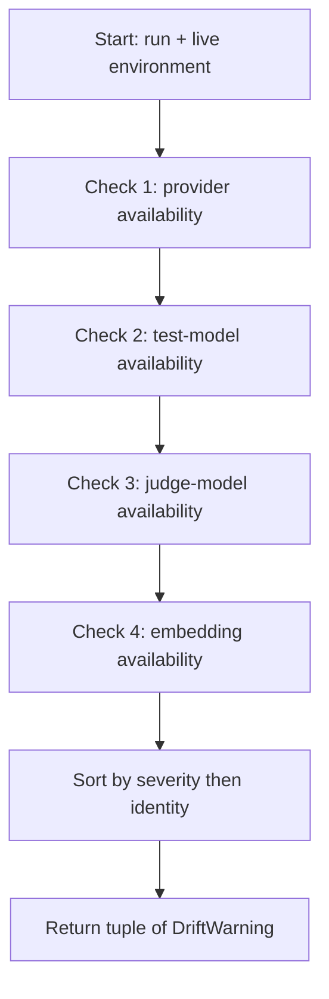

# Algorithm: Run Drift Detector

**Status:** Draft
**Owner:** architect
**Audience:** coder, tester, architect
**Last Updated:** 2026-06-06
**Cross-references:** `08_Cross_Cutting/08-G_feature_flags.md`, `08_Cross_Cutting/08-H_app_modes.md`, `10_Domain_and_Data/02_DTOS_AND_ENUMS.md`, `11_Services_and_Algorithms/01_SERVICE_INVENTORY.md`

The Run Drift Detector compares a run's frozen snapshot — its providers, models, embedding selection, and settings, captured at run creation — against the application's current live configuration at the moment the user asks to resume that run, and produces an ordered list of `DriftWarning` items describing every difference that could affect the resumed run. It exists so that the Resume Summary dialog can warn the user, before they commit, that the world has changed since the run started — a provider was disabled, a model is no longer offered, the embedding model was swapped. This document defines the algorithm; it defines no implementation code.

---

## Table of Contents

1. Purpose
2. Inputs
3. Outputs
4. Preconditions
5. Postconditions
6. Algorithm
7. Configuration
8. Error handling
9. Threading and concurrency
10. Examples
11. Test cases

---

## 1. Purpose

A benchmark run snapshots every execution-relevant input at creation: the participating providers (`BenchmarkRun.providers`), the test/judge/embedding models (`BenchmarkRun.models`), and the per-run settings (`BenchmarkRun.settings_snapshot`). The running pipeline reads only that snapshot, so a run is reproducible regardless of later configuration changes.

But a run can be resumed hours or days after it started or was stopped, and in the meantime the environment may have changed: a provider was disabled or deleted, its endpoint stopped responding, a model was removed from a provider's catalog, or the environment variable holding an API key is no longer set. The pipeline will still resume against the *snapshot*, but the snapshot may now be **unsatisfiable in the current environment**. Resuming blindly would produce a wave of `FAILED_PROVIDER` or `FAILED_INFERENCE` results.

The Run Drift Detector closes that gap. Its scope is deliberately narrow (DD-57): it checks **whether the run's frozen configuration is still satisfiable by the current environment** — provider exists, is enabled, is reachable; frozen models are still served; the frozen API-key environment variable still resolves; the frozen embedding pair is still available. It does **not** report mere configuration *differences*: the resumed pipeline reads only the frozen snapshot (settings, providers, models, embedding pair), so a later change to live settings or to the live embedding selection is invisible to the run and is not drift. Before a resume the detector runs its availability checks and emits a list of `DriftWarning` items; the Resume Summary dialog surfaces these so the user can decide — fix the environment first, resume anyway accepting the warned consequences, or cancel. The detector **only reports**; it never modifies the run, the snapshot, or live configuration, and it never decides whether the resume proceeds.

---

## 2. Inputs

| Input | Type | Source |
|---|---|---|
| `run` | `BenchmarkRun` | The run the user selected to resume, including its `providers`, `models`, and `settings_snapshot` collections. |
| Live provider catalog | `tuple[ProviderConfig, ...]` | The current `providers` table — every provider, with `enabled`, `provider_type`, secrets, and `last_probe_status`. |
| Live model catalog | `mapping ProviderId → tuple[ModelName, ...]` | The currently-known models per provider — the `provider_models` rows plus any discovered models. |
| Process environment | read-only mapping | Used solely to check that each frozen `api_key_raw` environment-variable **name** still resolves to a non-empty value; values are never logged or returned. |
| Live readiness snapshot | `AppReadinessSnapshot` | The latest readiness probe results — `per_provider` `ProviderHealth` entries and `embedding_reachable`. |

The detector reads live configuration; it does not itself run network probes. The Resume use case refreshes the readiness snapshot immediately before invoking the detector, so the `AppReadinessSnapshot` passed in is current.

---

## 3. Outputs

The detector returns an ordered, possibly empty `tuple[DriftWarning, ...]`.

```python
class DriftSeverity(StrEnum):
    BLOCKING = "blocking"      # resume cannot succeed for the affected target without a fix
    WARNING  = "warning"       # an availability check could not be completed; resume may degrade

class DriftKind(StrEnum):
    PROVIDER_NOW_DISABLED         = "provider_now_disabled"
    PROVIDER_NOW_UNREACHABLE      = "provider_now_unreachable"
    PROVIDER_REMOVED              = "provider_removed"
    PROVIDER_ENV_VAR_MISSING      = "provider_env_var_missing"
    MODEL_NO_LONGER_AVAILABLE     = "model_no_longer_available"
    JUDGE_MODEL_UNAVAILABLE       = "judge_model_unavailable"
    EMBEDDING_MODEL_UNAVAILABLE   = "embedding_model_unavailable"
    EMBEDDING_NOW_UNREACHABLE     = "embedding_now_unreachable"

class DriftWarning(msgspec.Struct, frozen=True, kw_only=True, gc=False):
    kind: DriftKind
    severity: DriftSeverity
    provider_id: ProviderIdStr | None = None
    model_name: ModelNameStr | None = None
    headline: NonEmptyStr            # one-line message for the dialog row
    detail: str = ""                 # optional expanded explanation
    pending_results_affected: NonNegativeInt = 0
```

`DriftWarning`, `DriftKind`, and `DriftSeverity` are runtime DTOs — produced fresh on every resume attempt and never persisted; they are not members of the persisted-enum catalog in `10_Domain_and_Data/02_DTOS_AND_ENUMS.md`. `pending_results_affected` counts the run's still-retryable results (status `PENDING` or any retryable terminal-failure status — see §4.3 of the DTO catalog) that the warned condition would touch.

The list is ordered: all `BLOCKING` warnings first, then `WARNING`; within each severity, by `provider_id` then `model_name` for stable display.

---

## 4. Preconditions

- `run.status` is a resumable status — `INCOMPLETE`, `STOPPED`, or `FAILED` — and the run has at least one non-terminal or retryable-terminal result (otherwise there is nothing to resume and the detector is not invoked).
- The live provider catalog, model catalog, embedding config, and readiness snapshot have all been refreshed by the Resume use case immediately before the detector runs.
- The `run` object carries fully-populated `providers`, `models`, and `settings_snapshot` collections.

---

## 5. Postconditions

- The detector returns a list of `DriftWarning` items; the list is empty exactly when the current environment still satisfies the run's frozen configuration in every checked dimension.
- The detector has made no change to the run, the snapshot, the provider/model/embedding catalogs, or live settings — it is strictly read-only.
- Every warning names enough identity (`provider_id`, `model_name`) for the dialog to attribute it to a concrete snapshot element.
- The severity ordering of the returned list is stable and as defined in §3.
- The resume decision is unaffected by the detector itself: the detector reports; the Resume Summary dialog and the user decide.

---

## 6. Algorithm

The detector runs four availability checks in order (DD-57 — environment satisfiability only; no settings-difference check exists). Each appends zero or more `DriftWarning` items to a result list; the list is sorted at the end.



### 6.1 Check 1 — provider drift

For each `BenchmarkRunProviderEntry` in `run.providers`, locate the live `ProviderConfig` with the same `provider_id`:

| Live state | `DriftKind` | Severity |
|---|---|---|
| No live provider with that `provider_id` | `PROVIDER_REMOVED` | `BLOCKING` |
| Live provider exists but `enabled == False` | `PROVIDER_NOW_DISABLED` | `BLOCKING` |
| Live provider enabled but its `ProviderHealth.reachable == False` in the readiness snapshot | `PROVIDER_NOW_UNREACHABLE` | `BLOCKING` |
| Live provider enabled and reachable, but the snapshot's frozen `api_key_raw` names an environment variable that is now unset or empty in the process environment (checked only when the frozen value is non-empty) | `PROVIDER_ENV_VAR_MISSING` | `BLOCKING` |

The env-var check resolves the snapshot's frozen `api_key_raw` **name** against the current process environment and tests only set-and-non-empty; the resolved value is never logged, surfaced, or returned. Live-catalog field *differences* (a rotated key name, an edited base URL) are **not** drift: the pipeline resumes through the run's frozen provider snapshot, so live edits are invisible to it. `pending_results_affected` for a provider warning is the count of retryable results whose `provider_id` matches. A `BLOCKING` provider warning subsumes the model warnings for that provider (Check 2 still records them, but the dialog groups them under the provider — see §6.7).

### 6.2 Check 2 — test-model drift

For each `BenchmarkRunModelEntry` in `run.models` with `role == ModelRole.TEST`:

- If the model's `provider_id` already produced a `BLOCKING` provider warning in Check 1, **skip** the per-model availability check — the provider problem already covers it — but still attribute the affected pending results to the provider warning.
- Otherwise, look up the live model catalog for that `provider_id`. If `model_name` is **not** in the live model list:
  - emit `MODEL_NO_LONGER_AVAILABLE`, severity `BLOCKING`, with `provider_id` and `model_name` set, and `pending_results_affected` equal to the count of this target's retryable results.

A test model that is still advertised produces no warning. The detector checks **advertisement only** — presence in the live model listing — not loadability (SPEC-048): it does not probe or load the model. A model that is advertised but cannot actually load is caught at run time by warmup (a warmup timeout is a provider failure, `11_Services_and_Algorithms/08_CIRCUIT_BREAKER.md`), not by drift detection.

### 6.3 Check 3 — judge-model drift

If `run.models` contains a `JUDGE`-role entry and the run actually needs the judge — that is, the snapshot's `eval.phase_judge_enabled` is `true` *or* `feature.judge_run_analysis_enabled` is `true`:

- Resolve the judge's `provider_id` against Check 1's results. If that provider is `BLOCKING`-warned, the judge is implicitly unavailable; emit `JUDGE_MODEL_UNAVAILABLE`, severity `BLOCKING`, with `detail` pointing at the provider warning.
- Otherwise, if the judge `model_name` is not in the live model catalog for its provider, emit `JUDGE_MODEL_UNAVAILABLE`, severity `BLOCKING`.

If the run does not need the judge (both flags off in the snapshot), judge-model drift is not checked — a missing judge model cannot affect a run that never calls the judge.

### 6.4 Check 4 — embedding drift

Embedding drift is checked only when the run's snapshot needs embeddings — that is, the snapshot's `eval.phase_cosine_enabled` is `true` (the cosine phase consumes the embedding model). If the run never runs a cosine phase, embedding drift is not checked.

When embeddings are needed, the detector checks the **frozen pair itself** — the run's `EMBEDDING`-role `BenchmarkRunModelEntry` `(provider_id, model_name)` — against the current environment. The application's *live* embedding selection is irrelevant and is not consulted (DD-57): the resumed cosine phase always uses the frozen pair, so a changed live selection is not drift.

| Environment state of the frozen pair | `DriftKind` | Severity |
|---|---|---|
| The frozen pair's provider is removed, disabled, or unreachable (per Check 1 results / the readiness snapshot) | `EMBEDDING_NOW_UNREACHABLE` | `BLOCKING` |
| The provider is available but the frozen embedding model is no longer in its live model catalog | `EMBEDDING_MODEL_UNAVAILABLE` | `BLOCKING` |

Both warnings carry `detail` naming the frozen `(provider, model)` pair and the failing condition, and `pending_results_affected` counts the retryable results whose cosine grading would be degraded. When the frozen pair's provider already produced a `BLOCKING` warning in Check 1, the embedding warning's `detail` points at it rather than repeating the diagnosis.

### 6.5 Assembly and ordering

After the four checks, the detector sorts the accumulated list: `BLOCKING` before `WARNING`; within a severity, by `provider_id` (nulls last) then `model_name` (nulls last). It returns the sorted tuple. An empty tuple means the current environment fully satisfies the run's frozen configuration.

There is **no settings-difference check** (DD-57). The run resumes against its frozen `settings_snapshot` by construction (`08_Cross_Cutting/08-C_settings_hierarchy.md` §7); how those frozen values relate to current defaults or current user-saved values has no effect on the resumed run and is not the detector's concern. The Resume Summary dialog's static "Settings note" line already tells the user the run resumes with its original settings.

### 6.6 How the Resume Summary dialog surfaces the warnings

The Resume Summary dialog is shown before any resumed task runs. It presents the `DriftWarning` list as a grouped, severity-coloured panel:

- **`BLOCKING` warnings** are shown in a red-accented group at the top, each with its `headline` and an expandable `detail`. Model warnings whose provider also has a `BLOCKING` warning are nested under the provider warning. While any `BLOCKING` warning is present, the dialog's **Resume** button carries a confirmation step: the user must tick "Resume anyway — affected tasks will fail" before Resume is enabled, and the dialog states how many `pending_results_affected` will be recorded as `FAILED_PROVIDER` / `FAILED_INFERENCE` if they proceed unfixed.
- **`WARNING` items** are shown in an amber group; they do not gate the Resume button. They tell the user an availability check could not be completed (for example a stale readiness snapshot — §8).
- The dialog also offers **Fix in Settings** for `BLOCKING` provider/embedding warnings — a button that closes the dialog and opens the Settings dialog at the relevant tab, after which the user can re-open Resume and the detector re-runs against the now-fixed configuration.
- An **empty** drift list produces no warning panel at all; the Resume Summary shows only the normal task-selection summary.

The dialog never auto-resolves drift. The detector reports, the dialog surfaces, the user acts.

---

## 7. Configuration

The Run Drift Detector has no setting keys of its own; it is not a tunable behaviour and does not appear in the `08-G` flag registry. It does, however, **read** snapshot setting values to decide which checks apply:

| Snapshot key read | Used by | Effect |
|---|---|---|
| `eval.phase_judge_enabled` | Check 3 | Judge-model drift is checked only when this is `true` or `feature.judge_run_analysis_enabled` is `true`. |
| `feature.judge_run_analysis_enabled` | Check 3 | Together with the above, gates the judge check. |
| `eval.phase_cosine_enabled` | Check 4 | Embedding drift is checked only when the run runs a cosine phase. |

These are read from `run.settings_snapshot` — the run's frozen values — never from the live User-Saved layer, because the question is what *this run* will do when resumed.

---

## 8. Error handling

| Situation | Handling |
|---|---|
| The run has no `providers` or no `models` in its snapshot | Treated as a corrupt run record. The detector returns a single `BLOCKING` warning with `kind = PROVIDER_REMOVED` and a `detail` of "Run snapshot is incomplete"; the Resume use case escalates this to a run-integrity error and blocks resume. |
| The readiness snapshot is stale or `None` | The Resume use case must refresh it first (a precondition). If it is nonetheless absent, the detector treats every provider's reachability as unknown and emits `PROVIDER_NOW_UNREACHABLE` as a `WARNING` (not `BLOCKING`) so the user is told the check could not be completed rather than being falsely blocked. |
| The live model catalog is empty for a provider that is reachable (`ZERO_MODELS`) | Every test/judge model for that provider yields `MODEL_NO_LONGER_AVAILABLE` / `JUDGE_MODEL_UNAVAILABLE`; the provider itself yields no warning beyond those (it is reachable, just empty). |

The detector itself **never raises** to the Resume use case: every dimension it cannot evaluate is downgraded to a `WARNING` describing the uncertainty, so the user is always informed rather than blocked by an exception.

---

## 9. Threading and concurrency

- The detector is **synchronous** and **pure** with respect to application state: it reads the run snapshot and the already-gathered live catalogs and readiness snapshot, and produces a value. It performs no network I/O — readiness probing is done beforehand by the Resume use case.
- It runs as part of the Resume use case. Because it touches no network, it is fast enough to run on the Qt main thread when the Resume Summary dialog is being assembled; if the run is large the use case may run it on a short-lived `QThreadPool` task and deliver the result to the dialog via a signal. Either way it holds no locks and shares no mutable state.
- The detector reads the database catalogs through the persistence layer (`RunsStore` for the source run header and its snapshots; `ProvidersStore` for the live provider catalog and embedding-config row; `ModelCapabilitiesStore` for the observed capability cache when relevant) like any other read; those reads are normal synchronous queries and are consistent because no run is executing while a resume is being prepared (resume is available only from a terminal or no-run state — see `08_Cross_Cutting/08-H_app_modes.md` §10).
- The detector is **idempotent**: running it twice against the same run and the same live configuration yields the same list. After the user fixes a configuration issue via "Fix in Settings", re-opening Resume re-runs the detector against the updated configuration and the resolved warnings disappear.

---

## 10. Examples

### 10.1 Happy path — no drift

A run is stopped and resumed an hour later. Every snapshot provider is still present, enabled, and reachable; every test model and the judge model are still in their providers' live catalogs; the live embedding selection still names the snapshot's embedding model and it is reachable; no snapshot setting diverges from the current defaults. The detector returns an **empty tuple**. The Resume Summary dialog shows only the task-selection summary, with no warning panel, and Resume is enabled directly.

### 10.2 Edge case — disabled provider with pending work

Since the run was stopped, the user disabled the provider `ollama_local`. The run has 40 retryable results for two test models served by that provider. Check 1 finds the live `ProviderConfig` with `enabled == False` and emits `PROVIDER_NOW_DISABLED`, `BLOCKING`, `provider_id = ollama_local`, `pending_results_affected = 40`. Check 2 sees that `ollama_local` already has a `BLOCKING` warning and skips the per-model availability check, attributing the model results to the provider warning. The Resume Summary dialog shows a red group: "Provider 'ollama_local' is now disabled — 40 pending tasks would fail." Resume is gated behind the "Resume anyway" tick, and a **Fix in Settings** button opens the Providers tab. If the user re-enables the provider and reopens Resume, the detector re-runs and the warning is gone.

### 10.3 Edge case — frozen embedding model no longer served, cosine phase enabled

A `GRADED` run's snapshot has `eval.phase_cosine_enabled = true` and an `EMBEDDING`-role model `(ollama_local, nomic-embed-text)`. Since the run started, the user deleted `nomic-embed-text` from the Ollama installation. Check 4 finds the frozen pair's provider available but the frozen model absent from its live model catalog and emits `EMBEDDING_MODEL_UNAVAILABLE`, severity `BLOCKING`, with `detail`: "This run grades with embedding model 'nomic-embed-text' on 'ollama_local', which no longer serves it. Pull the model again or resume anyway — affected tasks will grade without a cosine score." Resume is gated behind the "Resume anyway" tick. Note what is *not* drift: if the user had merely switched the application's live embedding selection to another model, no warning would be emitted — the resumed cosine phase uses the frozen pair regardless (DD-57).

### 10.4 Edge case — judge not needed, judge model missing

A `TASKS` run's snapshot has `feature.judge_run_analysis_enabled = false`. The run mode is `TASKS`, which never runs the per-task judge phase, and the optional run-level analysis is off, so the run will never call a judge. The snapshot still carries a `JUDGE`-role model whose provider has since been removed. Check 3 sees that the run needs no judge and **skips** the judge check entirely; no `JUDGE_MODEL_UNAVAILABLE` is emitted. A judge model the run will never call cannot cause drift.

---

## 11. Test cases

| # | Scenario | Setup | Expected |
|---|---|---|---|
| T-1 | No drift returns empty | live config fully satisfies the snapshot | empty tuple; dialog shows no warning panel. |
| T-2 | Provider removed | a snapshot provider absent from the live catalog | one `PROVIDER_REMOVED`, `BLOCKING`. |
| T-3 | Provider disabled | a snapshot provider live but `enabled == False` | one `PROVIDER_NOW_DISABLED`, `BLOCKING`; `pending_results_affected` equals retryable results for that provider. |
| T-4 | Provider unreachable | provider enabled but `ProviderHealth.reachable == False` | one `PROVIDER_NOW_UNREACHABLE`, `BLOCKING`. |
| T-5 | Frozen env var no longer set | snapshot `api_key_raw` names `OPENAI_API_KEY`; the variable is unset in the process environment | one `PROVIDER_ENV_VAR_MISSING`, `BLOCKING`; the value is never read into the warning. A live-catalog edit to the same provider's fields produces **no** warning. |
| T-6 | Test model gone | a `TEST` model absent from its provider's live catalog | one `MODEL_NO_LONGER_AVAILABLE`, `BLOCKING`. |
| T-7 | Model warning skipped under provider block | a `TEST` model on a `BLOCKING`-warned provider | no separate `MODEL_NO_LONGER_AVAILABLE`; results attributed to the provider warning. |
| T-8 | Judge missing and needed | judge enabled in snapshot, judge model gone | one `JUDGE_MODEL_UNAVAILABLE`, `BLOCKING`. |
| T-9 | Judge missing but not needed | both judge flags off in snapshot, judge model gone | no judge warning emitted. |
| T-10 | Frozen embedding provider unavailable, cosine on | snapshot `eval.phase_cosine_enabled = true`; the frozen pair's provider is disabled or unreachable | one `EMBEDDING_NOW_UNREACHABLE`, `BLOCKING`. |
| T-11 | Live embedding selection changed — NOT drift | live selection differs from the frozen pair; the frozen pair itself is still available | **no embedding warning** (DD-57); the resume uses the frozen pair. |
| T-12 | Embedding drift skipped, cosine off | snapshot `eval.phase_cosine_enabled = false` | no embedding warning regardless of live config. |
| T-13 | Frozen embedding model gone | frozen pair's provider available but the model absent from its live catalog | one `EMBEDDING_MODEL_UNAVAILABLE`, `BLOCKING`. |
| T-14 | Settings difference is NOT drift | a snapshot key differs from the current default and from the current user-saved value | **no warning of any kind** (DD-57); the run resumes on its frozen snapshot. |
| T-15 | Ordering | a mix of `BLOCKING` and `WARNING` warnings | list ordered `BLOCKING` → `WARNING`, then by `provider_id`/`model_name`. |
| T-16 | Stale readiness downgrades severity | readiness snapshot absent | reachability warnings emitted as `WARNING`, not `BLOCKING`; no exception. |
| T-17 | Idempotent re-run after a fix | resolve a `BLOCKING` issue in Settings, re-run | the resolved warning disappears; remaining warnings unchanged. |
| T-18 | Detector is read-only | run the detector | run record, snapshot, and live catalogs unchanged. |
