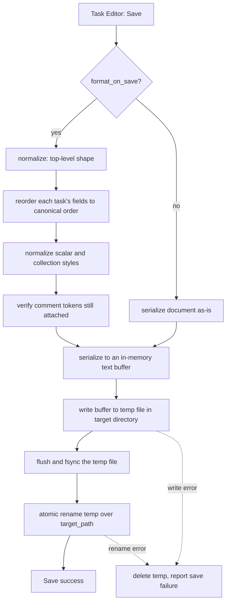

# Algorithm: YAML Formatter

**Status:** Draft
**Owner:** coder
**Audience:** coder
**Last Updated:** 2026-06-06
**Cross-references:** `10_Domain_and_Data/02_DTOS_AND_ENUMS.md`, `11_Services_and_Algorithms/14_VALIDATION_CASCADE.md`, `09_Task_Editor/field_reference.md`, `16_CONCURRENCY_MODEL.md`

The YAML formatter is the comment-preserving serializer for task files. It writes a task file's `tasks:` list in a fixed canonical field order, keeps every user comment anchored to the construct it was written against, and commits the file atomically — a temporary file written then renamed over the target — so a save never leaves a partially written file on disk. It is the component the Task Editor invokes on Save.

---

## Table of Contents

1. Purpose
2. Inputs
3. Outputs
4. Preconditions
5. Postconditions
6. Algorithm
7. Configuration
8. Error handling
9. Threading and concurrency
10. Examples
11. Test cases

---

## 1. Purpose

A task file is a human-authored, human-maintained YAML document. Its authors annotate tasks with comments — rationale, provenance, "do not change this", section headers. A naive serializer that re-emits a parsed object discards every comment and re-orders fields unpredictably; that destroys the file as a maintainable artifact.

The YAML formatter exists so that:

- A round-trip (load, edit one field, save) preserves every comment, the comment's position relative to its construct, and every field the editor did not change.
- Every saved file has the same deterministic shape: a top-level `tasks:` list, each task's fields in one canonical order, two-space indentation, consistent block/flow styles. Tooling and diffs become predictable.
- A save is atomic: an interrupted save (crash, power loss, disk-full) leaves either the previous file intact or the new file complete — never a truncated file.

The formatter is the single writer of task files. The Task Editor never serializes YAML itself.

---

## 2. Inputs

| Input | Type | Meaning |
|---|---|---|
| `document` | round-trip YAML document handle | The in-memory representation produced when the file was loaded, carrying both data and the attached comment tokens. The editor mutates field values on this handle; the formatter serializes it. |
| `target_path` | `str` | The absolute path of the `.yaml` / `.yml` file to write. |
| `format_on_save` | `bool` | Whether to apply canonical field ordering and style normalization; sourced from the `task_editor.auto_format_on_save` setting (default `true`). |

The formatter does not accept a plain list of `BenchmarkTask` records: a record set carries no comments. It always operates on the round-trip document handle so the comment tokens travel with the data.

A task file that the editor created from scratch starts as an empty round-trip document with a single empty `tasks:` sequence; from that point it is treated identically to a loaded file.

---

## 3. Outputs

| Output | Effect |
|---|---|
| The file at `target_path` | Overwritten with the serialized, canonically ordered, comment-preserving YAML. |
| Save result | A success indication, or a typed save failure (see §8). The formatter never partially writes the target. |

The formatter produces no DTO. Its observable output is the file on disk.

---

## 4. Preconditions

- `target_path` ends in `.yaml` or `.yml`. A different extension is rejected before the formatter is reached (file-level validation, `field_reference.md`).
- `document` parses: it was produced by the round-trip loader, or it is a freshly created empty document. The formatter does not re-parse text; it serializes the handle it is given.
- The directory containing `target_path` exists and is writable. If it is not, the save fails cleanly (§8).
- The editor has resolved every **hard** validation error for the file. Save is disabled while a hard error stands (`14_VALIDATION_CASCADE.md`); the formatter is never asked to write a hard-invalid file. Soft warnings and soft info do not block a save.

---

## 5. Postconditions

On success:

- `target_path` contains a well-formed YAML document with a top-level `tasks:` key whose value is a sequence (`tasks: []` when the file has no tasks).
- When `format_on_save` is `true`, every task maps its fields in the canonical order of §6.3, with the styles of §6.4.
- Every comment present in the input `document` is present in the output, anchored to the same construct (§6.5).
- The file is UTF-8 with no byte-order mark and ends with exactly one trailing newline.
- The previous contents of `target_path` are fully replaced; no temporary file remains.

On failure:

- `target_path` retains its previous contents unchanged. No temporary file remains (a best-effort cleanup removes it).

---

## 6. Algorithm

### 6.1 Library choice

The formatter is built on **`ruamel.yaml`** in round-trip mode. `ruamel.yaml`'s round-trip loader attaches comment tokens to the data structure it builds, so a comment survives a load/modify/dump cycle. The Python standard `yaml` module and `PyYAML` discard comments on load and cannot satisfy the round-trip postcondition; they are not used for writing task files.

The round-trip loader is configured with: two-space block indentation, two-space sequence indentation with the sequence dash offset, no line-width wrapping (long scalars are not folded), and block style preferred for mappings and non-empty sequences.

### 6.2 Save pipeline



### 6.3 Canonical field order

When `format_on_save` is `true`, the formatter rewrites each task mapping so its keys appear in this fixed order. The order matches the `BenchmarkTask` field grouping in `02_DTOS_AND_ENUMS.md` and the Task Editor field reference:

```
task_id
category
sub_category
cosine_enabled
difficulty
question
golden_answer
pass_criteria
fail_criteria
required_terms        # nested mapping; its keys ordered: exact, semantic, forbidden
source_language
target_language
source_material
fail_example
```

Rules for ordering:

- A key present in the task is emitted at its canonical position. A canonical key absent from the task is **not** inserted — the formatter never adds a field the user did not write.
- A non-canonical key (a key not in the list above — for example a future or hand-added custom key) is preserved and emitted after the last canonical key present, in its original relative order. The formatter never drops an unknown key.
- Within `required_terms`, the three lists are ordered `exact`, `semantic`, `forbidden`; an absent list is not inserted.
- The top-level shape is normalized to Form A — a single `tasks:` key whose value is the sequence of task mappings. A file loaded as a bare sequence (Form B) or a single mapping (Form C) is converted to Form A in memory before serialization, so Save always writes Form A.

### 6.4 Style normalization

When `format_on_save` is `true`:

- **Multi-line strings** (any scalar containing a newline — `question`, `golden_answer`, `source_material`, `fail_example`, multi-line criteria) are emitted as YAML literal block scalars (`|`), preserving line breaks and indentation verbatim.
- **Single-line strings** are emitted as plain scalars unless the value requires quoting (leading/trailing whitespace, a leading indicator character, a value that would otherwise parse as a non-string); in that case the minimal necessary quoting is applied.
- **Lists** (`required_terms.exact` / `.semantic` / `.forbidden`) with two or more items are emitted in block style, one item per line; an empty list is emitted in flow style as `[]`; a single-item list is emitted in block style.
- **Indentation** is two spaces throughout.
- The document ends with exactly one trailing newline; the file is UTF-8 with no BOM.

When `format_on_save` is `false`, the formatter skips §6.3 and §6.4 entirely and serializes the document in whatever order and style it currently carries; it still normalizes the top-level shape to Form A and still saves atomically (§6.6).

### 6.5 Comment anchoring and preservation

`ruamel.yaml` round-trip mode attaches each comment to a position token on the data structure. The formatter relies on and protects these anchors:

- **End-of-line comments** (`difficulty: hard  # multi-step`) are attached to their key/value pair and travel with that pair even when §6.3 moves the pair to its canonical position.
- **Standalone comment lines** above a key are attached as a "pre-comment" of that key; they move with the key.
- **Comments above a sequence item** (above a `- task_id:` line) are attached as a pre-comment of that task mapping and travel with the whole task if the task's position in the sequence changes.
- **Leading file comments** (a comment block before `tasks:`) are attached to the document head and are re-emitted at the top of the file.
- **Trailing file comments** are attached to the document tail and re-emitted at the end.

The formatter never re-flows, re-wraps, or re-indents the text inside a comment; a comment's character content is emitted verbatim. Reordering keys (§6.3) moves a key together with its attached pre-comment and end-of-line comment as one unit, so a comment never detaches from the construct it was written against. After reordering and before serialization, the formatter verifies that the count of comment tokens on the document is unchanged; a mismatch is treated as a defect (§8).

A comment written *between* two keys that §6.3 then reorders past each other stays attached to whichever key it was anchored to; the formatter does not attempt to re-derive intent. This is the one acknowledged limitation and is documented for task-file authors: anchor a comment to the key it describes, not to the blank space between keys.

### 6.6 Atomic save

The file is committed by the write-temp-then-rename pattern, so a partially written file is never visible at `target_path`:

1. Serialize the document into an in-memory text buffer (the full file content).
2. Create a uniquely named temporary file in the **same directory** as `target_path` (same directory so the final rename is on one filesystem and therefore atomic).
3. Write the entire buffer to the temporary file.
4. Flush the temporary file and `fsync` it so its contents reach stable storage.
5. Atomically rename the temporary file over `target_path`. On a POSIX filesystem `rename` is atomic and replaces the target in one step; a reader of `target_path` sees either the old file or the new file, never an intermediate state.
6. If any step fails, delete the temporary file (best effort) and report the failure; `target_path` is untouched.

The temporary file is created with the same permissions intent as a normal user file. The original file's permissions, where the platform allows, are preserved across the replace.

### 6.7 Invocation from the Task Editor

The Task Editor calls the formatter at exactly one point — the Save action for a file (toolbar Save, the per-file Save control, or Save All applied to that file). The sequence:

1. The user edits field values; the editor mutates the round-trip `document` handle in memory. The validation cascade (`14_VALIDATION_CASCADE.md`) keeps the file's badge current.
2. Save is enabled only while the file has no hard error.
3. On Save, the editor passes the `document` handle, the `target_path`, and the current `task_editor.auto_format_on_save` value to the formatter.
4. The formatter runs the pipeline of §6.2 off the UI thread (§9).
5. On success the editor marks the file clean and clears its dirty indicator. On failure the editor surfaces the typed error (§8) and keeps the file dirty so the user can retry.

Save never runs implicitly on focus loss or on a timer; it is always an explicit user action.

---

## 7. Configuration

| Setting key | Type | Default | Effect |
|---|---|---|---|
| `task_editor.auto_format_on_save` | bool | `true` | When `true`, Save applies canonical field ordering (§6.3) and style normalization (§6.4). When `false`, Save preserves the document's current order and styles and only normalizes the top-level shape and saves atomically. |

The canonical field order, the indentation width (two spaces), the literal-block threshold, and the empty-list flow style are fixed constants of the formatter, not settings. Atomic save (§6.6) is unconditional and cannot be disabled.

---

## 8. Error handling

The formatter reports a typed save failure to the Task Editor; it does not raise to the wider application. In every failure case `target_path` keeps its previous contents.

| Failure | Cause | Handling |
|---|---|---|
| Directory not writable | The directory of `target_path` cannot be written. | The temporary-file creation fails; report a `SaveFailed` with the path and the OS reason; no temporary file remains. |
| Disk full during write | The buffer cannot be fully written to the temporary file. | The write step fails; delete the partial temporary file; report `SaveFailed`; `target_path` untouched. |
| Rename failed | The atomic rename over `target_path` fails (target locked, cross-device after a path change). | Delete the temporary file; report `SaveFailed`; `target_path` untouched. |
| Comment-token count mismatch | After reordering, the document carries a different number of comment tokens than before. | Abort the save before writing anything; report an internal `FormatterDefect`. This is a programmer error — it must never occur in a correct build and is covered by the test suite. |
| `format_on_save` is `false` | Not an error. | Skip §6.3 and §6.4; still perform §6.6. |

The formatter never raises on a soft-warning or soft-info validation state — those never block a save. Hard validation errors are filtered out upstream (Save is disabled), so the formatter is never asked to write a hard-invalid file; if it nonetheless receives one, it still produces syntactically valid YAML (the editor's invariant, not the formatter's, is the data validity).

---

## 9. Threading and concurrency

- **Off the UI thread.** Serialization plus the temp-write-fsync-rename sequence is file I/O; it runs on the background executor described in `16_CONCURRENCY_MODEL.md`, never on the Qt UI thread. The Save action shows a brief busy state and resolves when the formatter signals completion back to the UI thread.
- **One save per file at a time.** The editor disables the Save control for a file while that file's save is in flight, so the formatter never runs two concurrent saves against the same `target_path`.
- **Document handle ownership.** The `document` handle is owned by the editor on the UI thread. The editor passes a stable handle to the formatter and does not mutate it while the save is in flight; the formatter only reads it. This avoids any need for locking on the handle.
- **Atomicity boundary.** The atomicity guarantee is the filesystem `rename`; it covers a crash between steps 3 and 5. It does not cover two separate processes writing the same file — the application is a single desktop process, so concurrent external writers are out of scope.
- **Cancellation.** A save is short and is not cancellable mid-flight; if the application is closing, the save is allowed to finish so the rename either completes or is cleanly abandoned with the temporary file removed.

---

## 10. Examples

### 10.1 Happy path — edit one field, comments preserved, fields reordered

Input file (`task_editor.auto_format_on_save` is `true`):

```yaml
# Coding tasks — Java
tasks:
  - task_id: coding_java_two_sum
    question: |
      Implement twoSum in Java.
    difficulty: hard   # tuned
    difficulty: medium
    category: Coding
```

The user changes `difficulty` from `medium` to `hard` and saves.

1. The editor mutates `difficulty` on the `document` handle.
2. `format_on_save` is `true`: each task's keys are reordered to the canonical order — `task_id`, `category`, `difficulty`, `question`.
3. The end-of-line comment `# tuned` travels with the `difficulty` pair to its new position; the file-head comment `# Coding tasks — Java` stays at the top.
4. The document is serialized to a buffer, written to a temp file in the same directory, fsynced, and renamed over the file.

Output file:

```yaml
# Coding tasks — Java
tasks:
  - task_id: coding_java_two_sum
    category: Coding
    difficulty: hard   # tuned
    difficulty: hard
    question: |
      Implement twoSum in Java.
```

Every comment is preserved and anchored; the fields are canonically ordered; `pass_criteria` and the other absent fields were not inserted.

### 10.2 Edge case — empty task file

The user creates a new task file and saves it without adding a task. The formatter normalizes the top-level shape to Form A and emits:

```yaml
tasks: []
```

The empty list is emitted in flow style per §6.4. The file is a valid, well-formed task file with zero tasks.

### 10.3 Edge case — atomic save survives a write failure

The user saves a file to a directory that fills up mid-write. The formatter serializes the buffer, creates the temporary file, and begins writing; the write fails with a disk-full error. The formatter deletes the partial temporary file and reports `SaveFailed`. The original `target_path` is byte-for-byte unchanged — the user has not lost the previous version — and the editor keeps the file marked dirty so the save can be retried after freeing space.

---

## 11. Test cases

| ID | Scenario | Expected |
|---|---|---|
| YF-1 | Load a commented file, save with no edits, `format_on_save` true | Every comment preserved and anchored; fields in canonical order. |
| YF-2 | End-of-line comment on a field that reordering moves | The comment moves with the field; it stays on the same line as the field. |
| YF-3 | Standalone comment above a key that reordering moves | The pre-comment moves with the key. |
| YF-4 | File-head and file-tail comments | Re-emitted at the top and bottom respectively. |
| YF-5 | A non-canonical (unknown) key in a task | Preserved and emitted after the last canonical key; never dropped. |
| YF-6 | A task missing optional fields (`pass_criteria`, `source_language`) | Absent fields are not inserted; only present fields are written. |
| YF-7 | `required_terms` with `semantic` before `exact` in source | Saved with the keys ordered `exact`, `semantic`, `forbidden`. |
| YF-8 | Multi-line `question` | Emitted as a literal block scalar (`\|`); line breaks preserved verbatim. |
| YF-9 | `required_terms.exact` with three items | Emitted in block style, one item per line. |
| YF-10 | An empty `required_terms.forbidden` list | Emitted in flow style as `[]`. |
| YF-11 | A file loaded in Form B (bare sequence) | Saved as Form A with a top-level `tasks:` key. |
| YF-12 | A file loaded in Form C (single mapping) | Saved as Form A with a one-item `tasks:` sequence. |
| YF-13 | A newly created empty task file | Saved as `tasks: []`. |
| YF-14 | `format_on_save` false | Field order and styles preserved as-is; top-level shape still Form A; still saved atomically. |
| YF-15 | Save to a non-writable directory | `SaveFailed` reported; original file unchanged; no temp file remains. |
| YF-16 | Write fails mid-save (simulated disk-full) | `SaveFailed` reported; original file byte-for-byte unchanged; temp file deleted. |
| YF-17 | Crash simulated between temp write and rename | `target_path` still holds the previous complete file; no truncation. |
| YF-18 | Output encoding and newline | UTF-8, no BOM, exactly one trailing newline. |
| YF-19 | Comment-token count after reordering | Equal to the count before reordering; otherwise `FormatterDefect`. |
| YF-20 | Round-trip determinism | Loading then saving the formatter's own output with no edits produces a byte-identical file. |
| YF-21 | Indentation | Two-space block indentation throughout the saved file. |
| YF-22 | Save runs off the UI thread | The formatter executes on the background executor; the UI thread is not blocked. |
