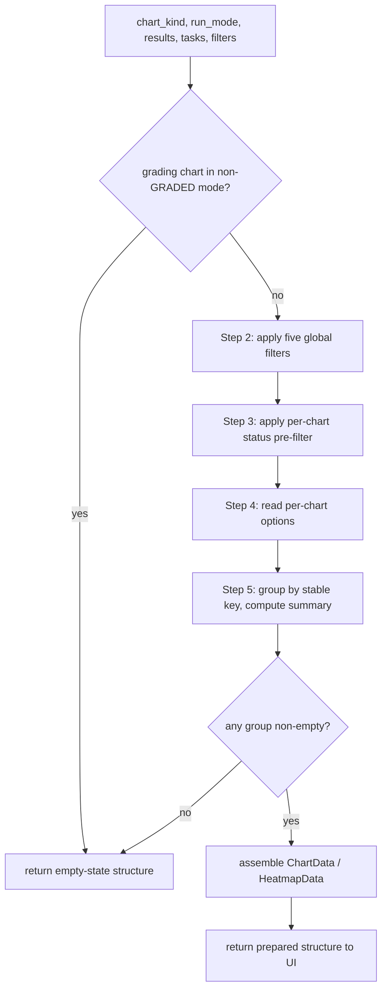

# Algorithm: Chart Aggregators

**Status:** Draft
**Owner:** coder
**Audience:** coder
**Last Updated:** 2026-06-06
**Cross-references:** `10_Domain_and_Data/02_DTOS_AND_ENUMS.md`, `10_Domain_and_Data/01_DOMAIN_MODEL.md`, `11_Services_and_Algorithms/10_MODE_VISIBILITY_POLICY.md`, `11_Services_and_Algorithms/16_CONCURRENCY_MODEL.md`, `05_Result_Widget/tabs/charts_tab.md`

The chart-aggregation service (the "chart service") turns the raw `BenchmarkResult` rows of one run into the prepared, plot-ready data structures the Result widget renders. It owns one aggregator per `ChartKind`: each aggregator answers a single analytical question, applies the active filters, computes one numeric summary, and returns a typed chart-data structure. The service performs all numeric work on a background worker; the UI receives a finished structure and only paints it. Grading-derived charts are computed only for `GRADED` runs; in `SYNTHETIC` and `TASKS` runs those aggregators are not offered.

---

## Table of Contents

1. Purpose
2. Inputs
3. Outputs
4. Preconditions
5. Postconditions
6. Algorithm
7. Per-chart catalog
8. Configuration
9. Error handling
10. Threading and concurrency
11. Examples
12. Test cases

---

## 1. Purpose

The chart service exists so that:

- Every chart is computed by one named, independently testable aggregator keyed by `ChartKind`.
- The UI never touches the data store and never performs aggregation arithmetic; it receives a finished `ChartData` (or `HeatmapData`) structure and renders it.
- Filtering, outlier handling, and mode gating are applied uniformly and in one place.
- Charts can be re-computed cheaply (from a cached result set) when filters change or new results arrive.

The service answers twelve questions, one per chart. The questions, the input data, the output data, the computation, the mode availability, and the per-chart filters are tabulated in §7.

---

## 2. Inputs

| Input | Type | Meaning |
|---|---|---|
| `chart_kind` | `ChartKind` | Which of the twelve aggregators to run. |
| `run_mode` | `RunMode` | The mode of the run; gates grading charts. |
| `results` | `tuple[BenchmarkResult, ...]` | Every result row of the run. Supplied as a snapshot from the result cache, not re-queried per chart. |
| `tasks` | `tuple[BenchmarkTask, ...]` | The run's frozen tasks; supplies `category`, `difficulty`, and `task_id` ordering for category, heatmap, and difficulty filtering. |
| `filters` | `ChartFilters` | The active global filter selection plus the per-chart options (see §6.2 and §7). |

`ChartData`, `HeatmapData`, `ChartFilters`, and `ChartSeries` are the chart DTOs defined in `10_Domain_and_Data/02_DTOS_AND_ENUMS.md`; this document does not redefine them. A model identity is always the composite `ModelDescriptor` pair `(provider_id, model_name)`; no aggregator groups by `model_name` alone.

---

## 3. Outputs

| Output | Type | Used by |
|---|---|---|
| Bar / stacked-bar / grouped-bar / scatter / box-plot charts | `ChartData` | The Result widget chart canvas; PNG/SVG export. |
| Heatmap chart (`HEATMAP_TASK_BY_MODEL`) | `HeatmapData` | The Result widget heatmap canvas; PNG/SVG export. |
| Empty-state marker | `ChartData` / `HeatmapData` with an empty series set and a populated `empty_state_message` | The UI renders the message instead of axes. |

A `ChartData` carries: the chart kind; the chart category labels (x-axis ticks or scatter point labels); one or more `ChartSeries` (a named, ordered numeric vector, optionally with a colour hint); axis titles and units; and, where relevant, auxiliary geometry (the Pareto frontier point list, scatter point-to-`result_id` back-references for drill-down, box-plot five-number summaries). A `HeatmapData` carries row labels (`task_id`), column labels (`(provider_id, model_name)`), and a cell-value matrix.

The output is purely descriptive data. It contains no Qt objects, no colours resolved to theme tokens (the UI resolves colours), and no rendering instructions.

---

## 4. Preconditions

- A run exists and its `results` snapshot has been loaded into the result cache.
- `tasks` is the run's frozen task set; it is non-empty for any run that has produced results.
- For a grading chart (`PASS_RATE_BY_MODEL`, `AVG_COSINE_BY_MODEL`, `VERDICT_COUNTS_STACKED`, `HEATMAP_TASK_BY_MODEL`, `PER_CATEGORY_BAR`, `SPEED_VS_QUALITY_SCATTER`), `run_mode` is `GRADED`. The mode-visibility policy (`10_MODE_VISIBILITY_POLICY.md`) never offers these chart kinds in another mode; an aggregator that is nonetheless invoked for the wrong mode returns the empty-state structure (see §9).
- `filters` is well-formed: every per-chart option carries a value within its declared domain (an out-of-domain option is replaced with its default — see §9).

---

## 5. Postconditions

- The returned structure is internally consistent: every series has the same length as the category-label vector (bar/stacked/grouped charts); every scatter point has a back-reference; the heatmap matrix is `rows x columns`.
- The structure reflects exactly the supplied `filters`; no filter is silently ignored.
- When no row survives the filters, or no row carries the field the chart needs, the structure is the kind-specific empty-state structure and `empty_state_message` is set (§7, last column).
- The input `results` and `tasks` snapshots are not mutated.
- The computation is deterministic: the same inputs always produce the same output (group ordering is stable — see §6.5).

---

## 6. Algorithm

The service runs one pipeline for every chart kind. Steps 1–4 are shared; step 5 dispatches to the per-chart aggregator in §7.

### 6.1 Step 1 — mode gate

If `chart_kind` is one of the six grading kinds and `run_mode` is not `GRADED`, return the empty-state structure for that kind immediately with the message `"This chart is available only for graded runs."`. No further work is done.

### 6.2 Step 2 — apply the global filters

The five global filters narrow the working result set before any arithmetic. A result row is kept only if it passes every active filter:

| Filter | Domain | Keeps a row when |
|---|---|---|
| Models | distinct `(provider_id, model_name)` | the row's `(provider_id, model_name)` is in the selected set. |
| Status | `ResultStatus` members | the row's `status` is in the selected set. |
| Verdict | `PASS`, `FAIL`, *ungraded* | the row's `verdict` is in the selected set; *ungraded* selects rows with `verdict is None`. |
| Category | distinct `BenchmarkTask.category` | the task joined by `task_id` has a `category` in the selected set. |
| Difficulty | `Difficulty` members | the task joined by `task_id` has a `difficulty` in the selected set. |

A filter whose selection is "all" (the default, an empty selection meaning *no constraint*) keeps every row. The join from a result row to its task is by `task_id` within the run; a result whose task is missing from `tasks` is dropped (it cannot be classified).

### 6.3 Step 3 — apply the per-chart status precondition

Most aggregators only consider rows that actually carry the metric they plot. This is a fixed per-chart status pre-filter applied after the global filters:

- Timing and token charts (kinds 1, 2, 3, 8, 12) keep only rows with `status == COMPLETED`. Inference must have finished for a duration, TTFT, throughput, or token count to exist.
- Status-count charts (kind 4) keep every surviving row — counting failures and incompletes is the point of the chart.
- Verdict and grading charts (kinds 5, 6, 7, 9, 10, 11) keep only rows with `status == COMPLETED`; a verdict or Cosine Score exists only for a completed graded result.

### 6.4 Step 4 — apply the per-chart options

The per-chart options in `filters` (unit selector, aggregation switch, outlier toggle, axis-scale toggles, UNKNOWN-handling toggles, metric switches, heatmap cell-value switch) are read and recorded for step 5. They are documented per chart in §7. Outlier dropping, when enabled, is performed inside the aggregator after grouping (§6.6).

### 6.5 Step 5 — group and aggregate

Group the surviving rows by the chart's grouping key (per-model for kinds 1–8 and 11–12; per `(task, model)` for kind 9; per `(category, model)` for kind 10). The group order is **stable**: groups are ordered by ascending `provider_id`, then ascending `model_name` (and, for kind 10, by ascending `category` first). Within each group, compute the chart's numeric summary as specified in §7. Assemble the `ChartData` / `HeatmapData`.

### 6.5a Minimum-sample-size guard (D-R-04, MISS-02)

Every aggregated group carries its **sample size `n`** — the count of completed rows that contributed to the group's summary — on the `ChartData`, so the UI can label each point/bar with its `n`. A group whose `n` is below `eval.min_sample_size` (default `5`) is marked **low-sample**: the `ChartData` flags the group (a `low_sample: bool` on the group entry) so the UI renders it with a clear low-confidence indicator (for example a hatch pattern and an `n=N` annotation) rather than presenting it identically to a well-sampled group. The aggregator does not delete a low-sample group — the data is still shown — but the flag prevents a 2-task model from looking as authoritative as a 100-task model. The Run Analysis Service (`11_Services_and_Algorithms/22_RUN_ANALYSIS_SERVICE.md`) reads the same flag and excludes low-sample groups from its authoritative "which model did best" claims (or explicitly hedges them as low-sample). This guard applies to every per-model and per-`(category, model)` aggregate in §7.

### 6.6 Outlier handling

Where a chart offers an outlier toggle, outliers are detected by the **IQR x 1.5** rule applied per group to the chart's plotted value: compute Q1 and Q3, set `IQR = Q3 - Q1`, and treat a value below `Q1 - 1.5 * IQR` or above `Q3 + 1.5 * IQR` as an outlier. When the toggle drops outliers, those rows are excluded from the group before the summary statistic is computed. The box-plot chart (kind 12) does not drop outliers; it draws them as separate markers.

### 6.7 Empty-state resolution

After grouping, if there are zero groups, or every group is empty, or no surviving row carries the required field, return the empty-state structure with the kind-specific message from §7. The empty check is per chart: a heatmap with no `(task, model)` pair having a completed result is empty; a TTFT chart where every row's `ttft_ms` is `None` is empty even though completed rows exist.

---

## 7. Per-chart catalog

The twelve aggregators. "Mode" is the set of run modes in which the chart is offered. All per-chart options listed are members of `ChartFilters`. "Completed rows" means rows surviving §6.2 and §6.3.

### 7.1 `AVG_TTFT_PER_MODEL` — average time-to-first-token per model

| Aspect | Detail |
|---|---|
| Question | How responsive is each model — how long until the first token arrives? |
| Modes | `SYNTHETIC`, `TASKS`, `GRADED`. |
| Input shape | Completed rows; field `ttft_ms` (`DurationMs \| None`). |
| Output shape | `ChartData`, bar; one category per model, one series of mean values. |
| Computation | Group completed rows by `(provider_id, model_name)`; per group take the arithmetic mean of non-null `ttft_ms`. Rows with `ttft_ms is None` are excluded from the mean. |
| Options | Unit selector (`ms` / `seconds`) — divides every value by 1000 when `seconds`; outlier toggle (IQR x 1.5 on `ttft_ms`). |
| Empty state | If no surviving row has a non-null `ttft_ms`: `"No time-to-first-token data — provider streaming is required for this metric."` |

### 7.2 `AVG_TPS_PER_MODEL` — average tokens-per-second per model

> **Basis (SPEC-093):** `tokens_per_second` is *total* generation throughput — it includes a reasoning model's hidden reasoning tokens (MISS-08). A model that emits large reasoning blocks is therefore not directly comparable to one that does not; the chart marks such a model's point/bar **⧉ includes reasoning tokens** and the caption states this basis.

| Aspect | Detail |
|---|---|
| Question | Which model emits tokens fastest once generation has started? |
| Modes | `SYNTHETIC`, `TASKS`, `GRADED`. |
| Input shape | Completed rows; field `tokens_per_second` (`float \| None`). |
| Output shape | `ChartData`, bar; one category per model, one series. |
| Computation | Group completed rows by model; per group compute the chosen central statistic over non-null `tokens_per_second`: arithmetic mean (`mean`) or median (`median`). A group whose average includes any `tokens_estimated` row is flagged so the UI can mark it `≈` (estimated throughput from a non-usage-reporting backend; SPEC-047). A group whose rows include reasoning blocks (`has_thinking_block`) is additionally flagged so the UI can mark it **"⧉ includes reasoning tokens"** — TPS is *total* generation throughput (reasoning + answer), so a thinking model's TPS is not directly comparable to a non-thinking model's (MISS-08, SPEC-093). |
| Options | Aggregation switch (`mean` / `median`, default `mean`). |
| Empty state | If no surviving row has a non-null `tokens_per_second`: `"No completed inferences yet."` |

### 7.3 `AVG_TIME_PER_MODEL` — average end-to-end time per model

| Aspect | Detail |
|---|---|
| Question | End to end, how long does each model take per task? |
| Modes | `SYNTHETIC`, `TASKS`, `GRADED`. |
| Input shape | Completed rows; field `total_time_ms` (`DurationMs \| None`). |
| Output shape | `ChartData`, bar; one category per model, one series of mean seconds. |
| Computation | Group completed rows by model; per group take the mean of non-null `total_time_ms`, divided by 1000 to yield seconds. |
| Options | Outlier toggle (IQR x 1.5 on `total_time_ms`); Y-axis scale (`linear` / `log`) — a presentation hint placed on the structure, not a value transform. |
| Empty state | If no surviving row has a non-null `total_time_ms`: `"No completed inferences yet."` |

### 7.4 `SUCCESS_FAILED_INCOMPLETE_STACKED` — success / failed / incomplete per model

| Aspect | Detail |
|---|---|
| Question | How many tasks did each model finish, fail, or leave incomplete? |
| Modes | `SYNTHETIC`, `TASKS`, `GRADED`. |
| Input shape | Every surviving row (no completed-only pre-filter); field `status`. |
| Output shape | `ChartData`, stacked bar; one category per model, three series — *Succeeded*, *Failed*, *Incomplete*. |
| Computation | Group surviving rows by model; per group count rows into three buckets — *Succeeded* = `status == COMPLETED`; *Failed* = `status` in `{FAILED_INFERENCE, FAILED_PROVIDER, FAILED_TIMEOUT, FAILED_JUDGE_TIMEOUT, ERRORED}`; *Incomplete* = `status` in `{PENDING, RUNNING_INFERENCE, AWAITING_KEYWORD_CHECK, AWAITING_COSINE_CHECK, AWAITING_JUDGE_CHECK}`. |
| Options | Interactive legend — a hidden-series set; a series listed there is omitted from the structure so the chart re-scales. The hidden set persists per chart kind (`ui.charts_hidden_series`). |
| Empty state | If no surviving row at all: `"No results yet."` |

### 7.5 `PASS_RATE_BY_MODEL` — pass rate by model

| Aspect | Detail |
|---|---|
| Question | Which model produces a passing answer most often? |
| Modes | `GRADED` only. |
| Input shape | Completed rows; field `verdict` (`Verdict \| None`). |
| Output shape | `ChartData`, bar; one category per model, one series of fractions in `0.0`–`1.0`. |
| Computation | Group completed rows by model. Numerator = count of rows with `verdict == PASS`. Denominator depends on the *Count ungraded as not-pass* option: ON (default) — denominator is the count of all completed rows in the group (a completed row with `verdict is None` counts against the model); OFF — denominator excludes completed rows with `verdict is None`. Pass rate = numerator / denominator; a group with a zero denominator contributes no bar. |
| Options | *Count ungraded as not-pass* toggle (default ON). |
| Empty state | If no completed row carries a verdict: `"No verdicts yet — this run has not reached the judge stage."` |

### 7.6 `AVG_COSINE_BY_MODEL` — average Cosine Score by model

| Aspect | Detail |
|---|---|
| Question | What is each model's average quality, measured by the numeric Cosine Score? |
| Modes | `GRADED` only. |
| Input shape | Completed rows; field `cosine_similarity` (`CosineScore \| None`). |
| Output shape | `ChartData`, bar; one category per model, one series of mean Cosine Scores in `0.0`–`1.0`. |
| Computation | Group completed rows by model. With the *Fold ungraded in as 0.0* option OFF (default), the mean is taken over rows with a non-null `cosine_similarity`. With it ON, every completed row with `cosine_similarity is None` is folded into the mean as `0.0`, producing a harsher metric. The judge produces no numeric score; the Cosine Score is the only numeric quality metric, so this chart aggregates it alone. **Partial-coverage flag (DD-63):** a model whose cosine coverage (scored ÷ cosine-eligible completed rows) is below `eval.min_cosine_coverage` while a peer meets it is flagged so the UI marks its point/bar `⚠` (uneven grading basis from intermittent embedding failures). |
| Options | *Fold ungraded in as 0.0* toggle (default OFF). |
| Empty state | If no completed row carries a Cosine Score: `"No verdicts yet — this run has not reached the cosine stage."` |

### 7.7 `VERDICT_COUNTS_STACKED` — verdict counts per model

| Aspect | Detail |
|---|---|
| Question | How many of each verdict outcome did each model produce, including completed-but-ungraded results? |
| Modes | `GRADED` only. |
| Input shape | Completed rows; field `verdict`. |
| Output shape | `ChartData`, stacked bar; one category per model, three series — *Pass*, *Fail*, *Ungraded*. |
| Computation | Group completed rows by model; per group count `verdict == PASS`, `verdict == FAIL`, and `verdict is None` (the *Ungraded* segment surfaces how many completed rows never received a verdict and are dragging the model's pass rate down). |
| Options | Interactive legend — hidden-series set, as in 7.4. |
| Empty state | If no completed row exists: `"No verdicts yet — this run has not reached the judge stage."` |

### 7.8 `TIME_VS_TOKENS_SCATTER` — time vs tokens

| Aspect | Detail |
|---|---|
| Question | Does duration grow with output size, and where do models cluster on the speed/length plane? |
| Modes | `SYNTHETIC`, `TASKS`, `GRADED`. |
| Input shape | Completed rows; fields `completion_tokens`, `total_time_ms`. |
| Output shape | `ChartData`, scatter; one point per completed row — `x = completion_tokens`, `y = total_time_ms / 1000` (seconds) — colour-keyed by model; every point carries a `result_id` back-reference for drill-down. |
| Computation | No aggregation: one point per row that has both `completion_tokens` and `total_time_ms` non-null. Rows missing either field are skipped. Points are grouped into one series per model so the UI can colour and toggle them. |
| Options | X-axis scale (`linear` / `log`); Y-axis scale (`linear` / `log`). Both are presentation hints on the structure. |
| Empty state | If no completed row has both fields non-null: `"No completed inferences yet."` |

### 7.9 `HEATMAP_TASK_BY_MODEL` — heatmap (task by model)

| Aspect | Detail |
|---|---|
| Question | Which specific tasks does each model fail on — where are the systematic weak spots? |
| Modes | `GRADED` only. |
| Input shape | Completed rows; fields `task_id`, `(provider_id, model_name)`, `verdict`, `cosine_similarity`. |
| Output shape | `HeatmapData`; rows = `task_id` (ordered by the task's `task_order`), columns = `(provider_id, model_name)`, one cell per pair. |
| Computation | For each `(task_id, model)` pair pick the matching completed row. The cell value depends on the *Cell value* option: `verdict` — a categorical value (`PASS` / `FAIL` / *ungraded*); `cosine` — the numeric Cosine Score (`0.0`–`1.0`, null when absent). A pair with no completed result yields an empty cell, rendered as a distinct "no data" cell by the UI. When the *Group rows by category* option is ON, rows are ordered by `category` then `task_order`. |
| Options | Tasks filter (a subset of `task_id` to show as rows); *Cell value* switch (`verdict` / `cosine`); *Group rows by category* toggle. |
| Empty state | If no `(task, model)` pair has a completed result: `"The heatmap needs at least one completed task per model."` |

### 7.10 `PER_CATEGORY_BAR` — per-category bar

| Aspect | Detail |
|---|---|
| Question | Which task categories does each model excel at or struggle with? |
| Modes | `GRADED` only. |
| Input shape | Completed rows; the task's `category`; the metric fields below. |
| Output shape | `ChartData`, grouped bar; one category-group per `BenchmarkTask.category`, one series per model. |
| Computation | Group completed rows by `(category, model)`. Per group compute the selected metric: *Pass rate* — `count(verdict == PASS) / count(completed)`; *Avg Cosine Score* — mean of non-null `cosine_similarity`; *Avg time* — mean of `total_time_ms / 1000`; *Avg TPS* — mean of non-null `tokens_per_second`. Rows whose task has an empty `category` are excluded from this chart. |
| Options | Metric switch (*Pass rate* / *Avg Cosine Score* / *Avg time* / *Avg TPS*); Categories filter (narrows the visible category-groups). |
| Empty state | If no surviving task has a non-empty `category`: `"No task in this run has a category set."` |

### 7.11 `SPEED_VS_QUALITY_SCATTER` — speed vs quality

| Aspect | Detail |
|---|---|
| Question | Which models sit on the speed/quality Pareto frontier — the best trade-offs? |
| Modes | `GRADED` only. |
| Input shape | Completed rows; fields `tokens_per_second`, `verdict`, `cosine_similarity`. |
| Output shape | `ChartData`, scatter; one point per `(provider_id, model_name)` — `x` = mean `tokens_per_second`, `y` = the selected quality metric — plus an auxiliary Pareto-frontier point list. |
| Computation | Group completed rows by model. Per model: `x` = mean of non-null `tokens_per_second`; `y` = either pass rate (`count(verdict == PASS) / count(completed)`) or mean non-null `cosine_similarity`, per the Y-metric option. Compute the Pareto frontier over the model points: a model is on the frontier when no other model has both a higher `x` and a higher `y`. Sort the frontier points by ascending `x` and emit them as the auxiliary list for the UI to draw as a dashed line. |
| Options | Y-axis metric switch (*Pass rate* / *Avg Cosine Score*). |
| Empty state | If fewer than two models have at least one completed verdict: `"Speed vs quality needs at least two models with completed verdicts."` |

### 7.12 `TOKENS_PER_TASK_BOX` — tokens-per-task box plot

| Aspect | Detail |
|---|---|
| Question | How variable is each model's output length, and does it have long-tail outliers? |
| Modes | `SYNTHETIC`, `TASKS`, `GRADED`. |
| Input shape | Completed rows; field `completion_tokens`. |
| Output shape | `ChartData`, box plot; one box per model, each carrying a five-number summary plus an outlier list. |
| Computation | Group completed rows by model; per group take the non-null `completion_tokens` values and compute the five-number summary — minimum, Q1, median, Q3, maximum. Outliers (values beyond Q1 - 1.5 x IQR or Q3 + 1.5 x IQR) are collected into a separate list, each tagged with its `result_id` for drill-down. The box-and-whisker geometry is computed over the non-outlier values. |
| Options | *Show outliers* toggle — when OFF, the outlier list is emitted empty (the boxes are unchanged). |
| Empty state | If no completed row has a non-null `completion_tokens`: `"No completed inferences yet."` |

### 7.13 Mode-availability summary

| Mode | Charts offered | Charts not offered |
|---|---|---|
| `SYNTHETIC` | 1, 2, 3, 4, 8, 12 (six) | 5, 6, 7, 9, 10, 11 |
| `TASKS` | 1, 2, 3, 4, 8, 12 (six) | 5, 6, 7, 9, 10, 11 |
| `GRADED` | all twelve | none |

The six grading charts (`PASS_RATE_BY_MODEL`, `AVG_COSINE_BY_MODEL`, `VERDICT_COUNTS_STACKED`, `HEATMAP_TASK_BY_MODEL`, `PER_CATEGORY_BAR`, `SPEED_VS_QUALITY_SCATTER`) require a verdict or a Cosine Score, neither of which a `SYNTHETIC` or `TASKS` run produces; the mode-visibility policy hides them and the chooser never lists them.

---

## 8. Configuration

The chart service reads no run-defining settings; the run mode is supplied as an input. The UI persists the per-chart filter and option state through these keys (defined in the feature-flag catalog):

| Key | Type | Default | Purpose |
|---|---|---|---|
| `ui.charts_filters` | json | `{}` (all) | Per-chart-kind global filter selection and per-chart options. |
| `ui.charts_hidden_series` | json | `{}` | Per-chart-kind hidden-legend-series set (kinds 4 and 7). |
| `ui.charts_last_kind` | string | `avg_ttft_per_model` | The last chart kind opened. |
| `ui.charts_outlier_default` | bool | `true` | The default state of every outlier toggle. |

The IQR multiplier (`1.5`) and the empty-state messages are fixed constants of the service, not settings.

---

## 9. Error handling

The chart service never raises to the UI; an aggregator that cannot produce a chart returns the kind-specific empty-state structure.

| Situation | Handling |
|---|---|
| Grading chart requested in `SYNTHETIC` / `TASKS` mode | Return the empty-state structure with `"This chart is available only for graded runs."` (defence in depth — the chooser already prevents this). |
| No row survives the global filters | Return the empty-state structure for the chart kind (§7). |
| No surviving row carries the field the chart needs | Return the empty-state structure for the chart kind (§7). |
| A per-chart option carries an out-of-domain value | Substitute the option's default and proceed; this is treated as a programmer error and is logged at warning level. |
| A result row references a `task_id` absent from `tasks` | Drop that row from the working set (it cannot be classified). |
| `cosine_similarity` or `verdict` is `None` on a completed row | Treated per the chart's documented rule (excluded, folded as `0.0`, or counted as *ungraded* — see §7); never an error. |

The service does not raise on a divide-by-zero: a group with a zero denominator (for example a pass-rate group whose every row is ungraded with the toggle OFF) contributes no bar rather than a `NaN`.

---

## 10. Threading and concurrency

- **Pure and synchronous.** Each aggregator is a pure function of its inputs with no I/O, no Qt dependency, and no shared mutable state. It is fully unit-testable in isolation.
- **Background execution.** Aggregation runs on the background executor described in `16_CONCURRENCY_MODEL.md`, never on the Qt UI thread. The UI requests a chart, the service computes it off-thread, and the finished structure is delivered back to the UI thread for painting.
- **Snapshot input.** The `results` and `tasks` snapshots are immutable `msgspec` structures captured from the result cache. The service holds them only for the duration of one computation; it does not query the data store.
- **Live update.** When new results arrive during a run, the chart tab debounces refresh requests at 500 ms and re-runs the active aggregator against the refreshed cache snapshot. A re-computation supersedes any in-flight one for the same chart kind.
- **Cancellation.** A chart computation is cheap and not individually cancellable; a superseded computation's result is simply discarded by the UI.

---

## 11. Examples

### 11.1 Happy path — average TPS, two models, median aggregation

Run mode `TASKS`. After the global filters, eight completed rows survive:

- `(ollama_local, llama3.2:3b)`: `tokens_per_second` = `[40, 44, 42, 120]`.
- `(ollama_local, mistral:7b)`: `tokens_per_second` = `[28, 30, 29, 31]`.

Chart `AVG_TPS_PER_MODEL`, aggregation switch = `median`.

1. Mode gate: not a grading chart — proceed.
2. Global filters already applied — eight rows.
3. Status pre-filter: all eight are `COMPLETED` — kept.
4. Option read: aggregation = `median`.
5. Group by model; per group take the median: `llama3.2:3b` -> median of `[40, 42, 44, 120]` = `43.0`; `mistral:7b` -> median of `[28, 29, 30, 31]` = `29.5`.

Output: a bar `ChartData` with categories `["ollama_local / llama3.2:3b", "ollama_local / mistral:7b"]` and one series `[43.0, 29.5]`. The `120` outlier does not distort the median — the reason the aggregation switch offers it.

### 11.2 Edge case — pass rate with every completed row ungraded

Run mode `GRADED`. Chart `PASS_RATE_BY_MODEL`. After filtering, one model has three completed rows, all with `verdict is None` (the run was stopped before the judge stage but after inference).

1. Mode gate: grading chart, mode is `GRADED` — proceed.
2. Global filters applied.
3. Status pre-filter: three `COMPLETED` rows kept.
4. Option read: *Count ungraded as not-pass* = ON (default).
5. Group by model: numerator = `count(verdict == PASS)` = `0`; denominator = `count(completed)` = `3`; pass rate = `0.0`.

If the toggle were OFF, the denominator would exclude all three ungraded rows, giving a zero denominator — the group then contributes no bar. With no other group carrying a verdict, the chart returns the empty-state structure: `"No verdicts yet — this run has not reached the judge stage."`

### 11.3 Edge case — heatmap with a sparse cell

Run mode `GRADED`. Chart `HEATMAP_TASK_BY_MODEL`, *Cell value* = `cosine`. Three tasks, two models. Model `mistral:7b` never completed task `coding_java_two_sum` (it timed out).

The aggregator builds a `3 x 2` matrix. The cell `(coding_java_two_sum, ollama_local / mistral:7b)` has no completed result, so its value is empty; the UI paints it as a distinct "no data" cell. Every other cell carries the model's `cosine_similarity` for that task. The chart is not empty — at least one `(task, model)` pair has a completed result — so no empty-state message is set.

---

## 12. Test cases

| ID | Scenario | Expected |
|---|---|---|
| CA-1 | `AVG_TTFT_PER_MODEL`, all `ttft_ms` non-null, unit = `ms` | One bar per model; each value is the mean `ttft_ms`. |
| CA-2 | `AVG_TTFT_PER_MODEL`, every `ttft_ms` is `None` | Empty-state structure with the TTFT streaming message. |
| CA-3 | `AVG_TTFT_PER_MODEL`, unit = `seconds` | Every value is the `ms` mean divided by 1000. |
| CA-4 | `AVG_TPS_PER_MODEL`, aggregation = `median`, group has a large outlier | The median, not the mean, is reported; outlier does not shift it. |
| CA-5 | `AVG_TIME_PER_MODEL`, outlier toggle ON, one row beyond IQR x 1.5 | The outlier row is excluded from the group mean. |
| CA-6 | `SUCCESS_FAILED_INCOMPLETE_STACKED`, mix of completed, failed, pending rows | Three series with correct per-model counts; counts sum to the per-model row count. |
| CA-7 | `SUCCESS_FAILED_INCOMPLETE_STACKED`, *Failed* hidden in `ui.charts_hidden_series` | The *Failed* series is absent from the structure. |
| CA-8 | `PASS_RATE_BY_MODEL` requested for a `TASKS` run | Empty-state structure with the graded-runs-only message. |
| CA-9 | `PASS_RATE_BY_MODEL`, *Count ungraded as not-pass* ON, group has 2 pass / 1 ungraded | Pass rate = `2 / 3`. |
| CA-10 | `PASS_RATE_BY_MODEL`, toggle OFF, same group | Pass rate = `2 / 2` = `1.0`; the ungraded row leaves the denominator. |
| CA-11 | `PASS_RATE_BY_MODEL`, toggle OFF, every row ungraded | Group contributes no bar; no divide-by-zero. |
| CA-12 | `AVG_COSINE_BY_MODEL`, *Fold ungraded as 0.0* OFF | Mean over non-null Cosine Scores only. |
| CA-13 | `AVG_COSINE_BY_MODEL`, *Fold ungraded as 0.0* ON | Each ungraded completed row contributes `0.0` to the mean. |
| CA-14 | `VERDICT_COUNTS_STACKED`, mix of pass / fail / ungraded | Three series; the *Ungraded* count equals the count of `verdict is None`. |
| CA-15 | `TIME_VS_TOKENS_SCATTER`, a row missing `completion_tokens` | That row produces no point; other rows do. |
| CA-16 | `TIME_VS_TOKENS_SCATTER`, every point carries a `result_id` | Each point has a non-null `result_id` back-reference. |
| CA-17 | `HEATMAP_TASK_BY_MODEL`, a `(task, model)` pair with no completed result | That cell is empty; the chart is not empty if other pairs exist. |
| CA-18 | `HEATMAP_TASK_BY_MODEL`, *Group rows by category* ON | Rows ordered by `category` then `task_order`. |
| CA-19 | `PER_CATEGORY_BAR`, a task with an empty `category` | That task's rows are excluded; if all are excluded, the no-category empty state appears. |
| CA-20 | `PER_CATEGORY_BAR`, metric switch = *Avg TPS* | Each grouped bar reports the mean `tokens_per_second` for `(category, model)`. |
| CA-21 | `SPEED_VS_QUALITY_SCATTER`, three models | The Pareto frontier list excludes any model dominated on both axes; frontier is x-ascending. |
| CA-22 | `SPEED_VS_QUALITY_SCATTER`, only one model with verdicts | Empty-state structure with the two-models message. |
| CA-23 | `TOKENS_PER_TASK_BOX`, group with an outlier, *Show outliers* ON | Five-number summary plus the outlier in the outlier list with its `result_id`. |
| CA-24 | `TOKENS_PER_TASK_BOX`, *Show outliers* OFF | Outlier list is empty; boxes unchanged. |
| CA-25 | Any chart, global Models filter narrows to one model | Only that model's group appears. |
| CA-26 | Any chart, global Category filter excludes every row | Empty-state structure for the chart kind. |
| CA-27 | Determinism — same inputs run twice | Identical structures; group order stable by `(provider_id, model_name)`. |
| CA-28 | A result references a `task_id` absent from `tasks` | That row is dropped; no exception is raised. |
| CA-29 | A per-chart option has an out-of-domain value | The option default is substituted; a warning is logged; a chart is still produced. |
| CA-30 | Snapshot immutability | The input `results` and `tasks` tuples are unchanged after aggregation. |
