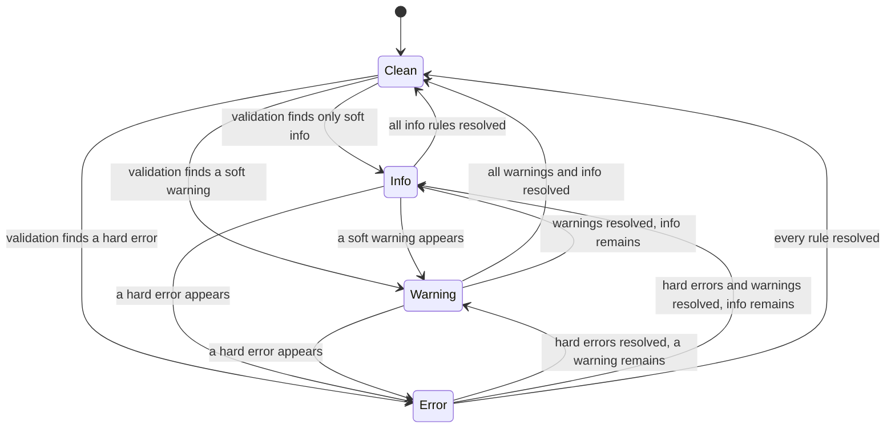
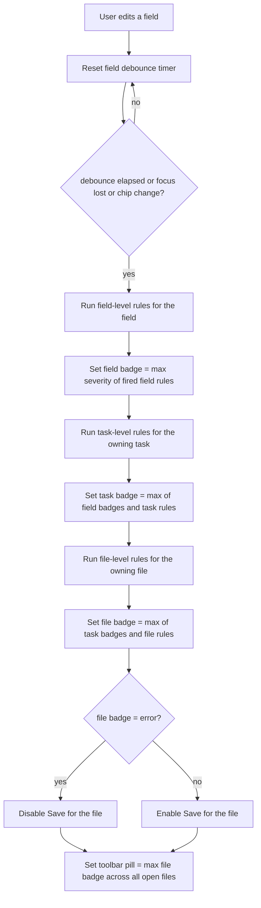

# Validation Cascade

**Status:** Draft
**Owner:** coder
**Audience:** coder, tester
**Last Updated:** 2026-06-06
**Cross-references:** `09_Task_Editor/`, `10_Domain_and_Data/02_DTOS_AND_ENUMS.md`, `11_Services_and_Algorithms/04_EVALUATION_PIPELINE.md`, `08_Cross_Cutting/08-E_interfaces_contracts.md`

This document specifies the Task Editor validation algorithm: the three-level cascade (field-level, then task-level, then file-level), the debounce timing that decides when validation runs after a keystroke, the three severity levels (hard error, soft warning, soft info), how the levels aggregate up the cascade, and the state transitions of the validation badges shown on field rows, task rows, files, and the toolbar. The cascade decides whether a file may be saved: a hard error anywhere in a file disables Save for that file.

---

## Table of Contents

1. Purpose
2. Inputs
3. Outputs
4. Preconditions
5. Postconditions
6. Algorithm
7. Configuration
8. Error handling
9. Threading and concurrency
10. Examples
11. Test cases

---

## 1. Purpose

The validation cascade is the Task Editor's correctness feedback loop. As the user edits a task, it continuously checks every field, every task, and every open file, and reports the result through coloured badges and an enable/disable state for the Save action. It exists so the user fixes problems before saving, and so a file that the Task File Loader would reject at run time can never be saved in that broken state.

The cascade has three levels. Each level consumes the level below it: a task's badge is the aggregate of its field badges; a file's badge is the aggregate of its task badges; the toolbar badge is the aggregate of every open file. Validation never blocks typing — it runs on a debounce after edits settle.

The cascade validates against the rules in the Task Editor field reference (`09_Task_Editor/`), which is the single source of truth for the per-field rules and their severities. This document specifies the **algorithm** that applies those rules, not the rules themselves.

## 2. Inputs

| Input | Source | Notes |
|---|---|---|
| Field edits | the Task Editor's `FieldRow` controls | Each keystroke, focus change, or chip add/remove on a field. |
| The in-memory task model | the editor's working copy of the open file | A sequence of `BenchmarkTask`-shaped draft records, not yet frozen. |
| The set of open files | the editor's Files pane | Each file is a path plus its in-memory task list. |
| The per-field rule set | `09_Task_Editor/` field reference | Defines, per field, every rule and its severity. |
| Debounce settings | `app_settings` | The debounce intervals (§7). |

The cascade validates the **draft** model in the editor, never a frozen run task. It is purely a UI-side service.

## 3. Outputs

| Output | Type | Consumer |
|---|---|---|
| Field validation state | per `FieldRow` | The field-row severity strip (badge). |
| Task validation state | per task row | The task-row badge. |
| File validation state | per open file | The file's status glyph in the Files pane. |
| Toolbar aggregate state | one per editor | The toolbar validation pill. |
| Save-enabled flag | per file | Enables or disables the Save action for that file. |
| Validation messages | per failing rule | The text shown in tooltips and the per-field info popover. |

Each state is one of four values: **clean**, **info**, **warning**, **error** — derived from the severities of the rules that fired (§6.4).

## 4. Preconditions

- The Task Editor is open with at least one file loaded into the in-memory model.
- The per-field rule set from `09_Task_Editor/` is available to the validator.
- The debounce settings are readable from `app_settings`.

## 5. Postconditions

- After the debounce settles, every edited field, its owning task, and its owning file carry a current validation state consistent with the in-memory model.
- A file with any hard error in any of its tasks has Save disabled; a file with only soft warnings or soft info has Save enabled.
- Every badge reflects the highest severity present at or below its level.
- No validation runs while the user is still actively typing within the debounce window.

## 6. Algorithm

### 6.1 The three levels

Validation cascades bottom-up through three levels:

1. **Field-level** — validates one field's value in isolation, plus the cross-field rules that belong to that field (for example, a `forbidden` term that also appears in `exact`, or a `source_language` present on a non-`translation` task). Each field-level rule has a fixed severity defined in `09_Task_Editor/`.
2. **Task-level** — validates rules that span a whole task (for example, a required field missing, a retired key such as `task_type` present in a legacy file — DD-46) and aggregates the field-level states of every field in the task.
3. **File-level** — validates rules that span the whole file (for example, two tasks sharing a `task_id`, an empty file, a non-`.yaml`/`.yml` extension, malformed YAML on reload) and aggregates the task-level states of every task in the file.

The toolbar pill is a fourth, purely aggregating tier: the highest state across every open file.

### 6.2 When validation runs — debounce

Validation is not run on every keystroke. Each level has a trigger:

- **Field-level** runs after the user stops typing in a field for `task_editor.validation_debounce_ms` (default `250` ms), and also immediately on the field losing focus and on a chip add/remove (chip changes are discrete, not continuous, so they bypass the debounce).
- **Task-level** runs immediately after any field-level validation in that task completes, and after a task is added or removed.
- **File-level** runs immediately after any task-level validation in that file completes, and after a file is loaded, reloaded, or a task is added or removed; the duplicate-`task_id` check additionally runs whenever any task's `task_id` field-level validation completes.

The debounce timer is reset on every keystroke in the field; only the trailing edge fires. A focus change flushes the pending timer so leaving a field always produces a current field state. The debounce applies only to the continuous-typing case at field level; the task and file levels are cheap aggregations and run synchronously after the level below.

### 6.3 The three severity levels

Every rule that the cascade can report carries exactly one of three severities. These are the same three severities the Task File Loader uses at run time, so the editor's verdict mirrors what the loader would do.

| Severity | Meaning | Save behaviour | Badge colour |
|---|---|---|---|
| **Hard error** | The value is invalid; the Task File Loader would drop the task. | Save **disabled** for the file. | Red. |
| **Soft warning** | The value is accepted but questionable; the loader accepts it but flags it in the run log. | Save **allowed**. | Amber. |
| **Soft info** | The value is unusual but harmless (for example, a very long prompt). | Save **allowed**. | Blue. |

A field, task, or file with no rule firing is **clean** — no badge, or a neutral check glyph.

### 6.4 Severity aggregation up the cascade

Each level's state is the **maximum severity** of everything within it, on the ordering `clean < info < warning < error`:

- A **field's** state is the maximum severity of the rules that fired for that field.
- A **task's** state is the maximum of: every field-level state in the task, and every task-level rule that fired for the task.
- A **file's** state is the maximum of: every task-level state in the file, and every file-level rule that fired for the file.
- The **toolbar** state is the maximum file-level state across all open files.

A single hard error at any depth therefore propagates an error state all the way up to the toolbar, and disables Save for the file that contains it. Soft warnings and soft info never disable Save; they only colour the badges.

### 6.5 Save gating

Save is gated **per file**. The Save action for a file is enabled when, and only when, that file's file-level state is `warning`, `info`, or `clean` — that is, no hard error anywhere in the file. A file with at least one hard error has Save disabled, and its file glyph is the red error glyph. A "Save All" action saves only the files whose Save is enabled; files with hard errors are skipped and remain dirty.

An empty file is a soft warning (per `09_Task_Editor/`), so it is still saveable — it writes an empty `tasks: []`.

### 6.6 Badge state transitions

Each badge is a small state machine over the four states. Transitions are driven only by a completed validation pass at the badge's level.

A badge changes state only when a validation pass at its level completes; while a debounce is pending the badge keeps its last computed state (it does not flash to a transient state). When a field, task, or file is removed, its badge is destroyed and the parent level re-aggregates.

### 6.7 End-to-end cascade

## 7. Configuration

| Key | Type | Default | Meaning |
|---|---|---|---|
| `task_editor.validation_debounce_ms` | int `>= 0` ms | `250` | Trailing-edge debounce for field-level validation after the user stops typing. |
| `task_editor.auto_format_on_save` | bool | `true` | Not a validation key, but the save action that the cascade gates writes the canonical YAML form when this is on; see `09_Task_Editor/`. |

The per-field rules and their severities are not configuration — they are fixed in `09_Task_Editor/`.

## 8. Error handling

| Condition | Handling |
|---|---|
| File contains malformed YAML on load or reload | A file-level hard error; the file's task list cannot be built; Save is disabled; a banner appears in the Files pane. The reload is aborted and the prior in-memory model is kept. |
| File extension is not `.yaml` or `.yml` | A file-level hard error; Save disabled. |
| A field value cannot be coerced to its declared type (for example a non-enum `difficulty`) | The loader-equivalent rule fires — a soft warning with a fallback to the default value; the editor still validates the rest of the task. |
| Two tasks share a `task_id` | A file-level hard error reported on **both** task rows; Save disabled until one is changed. |
| A validation rule itself raises unexpectedly | The cascade treats that single rule as not-fired, logs the internal error through the app logger, and continues; one buggy rule never blocks the rest of validation. The badge reflects only the rules that completed. |

The cascade never throws to the UI thread; a validation failure degrades to "rule did not fire" so the editor stays responsive.

## 9. Threading and concurrency

The validation cascade runs on the Qt UI thread. Field-level validation, task-level aggregation, and file-level aggregation are all fast in-memory operations over the draft model; they do not need a worker thread. The only time-shifting mechanism is the debounce timer (a `QTimer`), which defers field-level validation without leaving the UI thread.

The cascade performs no I/O of its own except reading a file's text when that file is loaded or reloaded; YAML parsing for a reload runs on the UI thread because task files are small, and a malformed file is reported as a file-level hard error rather than blocking. Because everything runs on one thread, there is no race between an edit and the validation it triggers — the debounce simply delays the trailing-edge pass.

## 10. Examples

### 10.1 Happy path — a clean edit

The user types a valid `task_id` into a new task's `task_id` field.

- Each keystroke resets the 250 ms debounce timer.
- 250 ms after the last keystroke, field-level validation runs: the value is non-empty, unique within the file, snake_case, under 80 characters — no rule fires. The field badge becomes **clean**.
- Task-level validation runs: every other required field of the task is filled; no task rule fires. The task badge is the maximum of its field badges — **clean**.
- File-level validation runs: no duplicate `task_id`, valid extension. The file badge is **clean**.
- The file badge is not `error`, so Save stays enabled. The toolbar pill is the maximum file badge — **clean**.

### 10.2 Edge case — a hard error propagates and disables Save

The user clears the `question` field of an existing task.

- After the debounce, field-level validation runs the `question` rules: "empty after whitespace-trim" is a **hard error**. The field badge becomes **error** (red).
- Task-level aggregation: the task badge is the maximum of its field badges → **error**.
- File-level aggregation: the file badge is the maximum of its task badges → **error**.
- The file badge is `error`, so Save is disabled for that file and the file glyph turns red. The toolbar pill aggregates to **error**.
- The user retypes a question; after the debounce the field rule no longer fires, the field badge transitions `error → clean`, the task and file re-aggregate, and Save is re-enabled.

### 10.3 Edge case — mixed severities aggregate to the highest

A task has a very long prompt (soft info), an empty `category` (soft warning), and all required fields present.

- The `question` field badge is **info** (long-prompt info rule).
- The `category` field badge is **warning** (empty-category warning rule).
- The task badge is the maximum of its field badges → **warning**.
- The file badge aggregates to **warning** (assuming no other task has an error).
- Save stays enabled because no hard error is present; the file glyph is the amber warning glyph.

## 11. Test cases

1. Field-level validation runs `task_editor.validation_debounce_ms` after the last keystroke, not on every keystroke.
2. Losing focus on a field flushes the pending debounce and runs field-level validation immediately.
3. A chip add or remove triggers field-level validation immediately, bypassing the debounce.
4. An empty `question` produces a hard-error field badge and disables Save for the file.
5. A retired `task_type` key in a legacy file produces a soft warning and leaves Save enabled (DD-46); the key is dropped on the next save.
6. An empty `category` produces a soft-warning field badge and leaves Save enabled.
7. A task badge equals the maximum severity of its field badges and its task-level rules.
8. A file badge equals the maximum severity of its task badges and its file-level rules.
9. Two tasks sharing a `task_id` produce a hard error on both task rows and disable Save.
10. An empty file is a soft warning, not an error, and remains saveable.
11. A non-`.yaml`/`.yml` file extension is a file-level hard error and disables Save.
12. Malformed YAML on reload is a file-level hard error, aborts the reload, and shows a banner.
13. The toolbar pill equals the maximum file badge across all open files.
14. Resolving the last hard error in a file transitions the file badge off `error` and re-enables Save.
15. A badge changes state only when a validation pass at its level completes; it does not flash during a pending debounce.
16. Save All saves only files whose Save is enabled and skips files with hard errors.
17. A rule that raises internally is treated as not-fired, is logged, and does not block the rest of the cascade.
