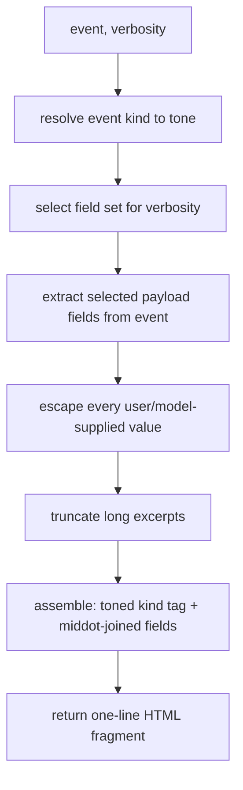

# Algorithm: Log Formatting

**Status:** Draft
**Owner:** coder
**Audience:** coder
**Last Updated:** 2026-06-06
**Cross-references:** `10_Domain_and_Data/02_DTOS_AND_ENUMS.md`, `04_Progress_Widget/description.md`, `11_Services_and_Algorithms/16_CONCURRENCY_MODEL.md`

The log-formatting service turns one benchmark-run event into the single rendered line shown in the Progress widget's live event log. It selects which fields of the event to show based on the current verbosity (Short, Normal, or Verbose), maps the event's kind to a colour tone, and produces a one-line HTML fragment the widget appends to its read-only view. It serves the **Run Log** stream only — the user-facing "what happened during this run" log — and is independent of the App Log.

---

## Table of Contents

1. Purpose
2. Inputs
3. Outputs
4. Preconditions
5. Postconditions
6. Algorithm
7. The two logging streams
8. Configuration
9. Error handling
10. Threading and concurrency
11. Examples
12. Test cases

---

## 1. Purpose

While a benchmark runs, the pipeline emits a stream of events — a stage changed, an inference started, a task completed, a retry occurred, the judge returned a verdict, the run finished. The Progress widget shows these events in a live, scrolling, colour-coded log so the user can watch the run and understand a failure without opening a file.

The log-formatting service exists so that:

- Event-to-line rendering is done in one backend service, not scattered across widgets. The widget only appends the line the service returns.
- The same raw event renders at three different field densities — Short, Normal, Verbose — and switching density re-renders the visible buffer with no loss, because the raw events are cached and re-formatted.
- Each event kind gets a consistent colour tone so the log is scannable at a glance.
- The line is plain, single-line, human-readable HTML — no widgets, no rich layout — so a 100 000-line buffer stays cheap to render.

The service formats for the on-screen Run Log. The Run Log file on disk always records the full Verbose field set regardless of the on-screen verbosity (§7); the file writer is a separate component and is not this service.

---

## 2. Inputs

| Input | Type | Meaning |
|---|---|---|
| `event` | `RunLogEvent` | One pipeline event to render. Carries an event kind, a timestamp, the `(provider_id, model_name)` it concerns, the `task_id`, the pipeline stage, and the kind-specific payload fields (durations, token counts, prompt/response excerpts, retry count and reason, error text, judge verdict and reasoning). The `provider_id` is the internal UUID4; the rendered "provider name" column resolves to the **run-snapshot** provider name frozen at run start (`benchmark_run_providers.name` / the relevant header snapshot field, DD-33). The durable **run-log file** therefore always records the snapshot name, so a mid-run provider rename never produces mixed names in the file and the file stays consistent with every other historical surface (SPEC-113). (The live Progress-widget log panel may resolve the *live* name for an in-flight run; only the persisted file is pinned to the snapshot.) |
| `verbosity` | `RunLogVerbosity` | `SHORT`, `NORMAL`, or `VERBOSE`; sourced from the `ui.run_log_verbosity` setting. Selects the field set (§6.2). |

`RunLogEvent`, `RunLogEventKind`, and `RunLogVerbosity` are the run-log DTOs defined in `10_Domain_and_Data/02_DTOS_AND_ENUMS.md`; this document does not redefine them. The service is also invoked over a list of events when the verbosity changes and the whole visible buffer is re-rendered (§6.5).

---

## 3. Outputs

| Output | Type | Used by |
|---|---|---|
| Rendered line | one-line HTML fragment (`str`) | The Progress widget appends it to the read-only Run Log view. |

The fragment is exactly one logical line: a leading colour-toned span wrapping the event-kind tag, then the selected fields separated by a thin middot separator, with HTML special characters in every user- or model-supplied value escaped (§6.4). It contains no block elements and no newline. The service returns no DTO and performs no I/O.

---

## 4. Preconditions

- `event` is a well-formed `RunLogEvent` emitted by the pipeline; its kind is a member of `RunLogEventKind` and its payload carries the fields its kind defines.
- `verbosity` is a member of `RunLogVerbosity`.
- The colour tokens for each tone are available from the active theme (the service emits a tone name; the theme resolves it to a colour — see §6.3).

The service does not require the event to belong to the currently displayed run; the Progress widget filters events to the displayed run before formatting.

---

## 5. Postconditions

- The returned fragment is a single line of valid HTML with balanced tags.
- Every value that originates from a model, a provider, a task file, or an error message is HTML-escaped; the fragment cannot inject markup into the view.
- The fragment contains exactly the fields the verbosity selects (§6.2) — no more, no fewer.
- The event-kind tag is wrapped in a span carrying the tone class for the event's kind (§6.3).
- The input `event` is not mutated.
- Formatting is deterministic: the same `(event, verbosity)` pair always produces the same fragment.

---

## 6. Algorithm

### 6.1 Pipeline

### 6.2 Field selection per verbosity

The verbosity controls **field density** — which fields of the event appear in the line. Three fields are always present at every verbosity; the rest are progressively added. The selection:

| Field | Short | Normal | Verbose |
|---|:--:|:--:|:--:|
| timestamp | yes | yes | yes |
| event-kind tag | yes | yes | yes |
| provider name | yes | yes | yes |
| model name | yes | yes | yes |
| task id | yes | yes | yes |
| pipeline stage | yes | yes | yes |
| start / end time | yes | yes | yes |
| system prompt | size only | truncated excerpt + size | full content + size |
| user prompt (task) | size only | truncated excerpt + size | full content + size |
| model response | size only | truncated excerpt + size | full content + size |
| time to first token | — | — | yes |
| total time | — | yes | yes |
| tokens per second | — | — | yes |
| prompt / completion token counts | — | — | yes |
| retry attempts and reason | count only | reason only | attempts + reason |
| error text | yes | yes | yes |
| judge verdict and reasoning | verdict only | verdict + reasoning | verdict + reasoning |

Notes on the selection:

- **size only** (Short) shows only the character and token counts. **truncated excerpt + size** (Normal) shows a truncated text excerpt plus the character/token counts. **full content + size** (Verbose) shows the full untruncated text plus the character/token counts.
- A field selected for a verbosity but absent from the event's payload (for example `time to first token` on a `done` event whose provider transport could not stream) is simply omitted; the service does not render an empty placeholder.
- `error text` and `judge verdict` are always shown when present, at every verbosity, because they are the fields a user reads the log to find.
- The judge produces a binary `PASS` / `FAIL` verdict plus a one-sentence explanation; it produces **no numeric score**. The numeric quality value (the Cosine Score) is not a judge field and is not rendered as a judge output in the log.

### 6.3 Colour mapping by event kind

Each `RunLogEventKind` maps to one tone. The service emits the tone as a class name on the kind-tag span; the active theme resolves the tone to a concrete colour, so the same fragment is correct in both the dark and light themes.

| Event kind | Meaning | Tone |
|---|---|---|
| `STAGE` | A pipeline stage changed (initializing, benchmarking, judging, finalizing). | info |
| `SYSTEM` | A registry, readiness, or circuit-breaker note. | info |
| `TASK_START` | Inference started for a task. | primary |
| `DONE` | Inference for a task completed. | success |
| `JUDGE` | The judge phase produced a verdict for a task. | warning |
| `RETRY` | A task inference attempt was retried. | error |
| `PROVIDER_SWITCH` | The pipeline moved to a different provider. | info |
| `MODEL_SWITCH` | The pipeline moved to a different model. | info |
| `STOPPED` | The user stopped the run. | muted |
| `FINISHED` | The run finished normally. | success |
| `FAILED` | A fatal error halted the run. | error |

The five tones — info, primary, success, warning, error — plus muted are the standard semantic tones of the application theme. The service never emits a raw colour value.

### 6.4 Escaping and truncation

- **Escaping.** Every value that did not originate inside the application — a model name, a provider label, a task id, the system prompt text, the user prompt (task) text, the model response text, an error message, the judge's reasoning — is HTML-escaped (`&`, `<`, `>`, `"` replaced with entities) before it is placed in the fragment. The static label text and the markup the service itself emits are not escaped because they are trusted. This makes the log immune to a model returning a string that looks like markup.
- **Truncation.** The prompt and response excerpts are truncated only at **Normal** verbosity — to a fixed character budget with a trailing ellipsis, with the original character and token counts shown alongside so truncation does not hide the true size. At **Verbose**, the full untruncated text is shown with the counts. At **Short**, only the counts are shown. The judge reasoning, being one sentence by contract, is shown in full at every level it appears. Truncation happens after escaping so an escape sequence is never cut mid-entity.
- **Newlines.** Any newline inside an excerpt or an error message is replaced with a single space so the fragment stays one logical line.

### 6.5 Live re-render on verbosity change

The Progress widget keeps the raw `RunLogEvent` objects of the visible buffer cached. When the user changes the Verbosity dropdown, the widget re-invokes the service over the cached events with the new verbosity and replaces the view contents. No event is lost and the on-disk file is unaffected — only the on-screen field density changes. Because formatting is deterministic and side-effect-free, re-rendering the same events is always consistent.

### 6.6 Assembly

The final fragment is assembled as: the timestamp, then the kind tag wrapped in a tone-classed span, then each selected field rendered as `label: value`, all joined by a thin middot separator. Fields are emitted in the fixed order of the §6.2 table so two lines of the same kind line up visually.

---

## 7. The two logging streams

The application maintains two independent logging streams; this service serves only the first.

| Aspect | Run Log | App Log |
|---|---|---|
| Audience | The user — "why did this run behave this way?" | A developer or support — "why did the app misbehave?" |
| Shown in the UI | Yes — the Progress widget event-log panel. | No. |
| Source | Pipeline `RunLogEvent` stream. | Application-wide structured logging. |
| Granularity model | **Field density** — Short / Normal / Verbose select fields per event. | **Severity level** — TRACE / DEBUG / INFO / WARN / ERROR select which records are emitted. |
| File | One file per run, `<app-data>/logs/run/run_<run_id>_<unix_ts>.log`. | One rotating file, `<app-data>/logs/app/app.log` plus rotation files. |
| What this service does | Formats each event into the one-line HTML the panel shows. | Nothing — the App Log is structured logging written by a separate sink. |

This log-formatting service is the on-screen formatter for the **Run Log** stream. Two points connect it to the wider system:

- **The on-screen verbosity does not limit the file.** The Run Log file always records the full Verbose field set for every event, no matter what the on-screen Verbosity dropdown is set to. The file writer is a separate component; it formats events to a plain-text line independently of this service. The user can therefore switch a finished run's panel to Verbose and see detail that was never on screen during the run.
- **The Run Log is not redacted, with one exception (SPEC-060).** This service applies no redaction to user prompts or model responses — the user's own data on the user's own machine is written verbatim, and the `run.*` namespace has no blanket `redact_for_log` processor (unlike `app.*`). The **single** exception: a chained **provider-SDK exception string** logged to `run.*` is passed through `redact()` before it is written, because a raw SDK exception can echo back an `Authorization: Bearer …` header or key from a dumped request — and the run-log file is something the user may share when reporting a bug. This mirrors the adapter-boundary `redact()` already applied to `AppError.message` (`16_Engineering_Standards/06_LOGGING_STANDARD.md`, `10_Domain_and_Data/08_REDACTION_PATTERNS.md`).
- **The App Log is out of scope.** This service never writes to and never reads the App Log. The App Log is severity-level structured logging for support; it is not rendered in any widget and is not formatted by this service. The App Log is the one log surface that **is** redacted, by the structlog processor in its own pipeline.

---

## 8. Configuration

| Setting key | Type | Default | Effect on this service |
|---|---|---|---|
| `ui.run_log_verbosity` | enum (`short` / `normal` / `verbose`) | `normal` | Supplies the `verbosity` input; selects the field set (§6.2). |
| `ui.run_log_max_lines` | int | `100000` | The Progress widget's buffer cap; the widget rolls old lines off the top. Not read by the service, but it bounds how many events the service is asked to re-render on a verbosity change. |
| `ui.auto_scroll_run_log` | bool | `true` | Widget-side; the service is unaffected. |

The tone-to-colour resolution is owned by the theme, not by a setting. The excerpt truncation budget and the middot separator are fixed constants of the service. The Run Log file path template and `logging.write_run_log_to_file` govern the separate file writer, not this service.

---

## 9. Error handling

The service never raises to the UI; a malformed event still produces a renderable line.

| Situation | Handling |
|---|---|
| A selected field is absent from the event payload | The field is omitted from the line; no placeholder is rendered. |
| An excerpt or error text contains markup-like characters | Escaped to entities (§6.4); the fragment cannot inject markup. |
| An excerpt or error text contains newlines | Newlines replaced with single spaces; the line stays one logical line. |
| An excerpt exceeds the truncation budget | Truncated with an ellipsis; the true char/token count is still shown. |
| `verbosity` is an unrecognized value | Treated as `NORMAL`; logged at warning level (a programmer error). |
| The event kind is unrecognized | Rendered with the `info` tone and a generic kind tag; the event's known fields are still shown. |

The service does no I/O, so it raises no I/O errors. A failure of the separate Run Log **file** writer (disk full, path not writable) is handled by that writer and surfaced by the Progress widget toolbar as a warning indicator; it does not affect on-screen formatting and is not this service's concern.

---

## 10. Threading and concurrency

- **Pure and synchronous.** Formatting one event is a pure function of `(event, verbosity)`: no I/O, no Qt dependency, no shared mutable state. It is fully unit-testable in isolation.
- **Called on the UI thread.** Formatting a single line is cheap; the Progress widget calls the service on the Qt UI thread as each event arrives and appends the returned fragment. There is no off-thread hand-off for the per-event path.
- **Event delivery is debounced.** Pipeline events arrive off the worker thread and are marshalled to the UI thread; the widget batches high-rate arrivals before formatting and appending, so a fast run does not flood the UI. The batching is a widget concern; the service formats whatever events the widget passes it.
- **Re-render is bounded.** A verbosity change re-formats the visible buffer (up to `ui.run_log_max_lines` events). This is a synchronous loop of cheap pure calls; for the default 100 000-line cap it completes well within an interactive frame budget. The events are re-rendered from the widget's in-memory cache; the data store and the log file are not touched.
- **No cancellation.** Formatting is short and non-cancellable; a superseded re-render (the user changes verbosity twice quickly) is simply replaced by the next one.

---

## 11. Examples

### 11.1 Happy path — a `DONE` event at Normal verbosity

Event: kind `DONE`, timestamp `14:53:27`, provider `ollama_local`, model `llama3.2:3b`, task `coding_java_two_sum`, stage `benchmarking`, total time `2_140 ms`, completion tokens `188`, no retries, no error.

1. Kind `DONE` resolves to the **success** tone.
2. Verbosity `NORMAL` selects: timestamp, kind tag, provider, model, task id, stage, start/end time, total time, and the system prompt, user prompt (task), and model response each as a truncated excerpt plus character/token counts. TTFT, TPS, and token counts are Verbose-only and are not selected.
3. The selected fields are extracted; provider, model, and task id are escaped (they contain no special characters here).
4. The fragment is assembled — the timestamp, a success-toned `DONE` tag, then `provider`, `model`, `task`, `stage`, `total time` joined by middots.

Rendered (conceptually): `14:53:27  [DONE]  ollama_local · llama3.2:3b · coding_java_two_sum · benchmarking · total 2.14 s`, with `[DONE]` carrying the success tone class.

### 11.2 Edge case — a `RETRY` event, same event, three verbosities

Event: kind `RETRY`, model `mistral:7b`, task `factual_qa_capitals`, attempt `2`, reason `Connection refused`.

- **Short** — the retry field shows the **count only**: `attempts: 2`. Tone is **error**.
- **Normal** — the retry field shows the **reason only**: `retry: Connection refused`.
- **Verbose** — the retry field shows **attempts and reason**: `attempts: 2 · reason: Connection refused`.

The same cached event produces all three; switching the Verbosity dropdown re-renders the buffer (§6.5) with no event lost and the file untouched.

### 11.3 Edge case — a `JUDGE` event whose model output contains markup

Event: kind `JUDGE`, verdict `FAIL`, judge reasoning `The answer used a <table> instead of prose.`, at Verbose verbosity the event also carries the model response text `<b>Bold</b> and more...`.

1. Kind `JUDGE` resolves to the **warning** tone.
2. The judge reasoning and the model response text are HTML-escaped: `<table>` becomes `&lt;table&gt;`, `<b>Bold</b>` becomes `&lt;b&gt;Bold&lt;/b&gt;`.
3. At **Verbose** the escaped model response text is shown in full with the char/token counts appended unescaped (they are integers). At **Normal** the same text is truncated to the budget with a trailing ellipsis before the counts are appended. At **Short** only the counts are shown.
4. The verdict `FAIL` is rendered as a plain label; it is binary — there is no numeric judge score to show.

The line renders the literal characters `<table>` and `<b>Bold</b>` as visible text; no markup is injected into the view.

---

## 12. Test cases

| ID | Scenario | Expected |
|---|---|---|
| LF-1 | `DONE` event, Short verbosity | Line shows only the always-on fields plus the system prompt, user prompt (task), and model response **sizes only** (character/token counts, no text); no TTFT, TPS, or token counts. |
| LF-2 | `DONE` event, Normal verbosity | Line shows total time and the system prompt, user prompt (task), and model response as a **truncated excerpt plus character/token sizes**; still no TTFT, TPS, or token counts. |
| LF-3 | `DONE` event, Verbose verbosity | Line shows TTFT, total time, TPS, token counts, and the **full untruncated** system prompt, user prompt (task), and model response with character/token sizes (no truncation). |
| LF-4 | Same event rendered at all three verbosities | Field set strictly nested — every Short field is in Normal, every Normal field is in Verbose. |
| LF-5 | `STAGE`, `SYSTEM`, `PROVIDER_SWITCH`, `MODEL_SWITCH` events | Kind tag carries the `info` tone class. |
| LF-6 | `TASK_START` event | Kind tag carries the `primary` tone class. |
| LF-7 | `DONE` and `FINISHED` events | Kind tag carries the `success` tone class. |
| LF-8 | `JUDGE` event | Kind tag carries the `warning` tone class. |
| LF-9 | `RETRY` and `FAILED` events | Kind tag carries the `error` tone class. |
| LF-10 | `STOPPED` event | Kind tag carries the `muted` tone class. |
| LF-11 | `RETRY` event, Short verbosity | Retry field shows the attempt count only. |
| LF-12 | `RETRY` event, Normal verbosity | Retry field shows the reason only. |
| LF-13 | `RETRY` event, Verbose verbosity | Retry field shows attempts and reason. |
| LF-14 | `JUDGE` event, Short verbosity | Judge field shows the verdict only; no reasoning. |
| LF-15 | `JUDGE` event, Normal or Verbose verbosity | Judge field shows the binary verdict plus the one-sentence reasoning; no numeric score. |
| LF-16 | Event with a selected field absent from its payload (e.g. no TTFT) | The field is omitted; no empty placeholder is rendered. |
| LF-17 | Model response text containing `<`, `>`, `&`, `"` | All escaped to HTML entities; no markup injected. |
| LF-18 | Error text containing newlines | Newlines replaced with spaces; the fragment is one logical line. |
| LF-19 | Normal verbosity, prompt/response text longer than the truncation budget | Text truncated with an ellipsis; the true char/token count still shown; at Verbose the same field is shown in full with no ellipsis; at Short only the counts are shown. |
| LF-20 | Truncation point at Normal falls inside an escape entity | Truncation never splits an entity (escape precedes truncate). |
| LF-21 | Unrecognized verbosity value | Treated as `NORMAL`; a warning is logged; a line is still produced. |
| LF-22 | Unrecognized event kind | Rendered with the `info` tone and a generic tag; known fields still shown. |
| LF-23 | Determinism | The same `(event, verbosity)` pair produces a byte-identical fragment every time. |
| LF-24 | Verbosity change re-render | The cached buffer is re-formatted with the new verbosity; no event is lost; the Run Log file is unchanged. |
| LF-25 | Input event immutability | The `RunLogEvent` is unchanged after formatting. |
| LF-26 | Output is one line | The fragment contains no newline and no block-level HTML element. |
