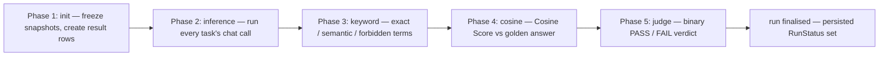
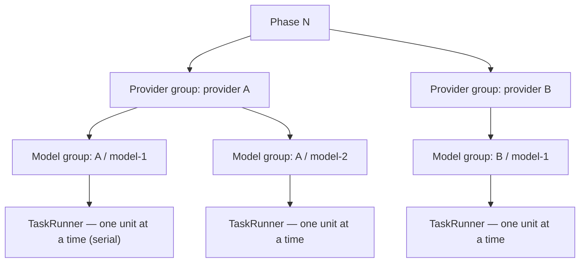
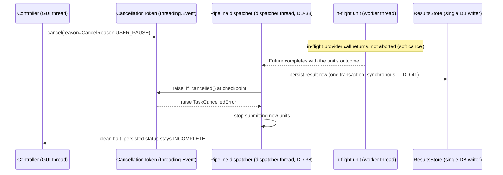

# Algorithm: Concurrency Model

This document specifies how Ollama LLM Bench schedules and cancels concurrent work. The
application runs a **synchronous, Qt-free and asyncio-free backend** driven by an
**adapter-owned thread-pool runner** (`TaskRunner`, implemented over `QThreadPool` in the
Qt frontend). Benchmark work units run as blocking calls on worker threads; the run is
orchestrated by a single dedicated **dispatcher thread** (DD-38, §6.1a); cancellation is
explicit through one framework-agnostic `CancellationToken` (backed by `threading.Event`);
backend→UI notifications travel on the Qt-free event bus and are marshalled onto the GUI
thread by the adapter; and the five-phase batched pipeline schedules units grouped by
provider then by model, each phase fully drained before the next begins. This file specifies
the scheduling algorithm and the pause/stop/resume mechanics; the binding rules and
anti-patterns are in `16_Engineering_Standards/04_CONCURRENCY_STANDARD.md` (the authoritative
concurrency standard, per D-R-01).

---

## Table of Contents

1. [Purpose](#1-purpose)
2. [Inputs](#2-inputs)
3. [Outputs](#3-outputs)
4. [Preconditions](#4-preconditions)
5. [Postconditions](#5-postconditions)
6. [Algorithm](#6-algorithm)
7. [Configuration](#7-configuration)
8. [Error handling](#8-error-handling)
9. [Threading and concurrency](#9-threading-and-concurrency)
10. [Examples](#10-examples)
11. [Test cases](#11-test-cases)

---

## 1. Purpose

A benchmark run is a long, I/O-bound sequence of provider calls and grading steps that must
run without freezing the desktop UI and must reach a clean, fully resumable state whenever
the user pauses or stops it. The concurrency model satisfies five goals: a Qt-free backend,
a swappable execution runner that lives in the adapter, a responsive GUI, deterministic unit
ownership and lifetime with no orphaned threads, and clean cooperative cancellation. This
document specifies the algorithm the Benchmark Pipeline uses to turn a run into scheduled,
grouped, batched, and cancellable concurrent work.

---

## 2. Inputs

| Input | Type | Meaning |
|---|---|---|
| `run` | `BenchmarkRun` | The run being executed, with its frozen model, provider, and settings snapshots. |
| `tasks` | `tuple[BenchmarkTask, ...]` | The run's frozen tasks. |
| `pending_results` | `tuple[BenchmarkResult, ...]` | The result rows to execute — every row for a fresh run; the `PENDING` and retryable-failure rows for a resume. |
| `token` | `CancellationToken` | The single per-run cooperative cancellation handle (backed by `threading.Event`). |
| `runner` | `TaskRunner` | The adapter-supplied execution runner that dispatches a blocking work unit onto a worker thread (one at a time — serial execution, §6.2). |
| `correlation_id` | `str` | The run/operation correlation identifier carried into every log line and `ErrorContext`. |

---

## 3. Outputs

| Output | Type | Meaning |
|---|---|---|
| Updated result rows | persisted `BenchmarkResult` rows | Each `pending_results` row advanced to a terminal `ResultStatus`. |
| Updated run header | persisted `RunStatusPatch` | The run's `completed_tasks`, `total_elapsed_ms`, timestamps, and final persisted `RunStatus`. |
| Progress events | EventBus signals | Per-task and per-phase progress published on the Qt-free bus and marshalled onto the GUI thread. |
| Run outcome | in-memory result of the run | `COMPLETED`, `STOPPED`, or `FAILED`, used to set the persisted `RunStatus`. |

---

## 4. Preconditions

- The composition root has constructed the single `TaskRunner` (a bounded `QThreadPool`
  runner in the Qt app) and injected it into the pipeline before any run starts.
- The adapter has started the single pipeline **dispatcher thread** (DD-38, §6.1a);
  `BenchmarkFlowApi.start`/`resume` hand the run to it and return promptly.
- One synchronous HTTP client (e.g. a `httpx.Client`) exists for the process lifetime,
  used by provider adapters on worker threads.
- The `ResultsStore.recover_in_flight_results` crash-recovery sweep has already reset any
  orphaned in-flight rows to `PENDING` at startup.
- The run header, task snapshot, and initial result rows are persisted.
- A fresh `CancellationToken` has been created for this run and is not yet cancelled.

---

## 5. Postconditions

- Every scheduled unit of work has finished or been cleanly cancelled at a safe checkpoint;
  no worker thread is left running and the `QThreadPool` has drained.
- Every result that was executed has a durably persisted terminal `ResultStatus` before the
  run returns.
- No partial or half-written result row exists: a unit's result is persisted as one
  transaction after the unit completes.
- The run's persisted `RunStatus` is one of `COMPLETED`, `STOPPED`, or `FAILED` (a paused
  run keeps the persisted status `INCOMPLETE`).
- `total_elapsed_ms` accumulates only active execution wall-time (paused gaps excluded) and
  is persisted per-unit so it continues exactly across stop/resume and application restarts.

---

## 6. Algorithm

### 6.0 The single-inference invariant

Across the whole application **at most one** inference-using *activity class* is in flight at any moment. The enumeration `InferenceActivity` fixes the activities — `IDLE`, `BENCHMARK_RUN`, `JUDGE_ANALYSIS`, `PROVIDER_TEST`, `READINESS_PROBE` (`10_Domain_and_Data/02_DTOS_AND_ENUMS.md` §4.18) — and the `InferenceActivityStore` (`08_Cross_Cutting/08-E_interfaces_contracts.md` §13) is the singleton state service that holds the gate. The gate guards *activity classes*: within `BENCHMARK_RUN` the pipeline runs **one inference at a time** (serial execution — Section 6.2); the gate additionally prevents a *second* activity class (a judge-analysis, a provider test, a readiness probe) from starting while a run holds it. The whole application therefore performs exactly one inference at any moment. Each service issuing inference calls acquires the gate before its activity begins and releases it in `finally` when the activity ends:

| Activity | Owner | Hold duration | Watchdog (auto-release) |
|---|---|---|---|
| `BENCHMARK_RUN` | Benchmark Pipeline | run start through terminal status | none — the pipeline owns its lifecycle; orphan-run sweep handles process death. **Liveness within a live process is guaranteed structurally, not by a timer:** every provider call carries a finite hard transport deadline (`02_LLM_CLIENT_PROTOCOL.md` §6.3 — architecture-tested), so the dispatcher always regains control within the attempt budget, and the user always has the instant hard-cancel escape (Stop/Quit abort within `provider.hard_cancel_max_ms`, DD-39). A whole-run ceiling is deliberately rejected: a legitimate run can take many hours, and any ceiling could kill valid work. |
| `JUDGE_ANALYSIS` | Run Analysis Service | `generate()` entry through return | 10 minutes |
| `PROVIDER_TEST` | Provider Edit Test Connection runner | one probe | 60 seconds |
| `READINESS_PROBE` | Readiness Service | one `probe` or `probe_all` batch | 30 seconds |

**Scope — what counts as an inference (DD-40).** The invariant restricts **inference-class
calls only**: a chat call, a per-task judge call, an embedding computation, and a test
inference — calls that make a model compute something. Plain network reachability
handshakes, model-list fetches (`probe_health`, `list_models`), CPU-bound computations, and
file I/O are **not** inferences and are unrestricted — they may run concurrently on the
worker pool at any time (the readiness probe's concurrent per-provider handshakes are the
canonical example; within its batch the single `embed` probe is the only inference-class
call and runs serially — `11_Services_and_Algorithms/09_READINESS_PROBE.md` §6.4). The two
serial domains are stated normatively in `16_Engineering_Standards/04_CONCURRENCY_STANDARD.md` §1.

The gate is reachable from more than one thread (the controller on the GUI thread reads it; worker threads acquire/release it), so it is protected by a single `threading.Lock`: `try_acquire` is an atomic test-and-set under that lock — returning a `GateLease` ownership token on success and `None` when held (DD-50) — and `state` is a locked read. A failed `try_acquire` is data, not an exception. `release(lease)` frees the gate only when the lease is the current holder; a stale lease is a logged no-op. The UI prevents user-initiated overlaps by binding every inference-initiating control to the store's state (delivered via the `_inference_activity_changed` bus event); the service-side check is the safety net. The watchdog auto-release is a Qt timer on the GUI thread that releases a gate held longer than the activity's bound (for `JUDGE_ANALYSIS`/`PROVIDER_TEST`/`READINESS_PROBE`); it **arms with the `GateLease` it observed and releases that lease** (DD-50), so the original holder's late `finally` no-ops against a successor. `BENCHMARK_RUN` has no watchdog because the pipeline owns its lifecycle and a process death is handled by the orphan-run sweep. See `08_Cross_Cutting/08-A_architecture_principles.md` §11 and `08_Cross_Cutting/08-I_edge_cases.md` EC-RUN-12 through EC-RUN-14.

### 6.1 The TaskRunner and the worker pool

The pipeline does not create threads. It submits blocking work units to the injected
`TaskRunner`, whose Qt implementation dispatches each unit on a bounded `QThreadPool` of
worker threads (`adapters/qt_runnables/`). A worker thread runs only backend code; it never
touches a Qt widget. A submitted unit returns a `Future` carrying the unit's result, an
exception, or a cancellation. The runner, the pool, and its size are owned by the adapter
and constructed once in the composition root; the backend sees only the `TaskRunner` port.

### 6.1a The dispatcher thread (DD-38)

The run's orchestration loop runs on a single, dedicated, long-lived **dispatcher thread**,
created by the composition root, owned by the adapter layer alongside the `TaskRunner`,
named (`pipeline-dispatcher`), and joined at shutdown (§6.9). It is the single sanctioned
standalone thread (the no-raw-threads rule targets *work units* —
`16_Engineering_Standards/04_CONCURRENCY_STANDARD.md` §4a/§12).

- `BenchmarkFlowApi.start(...)`/`resume(...)` are **fast-synchronous on the GUI thread**:
  they validate, enqueue a run command to the dispatcher thread, and return promptly. The
  dispatcher thread picks up the command and invokes the backend pipeline's blocking run
  loop. The backend itself stays thread-agnostic — plain synchronous code that runs on
  whatever thread calls it (the dispatcher thread in the app, the test's own thread in an
  inline-runner test).
- Everything in §6.6 that is described as "on the dispatcher" happens **on this thread**:
  the per-unit token and circuit-breaker checks, the adaptive-timeout budget request,
  submitting the single unit, **blocking on the unit's `Future.result()`** (legal only
  here), classifying the outcome, persisting through the single DB writer, reporting the
  outcome to the AdaptiveTimeoutService and ProviderCircuitBreaker, and emitting the
  run-domain events.
- The application therefore has exactly **three execution contexts**: the GUI thread (never
  blocks), the dispatcher thread (the only thread that blocks on a unit's `Future`), and
  the pool workers (run units; a pool worker never submits work to the `TaskRunner` and
  blocks awaiting it — that is the pool-starvation deadlock).
- The dispatcher thread is also the **only sanctioned block-on-futures orchestrator for
  fan-out batches (DD-40)**: besides the run loop, it hosts the readiness `probe_all`
  batch (`11_Services_and_Algorithms/09_READINESS_PROBE.md` §6.4) — the single-inference
  gate guarantees a probe batch and a benchmark run never overlap, so the dispatcher is
  free whenever a batch can run. Nothing else may be put on it.

### 6.2 Serial execution (D-R-16)

The benchmark executes **strictly serially**: the pipeline processes one task at a time and one stage at a time, in order, with **at most one inference call in flight across the whole application at any moment**. This is a deliberate design decision (D-R-16), not a tuning default: local providers (Ollama, LM Studio, llama.cpp) queue concurrent requests anyway, and even providers that accept parallel calls split context length and inference speed across them, so parallel benchmarking would distort the very latency and throughput the tool measures. There is therefore **no `phase_concurrency` / `max_parallel_units` setting and no fan-out** — those knobs are removed.

Each unit of work still runs **on the `TaskRunner`**, off the GUI thread, so the UI stays responsive; but the pipeline — on the dispatcher thread (§6.1a) — submits exactly one unit, awaits its `Future`, classifies the result (re-raising any worker exception on the dispatcher thread), persists it, and only then submits the next unit. A "unit" is an ordinary blocking function; there is no event loop, no coroutine scheduling, and no semaphore. A unit's typed failure does not silently disappear — it surfaces when its `Future` result is read. Serial execution dovetails with the single-inference invariant (§6.1): within `BENCHMARK_RUN` there is one inference at a time, and the gate prevents any *other* activity class from starting concurrently — so the whole application performs exactly one inference at a time, always.

### 6.3 The single CancellationToken

There is exactly one cancellation type, `CancellationToken`, created once per run and
threaded through every unit. The controller (GUI thread) calls `token.cancel(reason=...)`
while worker threads observe it. Worker code calls `token.raise_if_cancelled()` at safe
checkpoints, raising `TaskCancelledError`, a user-category error. The token carries **two
monotonic cancellation levels (DD-39**, `16_Engineering_Standards/04_CONCURRENCY_STANDARD.md`
§5): a **soft** cancel (Pause, automatic pauses) lets the in-flight provider request return
or hit its adaptive timeout and be finished and saved; a **hard** cancel (Stop, Shutdown)
aborts the in-flight call promptly — the client stops consuming at the next chunk boundary
and the token's abort hook closes the in-flight stream, bounded by
`provider.hard_cancel_max_ms` (default 2000 ms). A hard-aborted unit persists nothing; its
row stays `PENDING`. A soft cancel can be upgraded to hard; never the reverse. There are no
per-feature cancellation booleans.

### 6.4 The five-phase batched pipeline

A run executes as five phases in a fixed order. Each phase is **fully drained for every task
before the next phase begins** — the pipeline never interleaves phases.



Phase activation depends on `RunMode`:

| Phase | `SYNTHETIC` | `TASKS` | `GRADED` |
|---|---|---|---|
| 1 init | yes | yes | yes |
| 2 inference | yes | yes | yes |
| 3 keyword | no | no | only if a task declares `required_terms` |
| 4 cosine | no | no | yes (tasks with a `golden_answer`) |
| 5 judge | no | no | yes |

A phase that is not active for the run mode is skipped entirely; its results move straight to
the next active phase's `AWAITING_*` status, and the final phase sets the terminal status.
The per-phase grading logic and short-circuit rules are specified in
`11_Services_and_Algorithms/04_EVALUATION_PIPELINE.md`.

### 6.5 Grouping: provider then model

Within a phase the units are grouped first by `provider_id`, then by `model_name`. The
pipeline processes one provider group at a time and, inside it, one model group at a time.
**No provider switch happens mid-phase within a model group** — every unit of a
`(provider, model)` group is scheduled and drained before the next group starts. Grouping
this way keeps the AdaptiveTimeoutService statistics for a `(provider, model)` target dense
and contiguous so the adaptive timeout converges quickly; lets the ProviderCircuitBreaker
skip a tripped provider's remaining groups without scattering its failures across the run;
and bounds provider-side load to one provider at a time.



The diagram shows the grouping *hierarchy*, not parallel lanes: groups are processed
strictly one after another (D-R-16) — `A/model-1` fully drains before `A/model-2` starts,
and provider B begins only after provider A's groups are done. At every instant at most one
unit is in flight across the whole application.

### 6.6 Batching within a model group

Inside one `(provider, model)` group the units are processed **one at a time** (D-R-16, §6.2): the dispatcher submits a single unit to the `TaskRunner`, awaits its `Future`, classifies and persists the result, then submits the next. There is no semaphore and no in-flight bound to configure — the bound is always one. The order within a group is deterministic (task order), so a run is reproducible and its latency/throughput numbers reflect undistorted, un-contended provider behaviour.

**Before submitting** each unit, the dispatcher thread (§6.1a — it blocks only while
awaiting the in-flight unit's `Future`, never on the GUI loop) checks
`token.raise_if_cancelled()` and the ProviderCircuitBreaker: if the provider is tripped, the
dispatcher records the result as a provider failure without submitting any work. The
ProviderCircuitBreaker and AdaptiveTimeoutService are touched **only on the dispatcher
thread** — never by the worker units — so their state stays serialized and lock-free
(`11_Services_and_Algorithms/08_CIRCUIT_BREAKER.md` §9).

Each submitted unit (running on a worker thread):

1. calls `token.raise_if_cancelled()` before starting (safe checkpoint);
2. is given the per-attempt budget the dispatcher obtained from the AdaptiveTimeoutService
   (`next_budget(provider_id, model_name, role, attempt_index)` — `role=INFERENCE` for the
   per-task inference call, `role=JUDGE` for the per-task judge call in GRADED) and runs
   the phase work with that budget, applying the retry policy of
   `11_Services_and_Algorithms/18_RETRY_POLICY.md`. Embedding calls are exempt — they use the
   fixed `eval.embedding_timeout_seconds` budget (DD-34);
3. returns its outcome (the response, timings, grading data, or the typed failure) on its
   `Future` — the worker **never writes to the database and never emits a run-domain
   event** (DD-38/DD-41); the only events originating inside a unit are the live
   `_inference_progress` heartbeats emitted from within the streaming call itself;
4. calls `token.raise_if_cancelled()` after its work completes (safe checkpoint).

**After** a unit's `Future` completes, the dispatcher — on the dispatcher thread — classifies
the outcome, **persists the result row in one `ResultsStore` transaction through the single
DB writer (synchronous: when the call returns, the row is committed — DD-41)**, publishes the
run-domain progress events, and reports the outcome to the
AdaptiveTimeoutService and the ProviderCircuitBreaker, preserving
their serialized access. Only then is the next unit submitted, so every completed unit is
durably saved before the next one starts — the property pause/resume and crash recovery
depend on. A **cancelled** unit (`TaskCancelledError`, soft or hard) reports
**no outcome** to either service: a user-initiated halt is neither a success nor a failure
and never moves a timeout ladder, an exclusion counter, or the breaker.

### 6.7 CPU-bound work

CPU-bound steps — embedding math, cosine computation, chart aggregation, CSV assembly — are
ordinary backend functions submitted to the **same `TaskRunner`** as I/O work; they run on a
worker thread, off the GUI thread. Each is pure: it takes its inputs as arguments, returns a
value, touches no Qt object and no shared mutable state. Who reads the `Future` depends on the
submitter (DD-40): a **pipeline-owned** CPU step (embedding math, cosine computation) is
submitted by the dispatcher thread, which awaits its `Future` like any other unit; a
**UI-initiated** CPU step (chart aggregation, CSV assembly) is submitted by its adapter
gateway, runs concurrently with whatever the run is doing, and its result is marshalled to the
GUI thread — it never blocks, and is never awaited by, the dispatcher. The application never
spawns raw `threading.Thread` objects for state-bearing work.

### 6.8 Pause, stop, and resume mechanics

Pause and Stop both route through the `CancellationToken`, and both have the same defining
property: **the in-flight unit of work is never abandoned mid-flight.**

**Pause.** When the user requests Pause:

1. The controller (GUI thread) calls `token.cancel(reason=CancelReason.USER_PAUSE)` (`AUTO_PAUSE` for an automatic boundary pause).
2. Each currently in-flight unit runs to completion. A provider request already issued is
   awaited to return, parsed, graded for the current phase, and persisted exactly as if no
   pause had been requested.
3. After each in-flight unit's result is durably saved, its next `raise_if_cancelled()`
   checkpoint raises `TaskCancelledError`; the dispatcher stops submitting new units.
4. A unit that had not yet been submitted is never started; its row stays `PENDING`.
5. The pipeline halts cleanly: every worker that had started a unit finished and saved it; no
   worker thread is left running and no partial row is written.
6. The persisted run status stays `INCOMPLETE`; the paused state is in-memory only.

The result is a clean, fully resumable checkpoint.

**Stop (hard cancel — DD-39).** Stop expresses exit intent, so it does **not** wait out the
in-flight unit: the controller calls `token.cancel(reason=CancelReason.USER_STOP, hard=True)` after the
confirmation, and the in-flight call is aborted promptly (chunk-boundary poll + the token's
abort hook closing the stream, bounded by `provider.hard_cancel_max_ms`). Nothing partial is
persisted — the aborted unit's row stays `PENDING` and the cancelled attempt reports no
outcome to the AdaptiveTimeoutService or the ProviderCircuitBreaker. The run is then marked
`STOPPED`. A `STOPPED` run remains resumable from the Resume widget (the aborted unit is
simply re-run); its persisted completed results remain available for inspection.

**Stop during a draining pause (SPEC-026, DD-39).** Because execution is strictly serial
(D-R-16), at most one unit is ever in flight, so the pause-draining window is bounded by a
single call. Stop is permitted **while a pause is still draining**: a Stop clicked before
`_run_paused` fires **upgrades the cancellation from soft to hard** — the draining call is
aborted promptly (its row stays `PENDING`) and the run settles to `STOPPED` instead of
parking as paused. The Progress widget shows `Pausing — finishing the current call…` during
the soft drain (`04_Progress_Widget/description.md` §3.4) and switches to
`Stopping — cancelling the current call…` the moment the upgrade lands; a Stop during that
window changes both the terminal result and the in-flight unit's fate (aborted, re-run on
resume).

**Outcome derivation (DD-42).** When the dispatcher halts, it derives the run's outcome
from exactly **one atomic `token.snapshot()`** — the `(CancelLevel, CancelReason)` pair read
under the token's lock (`10_Domain_and_Data/02_DTOS_AND_ENUMS.md` §4.22/§4.23) — taken
**after** the in-flight unit has settled (saved on a soft cancel; discarded on a hard one)
and **before** any terminal status is persisted or terminal event emitted:

| `CancelLevel` | `CancelReason` | Outcome |
|---|---|---|
| `NONE` | — | Normal completion: the unit outcomes drive `COMPLETED` / `FAILED`. |
| `SOFT` | `USER_PAUSE` / `AUTO_PAUSE` | Park as in-memory `PAUSED`; persisted status stays `INCOMPLETE`; emit `_run_paused`. |
| `HARD` | `USER_STOP` | Persist `STOPPED`; emit `_run_stopped`; run resumable from the Resume widget. |
| `HARD` | `APP_SHUTDOWN` | Persist nothing terminal; run left `INCOMPLETE` for next-launch recovery (D-R-02); proceed with shutdown (§6.9). |

A cancel that lands **after** the snapshot is never lost: a run parked as `PAUSED` still
holds its token, and a later hard cancel wakes the parked dispatcher through the
`Paused → Stopping` transition (`08_Cross_Cutting/08-B_benchmark_state_machine.md` §2.3),
where the same matrix is applied again. Torn reads are impossible — level and reason are
written together under the lock and read together by `snapshot()`.

**Resume.** Resume constructs a fresh `CancellationToken`, calls
`ResultsStore.list_resumable_results` to read the `PENDING` and retryable-failure rows, and
re-enters the pipeline from the first phase that has un-drained work. Because every completed
unit was saved before the pause checkpoint fired, resume never re-runs a saved unit.
`total_elapsed_ms` continues to accumulate from the persisted per-unit total.



**Worst-case pause latency (SPEC-026).** Because execution is serial (§6.2) there is **at most one in-flight unit**, and it is never abandoned. The time between a Pause click and the clean halt is therefore just that single unit's remaining budget: its current adaptive inference budget (≤ `benchmark.max_timeout_seconds`) or, if it is mid-grading, the grading cost of the current stage (a keyword/cosine check is fast; a per-task judge call is bounded by `eval.judge_timeout_max_seconds`). The per-call deadline guarantees this interval is always finite; there is no unbounded wait and no summing across parallel calls. **Worst-case Stop/Shutdown latency (DD-39)** is far tighter: a hard cancel aborts the in-flight call at the next chunk boundary or via the token's abort hook, bounded by `provider.hard_cancel_max_ms` (default 2000 ms) — Stop and app-quit are near-immediate regardless of the call's remaining budget.

**"Pausing" UI contract (SPEC-026).** The interval between the Pause click and `_run_paused` is a transient **Pausing** sub-state of `RUNNING`. During it: the Progress widget shows `Pausing — finishing the current call…` (execution is serial, so there is one in-flight call at most); the Pause control is disabled (a second Pause click is a no-op); and Resume stays disabled until `_run_paused` fires. When that in-flight unit is saved and the dispatcher halts, `_run_paused` is emitted and the widget renders the paused state. The persisted status is `INCOMPLETE` throughout.

**Stop during a pending Pause (SPEC-026, DD-39).** If the user clicks Stop while a Pause is still draining (the Pausing sub-state), the Stop **upgrades the cancellation to hard**: the already-cancelled token's level rises (monotonic, never downgraded), the abort hook closes the in-flight stream, and the draining call ends promptly with nothing persisted — its row stays `PENDING`. No second drain occurs and no new unit starts; when the dispatcher halts, the run is marked `STOPPED` instead of being left paused-`INCOMPLETE`. The symmetric case — a Pause clicked during a pending Stop — is a no-op: hard is sticky and Stop's terminal `STOPPED` outcome wins. The Progress widget shows `Stopping — cancelling the current call…` once Stop is in effect.

### 6.9 Shutdown

On application quit, `BenchmarkFlowApi.shutdown(timeout_ms)` calls
`token.cancel(reason=CancelReason.APP_SHUTDOWN, hard=True)` (DD-39), stops the `TaskRunner` from
accepting new units, and waits up to `timeout_ms` for the pool to drain
(`QThreadPool.waitForDone(timeout_ms)`). The hard cancel aborts the (at most one — D-R-16)
in-flight call promptly — chunk-boundary poll plus the token's abort hook, bounded by
`provider.hard_cancel_max_ms` — so the drain normally completes in a couple of seconds;
nothing partial is persisted and the aborted unit's row stays `PENDING`. The dispatcher
thread (§6.1a) halts at its next checkpoint and is joined within the same budget. The run is
left `INCOMPLETE` (recovered on next launch per D-R-02), the synchronous HTTP client is
closed, and the database is checkpointed and closed. Only if even the hard-abort path wedges
and the budget elapses does the application force-quit via `os._exit`. Force-quit (`os._exit`) is **deliberately minimal**: it skips the HTTP-client close, the database checkpoint/close, and the instance-lock release, because doing work on a wedged process risks hanging or crashing the exit itself. Each skipped step is individually safe to skip: the database remains consistent at its last committed transaction and SQLite performs **automatic WAL recovery on the next open** — finding `-wal`/`-shm` files after a force-quit is expected, not a defect; the operating system releases the advisory instance lock at process death (the data directory is local, so this is immediate); the abandoned in-flight HTTP call dies with the process; and the next launch's recovery sweep resets any non-terminal row. Before exiting, the application makes one best-effort log write naming the step that wedged. With DD-39 the
force-quit is a genuine last resort; the bounded force-quit still guarantees the application
always exits.

---

## 7. Configuration

| Setting key | Effect |
|---|---|
| `benchmark.retry_count` | Retry attempts per inference unit; consumed by the retry policy invoked inside a unit. |
| `benchmark.consecutive_max_timeouts_to_exclude` | Consecutive maximum-timeout failures before the AdaptiveTimeoutService excludes a model from the run. |
| `app.shutdown_timeout_ms` | The `timeout_ms` budget passed to `shutdown` on quit. |

All settings are read from the active run's frozen settings snapshot, never from the live
`app_settings`, so a run's concurrency behaviour is stable for its whole lifetime.

---

## 8. Error handling

- A unit's failure is captured into its `BenchmarkResult` (`error_kind`, `error_message`,
  terminal `ResultStatus`); the pipeline never raises a unit failure to its caller.
- A worker exception is captured on the unit's `Future` and re-raised on the dispatcher
  thread, where it is classified per the error taxonomy.
- `TaskCancelledError` from a pause or stop produces a clean halt, not a failure.
- A catastrophic failure (the run cannot continue at all — for example a provider
  authentication failure that fails every group) sets the run's persisted `RunStatus` to
  `FAILED`.
- A failure of a pipeline **write** itself follows the persist-failure path of
  `08_Cross_Cutting/08-E_interfaces_contracts.md` §11a (DD-44): `DatabaseLockedError` is
  retried per the retry table; an exhausted or permanent persistence failure settles the
  run `FAILED` best-effort, and if even the header write fails, the failure is logged,
  `_run_failed` is emitted, and the run is left `INCOMPLETE` for the next-launch sweep.
- A `ProgrammerError` is never caught; the `QRunnable` wrapper and the thread excepthook route
  it to the process-terminal hook and crash the process with a full diagnostic.
- The full error taxonomy and the error-to-UX dispatch are in
  `11_Services_and_Algorithms/17_ERROR_TAXONOMY.md`.

---

## 9. Threading and concurrency

- No event loop. Backend logic is synchronous; concurrency within a run is a bounded set of
  blocking units running on `QThreadPool` worker threads via the `TaskRunner`.
- The run is orchestrated by the single dedicated **dispatcher thread** (DD-38, §6.1a) — the
  only thread that blocks on a unit's `Future`. The AdaptiveTimeoutService and the
  ProviderCircuitBreaker are touched only on it; the GUI thread never blocks; a pool worker
  never submits-and-waits on the pool.
- The backend imports neither Qt nor `asyncio`. `QThreadPool`/`QRunnable`/`Signal` exist only
  in the adapter and UI layers.
- Cross-thread shared state is a tiny, explicitly-locked surface: the inference-activity gate
  and the single DB writer, each with one `threading.Lock`. Every other store and view-model
  is owned by exactly one thread.
- All cross-thread UI delivery goes through the Qt-free EventBus, marshalled onto the GUI
  thread by the adapter's Qt bridge (queued signal/slot connections); no service calls a UI
  object directly.
- High-frequency progress and streaming updates are coalesced at the controller/adapter
  boundary so the UI repaints at most once per frame.

### Concurrency stack: stdlib threading + Qt QThreadPool (no asyncio, no anyio)

The concurrency model uses standard-library `threading` and `concurrent.futures` plus Qt's
`QThreadPool`/`QRunnable` (adapter layer only) plus the application-defined
`CancellationToken` and `TaskRunner`. **`asyncio` is not used anywhere in the application and
`anyio` is not a dependency** (D-R-01, which supersedes the prior 2026-06-03 `asyncio`/`qasync`
draft and confirms the stdlib-only intent of D-027). The binding rules are in
`16_Engineering_Standards/04_CONCURRENCY_STANDARD.md`.

### Canonical guaranteed-cleanup pattern

Because cancellation is cooperative — a worker is never killed mid-call — guaranteed cleanup
needs only `try` / `finally`, with no shield primitive:

```python
def run_with_guaranteed_cleanup(token: CancellationToken, *, correlation_id: str) -> Outcome:
    resource = acquire_resource()
    try:
        token.raise_if_cancelled()          # safe checkpoint honours pause/stop
        result = do_blocking_work(resource, token)
        token.raise_if_cancelled()
        return result
    finally:
        # Runs even if raise_if_cancelled() raised TaskCancelledError above.
        # The worker is never interrupted mid-statement, so the cleanup always completes.
        release_and_persist(resource, correlation_id)
```

The same shape composes with the serial dispatcher loop (D-R-16): the single submitted unit
wraps its own `try` / `finally`; the dispatcher reads its `Future` and performs any
group-level finalisation in its own `finally`. No event-loop cancel-scope or shield is
required.

---

## 10. Examples

### Example 1 — happy path: a two-provider, three-model `TASKS` run

A `TASKS` run benchmarks model-1 and model-2 on provider A and model-1 on provider B over 40
tasks. Execution is serial (D-R-16): one inference in flight at a time.

- Phase 1 (init) freezes the snapshots and creates 120 `PENDING` result rows
  (40 tasks x 3 targets).
- Phase 2 (inference) processes provider A first: the `A/model-1` model group runs its 40
  units through the `TaskRunner` one at a time, in order, then `A/model-2` does the same, then the
  pipeline switches to provider B and runs `B/model-1`. No provider switch occurs inside a
  model group.
- Phases 3, 4, and 5 are inactive for `TASKS` mode and are skipped; every result moves to
  `COMPLETED` with `resolution_layer = SKIP`. Task-file fields such as `required_terms`,
  `golden_answer`, `pass_criteria`, and `fail_criteria` are recorded with
  the task snapshot but unused at evaluation time, exactly as in `SYNTHETIC`.
- The run's persisted `RunStatus` becomes `COMPLETED`.

### Example 2 — edge case: pause during the inference phase

The user clicks Pause while `A/model-2` has its current unit in flight in the inference
phase. Execution is strictly serial (D-R-16), so **at most one unit is ever in flight**.

- The controller calls `token.cancel(reason=CancelReason.USER_PAUSE)`.
- The single in-flight provider call returns; its result is parsed and persisted in one
  transaction through the single DB writer.
- At the next `raise_if_cancelled()` checkpoint the unit raises
  `TaskCancelledError`; the dispatcher stops submitting and the not-yet-submitted units never
  start.
- The remaining `A/model-2` units and all of `B/model-1` have not run; their result rows stay
  `PENDING`.
- The persisted `RunStatus` stays `INCOMPLETE`; the in-memory state is `PAUSED`.
- When the user resumes, a fresh `CancellationToken` is created, `list_resumable_results`
  returns the still-`PENDING` rows, and the pipeline re-enters the inference phase for them.
  No `COMPLETED` row is re-run.

### Example 3 — edge case: chart aggregation while a run is active

The user opens the charts tab during a `GRADED` run. The ChartAggregator submits its
pure aggregation function to the `TaskRunner`; a worker thread computes the aggregation from a
snapshot of the already-persisted results without touching any Qt object or shared state; the
result is marshalled to the GUI thread and the chart renders. The run's **single in-flight
unit** continues on its own worker thread throughout — the aggregation worker runs
concurrently with it on the fixed pool (`maxThreadCount = 4`, DD-40), which is legal because
aggregation performs no inference and belongs to neither serial domain. The GUI thread —
handling only UI events and marshalled results — never freezes.

---

## 11. Test cases

1. **No event loop, no asyncio.** An architecture-test AST scan asserts no application module
   imports `asyncio` or `qasync`, that no application module defines an `async def` function
   (DD-43), and that the backend imports no Qt symbol.
2. **Runner is injected.** No backend module constructs a `QThreadPool` or a thread; all
   fan-out goes through the injected `TaskRunner` port.
3. **Phase ordering.** A run with all five phases active executes them strictly in order; no
   result enters a later phase's `AWAITING_*` status before the earlier phase is fully drained.
4. **Grouping invariant.** Within one phase, all units of a `(provider, model)` group are
   scheduled and completed before any unit of the next group; no provider switch occurs inside
   a model group.
5. **Serial execution (D-R-16).** At most **one** inference unit is in flight at any instant — across the whole application, not just within a model group. Tasks and stages run one at a time, in order; there is no fan-out and no concurrency setting.
6. **Pause finishes the in-flight unit.** A pause requested while a unit is in flight leaves
   that unit's result fully persisted and consistent; no partial row exists.
7. **Pause keeps status INCOMPLETE.** After a pause the persisted `RunStatus` is `INCOMPLETE`
   and the in-memory state is `PAUSED`.
8. **Resume re-runs only PENDING.** After pause-and-resume, no `COMPLETED` result is
   re-executed; `total_elapsed_ms` continues to accumulate across the gap.
9. **Stop marks STOPPED (hard cancel, DD-39).** A stop aborts the in-flight unit within the
   `provider.hard_cancel_max_ms` bound, persists nothing for it (its row stays `PENDING`),
   reports no outcome to the AdaptiveTimeoutService or the breaker, and then sets the
   persisted `RunStatus` to `STOPPED`; the run is resumable and the aborted unit is re-run.
10. **Cancellation during retry backoff.** A pause requested during a retry backoff sleep is
    honoured at the next attempt's start checkpoint; the backoff sleep is itself
    cancellation-aware (it waits on the token).
11. **Worker-exception capture.** A typed exception raised inside a unit is captured on its
    `Future` and re-raised on the dispatcher thread, never lost.
12. **CPU work off the GUI thread.** A large chart aggregation runs on a worker; the GUI thread
    remains responsive (a paint or input event is serviced) throughout.
13. **Clean shutdown (hard cancel, DD-39).** `shutdown(timeout_ms)` hard-aborts the
    in-flight unit within `provider.hard_cancel_max_ms`, drains the `QThreadPool`, joins the
    dispatcher thread, and leaves no running worker thread; only a wedged abort path
    force-quits via `os._exit`, and the next-launch sweep recovers the run.
14. **Programmer error crashes.** A `ProgrammerError` raised inside a unit reaches the thread
    excepthook and the process-terminal hook and crashes the process.
15. **Gate is locked and lease-owned (DD-50).** Concurrent `try_acquire` calls from two threads
    never both succeed; the `InferenceActivityStore` is protected by a single lock. A `release`
    carrying a superseded lease is a no-op: watchdog-release → new same-class acquire → original
    holder's late `finally` leaves the new holder's gate intact.
16. **Dispatcher-thread affinity (DD-38).** The ProviderCircuitBreaker, the
    AdaptiveTimeoutService, result persistence, and run-domain event emission happen only on
    the dispatcher thread; no `Future.result()` call occurs on the GUI thread or inside a
    pool worker; `start`/`resume` return promptly on the GUI thread; the dispatcher thread is
    joined at shutdown.
17. **Two-level cancellation (DD-39).** A soft cancel (pause) lets the in-flight unit finish
    and save; a hard cancel (stop/shutdown) aborts it within `provider.hard_cancel_max_ms`
    even when no chunk is arriving (the abort hook closes the stream); a Stop during a
    draining Pause upgrades soft→hard and accelerates the halt; the level never downgrades;
    a cancelled unit reports no outcome to the AdaptiveTimeoutService or the breaker.
18. **Outcome derivation is atomic and single-read (DD-42).** The dispatcher derives the
    halt outcome from exactly one `token.snapshot()` per halt; level and reason are read
    together under the lock (no torn read); the matrix maps (SOFT, *PAUSE*) → PAUSED,
    (HARD, USER_STOP) → STOPPED, (HARD, APP_SHUTDOWN) → INCOMPLETE-no-terminal-write; a
    hard cancel arriving after a PAUSED parking wakes the parked dispatcher and re-applies
    the matrix (run settles STOPPED; never lost).
