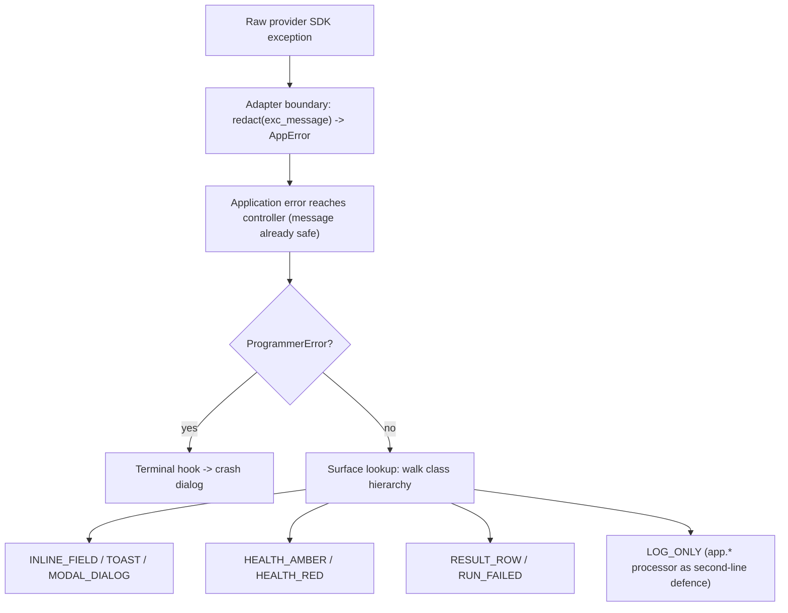

# Algorithm: Error Taxonomy

This document specifies the application error hierarchy of Ollama LLM Bench: the four error
categories, every leaf error type, how a provider or SDK exception is wrapped into an
application error at the adapter boundary, and how an error is dispatched to the user
interface. Every error in the application is an instance of exactly one class in one
coherent hierarchy; the class encodes both *what failed* and *how the application must
respond*. This file is the concrete catalogue; the binding principles and the
exception-native rationale are in `16_Engineering_Standards/05_ERROR_HANDLING_STANDARD.md`.

---

## Table of Contents

1. [Purpose](#1-purpose)
2. [Inputs](#2-inputs)
3. [Outputs](#3-outputs)
4. [Preconditions](#4-preconditions)
5. [Postconditions](#5-postconditions)
6. [Algorithm](#6-algorithm)
7. [Configuration](#7-configuration)
8. [Error handling](#8-error-handling)
9. [Threading and concurrency](#9-threading-and-concurrency)
10. [Examples](#10-examples)
11. [Test cases](#11-test-cases)

---

## 1. Purpose

Ollama LLM Bench talks to multiple LLM providers, parses model output, and persists
results to a local database; every one of those activities can fail, and the failures mean
very different things. A momentary network blip is not an invalid API key, and neither is
a logic bug in the application itself. The error taxonomy gives every failure a typed
class in a four-category hierarchy so the application can decide, mechanically and
consistently, whether to retry, what to show the user, and whether to crash. This document
specifies the hierarchy, the leaf types, the adapter-boundary wrapping, and the
error-to-UX dispatch.

---

## 2. Inputs

| Input | Type | Meaning |
|---|---|---|
| Raw failure | a provider SDK exception, an `httpx` error, an OS error, or an internal `raise` | The failure as it first occurs. |
| `ErrorContext` fields | redaction-safe values | `provider_id`, `model_id_truncated`, `endpoint`, `http_status`, `provider_error_code`, `attempt`, `request_id`, `correlation_id`. |

---

## 3. Outputs

| Output | Type | Meaning |
|---|---|---|
| Typed application error | an instance of an `AppError` leaf or `ProgrammerError` | The classified, context-carrying error. |
| UX surface set | a set of surface flags | Which UI surfaces the error reaches. |
| Result classification | `ErrorKind` + `ResultStatus` | When the error fails a pipeline unit, how the result row records it. |

---

## 4. Preconditions

- The error hierarchy classes are defined and importable.
- Every provider adapter is the sole holder of its provider's raw SDK exception types.
- The redaction module is available; the provider adapter applies `redact(text)` to the SDK exception's message string before placing it on `AppError.message`.

---

## 5. Postconditions

- Every failure is an instance of exactly one class in the hierarchy.
- No raw provider/SDK exception type exists outside the `_internal` package of its owning
  provider adapter.
- Every recoverable error carries a redaction-safe `ErrorContext`.
- A `ProgrammerError` is never swallowed; it reaches the process-terminal hook.

---

## 6. Algorithm

### 6.1 The four categories

Every error belongs to exactly one category. The category drives retry, surfacing, and
crash behaviour.

| Category | Meaning | Retried? | Reaches the user? | Crashes the app? |
|---|---|---|---|---|
| **Transient** | A momentary failure likely to succeed on retry — timeout, connection reset, provider 5xx, rate limit, database lock. | Yes (bounded) | Only as a summary if it persists. | No |
| **Permanent** | A real failure retrying cannot fix — bad request, content-filter rejection, quota exhausted, disk full, unparseable output. | No | Yes | No |
| **User** | A condition the user can fix and re-run — invalid configuration, a model that is not available, a user-initiated cancellation. | No | Yes, with actionable guidance. | No |
| **Programmer-error** | A bug — a broken invariant, an impossible state, a contract violation. | No | Crash dialog only. | Yes |

### 6.2 The hierarchy

Recoverable errors descend from `AppError`, which descends from `Exception`. The
programmer-error root descends from `BaseException` **outside** `Exception`, so it survives
`except Exception:` catch-all nets and reaches the terminal hook.

```mermaid
flowchart TD
    BE["BaseException"]
    EXC["Exception"]
    BE --> EXC
    BE --> PROG["ProgrammerError (category: programmer)"]

    EXC --> APP["AppError (root of recoverable errors)"]
    APP --> TRANS["TransientError (category: transient)"]
    APP --> PERM["PermanentError (category: permanent)"]
    APP --> USER["UserError (category: user)"]

    TRANS --> HTTPT["HttpTimeoutError"]
    TRANS --> HTTPC["HttpConnectionError"]
    TRANS --> PRL["ProviderRateLimitedError"]
    TRANS --> PSE["ProviderServerError"]
    TRANS --> POVL["ProviderOverloadedError"]
    TRANS --> DBL["DatabaseLockedError"]

    PERM --> PBR["ProviderBadRequestError"]
    PERM --> PCF["ProviderContentFilterError"]
    PERM --> PQE["ProviderQuotaExhaustedError"]
    PERM --> PCL["ProviderContextLengthError"]
    PERM --> PARSE["LLMOutputParseError"]
    PERM --> DBF["DatabaseDiskFullError"]
    PERM --> EMBU["EmbeddingUnavailableError"]

    USER --> PAUTH["ProviderAuthError"]
    USER --> CFG["ConfigurationError"]
    USER --> MNA["ModelNotAvailableError"]
    USER --> MENV["MissingEnvVarError"]
    USER --> TFE["TaskFileError"]
    USER --> OSE["OsAdapterError"]
    USER --> CANCEL["TaskCancelledError"]

    PROG --> DBI["DatabaseIntegrityError (schema invariant broken)"]
    PROG --> CONTRACT["ContractViolationError"]
    PROG --> VALERR["ValidationError (invalid domain value at construction)"]
```

### 6.3 Leaf catalogue

Every leaf type, with its category, the `ErrorKind` it maps to when it fails a pipeline
unit, and the `ResultStatus` that records it.

#### Transient leaves (retried; see `11_Services_and_Algorithms/18_RETRY_POLICY.md`)

| Leaf | Raised when | `ErrorKind` | Terminal `ResultStatus` if retries exhaust |
|---|---|---|---|
| `HttpTimeoutError` | A provider request exceeded the transport time budget. The `ErrorContext` carries the `phase` field (`"inference"`, `"judge"`, `"analysis"`, `"embedding"`, `"test_inference"`, or `"readiness"`) so the pipeline can route the failure to the correct terminal status. | `TIMEOUT` for `phase ∈ {"inference"}`; `JUDGE_TIMEOUT` for `phase ∈ {"judge", "analysis"}`; `TIMEOUT` (cosine-not-run, no exclusion) for `phase = "embedding"`; the test_inference and readiness paths do not produce per-task results. | `FAILED_TIMEOUT` (inference); `FAILED_JUDGE_TIMEOUT` (judge / analysis). Embedding timeouts do NOT settle the row to a terminal failure — they degrade the cosine phase only (see `06_EMBEDDING_SERVICE.md` §8 and DD-34). |
| `HttpConnectionError` | A connection was refused, reset, or DNS failed. | `PROVIDER` | `FAILED_PROVIDER` |
| `ProviderRateLimitedError` | The provider returned a rate-limit response (HTTP 429). May carry a retry-after delay. | `PROVIDER` | `FAILED_PROVIDER` |
| `ProviderServerError` | The provider returned a 5xx server error. | `PROVIDER` | `FAILED_PROVIDER` |
| `ProviderOverloadedError` | The provider reported temporary saturation. | `PROVIDER` | `FAILED_PROVIDER` |
| `DatabaseLockedError` | A SQLite write was blocked past the busy timeout. | `OTHER` | `ERRORED` (only if it escapes the persistence retry wrapper) |

#### Permanent leaves (never retried; surfaced)

| Leaf | Raised when | `ErrorKind` | Terminal `ResultStatus` |
|---|---|---|---|
| `ProviderBadRequestError` | The provider rejected the request as malformed (HTTP 400). | `PROVIDER` | `FAILED_PROVIDER` |
| `ProviderContentFilterError` | The provider refused on a content-policy ground. | `LLM` | `FAILED_INFERENCE` |
| `ProviderQuotaExhaustedError` | The provider account quota is exhausted. | `PROVIDER` | `FAILED_PROVIDER` |
| `ProviderContextLengthError` | The provider rejected the request because the prompt exceeded the model's context window (the provider's reported detail is carried, redacted). Permanent — retrying cannot shrink the prompt. Judge phase → `ERRORED` with a user-facing message advising a larger-context judge model (DD-46, `08_Cross_Cutting/08-P_judge_protocol.md` §4.3); inference phase → `FAILED_INFERENCE`. | `PROVIDER` | `ERRORED` (judge) / `FAILED_INFERENCE` (inference) |
| `LLMOutputParseError` | The judge or inference output could not be parsed into the expected shape. | `LLM` | `FAILED_INFERENCE` |
| `DatabaseDiskFullError` | A SQLite write failed because the disk is full. | `OTHER` | `ERRORED` |
| `EmbeddingUnavailableError` | The embedding endpoint could not produce a vector at the **run-start fail-fast embedding probe** (DD-48) — raised only there, where it settles the **run** `FAILED` before any inference. It is **not** raised per task: a per-task embedding failure during the cosine phase degrades that task's cosine to not-run (`11_Services_and_Algorithms/06_EMBEDDING_SERVICE.md` §8), it never throws. | `OTHER` | run `FAILED` (pre-inference); never a per-result `ERRORED` |

#### User leaves (never retried; surfaced with actionable guidance)

| Leaf | Raised when | `ErrorKind` | Terminal `ResultStatus` |
|---|---|---|---|
| `ProviderAuthError` | The provider rejected the credential (HTTP 401/403). | `PROVIDER` | `FAILED_PROVIDER` |
| `ConfigurationError` | A required configuration value is missing, malformed, or contradictory. | `OTHER` | `ERRORED` (rarely a per-unit failure; usually pre-run) |
| `ModelNotAvailableError` | The requested model is not available on the provider. | `PROVIDER` | `FAILED_PROVIDER` |
| `MissingEnvVarError` | The environment variable named by a provider's api key is unset or empty, so the secret could not be resolved. | `PROVIDER` | `FAILED_PROVIDER` (pre-run when caught at registry load) |
| `TaskFileError` | A task file or folder could not be read or parsed as YAML at all. | `OTHER` | not a per-unit failure — caught before the run starts |
| `OsAdapterError` | An OS integration call failed (clipboard, file manager, picker subsystem). | `OTHER` | not a per-unit failure |
| `TaskCancelledError` | The user paused or stopped the run; raised by `CancellationToken.raise_if_cancelled()`. | not an error kind | not a failure — produces a clean halt |

#### Programmer-error leaves (never caught; crash the process)

| Leaf | Raised when |
|---|---|
| `DatabaseIntegrityError` | A schema invariant is broken — a foreign key or uniqueness constraint the application logic should have guaranteed. |
| `ContractViolationError` | A contract or assertion is violated — an impossible state, a "this cannot happen" branch. |
| `ValidationError` | A domain value violated a declared `msgspec.Meta` constraint at construction time; a programmer error, never an expected runtime condition. |

### 6.4 Mixed inheritance for multi-axis dispatch

Some leaves must be dispatched on two axes at once: their *category* (which drives retry)
and their *provider-surface meaning* (which drives the health indicator **and** the
LLM-client contract). Such leaves inherit from a category root **and** from the
`ProviderError` marker type. For example, `ProviderAuthError(UserError, ProviderError)`
lets the retry filter match it as a `UserError` (so it is never retried) and the health
dispatch match it as a `ProviderError` (so the provider-health indicator turns red)
simultaneously. Method resolution order is left-to-right, so the category root listed
first determines the `category`. The `ProviderError`-marked leaves are: `HttpTimeoutError`,
`HttpConnectionError`, `ProviderRateLimitedError`, `ProviderServerError`,
`ProviderOverloadedError`, `ProviderBadRequestError`, `ProviderContentFilterError`,
`ProviderQuotaExhaustedError`, `ProviderAuthError`, `ModelNotAvailableError`, and
`MissingEnvVarError`.

**`ProviderError` is the provider-surface contract type the LLM client raises (D-R-11, SPEC-007).** It reconciles three documents that previously disagreed:

- **LLM client (`11_Services_and_Algorithms/02_LLM_CLIENT_PROTOCOL.md`).** Every exception the client raises across its boundary is one of these `ProviderError`-marked leaves, so the client's postcondition "raises only a `ProviderError`; no raw SDK exception escapes" holds. The transport-timeout leaf is `HttpTimeoutError`; where the client contract says `TimeoutError` it means an **alias for `HttpTimeoutError`** — there is no separate `TimeoutError` class.
- **Retry policy (`11_Services_and_Algorithms/18_RETRY_POLICY.md`).** Because each leaf lists its **category root first** in the MRO, `isinstance(err, TransientError)` is `True` exactly for the retryable provider leaves (`HttpTimeoutError`, `HttpConnectionError`, `ProviderRateLimitedError`, `ProviderServerError`, `ProviderOverloadedError`) and `False` for the permanent/user ones — so the retry filter works on the very object the client raised. `ProviderRateLimitedError` additionally carries a `retry_after: float | None` field the retry policy honours.
- **Circuit breaker / health.** The `ProviderError` marker drives provider-health attribution; an auth/quota leaf turns the provider indicator red without being retried.

A single raised leaf thus satisfies the client's narrow contract (it *is* a `ProviderError`), the retry policy (its category is `TransientError`/`PermanentError`/`UserError`), and the breaker simultaneously. No flat "error_kind discriminator" type is needed — the class identity carries every axis.

### 6.5 Adapter-boundary wrapping

Each provider adapter is the **sole** place where its provider's raw SDK exceptions are
allowed to exist. At the boundary the adapter performs four steps, in order:

1. **Translate.** Catch the raw provider/SDK exception, pass its message string through
   `redact(text)` (the redaction module — `10_Domain_and_Data/08_REDACTION_PATTERNS.md`
   §7.1), and raise the matching application leaf populated with an `ErrorContext` and
   the redacted message on `AppError.message`. Chain the original as the cause
   (`raise AppLeaf(...) from original`) so the per-run log retains the full
   diagnostic — the chained original is logged to the `run.*` namespace, which has no
   redaction processor; only the wrapped, redacted message surfaces through display,
   the `app.*` log, exports, and the clipboard. **Once redacted at this boundary, the
   message flows everywhere without further redaction.**
2. **Retry.** Transient leaves are retried per `11_Services_and_Algorithms/18_RETRY_POLICY.md`.
3. **Break.** The call is wrapped in the circuit breaker per
   `11_Services_and_Algorithms/08_CIRCUIT_BREAKER.md`.
4. **Surface upward.** The translated, possibly-retried error propagates to the service
   layer as an application error type only.

The mapping each provider adapter applies:

| Raw failure observed at the boundary | Translated application leaf |
|---|---|
| Transport timeout (`httpx` read/connect timeout, SDK timeout) | `HttpTimeoutError` |
| Connection refused / reset / DNS failure | `HttpConnectionError` |
| HTTP 401 / 403 / SDK authentication error | `ProviderAuthError` |
| HTTP 429 / SDK rate-limit error (read any retry-after) | `ProviderRateLimitedError` |
| HTTP 5xx / SDK server error | `ProviderServerError` |
| SDK "overloaded" / temporary-saturation error | `ProviderOverloadedError` |
| HTTP 400 / SDK invalid-request error | `ProviderBadRequestError` |
| SDK content-filter / safety refusal | `ProviderContentFilterError` |
| SDK quota / billing exhausted | `ProviderQuotaExhaustedError` |
| Unknown model / model-not-found from the provider | `ModelNotAvailableError` |
| The `CancellationToken` observed cancelled at a checkpoint during the call | `TaskCancelledError` |
| Any untyped library failure with no typed hierarchy | classified by HTTP status if present, else `ProviderServerError` (transient) so it is retried once and then surfaced |

No provider SDK exception type ever escapes the LLM Client. The per-provider quirks — the
exact SDK exception classes for each provider — are catalogued in
`11_Services_and_Algorithms/02_LLM_CLIENT_PROTOCOL.md`.

### 6.6 Error-to-UX dispatch

Once a translated error reaches the controller layer its `AppError.message` is already
canonically safe (the adapter-boundary `redact` was applied in §6.5). The controller
dispatches the error to one or more UI surfaces by a data-driven table. A lookup walks
the error's class hierarchy and takes the first explicit entry, falling back to the
category default. No further redaction is applied at the controller boundary — the
message flows to dialogs, toasts, result rows, and the `app.*` log (where the structlog
processor is the second-line defence) verbatim.

Available surfaces:

| Surface | Meaning |
|---|---|
| `INLINE_FIELD` | An inline validation strip next to the offending input field. |
| `TOAST` | A transient, non-blocking notification via the Notification Service. |
| `HEALTH_AMBER` | The provider-health dot pulses amber (degraded). |
| `HEALTH_RED` | The provider-health dot turns red (down). |
| `MODAL_DIALOG` | A blocking modal dialog the user must acknowledge. |
| `RESULT_ROW` | The failure is recorded against the result row in the run table. |
| `RUN_FAILED` | The whole run is marked `FAILED`. |
| `LOG_ONLY` | Recorded in the logs with no direct UI surface. |

Dispatch decision rules:

1. **In-flight transient errors during a long run are quiet** — `LOG_ONLY | HEALTH_AMBER | RESULT_ROW`,
   no toast, no modal. The end-of-run report is the user-visible summary; mid-run
   transient noise is suppressed.
2. **First occurrence of an error category in a run shows a toast; repeats are suppressed.**
   Repeat suppression is keyed by `(provider_id, error_category)`.
3. **`RUN_FAILED` is set only when the whole run cannot continue** — for example a
   `ProviderAuthError`, `ProviderQuotaExhaustedError`, or `DatabaseDiskFullError`. A single
   failing result row is `RESULT_ROW`, not `RUN_FAILED`.
4. **`MODAL_DIALOG` is reserved for user-actionable errors** the user must resolve before
   starting another run.
5. **A `ProgrammerError` bypasses this table entirely** — it is never caught, never
   redacted by a controller, and reaches the process-terminal crash dialog directly.

The dispatch map per leaf:

| Leaf | UX surfaces |
|---|---|
| `HttpTimeoutError`, `HttpConnectionError`, `ProviderServerError`, `ProviderOverloadedError` | `LOG_ONLY \| HEALTH_AMBER \| RESULT_ROW` mid-run; first-occurrence `TOAST` |
| `ProviderRateLimitedError` | `LOG_ONLY \| HEALTH_AMBER \| RESULT_ROW`; circuit-open indicator if the breaker trips |
| `DatabaseLockedError` | `LOG_ONLY` (silent if the persistence retry wrapper recovers) |
| `ProviderBadRequestError`, `ProviderContentFilterError`, `LLMOutputParseError` | `LOG_ONLY \| RESULT_ROW`; first-occurrence `TOAST` |
| `ProviderQuotaExhaustedError`, `DatabaseDiskFullError` | `MODAL_DIALOG \| RESULT_ROW \| RUN_FAILED` |
| `EmbeddingUnavailableError` | `LOG_ONLY \| RESULT_ROW`; first-occurrence `TOAST` |
| `ProviderAuthError`, `MissingEnvVarError` | `MODAL_DIALOG \| HEALTH_RED \| RUN_FAILED` (pre-run: also `INLINE_FIELD` in Settings) |
| `ConfigurationError` | `INLINE_FIELD \| MODAL_DIALOG` (caught before run start) |
| `ModelNotAvailableError` | `MODAL_DIALOG \| HEALTH_AMBER` (pre-run); `RESULT_ROW` (mid-run) |
| `TaskFileError` | `INLINE_FIELD \| TOAST` (Task Editor and run-creation surfaces) |
| `OsAdapterError` | `TOAST` |
| `TaskCancelledError` | `TOAST \| RESULT_ROW` (the paused/stopped state, not a failure) |
| `DatabaseIntegrityError`, `ContractViolationError`, `ValidationError` | crash dialog only — never enters this table |

### 6.7 Per-layer error policy

| Layer | Policy |
|---|---|
| UI primitives | Never surface a raw exception. Show an inline validation strip or call the Notification Service. |
| Controllers / Adapters | Catch service exceptions, redact, translate into a user-facing message, dispatch to surfaces. |
| Services | May raise only the categories named in their contract in `08-E`. |
| Benchmark Pipeline | Never raises to its caller. Captures every unit failure into `BenchmarkResult.error_kind`, `.error_message`, and `ResultStatus`; a catastrophic failure sets `RunStatus.FAILED`. |
| Domain model constructors | Raise `ValidationError` (a programmer error) on an invalid argument. |
| Provider adapters | Catch raw SDK exceptions, wrap into the taxonomy, chain the cause. |

---

## 7. Configuration

The taxonomy itself has no tunable settings. The behaviour driven by category is tuned
elsewhere: retry parameters in `11_Services_and_Algorithms/18_RETRY_POLICY.md`, the circuit
breaker in `11_Services_and_Algorithms/08_CIRCUIT_BREAKER.md`, and the redaction denylist
and length cap in `10_Domain_and_Data/08_REDACTION_PATTERNS.md`.

---

## 8. Error handling

This document *is* the error-handling specification. The rules it enforces:

- A recoverable error must descend from `AppError`; a programmer-error must descend from
  `ProgrammerError`, never from `Exception`.
- There is no single flat error class — a flat class loses category dispatch and the
  multi-axis matching that mixed inheritance provides.
- `except Exception` is forbidden outside a small allowlist (the terminal hook, and an
  adapter wrapping a native library with no typed hierarchy); an architecture-test AST
  scanner enforces this.
- A new error is raised with `raise NewError(...) from original` so the root cause is
  preserved.
- No secret-bearing value is placed on `ErrorContext`; secrets live only on the raw
  exception arguments and are stripped by the redaction module before any egress.
- A programmer-error is never caught and never recovered.

---

## 9. Threading and concurrency

- Error classification at the adapter boundary happens on the worker thread, inside the
  provider call.
- A cooperative cancellation observed at a checkpoint raises `TaskCancelledError` at the adapter
  boundary so the service layer only handles the application's own cancellation type.
- The error-to-UX dispatch happens on the main thread, in the controller layer; a
  background worker that needs to surface an error emits an EventBus signal and the
  adapter layer marshals it.
- The loop-level exception handler routes an uncaught `ProgrammerError` to the
  process-terminal hook and redacts any other uncaught exception onto the log stream.

---

## 10. Examples

### Example 1 — happy path: a transient timeout that recovers

Provider A times out on one inference call. The adapter catches the `httpx` read timeout,
raises `HttpTimeoutError` with an `ErrorContext` (`provider_id`, `attempt=1`,
`correlation_id`), and the retry wrapper retries. The second attempt succeeds. The error
was transient, so it surfaced only as `LOG_ONLY | HEALTH_AMBER` for the duration of the
retry; the result row completes normally with no failure recorded.

### Example 2 — edge case: an authentication failure fails the whole run

Provider B's API key is wrong. The first inference call raises a provider SDK 401; the
adapter translates it to `ProviderAuthError(UserError, ProviderError)`. The retry
filter matches it as a `UserError` and does **not** retry it. The circuit breaker
**excludes** it from its failure count (a user/config problem retrying cannot fix). The
dispatch lookup matches it as both a user-actionable error and a `ProviderError`, so it
shows a `MODAL_DIALOG`, turns the health dot `HEALTH_RED`, and — because every B-targeted
unit would fail the same way — sets `RUN_FAILED`. The persisted `RunStatus` becomes
`FAILED`.

### Example 3 — edge case: a broken schema invariant crashes the process

A persistence-store write hits a uniqueness constraint that the application logic should have
guaranteed. The persistence layer raises `DatabaseIntegrityError`, a `ProgrammerError`
outside `Exception`. It is not matched by any `except* AppError` block in the pipeline, it
is not matched by any `except Exception` net, and it propagates to the loop-level handler
and the process-terminal hook, which shows the crash dialog with a redacted diagnostic.
The application crashes rather than continuing with a corrupt assumption.

---

## 11. Test cases

1. **Every leaf has a category.** Each leaf type resolves to exactly one of the four
   categories via its first base class.
2. **ProgrammerError is outside Exception.** `issubclass(ProgrammerError, Exception)` is
   `False`; `except Exception` does not catch it.
3. **No raw SDK exception escapes.** An architecture test asserts no provider SDK
   exception type is imported outside the `_internal` package of its owning adapter.
4. **Cause is chained.** Every translated error has `__cause__` set to the original.
5. **Transient retried, others not.** A `TransientError` leaf is retried; a
   `PermanentError`, `UserError`, or `ProgrammerError` is never retried.
6. **Cancellation surfaces as `TaskCancelledError`.** A cooperative cancellation during a
   provider call is observed as `TaskCancelledError` (the `CancellationToken` raises it at a
   checkpoint); no raw runtime cancellation type escapes the adapter.
7. **Mixed-inheritance dispatch.** `ProviderAuthError` matches both `UserError` (retry
   filter) and `ProviderError` (health dispatch); MRO gives it `category == user`.
8. **ErrorKind / ResultStatus mapping.** Each leaf that can fail a pipeline unit maps to
   the `ErrorKind` and terminal `ResultStatus` in the catalogue tables.
9. **Quiet transients mid-run.** An in-flight transient error during a long run produces
   `LOG_ONLY | HEALTH_AMBER | RESULT_ROW` and no toast or modal.
10. **First-occurrence toast, repeats suppressed.** The first error of a category in a run
    shows one toast; subsequent same-category errors for the same provider show none.
11. **RUN_FAILED only on catastrophic failure.** A single failing result row sets
    `RESULT_ROW` only; an auth failure or disk-full sets `RUN_FAILED`.
12. **Redaction at the adapter boundary.** A fuzz test embeds random secrets in every
    leaf's raw SDK message and asserts no denylist pattern survives the adapter's
    `redact(exc_message)` wrap; a second fuzz test asserts no denylist pattern survives
    the `app.*` structlog processor.
13. **ValidationError on bad construction.** Constructing a domain record with a value
    violating its `msgspec.Meta` constraint raises `ValidationError` and crashes (not
    caught).
14. **Untyped library failure.** An untyped failure from a library with no typed hierarchy
    is classified by HTTP status when present and otherwise as `ProviderServerError`.
