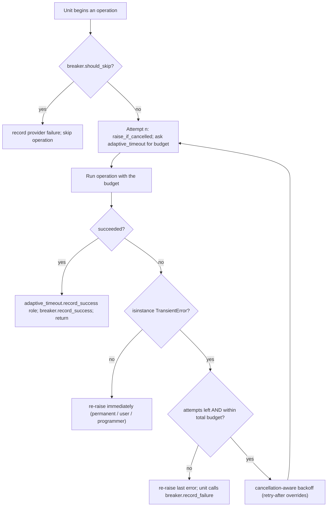

# Algorithm: Retry Policy

This document specifies how Ollama LLM Bench retries failed operations: which errors are
eligible, the per-category retry parameters, how a provider-supplied retry-after delay is
honoured, how a pause or stop is respected between attempts, and how retry interacts with
the adaptive inference timeout and the provider circuit breaker. Retries apply only to
transient errors and only at the provider adapter boundary; permanent, user, and
programmer errors are never retried. The binding principle that "the retry filter is the
category root, not a leaf list" is from
`16_Engineering_Standards/05_ERROR_HANDLING_STANDARD.md`; this file is the concrete
algorithm.

---

## Table of Contents

1. [Purpose](#1-purpose)
2. [Inputs](#2-inputs)
3. [Outputs](#3-outputs)
4. [Preconditions](#4-preconditions)
5. [Postconditions](#5-postconditions)
6. [Algorithm](#6-algorithm)
7. [Configuration](#7-configuration)
8. [Error handling](#8-error-handling)
9. [Threading and concurrency](#9-threading-and-concurrency)
10. [Examples](#10-examples)
11. [Test cases](#11-test-cases)

---

## 1. Purpose

A momentary network blip, a provider 5xx, a rate-limit response, or a brief database lock
will usually succeed on a second attempt; failing the whole operation on the first such
error would make a benchmark run needlessly fragile. The retry policy gives transient
failures a bounded number of further attempts with exponential backoff and jitter, while
guaranteeing that a non-transient failure is surfaced immediately, that a pause or stop is
honoured between attempts, and that retrying never undermines the adaptive timeout or the
circuit breaker. This document specifies the retry algorithm and its parameters.

---

## 2. Inputs

| Input | Type | Meaning |
|---|---|---|
| `operation` | a blocking callable (runs on a `TaskRunner` worker thread) | The retryable call — a provider `chat`, `embed`, `list_models`, or a persistence-store write. |
| `error` | a raised exception | The failure of one attempt, used to decide whether to retry. |
| `attempt_index` | `int` | The 1-based number of the attempt about to run. |
| `token` | `CancellationToken` | The per-run cooperative cancellation handle. |
| `retry_after` | `float \| None` | A provider-supplied delay (seconds) parsed from a rate-limit response, when present. |
| `retry_count` | `int` | The configured retry count from the run's frozen settings snapshot. |

---

## 3. Outputs

| Output | Type | Meaning |
|---|---|---|
| Operation result | the `operation` return value | When an attempt succeeds. |
| Final error | a typed application error | When every attempt is exhausted; re-raised to the service layer. |
| `BenchmarkResultAttempt` rows | `tuple[BenchmarkResultAttempt, ...]` | One row per attempt, recording `timeout_ms`, `duration_ms`, `outcome`, `error_kind`, and `error_message`. |

---

## 4. Preconditions

- The error taxonomy is in place: every failure is a typed `AppError` leaf or a
  `ProgrammerError` (`11_Services_and_Algorithms/17_ERROR_TAXONOMY.md`).
- The retry wrapper sits at the provider adapter boundary, inside the `_internal` package,
  with the raw SDK exception already translated to an application leaf.
- A fresh `CancellationToken` exists for the run and is threaded into the wrapped call.

---

## 5. Postconditions

- The operation either returned a value or raised a typed application error to the service
  layer.
- The total number of attempts never exceeds the policy's attempt cap and the elapsed
  retry time never exceeds the policy's total budget.
- A pause or stop requested at any point produces `TaskCancelledError` at the start of the
  next attempt or during the backoff sleep — no further attempt runs.
- One `BenchmarkResultAttempt` row exists per attempt made.
- No permanent, user, or programmer error was retried.

---

## 6. Algorithm

### 6.1 The retry filter

Retries are decided on the **category root**, not on individual leaf types. The filter is
`TransientError`: an error is retryable if and only if `isinstance(error, TransientError)`.
Adding a new transient leaf therefore never requires editing the retry policy. A
`PermanentError`, a `UserError` (including `TaskCancelledError`), and a `ProgrammerError`
are never retried — they are re-raised immediately. A `ProgrammerError` is never even
caught by the retry wrapper, because it descends from `BaseException` outside `Exception`.

### 6.2 Per-category retry parameters

Each retry uses exponential backoff with jitter, an attempt cap, and a total time budget.
The defaults are keyed by category; a few leaf types carry tuned parameters.

| Error class | Attempts | Initial wait | Max wait | Jitter | Total budget |
|---|---|---|---|---|---|
| `TransientError` (default) | `1 + retry_count` (default `retry_count = 3`, so 4) | 0.5 s | 8.0 s | +/-1.0 s | 60 s |
| `ProviderOverloadedError` | 5 | 2.0 s | 30.0 s | +/-2.0 s | 120 s |
| `ProviderRateLimitedError` | 4 | 1.0 s, or the provider-supplied retry-after | 20.0 s | +/-1.0 s | 90 s |
| `DatabaseLockedError` | 8 | 0.02 s | 0.5 s | +/-0.05 s | 5 s |

**Attempt count vs adaptive-timeout ladder length (SPEC-054).** The retry `Attempts` cap (how many times a *transient* failure is retried) and the adaptive-timeout ladder (how long each attempt may run) are **independent dimensions**: the former is driven by this policy, the latter by the Adaptive Timeout Service (`11_Services_and_Algorithms/07_ADAPTIVE_TIMEOUT.md`). When the attempt count exceeds the ladder length (e.g. `ProviderOverloadedError`'s 5 attempts against a 4-rung inference ladder), each attempt beyond the ladder's last rung **reuses the ladder's maximum budget** (the top rung); the budget never wraps, resets, or becomes undefined. The two counters are not reconciled into one — a unit may legitimately make 5 overload-retry attempts while the ladder only defined 4 escalating budgets, the 5th running at the max budget.

The default transient `Attempts` value is `1 + retry_count`, where `retry_count` is the
`benchmark.retry_count` setting (a `RetryCount`, range 0..10) read from the run's frozen
settings snapshot; the leaf-specific rows above use fixed attempt counts because their
failure modes are not the user's concern. An error class absent from this table falls back
to the default transient row. Absence of a *category* from any retry wrapping means "do
not retry".

### 6.3 Backoff computation

For attempt `n` (1-based; the first attempt has `n = 1` and no preceding wait), the wait
before attempt `n + 1` is:

```
base   = min(initial_wait * 2 ** (n - 1), max_wait)
wait   = max(0, base + uniform(-jitter, +jitter))
```

The backoff is capped at `max_wait` before jitter is added. The cumulative elapsed time
across all attempts and waits is tracked; if the next computed wait would push the
cumulative elapsed time past the total budget, no further attempt is made and the last
error is re-raised.

### 6.4 Honouring a provider retry-after

When a provider returns an explicit retry-after delay on a rate-limit response (an HTTP
`Retry-After` header or an SDK-surfaced value), that delay **overrides** the computed
backoff for the next attempt. The override is clamped to the policy's `max_wait` so a
pathological provider value cannot stall a run; the total-budget check still applies. If
no retry-after is supplied, `ProviderRateLimitedError` uses the normal exponential backoff.

### 6.5 Respecting cancellation

The `CancellationToken` is checked at the start of **every** attempt: before attempt `n`
runs, the wrapper calls `token.raise_if_cancelled()`, which raises `TaskCancelledError`
when a pause or stop has been requested. The backoff sleep is itself cancellation-aware —
it is implemented as a cancellation-aware `token.wait(wait_seconds)` (which returns early if the token is cancelled), so a pause
requested mid-backoff ends the sleep immediately and the next start-of-attempt checkpoint
raises `TaskCancelledError`. A retry is therefore never the reason a pause is delayed
beyond the in-flight attempt. A **hard** cancellation (stop / shutdown — DD-39)
additionally aborts the in-flight attempt itself mid-stream via the token's abort hook;
the aborted attempt is recorded as cancelled, not as a failure, and is never counted by
the retry filter, the adaptive-timeout service, or the circuit breaker.
`TaskCancelledError` is a `UserError`, so the retry filter
does not retry it; it is re-raised so the pipeline can record the clean halt.

### 6.6 Recording each attempt

Every attempt produces one `BenchmarkResultAttempt` row, persisted with the result:

- `attempt_index` — the 1-based attempt number.
- `timeout_ms` — the adaptive-timeout budget used for the attempt (Section 6.7).
- `duration_ms` — how long the attempt actually took, or `None` if it never started.
- `outcome` — `SUCCESS`, `TIMEOUT`, or `ERROR` (`AttemptOutcome`).
- `error_kind` / `error_message` — the failure classification and detail; `None` on
  success.

The attempt history lets the Result widget detail panel and the adaptive-timeout audit
show exactly how a result was reached.

### 6.7 Interaction with the adaptive timeout

Each attempt of an LLM call gets its **own** timeout budget from the
AdaptiveTimeoutService — keyed on the call's role (`INFERENCE` for Phase 2 inference;
`JUDGE` for Phase 4 per-task judge calls AND for the user-initiated run-analysis
generation call). Before attempt `n` the wrapper calls
`adaptive_timeout.next_budget(provider_id, model_name, role, attempt_index=n)`. The
adaptive timeout policy may grant a longer budget to a later attempt of the same
`(provider, model, role)` bucket. After each attempt the wrapper calls the role-aware
façade — `adaptive_timeout.record_success(provider_id, model_name, role, observed_ms)`
on a successful attempt, or `adaptive_timeout.record_timeout(provider_id, model_name, role)`
on a timed-out attempt. Consequences:

- A timeout failure (`HttpTimeoutError`) is a `TransientError`, so it is retried; the next
  attempt may carry a larger budget at the same role.
- When an attempt hits the maximum budget of its role, `record_timeout` increments the
  bucket's consecutive-max-timeout counter. After the role's threshold
  (`benchmark.consecutive_max_timeouts_to_exclude` for role=INFERENCE,
  `eval.judge_timeout_consecutive_threshold` for role=JUDGE) the AdaptiveTimeoutService
  excludes the model from the run **for that role**; once excluded, the pipeline does not
  schedule further attempts for that `(target, role)` bucket — retry stops because there
  is nothing left to retry against. Role independence: a role=JUDGE exclusion does NOT
  exclude the same `(provider, model)` at role=INFERENCE, and vice versa (DD-34).
- If retries for one inference unit (role=INFERENCE) are exhausted while every attempt
  timed out, the result is recorded as `FAILED_TIMEOUT`; if the last attempt failed for a
  non-timeout provider reason, it is `FAILED_PROVIDER`. If retries for one per-task judge
  call (role=JUDGE) are exhausted while every attempt timed out, the result is recorded as
  `FAILED_JUDGE_TIMEOUT` (DD-34). The adaptive-timeout algorithm — including the per-role
  bucket semantics — is specified in
  `11_Services_and_Algorithms/07_ADAPTIVE_TIMEOUT.md`.

### 6.8 Interaction with the circuit breaker

The circuit breaker is consulted **outside** the retry wrapper, by the pipeline unit,
before the operation is attempted at all. The relationship:

- Before a unit calls the retried operation it calls
  `circuit_breaker.should_skip(provider_id)`. When the breaker is tripped the unit records
  a provider failure for the result **without** entering the retry wrapper — a tripped
  provider is fail-fast, not retried.
- When the retry wrapper finally exhausts its attempts for a provider-category failure, it
  re-raises the error; the pipeline unit then calls
  `circuit_breaker.record_failure(provider_id)`. Repeated exhausted retries against one
  provider therefore advance the breaker toward tripping.
- A successful operation (on any attempt) causes the unit to call
  `circuit_breaker.record_success(provider_id)`, which resets the breaker's failure count
  or closes a probing breaker.
- User/configuration errors (`ProviderAuthError`, `ProviderBadRequestError`) are excluded
  from the breaker's failure count — they are not transient and retrying cannot fix them.

The retry wrapper handles *within-attempt* transience; the circuit breaker handles
*provider-wide* instability across many units. Each computed retry backoff is bounded by
the policy's total budget; the breaker's cooldown is a separate, longer window. The
circuit-breaker algorithm is specified in `11_Services_and_Algorithms/08_CIRCUIT_BREAKER.md`.



---

## 7. Configuration

| Setting key | Type | Effect |
|---|---|---|
| `benchmark.retry_count` | `RetryCount` (0..10) | Sets the default transient attempt cap to `1 + retry_count`. `0` means a single attempt, no retry. |
| `benchmark.consecutive_max_timeouts_to_exclude` | `PositiveInt` | Consecutive maximum-timeout failures before the AdaptiveTimeoutService excludes a model, ending retries for that target. |

Both keys are read from the active run's frozen settings snapshot
(`BenchmarkRunSettingEntry`), never from the live `app_settings`, so a run's retry
behaviour is stable for its whole lifetime. The leaf-specific parameter rows in Section 6.2
(`ProviderOverloadedError`, `ProviderRateLimitedError`, `DatabaseLockedError`) are fixed
and not user-tunable.

---

## 8. Error handling

- The retry wrapper catches only `Exception`-rooted errors; a `ProgrammerError` is outside
  `Exception` and is never caught — it propagates to the terminal hook.
- Only `TransientError` instances are retried; everything else is re-raised on the first
  failure.
- When all attempts are exhausted, the **last** error is re-raised to the service layer
  with its `__cause__` chain intact.
- `TaskCancelledError` raised by a cancellation check is re-raised unmodified and stops
  the retry loop; it is never treated as a failure to retry.
- The retry wrapper never swallows an error silently; an exhausted retry always re-raises.

---

## 9. Threading and concurrency

- The retry wrapper runs inside the wrapped operation's worker thread; it calls the
  operation and the backoff sleep synchronously.
- The backoff sleep is a cancellation-aware `token.wait(timeout)` between
  `token.wait()`; it never blocks the loop.
- Execution is strictly serial (D-R-16): **exactly one pipeline unit is inside a retry
  wrapper at any moment** — there is no fan-out. The unit has its own attempt counter and
  its own budget; the shared `CancellationToken` cancels it at its next attempt boundary.
- The retry wrapper touches no Qt object and no shared mutable state beyond the
  AdaptiveTimeoutService and ProviderCircuitBreaker, both of which are synchronous
  in-memory services consulted only on the dispatcher thread (DD-38), never inside the
  worker unit.

---

## 10. Examples

### Example 1 — happy path: a transient 5xx that recovers on retry

An inference call to provider A returns HTTP 503. The adapter raises
`ProviderServerError` (transient). Attempt 1 has failed; the wrapper checks the token
(not cancelled), computes a backoff of `0.5 s` plus jitter, sleeps, then runs attempt 2.
Attempt 2 succeeds. Two `BenchmarkResultAttempt` rows are recorded — attempt 1 with
`outcome = ERROR`, attempt 2 with `outcome = SUCCESS` — and the operation returns the
successful response. `circuit_breaker.record_success` is called; no failure is recorded on
the result.

### Example 2 — edge case: a rate limit with a provider retry-after

Provider B returns HTTP 429 with `Retry-After: 12`. The adapter raises
`ProviderRateLimitedError` carrying `retry_after = 12.0`. The wrapper ignores the computed
exponential backoff and waits 12 s (clamped to the 20 s `max_wait`, so 12 s stands),
checking the token at the start of the next attempt. The next attempt succeeds. Had the
provider sent `Retry-After: 600`, the wait would be clamped to 20 s, and if 20 s would
exceed the 90 s total budget the wrapper would stop and re-raise.

### Example 3 — edge case: a pause during a backoff sleep

An inference unit is in a 6 s backoff sleep before its third attempt when the user clicks
Pause. The controller calls `token.cancel(reason=CancelReason.USER_PAUSE)`. The cancellation-aware
sleep — a cancellation-aware `token.wait(6)` — ends immediately. The
wrapper's next start-of-attempt checkpoint calls `raise_if_cancelled()`, which raises
`TaskCancelledError`. The third attempt never runs. The result row keeps the two recorded
attempts and the unit halts cleanly; the run's persisted status stays `INCOMPLETE`.

### Example 4 — edge case: retries exhausted by repeated timeouts and model exclusion (role=INFERENCE)

A slow model on provider A times out on every attempt during Phase 2 inference. Each
`HttpTimeoutError` is transient and is retried; each attempt hits the maximum role=INFERENCE
adaptive-timeout budget, so `adaptive_timeout.record_timeout(provider_id, model_name,
role=INFERENCE)` increments the consecutive-max-timeout counter. The unit exhausts its
`1 + benchmark.retry_count` attempts and records `FAILED_TIMEOUT`. The next unit for the
same target finds, via `adaptive_timeout.is_excluded(...)`, that the consecutive-max-timeout
threshold (`benchmark.consecutive_max_timeouts_to_exclude`) has been reached and the model
is now excluded **at role=INFERENCE**; the pipeline schedules no further inference attempts
for that target and the remaining units for it are recorded as `FAILED_TIMEOUT` without
contacting the provider. The same `(provider, model)` pair is **not** excluded at
role=JUDGE — those buckets are independent (DD-34).

### Example 4a — edge case: retries exhausted by repeated judge-call timeouts and judge model exclusion (role=JUDGE)

A GRADED run's judge model on provider B times out on every per-task judge call
during Phase 4. Each judge-call timeout calls `adaptive_timeout.record_timeout(provider_id,
model_name, role=JUDGE)`; the role=JUDGE bucket's consecutive-max-timeout counter
increments. After exhausting the role=JUDGE ladder for one task, that task's row records
`FAILED_JUDGE_TIMEOUT` (DD-34) with `error_kind = JUDGE_TIMEOUT`. After
`eval.judge_timeout_consecutive_threshold` such failures in a row, the AdaptiveTimeoutService
flags the bucket EXCLUDED for role=JUDGE; the pipeline emits `_judge_model_excluded`
exactly once, sets a `judge_excluded` flag, and every remaining task that would have entered
Phase 4 settles to `FAILED_JUDGE_TIMEOUT` directly without the judge call being attempted.
**Phase 2 (inference) and Phase 3 (cosine) for those remaining tasks continue normally** —
the run does NOT abort.

---

## 11. Test cases

1. **Filter is the category root.** A custom new transient leaf is retried with no change
   to the retry policy; a custom permanent leaf is not.
2. **Permanent / user / programmer not retried.** A `PermanentError`, a `UserError`, and a
   `ProgrammerError` each cause exactly one attempt (the programmer error is not even
   caught).
3. **Attempt cap.** With `retry_count = 3` the default transient policy makes at most 4
   attempts; with `retry_count = 0` it makes exactly 1.
4. **Total budget.** A series of transient failures whose cumulative backoff would exceed
   the 60 s budget stops before the budget is breached and re-raises.
5. **Exponential backoff with jitter.** Successive computed waits grow geometrically, are
   capped at `max_wait`, and vary within the jitter band.
6. **Retry-after honoured.** A `ProviderRateLimitedError` carrying a retry-after waits
   that delay (clamped to `max_wait`) instead of the computed backoff.
7. **Cancellation at attempt start.** A pause requested between attempts raises
   `TaskCancelledError` at the next start-of-attempt checkpoint; no further attempt runs.
8. **Cancellation during backoff.** A pause requested mid-backoff ends the sleep
   immediately; the next checkpoint raises `TaskCancelledError`.
9. **Attempt rows recorded.** Every attempt produces one `BenchmarkResultAttempt` with the
   correct `attempt_index`, `timeout_ms`, `outcome`, and error fields.
10. **Adaptive-timeout budget per attempt.** Each attempt of an LLM call requests
    `next_budget(provider_id, model_name, role, attempt_index)` with its own
    `attempt_index` and the call's role (INFERENCE or JUDGE); later attempts may receive a
    larger budget within the role's ceiling.
11. **Exclusion ends retries.** Once the AdaptiveTimeoutService excludes a `(model, role)`
    bucket, no further retry attempts are scheduled for that target at that role. The
    other role bucket for the same `(provider, model)` is unaffected (DD-34).
12. **Breaker fail-fast.** A tripped circuit breaker causes the unit to record a provider
    failure without entering the retry wrapper.
13. **Breaker advanced by exhausted retries.** Exhausting retries for a provider-category
    failure causes `circuit_breaker.record_failure`; a success on any attempt causes
    `circuit_breaker.record_success`.
14. **Auth error excluded from breaker.** A `ProviderAuthError` is re-raised on the first
    failure and does not increment the breaker's failure count.
15. **Last error re-raised with cause.** An exhausted retry re-raises the last error with
    its `__cause__` chain preserved.
