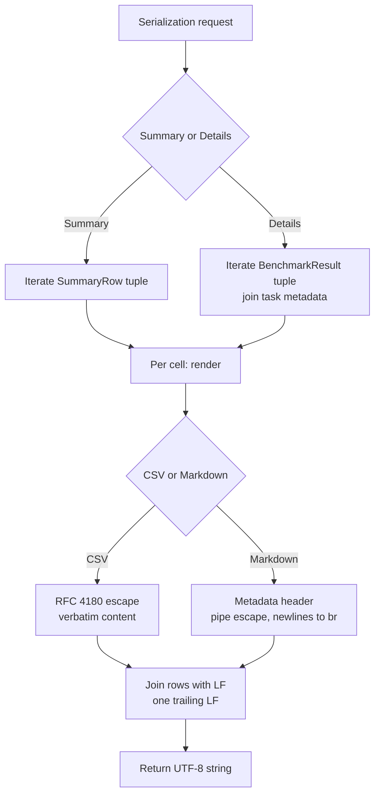

# Table Serialization Service

**Status:** Draft
**Owner:** architect
**Audience:** coder, tester
**Last Updated:** 2026-06-06
**Cross-references:** `10_Domain_and_Data/02_DTOS_AND_ENUMS.md`, `10_Domain_and_Data/05_EXPORT_FORMATS.md`, `10_Domain_and_Data/08_REDACTION_PATTERNS.md`, `05_Result_Widget/description.md`, `11_Services_and_Algorithms/22_RUN_ANALYSIS_SERVICE.md`

The Table Serialization Service converts the two tabular result surfaces of the Result Widget — the Summary table and the Details table — into the application's text export formats: CSV and Markdown. It is a pure, stateless, Qt-free service that takes already-aggregated run data and emits a single UTF-8 string per export. It owns the column ordering, field escaping, encoding, and line-ending rules; it does not own the file-format catalog (that is fixed in `10_Domain_and_Data/05_EXPORT_FORMATS.md`) and it does not write files (the caller writes the returned string to disk).

---

## Table of Contents

1. Purpose
2. Inputs
3. Outputs
4. Preconditions
5. Postconditions
6. Algorithm
7. Configuration
8. Error handling
9. Threading and concurrency
10. Examples
11. Test cases

---

## 1. Purpose

The Result Widget shows two tables — an aggregated per-model Summary and a per-result Details listing. Each table can be exported in two text formats. Rather than duplicate column logic across four export paths and across both the on-disk export and any future copy-to-clipboard surface, all four serializations are concentrated in one service, `TableSerializationService`.

The service exists to guarantee that:

- The CSV and the Markdown export of a given table carry **exactly the same columns in exactly the same order**, so a reader switching formats sees identical data.
- Escaping is correct and centralized — RFC 4180 for CSV, GitHub-flavoured pipe escaping for Markdown. Cell content is verbatim: there is no formula-injection mangling (trusted-content policy, `12_Quality_and_NFRs/02_SECURITY_MODEL.md`).
- Encoding, line endings, and number formatting are uniform across every text export the application produces.

It is the service the project brief refers to conceptually as the table/CSV generator. The format catalog it implements is `10_Domain_and_Data/05_EXPORT_FORMATS.md`; this document specifies the service that produces those bytes.

---

## 2. Inputs

The service exposes four public operations. Each takes a serialization request struct and returns a string. The request structs are service DTOs (not persisted) and follow the conventions of `10_Domain_and_Data/02_DTOS_AND_ENUMS.md` — `msgspec.Struct, frozen=True, kw_only=True, gc=False`.

### 2.1 Public API surface

```python
class TableSerializationService(Protocol):
    def serialize_summary_csv(self, request: SummarySerializationRequest) -> str: ...
    def serialize_summary_markdown(self, request: SummarySerializationRequest) -> str: ...
    def serialize_details_csv(self, request: DetailsSerializationRequest) -> str: ...
    def serialize_details_markdown(self, request: DetailsSerializationRequest) -> str: ...
```

### 2.2 Request DTOs

```python
class RunExportContext(msgspec.Struct, frozen=True, kw_only=True, gc=False):
    run_id: RunId
    effective_run_name: NonEmptyStr      # the display name, never None
    run_mode: RunMode
    exported_at: Iso8601Utc
    app_version: NonEmptyStr

class SummaryRow(msgspec.Struct, frozen=True, kw_only=True, gc=False):
    provider_id: ProviderIdStr
    model_name: ModelNameStr
    task_count: NonNegativeInt
    completed_count: NonNegativeInt
    passed_count: NonNegativeInt
    failed_count: NonNegativeInt
    pass_rate: float | None              # 0.0-1.0, None when nothing graded
    avg_score: float | None              # always None in this app; reserved column
    avg_cosine: float | None             # mean Cosine Score, None when no cosine ran
    avg_ttft_s: float | None
    avg_total_time_s: float | None
    avg_tps: float | None
    error_count: NonNegativeInt

class SummarySerializationRequest(msgspec.Struct, frozen=True, kw_only=True, gc=False):
    context: RunExportContext
    rows: tuple[SummaryRow, ...]

class DetailsSerializationRequest(msgspec.Struct, frozen=True, kw_only=True, gc=False):
    context: RunExportContext
    results: tuple[BenchmarkResult, ...]
    tasks_by_id: dict[TaskIdStr, BenchmarkTask]   # task metadata per result
```

The `SummaryRow` collection is produced upstream by the result-aggregation service that backs the Summary tab; the Table Serialization Service treats it as opaque input. The Details request carries raw `BenchmarkResult` records (see `10_Domain_and_Data/02_DTOS_AND_ENUMS.md` §6.10) plus a lookup of the `BenchmarkTask` each result executed, because per-result columns such as `Category` and `Difficulty` live on the task, not the result.

`SummaryRow.avg_score` is reserved: the `Avg Score` column exists in the fixed schema of `10_Domain_and_Data/05_EXPORT_FORMATS.md`, but this application's judge produces no numeric score, so the field is always `None` and the column always serializes empty. `avg_cosine` carries the mean Cosine Score, the only numeric quality value.

---

## 3. Outputs

Each operation returns a single `str`. The string is the complete file content: UTF-8 text, LF line endings, exactly one trailing newline. The caller is responsible for encoding the string to bytes and writing it (see `10_Domain_and_Data/05_EXPORT_FORMATS.md` §11 for the atomic-write destination logic).

| Operation | Produces |
|---|---|
| `serialize_summary_csv` | The Summary table as RFC 4180 CSV — header row plus one row per `SummaryRow`. |
| `serialize_summary_markdown` | A metadata header block plus the Summary table as a GitHub-flavoured Markdown pipe table. |
| `serialize_details_csv` | The Details table as RFC 4180 CSV — header row plus one row per `BenchmarkResult`. |
| `serialize_details_markdown` | A metadata header block plus the Details table as a Markdown pipe table. |

The exact column set, column order, header labels, and worked examples for all four are fixed in `10_Domain_and_Data/05_EXPORT_FORMATS.md` §4–§7 and are not restated here. The Summary table has 13 columns; the Details table has 18.

---

## 4. Preconditions

- The caller has already resolved the effective run name (the service never derives it from `run_id`).
- **The caller has applied the user's current view state — filter chips, per-column filters, column visibility (show/hide), column order (drag-reordered), and sort order — before invoking the service.** The service serializes exactly the rows it receives, in the order it receives them, restricted to the columns it is configured for; it never re-filters, re-orders, or re-sorts. The view-mirroring rule for exports is owned by `10_Domain_and_Data/05_EXPORT_FORMATS.md` §3.3; this service is the implementation surface that honours the rule by being faithful to its inputs. (For the Details surface specifically: when the user has selected one or more rows on the tab, the caller passes only those selected rows; otherwise the caller passes every row that currently passes the filters.)
- For Details serialization, `tasks_by_id` contains an entry for every distinct `task_id` present in `results`. A missing entry is an error (see §8).
- Every text field reaching the service may contain arbitrary content, including commas, quotes, pipes, and line feeds; the service must not assume sanitized input.
- The `rows`/`results` collections may be empty (a run with zero completed results — edge case EC-RES-1 of `10_Domain_and_Data/05_EXPORT_FORMATS.md`).
- The service does **not** redact. The user's own prompts and the model responses produced on the user's own machine are written verbatim (HTML-escaped and CSV-quoted as required by the format, but not redacted), consistent with the redaction model in `10_Domain_and_Data/08_REDACTION_PATTERNS.md` — redaction applies at the app-log records and the provider SDK error-message wrap, not at the table-serialisation surface.

## 5. Postconditions

- The returned string is valid UTF-8 with no byte-order mark.
- Every line is terminated with LF; the string ends with exactly one LF.
- The CSV header row is always present, even when there are zero data rows.
- The Markdown output always contains the metadata header block, the table header row, and the separator row, even when there are zero data rows.
- Cell values are written verbatim (after rendering and format-specific escaping). The service does not redact — the user's prompts and model responses are the user's own data on the user's own machine; see `10_Domain_and_Data/08_REDACTION_PATTERNS.md`.
- Column count and order match `10_Domain_and_Data/05_EXPORT_FORMATS.md` exactly.
- The service holds no state after the call returns; calling it again with the same request yields a byte-identical result.

---

## 6. Algorithm

### 6.1 Common cell-value pipeline

Every individual cell value passes through the same value pipeline before it reaches a format-specific escaper:

1. **Resolve.** Read the source field from the `SummaryRow` or `BenchmarkResult`/`BenchmarkTask`.
2. **Render.** Convert the typed value to text:
   - `None` becomes the empty string `""`.
   - Counts and token counts render as plain base-10 integers.
   - Durations render in **seconds with 3 decimal places** (milliseconds fields are divided by 1000; for example `ttft_ms = 412` renders `0.412`).
   - Tokens-per-second renders with **2 decimal places**.
   - `pass_rate` and `cosine_similarity` render as a `0.000`–`1.000` decimal with **3 decimal places**.
   - All numbers use `.` as the decimal separator and are never localized.
   - Enum values render as their `StrEnum` string value (for example `Verdict.PASS` renders `pass` — note the export labels uppercase verdicts; see §6.2).
   - Timestamps render as ISO-8601 UTC with a trailing `Z`.
3. **Escape.** Apply the format-specific escaper (§6.3 for CSV, §6.4 for Markdown).

The service does **not** apply a redaction step. The user's own prompts and the model responses produced on the user's own machine are the user's own data; see §6.5 and `10_Domain_and_Data/08_REDACTION_PATTERNS.md`.

### 6.2 Verdict and resolution-layer rendering

The `Verdict` enum stores lowercase values (`pass`, `fail`) — the **only** two enum members. The export column `Verdict` uppercases those for display, and additionally renders two **status-derived display tokens that are not `Verdict` enum values** (SPEC-088): a `BenchmarkResult` whose `status` is a terminal-failure state carries no verdict and renders the literal `ERROR`; a non-terminal/no-verdict row renders `UNKNOWN`. These tokens exist only in the rendered output (a one-way report; result rows are never re-imported, so the column need not round-trip). The `Resolution Layer` column renders the `ResolutionLayer` enum value verbatim (`keyword`, `cosine`, `judge`, `skip`); a `None` resolution layer renders empty.

### 6.3 CSV serialization

For both `serialize_summary_csv` and `serialize_details_csv`:

1. Emit the fixed header row (the column labels from `10_Domain_and_Data/05_EXPORT_FORMATS.md` §4 or §6), escaped by the same rules as a data row.
2. For each input row, build the ordered list of rendered, redacted cell strings.
3. Escape each field per RFC 4180:
   - Wrap the field in double quotes if it contains a comma, a double quote, a line feed (`\n`), or a carriage return (`\r`).
   - Inside a quoted field, double every literal double quote (`"` to `""`).
   - There is **no formula-injection guard**: a field is quoted only when RFC 4180 requires it, and content is never prefixed or altered. Exports are trusted local content by design; quoting would not change spreadsheet formula interpretation anyway (the content after unquoting is what the spreadsheet evaluates).
4. Join the escaped fields of a row with a single comma.
5. Join rows with LF. Append one trailing LF.

The CSV output has **no** metadata header block — it is pure tabular data so it loads cleanly into any spreadsheet or parser.

### 6.4 Markdown serialization

For both `serialize_summary_markdown` and `serialize_details_markdown`:

1. Emit the metadata header block. Its exact shape is fixed in `10_Domain_and_Data/05_EXPORT_FORMATS.md` §5.1: a level-1 heading naming the table and the effective run name, followed by a bullet list of `Run id`, `Mode`, `Exported`, and `Application` lines. The `Mode` line shows the run mode's human display label.
2. Emit a blank line.
3. Emit the header row as a Markdown pipe row.
4. Emit the separator row: one `---` per column (all columns left-aligned).
5. For each input row, render and redact each cell, then escape it for Markdown:
   - Replace each literal pipe `|` with `\|`.
   - Replace each line feed with `<br>` so the table grid stays intact.
   - An empty cell is rendered as a single space character so the pipe grid does not collapse.
6. Join rows with LF. Append one trailing LF.

### 6.5 No redaction

The Table Serialization Service does **not** redact cell values. The Details `Response` column, the Markdown narrative, the prompts in the Task Detail Panel, and every other field that originates from the user's task files or the user's model are written verbatim (after rendering and format-specific escaping). This is the binding contract: the user is reading their own data on their own machine, and the threat model in `10_Domain_and_Data/08_REDACTION_PATTERNS.md` §1 names this as one of the surfaces redaction does **not** apply to.

API-key material does not appear in any column of either table — credential values live only in the database file and the process environment (`12_Quality_and_NFRs/02_SECURITY_MODEL.md` §3) and are never columns of `SummaryRow` or `BenchmarkResult`. If a model response happens to contain text that matches a redaction pattern (for example, the model echoes a fragment from a prompt that itself contained a token-shaped string), the table export still writes that text verbatim — consistent with the redaction model.

### 6.6 Column-order invariant

The service holds the column order as a single ordered descriptor per table (a tuple of `(header_label, value_extractor)` pairs). The CSV and Markdown paths iterate the **same** descriptor, which structurally guarantees the two formats never drift apart. Adding or reordering a column is a one-place change.

### 6.7 Flow



---

## 7. Configuration

The service takes no settings and reads nothing from `app_settings`. The decimal precision rules, line endings, and encoding are constants of the export contract, not user-tunable. The only externally supplied values are the fields of `RunExportContext`, passed in by the caller. The redaction patterns are owned by the redaction service, not configured here.

---

## 8. Error handling

The service operates on in-memory data and performs no I/O, so its failure modes are all programmer errors surfaced as exceptions to the caller:

| Condition | Handling |
|---|---|
| A `BenchmarkResult` in `results` has a `task_id` absent from `tasks_by_id` | Raise `KeyError`-style lookup error; the caller (the export use case) must always supply complete task metadata. This is a programmer error, not a user error. |
| A request DTO violates a `msgspec` field constraint | Construction of the DTO raises before the service is called. |
| A cell value is an unexpected type | Treated as a programmer error; the renderer raises rather than emitting a corrupt cell. |
| Empty `rows`/`results` | Not an error. The output is a header-only CSV or a header-block-plus-empty-table Markdown document. |

The service never catches and swallows; it never returns a partial string. A failure means the caller does not get a string at all, and the export use case shows the error modal described in `05_Result_Widget/description.md`. File-write failures (permission denied, disk full) occur in the caller after the service returns and are out of this service's scope.

---

## 9. Threading and concurrency

The service is pure and stateless: every operation is a function of its request argument with no shared mutable state, no I/O, and no Qt objects. It is therefore safe to call from any thread.

In practice an export is triggered from the Result Widget on the GUI thread. Serializing even a large run (thousands of `BenchmarkResult` records) is a fast in-memory string build; it runs inline on the GUI thread without a worker. If a future run size makes this perceptibly slow, the call may be moved to a `QThreadPool` worker with no change to the service, because it is already thread-safe and re-entrant. Exports are disabled while any run is non-terminal (see `05_Result_Widget/description.md` §7), so the service never serializes a run whose data is concurrently mutating.

---

## 10. Examples

### 10.1 Happy path — Summary CSV

Input: a `SummarySerializationRequest` for run 3 with three `SummaryRow` entries.

`serialize_summary_csv` returns (the header plus three data rows):

```csv
Provider,Model,Tasks,Completed,Passed,Failed,Pass Rate,Avg Score,Avg Cosine,Avg TTFT (s),Avg Total Time (s),Avg TPS,Errors
ollama_local,llama3.2:3b,10,10,7,3,0.700,,0.681,0.412,3.870,58.20,0
ollama_local,mistral:7b,10,9,8,1,0.889,,0.770,0.905,7.221,41.05,1
anthropic,claude-sonnet-4-5,10,10,10,0,1.000,,0.902,0.733,2.118,73.40,0
```

The `Avg Score` column is empty in every row because the judge produces no numeric score. `Avg Cosine` carries the mean Cosine Score.

### 10.2 Happy path — Details Markdown

A `serialize_details_markdown` call for a `GRADED` run with two results produces a metadata header block followed by an 18-column pipe table. A `PASS` result renders `Verdict` as `PASS`; its `Score` cell is empty (no numeric judge score) and its `Cosine` cell carries the Cosine Score. A multi-line code response has its line feeds replaced with `<br>` so the row stays on one Markdown line.

### 10.3 Edge case — leading `=` in a Details CSV cell

A model response that begins with `=SUM(A1:A9)` produces a `Response` cell whose first character is `=`. The cell is written **verbatim**: it is not prefixed, not altered, and quoted only if it also contains a comma, a double quote, or a newline. The export is trusted local content (the user's own tasks and the responses of models the user configured); a spreadsheet application that chooses to interpret a leading `=` does so on the user's own data. Byte-for-byte fidelity of cell content is the contract.

### 10.4 Edge case — run with zero completed results

A `SummarySerializationRequest` with an empty `rows` tuple yields a CSV containing only the 13-column header row and a trailing LF. The corresponding Markdown yields the metadata header block, the header row, and the separator row, with no data rows. Neither path raises. This is edge case EC-RES-1 of `10_Domain_and_Data/05_EXPORT_FORMATS.md`.

### 10.5 Edge case — response containing a comma, a quote, and a newline

A Details `Response` cell containing `He said "hi", then\nleft` serializes in CSV as the single quoted field `"He said ""hi"", then`+LF+`left"` (RFC 4180 quoting keeps it in one field; the inner quotes are doubled). In Markdown the same cell becomes `He said "hi", then<br>left` (the newline becomes `<br>`; no pipe is present so no pipe escaping is needed).

---

## 11. Test cases

| ID | Scenario | Expectation |
|---|---|---|
| TS-01 | Summary CSV, three rows | 14 lines (1 header + 3 data); column order matches the §4 schema; trailing LF present. |
| TS-02 | Summary CSV, `pass_rate`/`avg_cosine` `None` | The corresponding cells are empty strings. |
| TS-03 | `avg_score` always | Column header present; every cell empty. |
| TS-04 | Details CSV, multi-line response | The response stays in one field via RFC 4180 quoting; embedded quotes doubled. |
| TS-05 | Formula-injection guard | A cell starting with `=`, `+`, `-`, or `@` is double-quoted in CSV output. |
| TS-06 | Markdown pipe in a cell | A literal `|` in a response renders as `\|`. |
| TS-07 | Markdown newline in a cell | A line feed renders as `<br>`; the row stays on one line. |
| TS-08 | Markdown empty cell | An empty value renders as a single space, preserving the grid. |
| TS-09 | Empty `rows` | Summary CSV is header-only; Summary Markdown has header block + table header + separator only; no exception. |
| TS-10 | Verdict rendering | `PASS`/`FAIL` uppercased; terminal-failure result renders `ERROR`; pending renders `UNKNOWN`. |
| TS-11 | Duration rendering | `ttft_ms = 412` renders `0.412`; `total_time_ms = 3870` renders `3.870`. |
| TS-12 | TPS and cosine precision | TPS renders with 2 decimals; cosine and pass rate with 3 decimals; `.` separator. |
| TS-13 | Missing task metadata | A `BenchmarkResult` whose `task_id` is absent from `tasks_by_id` raises a lookup error. |
| TS-14 | Encoding and line endings | Output is UTF-8, no BOM, LF only, exactly one trailing LF, on every platform. |
| TS-15 | No redaction | A response containing text that matches a redaction pattern (e.g. echoes a token-shaped fragment) is written verbatim in both CSV and Markdown output, per `10_Domain_and_Data/08_REDACTION_PATTERNS.md` §1. |
| TS-16 | Column-order parity | The CSV and Markdown of the same table list identical columns in identical order. |
| TS-17 | Determinism | Two calls with the same request return byte-identical strings. |
| TS-18 | Same model name across two providers | Two `SummaryRow` entries with the same `model_name` but different `provider_id` produce two distinct rows. |
