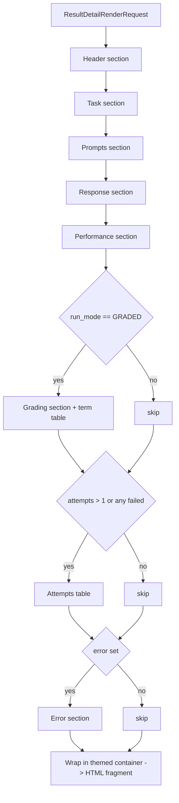

# HTML Rendering Service

**Status:** Draft
**Owner:** architect
**Audience:** coder, tester
**Last Updated:** 2026-06-06
**Cross-references:** `10_Domain_and_Data/02_DTOS_AND_ENUMS.md`, `10_Domain_and_Data/08_REDACTION_PATTERNS.md`, `05_Result_Widget/description.md`, `05_Result_Widget/tabs/details_tab.md`, `11_Services_and_Algorithms/19_TABLE_SERIALIZATION.md`

The HTML Rendering Service converts in-memory domain records into rich-text HTML fragments for display inside Qt rich-text widgets. It has two responsibilities: rendering a single `BenchmarkResult` into the task-detail HTML view shown beside the Details table, and rendering a benchmark event-log line into an HTML log entry. It is a pure, stateless, Qt-free service: it produces HTML strings only and never touches a widget. Its output is consumed by rich-text widgets (the task-detail panel and the event log) which render the subset of HTML that Qt's rich-text engine supports.

---

## Table of Contents

1. Purpose
2. Inputs
3. Outputs
4. Preconditions
5. Postconditions
6. Algorithm
7. Configuration
8. Error handling
9. Threading and concurrency
10. Examples
11. Test cases

---

## 1. Purpose

Two surfaces in the application present formatted, read-only rich text:

- **The task-detail view** in the Details tab. When a row of the Details table is selected, a side panel shows the full picture of that one result — the prompts sent, the raw and sanitized responses, the per-layer verdicts, the keyword term outcomes, the timing metrics, the inference-attempt history, and any error. This is rendered as an HTML document.
- **The event log** in the Log Widget. As a run executes, each pipeline event (task started, inference finished, verdict resolved, error raised) is appended to a scrolling log. Each line is rendered as a small HTML fragment so that severity, timestamps, and identifiers can be styled distinctly.

Concentrating both into one service — `HtmlRenderingService` — keeps escaping correct and uniform, keeps theme handling in one place, and keeps the Qt widgets free of any string-building logic. This is the service the project brief refers to conceptually as the HTML formatter. It produces only the structured-detail and log HTML; it does not produce the Markdown exports (those belong to the Table Serialization Service, `11_Services_and_Algorithms/19_TABLE_SERIALIZATION.md`) and it does not render charts.

---

## 2. Inputs

The service exposes two public operations plus a one-time theme setter.

### 2.1 Public API surface

```python
class HtmlRenderingService(Protocol):
    def render_result_detail(self, request: ResultDetailRenderRequest) -> str: ...
    def render_log_line(self, entry: LogEntry) -> str: ...
    def set_theme(self, theme: UiTheme) -> None: ...
```

### 2.2 DTOs

```python
class UiTheme(StrEnum):
    LIGHT = "light"
    DARK  = "dark"

class ResultDetailRenderRequest(msgspec.Struct, frozen=True, kw_only=True, gc=False):
    result: BenchmarkResult
    task: BenchmarkTask
    run_mode: RunMode

class LogSeverity(StrEnum):
    DEBUG   = "debug"
    INFO    = "info"
    SUCCESS = "success"
    WARNING = "warning"
    ERROR   = "error"

class LogEntry(msgspec.Struct, frozen=True, kw_only=True, gc=False):
    timestamp: Iso8601Utc
    severity: LogSeverity
    message: NonEmptyStr
    provider_id: ProviderIdStr | None = None
    model_name: ModelNameStr | None = None
    task_id: TaskIdStr | None = None
```

`render_result_detail` takes both the `BenchmarkResult` (see `10_Domain_and_Data/02_DTOS_AND_ENUMS.md` §6.10) and the `BenchmarkTask` it executed (§6.3), because the detail view shows task metadata — the question, the golden answer, the difficulty, the category — alongside the result. `run_mode` lets the renderer omit sections that are meaningless for the mode (for example, grading sections for a `SYNTHETIC` run).

`render_log_line` takes a single `LogEntry`. The log feeds the service one entry at a time as events arrive; the service does not accumulate them.

`set_theme` records the active `UiTheme` so subsequent renders emit theme-appropriate inline styling. It is called once at startup and again whenever the user switches theme.

---

## 3. Outputs

| Operation | Produces |
|---|---|
| `render_result_detail` | A single HTML fragment — a sequence of headed sections describing one result. Designed for a Qt rich-text widget; uses only the rich-text-supported HTML subset. |
| `render_log_line` | A single HTML fragment for one log line — a timestamp span, a severity-styled message, and optional identifier spans. No trailing newline; the log widget concatenates lines itself. |

Both outputs are HTML fragments, not full documents: no `<!DOCTYPE>`, no `<html>`/`<head>`/`<body>` wrapper. The consuming widget supplies the document shell. All output is UTF-8 text.

---

## 4. Preconditions

- `set_theme` has been called at least once before the first render; if not, the service defaults to `UiTheme.LIGHT`.
- For `render_result_detail`, the `task` matches the `result` — `task.task_id == result.task_id`. A mismatch is a programmer error (see §8).
- Every text field reaching the service may contain arbitrary characters, including `<`, `>`, `&`, `"`, and characters that look like HTML or scripts; the service must not assume safe input.
- The service does **not** redact. User-authored prompts and user-machine model responses are written verbatim (HTML-escaped, not redacted), consistent with the redaction model in `10_Domain_and_Data/08_REDACTION_PATTERNS.md`.

## 5. Postconditions

- The returned string is a well-formed HTML fragment using only tags Qt's rich-text engine renders.
- Every value originating from a domain record or from free model output is HTML-escaped: `&`, `<`, `>`, `"` are replaced with their entities. No untrusted input can inject markup.
- No `<script>`, no `<style>`, no `<iframe>`, no event-handler attribute, and no external resource reference (`src`/`href` to a network URL) appears in the output.
- Free-text fields are written verbatim after HTML escaping; the service does not redact. This is consistent with the redaction model: the user reads their own task prompts and the model responses produced on the user's own machine (`10_Domain_and_Data/08_REDACTION_PATTERNS.md` §1).
- The fragment carries inline styling appropriate to the theme set by the last `set_theme` call.
- The service holds no per-render state; the only state is the recorded theme.

---

## 6. Algorithm

### 6.1 Result-detail rendering

`render_result_detail` builds an ordered sequence of sections. A section that has no content for the given `result`/`run_mode` is omitted entirely rather than shown empty.

1. **Header section.** Task id, task type, category and sub-category, difficulty, and the composite `(provider_name, model_name)` identity of the result — `provider_name` is the SNAPSHOT name read from `BenchmarkResult.provider_name` (DD-33) so the rendering preserves the historical label across a later rename; the internal `provider_id` is the grouping key but is not displayed. The result `status` and, when set, the final `Verdict` (rendered `PASS`/`FAIL`, or `ERROR` for a terminal-failure status) are shown as a styled badge.
2. **Task section.** The task `question`; the `golden_answer` when present; `pass_criteria` and `fail_criteria` when non-empty; translation `source_language`/`target_language` and `source_material` when present. Omitted fields are skipped.
3. **Prompts section.** `system_prompt_sent` (when present) and `user_prompt_sent`, each in a monospace block.
4. **Response section.** The `sanitized_response` (the graded text) as the primary block; the `raw_response` is offered as a secondary block when `has_thinking_block` is true so the reasoning content is inspectable. `response_char_length` is shown as a small caption.
5. **Performance section.** `ttft_ms`, `total_time_ms`, `tokens_per_second`, `prompt_tokens`, `completion_tokens`, rendered with the same numeric conventions as the exports — durations in seconds with 3 decimals, TPS with 2 decimals. A `None` metric renders as a dash.
6. **Grading section.** Shown only when `run_mode` is `GRADED`. Reports each layer's own outcome: `keyword_verdict`, `cosine_similarity` (the Cosine Score, 3 decimals) with `cosine_verdict`, `judge_verdict` with `judge_reasoning`, and the `resolution_layer` that decided the combined verdict. The keyword phase's per-term outcomes (`result.terms`) render as a small table of term text, term kind, and — for semantic terms — similarity score.
7. **Attempts section.** When `result.attempts` has more than one entry, or any attempt did not succeed, render the attempt history as a table of attempt index, timeout budget, duration, outcome, and error.
8. **Error section.** Shown only when `error_kind`/`error_message` is set. Renders the error kind and message in an error-styled block.

Sections are emitted in the order above. The whole fragment is wrapped in a single themed container with consistent spacing.



### 6.2 Log-line rendering

`render_log_line` builds a compact single-line fragment:

1. A timestamp span carrying `entry.timestamp`, styled muted.
2. A severity tag — the `LogSeverity` value — styled with the severity's theme color (debug muted, info neutral, success green-family, warning amber-family, error red-family).
3. Optional identifier spans for `provider_id`, `model_name`, and `task_id` when present, styled as subtle chips so they read as metadata rather than message text.
4. The `message` text as the main content.

The fragment is a single inline-level block (for example one `<div>`); the log widget appends fragments and manages scrolling and any line cap.

### 6.3 Escaping and safety

Escaping is the central safety rule. Every value that originates from a domain record, a task file, model output, or a provider error message is HTML-escaped before it is placed in the fragment:

- `&` becomes `&amp;`, `<` becomes `&lt;`, `>` becomes `&gt;`, `"` becomes `&quot;`.
- Escaping happens after redaction and after numeric/enum rendering, immediately before the value is concatenated into the fragment.
- The only HTML the service emits is the structural and styling markup it generates itself — section containers, headings, tables, spans, and inline `style` attributes drawn from a fixed theme palette.
- The service never emits `<script>`, `<style>`, `<iframe>`, `<object>`, `<embed>`, `on*` event attributes, or any `href`/`src` pointing at a network resource. A model response that literally contains `<script>alert(1)</script>` is escaped to inert visible text.
- Line feeds inside a model response or prompt are converted to `<br>` (or the block is wrapped in a `white-space: pre-wrap` container) so multi-line content displays faithfully without enabling layout injection.

### 6.4 No redaction

The service does **not** redact free-text fields. Prompts, raw and sanitized responses, judge reasoning, error messages, and log messages are written verbatim after HTML escaping. The user authored the prompts and the user's machine produced the responses; the threat model in `10_Domain_and_Data/08_REDACTION_PATTERNS.md` §1 names HTML rendering as one of the surfaces redaction does **not** apply to.

The `error_message` field of a `BenchmarkResult` is already canonically safe by the time it reaches this service: provider SDK exception messages are passed through `redact(text)` at the adapter boundary before being placed in `AppError.message`, and the persisted `error_message` is the redacted text. The HTML renderer therefore writes it verbatim and adds nothing further.

### 6.5 Theme awareness

The service holds the active `UiTheme` as its only state. Every color, background, and border in the emitted inline styles is drawn from a fixed two-variant palette keyed by that theme. Switching theme is a `set_theme` call followed by a re-render by the widget; the service emits no theme-specific markup beyond the inline style values. Severity colors, badge colors, monospace-block backgrounds, and table border colors all have a light and a dark value. The service never reads a Qt palette or a stylesheet; the palette is a service-internal constant table so the service stays Qt-free and unit-testable.

---

## 7. Configuration

The service reads no settings from `app_settings`. Its only configuration input is the `UiTheme` passed to `set_theme`, which the caller derives from the user's theme preference. The numeric-rendering precision rules and the section ordering are fixed and not user-tunable. The service applies no redaction.

---

## 8. Error handling

The service performs no I/O; its failure modes are programmer errors surfaced as exceptions:

| Condition | Handling |
|---|---|
| `request.task.task_id != request.result.task_id` | Raise a value error; the caller must pair the result with its own task. |
| A request or `LogEntry` DTO violates a field constraint | Construction raises before the service is called. |
| `set_theme` never called | The service defaults to `UiTheme.LIGHT`; not an error. |
| An expected-present field is `None` | Not an error — the section or field is omitted (`render_result_detail`) or the dash placeholder is shown for a numeric metric. |
| An unexpected value type for a rendered field | Programmer error; the renderer raises rather than emitting malformed HTML. |

The service never returns a partial fragment. A render failure means the caller receives no string; the consuming widget shows its own fallback (an empty-state message). The service never swallows an exception silently.

---

## 9. Threading and concurrency

The service is pure apart from the single recorded `UiTheme`. Render operations read that value and otherwise have no shared mutable state. Renders are typically invoked on the GUI thread — `render_result_detail` when a Details row is selected, `render_log_line` as log events arrive on the GUI thread from the event bus. Each render is a fast in-memory string build.

`set_theme` must be called on the GUI thread (it is driven by the theme-toggle UI). Because `set_theme` and the render operations are not synchronized, all three must be called from the same thread — the GUI thread — which is the established usage. The service is not designed for concurrent cross-thread calls; it does not need to be, because all of its callers live on the GUI thread.

---

## 10. Examples

### 10.1 Happy path — `GRADED` result detail

A `render_result_detail` call for a completed, `PASS` result of a `factual_qa` task produces a fragment with: a header showing the task id, type, difficulty, the `(ollama_local, llama3.2:3b)` identity, and a green `PASS` badge; a task section with the question and golden answer; prompt and response sections; a performance section showing `TTFT 0.412 s`, `Total 0.880 s`, `61.30 tok/s`; a grading section showing the keyword, cosine (`Cosine Score 0.940`), and judge verdicts plus the `resolution_layer`; and a per-term table. No attempts section (single successful attempt) and no error section.

### 10.2 Happy path — log line

`render_log_line` for an `INFO` entry with `provider_id = "ollama_local"`, `model_name = "mistral:7b"`, `task_id = "coding_java_two_sum"`, message `"Inference completed in 8.14 s"` produces a single-line fragment: a muted timestamp, an `INFO` tag, three subtle identifier chips, and the message text.

### 10.3 Edge case — `SYNTHETIC` result detail

For a `SYNTHETIC` run, `render_result_detail` omits the grading section and the term table entirely (the run did not grade). The header shows no verdict badge (the result carries no verdict; `resolution_layer` is `skip`). The header instead shows the synthetic-task descriptors — `input_size_label`, `output_size_label`, `repeat_index`.

### 10.4 Edge case — model output containing markup

A model response of `Use <b>bold</b> and <script>alert(1)</script> here` is HTML-escaped: it displays as the literal visible text `Use <b>bold</b> and <script>alert(1)</script> here`. No tag executes; no markup is injected.

### 10.5 Edge case — failed result with an error and multiple attempts

A result whose `status` is `FAILED_TIMEOUT` with three `attempts` renders: an `ERROR` badge in the header, no grading section, an attempts table listing all three attempts with their timeout budgets and outcomes, and an error section showing `error_kind = timeout` and the `error_message` (the message is already canonically safe — provider SDK exception messages are passed through `redact(text)` at the adapter boundary before being placed on `AppError.message`).

### 10.6 Edge case — theme switch

After `set_theme(UiTheme.DARK)`, the same `render_result_detail` request yields a fragment whose container background, monospace-block background, badge colors, and table borders all use the dark palette values. The structure and text content are identical to the light render.

---

## 11. Test cases

| ID | Scenario | Expectation |
|---|---|---|
| HR-01 | `GRADED` completed result | Fragment contains header, task, prompts, response, performance, grading, and term-table sections; no error section. |
| HR-02 | `SYNTHETIC` result | Grading section and term table omitted; synthetic-size descriptors shown; no verdict badge. |
| HR-03 | Result with `error_kind` set | Error section present; error kind and message rendered verbatim (the `error_message` was already canonicalised by the adapter-boundary `redact`). |
| HR-04 | Single successful attempt | Attempts section omitted. |
| HR-05 | Multiple attempts | Attempts table lists every attempt with timeout budget, duration, outcome. |
| HR-06 | Response with `<script>` | Output contains the escaped entities, not an executable tag. |
| HR-07 | Response with `&`, `<`, `>`, `"` | All four are escaped to entities. |
| HR-08 | Multi-line response | Line feeds become `<br>` or render inside a `pre-wrap` block; content faithful. |
| HR-09 | Response containing text that matches a redaction pattern | Written verbatim (HTML-escaped, not redacted). The Result widget shows the user their own data on their own machine; see `10_Domain_and_Data/08_REDACTION_PATTERNS.md` §1. |
| HR-10 | `task.task_id` mismatch | `render_result_detail` raises a value error. |
| HR-11 | `None` numeric metrics | Performance section shows a dash for each `None` metric; no exception. |
| HR-12 | Log line, each severity | Each `LogSeverity` produces its own distinct severity color. |
| HR-13 | Log line, no identifiers | A `LogEntry` with all identifiers `None` renders timestamp, severity tag, and message only. |
| HR-14 | Log message with markup | Markup in the message is escaped, not interpreted. |
| HR-15 | Theme light vs dark | The same request under each theme differs only in inline style color values. |
| HR-16 | No `set_theme` call | The first render uses the light palette without error. |
| HR-17 | Output safety | No `<script>`, `<style>`, `<iframe>`, `on*` attribute, or network `href`/`src` appears in any output. |
| HR-18 | Determinism | Two renders of the same request under the same theme produce identical fragments. |
| HR-19 | Verdict badge | `PASS` renders a pass-styled badge; `FAIL` a fail-styled badge; a terminal-failure status an `ERROR` badge. |
