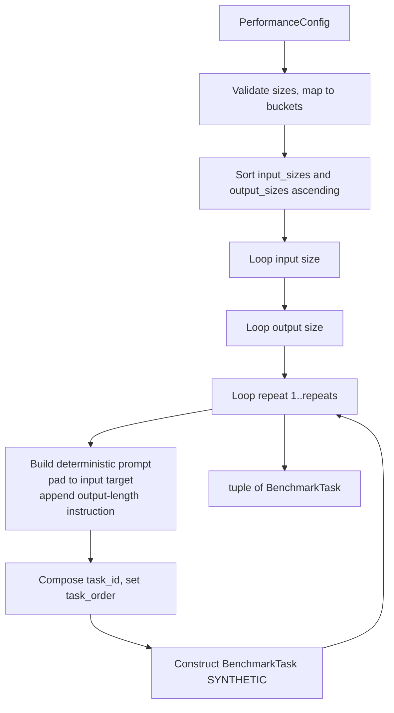

# Performance Task Generator

**Status:** Draft
**Owner:** architect
**Audience:** coder, tester
**Last Updated:** 2026-06-06
**Cross-references:** `10_Domain_and_Data/02_DTOS_AND_ENUMS.md`, `10_Domain_and_Data/01_DOMAIN_MODEL.md`, `02_New_Benchmark_Widget/description.md`, `11_Services_and_Algorithms/22_RUN_ANALYSIS_SERVICE.md`

The Performance Task Generator builds the synthetic benchmark task set for a `SYNTHETIC` run. A `SYNTHETIC` run does not load task files; instead the user picks a set of input prompt sizes, a set of output sizes, and a repetition count, and the generator expands that selection into a deterministic list of `BenchmarkTask` records — one per `(input size × output size × repeat)` combination. Those tasks then enter the benchmark pipeline exactly as file-loaded tasks do. The generator is a pure, stateless, Qt-free service that produces only in-memory `BenchmarkTask` records; it persists nothing itself.

---

## Table of Contents

1. Purpose
2. Inputs
3. Outputs
4. Preconditions
5. Postconditions
6. Algorithm
7. Configuration
8. Error handling
9. Threading and concurrency
10. Examples
11. Test cases

---

## 1. Purpose

The three run modes differ in where their tasks come from. `TASKS` and `GRADED` load real tasks from YAML task files. `SYNTHETIC` has no task files — its purpose is to measure raw inference throughput and latency of a model under controlled, repeatable load. To do that, the application needs synthetic tasks whose prompt length and requested output length are known and varied across a grid.

The Performance Task Generator, `PerformanceTaskGenerator`, is the service that turns the user's size grid into that synthetic task list. It exists so that:

- The cartesian expansion of `(input sizes) × (output sizes) × (repeats)` lives in one tested place rather than being open-coded in the run-creation use case.
- Synthetic tasks are structurally valid `BenchmarkTask` records, so the rest of the pipeline — inference, metrics capture, persistence, the Result Widget — treats them identically to file tasks with no special-casing.
- Generation is deterministic: the same `PerformanceConfig` always yields the same task list in the same order.

---

## 2. Inputs

### 2.1 Public API surface

```python
class PerformanceTaskGenerator(Protocol):
    def generate(self, config: PerformanceConfig) -> tuple[BenchmarkTask, ...]: ...
```

### 2.2 Input DTO

The input is the `PerformanceConfig` defined in `10_Domain_and_Data/02_DTOS_AND_ENUMS.md` §7.4:

```python
class PerformanceConfig(msgspec.Struct, frozen=True, kw_only=True, gc=False):
    input_sizes: tuple[PositiveInt, ...]
    output_sizes: tuple[PositiveInt, ...]
    repeats: RepeatCount          # 1..50
```

| Field | Meaning |
|---|---|
| `input_sizes` | The selected input prompt sizes. Each value is the **approximate target token length** of the synthetic prompt for that bucket. |
| `output_sizes` | The selected output sizes. Each value is the **approximate target token length** the model is asked to generate. |
| `repeats` | How many times each `(input, output)` pair is repeated, so per-pair timing can be averaged. Constrained to `1..50`. |

`PerformanceConfig` is assembled by the New Benchmark widget from the user's selections and carried into the run on `RunStartRequest.performance_config`. The generator is the only consumer that expands it.

### 2.3 Size definitions

The application defines a fixed set of named size buckets so the New Benchmark widget can offer human-readable choices while the config carries the numeric token target. The numeric value in `input_sizes`/`output_sizes` is the bucket's target token count.

| Bucket label | Approx. target tokens | Role |
|---|---|---|
| `tiny`   | 64    | Smallest prompt / shortest output. |
| `small`  | 256   | Short prompt / short output. |
| `medium` | 1024  | Mid-length prompt / mid-length output. |
| `large`  | 4096  | Long prompt / long output. |
| `xlarge` | 16384 | Stress prompt / very long output. |

The buckets are a fixed application table. The user may select any subset of input buckets and any subset of output buckets; `PerformanceConfig` records the chosen numeric targets. The generator maps each numeric target back to its bucket label for the task's `input_size_label` / `output_size_label` fields.

---

## 3. Outputs

`generate` returns a `tuple[BenchmarkTask, ...]` — the complete synthetic task set for the run, in deterministic order. Each task is a fully-populated `BenchmarkTask` (see `10_Domain_and_Data/02_DTOS_AND_ENUMS.md` §6.3) with:

| Field | Value for a synthetic task |
|---|---|
| `task_id` | A deterministic generated id encoding the input bucket, the output bucket, and the repeat index, for example `perf_in-medium_out-small_rep-02`. Unique within the run. |
| `task_origin` | `TaskOrigin.SYNTHETIC`. |
| `question` | The synthetic prompt: filler text padded to the input bucket's target token count, followed by an instruction asking the model to produce roughly the output bucket's token count. |
| `category` | `Synthetic Benchmark`. |
| `sub_category` | The input bucket label, for grouping in per-category surfaces. |
| `golden_answer` | `None` — there is no reference answer; the run does not grade. |
| `pass_criteria` / `fail_criteria` | `""` — empty; no judge involvement. |
| `difficulty` | `Difficulty.MEDIUM` — the default; difficulty is not meaningful for synthetic tasks. |
| `required_terms` | Empty `RequiredTerms()` — no keyword check. |
| `input_size_label` | The input bucket label, for example `medium`. |
| `output_size_label` | The output bucket label, for example `small`. |
| `repeat_index` | The 1-based repeat number, `1..repeats`. |
| `task_order` | The 0-based position in the returned tuple, fixing the run's stable display order. |

The total task count is `len(input_sizes) × len(output_sizes) × repeats`.

---

## 4. Preconditions

- `config` is a validated `PerformanceConfig`: `input_sizes` and `output_sizes` are non-empty (the New Benchmark widget does not permit an empty selection), and `repeats` is within `1..50`.
- Every numeric value in `input_sizes` and `output_sizes` corresponds to a defined size bucket (see §2.3); a value with no matching bucket is rejected (see §8).
- `input_sizes` and `output_sizes` each contain no duplicate values (the widget offers each bucket once).
- The run being created has `run_mode == RunMode.SYNTHETIC`.

## 5. Postconditions

- The returned tuple has exactly `len(input_sizes) × len(output_sizes) × repeats` tasks.
- Every `task_id` is unique within the returned tuple.
- Every task has `task_origin == TaskOrigin.SYNTHETIC` and `category == "Synthetic Benchmark"`.
- Every task has `input_size_label`, `output_size_label`, and `repeat_index` set; no synthetic task leaves these `None`.
- `task_order` runs `0 .. n-1` over the returned tuple with no gaps and no repeats.
- The output is deterministic: the same `PerformanceConfig` yields a byte-identical task list, in the same order, on every call.
- The generator persists nothing; the run-creation use case persists the returned tasks.

---

## 6. Algorithm

### 6.1 Generation steps

1. **Validate.** Confirm `input_sizes` and `output_sizes` are non-empty and `repeats` is in range. Map each numeric size to its bucket label; reject an unknown size (§8).
2. **Order the axes.** Sort `input_sizes` ascending and `output_sizes` ascending so the grid is traversed from smallest to largest. The repeat axis runs `1 .. repeats`.
3. **Cartesian expansion.** Iterate the three axes in a fixed nesting order — outer loop input size, middle loop output size, inner loop repeat index:

   ```
   order = 0
   for input_size in sorted(input_sizes):
       for output_size in sorted(output_sizes):
           for repeat in 1 .. repeats:
               build a BenchmarkTask
               task_order = order
               order += 1
   ```

   This nesting groups all repeats of one `(input, output)` pair contiguously, which is what per-pair averaging in the Result Widget expects.
4. **Build the prompt.** For each combination, construct the synthetic `question`:
   - Take the input bucket's target token count. Generate deterministic filler text — a fixed neutral passage repeated or trimmed — padded to approximately that many tokens. The filler is plain prose with no instructions embedded, so it exercises prompt ingestion without confusing the model.
   - Append a fixed instruction line that asks the model to produce a continuation of approximately the output bucket's target token count. The instruction phrasing is a fixed application constant.
   - The prompt is fully deterministic — no randomness, no timestamps — so repeats of the same pair send an identical prompt and any timing variation is attributable to the model and host, not the input.
5. **Compose the task id.** Build `task_id` as `perf_in-<input-label>_out-<output-label>_rep-<NN>` where `<NN>` is the zero-padded repeat index. This is unique within the run and human-readable in the Details table.
6. **Assemble the record.** Construct the `BenchmarkTask` with the field values fixed in §3, set `task_order` to the running counter, and append it.
7. **Return.** Return the assembled tasks as a tuple.

### 6.2 Grid diagram



### 6.3 How the output feeds the pipeline

The run-creation use case calls `generate` exactly once while building a `SYNTHETIC` run. The returned tasks are persisted as `benchmark_tasks` rows, and one `benchmark_results` row is created per `(task × test model)` pair — the same fan-out applied to file tasks. From that point the benchmark pipeline treats synthetic tasks identically to file tasks: it runs inference, captures `ttft_ms`, `total_time_ms`, `tokens_per_second`, `prompt_tokens`, and `completion_tokens`, and writes the result. Because `golden_answer` is `None`, `pass_criteria`/`fail_criteria` are empty, and `required_terms` is empty, the grading phases short-circuit: no keyword, cosine, or judge check runs, the `resolution_layer` resolves to `SKIP`, and no `Verdict` is produced. The Result Widget's performance charts (TTFT, TPS, Time) aggregate the captured metrics; the grading-only charts stay hidden because the mode is `SYNTHETIC`.

---

## 7. Configuration

The size-bucket table (§2.3), the filler-text passage, the output-length instruction phrasing, the `category` value, and the `task_id` pattern are all fixed application constants, not user settings. The only runtime input is the `PerformanceConfig` the user assembled in the New Benchmark widget. The generator reads nothing from `app_settings`.

---

## 8. Error handling

The generator performs no I/O; its failure modes are validation errors raised to the run-creation use case before any task is built:

| Condition | Handling |
|---|---|
| `input_sizes` or `output_sizes` is empty | Raise a validation error. The New Benchmark widget already prevents this; reaching the generator with an empty axis is a programmer error. |
| `repeats` outside `1..50` | Construction of `PerformanceConfig` raises on the `RepeatCount` constraint before the generator is called. |
| A numeric size with no matching bucket | Raise a validation error naming the offending value; no partial task list is returned. |
| Duplicate values within an axis | Raise a validation error; the axes are expected to be deduplicated by the widget. |

The generator is all-or-nothing: it either returns the complete task tuple or raises. It never returns a partial set. A failure aborts run creation and surfaces as a validation message in the New Benchmark widget.

---

## 9. Threading and concurrency

The generator is pure and stateless: `generate` is a function of `config` alone, with no I/O and no shared mutable state. It is safe to call from any thread and is re-entrant. In practice it is called once, synchronously, inside the run-creation use case. Even the largest grid permitted by the constraints (`5` input buckets × `5` output buckets × `50` repeats = `1250` tasks) is a fast in-memory build, so the call runs inline without a worker thread. The padded filler text for a given bucket can be built once per bucket and reused across repeats to keep the build cheap.

---

## 10. Examples

### 10.1 Happy path — 2 × 2 grid, 3 repeats

`PerformanceConfig(input_sizes=(256, 1024), output_sizes=(64, 256), repeats=3)` yields `2 × 2 × 3 = 12` tasks. The first four `task_id` values, in order, are:

```
perf_in-small_out-tiny_rep-01    (task_order 0)
perf_in-small_out-tiny_rep-02    (task_order 1)
perf_in-small_out-tiny_rep-03    (task_order 2)
perf_in-small_out-small_rep-01   (task_order 3)
```

All three `perf_in-small_out-tiny` repeats carry an identical `question` and differ only in `repeat_index`, so their measured timings can be averaged.

### 10.2 Happy path — single-cell grid

`PerformanceConfig(input_sizes=(1024,), output_sizes=(1024,), repeats=5)` yields 5 tasks, all `perf_in-medium_out-medium_rep-01..05`, with identical prompts. This is the minimal grid for measuring the variance of one input/output point.

### 10.3 Edge case — maximum grid

`PerformanceConfig` with all five input buckets, all five output buckets, and `repeats=50` yields `1250` tasks. The generator builds them in one pass; `task_order` runs `0..1249`. With several test models this fans out to a large `benchmark_results` set, but task generation itself remains a single deterministic in-memory build.

### 10.4 Edge case — unknown size value

`PerformanceConfig(input_sizes=(999,), output_sizes=(256,), repeats=1)` — `999` matches no defined bucket. `generate` raises a validation error naming `999`; no tasks are returned and run creation aborts.

---

## 11. Test cases

| ID | Scenario | Expectation |
|---|---|---|
| PG-01 | 2 × 2 grid, 3 repeats | Exactly 12 tasks; count equals `inputs × outputs × repeats`. |
| PG-02 | Task ordering | Repeats of one `(input, output)` pair are contiguous; outer axis is input size, then output size, then repeat. |
| PG-03 | `task_order` sequence | Runs `0 .. n-1` with no gaps and no duplicates. |
| PG-04 | Synthetic markers | Every task has `task_origin == SYNTHETIC` and `category == "Synthetic Benchmark"`. |
| PG-05 | Size labels set | Every task has non-`None` `input_size_label`, `output_size_label`, and `repeat_index`. |
| PG-06 | `repeat_index` range | `repeat_index` runs `1..repeats` for each `(input, output)` pair. |
| PG-07 | Deterministic prompts | The three repeats of one pair carry byte-identical `question` text. |
| PG-08 | Determinism across calls | Two `generate` calls with the same config return identical task lists in identical order. |
| PG-09 | No grading fields | Every task has `golden_answer is None`, empty `pass_criteria`/`fail_criteria`, and empty `required_terms`. |
| PG-10 | Unique task ids | No `task_id` repeats within the returned tuple. |
| PG-11 | Axes sorted | Tasks are emitted from smallest to largest input size, then smallest to largest output size. |
| PG-12 | Single-cell grid | One input, one output, `repeats=5` yields 5 tasks differing only in `repeat_index`. |
| PG-13 | Maximum grid | 5 × 5 × 50 yields 1250 tasks without error. |
| PG-14 | Unknown size | A numeric size with no bucket raises a validation error; no partial list. |
| PG-15 | Prompt length tracks bucket | A `large` input task carries a substantially longer `question` than a `tiny` input task. |
| PG-16 | Output instruction present | Each `question` ends with an instruction referencing the output bucket's target length. |
