# Run Analysis Service

**Status:** Draft
**Owner:** architect
**Audience:** coder, tester
**Last Updated:** 2026-06-06
**Cross-references:** `10_Domain_and_Data/02_DTOS_AND_ENUMS.md`, `10_Domain_and_Data/05_EXPORT_FORMATS.md`, `05_Result_Widget/description.md`, `05_Result_Widget/tabs/run_analysis_tab.md`, `07_Common_Dialogs/generate_analysis_dialog.md`, `08_Cross_Cutting/08-E_interfaces_contracts.md`, `08_Cross_Cutting/08-I_edge_cases.md`, `11_Services_and_Algorithms/19_TABLE_SERIALIZATION.md`, `11_Services_and_Algorithms/21_PERFORMANCE_TASK_GENERATOR.md`

The Run Analysis Service produces the single consolidated narrative for a benchmark run — the text stored in `BenchmarkRun.run_analysis` and shown in the Result Widget's Run Analysis tab. It does this by aggregating the completed run's data, building a prompt from that aggregation, calling the run's judge/analysis model once, and returning the model's Markdown narrative. There is exactly one `run_analysis` field for every run mode; this service produces it. Generation is **optional in every mode**, controlled by `feature.judge_run_analysis_enabled` — the run's per-run snapshot decides whether the service is invoked at run-completion time. The user can regenerate it at any time after the run finishes, in any mode.

---

## Table of Contents

1. Purpose
2. Inputs
3. Outputs
4. Preconditions
5. Postconditions
6. Algorithm
7. Configuration
8. Error handling
9. Threading and concurrency
10. Examples
11. Test cases

---

## 1. Purpose

After a run finishes, the user wants a readable summary of what happened — which models did well, which struggled, where the notable failures were, how throughput compared — without reading every result row. The Run Analysis Service, `RunAnalysisService`, generates that summary.

The application keeps **one** consolidated analysis field per run, `BenchmarkRun.run_analysis`. There are no separate performance-analysis and judge-summary fields; one narrative covers every mode. The service exists to:

- Aggregate the completed run into a compact, model-readable digest.
- Build a mode-aware prompt and call the run's judge/analysis model once to turn that digest into prose.
- Produce Markdown that the Run Analysis tab displays and that the run-analysis export writes to disk (the export document structure is fixed in `10_Domain_and_Data/05_EXPORT_FORMATS.md` §10).
- Support regeneration: the user can re-run the analysis on demand, replacing the stored text.

The judge/analysis model produces only narrative text here; it produces no numeric score (consistent with the application-wide rule that the judge yields no number, and that the only numeric quality value is the Cosine Score).

---

## 2. Inputs

### 2.1 Public API surface

```python
class RunAnalysisService(Protocol):
    def generate(  # blocking; runs on a TaskRunner worker thread (D-R-01)
        self,
        run_id: RunId,
        provider_id: ProviderId,
        model_name: ModelName,
    ) -> RunAnalysisResult: ...
```

The caller passes an explicit `(provider_id, model_name)` pair. This is the change from a snapshot-only contract: the dialog at `07_Common_Dialogs/generate_analysis_dialog.md` lets the user pick the analysis model, with the run's snapshot (`RunSettingsSnapshot.judge_provider_id`, `judge_model_name`) supplying the default. The service consults the snapshot only to read defaults; the actual call uses whatever the user confirmed. The service loads `run` from `RunsStore`, `results` from `ResultsStore`, and the per-task metadata from `TasksStore` internally given the `run_id` so the caller does not assemble them.

### 2.2 DTOs

```python
class RunAnalysisOutcome(StrEnum):
    GENERATED = "generated"
    SKIPPED   = "skipped"
    FAILED    = "failed"

class RunAnalysisResult(msgspec.Struct, frozen=True, kw_only=True, gc=False):
    outcome: RunAnalysisOutcome
    run_analysis_markdown: str | None = None
    error_message: str | None = None
    is_regeneration: bool = False
```

| Field | Meaning |
|---|---|
| `outcome` | One of `GENERATED`, `SKIPPED`, or `FAILED`. |
| `run_analysis_markdown` | The narrative body when `outcome == GENERATED`; `None` otherwise. Becomes `BenchmarkRun.run_analysis`. |
| `error_message` | A human-readable reason when `outcome == FAILED`; `None` otherwise. |
| `is_regeneration` | `True` when `run_analysis` already existed at the call's entry (the user clicked Regenerate); `False` when this is the first generation. The service infers this from the run header — the caller does not pass it. Affects only logging and event signalling. |

`RunAnalysisResult.run_analysis_markdown` is the narrative body that becomes `BenchmarkRun.run_analysis`. The service returns the body text only; the caller wraps it with the metadata header when exporting (`10_Domain_and_Data/05_EXPORT_FORMATS.md` §10).

---

## 3. Outputs

`generate` returns a `RunAnalysisResult`:

| `outcome` | Meaning | `run_analysis_markdown` | `error_message` |
|---|---|---|---|
| `GENERATED` | The analysis model returned a narrative. | The Markdown body. | `None`. |
| `SKIPPED` | Generation was not applicable (see §6.1). | `None`. | `None`. |
| `FAILED` | The analysis model call failed or returned unusable text. | `None`. | A human-readable reason. |

On `GENERATED`, the caller writes `run_analysis_markdown` into `BenchmarkRun.run_analysis` via a `RunStatusPatch` (`10_Domain_and_Data/02_DTOS_AND_ENUMS.md` §8.2) and the Run Analysis tab displays it. On `FAILED`, the stored `run_analysis` is left unchanged (a prior value, if any, survives) and the tab shows the failure with a Regenerate affordance. On `SKIPPED`, `run_analysis` stays `None` and the tab shows its empty state.

The narrative body is Markdown structured into the sections of `10_Domain_and_Data/05_EXPORT_FORMATS.md` §10: an `Overview`, a `Per-model observations` section with one sub-heading per test model, and a `Notable tasks` list. A section with nothing to say for the run's mode is omitted.

---

## 4. Preconditions

- The run has reached a terminal status (`COMPLETED`, `STOPPED`, or `FAILED`). Analysis is never generated mid-run; the Generate / Regenerate action is disabled while any run is non-terminal (`05_Result_Widget/description.md` §7).
- The `(provider_id, model_name)` pair passed in is a known target — the provider is enabled and configured; the model is chat-capable (not embedding-only). The Generate Analysis dialog (`07_Common_Dialogs/generate_analysis_dialog.md`) restricts the user's choice to such pairs and surfaces a soft warning when the pair is not currently reachable; the service makes the call and reports `FAILED` if the call cannot complete.
- The application-wide single-inference gate (`InferenceActivityStore`, `08_Cross_Cutting/08-E_interfaces_contracts.md` §13) is acquirable; the service calls `try_acquire(JUDGE_ANALYSIS, ctx)` at entry. A failed acquire returns `FAILED` with an `InferenceBusy`-classified reason and never calls the model.
- For a run whose snapshot has `feature.judge_run_analysis_enabled = true`, the pipeline calls `generate` with the run's snapshot pair as part of its finalization step; the run-creation rules guarantee a judge model exists for any snapshot in which this flag is true.

## 5. Postconditions

- `outcome` is exactly one of `GENERATED`, `SKIPPED`, `FAILED`.
- On `GENERATED`, `run_analysis_markdown` is non-empty Markdown and `error_message` is `None`.
- On `FAILED`, `error_message` is set and `run_analysis_markdown` is `None`; the persisted `run_analysis` is not modified by the failure.
- The analysis model is called **at most once** per invocation; the service does not retry the call beyond the LLM client's own attempt policy.
- The service does not itself persist anything; the caller applies the `RunStatusPatch`.
- The narrative body is returned verbatim (trimmed of surrounding whitespace). The service does **not** redact the body; it is a model-produced summary of the user's own data on the user's own machine, consistent with the redaction model in `10_Domain_and_Data/08_REDACTION_PATTERNS.md` §1.

---

## 6. Algorithm

### 6.1 Applicability gate

1. Load `run` from `RunsStore`, `results` from `ResultsStore`, and `tasks_by_id` from `TasksStore`. Determine `is_regeneration` from `run.run_analysis` (a non-`None` value at entry means this call is a regeneration; persistence happens later).
2. Generation is **optional in every mode**, governed by the run's snapshot value of `feature.judge_run_analysis_enabled`. The automatic post-run path proceeds only when the snapshot value is `true` (regardless of mode — `GRADED`, `TASKS`, or `SYNTHETIC`); otherwise return `RunAnalysisResult(outcome=SKIPPED)`. The user-initiated (re)generation path through the Generate Analysis dialog always proceeds, regardless of the snapshot value or the mode.
3. If `results` contains zero results in a terminal status, there is nothing to analyze: return `SKIPPED`.

### 6.1a Acquire the single-inference gate

4. **If the caller is the Benchmark Pipeline (the automatic post-run path)** the gate is already held by the pipeline as `BENCHMARK_RUN`; the service is invoked inside that scope and **skips** its own `try_acquire`. The implementation distinguishes the two paths via an internal flag (e.g. `inside_pipeline=True`) passed by the pipeline; the user-facing on-demand path never sets it. The pipeline releases `BENCHMARK_RUN` after the analysis returns (`08_Cross_Cutting/08-B_benchmark_state_machine.md` §12 invariant 10).
5. **Otherwise (the user-initiated path through the Generate Analysis dialog)** call `InferenceActivityStore.try_acquire(InferenceActivity.JUDGE_ANALYSIS, InferenceActivityContext(activity=JUDGE_ANALYSIS, started_at=now_ms_utc, run_id=run_id, provider_id=provider_id, model_name=model_name))`. If it returns `None` (another activity holds the gate — DD-50), return `RunAnalysisResult(outcome=FAILED, error_message="An inference is currently in flight - please wait.")` immediately, **without** calling the model. The UI prevents this case for user-initiated calls; this is the safety net.
6. Wrap §6.2–§6.4 below in a `try/finally` so the gate is released even on exception. Release with `release(InferenceActivity.JUDGE_ANALYSIS)` before returning — only on the user-initiated path; the pipeline path does not release because it did not acquire.

### 6.2 Aggregate the run

(Inside the `try/finally` opened by §6.1a.) Build a compact digest from `run`, `results`, and `tasks_by_id`. This aggregation is deterministic and Qt-free:

- **Run facts:** mode, model list, judge model (or "none"), embedding model (or "none"), start/finish times, total elapsed time, total and completed task counts.
- **Per test model:** task count, completed count, error count; mean `ttft_ms`, mean `total_time_ms`, mean `tokens_per_second`. For a graded run also: `PASS`/`FAIL` counts, pass rate, mean Cosine Score, and the count decided by each `ResolutionLayer`.
- **Per category** (graded runs): pass rate and result count per task category.
- **Notable results:** a bounded shortlist — the clearest failures (terminal-failure statuses and `FAIL` verdicts), the slowest and fastest results, and results where layers disagreed (for example a keyword `PASS` but a judge `FAIL`). Each shortlisted entry carries its `task_id`, model, verdict, and a one-line metric note.

The digest is bounded in size so it fits comfortably in the analysis model's context regardless of run size: per-model and per-category rows are aggregates, and the notable-results shortlist is capped at a fixed small count. The service never sends every raw result to the model.

### 6.3 Build the prompt

Construct a single chat request (`ChatRequest`, `10_Domain_and_Data/02_DTOS_AND_ENUMS.md` §7.5) for the chosen `(provider_id, model_name)` pair:

- A **system message** that instructs the model to act as a benchmark analyst, to write concise factual prose, to produce Markdown with the section structure of `10_Domain_and_Data/05_EXPORT_FORMATS.md` §10, to omit sections with nothing to report, to invent no data beyond the digest, and to produce no numeric score.
- A **user message** carrying the digest as structured text, plus a mode-specific framing line:
  - `GRADED`: emphasize quality outcomes — pass rates, Cosine Scores, where and why models failed, layer disagreements.
  - `TASKS`: emphasize throughput and latency comparison across models; there are no verdicts to discuss.
  - `SYNTHETIC`: emphasize how latency and throughput scale across the input/output size grid; there are no real tasks, verdicts, or categories.
- `response_format` is `TEXT`; the analysis is prose, not JSON.
- `timeout_ms` is taken from the run's analysis-timeout setting (§7).

### 6.4 Call the model and post-process

The analysis call runs under the **role=RUN_ANALYSIS** adaptive-timeout bucket (DD-65). It consults the Adaptive Timeout Service (`11_Services_and_Algorithms/07_ADAPTIVE_TIMEOUT.md`) with `(provider_id, model_name, role=AdaptiveTimeoutRole.RUN_ANALYSIS)`. This bucket is **independent** of the per-task `JUDGE` bucket: it keeps its own last-known-good (initialised to the min, promoted by this call's own successes) and its own in-run consecutive-timeout counter (fresh on each `generate(...)`). It therefore never inherits a per-task judge LKG already promoted to the ceiling — the longer analysis prompt gets the full ladder of escalation headroom from min up to `eval.judge_timeout_max_seconds`. (The bucket reuses the `eval.judge_timeout_*` parameters — min, max, escalation steps, consecutive threshold — as a separate instance.)

The retry loop performs `1 + eval.judge_timeout_escalation_steps` attempts, escalating from the RUN_ANALYSIS bucket's own last-known-good (its own min on a fresh run) up to `eval.judge_timeout_max_seconds`:

1. For each attempt `i` in `1..(1 + eval.judge_timeout_escalation_steps)`:
   a. Query `next_budget(provider_id, model_name, role=JUDGE, attempt_index=i)` to get the per-attempt budget in seconds.
   b. Issue the LLM call with that budget as `ChatRequest.timeout_ms`, **using the shared progress-emitter helper** (`11_Services_and_Algorithms/04_EVALUATION_PIPELINE.md` §6.9 — `emit_progress_during(...)`) to wrap the `chat_stream` consumption. The helper is invoked with `context=InferenceContext.RUN_ANALYSIS`, `run_id=<run_id>`, `result_id=None`, `task_id=None`, `provider_id=<chosen provider>`, `model_name=<chosen model>`. While the call is in flight the helper emits `_inference_progress` events at ≥ 1 Hz; the Generate Analysis dialog subscribes to those events (filtered to `context=RUN_ANALYSIS` and matching `run_id`) and renders the live progress line in place of the static "Generating…" spinner (`07_Common_Dialogs/generate_analysis_dialog.md` §8). The client routes to `analysis_model`'s provider via the Provider Registry and never throws for a timeout or refusal — it returns a `ChatResponse` with `error` set.
   c. If the `ChatResponse` carried a TIMEOUT-class error, call `record_timeout(provider_id, model_name, role=JUDGE)` and continue to the next attempt. If the service now reports `is_excluded(provider_id, model_name, role=JUDGE) == True` (i.e. this invocation's consecutive-timeout count reached `eval.judge_timeout_consecutive_threshold`), break out of the loop with the exhaustion outcome — return `RunAnalysisResult(outcome=FAILED, error_message="judge_timeout_exhausted", ...)`. **Do NOT emit `_judge_model_excluded`** from this path; analysis exhaustion is communicated solely through the returned `RunAnalysisResult`.
   d. If the response was a non-timeout transport/provider error, do NOT escalate: return `RunAnalysisResult(outcome=FAILED, error_message=<reason>)` immediately (this matches the existing non-timeout handling).
   e. If the response is SUCCESS with non-empty `text`, call `record_success(provider_id, model_name, role=JUDGE, observed_ms=<call duration>)` and continue with post-processing.

2. If the loop exits with the response carrying an `error` (non-timeout), or the returned `text` is empty or unusably short, return `RunAnalysisResult(outcome=FAILED, error_message=...)`.
3. Otherwise take the response `text`, trim surrounding whitespace, and treat it as the Markdown body. The service does not reformat the model's Markdown beyond trimming; it relies on the system message to have shaped the structure.
4. Return `RunAnalysisResult(outcome=GENERATED, run_analysis_markdown=<body>)`. The body is returned verbatim — the service does **not** apply a redaction step (`10_Domain_and_Data/08_REDACTION_PATTERNS.md` §1); the narrative is the model's summary of the user's own benchmark data, produced on the user's own machine.

**On exhaustion** — the role=JUDGE ladder ran out of rungs and the bucket reached EXCLUDED — the returned `RunAnalysisResult` carries `outcome = FAILED` with `error_message` containing the canonical reason field `judge_timeout_exhausted` (e.g. `error_message = "judge_timeout_exhausted: the judge model failed to respond within the time budget after 3 attempts."`). The Generate Analysis dialog inspects `error_message` and renders the user-facing message `"The judge model failed to respond within the time budget after N attempts. Pick a different model and retry."` (see `07_Common_Dialogs/generate_analysis_dialog.md`). The service deliberately does **not** emit the `_judge_model_excluded` Event Bus event from this code path — the event is reserved for the BENCHMARK_RUN activity (where the user is not in the loop and the Event Log warning is the user's only signal), while analysis exhaustion has a more direct surface — the dialog itself. This routing choice is documented as a deliberate split in DD-34 and `08_Cross_Cutting/08-J_event_bus_catalog.md` §5.2.

The progress-emitter helper is the **same** helper used by the Benchmark Pipeline per-task inference and judge calls and by the `LLMClient.test_inference` flow; only the `context` value (and the per-context nullability of `result_id`/`task_id`) differs. The helper's cancellation discipline (emission stops the instant the synchronous chat-stream iterator ends — on success, failure, or cancellation; there is no background timer to outlive it) ensures no stale `_inference_progress` event fires after the model call has ended, so the dialog's live progress line transitions cleanly to its terminal display when the result arrives.

### 6.5 Regeneration behaviour

Regeneration is the same algorithm with `is_regeneration == True` (inferred from the run's `run_analysis` already being non-`None` at entry). The user triggers it from the Run Analysis tab's dynamic-label Generate / Regenerate button (enabled only when no run is non-terminal and the inference-activity gate is acquirable for `JUDGE_ANALYSIS` — see `05_Result_Widget/tabs/run_analysis_tab.md` §7) via the Generate Analysis dialog (`07_Common_Dialogs/generate_analysis_dialog.md`). Regeneration:

- Acquires the single-inference gate as `JUDGE_ANALYSIS` per §6.1a step 5 (this is the user-initiated path).
- Runs the full §6.2–§6.4 path against the run's current persisted data with the user-confirmed `(provider_id, model_name)` pair.
- On `GENERATED`, the caller overwrites the existing `BenchmarkRun.run_analysis` with the new body via a `RunStatusPatch`. The caller also updates `BenchmarkRun.judge_provider_id` to the chosen provider's id and `BenchmarkRun.judge_provider_name` to the chosen provider's then-current display name read from the `ProviderRegistry` (DD-33). This preserves the historical-fidelity rule for the regenerated narrative: a subsequent rename of the analysis provider does not retroactively relabel the regeneration's metadata line on the Run Analysis tab.
- On `FAILED`, the existing stored `run_analysis` is **kept** — a failed regeneration never destroys a previously good analysis. The existing `judge_provider_id` / `judge_provider_name` snapshot is also kept untouched.
- Has no run-count limit; the user may regenerate as often as they wish. Each regeneration is one model call.
- For a run in **any mode** — including `GRADED` — whose snapshot had the analysis toggle OFF (so `run_analysis = null`), an explicit (re)generation still proceeds, so the user can obtain an analysis for any finished run after the fact. A run with `run_analysis = null` shows the **"Generate analysis"** affordance on the Run Analysis tab; a run whose `run_analysis` is non-null shows the **"Regenerate analysis"** affordance. The default selection in the Generate Analysis dialog is the snapshot judge if present; otherwise the first enabled provider plus the first chat-capable model (D-037; see `07_Common_Dialogs/generate_analysis_dialog.md`).

### 6.6 Flow

```mermaid
flowchart TD
    A[generate&#40;run_id, provider_id, model_name&#41;] --> B{Applicability gate §6.1}
    B -->|snapshot judge_run_analysis_enabled = true OR user-initiated| K{Inside-pipeline path?}
    B -->|snapshot judge_run_analysis_enabled = false AND not user-initiated| C[outcome = SKIPPED]
    B -->|zero terminal results| C
    K -->|inside_pipeline=True| D[Aggregate run digest]
    K -->|user-initiated| L{try_acquire JUDGE_ANALYSIS}
    L -->|False| M[outcome = FAILED, busy message]
    L -->|True| D
    D --> E[Build mode-aware prompt]
    E --> F[Call analysis model once]
    F --> G{ChatResponse error or empty}
    G -->|yes| H[outcome = FAILED, error_message set]
    G -->|no| I[Trim text]
    I --> J[outcome = GENERATED, markdown body]
    H --> N[release JUDGE_ANALYSIS if acquired]
    J --> N
```



---

## 7. Configuration

| Setting | Role |
|---|---|
| `RunStartRequest.judge_analysis_enabled` (snapshot `feature.judge_run_analysis_enabled`) | Per-run flag captured at run creation; gates automatic post-run generation in **every mode** (§6.1). Default ON for `GRADED`, OFF for `TASKS` and `SYNTHETIC`; the user can override either default at run start. |
| `eval.judge_timeout_min_seconds`, `eval.judge_timeout_max_seconds`, `eval.judge_timeout_escalation_steps`, `eval.judge_timeout_consecutive_threshold` | The role=JUDGE adaptive-timeout ladder consulted by the analysis call (§6.4). Read from the run snapshot, never from live `app_settings`, so a finished run's analysis uses the settings the run was created with. |

The system-prompt text, the digest layout, and the notable-results shortlist cap are fixed application constants. The service reads no live `app_settings` directly.

---

## 8. Error handling

| Condition | Handling |
|---|---|
| Analysis model unreachable / provider refuses | The LLM client returns a `ChatResponse` with `error` set; the service returns `FAILED` with that reason. No exception propagates. |
| One analysis attempt times out (sub-max budget) | The service calls `record_timeout(provider_id, model_name, role=JUDGE)` on the Adaptive Timeout Service and retries with the next rung of the role=JUDGE ladder (§6.4). The call is not yet `FAILED` from the service's perspective — it has more attempts to make. |
| Analysis call exhausts the role=JUDGE adaptive-timeout ladder | The service returns `RunAnalysisResult(outcome=FAILED, error_message="judge_timeout_exhausted: …")`. The Generate Analysis dialog renders the user-facing message `"The judge model failed to respond within the time budget after N attempts. Pick a different model and retry."` (§6.4). **The `_judge_model_excluded` Event Bus event is NOT emitted from this path** — the dialog's failure message is the user's signal. The in-run consecutive-timeout count for the role=JUDGE bucket resets at the end of this activity. |
| Model returns empty or unusably short text | `FAILED` with an explanatory `error_message`. |
| A `task_id` in `results` is absent from `tasks_by_id` | Programmer error; raises during aggregation. The caller must supply complete task metadata. |
| Run not in a terminal status | Precondition violation; the caller (gated by `05_Result_Widget/description.md` §7) must not invoke the service mid-run. Treated as a programmer error. |
| Failure during automatic post-run generation | The run still finishes and is marked terminal; `run_analysis` stays `None`; the Run Analysis tab shows the failure with a Regenerate affordance. A failed analysis never fails the run. |
| Failure during regeneration | The previously stored `run_analysis` is preserved unchanged (§6.5). |
| Gate already held by another activity | `try_acquire` returns `None` (DD-50); the service returns `FAILED` with `error_message="An inference is currently in flight - please wait."` and never calls the model. The UI prevents this case (the Generate button is disabled while the gate is held by a non-`JUDGE_ANALYSIS` activity); this is the safety net. |
| Acquirer crash | The store's 10-minute watchdog (`08_Cross_Cutting/08-I_edge_cases.md` EC-RUN-14) auto-releases `JUDGE_ANALYSIS` so a subsequent attempt can proceed. |

The service is all-or-nothing per invocation: it returns exactly one `RunAnalysisResult`. It never partially writes; persistence is the caller's step and happens only on `GENERATED`.

---

## 9. Threading and concurrency

`generate` makes a network call to the analysis model and must never run on the GUI thread.

- During the **automatic post-run** generation (invoked when the run's snapshot has `feature.judge_run_analysis_enabled = true`, in any mode), the service runs inside the benchmark pipeline worker (a `QThreadPool` `QRunnable`), as the final step before the run is marked terminal. The aggregation is in-memory; the model call is the blocking part.
- During **on-demand generation or regeneration** triggered by the Generate Analysis dialog, the Run Analysis tab dispatches the call to a `QThreadPool` worker; the GUI thread stays responsive and shows a busy indicator. The result is delivered back to the GUI thread via the event bus, which then applies the `RunStatusPatch` and repaints the tab.

The single-inference invariant means at most one `generate` call is ever in flight: the `InferenceActivityStore.try_acquire(JUDGE_ANALYSIS, ctx)` at the start of the algorithm (§6.1a) returns `None` if another activity holds the gate (DD-50). The gate is released in `finally` via its `GateLease` so a network exception, a cancellation, or a worker death cannot leave it held; an additional 10-minute watchdog (`08_Cross_Cutting/08-I_edge_cases.md` EC-RUN-14) is the safety net. The aggregation step (§6.2) is pure and could be unit-tested without any thread, network, or gate.

---

**Possibly-miscalibrated-task signal (SPEC-107).** During aggregation the service flags any single task that **every** benchmarked model FAILed (`count(FAIL) == count(models)` for that task, with at least two models). Such a task is surfaced in the Notable-tasks section and the run summary as *"all N models failed this task — the golden answer or criteria may be mis-specified."* This makes a wrong golden answer (or over-strict criteria) detectable rather than silently producing systematically wrong verdicts; it is a hint for the author, not an automatic verdict change.

## 10. Examples

### 10.1 Happy path — `GRADED` automatic generation (default ON)

A `GRADED` run of three models over ten tasks finishes; the run snapshot has `feature.judge_run_analysis_enabled = true` (the default for this mode). As its final step before terminal — while still holding `BENCHMARK_RUN` on the gate — the pipeline calls `generate(run_id, snapshot.judge_provider_id, snapshot.judge_model_name)` (with `run_analysis` still `None` at entry, so `is_regeneration` is inferred as `False`). Because this call happens inside the pipeline's gate-holding scope, the service **skips its own `try_acquire`** for the duration of the in-pipeline call — the implementation passes an internal flag (e.g. `inside_pipeline=True`) so the service trusts the pipeline's outer gate; the user-facing on-demand path always acquires the gate (§6.1a). The service aggregates pass rates, mean Cosine Scores, per-category pass rates, and a shortlist of failures, builds the grading-framed prompt, and calls the judge model once. The model returns Markdown with `Overview`, `Per-model observations` (one sub-heading per model), and `Notable tasks`. `outcome` is `GENERATED`; the caller stores the body in `run_analysis`. The pipeline then releases `BENCHMARK_RUN` and the run reaches its terminal status.

### 10.1a Happy path — `GRADED` with the toggle opted off

A `GRADED` run of three models finishes; the user disabled the run-analysis toggle at run start to skip the extra inference cost, so the snapshot has `feature.judge_run_analysis_enabled = false`. The pipeline still runs all grading phases as configured (per-task verdicts are produced as usual). At finalization the pipeline consults the snapshot and **does not invoke** the Run Analysis Service; `run_analysis` stays `None`. The Run Analysis tab shows the **Generate analysis** empty state. The user can later click Generate analysis to produce one through the Generate Analysis dialog — the user-initiated path always proceeds regardless of the snapshot value.

### 10.2 Happy path — `TASKS` run with analysis requested

A `TASKS` run created with `judge_analysis_enabled = True` finishes. The gate admits it. The digest carries only timing aggregates (no verdicts). The throughput-framed prompt asks for a throughput/latency comparison. The model returns an `Overview` and `Per-model observations`; the `Notable tasks` section is omitted because there are no verdicts to flag. `outcome` is `GENERATED`.

### 10.3 Edge case — `SYNTHETIC` run, analysis not requested

A `SYNTHETIC` run created with `judge_analysis_enabled = False` finishes. The gate (§6.1 step 2) returns `RunAnalysisResult(outcome=SKIPPED)`; no model is called; `run_analysis` stays `None`; the Run Analysis tab shows its empty state. The user may later click Generate analysis to produce one.

### 10.4 Edge case — regeneration after a model failure

The user clicks Regenerate. The analysis model is unreachable; the LLM client returns a `ChatResponse` with `error` set. The service returns `FAILED` with the reason. The caller does **not** overwrite the existing `run_analysis`; the prior good narrative remains in storage and on screen. The tab shows a transient failure notice.

### 10.5 Edge case — run with zero completed results

A run that was stopped before any task completed has an empty terminal-result set. The §6.1 step 3 check returns `SKIPPED`; no model call is made.

### 10.6 Edge case — analysis call exhausts the role=RUN_ANALYSIS ladder

The user clicks Generate Analysis after a GRADED run where the per-task **judge** model was pushed to its ceiling. Because run-analysis runs on its **own** RUN_ANALYSIS bucket (DD-65), it is **unaffected** by the maxed per-task JUDGE LKG: it starts from its own learned value (the min on first use) and escalates its full ladder, giving the longer analysis prompt real headroom before it can be deemed stuck.

- Attempt 1: budget = the RUN_ANALYSIS bucket's last-known-good (min on a fresh bucket). If it TIMEOUTs, `record_timeout(provider_id, model_name, role=RUN_ANALYSIS)` → in-run counter = 1.
- Attempt 2: budget escalates one rung up the ladder toward `eval.judge_timeout_max_seconds`. TIMEOUT → counter = 2.
- Attempt 3: budget escalates again (or sits at max). TIMEOUT → counter = 3 ≥ `eval.judge_timeout_consecutive_threshold` → exhausted; `outcome = FAILED, reason = "judge_timeout_exhausted"`. The 10-minute `JUDGE_ANALYSIS` gate watchdog remains the outer bound throughout.

The service returns `RunAnalysisResult(outcome=FAILED, error_message="judge_timeout_exhausted: the judge model failed to respond within the time budget after 3 attempts.")`. **No `_judge_model_excluded` Event Bus event is emitted from this path.** The Generate Analysis dialog renders `"The judge model failed to respond within the time budget after 3 attempts. Pick a different model and retry."`. The user selects a different judge model from the dialog's provider/model dropdown and clicks Generate again — the fresh `(provider, model, JUDGE)` bucket starts at `eval.judge_timeout_min_seconds` and the call typically succeeds.

---

## 11. Test cases

| ID | Scenario | Expectation |
|---|---|---|
| RA-01 | `GRADED`, snapshot `judge_run_analysis_enabled == true` (default), automatic | Generation proceeds; `outcome == GENERATED`; Markdown body non-empty. |
| RA-01b | `GRADED`, snapshot `judge_run_analysis_enabled == false` (user opted out), automatic | `outcome == SKIPPED`; no model call; run still finalizes successfully. |
| RA-02 | `TASKS`, `judge_analysis_enabled == False`, not regeneration | `outcome == SKIPPED`; no model call. |
| RA-03 | `TASKS`, `judge_analysis_enabled == True` | Generation proceeds; throughput-framed prompt; `outcome == GENERATED`. |
| RA-04 | User-initiated (re)generation of a run that finalized with `run_analysis == null` (any mode, including `GRADED` where the user opted the toggle off at start) | Gate admits via user-initiated path; `outcome == GENERATED`. |
| RA-05 | Zero terminal results | `outcome == SKIPPED`; no model call. |
| RA-06 | Analysis model unreachable | `outcome == FAILED`; `error_message` set; no exception. |
| RA-07 | Analysis call times out | `ChatResponse.error` set; `outcome == FAILED`. |
| RA-08 | Empty model text | `outcome == FAILED` with an explanatory message. |
| RA-09 | Single model call | The analysis model is invoked exactly once per `generate` call. |
| RA-19 | Gate acquired on user-initiated path | A call from the Generate Analysis dialog acquires `JUDGE_ANALYSIS` on `InferenceActivityStore` and releases it in `finally`; an in-pipeline call skips the acquire because the pipeline holds `BENCHMARK_RUN`. |
| RA-20 | Gate-busy returns FAILED without a model call | A user-initiated `generate` while another activity holds the gate returns `outcome == FAILED` with the gate-busy message and never calls the LLM client. |
| RA-10 | Regeneration failure preserves prior analysis | After a `FAILED` regeneration, the stored `run_analysis` is unchanged. |
| RA-11 | Regeneration success overwrites | After a `GENERATED` regeneration, `run_analysis` holds the new body. |
| RA-12 | Mode-aware framing | `GRADED`, `TASKS`, and `SYNTHETIC` produce different prompt framing. |
| RA-13 | No redaction of the body | The narrative body is returned verbatim (trimmed of surrounding whitespace). Per `10_Domain_and_Data/08_REDACTION_PATTERNS.md` §1, the run-analysis service does not redact — the narrative is a summary of the user's own benchmark data on the user's own machine. |
| RA-14 | Digest is bounded | A run with thousands of results yields a bounded digest; the notable-results shortlist is capped. |
| RA-15 | Missing task metadata | A `task_id` in `results` absent from `tasks_by_id` raises during aggregation. |
| RA-16 | No numeric score | The narrative contains no judge numeric score; only Cosine Scores appear as numeric quality values. |
| RA-17 | `outcome` exclusivity | Exactly one of `GENERATED`/`SKIPPED`/`FAILED` is returned; field invariants per §5 hold. |
| RA-18 | Aggregation purity | The aggregation step is deterministic and produces the same digest for the same inputs. |
| RA-21 | Live inference progress emission | While the model call is in flight, `_inference_progress` events fire at ≥ 1 Hz with `context=InferenceContext.RUN_ANALYSIS`, the run's `run_id`, `result_id=None`, `task_id=None`, and the chosen `(provider_id, model_name)`. The Generate Analysis dialog (subscribed with that filter) renders the live progress line; emission stops when the call ends (success or failure) and no progress event fires afterwards. |
| RA-22 | Adaptive timeout — role=RUN_ANALYSIS consultation (DD-65) | The analysis call queries `AdaptiveTimeoutService.next_budget(provider_id, model_name, role=AdaptiveTimeoutRole.RUN_ANALYSIS, attempt_index=i)` for each attempt; records SUCCESS/TIMEOUT through `record_success` / `record_timeout` with `role=RUN_ANALYSIS`. The bucket is **independent** of the BENCHMARK_RUN per-task judge bucket. |
| RA-23 | Exhaustion outcome | Three consecutive max-budget timeouts (with `eval.judge_timeout_consecutive_threshold = 3`) end the attempt loop with `outcome == FAILED` and `error_message` containing `"judge_timeout_exhausted"`. No `_judge_model_excluded` event is emitted. The previously stored `run_analysis` (if any) is preserved (the dialog showed the failure as a transient error). |
| RA-24 | RUN_ANALYSIS bucket is independent of per-task JUDGE (DD-65) | A BENCHMARK_RUN that drove the per-task role=JUDGE LKG to the ceiling does NOT affect the RUN_ANALYSIS bucket: a subsequent Generate Analysis click starts from the RUN_ANALYSIS bucket's own LKG (its own min on first use) with its own in-run counter at 0. |
| RA-25 | RUN_ANALYSIS LKG persists within its own bucket | Once a successful analysis call promotes the RUN_ANALYSIS LKG (e.g. to 90 s), the next analysis call's first attempt starts from 90 s; per-task judge calls are unaffected, and vice versa. |
