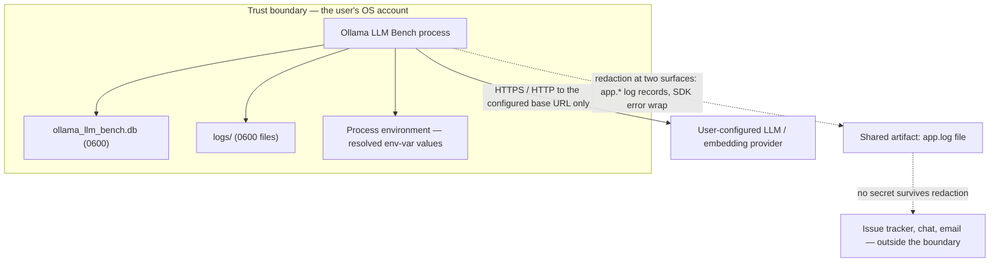

# Security Model

**Status:** Draft
**Owner:** architect
**Audience:** arch, coder, tester, human
**Last Updated:** 2026-06-06
**Cross-references:** 10_Domain_and_Data/08_REDACTION_PATTERNS.md, 10_Domain_and_Data/07_FILE_LAYOUT.md, 10_Domain_and_Data/03_PERSISTENCE_SCHEMA.md, 12_Quality_and_NFRs/09_PRIVACY_POLICY.md, 13_Distribution_and_Release/04_UNSIGNED_DISTRIBUTION.md, 16_Engineering_Standards/05_ERROR_HANDLING_STANDARD.md

This document defines the security model for Ollama LLM Bench: how secrets are stored and resolved, what file permissions protect them, how the redaction module is applied at the two surfaces where credentials could realistically leak out of the application, how a provider credential is stored as the **name of an environment variable** and resolved at use time, and the consequences of the decision to ship unsigned binaries. The application is a single-user desktop tool with no server component and no multi-tenancy; its threat model is correspondingly narrow, and this document states both what the model defends against and what it explicitly does not.

---

## Table of Contents

1. Threat model and trust boundary
2. What counts as a secret
3. Secret storage at rest
4. The environment-variable resolution path
5. File permissions
6. The redaction egress path
7. Network egress
8. Unsigned binaries and their implications
9. Non-goals

---

## 1. Threat model and trust boundary

Ollama LLM Bench is a single-user desktop application. It runs with the privileges of the user who launched it, stores its data in that user's per-user application data directory, and has no server, no shared storage, and no account system.

The trust boundary is the user's operating-system account. Everything inside that account — the application process, its data directory, its log files — is trusted to the same degree the user trusts their own account. The security model therefore does **not** defend against a local attacker who already has the user's account: such an attacker can read any file the user can read, and that is outside what a desktop application can prevent.

What the security model **does** defend against:

- **Accidental secret disclosure through artifacts that leave the machine.** A provider API key must not appear in the system/debug application log file (`<app-data>/logs/app/app.log` — `app.*` namespace) the user may share, or in a wrapped `AppError.message` that flows through the application — because those are the artifacts that realistically leave the machine or are attached to bug reports. The threat model **accepts** that the user sees their own user-authored prompts, their own machine's model responses, their own CSV/Markdown exports, their own clipboard content, and their own per-run log file (`run.*` namespace, `<app-data>/logs/run/...`) **without redaction**: these are the user's own data on the user's own machine, and the user is the only person who could ever leak them, deliberately. The two surfaces that **do** apply redaction are specified in `10_Domain_and_Data/08_REDACTION_PATTERNS.md`.
- **Over-broad file permissions.** A file that may contain a secret must not be readable by other accounts on a shared machine.
- **Secret-in-transit exposure beyond the intended provider.** A credential is sent only to the provider it configures, only over the connection that provider's configuration specifies, and never to any other endpoint.

## 2. What counts as a secret

A secret is any value that grants access to a provider, or any text from which such a value could be reconstructed. The authoritative definition lives in 10_Domain_and_Data/08_REDACTION_PATTERNS.md §2 and is summarised here:

- A provider API key — the actual key value, which the application never stores and only ever holds in memory after resolving an environment variable.
- An HTTP `Authorization` header value or bearer token.
- Any vendor-formatted key string found loose in free text — an error message, a stack trace, a provider response.

The **name of an environment variable** — the bare string `OPENAI_API_KEY` — is **not** a secret. It names where a secret lives without containing one. Its resolved value (the contents of that variable, read from the process environment) is a secret.

## 3. Secret storage at rest

Provider credential **environment-variable names** are stored in the SQLite database, in the `api_key_raw` column of both the `providers` catalog table and the per-run `benchmark_run_providers` snapshot table (see 10_Domain_and_Data/03_PERSISTENCE_SCHEMA.md). Per D-R-18 the `api_key_raw` column holds **only the bare name of an environment variable (for example `OPENAI_API_KEY`) — never a literal secret value, and never a wrapped reference of any kind**: a value that looks like an actual key is rejected at entry (below). The resolved secret therefore lives only in the OS process environment and never touches the database file. The three `azure_*_raw` columns hold **plain literal config values** (the Azure endpoint URL, deployment name, and api-version) because those are non-secret configuration, not credentials (Section 4 and 06_Settings_Dialog/sub_dialogs/provider_edit.md §6.2, §12).

Storage rules:

- **The application stores only an environment-variable NAME — never a literal secret, never a wrapped reference (D-R-18).** A value that is not a valid environment-variable name (regex `[A-Za-z_][A-Za-z0-9_]*`) — one that has spaces, `=`, a dollar sign, a brace, punctuation, or otherwise looks like an actual key — is **rejected inline at entry** in the Settings provider editor and on the import path, with guidance to enter the NAME of an environment variable rather than the key itself. There is no intermediate dialog to translate a key into a reference, and no "save plain" path. The bare name is stored verbatim; the resolved value is never written to disk. Empty is allowed for providers that need no key (local providers like llama.cpp).
- **The application never resolves an environment variable before storing.** A stored env-var name stays a name on disk; resolution happens only in memory at use time (Section 4).
- **No secret value is stored at rest, so there is nothing at-rest to encrypt.** The `api_key_raw` column holds only an environment-variable name (which names where a secret lives without containing one — §2); the resolved value exists only in memory at use time. The application does not integrate with an OS keychain, and does not need to: because the database never contains a secret value, database-file exfiltration leaks no credential. The file permission (Section 5) still applies as defence in depth. (This supersedes the prior model in which a literal key could be stored plaintext.)
- **A name is the only credential form the field can ever hold (D-R-18).** Because entry validation rejects anything that is not a bare environment-variable name (or empty), there is no literal key to convert and no plain-secret persistence path to guard. The name keeps the secret out of the database file entirely; the secret lives only in the process environment. (This supersedes D-R-09's wrapped environment-variable reference form; the D-R-09 intent — no literal secret ever at rest — is preserved and simplified.)
- **Scope note (cloud providers are in scope — MISS-34).** The application supports remote providers (OpenAI/Azure, Anthropic, Gemini) alongside local ones. Credential-at-rest handling, egress disclosure (a credential is sent only to its configured provider, §1), and the user-initiated cost of a billable inference test are therefore in-scope security/NFR concerns, not out-of-scope conveniences.

## 4. The environment-variable resolution path

A credential field holds the **bare name of an environment variable** (for example `OPENAI_API_KEY`), or is empty for a provider that needs no key. This is the only credential form the application stores, because the database then contains only the name and never the value.

Resolution rules:

- **Resolution is in-memory and at use time.** When a provider client is constructed for a health probe or for an inference call, the application reads the environment variable of the stored name from the process environment and uses its value. The resolved value exists only in process memory for the lifetime of that client; it is never written back to the database, a log, or a snapshot.
- **The name, not the value, is what is snapshotted.** When a run freezes its provider snapshot into `benchmark_run_providers`, it copies the environment-variable name verbatim. Resuming the run later re-reads the variable of that name against the environment at resume time.
- **The application reads environment variables once at startup, so a newly set variable requires a restart.** Environment is captured from the process the application was launched from; **restart the application** after you add or change a variable for it to be picked up. A variable you `export` in a single terminal is only visible if you launch the app from that same terminal session — to have it picked up generally, set it system-wide or in your shell profile / login environment.
- **An unset or empty variable is a diagnosable user error.** If the named variable is unset or empty, it resolves to unavailable: the provider's readiness probe reports `MISSING_ENV`, the Settings provider list shows the `env ✗` auth badge, and starting a run with that provider's models is blocked with a clear message (see EC-PROV-6 in 08_Cross_Cutting/08-I_edge_cases.md). It is never a silent inference failure. The existing Test reachability action reports whether the named variable resolves so the user can verify setup.
- **A resolved value is a secret the instant it is resolved.** From the moment the variable is read, the value is subject to every rule in Section 6 — it may reach an HTTP `Authorization` header and nowhere else, and it can never reach a log, an export, or the UI except through redaction.

## 5. File permissions

Every file the application writes that may contain a secret is created owner-readable and owner-writable only. The full permission table is fixed in 10_Domain_and_Data/07_FILE_LAYOUT.md §9; the security-relevant rules are:

| Path | macOS / Linux | Windows | Why |
|---|---|---|---|
| `<app-data>/` directory | `0700` | Owner-only ACL | May hold secret-bearing files; restrict directory listing to the owner |
| `ollama_llm_bench.db` and its `-wal` / `-shm` files | `0600` | Owner-only ACL | The provider tables store only environment-variable NAMES, never a secret value; treated owner-only as defence in depth |
| `logs/app/*` and `logs/run/*` | `0600` | Owner-only ACL | Logs are redacted, but treated as owner-only as defence in depth |
| `backups/settings_*.yaml` | `0600` | Owner-only ACL | A settings snapshot stores only environment-variable NAMES, never a secret value; treated owner-only as defence in depth |
| `temp/*` | `0600` | Owner-only ACL | May briefly hold secret-bearing content mid-write |
| `exports/*` | Process umask default | Default ACL | A user-owned artifact the user chooses to share; the user controls its permissions |

Hard rules:

- **The restrictive mode is set at the moment of creation, not afterward.** There is never a window in which a secret-bearing file is created world-readable and then tightened. On POSIX systems the file is opened with the restrictive mode; on Windows the owner-only ACL is applied as the file is created.
- **Export files are the single exception.** The user produces an export deliberately to share it, so an export takes the default umask. Exports contain the user's own task prompts and the model responses produced on the user's own machine — the threat model treats these as the user's own data and does not redact them on export (`10_Domain_and_Data/08_REDACTION_PATTERNS.md` §1). API-key values do not appear in exports because no export column carries credential material; the credentials live only in the database file (Section 3) and the process environment (Section 4).

## 6. The redaction surfaces

The redaction module is applied at exactly **two surfaces** — the surfaces on which a credential could realistically leak out of the application. The full specification (the regex denylist, the never-log key-name list, the placeholder, the length cap, the API surface, and the test cases) is in 10_Domain_and_Data/08_REDACTION_PATTERNS.md; this section states the two surfaces as a security control and the rationale for narrowing redaction to them.

The two surfaces:

1. **App log records — the `app.*` log namespace.** A structlog processor (`redact_for_log`) is installed in the namespace's pipeline so every record written to `<app-data>/logs/app/app.log` passes through it. The processor catches secrets that bypassed the adapter-boundary wrapping — typically raw HTTP request/response bodies dumped by a third-party SDK at its own DEBUG/TRACE level (`16_Engineering_Standards/06_LOGGING_STANDARD.md` §7).
2. **Provider SDK error-message wrapping at the adapter boundary.** Provider adapters catch SDK exceptions and pass the exception message through `redact(text)` before placing it in `AppError.message`. From this wrap point onward the message is canonically safe and flows through the rest of the application without further redaction.

**The local-app threat model accepts that the user sees their own prompts and responses unredacted on screen.** The user authors the task prompts, the user's machine produces the model responses, and the user is the only person reading them on the user's own computer. Redacting them on the Result widget tabs, in the run-log panel, in CSV/Markdown exports, on the clipboard, in the Run Analysis tab, or in the per-run log file (`run.*` namespace) would be theatre — there is no second party from whom the redaction would shield the data. The threat model therefore does **not** apply redaction to those surfaces. The surfaces that **do** apply redaction are the ones above, where the application produces a file or string that may leave the user's machine (`app.log` is the redacted log a user may choose to share manually; the wrapped `AppError.message` is the only text the application itself authors when an SDK exception is caught).

Why the narrower scope is the right security model for this application:

- **It focuses the engineering effort on the surfaces that matter.** Of the surfaces formerly named in the "single egress" rule, only `app.log` and wrapped SDK error messages can realistically leak credentials beyond the user. Concentrating the regex denylist and the property-based test on those two surfaces produces a tighter, more reviewable control than scattering redaction calls across every UI label, table cell, and clipboard action.
- **It is enforced architecturally.** The structlog processor is installed in the `app.*` pipeline at composition time; the provider adapters apply redaction at the `_internal` package boundary. An architecture test asserts that a raw provider SDK exception type cannot escape its adapter's `_internal` package without passing through the redaction wrap.
- **It is property-tested.** A property-based test fuzzes every error type with randomly embedded secrets and asserts no denylist pattern survives either the adapter wrap or the app-log structlog processor.

The retired "single, sole egress path" wording — and the retired `redact_for_display` / `redact_for_csv` functions — are recorded in `08_Cross_Cutting/08-F_spec_issues_log.md` with the rationale for the change.

## 7. Network egress

The application makes network calls to exactly one class of destination: the LLM and embedding providers the user has configured. There is no other outbound traffic.

- **A credential travels only to the provider that configures it.** A provider's API key is placed in the `Authorization` header (or the provider's equivalent) of requests to that provider's configured base URL, and to no other endpoint.
- **The base URL is the user's.** Every provider's base URL is a value the user entered in the provider dialog or restored from the user's own exported provider-configuration file via the explicit, preview-confirmed import flow (a same-user backup/restore feature, DD-55). The application has no hard-coded provider endpoint and contacts no endpoint the user did not configure. The three seeded providers default to `localhost` endpoints.
- **No telemetry, no update beacon, no analytics.** The application performs no background "phone-home" of any kind. This is a binding decision specified in 12_Quality_and_NFRs/09_PRIVACY_POLICY.md and the logging standard, and it means there is no outbound channel an attacker could observe or subvert other than the provider calls the user explicitly set up.
- **Transport security is the provider configuration's responsibility.** When a provider's base URL is `https://`, the connection is TLS-protected by the HTTP client's standard verification. When a user configures a plain `http://` endpoint — typically a `localhost` provider — the connection is unencrypted; this is the user's choice for a loopback address and is appropriate there.

## 8. Unsigned binaries and their implications

Ollama LLM Bench ships **unsigned** on all three platforms. There is no Apple Developer ID signature and no notarization on macOS, no Authenticode certificate on Windows, and no GPG signature embedded in the Linux AppImage. This is a deliberate, binding decision: the project carries no paid developer accounts and no code-signing certificates.

Security implications, stated plainly so users and reviewers understand the trade-off:

- **No supply-chain attestation from the operating system.** A signature would let the operating system verify that the binary came from a known publisher and was not modified after signing. Without a signature, the operating system cannot make that guarantee. The user must instead trust the distribution channel — the project's official release page — and may verify the published checksum of the download.
- **First-run friction is expected.** macOS Gatekeeper will refuse the first launch of an unsigned, un-notarized application until the user explicitly approves it; Windows SmartScreen will show an "unrecognised publisher" warning; a Linux AppImage must be made executable by the user. The exact, step-by-step approval flow for each operating system is documented for end users in 13_Distribution_and_Release/04_UNSIGNED_DISTRIBUTION.md. These are operating-system behaviours, not application bugs.
- **No auto-update mechanism at all.** The application does not check for, download, or install updates; it has no update-feed reader, no in-app "Check for updates" affordance, and no background update check (DD-36). Updating is entirely a manual user action: the user visits the project's GitHub Releases page out of band, downloads the new per-OS artifact, replaces the existing installation files, and relaunches. Checksum verification (next bullet) is the available integrity check on the downloaded artifact, exactly as for the first install.
- **Checksum verification is the available integrity check.** Each release publishes a checksum for every artifact. A user who wants assurance that a download was not tampered with verifies the checksum against the published value. This is the integrity mechanism the project offers in place of a signature.

The decision is revisitable only by a formal change: acquiring signing certificates is a cost and process decision recorded as an open question, not something an implementer changes unilaterally.

## 9. Non-goals

The security model explicitly does **not** address the following, and an implementer must not add machinery for them without a formal decision:

- **Defending against a local attacker with the user's account.** Such an attacker can already read every file the user can read; a desktop application cannot prevent this.
- **Encrypting the database at rest.** See Section 3 — the file permission is the at-rest control; application-managed encryption is out of scope.
- **Operating-system keychain integration.** Storing secrets in the platform keychain is not implemented; storing the environment-variable name (and keeping the secret only in the process environment) is how a secret is kept out of the database file.
- **Multi-user or multi-tenant isolation.** The application is single-user; there is no notion of one user's data being protected from another within the application.
- **Sandboxing the application.** The application runs with ordinary user privileges and is not confined by an application sandbox profile.
- **Auditing or tamper-evidence of the database.** The database is not append-only and carries no audit trail; a user with the account can edit it directly.
- **Policing which environment variable a credential names.** The credential field stores an env-var *name* validated only for shape (`[A-Za-z_][A-Za-z0-9_]*`); the application does not restrict *which* variable it names, nor inspect what that variable holds. A user could point a provider at `AWS_SECRET_ACCESS_KEY` or any other variable, and at use time the app resolves it and sends it to the configured endpoint. This is acceptable under the single-user trust model (consistent with DD-55): the app runs on the user's own machine, the variable holds the user's own secret, and the endpoint is one the user configured — choosing which of their own variables to send is the user's prerogative, not something the app guards.
- **Defending against malicious import files.** Import/export is a same-user data-portability feature (backup and restore across an OS reinstall, app reinstall, or device move; DD-55). An import file is treated as the user's own previously exported data; import validation checks schema shape, required fields, and value validity — it is correctness validation, not a security boundary. (YAML is still parsed in safe-load mode as ordinary engineering hygiene.)
- **Path traversal via export filenames is prevented (SPEC-064).** Every name-derived export filename component is sanitised (`10_Domain_and_Data/05_EXPORT_FORMATS.md` §2.1): characters outside `[A-Za-z0-9._-]` are replaced, leading dots and leading/trailing underscores are stripped, length is capped, and an empty result falls back to `Run_<run_id>` — so a model/run name can never produce a `.`/`..` component or escape the user-chosen directory. (Listed here as a defended surface, not a non-goal.)
- **Spreadsheet formula-injection mangling in CSV exports.** Exported CSV cells are written verbatim — no neutralizing prefix and no content alteration. Exports carry the application's own database content: the user's own task data and the responses of models the user explicitly configured and ran. The export is trusted local content by design; byte-for-byte cell fidelity is the contract. A user who imports third-party task files and opens exports in a spreadsheet application does so over their own data at their own discretion (see `10_Domain_and_Data/05_EXPORT_FORMATS.md` §3.1).
