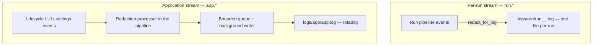

# Observability

**Status:** Draft
**Owner:** architect
**Audience:** arch, coder, tester, human
**Last Updated:** 2026-06-06
**Cross-references:** 16_Engineering_Standards/06_LOGGING_STANDARD.md, 16_Engineering_Standards/05_ERROR_HANDLING_STANDARD.md, 10_Domain_and_Data/07_FILE_LAYOUT.md, 10_Domain_and_Data/08_REDACTION_PATTERNS.md, 12_Quality_and_NFRs/07_RESOURCE_LIMITS.md, 12_Quality_and_NFRs/09_PRIVACY_POLICY.md, 13_Distribution_and_Release/07_CRASH_REPORTING.md

This document specifies the observability model for Ollama LLM Bench as a non-functional requirement: the two independent log streams, where their files live, and how they rotate and are pruned. Observability in this application is entirely local — there is no telemetry, no remote logging, and no analytics. Everything an operator or a developer needs to diagnose a problem is a file on the user's own machine; the application never packages or transmits any of it. The application log is the local diagnostic record, and a user may share it manually at their own discretion (`13_Distribution_and_Release/07_CRASH_REPORTING.md`).

---

## Table of Contents

1. Observability principles
2. The two log streams
3. File locations
4. Rotation and retention
5. Correlation identifiers
6. No telemetry
7. Observability requirements summary

---

## 1. Observability principles

> **Surviving quantitative responsiveness requirements (SPEC-103).** DD-35 retired the standalone performance-budgets document and banned CI perf gates, but a few *behavioural* numeric guarantees remain normative and are tested as edge cases rather than perf budgets: the `_inference_progress` ≥1 Hz emit cadence (EC-RUN-17, `08_Cross_Cutting/08-J_event_bus_catalog.md`), the hard-cancel bound `provider.hard_cancel_max_ms` (DD-39), and the non-blocking-UI guarantee (no blocking call on the GUI thread). These are correctness assertions on observable behaviour, not wall-clock performance budgets.

- **Local-only.** All diagnostic data stays in the per-user application data directory. Nothing is transmitted off the machine automatically.
- **Two streams, two privacy profiles.** A per-run event log carries detailed, potentially sensitive pipeline detail; a rotating application log carries a shareable lifecycle trail. The two are kept in separate files so their different egress rules can be enforced independently.
- **Structured, not free text.** Every log record is a static event name plus typed key/value fields, so the logs are queryable rather than only readable.
- **Redaction before disk for the shareable stream.** Every record on the application stream passes the redaction processor before it is written; the application log is therefore always safe to share.
- **Non-blocking.** Log I/O never blocks the GUI thread. Records are queued and a background writer drains them.

These principles and the structured-logging mechanics are fixed in 16_Engineering_Standards/06_LOGGING_STANDARD.md. This document states the observability model as a measurable non-functional requirement and the numeric retention limits that the logging standard defers here.

## 2. The two log streams

The application maintains exactly two log streams. They never share a file and never share a destination.

| Property | Benchmark run log | Application / system log |
|---|---|---|
| Purpose | The full event trail of one benchmark run | The lifecycle trail of the whole application |
| Logger namespace | `run.*` | `app.*` |
| Destination | One file per run | One rotating file |
| Content | Stage transitions, per-task inference start and finish, retries, evaluation-layer outcomes, verdicts, circuit-breaker transitions, run-level errors, and the chained raw provider exception detail | Startup and shutdown, user actions, UI events, settings changes, update checks, redacted error summaries, background-service activity |
| Verbosity | Fixed at full detail; not user-tunable | User-tunable; `INFO` in a release build, `DEBUG` opt-in |
| Redaction at write | Written through `redact_for_log`; retains the un-redacted chained provider exception for diagnosis | Written through `redact_for_log`; always fully redacted |
| Egress | Stays on the machine; the application never transmits it. A user may share the file manually at their own discretion | Stays on the machine; already redacted. A user may share the file manually at their own discretion |
| Lifetime | Created at run start, closed at run end, never reopened | Spans the whole installed life of the application |

The user-facing `logging.app_log_level` enum uses friendly names (`trace`, `debug`, `info`, `warn`, `error`); these map onto the standard Python `logging` levels as: `trace` → a custom `TRACE` level below `DEBUG` (numeric 5), `debug` → `DEBUG`, `info` → `INFO`, `warn` → `WARNING`, `error` → `ERROR`. There is no friendly value for `CRITICAL`; it is always emitted. The friendly enum is the only user-tunable surface; the standard level is what the logging configuration installs.



The `run.*` namespace is configured not to propagate to the root logger, so run detail can never bubble into `app.log`. This is the structural guarantee that the detailed stream and the shareable stream stay separate.

## 3. File locations

All log files live under the per-user application data directory `<app-data>`, resolved per operating system in 10_Domain_and_Data/07_FILE_LAYOUT.md §1.

```
<app-data>/
└── logs/
    ├── app/
    │   ├── app.log              current application log
    │   ├── app.log.1            rotated backup, newest
    │   ├── ...
    │   └── app.log.5            rotated backup, oldest
    └── run/
        └── run_<run_id>_<unix_ts>.log   one per benchmark run
```

A run-log filename is the literal `run_`, the integer run id, an underscore, the run's start time as a Unix timestamp in seconds, and `.log` — for example `run_3_1747407187.log`. The filename ties a log file unambiguously to its run record.

All log files are UTF-8, with LF line endings, one structured record per line. Each file is created owner-readable and owner-writable only (`0600` or the Windows owner-only ACL), as defence in depth even though the application stream is already redacted.

## 4. Rotation and retention

Rotation and retention are non-functional requirements. The numeric limits below are binding; the resource-ceiling rationale is cross-referenced in 12_Quality_and_NFRs/07_RESOURCE_LIMITS.md.

### 4.1 Application log rotation

| Parameter | Value |
|---|---|
| Rotation trigger | `app.log` reaching `logging.app_log_max_file_mb` (default 10 MB; user-configurable 1–50 MB) |
| Rotation action | `app.log` becomes `app.log.1`; each `app.log.N` becomes `app.log.N+1`; a fresh empty `app.log` is opened |
| Backups retained | Derived: `floor(logging.app_log_max_total_mb / logging.app_log_max_file_mb)` files in total (current plus backups); at the defaults this is `app.log.1` through `app.log.5` |
| Discard | What would exceed the derived backup count is deleted |
| Total disk ceiling | At most `logging.app_log_max_total_mb` (default 60 MB; user-configurable up to a 200 MB hard maximum) across the current file and all backups |

### 4.2 Run log retention

Run logs are not rotated — a run log is bounded by its run's task count and is part of that run's evidence. They are pruned at startup, after the crash-recovery sweep.

| Rule | Action |
|---|---|
| Age | A run log whose run finished more than 90 days ago is deleted |
| Count | When more than 200 run logs remain, the oldest are deleted until 200 remain |
| Orphan | A run log whose `run_id` no longer exists in the database is deleted |

The age rule and the count rule are both applied; whichever removes more files governs. A run log is never written after its run reaches a terminal state, so a pruned file is never re-created.

### 4.3 In-memory log buffer

The on-screen run-log panel renders from a bounded in-memory buffer of the run's events. The buffer holds at most `ui.run_log_max_lines` events — default 100,000, user-configurable within the hard range 1,000–500,000 (the panel renders one line per event, so the cap counts events and lines interchangeably). When it is full the oldest event is dropped to admit the newest (rolling drop). Dropping a panel event never affects the run-log file, which records every event at full verbosity regardless of the panel buffer or the panel's verbosity setting (see EC-LOG-3 in 08_Cross_Cutting/08-I_edge_cases.md). The buffer cap exists so a very long run cannot grow the panel's memory without bound; the hard maximum keeps that bound finite regardless of the user's setting.

## 5. Correlation identifiers

Every benchmark run binds a `run_id` and a `correlation_id` at run start. The binding uses context variables, and the run context is propagated into each worker unit the dispatcher submits, so both identifiers attach to every record emitted by the run's worker threads. (Context variables do not cross threads automatically, so the dispatcher copies the run's context into each submitted unit.)

- The `run_id` ties a record to a persisted run row and to that run's own log file.
- The `correlation_id` ties together every record across both streams for one logical operation and is the same identifier carried on an error's `ErrorContext`. A failure can therefore be cross-referenced from one record to the exact records that surround it.

This is the mechanism that makes the two-stream model navigable: given a `correlation_id` from an error record, an investigator can locate the matching records in both `app.log` and the relevant run log.

## 6. No telemetry

Ollama LLM Bench emits **no telemetry**. There is no analytics service, no remote crash-reporting service, no usage reporting, and no background connection of any kind other than the LLM and embedding provider calls the user explicitly configured. This is a binding product decision; it is stated as a privacy requirement in 12_Quality_and_NFRs/09_PRIVACY_POLICY.md and as a logging rule in 16_Engineering_Standards/06_LOGGING_STANDARD.md, and it applies to every build and every release channel.

The observability model is built entirely around this constraint: it is why diagnostic data is structured but local, why the app log is the local diagnostic record the user may choose to share manually, and why there is no remote dashboard or aggregation.

## 7. Observability requirements summary

| Requirement | Target | Enforcement |
|---|---|---|
| Two independent log streams, never sharing a file | `run.*` does not propagate to root | Architecture test asserts the run logger does not propagate |
| Application log fully redacted before disk | Redaction processor present in the `app.*` pipeline | Property-based test fuzzes records with embedded secrets |
| Log I/O never blocks the GUI loop | Bounded queue plus background writer; loop-non-blocking rule in 16_Engineering_Standards/04_CONCURRENCY_STANDARD.md | Architecture test asserts no synchronous file I/O on the GUI loop |
| Application log disk ceiling | ≤ `logging.app_log_max_total_mb` (default 60 MB; hard max 200 MB) | Verified by the rotation parameters and the derived backup count |
| Run logs pruned at startup | ≤ 200 files, ≤ 90 days, no orphans | Startup cleanup; covered by an integration test |
| No telemetry | Zero outbound connections except configured providers | Network-isolation test asserts no other endpoint is contacted |
