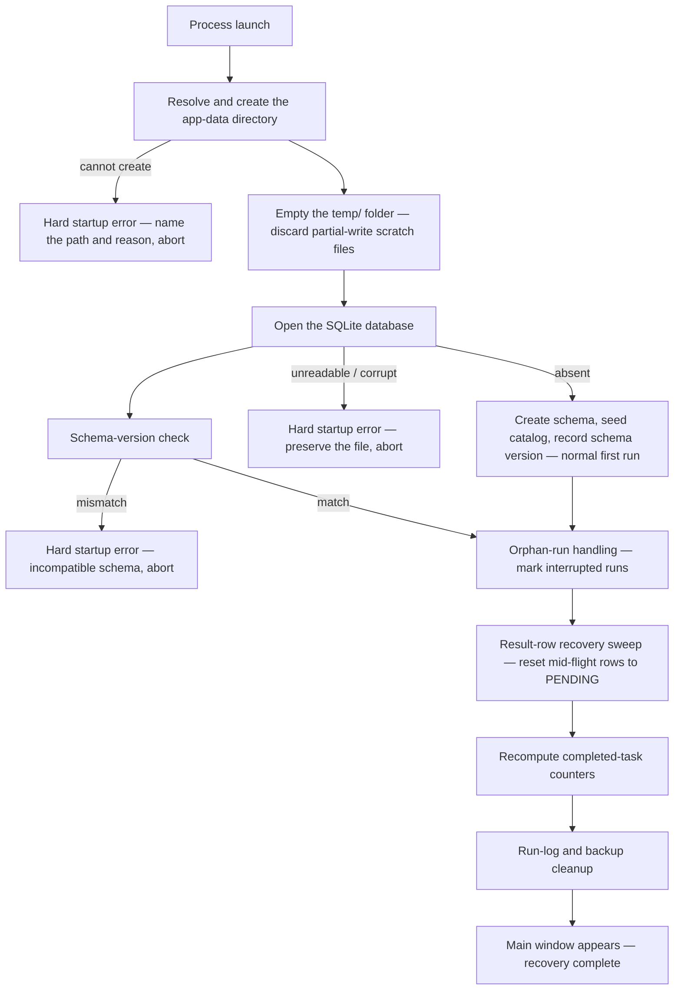

# Error Recovery

**Status:** Draft
**Owner:** architect
**Audience:** coder, tester, arch
**Last Updated:** 2026-06-06
**Cross-references:** 10_Domain_and_Data/03_PERSISTENCE_SCHEMA.md, 10_Domain_and_Data/07_FILE_LAYOUT.md, 08_Cross_Cutting/08-I_edge_cases.md, 12_Quality_and_NFRs/06_DATA_INTEGRITY.md, 12_Quality_and_NFRs/05_CONCURRENCY_GUARANTEES.md, 16_Engineering_Standards/05_ERROR_HANDLING_STANDARD.md

This document specifies how Ollama LLM Bench recovers from an abnormal termination — a crash, a force-quit, an operating-system power loss, or a kill while a benchmark run was executing. Recovery is automatic and runs at startup; it never asks the user to repair state by hand. The design goal is that the worst outcome of any abnormal termination is one lost in-flight task that re-runs cleanly, never a corrupt database, never an unresumable run, and never a half-written result presented as real data.

---

## Table of Contents

1. Recovery principles
2. The startup recovery sequence
3. Orphan-run handling
4. The result-row recovery sweep
5. Partial-write recovery for files
6. Database-corruption handling
7. Schema-version mismatch
8. Recovery requirements summary

---

## 1. Recovery principles

- **Recovery is automatic and at startup.** Every recovery action runs without user intervention as part of launch. The user is informed of what was recovered; they are never asked to fix state manually.
- **The persisted state is always self-consistent at the run level.** A run is persisted only in a status the schema permits (`incomplete`, `completed`, `failed`, `stopped`). The in-memory `RUNNING` and `PAUSED` states are never written. An interrupted run is therefore correctly `incomplete` on disk with no sweep needed at the run level.
- **Recovery is idempotent.** Running the recovery sequence twice produces the same result as running it once. A second abnormal termination during recovery is itself recoverable.
- **Recovery never destroys evidence.** A recorded failure is left as a recorded failure; a corrupt database is preserved, not deleted. Recovery resets only state that is genuinely indeterminate.
- **A lost in-flight unit re-runs; it is never trusted.** A result row left mid-flight is reset to `pending` so the pipeline re-executes it; it is never read back as if it were complete.

## 2. The startup recovery sequence

Every launch performs the same fixed sequence before the main window appears. Each step is described in the section noted.

A hard startup error at any of the three abort points shows a clear modal dialog naming the problem and the affected path, and the application does not start. It never proceeds with partial state.

## 3. Orphan-run handling

An orphan run is a run that the previous process left persisted as `incomplete` while it was actually executing — the process died with a pipeline loaded.

Because the persisted `incomplete` status is exactly the status of a created-or-in-progress run, an orphan run is **not** in a corrupt state. The Resume Widget would already offer it for resume. Orphan-run handling does one additional thing: it makes the interruption explicit so the user understands the run did not finish on its own.

- At startup, every run still in `incomplete` is examined. There is no in-memory pipeline for it, so it is an orphan from a prior session.
- The run is left resumable. Its status, its frozen settings, provider, model, and task snapshots, and its already-completed result rows are all intact and untouched.
- A run-level note is recorded indicating the run was recovered from a previous session that ended unexpectedly. This note surfaces in the Resume Widget so the user is not surprised that a run they thought was finished is offered for resume.
- The run's result rows are then handed to the recovery sweep (Section 4), which is where the genuinely indeterminate state is fixed.

This matches EC-PERSIST-2 in 08_Cross_Cutting/08-I_edge_cases.md. A run that was deliberately stopped before the crash is already `stopped` and is not an orphan; a run that failed is already `failed`; neither is touched by orphan handling.

## 4. The result-row recovery sweep

Recovery at the row level is where the only genuinely indeterminate state lives. A `benchmark_results` row can be left in a non-terminal in-flight status — `running_inference`, `awaiting_keyword_check`, `awaiting_cosine_check`, or `awaiting_judge_check` — if the process died part-way through evaluating that task. Such a row's partial data cannot be trusted: the inference may or may not have completed, the keyword or cosine or judge phase may have run on incomplete input, and the child rows may be half-written.

The sweep runs once at startup, immediately after the schema-version check passes, and again whenever a run is resumed. It is one SQLite transaction with two steps (the exact statements are in 10_Domain_and_Data/03_PERSISTENCE_SCHEMA.md §9):

1. **Clear the child rows** (`benchmark_result_terms`, `benchmark_result_attempts`) of every result currently in an in-flight status — they belong to an evaluation that did not finish.
2. **Reset the result row** itself to `pending` and null every in-flight column: the verdict, the timing fields, the prompts sent, the raw and sanitized responses, the keyword, cosine, and judge outcomes, the resolution layer, and the error fields.

After the sweep, every result row is in exactly one of two safe states: a terminal status (`completed`, or a terminal failure such as `failed_inference`), or `pending`. No row remains mid-flight.

Two rules protect evidence and progress:

- **A retryable failure row is left alone.** A row already in `failed_inference`, `failed_provider`, `failed_timeout`, `failed_judge_timeout`, or `errored` is a recorded failure, not an indeterminate state. The sweep does not touch it. The user decides in the Resume Widget whether to retry it (see EC-PERSIST-4 in 08_Cross_Cutting/08-I_edge_cases.md). Silently turning a recorded failure into a `pending` row would lose the failure history.

  - **Per-role timeout recovery (DD-34).** Two distinct timeout terminal statuses exist: **`failed_timeout`** records exhaustion of the Phase 2 (inference, role=INFERENCE) adaptive-timeout ladder, OR exclusion of the test model after the role=INFERENCE consecutive-max threshold. **`failed_judge_timeout`** records exhaustion of the Phase 4 (judge, role=JUDGE) adaptive-timeout ladder for one task's judge call, OR exclusion of the judge model after the role=JUDGE consecutive-max threshold. The two follow **different** retry paths (DD-66, stage-preserving retry). A `failed_timeout` retry resets to `pending` and re-runs the WHOLE task (inference is the failed stage). A `failed_judge_timeout` retry resets to `awaiting_judge_check` and re-runs **only the judge** against the preserved inference response — the original inference text, timings, keyword verdict, and cosine score are **kept**, so the re-judge grades the same response and stays consistent with the earlier stages. (A crash before the re-judge falls back safely to a whole-task re-run via the startup sweep.) The relevant per-role bucket's persistent last-known-good budget may carry escalated state into the retry. See `11_Services_and_Algorithms/07_ADAPTIVE_TIMEOUT.md` and DD-34 in `08_Cross_Cutting/08-F_spec_issues_log.md`.

  - **Embedding timeout recovery (DD-34).** Embedding calls use a fixed `eval.embedding_timeout_seconds` budget and do NOT consult the Adaptive Timeout Service. An embedding timeout for one task degrades that task's cosine phase to not-run (`cosine_similarity = None`, `cosine_verdict = None`); the binary verdict cascade settles per D-012. The task is NOT marked failed — it can still settle to `COMPLETED` if the keyword or judge phases produce a verdict. There is no exclusion of the embedding model after consecutive timeouts; a chronically stalled embedding model keeps producing per-task cosine degradation across the run.

  - **Run-analysis exhaustion recovery (DD-34).** Run-analysis generation that exhausts the role=RUN_ANALYSIS ladder (DD-65) returns `RunAnalysisResult(outcome=FAILED, error_message="judge_timeout_exhausted: …")`. The Generate Analysis dialog renders a "pick a different model and retry" callout (`07_Common_Dialogs/generate_analysis_dialog.md` EC-GA-8). No row in `benchmark_results` is affected — analysis is a run-level narrative, not a per-task result. The RUN_ANALYSIS bucket keeps its own last-known-good and counter, independent of the per-task judge bucket.
- **A completed row is left alone.** A `completed` row was persisted in full before any pause or crash checkpoint could fire (see 12_Quality_and_NFRs/06_DATA_INTEGRITY.md), so it is durable and correct. It is never re-run on recovery, including a completed row carrying a `FAIL` verdict — a `FAIL` verdict is a valid result, not an error.

After the sweep, the run's header is **re-derived entirely from its result rows** — never trusted from a cached value (MISS-23). Both the `completed_tasks` counter *and* the overall run state are recomputed from the surviving rows, so the header matches reality even though the run never reached a clean shutdown:

- The `completed_tasks` counter is recounted from the terminal rows.
- The run's persisted status is reconciled with the rows: if **every** result row is terminal (`COMPLETED` / a terminal failure), the run is finalised to its terminal status (`COMPLETED`, or `FAILED` if the failure policy applies) — this corrects a run that actually finished but was force-closed during a later step such as run-analysis generation, where only the run header was left mid-update. If **any** row is still non-terminal after the sweep (`PENDING`, or a reset mid-flight row), the run stays `INCOMPLETE` and resumable.

This row-as-source-of-truth rule is why a lost commit is always safe — but the two abnormal-termination classes lose different things and must not be conflated:

- **An application crash, force-quit, or kill** loses at most the single *in-flight* (uncommitted) write; every committed transaction is durable.
- **An operating-system crash or power loss** (`synchronous=NORMAL`) can additionally lose the last few *committed* transactions — always a **contiguous suffix** of the serialized commit sequence (`12_Quality_and_NFRs/06_DATA_INTEGRITY.md` §2). Each lost result-row write reverts that row to its prior non-terminal state; the sweep finds it non-terminal and re-runs it.

In both classes, no task can survive as a stale terminal state it never actually reached, because the database only ever holds committed task outcomes — and because the run header's terminal write is issued strictly **after** every result-row write (the ordering invariant of `06_DATA_INTEGRITY.md` §2), a surviving terminal header implies all of its result rows survived with it. The recovery decision therefore needs no special durability mode — it reads the committed rows and recomputes.

## 5. Partial-write recovery for files

Every file the application writes outside the database — log files, exports, settings backups — is written with the atomic temp-then-rename pattern: the content is written to a temporary file in `<app-data>/temp/` or alongside the destination, and only a fully written temporary file is renamed into its final path.

The recovery consequence:

- **A final-path file is always complete.** Because the rename is atomic on every supported filesystem, a file at its final path either does not exist or is the complete content. A crash mid-write leaves a stranded temporary file, never a truncated final file.
- **The temp folder is emptied at every startup.** The first action after creating the data directory is to delete the entire contents of `<app-data>/temp/`. Any temporary file left by a crashed write is discarded there. No code may store anything in `temp/` it needs to survive a restart.
- **A disk-full write fails cleanly.** When the destination disk is full, the temporary write fails before any rename, the final path is never touched, and the failure is surfaced as an error. There is no half-written export and no half-written log file (see EC-FL-9 in 08_Cross_Cutting/08-I_edge_cases.md).

The SQLite database is the one file not governed by temp-then-rename — SQLite's own WAL mechanism provides its crash safety, covered in Section 6.

## 6. Database-corruption handling

The SQLite database in WAL mode is crash-safe by construction. A transaction is durable once committed, and a transaction interrupted by a crash is rolled back atomically when the database is next opened — the `-wal` and `-shm` sidecar files are recovered automatically by SQLite. An ordinary crash, force-quit, or kill therefore never corrupts the database; it leaves it at the last committed transaction boundary.

Genuine corruption — a damaged file from failing storage hardware, an operating-system fault, or an external process having modified the file — is rare but possible. It is handled as a **hard startup error**:

- When the database file is present but cannot be opened, or opens but fails an integrity check, the application stops with a clear modal dialog explaining that the database is unreadable or corrupt.
- **The application does not delete, truncate, overwrite, or "repair" the corrupt file.** It is preserved exactly as found, so the user — or a recovery tool — may attempt to salvage data from it. Destroying a corrupt database to "start fresh" would be silent, unrecoverable data loss.
- The dialog tells the user where the file is and that a recoverable option is to move the file aside so the application can create a fresh database, accepting the loss of the old data as the user's explicit choice.
- An absent database file is the opposite case and is **not** an error: it is the normal first-run path, and the application creates a fresh schema and seeds the catalog (see EC-PERSIST-5 in 08_Cross_Cutting/08-I_edge_cases.md).

A `DatabaseIntegrityError` raised at runtime — a broken schema invariant discovered while the application is running — is a programmer-error in the taxonomy of 16_Engineering_Standards/05_ERROR_HANDLING_STANDARD.md. It is not recovered; it reaches the terminal hook and crashes the process with a full diagnostic, because continuing past a broken invariant would produce wrong data.

## 7. Schema-version mismatch

The application embeds a single expected schema-version integer and records the version each database file was created with in `app_meta.schema_version`. At startup, after opening the database, the two are compared.

- **They match** — startup continues with the recovery sweep.
- **They differ in either direction** — startup halts with a hard, clearly reported error. The application does not open the database for use, does not run any DDL, does not add or alter any column or table, and does not start the main window. The dialog states the stored version, the expected version, and that the database is incompatible with this application build.

There are no data migrations or conversions (DD-53). An older same-major database is brought forward by purely structural additive steps at startup (`10_Domain_and_Data/03_PERSISTENCE_SCHEMA.md` §8) — existing rows are never touched. A cross-major or newer-than-app schema version is a recovery situation only in the sense that the application recovers gracefully — by refusing to run rather than corrupting data — not in the sense of an automatic upgrade. This matches EC-PERSIST-1 in 08_Cross_Cutting/08-I_edge_cases.md.

## 8. Recovery requirements summary

| Failure | Detection point | Recovery action | Outcome guarantee |
|---|---|---|---|
| Crash while a run was executing | Startup: run still `incomplete` | Orphan handling marks it recovered; the row sweep resets mid-flight rows | The run is fully resumable; no row is mid-flight |
| Result row left mid-evaluation | Startup / resume: row in an in-flight status | Sweep clears child rows and resets the row to `pending` | The task re-runs cleanly; no partial data is read as real |
| Recorded failure row present at recovery | Startup / resume: row in a retryable-failure status | Sweep leaves it untouched | Failure history is preserved; the user chooses to retry |
| Completed row present at recovery | Startup / resume: row `completed` | Sweep leaves it untouched | A durable result is never re-run |
| Crash mid-write of a log, export, or backup | Startup: stray file in `temp/` | `temp/` is emptied at startup | No truncated final file ever exists |
| Database transaction interrupted by a crash | Next database open | SQLite WAL rolls back to the last commit | The database is consistent at a transaction boundary |
| Database file corrupt or unreadable | Startup: open or integrity check fails | Hard startup error; the file is preserved | The corrupt file is never destroyed |
| Database file absent | Startup: file not found | Create fresh schema, seed catalog | Normal first-run path |
| Schema version older, same major | Startup: version comparison | Ordered additive structural steps applied (DD-53); existing rows never touched | Run history survives minor upgrades |
| Schema version newer or cross-major | Startup: version comparison | Hard startup error; the database is not touched | No data conversion; no data corruption |
| Broken schema invariant discovered at runtime | Pipeline / persistence layer | `DatabaseIntegrityError` reaches the terminal hook; the process crashes | Wrong data is never produced past a broken invariant |
