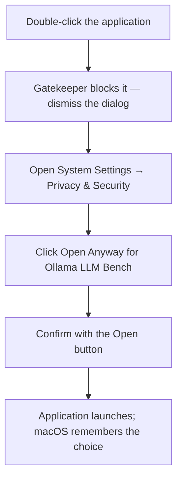
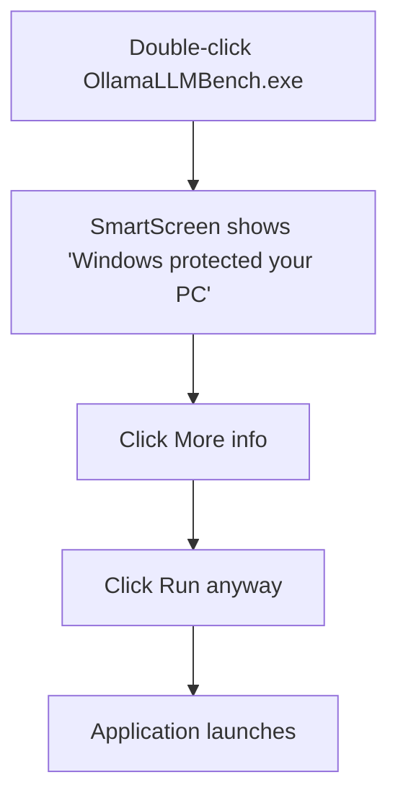

# Unsigned Distribution

**Status:** Draft
**Owner:** architect
**Audience:** user, human
**Last Updated:** 2026-05-22
**Cross-references:** 13_Distribution_and_Release/01_PLATFORM_SUPPORT.md, 13_Distribution_and_Release/02_INSTALLATION.md, 16_Engineering_Standards/08_CICD_AND_PACKAGING.md

This document explains why Ollama LLM Bench shows an operating-system security warning on first launch and gives the exact steps to allow the application to run on macOS, Windows, and Linux. The warnings are expected; they appear because the application binaries are unsigned.

---

## Table of Contents

1. [Why a Security Warning Appears](#1-why-a-security-warning-appears)
2. [macOS — Gatekeeper](#2-macos--gatekeeper)
3. [Windows — SmartScreen](#3-windows--smartscreen)
4. [Linux — AppImage Execute Permission](#4-linux--appimage-execute-permission)
5. [Verifying the Download Is Genuine](#5-verifying-the-download-is-genuine)
5a. [Updating re-triggers the first-run flow (per-binary)](#5a-updating-re-triggers-the-first-run-flow-per-binary)
6. [Frequently Asked Questions](#6-frequently-asked-questions)

---

## 1. Why a Security Warning Appears

Operating systems show a warning when an application has not been signed with a certificate issued by a recognised authority. Code-signing certificates require paid developer accounts. Ollama LLM Bench is distributed without them: there is no Apple Developer ID, no Apple notarization, and no Windows Authenticode certificate.

As a result:

- **macOS** shows a Gatekeeper warning that the application is from an unidentified developer.
- **Windows** shows a SmartScreen warning that the application is unrecognised.
- **Linux** shows no warning, but the downloaded AppImage may lack the execute permission and so will not launch on a double-click.

These are not signs of a defect or of malware. They appear for every unsigned application. The macOS bundle is ad-hoc signed — signed with no identity — so the operating system sees it as internally consistent; ad-hoc signing does not remove the Gatekeeper prompt. The remainder of this document gives the one-time steps to allow the application on each operating system. To independently confirm a download is genuine, verify its checksum (Section 5).

## 2. macOS — Gatekeeper

On the first launch, macOS Gatekeeper blocks the application and reports it as from an unidentified developer. Allow it once with these steps:

1. Install the application by dragging it to the `Applications` folder, as in `13_Distribution_and_Release/02_INSTALLATION.md`.
2. Double-click `Ollama LLM Bench` in the `Applications` folder. macOS shows a dialog stating the application cannot be opened because it is from an unidentified developer. Click **Done** or **Cancel** to dismiss the dialog.
3. Open **System Settings**.
4. Go to **Privacy & Security**.
5. Scroll to the **Security** section. It shows a message naming `Ollama LLM Bench` and a button labelled **Open Anyway**.
6. Click **Open Anyway**. Confirm with the administrator password or Touch ID if prompted.
7. A final confirmation dialog appears with an **Open** button. Click **Open**.

The application launches. macOS remembers the choice; later launches open the application normally with no further prompt.



If the **Open Anyway** button does not appear in **Privacy & Security**, double-click the application once first so macOS records the blocked launch attempt, then return to **Privacy & Security**.

**Terminal fallback (macOS).** If the Open-Anyway flow does not clear the block (for example the app was quarantined inside a `.zip` that the Finder unpacked), remove the quarantine attribute directly and then launch:

```
xattr -d com.apple.quarantine "/Applications/Ollama LLM Bench.app"
```

This strips the `com.apple.quarantine` flag macOS applies to internet-downloaded files; the next launch opens normally.

## 3. Windows — SmartScreen

On the first launch, Windows SmartScreen blocks the application and reports it as an unrecognised application. Allow it once with these steps:

1. Extract the portable `.zip` to a writable folder and locate `OllamaLLMBench.exe`, as in `13_Distribution_and_Release/02_INSTALLATION.md`.
2. Double-click `OllamaLLMBench.exe`. SmartScreen shows a blue dialog titled "Windows protected your PC".
3. Click the **More info** link in the dialog. The dialog expands to show the application name and a **Run anyway** button.
4. Click **Run anyway**.

The application launches. As more users run the same release, SmartScreen's reputation for it improves and the warning softens, but it cannot be removed entirely without a certificate.



A downloaded `.zip` may carry a "mark of the web" flag that Windows applies to files from the internet. If the warning persists, right-click the `.zip` file before extracting it, open **Properties**, and if an **Unblock** checkbox is shown in the **General** tab, enable it and click **OK**, then extract the `.zip` again.

## 4. Linux — AppImage Execute Permission

Linux shows no signature warning for the AppImage. The only step needed is to mark the downloaded file as executable, because files downloaded from a browser are usually not executable by default.

Using a file manager:

1. Right-click the downloaded `OllamaLLMBench-<version>-linux-x86_64.AppImage` file.
2. Open **Properties**.
3. Open the **Permissions** tab.
4. Enable **Allow executing file as program** (the wording varies by desktop environment).
5. Close the properties dialog and double-click the AppImage to launch it.

Using a terminal:

```
chmod +x OllamaLLMBench-<version>-linux-x86_64.AppImage
./OllamaLLMBench-<version>-linux-x86_64.AppImage
```

The execute permission only needs to be set once for a given AppImage file. The AppImage requires a FUSE runtime; if it reports a FUSE error, install the distribution's FUSE package or run the AppImage with the `--appimage-extract-and-run` option (see `13_Distribution_and_Release/01_PLATFORM_SUPPORT.md`, issue KI-04).

## 5. Verifying the Download Is Genuine

The security warnings come from the absence of a code-signing certificate, not from any check of the file's contents. To independently confirm that a downloaded artifact is the genuine, unmodified release, verify its SHA256 checksum against the `SHA256SUMS` file published with the release. The exact commands for each operating system are in `13_Distribution_and_Release/02_INSTALLATION.md`. A matching checksum confirms the download is intact regardless of the operating-system warning.

## 5a. Updating re-triggers the first-run flow (per-binary)

The operating system remembers the allow decision **per binary**, not per application name. Because every release is a **new, different binary** and updating is a manual in-place replace (DD-36 — there is no auto-update), each new version is unrecognised again and re-triggers the security flow exactly once:

- **macOS** re-applies the `com.apple.quarantine` flag to the freshly downloaded `.app`, so Gatekeeper blocks the first launch of the new version. Repeat the §2 **Open Anyway** step once for the updated app, or use the `xattr -d com.apple.quarantine` fallback above.
- **Windows** treats the new `.exe` as a separate file with its own SmartScreen reputation, so the "Windows protected your PC" prompt reappears for the new version. Repeat the §3 **More info → Run anyway** step once (and re-apply the **Unblock** Properties step on the new `.zip` if needed).
- **Linux** stores no allow decision, but the newly downloaded AppImage arrives without the execute bit, so `chmod +x` (or the file-manager permission step) must be re-applied to the new file once.

In every case it is a **one-time-per-update** repeat of the same first-run step, not a per-launch prompt: once allowed, that specific version's binary launches normally until it is replaced by the next update.

## 6. Frequently Asked Questions

**Is the warning a sign of malware?**
No. The warning means the application is unsigned. Every unsigned application produces the same warning. To confirm the download is genuine, verify its checksum (Section 5).

**Will I see the warning every time I launch the application?**
No, not on every launch — but you will see it again **once per update**. Each operating system remembers the choice **per binary**, so the current version opens normally after you allow it: on macOS after **Open Anyway**, on Windows after **Run anyway**, and on Linux once the execute permission is set. When you install a new version (a different binary), the first-run flow re-triggers once for that new version — see Section 5a.

**Why not sign the application?**
Code signing and macOS notarization require paid developer accounts, which are out of scope for this project. The trade-off is the one-time first-launch step described above.
