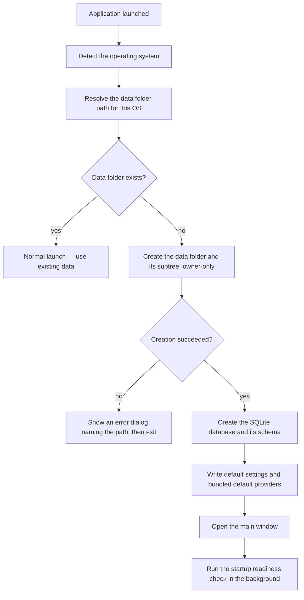

# First-Run Experience

**Status:** Draft
**Owner:** architect
**Audience:** user, human
**Last Updated:** 2026-06-06
**Cross-references:** 13_Distribution_and_Release/02_INSTALLATION.md, 13_Distribution_and_Release/04_UNSIGNED_DISTRIBUTION.md, 10_Domain_and_Data/07_FILE_LAYOUT.md, 08_Cross_Cutting/08-M_app_lifecycle.md

This document describes what happens the first time Ollama LLM Bench is launched on a machine that has no existing application data. The application creates its data directory and a set of default settings silently and opens the main window directly. There is no setup wizard. (The post-launch readiness check may still raise a not-ready dialog — §8; "silent" refers to the setup, not the readiness result.)

---

## Table of Contents

1. [What "First Run" Means](#1-what-first-run-means)
2. [No Setup Wizard](#2-no-setup-wizard)
3. [What the Application Creates on First Run](#3-what-the-application-creates-on-first-run)
4. [Default Settings](#4-default-settings)
5. [Where the Data Folder Is](#5-where-the-data-folder-is)
6. [The First-Run Sequence](#6-the-first-run-sequence)
7. [What the User Sees](#7-what-the-user-sees)
8. [Before the First Benchmark](#8-before-the-first-benchmark)
9. [If the Data Folder Cannot Be Created](#9-if-the-data-folder-cannot-be-created)

---

## 1. What "First Run" Means

A first run is any launch where the application finds no existing application data directory. This happens the first time the application is installed on a machine, and again after the data directory has been deleted (for example, as part of an uninstall described in `13_Distribution_and_Release/08_UNINSTALL.md`).

A first run is distinguished only by the absence of the data directory. The application does not store a separate "has run before" flag; the presence of the data directory is the signal.

## 2. No Setup Wizard

The application has no onboarding wizard, no welcome screens, and no setup questionnaire on first launch. After the operating-system security prompt described in `13_Distribution_and_Release/04_UNSIGNED_DISTRIBUTION.md` is cleared, the main window opens directly into its normal state.

Everything the application needs to start is created with sensible defaults without asking the user. Configuration that the user does want to change — for example, adding a provider — is done afterwards through the Settings dialog, at the user's own pace.

## 3. What the Application Creates on First Run

On a first run the application silently creates its data directory and the full subtree beneath it. The layout is fixed in `10_Domain_and_Data/07_FILE_LAYOUT.md`:

```
<app-data>/
├── ollama_llm_bench.db          SQLite database — runs, results, settings, provider configs
├── logs/
│   ├── app/                     application log files
│   └── run/                     per-benchmark-run event logs
├── exports/                     destination for exports saved to the data folder
├── backups/                     automatic settings backups
└── temp/                        scratch space, cleared at every startup
```

The directory and every subfolder are created with owner-only permissions, because some of the files they hold may contain provider API keys. The SQLite database is created and its schema initialised. The default application settings and the bundled default providers are written into the database. None of this involves a network request.

## 4. Default Settings

When the settings store is empty — which is always the case on a first run — the application writes every setting with its specified default value, so the application starts in a usable, internally consistent state. The defaults include the application theme (following the host's light or dark appearance) and the log-verbosity and export defaults.

The bundled default providers are also written when the provider catalog is empty. The user reviews and edits providers afterwards in the Settings dialog; no provider configuration is requested during the first run.

After the first run completes, the settings table is non-empty. On later launches the application leaves the existing settings untouched and never overwrites them with defaults.

## 5. Where the Data Folder Is

The data directory is named `OllamaLLMBench` on every operating system; only its parent location differs:

| Operating system | Data folder |
|---|---|
| macOS | `~/Library/Application Support/OllamaLLMBench/` |
| Windows | `%LOCALAPPDATA%\OllamaLLMBench\`, typically `C:\Users\<user>\AppData\Local\OllamaLLMBench\` |
| Linux | `$XDG_DATA_HOME/OllamaLLMBench/`, falling back to `~/.local/share/OllamaLLMBench/` when `XDG_DATA_HOME` is unset or empty |

The data folder is separate from the application file itself. The application's About surface shows the resolved data folder path so the user can always locate it.

## 6. The First-Run Sequence



The first-run steps are part of the normal launch sequence specified in `08_Cross_Cutting/08-M_app_lifecycle.md`. The only difference from a later launch is that the data folder, the database, and the default settings are created rather than found.

## 7. What the User Sees

From the user's point of view, the first run is indistinguishable from any later launch, apart from the one-time operating-system security prompt:

1. The user launches the application.
2. On macOS or Windows, the user clears the one-time security prompt described in `13_Distribution_and_Release/04_UNSIGNED_DISTRIBUTION.md`. On Linux there is no prompt.
3. The main window opens.
4. A short startup readiness check runs in the background. The status bar reports whether the application is ready, degraded, or not yet ready to run a benchmark.

The data folder, the database, and the default settings are created without any visible dialog, prompt, or progress screen. The first-run **setup** is silent (SPEC-095) — but the deferred readiness check that follows may surface a not-ready dialog when no provider/model is reachable, which is the common fresh-machine case (no local model server running yet, no cloud keys set). "Silent first run" refers to the data-directory/settings creation, not to the readiness result.

## 8. Before the First Benchmark

The first run produces a usable application, but a benchmark needs at least one reachable provider and model. After the main window opens, the startup readiness check reports the current state in the status bar:

- If a usable provider and model are already reachable, the application is ready and a benchmark can be started.
- If not, the status bar reports a degraded or not-ready state and an explanatory dialog states what is missing. The user opens the Settings dialog to add or correct a provider, then re-runs the readiness check.

Configuring providers is the user's first deliberate action; it is done through the Settings dialog and is not part of the silent first-run setup.

## 9. If the Data Folder Cannot Be Created

If the data folder cannot be created — for example, because the parent location is not writable — the application cannot run. It shows a modal error dialog that names the path it tried to create and the reason it failed, and then exits. It does not continue in a partial state.

To resolve this, ensure the user account has permission to write to the parent location for the operating system (Section 5), then launch the application again. Once the data folder is created successfully, the application starts normally.
