# Module Inventory

**Status:** Draft
**Owner:** architect
**Audience:** architect, coder
**Last Updated:** 2026-06-06
**Cross-references:** `16_Engineering_Standards/01_PROJECT_STRUCTURE.md`, `16_Engineering_Standards/07_TESTING_STANDARD.md`, `11_Services_and_Algorithms/01_SERVICE_INVENTORY.md`, `08_Cross_Cutting/08-A_architecture_principles.md`, `08_Cross_Cutting/08-E_interfaces_contracts.md`, `14_Process_and_Traceability/02_STORY_FORMAT.md`, `14_Process_and_Traceability/03_TRACEABILITY.md`

This document is the master list of every module the application ships. It is the single place an engineer or the implementation agent looks to answer "what modules exist, where does each live, what is its public entry point, what does it depend on, and is it independently tested". One table row is one module. The inventory is derived from the service inventory in `11_Services_and_Algorithms/01_SERVICE_INVENTORY.md` and the `implementation_structure.md` documents of the seven widget folders; it is the authoritative cross-check that every story's `modules:` front-matter (`02_STORY_FORMAT.md`) names a real module path.

---

## Table of Contents

1. [Purpose and Scope](#1-purpose-and-scope)
2. [How to Read the Inventory](#2-how-to-read-the-inventory)
3. [Module Layering Map](#3-module-layering-map)
4. [Backend Modules](#4-backend-modules)
5. [Adapters Modules](#5-adapters-modules)
6. [UI Modules](#6-ui-modules)
7. [The Composition Root](#7-the-composition-root)
8. [Module Count and Test-Target Summary](#8-module-count-and-test-target-summary)

---

## 1. Purpose and Scope

The application is a single-process desktop monolith organised feature-first within a three-layer split: every package under `src/ollama_llm_bench/backend/`, `src/ollama_llm_bench/adapters/`, or `src/ollama_llm_bench/ui/` is a feature package or a shared-infrastructure package, and every package is a *module* with the small fixed public surface defined in `16_Engineering_Standards/01_PROJECT_STRUCTURE.md` Section 5. This inventory enumerates each of those modules exactly once.

The inventory is split into four sections that follow the three-layer architecture:

- **Backend modules** (`backend/*`) — Qt-free packages. They import no PySide6, run headlessly under the test suite with no `QApplication`, and carry the domain model, the persistence layer, the provider adapters, the benchmark pipeline, the evaluation pipeline, and the cross-cutting infrastructure.
- **Adapters modules** (`adapters/*`) — the Qt-binding glue. They import both PySide6 and `backend/*` and expose Qt-friendly surfaces (table models, runnables, event-bus deliverer, store bridge, workspace controller, notification service, native pickers, clipboard, file-system actions) to the UI.
- **UI modules** (`ui/*`) — the PySide6 widgets, dialogs, and the theme/shared primitives. They depend on PySide6 and reach the backend only through Protocols, the event bus, and the adapters layer.
- **The composition root** — the single `compose.py` plus the `__main__.py` entry point. These are the only files allowed to construct concrete implementations and wire modules together.

The inventory records *where code lives* and *what it depends on*. It does not redefine any contract: every Protocol named in the Dependencies column is defined authoritatively in `08_Cross_Cutting/08-E_interfaces_contracts.md`, and every service is described in `11_Services_and_Algorithms/01_SERVICE_INVENTORY.md`. The canonical package root is `src/ollama_llm_bench/`; every module path below is relative to that root.

## 2. How to Read the Inventory

Every module row has the same columns:

| Column | Meaning |
|---|---|
| **Module path** | The package directory, relative to `src/`. The public surface (`__init__.py`, `api.py`, `models.py`, optional `protocols.py`, optional `testing.py`) and the private `_internal/` package live here. Consumers import from the package root only. |
| **Purpose** | One sentence: the module's single responsibility. |
| **Public API entry point** | The symbol(s) re-exported from `__init__.py`. A factory function for a constructed component, a `Protocol` for a swap point, free functions for a pure module, a widget factory for a UI feature. |
| **Notable dependencies** | The Protocols and shared packages the module imports. A module imports Protocols, never concrete implementations; the concrete wiring happens in `compose.py`. |
| **Independent test target** | `yes` — the module has a colocated `tests/` directory exercising its own code in isolation. `integration` — the module's behaviour is proven mainly at `tests/integration/` because it crosses a real resource boundary. `partial` — only the module's logic-bearing files are unit-tested; pure re-export packages are not. |
| **Implementer notes** | Binding constraints from the project structure and architecture standards — threading rule, split thresholds, the no-Qt rule, and similar. |

The `Independent test target` column is the input to the per-edge-case and per-story test planning in `06_EDGE_CASE_TO_TEST_MAPPING.md` and `02_STORY_FORMAT.md`.

## 3. Module Layering Map

The modules form three strata. Dependency direction is strictly inward; the backend never imports the UI or the adapters, and the UI never imports a concrete backend implementation.

```mermaid
flowchart TD
    subgraph UI["UI layer (PySide6)"]
        WIDGETS["ui/*"]
        THEME["ui/theme/"]
        SHAREDUI["ui/shared/"]
    end
    subgraph ADAPTERS["Adapters layer (Qt-binding glue)"]
        QTBUS["adapters/qt_event_bus/"]
        QTFLOW["adapters/qt_benchmark_flow/"]
        QTTM["adapters/qt_table_models/"]
        QTRUN["adapters/qt_runnables/"]
        STOREBR["adapters/store_qt_bridge/"]
        WSC["adapters/workspace_controller/"]
        NOTIF["adapters/notification_service/"]
        OSA_NP["adapters/native_pickers/"]
        OSA_CB["adapters/clipboard/"]
        OSA_FS["adapters/file_system_actions/"]
        UIGW["adapters/ui_gateways/"]
    end
    subgraph BACKEND["Backend feature services (Qt-free)"]
        PIPELINE["backend/benchmark_pipeline/"]
        EVAL["backend/evaluation/"]
        EMBED["backend/embedding/"]
        ADAPT["backend/adaptive_timeout/"]
        CB["backend/circuit_breaker/"]
        MODEVIS["backend/mode_visibility/"]
        DRIFT["backend/run_drift/"]
        MODELH["backend/model_helpers/"]
        CHARTS["backend/charts/"]
        CSV["backend/csv_export/"]
        HTMLR["backend/html_rendering/"]
        RUNAN["backend/run_analysis/"]
        PERFGEN["backend/performance_task_generator/"]
        LOGFMT["backend/log_formatting/"]
        LOGFW["backend/log_file_writer/"]
        TASKS["backend/task_files/"]
        YAMLF["backend/yaml_formatter/"]
        READY["backend/readiness/"]
        PROVREG["backend/provider_registry/"]
    end
    subgraph PROV["Provider adapters (Qt-free, backend/*)"]
        OAI["backend/provider_openai_compatible/"]
        ANT["backend/provider_anthropic/"]
        GEM["backend/provider_gemini/"]
    end
    subgraph SHARED["Backend shared infrastructure (Qt-free)"]
        DOMAIN["backend/domain/"]
        ERRORS["backend/errors/"]
        EVENTS["backend/events/"]
        INFRA["backend/infra/"]
        PLATFORM["backend/platform/"]
        CONCUR["backend/concurrency/"]
        RETRY["backend/retry/"]
        STORES["backend/stores/"]
        SETTINGS["backend/settings/"]
        PERSIST_RUNS["backend/persistence/runs/"]
        PERSIST_TASKS["backend/persistence/tasks/"]
        PERSIST_RESULTS["backend/persistence/results/"]
        PERSIST_PROV["backend/persistence/providers/"]
        PERSIST_MC["backend/persistence/model_capabilities/"]
        PERSIST_APP["backend/persistence/app_settings/"]
    end
    COMPOSE["compose.py + __main__.py"]

    WIDGETS --> ADAPTERS
    WIDGETS --> THEME
    WIDGETS --> SHARED
    ADAPTERS --> BACKEND
    ADAPTERS --> SHARED
    BACKEND --> PROV
    BACKEND --> SHARED
    PROV --> SHARED
    COMPOSE --> UI
    COMPOSE --> ADAPTERS
    COMPOSE --> BACKEND
    COMPOSE --> PROV
    COMPOSE --> SHARED
```

## 4. Backend Modules

Backend modules import no PySide6. The "Backend layer is Qt-free" `import-linter` contract (`16_Engineering_Standards/01_PROJECT_STRUCTURE.md` Section 9) fails the pull-request gate on any violation.

### 4.1 Shared infrastructure modules

| Module path | Purpose | Public API entry point | Notable dependencies | Independent test target | Implementer notes |
|---|---|---|---|---|---|
| `backend/domain/` | Hold the shared domain DTOs, enums, and type aliases used by every other module. | `models.py` re-exports (`BenchmarkRun`, `BenchmarkResult`, `BenchmarkTask`, `RunMode`, `Verdict`, …) | standard library, `msgspec` | partial | Imports nothing project-internal. Every DTO is `msgspec.Struct(frozen=True, kw_only=True, gc=False)` per the AST architecture test. |
| `backend/errors/` | Define the categorised error taxonomy and the secret-redaction module applied at the two surfaces named in `10_Domain_and_Data/08_REDACTION_PATTERNS.md`. | error classes; `redact(text)`; `redact_for_log` (structlog processor) | standard library, `msgspec` | yes | Pure module. Redaction functions are callable from any thread. See `11_Services_and_Algorithms/17_ERROR_TAXONOMY.md`. |
| `backend/events/` | Define the `EventBus` Protocol and every event payload DTO. | `EventBus` Protocol; event payload Structs | standard library, `msgspec` | yes | Event payloads are frozen Structs catalogued in `08_Cross_Cutting/08-J_event_bus_catalog.md`. No `ui` or `adapters` imports. |
| `backend/infra/` | Provide cross-cutting infrastructure: the injectable `Clock`, structured logging setup, the `TaskRunner`/`QThreadPool` concurrency primitives and the `CancellationToken`, the OS path resolver. | `Clock` Protocol; `configure_logging`; concurrency helpers; `user_data_dir` | standard library, third-party infrastructure libraries | yes | No imports of higher-level `backend/*` services, `ui`, or `adapters`. Concurrency model specified in `11_Services_and_Algorithms/16_CONCURRENCY_MODEL.md`. |
| `backend/platform/` | Detect the host OS and resolve the OS-appropriate application-data paths. | `PlatformDetector` Protocol; `make_platform_detector` | standard library | yes | No imports of higher-level `backend/*` services, `ui`, or `adapters`. Pure OS-probe; no Qt. |
| `backend/concurrency/` | Provide cancellation tokens, executors, and scheduling helpers for the `TaskRunner` model. | `CancellationToken`; executor/scheduling factories | `backend/infra`, standard library | yes | No Qt imports. Cancellation is cooperative everywhere: workers poll the token and hard cancels fire the token's registered abort hooks (DD-39) — there are no Qt-side abort signals. See `11_Services_and_Algorithms/16_CONCURRENCY_MODEL.md`. |
| `backend/retry/` | Provide retry policy primitives — attempt counting and backoff — reused by the provider adapters and the pipeline. | free functions / `RetryPolicy` | `backend/infra` | yes | Pure policy primitives; no network. See `11_Services_and_Algorithms/18_RETRY_POLICY.md`. |
| `backend/persistence/runs/` | Provide the durable-state gateway for `BenchmarkRun` aggregate rows: create, read, list, status updates, rename, delete. | `RunsStore` Protocol | `backend/domain`, `backend/infra`, `backend/errors`, `msgspec`, `sqlite3` | integration | Concrete impl in `_internal/`; tested against a `tmp_path` database, never in-memory. Owns the `runs` / `benchmark_runs_*` tables of `10_Domain_and_Data/03_PERSISTENCE_SCHEMA.md`. |
| `backend/persistence/tasks/` | Provide the durable-state gateway for `BenchmarkTask` aggregate rows: bulk create and list per run. | `TasksStore` Protocol | `backend/domain`, `backend/infra`, `backend/errors`, `msgspec`, `sqlite3` | integration | Concrete impl in `_internal/`; tested against a `tmp_path` database. Owns the `benchmark_tasks` and `benchmark_task_terms` tables. |
| `backend/persistence/results/` | Provide the durable-state gateway for `BenchmarkResult` aggregate rows, including the crash-recovery sweep. | `ResultsStore` Protocol | `backend/domain`, `backend/infra`, `backend/errors`, `msgspec`, `sqlite3` | integration | Concrete impl in `_internal/`; tested against a `tmp_path` database. Owns the `benchmark_results*` tables and the `recover_in_flight_results` sweep at startup. |
| `backend/persistence/providers/` | Provide the durable-state gateway for the provider catalog. **Owns `provider_id` generation** — `add(draft) -> ProviderId` returns the freshly-generated UUID4 textual representation (DD-33). Enforces `UNIQUE (name)`. | `ProvidersStore` Protocol | `backend/domain`, `backend/infra`, `backend/errors`, `msgspec`, `sqlite3`, `uuid` | integration | Concrete impl in `_internal/`; tested against a `tmp_path` database. Owns the `providers` and `provider_models` tables. |
| `backend/persistence/model_capabilities/` | Provide the durable-state gateway for the `ModelCapabilityRecord` observation cache. | `ModelCapabilitiesStore` Protocol | `backend/domain`, `backend/infra`, `backend/errors`, `msgspec`, `sqlite3` | integration | Concrete impl in `_internal/`; tested against a `tmp_path` database. Owns the `model_capabilities` table. |
| `backend/persistence/app_settings/` | Provide the durable-state gateway for the typed user-saved settings layer and the `app_meta` schema-version row. | `AppSettingsStore` Protocol | `backend/domain`, `backend/infra`, `backend/errors`, `msgspec`, `sqlite3` | integration | Concrete impl in `_internal/`; tested against a `tmp_path` database. Owns the `app_settings` and `app_meta` tables. |

### 4.2 Settings, stores, and readiness modules

| Module path | Purpose | Public API entry point | Notable dependencies | Independent test target | Implementer notes |
|---|---|---|---|---|---|
| `backend/settings/` | Resolve the three-layer settings hierarchy (per-run snapshot, user-saved, default) for typed reads and writes, and build the frozen per-run settings snapshot at run start. Exposes two Protocols: `SettingsService` (typed reads/writes against the user-saved + default layers) and `RunSnapshotBuilder` (`build_snapshot()` — captures the per-run-overridable keys into the frozen `BenchmarkRunSettingEntry` tuple). | `SettingsService` Protocol; `RunSnapshotBuilder` Protocol; `make_settings_service`; `make_run_snapshot_builder` | `backend/infra`, `backend/persistence/app_settings` (`AppSettingsStore`), `msgspec` | yes | Only the user-saved layer is mutable; a write emits the settings-changed event. Raises `ConfigurationError` on an unknown key. `RunSnapshotBuilder` is consumed only at run-creation time by the benchmark pipeline's run-creation use case. |
| `backend/stores/` | Hold the reactive UI state stores (run registry, workspace, selection-adjacent state) that widgets subscribe to. | per-store factories and `Protocol`s (`RunRegistryStore`, `WorkspaceStore`, …) | `backend/infra`, `backend/events`, `backend/domain`, `msgspec`, `psygnal` | yes | No `ui` or `adapters` import. A controller subscribing to more than four stores triggers the controller-split rule. |
| `backend/stores/inference_activity/` | Application-wide single-inference gate. Atomic `try_acquire` / `release` under one `threading.Lock`, immutable state snapshot. The Protocol is method-only (no `psygnal.Signal` — D-R-06); on every acquire/release the store publishes the `_inference_activity_changed` bus event. Enforces the rule that at most one inference-using activity is in flight at a time. | `InferenceActivityStore` Protocol; `make_inference_activity_store` | `backend/infra` (`Clock` for watchdog), `backend/domain` (`InferenceActivity`, `InferenceActivityContext`, `InferenceActivityState`), `backend/events`, `msgspec` | yes | All methods safe to call from any thread. Per-activity watchdog auto-release timeouts; `BENCHMARK_RUN` has no watchdog. See `11_Services_and_Algorithms/01_SERVICE_INVENTORY.md` §4.14 and `08_Cross_Cutting/08-E_interfaces_contracts.md` §13. |
| `backend/readiness/` | Aggregate per-provider and embedding health into one application-readiness snapshot. | `ReadinessService` Protocol; `make_readiness_service` | `backend/provider_registry`, `backend/embedding`, `backend/events`, `backend/domain` | yes | `snapshot` is fast-synchronous; `probe` is blocking (a single `TaskRunner` worker unit); `probe_all` is blocking, orchestrated on the dispatcher thread (DD-38/DD-40). Overlapping probes coalesce — see `11_Services_and_Algorithms/09_READINESS_PROBE.md`. |

### 4.3 Provider modules

Provider adapters never import one another; the "Provider adapters are independent" `import-linter` contract enforces it.

| Module path | Purpose | Public API entry point | Notable dependencies | Independent test target | Implementer notes |
|---|---|---|---|---|---|
| `backend/provider_registry/` | Own one `LLMClient` per configured provider and route a `(provider_id, model_name)` target to its client. | `ProviderRegistry` Protocol; `make_provider_registry` | `backend/settings`, `backend/events`, `backend/domain`, `LLMClient` Protocol | yes | Composite key `(provider_id, model_name)`. See `11_Services_and_Algorithms/03_PROVIDER_REGISTRY.md`. |
| `backend/provider_openai_compatible/` | Provide the OpenAI-compatible provider adapter (Ollama / LM Studio / llama.cpp / OpenAI / Azure) as an `LLMClient`, translating its exceptions into the error taxonomy. | `LLMClient` Protocol; `make_openai_client` | own SDK, `backend/domain`, `backend/errors`, `backend/infra`, `backend/events` | yes | Faked by `backend/provider_openai_compatible/testing.py`. Provider quirks matrix in `11_Services_and_Algorithms/02_LLM_CLIENT_PROTOCOL.md`. |
| `backend/provider_anthropic/` | Provide the Anthropic provider adapter as an `LLMClient`, translating its exceptions into the error taxonomy. | `LLMClient` Protocol; `make_anthropic_client` | own SDK, `backend/domain`, `backend/errors`, `backend/infra`, `backend/events` | yes | Faked by `backend/provider_anthropic/testing.py`. `chat`/`probe_health` are blocking — synchronous methods invoked on `TaskRunner` worker threads (D-R-01). |
| `backend/provider_gemini/` | Provide the Gemini provider adapter as an `LLMClient`, translating its exceptions into the error taxonomy. | `LLMClient` Protocol; `make_gemini_client` | own SDK, `backend/domain`, `backend/errors`, `backend/infra`, `backend/events` | yes | Faked by `backend/provider_gemini/testing.py`. `chat`/`probe_health` are blocking — synchronous methods invoked on `TaskRunner` worker threads (D-R-01). |

### 4.4 Pipeline and evaluation modules

| Module path | Purpose | Public API entry point | Notable dependencies | Independent test target | Implementer notes |
|---|---|---|---|---|---|
| `backend/benchmark_pipeline/` | Drive a run to a terminal status through the five-phase batched pipeline; the single backend run entry point. Hosts the cross-module use cases (run creation, resume, drift detection, rename/clone/delete) and the `PerformanceTaskGenerator`. | `BenchmarkFlowApi` Protocol; `make_benchmark_pipeline`; use-case factories (`make_run_creation_use_case`, `make_resume_use_case`, …) | `backend/domain`, `backend/infra`, `backend/events`, `backend/evaluation`, `backend/provider_registry`, `backend/adaptive_timeout`, `backend/persistence`, `backend/readiness`, `backend/performance_task_generator`, `backend/run_drift` Protocols | yes | Never raises to its caller. `start`/`resume` are fast-synchronous — they hand the run to the dispatcher thread (DD-38) and return promptly; `shutdown` is synchronous and bounded; the control/query methods are fast-synchronous. May not import concrete provider adapters. See `11_Services_and_Algorithms/04_EVALUATION_PIPELINE.md`, `16_CONCURRENCY_MODEL.md`, `11_RUN_DRIFT_DETECTOR.md`. |
| `backend/evaluation/` | Run the four-layer evaluation (sanity, keyword, cosine, judge) and produce a binary `PASS`/`FAIL` verdict. | `KeywordEvaluator`, `CosineEvaluator`, `SanityChecker`, `JudgeEvaluator` Protocols; `make_*` factories | `backend/domain`, `backend/embedding`, `backend/infra`, `backend/events` Protocols | yes | Mode-dependent layer activation. Judge contract in `11_Services_and_Algorithms/05_JUDGE_PROTOCOL.md`. |
| `backend/embedding/` | Provide an LRU-cached cosine-similarity and embedding facade over the embedding-capable `LLMClient`. | `EmbeddingService` Protocol; `is_embedding_model`; `make_embedding_service` | `backend/domain`, `backend/infra`, `LLMClient` Protocol | yes | `embed` is blocking — a synchronous method invoked on a `TaskRunner` worker thread; CPU math runs on a `TaskRunner` worker. `is_embedding_model` is a pure module function. |
| `backend/adaptive_timeout/` | Compute the per-attempt inference timeout per `(provider, model)` and track exclusion-triggering instability. | `AdaptiveTimeoutService` Protocol; `make_adaptive_timeout_service` | `backend/domain`, `backend/infra` | yes | Sync. Promotion/demotion/exclusion rules in `11_Services_and_Algorithms/07_ADAPTIVE_TIMEOUT.md`. |
| `backend/circuit_breaker/` | Trip a consistently-failing provider out of the run for a cooldown window, then probe before closing — the per-provider circuit breaker. | `CircuitBreaker` Protocol; `make_circuit_breaker` | `backend/domain`, `backend/infra` | yes | Sync. Open/half-open/closed transitions in `11_Services_and_Algorithms/08_CIRCUIT_BREAKER.md`. |
| `backend/mode_visibility/` | Data-driven mode-visibility policy: which left-panel controls and charts each `RunMode` offers. | free functions / `ModeVisibilityPolicy` | `backend/domain` | yes | Pure lookup; no state. See `11_Services_and_Algorithms/10_MODE_VISIBILITY_POLICY.md`. |
| `backend/run_drift/` | Detect configuration drift between the original run and a resumed run. | `RunDriftDetector` Protocol; `make_run_drift_detector` | `backend/domain` | yes | Pure comparison over the frozen run snapshot. See `11_Services_and_Algorithms/11_RUN_DRIFT_DETECTOR.md`. |
| `backend/model_helpers/` | Provide the model-name parser, the capability service, and the embedding-model classifier. | free functions / `CapabilityService` | `backend/domain` | yes | Parser and classifier are pure functions; the capability service reads/writes through `ModelCapabilitiesStore`. |

### 4.5 Presentation-support and task-file modules

| Module path | Purpose | Public API entry point | Notable dependencies | Independent test target | Implementer notes |
|---|---|---|---|---|---|
| `backend/task_files/` | Load (loader-tolerant) and validate (editor-strict) YAML task files; the comment-preserving writer lives in `backend/yaml_formatter/`. | `TaskFileLoader`, `TaskFileValidator` Protocols; `make_*` factories | `backend/domain`, `backend/infra`, `backend/errors`, `ruamel.yaml` | yes | Loader skips malformed tasks; validator reports every problem. See `11_Services_and_Algorithms/12_YAML_FORMATTER.md`, `14_VALIDATION_CASCADE.md`. |
| `backend/yaml_formatter/` | Comment-preserving YAML formatter — the single writer of task files. | `YamlFormatter` Protocol; `make_yaml_formatter` | `backend/domain`, `backend/infra`, `ruamel.yaml` | yes | Atomic write to disk; runs off the UI thread. See `11_Services_and_Algorithms/12_YAML_FORMATTER.md`. |
| `backend/charts/` | Compute the twelve `ChartKind` aggregations from a run's results for the Result widget. | `ChartAggregator` Protocol; `make_chart_aggregator` | `backend/domain`, `backend/infra` | yes | Pure aggregation; large runs dispatched to a `TaskRunner` worker. See `11_Services_and_Algorithms/13_CHART_AGGREGATORS.md`. |
| `backend/csv_export/` | Serialise the summary and detailed result tables to CSV and Markdown. | `TableSerializer` Protocol; `make_table_serializer`; `compose_export_filename` | `backend/domain`, `backend/errors` (redaction) | yes | Pure transform; large exports dispatched to a `TaskRunner` worker by the caller. Filename rules in `10_Domain_and_Data/05_EXPORT_FORMATS.md`. |
| `backend/import_export/` | Parse, validate, preview, and apply the YAML settings and provider-configuration import files, and produce the matching exports. | `ImportExportService` Protocol; `make_import_export_service` | `ruamel.yaml`, `backend/domain`, `backend/errors`, the `ProvidersStore` / `AppSettingsStore` Protocols, `backend/events` | yes | The **external-file parsing boundary** (same-user backup/restore data, DD-55): files are parsed in safe-load mode and schema-validated for correctness; the replace-not-merge rule, the three-severity validation model, and the per-kind schemas are in `10_Domain_and_Data/06_IMPORT_FORMATS.md`. File parsing runs as a blocking unit on a `TaskRunner` worker; the apply step writes through the stores (single DB writer, DD-41). Invoked from the Settings dialog import/export actions. Faked by `backend/import_export/testing.py`. |
| `backend/html_rendering/` | Render a `BenchmarkResult` into the HTML task-detail view string shown in the Result widget (Qt-free string output). | `ResultHtmlRenderer` Protocol; `make_result_html_renderer` | `backend/domain` | yes | Pure transform; produces a string only, never touches Qt. See `11_Services_and_Algorithms/15_LOG_FORMATTING.md`. |
| `backend/run_analysis/` | Generate the single consolidated, mode-aware prose run-analysis narrative via a user-chosen `(provider, model)` pair. | `RunAnalysisService` Protocol; `make_run_analysis_service` | `backend/domain`, `LLMClient` Protocol, `InferenceActivityStore` Protocol | yes | Blocking; acquires `JUDGE_ANALYSIS` on the single-inference gate for the call. Non-fatal on failure. See `11_Services_and_Algorithms/22_RUN_ANALYSIS_SERVICE.md`. |
| `backend/performance_task_generator/` | Expand a `PerformanceConfig` input/output size matrix into synthetic `BenchmarkTask` rows for `SYNTHETIC` mode. | `PerformanceTaskGenerator` Protocol; `make_performance_task_generator` | `backend/domain` | yes | Pure expansion; synthetic tasks carry no `golden_answer` or `required_terms`. Owned by the run-creation use case. |
| `backend/log_formatting/` | Render a pipeline event into the run-log display string at the three configured verbosity levels. | `LogFormatter` Protocol; `make_log_formatter` | `backend/domain`, `backend/events` | yes | Pure transform over already-loaded event data. See `11_Services_and_Algorithms/15_LOG_FORMATTING.md`. |
| `backend/log_file_writer/` | Write the rotating application log and the per-run log files. | writer factories | `backend/infra` | yes | Off-UI-thread file writes. No Qt imports. |

## 5. Adapters Modules

Adapters modules are the only layer permitted to import both PySide6 and `backend/*`. They expose Qt-friendly surfaces (table models, runnables, event-bus deliverer, store bridge, workspace controller, notification service, native pickers, clipboard, file-system actions) so the UI never imports a concrete backend implementation.

| Module path | Purpose | Public API entry point | Notable dependencies | Independent test target | Implementer notes |
|---|---|---|---|---|---|
| `adapters/qt_event_bus/` | Qt delivery adapter — bridges the pure event bus to Qt signals on the main thread. | `QtEventBusDeliverer`; `make_qt_event_bus_deliverer` | PySide6, `backend/events`, `backend/infra` | yes | The only place the pure bus is connected to Qt signals. |
| `adapters/qt_benchmark_flow/` | Qt-side facade over `backend/benchmark_pipeline` — submits pipeline work to the `QThreadPool` `TaskRunner` and emits Qt-thread-affine signals. | `QtBenchmarkFlow`; `make_qt_benchmark_flow` | PySide6, `backend/benchmark_pipeline` Protocol | yes | Carries no business logic; thin proxy. |
| `adapters/qt_table_models/` | `QAbstractTableModel` adapters for the summary, details, and providers tables. | per-table model factories | PySide6, `backend/domain` | yes | Each model validated with `QAbstractItemModelTester`. |
| `adapters/qt_runnables/` | `QRunnable` wrappers for backend work units dispatched through `QThreadPool`. | runnable factories | PySide6, `backend/concurrency` Protocols | yes | `run()` executes the backend callable and sets the unit's thread-safe stdlib `Future` result/exception directly on the worker thread (no Qt signal in the completion path — the dispatcher has no event loop; `16_Engineering_Standards/04_CONCURRENCY_STANDARD.md`). Carries the `CancellationToken` into the callable; cancellation stays cooperative (poll + hard-cancel hooks, DD-39). |
| `adapters/store_qt_bridge/` | Bridge from psygnal-driven `backend/stores/*` signals to Qt signals for cross-thread observability. | `make_store_qt_bridge(...)` | PySide6, `backend/stores`, `psygnal` | yes | The only adapter allowed to subscribe to a psygnal signal from a Qt thread. |
| `adapters/qt_inference_activity_bridge/` | Marshals the `InferenceActivityStore`'s `_inference_activity_changed` publications onto the Qt main thread and exposes the UI-facing gate gateway (the immediate-check `is_inference_busy()` query). The `InferenceActivityStore` Protocol is method-only — no `psygnal.Signal` (D-R-06). | `make_qt_inference_activity_bridge(...)` | PySide6, `backend/stores/inference_activity`, `backend/events` | yes | Forwards every change as the typed `InferenceActivityChangedEvent` (`08_Cross_Cutting/08-Q_event_payload_schemas.md` §8.2) and provides the immediate-check gateway. |
| `adapters/workspace_controller/` | Qt-bound workspace-switch coordinator: lazy widget construction, focus hint, theme reapply. | `WorkspaceController` Protocol; `make_workspace_controller` | PySide6, `backend/events`, `backend/stores` | yes | Holds references to lazy widget factories registered by `compose.py`. |
| `adapters/notification_service/` | Qt-based notification surface — `QStatusBar` toasts and `QMessageBox` modals. | `NotificationService` Protocol; `make_notification_service` | PySide6 | yes | Translates redacted backend events into user-visible Qt notifications. |
| `adapters/native_pickers/` | OS-integration adapter for the native save / open-file / open-folder pickers. | `NativePickers` Protocol; `make_native_pickers` | PySide6 | yes | Per-OS branches isolated in `_internal/`; tested with platform-aware fakes. Owns the `SavePickerOptions`, `FilePickerOptions`, and `FolderPickerOptions` Structs. |
| `adapters/clipboard/` | OS-integration adapter for clipboard copy. | `Clipboard` Protocol; `make_clipboard` | PySide6 | yes | Per-OS branches isolated in `_internal/`; tested with platform-aware fakes. |
| `adapters/file_system_actions/` | OS-integration adapter for the "open in file manager" surface action. | `FileSystemActions` Protocol; `make_file_system_actions` | PySide6, `platformdirs` | yes | Per-OS branches isolated in `_internal/`; tested with platform-aware fakes. |
| `adapters/ui_gateways/` | Implement the seven per-widget UI adapter gateways of `08_Cross_Cutting/08-E_interfaces_contracts.md` §7b over the backend Protocols, so no UI module holds a backend Store/Service Protocol. | the seven `make_*_gateway` factories | PySide6, `backend/*` Protocols, `backend/infra` (`TaskRunner`) | yes | Seven sub-feature packages under `_internal/`, one per gateway; carries no business logic — delegation, view-model conversion and thread marshalling only. |

## 6. UI Modules

UI modules import PySide6. They reach the backend **only through their per-widget adapter gateway** (D-R-06, `08_Cross_Cutting/08-E_interfaces_contracts.md` §7b): the "Dependency Protocols" column below lists the backend *capabilities* the widget needs, which the adapter wires behind that widget's gateway — a UI module never holds a backend store/service Protocol directly (SPEC-074). The "ui imports no SQLite, no concrete provider adapter, no `_internal/` package, and no backend Protocol" rule is enforced by `pytest-archon` (`16_Engineering_Standards/07_TESTING_STANDARD.md` Section 9). Each widget module follows the MVC-family layout inside `_internal/` and exposes a single mountable widget factory.

| Module path | Purpose | Public API entry point | Notable dependencies | Independent test target | Implementer notes |
|---|---|---|---|---|---|
| `ui/theme/` | Provide the design tokens — colours, typography, spacing — as typed Python objects and the single QSS generator that applies them. | token objects, `build_stylesheet`, accessor functions | PySide6, standard library, `msgspec` | yes | The only module allowed to call `setStyleSheet`, checked by an AST architecture test. No other `ui/*` widget imports raw tokens for direct stylesheet assembly. |
| `ui/shared/` | Shared visual primitives (`BadgeLabel`, `HealthDot`, `MultiCheckFilterButton`, …) reused across widgets. | per-primitive factories | PySide6, `ui/theme`, `backend/domain` | yes | Holds no domain logic; pure presentation with dynamic-property roles. |
| `ui/shared/provider_dropdown/` | Reusable `QComboBox`-backed Dropdown of enabled providers; configurable by an optional `filter` callable. Emits `provider_changed(provider_id: str)`. | `make_provider_dropdown(...) -> QWidget` | PySide6, `ui/theme`, `ProviderRegistry` Protocol, `backend/events` (subscribes to `_provider_registry_reloaded`) | yes | The consumer wires it to a sibling `model_dropdown` (no built-in coupling between the two widgets). |
| `ui/shared/model_dropdown/` | Reusable `QComboBox`-backed Dropdown of models for a given `provider_id`; configurable by an optional `filter` callable (chat-capable, embedding, etc.). Emits `model_changed(model_name: str)`. | `make_model_dropdown(...) -> QWidget` | PySide6, `ui/theme`, `ProviderRegistry` Protocol | yes | Re-fetches models when its `provider_id` changes; refresh affordance optional. The consumer drives `set_provider(provider_id)`. |
| `ui/main_window/` | Compose the top-level application shell: the minimal menu bar, the workspace region, the status bar, the quit-confirmation sequence. | `make_main_window(...) -> QMainWindow` | `EventBus`, `WorkspaceController`, `BenchmarkFlowApi`, `SettingsService`, `ReadinessService`, `NotificationService`, `FileSystemActions` Protocols | yes | Public surface is one symbol. `_internal/` split into shell, menu bar, status bar, close handler, geometry. See `01_Main_Window/implementation_structure.md`. |
| `ui/new_benchmark/` | Render the New Benchmark panel: mode selection, performance matrix, task files, test-model picker, judge section, advanced options. | `make_new_benchmark_widget(...) -> QWidget` | `SettingsService`, `ProviderRegistry`, `EventBus`, `TaskFileLoader`, `ModeVisibilityPolicy`, `WorkspaceController`, `ReadinessService` Protocols | yes | Owns an in-memory `(provider, model)` selection store. Mode-conditional sections per `02_New_Benchmark_Widget/mode_specifics/`. |
| `ui/resume_benchmark/` | Render the Resume panel: the past-run table, search, and the Resume/Retry/Clone/Rename/Delete/Export actions. | `make_resume_benchmark_widget(...) -> QWidget` | `RunsStore`, `ResultsStore`, `BenchmarkFlowApi`, `ReadinessService`, `SettingsService`, `NativePickers`, `FileSystemActions`, `EventBus` Protocols | yes | The run table uses a `QAbstractTableModel` validated with `QAbstractItemModelTester`. Uses the run's frozen snapshot, not current config. |
| `ui/progress/` | Render the live run-progress surface: counters, current task, the run log, and model/provider stability. | `make_progress_widget(...) -> QWidget` | `EventBus`, `BenchmarkFlowApi`, `RunRegistryStore`, `RunsStore`, `ResultsStore`, `LogFormatter`, `AdaptiveTimeoutService`, `ProviderCircuitBreaker`, `SettingsService` Protocols | yes | Controller split into Counters, CurrentTask, Log, and Stability sub-controllers because of the high subscription count. Log buffer is bounded. |
| `ui/results/` | Render the Result surface: the Summary, Details, Charts, and Run Analysis tabs, the run selector, and the export footer. | `make_result_widget(...) -> QWidget` | `EventBus`, `RunsStore`, `ResultsStore`, `TasksStore`, `SettingsService`, `RunAnalysisService`, `ChartAggregator`, `TableSerializer`, `NativePickers`, `Clipboard`, `FileSystemActions`, `NotificationService` Protocols | yes | Each of the four tabs is a self-contained sub-feature package under `_internal/` with its own view, controller, and pure `select.py`. |
| `ui/settings_dialog/` | Render the modal Settings dialog: the Providers tab, the General tab, and the four modal sub-dialogs. | `make_settings_dialog(...) -> QDialog` | `ProvidersStore`, `AppSettingsStore`, `ModelCapabilitiesStore`, `SettingsService`, `ProviderRegistry`, `ReadinessService`, `EventBus`, `NotificationService`, `NativePickers`, `Clipboard`, `FileSystemActions` Protocols | yes | Holds a mutable working copy and a dirty diff; Save/Import/Reset are atomic transactions. The Settings action is gated off while a run is active. |
| `ui/task_editor/` | Render the Task Editor workspace: the files pane, tasks pane, field editor, and the YAML preview. | `make_task_editor_workspace(...) -> QWidget` | `EventBus`, `SettingsService`, `WorkspaceStore`, `RunRegistryStore`, `TaskFileLoader`, `TaskFileValidator`, `YamlFormatter`, `NativePickers`, `FileSystemActions` Protocols | yes | Constructed lazily on first entry to the workspace, then kept alive. `YamlFormatter` is the single writer of task files. Task files are YAML on disk, not in SQLite, so no persistence-store Protocol is consumed. |
| `ui/common_dialogs/` | Provide the shared modal dialogs (confirmation, error, about, run summary, resume summary, retry selection, rename run, **generate analysis**) reused by several widgets. | per-dialog factory functions returning `QDialog` | `ui/theme`, `ui/shared/provider_dropdown`, `ui/shared/model_dropdown` (for the Generate Analysis dialog), `RunAnalysisService` Protocol (for the Generate Analysis dialog), `InferenceActivityStore` Protocol, `NotificationService` Protocol | yes | Pure presentation; holds no domain logic. Invoking widgets supply the dialog content. The Generate Analysis dialog is specified at `07_Common_Dialogs/generate_analysis_dialog.md`. |

## 7. The Composition Root

There is exactly one composition root. It and the entry point are the only files allowed to import concrete implementations; every other file imports Protocols. The "Only `compose.py` wires concrete adapters" `import-linter` contract enforces this.

| Path | Purpose | Public API entry point | Notable dependencies | Independent test target | Implementer notes |
|---|---|---|---|---|---|
| `compose.py` | Construct every concrete service and widget once, in fixed order, and assemble the `ApplicationContext`; the single manual wiring point. | `build_app(*, app, loop) -> AppHandle` | every module — backend, providers, and widgets | integration | Roughly 50–200 lines of plain keyword-argument factory calls. No DI container, no service locator, no reflection. Construction order fixed per `16_Engineering_Standards/01_PROJECT_STRUCTURE.md` Section 7. |
| `__main__.py` | The process entry point: create the single `QApplication`, call `build_app`, show the window, run the Qt event loop. | module entry (`python -m ollama_llm_bench`) | `compose.py`, PySide6 | e2e | Contains no business logic; exercised by the `tests/e2e/` smoke test. |

## 8. Module Count and Test-Target Summary

| Stratum | Modules | Independent test target `yes` | `integration` | `partial` |
|---|---|---|---|---|
| Backend shared infrastructure (`backend/domain`, `backend/errors`, `backend/events`, `backend/infra`, `backend/platform`, `backend/concurrency`, `backend/retry`, and the six persistence sub-features `backend/persistence/runs`, `/tasks`, `/results`, `/providers`, `/model_capabilities`, `/app_settings`) | 13 | 6 | 6 | 1 |
| Backend settings, stores (incl. `backend/stores/inference_activity/`), readiness | 4 | 4 | 0 | 0 |
| Backend provider modules | 4 | 4 | 0 | 0 |
| Backend pipeline, evaluation, embedding, adaptive timeout (incl. `backend/circuit_breaker/`, `backend/mode_visibility/`, `backend/run_drift/`, `backend/model_helpers/`) | 8 | 8 | 0 | 0 |
| Backend presentation-support, task files, and data exchange (incl. `yaml_formatter`, `backend/html_rendering/`, `backend/run_analysis/`, `backend/performance_task_generator/`, `backend/log_formatting/`, `backend/log_file_writer/`, `backend/import_export/`) | 10 | 10 | 0 | 0 |
| Adapters modules (incl. `adapters/qt_inference_activity_bridge/` and the three sibling OS-adapter packages `adapters/native_pickers/`, `adapters/clipboard/`, `adapters/file_system_actions/`) | 12 | 12 | 0 | 0 |
| UI modules (incl. `ui/shared/provider_dropdown/` and `ui/shared/model_dropdown/` sub-features under `ui/shared/`) | 10 | 10 | 0 | 0 |
| Composition root | 2 | 0 | 1 (`compose.py`) | 0 |
| **Total** | **63** | **54** | **8** | **1** |

The persistence layer is now six sibling sub-feature packages (one per aggregate root) rather than one umbrella module. With the cross-cutting `backend/platform/`, `backend/concurrency/`, and `backend/retry/` packages enumerated alongside `domain`/`errors`/`events`/`infra`, the backend-shared-infrastructure row totals thirteen modules with the `integration`-tested set at six within that row. The OS-adapter surface is now three sibling adapters (`adapters/native_pickers/`, `adapters/clipboard/`, `adapters/file_system_actions/`) rather than one umbrella, raising the adapters row from nine to eleven modules; `adapters/ui_gateways/` (ADR-0014), which houses the seven per-widget UI gateways of `08_Cross_Cutting/08-E_interfaces_contracts.md` §7b, raises it further to twelve.

Every module with logic-bearing code has a test target. The single `partial` module (`backend/domain/`) is a pure re-export and DTO package whose Structs are validated by the `test_dtos_are_frozen_kw_only` architecture test rather than by a behaviour suite. Each story in `02_STORY_FORMAT.md` cites one or more module paths from this inventory in its `modules:` front-matter; `03_TRACEABILITY.md` validates that every cited path exists here.
