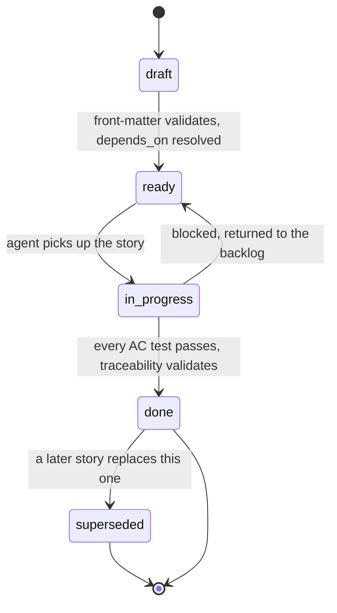

# Implementation Story Format

**Status:** Draft
**Owner:** architect
**Audience:** architect, coder, tester
**Last Updated:** 2026-06-06
**Cross-references:** `14_Process_and_Traceability/01_MODULE_INVENTORY.md`, `14_Process_and_Traceability/03_TRACEABILITY.md`, `14_Process_and_Traceability/04_ADR_FORMAT.md`, `14_Process_and_Traceability/05_ACCEPTANCE_CRITERIA_PATTERNS.md`, `14_Process_and_Traceability/06_EDGE_CASE_TO_TEST_MAPPING.md`, `08_Cross_Cutting/08-I_edge_cases.md`

This document defines the implementation story: the unit of work the implementation agent executes. A story names a slice of the specification, the modules it touches, the acceptance criteria that prove it is done, and the prerequisite stories. Every story carries a machine-readable YAML front-matter block so that `03_TRACEABILITY.md`'s tooling can build the spec-clause-to-story-to-test-to-module record automatically and fail the build on any broken link. This document fixes the front-matter schema, the story body template, the identifier convention, and the story lifecycle.

---

## Table of Contents

1. [Purpose and Scope](#1-purpose-and-scope)
2. [What a Story Is](#2-what-a-story-is)
3. [Story Identifier Convention](#3-story-identifier-convention)
4. [Where Stories Live](#4-where-stories-live)
5. [Front-Matter Schema](#5-front-matter-schema)
6. [Story Body Template](#6-story-body-template)
7. [Story Sizing Rules](#7-story-sizing-rules)
8. [Story Lifecycle](#8-story-lifecycle)
9. [Worked Example](#9-worked-example)
10. [Authoring Checklist](#10-authoring-checklist)

---

## 1. Purpose and Scope

The application is built by an implementation agent working story by story against this specification. A story is the contract for one increment of work: it tells the agent exactly which spec clauses to read, which modules to create or change, and which acceptance criteria the result must satisfy. Because the agent is machine-driven, the story must be precise and machine-checkable — no ambiguity, no implied scope.

This document defines the *form* of a story. It does not enumerate the stories themselves; the story backlog is generated from the specification during planning and validated against this schema.

## 2. What a Story Is

A story is a single Markdown file. It has two parts:

- A **YAML front-matter block** delimited by `---` lines. This is the machine-readable contract: the identifier, the spec clauses, the modules, the acceptance-criterion identifiers, and the dependencies. `03_TRACEABILITY.md`'s `trace.py` parses only this block.
- A **Markdown body**. This is the human-readable and agent-readable narrative: the goal, the scope boundary, the design constraints, the acceptance criteria written out in full, and the test plan.

A story is *complete* when every acceptance criterion in it has a passing test, every test names the story in its docstring, and the traceability record validates with no orphans. A story is never partially landed: it is either fully implemented and verified or not started.

## 3. Story Identifier Convention

Every story has a stable identifier of the form `STORY-NNN`, where `NNN` is a zero-padded three-digit number assigned in creation order. An identifier is permanent: once `STORY-042` is assigned it is never reused, never renumbered, and never deleted, even if the story is later superseded. A superseded story keeps its identifier and points to its replacement.

Acceptance criteria carry a story-scoped identifier of the form `STORY-NNN-AC-N`, where `N` is the criterion's index within the story starting at 1. Acceptance-criterion identifiers are likewise permanent.

## 4. Where Stories Live

Stories live in `docs/stories/` in the repository, one file per story, named `story-NNN-short-slug.md` (for example `docs/stories/story-042-resume-stopped-run.md`). The directory is flat — there are no per-feature subdirectories — because the `modules:` front-matter, not the file location, records which feature a story belongs to.

`docs/stories/` is a sibling of `docs/adr/` (`04_ADR_FORMAT.md`) under the repository's `docs/` tree shown in `16_Engineering_Standards/01_PROJECT_STRUCTURE.md` Section 2.

## 5. Front-Matter Schema

The front-matter is a YAML mapping. Every field below is required unless marked optional. `trace.py` rejects a story whose front-matter omits a required field, adds an unknown field, or fails a value rule.

```yaml
---
id: STORY-042                       # string, pattern STORY-\d{3}, unique
title: Resume a stopped run from its persisted result rows
status: draft                       # one of: draft | ready | in-progress | done | superseded
spec_clauses:                       # >=1 entry; each a resolvable spec reference
  - 03_Resume_Benchmark_Widget/description.md#resume-action
  - 08_Cross_Cutting/08-I_edge_cases.md#EC-RUN-5
  - 11_Services_and_Algorithms/04_EVALUATION_PIPELINE.md#resume-selection
modules:                            # >=1 entry; each a path from 01_MODULE_INVENTORY.md
  - ui/resume_benchmark/
  - backend/benchmark_pipeline/
  - backend/persistence/
acceptance_criteria:                # >=1 entry; identifiers defined in the body
  - STORY-042-AC-1
  - STORY-042-AC-2
  - STORY-042-AC-3
edge_cases:                         # optional; EC ids from 08-I this story must satisfy
  - EC-RUN-5
  - EC-PERSIST-4
depends_on:                         # >=0 entries; story ids that must be done first
  - STORY-018
  - STORY-031
adrs:                               # optional; ADR ids whose decision this story applies
  - ADR-0007
owner: coder                        # the agent role responsible: arch | coder | tester
estimate: M                         # one of: S | M | L  (see Section 7)
---
```

Field rules:

| Field | Type | Rule |
|---|---|---|
| `id` | string | Matches `STORY-\d{3}`. Unique across `docs/stories/`. |
| `title` | string | One imperative sentence. No trailing period. |
| `status` | enum | One of `draft`, `ready`, `in-progress`, `done`, `superseded`. See Section 8. |
| `spec_clauses` | list of string | At least one. Each entry is `<spec-file-path>#<anchor>` and must resolve to a real file and heading inside `App_Specification_Ollama_Bench_Final/`. |
| `modules` | list of string | At least one. Each entry is a module path that exists in `01_MODULE_INVENTORY.md`. |
| `acceptance_criteria` | list of string | At least one. Each matches `STORY-NNN-AC-\d+` with the story's own `NNN`, and each is defined in the body's Acceptance Criteria section. |
| `edge_cases` | list of string | Optional. Each matches an `EC-[A-Z]+-\d+[a-f]?` identifier (e.g. `EC-RUN-5`, `EC-PROV-4a`) defined in `08_Cross_Cutting/08-I_edge_cases.md` or a scoped catalog (`EC-IMP-*`, `EC-EXP-*`, `EC-FL-*`, `EC-RD-*`, `EC-M-*`). |
| `depends_on` | list of string | Zero or more story ids. No cycles; `trace.py` checks the dependency graph is acyclic. |
| `adrs` | list of string | Optional. Each matches an accepted ADR id in `docs/adr/`. |
| `owner` | enum | One of `arch`, `coder`, `tester`. |
| `estimate` | enum | One of `S`, `M`, `L`. See Section 7. |

## 6. Story Body Template

The body follows a fixed section order so that the implementation agent reads it the same way every time.

```markdown
# STORY-NNN — <title>

## Goal
[One paragraph: what capability this story delivers, in user-visible or
behavioural terms. No implementation detail.]

## In scope
- [Bullet list: exactly what this story creates or changes.]

## Out of scope
- [Bullet list: adjacent work this story deliberately does not do, with the
  story id that owns it where one exists.]

## Spec inputs
[The clauses from `spec_clauses:`, each with one line stating what the agent
must take from it. The agent reads every listed clause before writing code.]

## Design constraints
- [Binding rules from the Technical Decisions and Engineering Standards that
  apply: the threading rule of the touched modules, the public-surface limit,
  the no-Qt rule for a backend module, the module-split threshold.]

## Acceptance criteria
[Each criterion from `acceptance_criteria:` written out in full, using the
pattern chosen per `05_ACCEPTANCE_CRITERIA_PATTERNS.md`. Each is identified
`STORY-NNN-AC-N` and is independently verifiable.]

### STORY-NNN-AC-1
[criterion text]

### STORY-NNN-AC-2
[criterion text]

## Test plan
[For each acceptance criterion, the test that proves it: the test tier
(unit / integration / property / architecture), the test file path, and the
test function name. Edge cases listed in `edge_cases:` map to a test here per
`06_EDGE_CASE_TO_TEST_MAPPING.md`.]

## Definition of done
- [ ] Every acceptance criterion has a passing test that names this story id.
- [ ] Every edge case in `edge_cases:` has a passing test.
- [ ] `mypy --strict`, `ruff`, and `import-linter` pass for the touched modules.
- [ ] The traceability record validates with no orphan clause and no orphan test.
- [ ] The module inventory is unchanged, or the change is reflected in
      `14_Process_and_Traceability/01_MODULE_INVENTORY.md`.
```

## 7. Story Sizing Rules

The `estimate` field bounds story scope so the implementation agent works in verifiable increments:

| Estimate | Bound |
|---|---|
| `S` | Touches one module; one to three acceptance criteria; no new public API. |
| `M` | Touches up to three modules; up to six acceptance criteria; may add one public API symbol. |
| `L` | Touches up to five modules; up to ten acceptance criteria; may add a sub-feature package. |

A story that would exceed the `L` bound is split into a parent story and dependent child stories linked through `depends_on`. A story never crosses the backend/UI boundary in a way that leaves either side unverifiable on its own: a UI story depends on the backend story that supplies its Protocols rather than implementing both at once.

## 8. Story Lifecycle



| Status | Meaning | Entry condition |
|---|---|---|
| `draft` | Being authored. | Created in `docs/stories/`. |
| `ready` | Authored and unblocked. | Front-matter validates; every `depends_on` story is `done`; every `spec_clauses` entry resolves. |
| `in-progress` | The agent is implementing it. | Picked up from the `ready` set. |
| `done` | Implemented and verified. | Every acceptance-criterion test passes; the traceability record validates with no orphans. |
| `superseded` | Replaced by a later story. | A replacement story exists; this story's body links to it. The file stays in `docs/stories/`. |

A change to an `Accepted` spec clause that a `done` story depends on requires a new story and an ADR (`04_ADR_FORMAT.md`), not an edit to the original story.

## 9. Worked Example

```markdown
---
id: STORY-042
title: Resume a stopped run from its persisted result rows
status: ready
spec_clauses:
  - 03_Resume_Benchmark_Widget/description.md#resume-action
  - 08_Cross_Cutting/08-I_edge_cases.md#EC-RUN-5
  - 11_Services_and_Algorithms/04_EVALUATION_PIPELINE.md#resume-selection
modules:
  - ui/resume_benchmark/
  - backend/benchmark_pipeline/
  - backend/persistence/results/
acceptance_criteria:
  - STORY-042-AC-1
  - STORY-042-AC-2
  - STORY-042-AC-3
edge_cases:
  - EC-RUN-5
  - EC-PERSIST-4
depends_on:
  - STORY-018
  - STORY-031
owner: coder
estimate: M
---

# STORY-042 — Resume a stopped run from its persisted result rows

## Goal
Let the user resume a STOPPED run so the pipeline continues from where it
halted, re-running only the rows that did not reach a terminal status and
the failure rows the user elects to retry.

## In scope
- The Resume action in the Resume Benchmark widget.
- The resume use case in `backend/benchmark_pipeline/` that sets the run
  INCOMPLETE, selects the resumable rows, and hands the run to the pipeline.
- The `list_resumable_results` query in `backend/persistence/`.

## Out of scope
- Resuming a FAILED run — owned by STORY-043.
- The Run Drift Detector warning surface — owned by STORY-044.

## Spec inputs
- `03_Resume_Benchmark_Widget/description.md#resume-action` — the action's
  enablement gate and the confirmation flow.
- `08_Cross_Cutting/08-I_edge_cases.md#EC-RUN-5` — exactly which row statuses
  are re-run, which are reset to PENDING, and which COMPLETED rows are left
  alone.
- `11_Services_and_Algorithms/04_EVALUATION_PIPELINE.md#resume-selection` —
  the pipeline's row-selection algorithm at resume.

## Design constraints
- `backend/benchmark_pipeline/` and `backend/persistence/` are Qt-free; no
  PySide6 import.
- The resume use case reuses the run's frozen settings snapshot.
- A COMPLETED row carrying a FAIL verdict is never re-run automatically.

## Acceptance criteria

### STORY-042-AC-1
Given a STOPPED run, when the user resumes it, the run's persisted status is
set to INCOMPLETE and the pipeline starts.

### STORY-042-AC-2
The pipeline re-runs every row in a non-terminal status and every retryable
failure row the user selected, resets any RUNNING_INFERENCE row to PENDING,
and leaves every COMPLETED row untouched — including COMPLETED rows with a
FAIL verdict.

### STORY-042-AC-3
The resumed run reuses the original run's settings snapshot, not the current
settings.

## Test plan
- STORY-042-AC-1 — integration, `tests/integration/test_resume_flow.py`,
  `test_resume_stopped_run_sets_incomplete_and_starts`.
- STORY-042-AC-2 — unit (table-driven over every row status), colocated
  `src/ollama_llm_bench/backend/benchmark_pipeline/tests/test_resume_use_case.py`,
  `test_resume_selects_only_resumable_rows`.
- STORY-042-AC-3 — unit, same file, `test_resume_reuses_settings_snapshot`.
- EC-RUN-5, EC-PERSIST-4 — covered by STORY-042-AC-2's table; see
  `06_EDGE_CASE_TO_TEST_MAPPING.md`.

## Definition of done
- [ ] Every acceptance criterion has a passing test naming STORY-042.
- [ ] EC-RUN-5 and EC-PERSIST-4 have passing tests.
- [ ] `mypy --strict`, `ruff`, `import-linter` pass for the touched modules.
- [ ] The traceability record validates with no orphans.
- [ ] The module inventory is unchanged.
```

## 10. Authoring Checklist

Before a story moves from `draft` to `ready`:

- [ ] The front-matter has every required field and no unknown field.
- [ ] Every `spec_clauses` entry resolves to a real file and heading inside `App_Specification_Ollama_Bench_Final/`.
- [ ] Every `modules` entry is a module path listed in `01_MODULE_INVENTORY.md`.
- [ ] Every acceptance-criterion identifier in the front-matter is defined in the body.
- [ ] Every `depends_on` story exists and the dependency graph stays acyclic.
- [ ] The story fits within its `estimate` bound (Section 7).
- [ ] Each acceptance criterion is independently verifiable and names its test in the Test plan.
- [ ] Each `edge_cases` entry has a row in `06_EDGE_CASE_TO_TEST_MAPPING.md` and a test in the plan.
