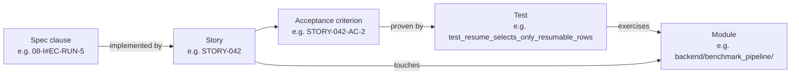

# Traceability

**Status:** Draft
**Owner:** architect
**Audience:** architect, coder, tester
**Last Updated:** 2026-06-06
**Cross-references:** `14_Process_and_Traceability/01_MODULE_INVENTORY.md`, `14_Process_and_Traceability/02_STORY_FORMAT.md`, `14_Process_and_Traceability/05_ACCEPTANCE_CRITERIA_PATTERNS.md`, `14_Process_and_Traceability/06_EDGE_CASE_TO_TEST_MAPPING.md`, `16_Engineering_Standards/07_TESTING_STANDARD.md`, `08_Cross_Cutting/08-I_edge_cases.md`

This document defines the traceability record: the machine-checkable chain linking a specification clause to the story that implements it, to the test that proves it, to the module that contains it. It fixes the record format (`traceability.yaml`), how the record is generated from the stories and the test suite, how it is validated so the build fails on any broken or orphaned link, and how it is queried. Traceability is what lets an implementation agent and a human reviewer confirm, mechanically, that every clause of the specification is built and every line of built code traces back to a clause.

---

## Table of Contents

1. [Purpose and Scope](#1-purpose-and-scope)
2. [The Traceability Chain](#2-the-traceability-chain)
3. [The Traceability Record Format](#3-the-traceability-record-format)
4. [Generating the Record](#4-generating-the-record)
5. [Validating the Record](#5-validating-the-record)
6. [Querying the Record](#6-querying-the-record)
7. [Coverage Rules](#7-coverage-rules)
8. [Where the Tooling Runs](#8-where-the-tooling-runs)

---

## 1. Purpose and Scope

The specification is the contract; the stories are the work units; the tests are the proof; the modules are the result. Traceability is the explicit, queryable link between those four things. Without it, "is the specification fully implemented?" is unanswerable and "why does this code exist?" has no documented answer.

The traceability record is a single generated file, `traceability.yaml`. It is never edited by hand: it is regenerated from the story files and the test suite, and validated in the pull-request gate. This document specifies its format and the rules its generator and validator enforce.

## 2. The Traceability Chain

The chain has four node kinds and three link kinds:



| Node | Source of truth | Identifier form |
|---|---|---|
| Spec clause | A heading anchor in a file under `App_Specification_Ollama_Bench_Final/` | `<spec-file-path>#<anchor>` |
| Story | A file in `docs/stories/` | `STORY-NNN` |
| Acceptance criterion | A heading in a story body | `STORY-NNN-AC-N` |
| Test | A test function in the suite | the fully-qualified test node id |
| Module | A package path in `01_MODULE_INVENTORY.md` | the module path |

The three links are: a story *implements* one or more spec clauses (from the story's `spec_clauses:` front-matter); a test *proves* exactly one acceptance criterion (declared in the test's docstring); a story *touches* one or more modules (from the story's `modules:` front-matter).

## 3. The Traceability Record Format

`traceability.yaml` lives at the repository root next to `pyproject.toml`. It is a YAML mapping with a fixed top-level shape:

```yaml
# traceability.yaml — GENERATED. Do not edit by hand. Regenerate with `just trace`.
generated_at: 2026-05-22T14:30:00Z
generator_version: 1

stories:
  STORY-042:
    title: Resume a stopped run from its persisted result rows
    status: done
    spec_clauses:
      - 03_Resume_Benchmark_Widget/description.md#resume-action
      - 08_Cross_Cutting/08-I_edge_cases.md#EC-RUN-5
      - 11_Services_and_Algorithms/04_EVALUATION_PIPELINE.md#resume-selection
    modules:
      - ui/resume_benchmark/
      - backend/benchmark_pipeline/
      - backend/persistence/
    edge_cases:
      - EC-RUN-5
      - EC-PERSIST-4
    acceptance_criteria:
      STORY-042-AC-1:
        tests:
          - tests/integration/test_resume_flow.py::test_resume_stopped_run_sets_incomplete_and_starts
      STORY-042-AC-2:
        tests:
          - src/ollama_llm_bench/backend/benchmark_pipeline/tests/test_resume_use_case.py::test_resume_selects_only_resumable_rows
      STORY-042-AC-3:
        tests:
          - src/ollama_llm_bench/backend/benchmark_pipeline/tests/test_resume_use_case.py::test_resume_reuses_settings_snapshot

clauses:
  08_Cross_Cutting/08-I_edge_cases.md#EC-RUN-5:
    stories: [STORY-042]
  03_Resume_Benchmark_Widget/description.md#resume-action:
    stories: [STORY-042]

edge_cases:
  EC-RUN-5:
    stories: [STORY-042]
    tests:
      - src/ollama_llm_bench/backend/benchmark_pipeline/tests/test_resume_use_case.py::test_resume_selects_only_resumable_rows
  EC-PERSIST-4:
    stories: [STORY-042]
    tests:
      - src/ollama_llm_bench/backend/benchmark_pipeline/tests/test_resume_use_case.py::test_resume_selects_only_resumable_rows

modules:
  backend/benchmark_pipeline/:
    stories: [STORY-042]
  backend/persistence/:
    stories: [STORY-042]
  ui/resume_benchmark/:
    stories: [STORY-042]
```

The file has four index maps so it can be queried from any direction:

- `stories` — keyed by story id; the primary record, carrying each story's clauses, modules, edge cases, and the per-acceptance-criterion test list.
- `clauses` — keyed by spec-clause id; the reverse index from a clause to the stories that implement it.
- `edge_cases` — keyed by edge-case id; from an edge case to its stories and tests.
- `modules` — keyed by module path; from a module to the stories that touch it.

The `clauses`, `edge_cases`, and `modules` maps are derived entirely from `stories`; they exist only to make reverse queries an O(1) lookup rather than a scan.

## 4. Generating the Record

The record is produced by `scripts/trace.py`, invoked through `just trace`. The generator runs in three passes:

1. **Parse stories.** Read every file in `docs/stories/`. From each story's YAML front-matter take `id`, `title`, `status`, `spec_clauses`, `modules`, `edge_cases`, and `acceptance_criteria`. Reject a story whose front-matter fails the schema in `02_STORY_FORMAT.md` Section 5.
2. **Collect tests.** Run `pytest --collect-only` and read each test's docstring. A test that proves an acceptance criterion declares it on the docstring's first line in the fixed form `Proves: STORY-NNN-AC-N`. The generator maps each declared criterion id to that test's node id.
3. **Assemble and write.** Join the story records with the collected test map, build the three reverse indexes, stamp `generated_at` and `generator_version`, and write `traceability.yaml`.

The generator is deterministic: the same stories and the same test suite produce a byte-identical file (test node ids are sorted, maps are key-sorted). The committed `traceability.yaml` is therefore a reviewable artifact, and a stale one is caught by the validation step.

The test-side declaration:

```python
def test_resume_selects_only_resumable_rows() -> None:
    """Proves: STORY-042-AC-2

    Re-runs only non-terminal rows and selected retryable failures; leaves
    every COMPLETED row untouched.
    """
    ...
```

## 5. Validating the Record

`scripts/validate_traceability.py`, invoked through `just trace-check`, runs in the pull-request gate. It fails the build on any of these conditions:

| Check | Failure condition |
|---|---|
| Clause resolves | A `spec_clauses` entry does not point to a real file and heading anchor under `App_Specification_Ollama_Bench_Final/`. |
| Module exists | A `modules` entry is not a module path listed in `01_MODULE_INVENTORY.md`. |
| No orphan clause | A spec clause marked traceable (see Section 7) is named by no story. |
| No orphan story | A story names no spec clause, or names a `done` status with an acceptance criterion that has no test. |
| Acceptance criterion proven | A `done` story has an acceptance criterion with an empty `tests` list. |
| No orphan test | A test whose docstring declares `Proves: STORY-NNN-AC-N` names a criterion that no story defines. |
| Edge-case covered | The validator collects every `EC-` identifier defined across **all** catalogs — `08_Cross_Cutting/08-I_edge_cases.md` plus the scoped domain catalogs (`EC-IMP-*` import, `EC-EXP-*` export, `EC-FL-*` file layout, `EC-RD-*` redaction, `EC-M-*` lifecycle, `EC-TE-*` Task Editor) — and fails if any of them appears in no story's `edge_cases` and in no test, or if `06_EDGE_CASE_TO_TEST_MAPPING.md` cites an `EC-` id defined in no catalog (a dangling row). The catalogs are the source of truth, not the mapping list (D-R-08; see `06_EDGE_CASE_TO_TEST_MAPPING.md` §14.1). |
| Acyclic dependencies | The `depends_on` graph across all stories contains a cycle. |
| Record fresh | Re-running the generator produces a file that differs from the committed `traceability.yaml`. |

The "record fresh" check makes a hand-edited or stale record a build failure: the record is only valid if it is exactly what the generator would produce from the current stories and tests.

## 6. Querying the Record

Because the record carries four index maps, every traceability question is a direct lookup. `scripts/trace.py query` exposes the lookups; the same questions can be answered by reading `traceability.yaml` directly.

| Question | Lookup |
|---|---|
| Which stories implement spec clause X? | `clauses[X].stories` |
| Which tests prove story S is done? | for each criterion in `stories[S].acceptance_criteria`, its `tests` list |
| Which stories touch module M? | `modules[M].stories` |
| Is edge case `EC-RUN-5` covered, and by what? | `edge_cases[EC-RUN-5].tests` (ids follow `EC-<SCOPE>-<n>[a-f]`) |
| Which spec clauses are not yet implemented? | every traceable clause absent from `clauses` |
| Which modules have no story yet? | every module in `01_MODULE_INVENTORY.md` absent from `modules` |

## 7. Coverage Rules

Not every line of the specification is a traceable clause. A clause is **traceable** — and therefore must be named by a story — when it states a behaviour, a constraint, a contract, or an edge case the implementation must satisfy. The following are **not** traceable and are excluded from the orphan-clause check:

- Front-matter, tables of contents, and purpose paragraphs.
- Reading-order and navigation guidance.
- Rationale prose that states *why* a decision was made without adding a *what*.
- The `15_Risks_and_Open_Questions/` folder, which holds speculative content, not contracts.

A traceable clause carries a stable heading anchor so a story can cite it. Every edge case in `08_Cross_Cutting/08-I_edge_cases.md` is traceable by definition: each `EC-` identifier must appear in some story's `edge_cases` and have a test, per `06_EDGE_CASE_TO_TEST_MAPPING.md`.

The coverage target is total: when the application is complete, every traceable clause has at least one `done` story and every `done` story's acceptance criteria have passing tests. Partial coverage during construction is expected and is reported, not failed — only orphan tests, broken references, and a stale record fail the gate before the application is complete.

## 8. Where the Tooling Runs

| Tool | Invocation | Runs in |
|---|---|---|
| `scripts/trace.py` (generator) | `just trace` | Locally after a story or test change; in the pull-request gate to produce the fresh record for the freshness check. |
| `scripts/validate_traceability.py` | `just trace-check` | The pull-request gate, after `pytest --collect-only` and `import-linter` have run. |

Both scripts live in `scripts/` (`16_Engineering_Standards/01_PROJECT_STRUCTURE.md` Section 2) and have a `justfile` target so that a local run and a CI run are identical. `traceability.yaml` is committed to the repository; the freshness check guarantees the committed copy always matches the current stories and tests.
