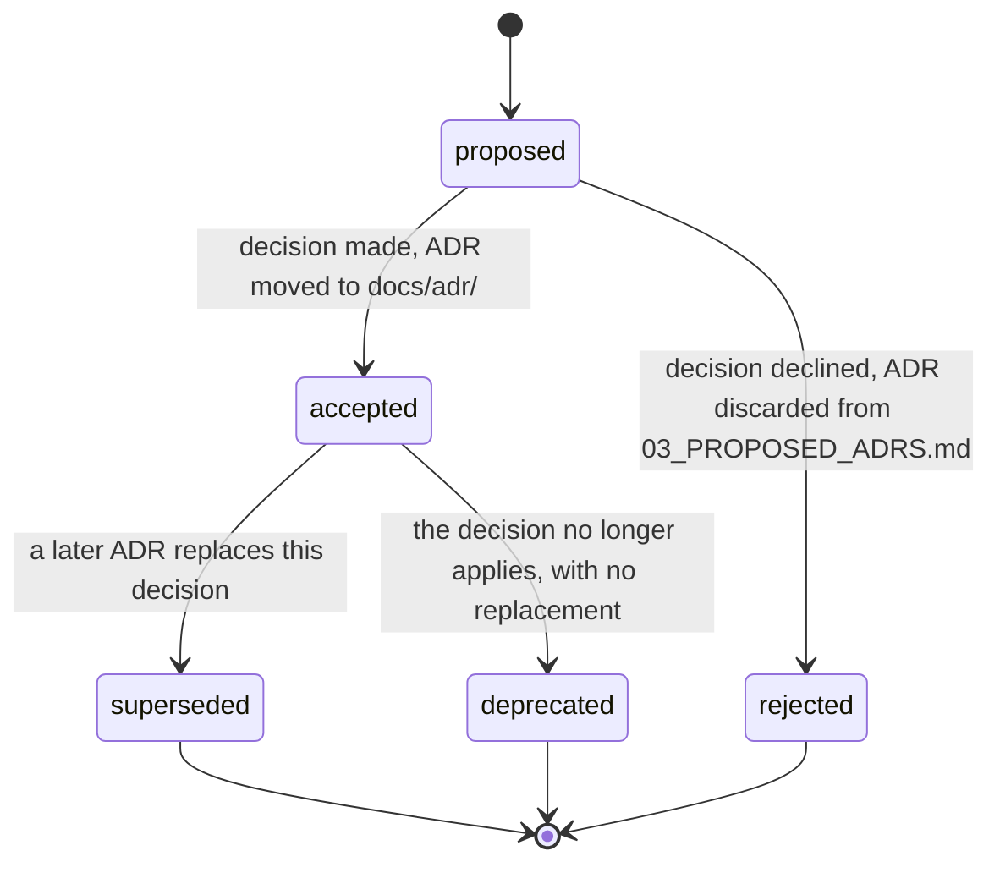

# Architecture Decision Record Format

**Status:** Draft
**Owner:** architect
**Audience:** architect, human
**Last Updated:** 2026-05-22
**Cross-references:** `14_Process_and_Traceability/02_STORY_FORMAT.md`, `14_Process_and_Traceability/03_TRACEABILITY.md`, `15_Risks_and_Open_Questions/03_PROPOSED_ADRS.md`, `16_Engineering_Standards/01_PROJECT_STRUCTURE.md`

This document defines the Architecture Decision Record (ADR) for Ollama LLM Bench: the MADR-style format every ADR follows, where ADRs live, the identifier convention, the status lifecycle, and the supersession discipline that keeps the decision history intact. An ADR captures one architecturally significant decision — what was decided, what alternatives were weighed, and what consequences follow — so that the reasoning behind the codebase is documented and a later contributor can see why a decision was made before changing it.

---

## Table of Contents

1. [Purpose and Scope](#1-purpose-and-scope)
2. [When to Write an ADR](#2-when-to-write-an-adr)
3. [Where ADRs Live](#3-where-adrs-live)
4. [Identifier Convention](#4-identifier-convention)
5. [The ADR Template](#5-the-adr-template)
6. [Status Lifecycle](#6-status-lifecycle)
7. [Supersession Discipline](#7-supersession-discipline)
8. [Proposed ADRs](#8-proposed-adrs)
9. [The ADR Index](#9-the-adr-index)
10. [Authoring Checklist](#10-authoring-checklist)

---

## 1. Purpose and Scope

An ADR records a decision that shapes the architecture and is costly to reverse. It is short, immutable once accepted, and self-contained. It exists so that the *reasoning* behind a structural choice survives the moment it was made: a contributor who wants to change the choice reads the ADR first, learns what was considered and rejected, and either accepts the existing reasoning or writes a new ADR that supersedes it.

This document fixes the *form* of an ADR. The decisions themselves accumulate in `docs/adr/` over the life of the project. The specification's binding architectural rules are stated in the `08_Cross_Cutting/` and `16_Engineering_Standards/` documents; an ADR records a decision *behind* such a rule, or a decision made during implementation that the specification did not pre-settle.

## 2. When to Write an ADR

Write an ADR when a decision meets all three of these tests:

- **Architecturally significant** — it affects module boundaries, a public contract, the concurrency model, the persistence shape, the dependency direction, or a cross-cutting policy.
- **Costly to reverse** — undoing it later would touch many modules or break a contract other modules rely on.
- **Not pre-settled by the specification** — the specification leaves a genuine choice, or implementation surfaced a choice the specification did not anticipate.

Do **not** write an ADR for a local, easily reversible coding choice; that belongs in a code comment or a story note. Do not duplicate a rule the specification already fixes; cite the spec document instead.

A change to an `Accepted` specification clause that a `done` story depends on requires an ADR — the ADR is the record that the contract changed and why (`02_STORY_FORMAT.md` Section 8).

## 3. Where ADRs Live

Accepted ADRs live in `docs/adr/` in the repository, one Markdown file per ADR, named `NNNN-short-slug.md` (for example `docs/adr/0007-single-writer-runs-store-queue.md`). `docs/adr/` is a sibling of `docs/stories/` under the `docs/` tree shown in `16_Engineering_Standards/01_PROJECT_STRUCTURE.md` Section 2.

ADRs that are still *proposed* — drafted but not yet accepted — are held in the specification at `15_Risks_and_Open_Questions/03_PROPOSED_ADRS.md` until a decision is made (Section 8). An ADR file appears in `docs/adr/` only once its status is `accepted`.

## 4. Identifier Convention

Every ADR has a stable identifier `ADR-NNNN`, where `NNNN` is a zero-padded four-digit number assigned in creation order. The number in the identifier matches the four-digit prefix of the filename. An identifier is permanent: once `ADR-0007` is assigned it is never reused, never renumbered, and never deleted. A superseded ADR keeps its identifier and its file.

A story may cite an ADR in its `adrs:` front-matter (`02_STORY_FORMAT.md` Section 5); the citation uses the `ADR-NNNN` identifier.

## 5. The ADR Template

Every ADR follows the same MADR-style template. The template is short by design — an ADR that needs more than two pages is recording more than one decision and must be split.

```markdown
# ADR-NNNN — <decision title, one imperative phrase>

**Status:** proposed | accepted | superseded by ADR-MMMM | deprecated
**Date:** YYYY-MM-DD
**Deciders:** <roles or names>
**Supersedes:** ADR-MMMM   (omit when none)
**Superseded by:** ADR-MMMM   (added only when this ADR is later superseded)

## Context and problem statement
[Two or three paragraphs. The forces at play: what situation demands a
decision, what constraints bound it, what is at stake. State the problem as
a question.]

## Decision drivers
- [Bullet list: the criteria a good answer must satisfy — a performance
  budget, a module-boundary rule, a maintainability concern.]

## Considered options
- Option A — [one line]
- Option B — [one line]
- Option C — [one line]

## Decision outcome
Chosen option: **Option B**, because [the one or two sentences that tie the
choice to the decision drivers].

### Consequences
- Positive — [what becomes easier or safer]
- Negative — [what becomes harder, what is given up, what risk is accepted]
- Neutral — [a follow-on that is neither good nor bad but must be noted]

## Pros and cons of the options

### Option A — [name]
- Good — [point]
- Bad — [point]

### Option B — [name]
- Good — [point]
- Bad — [point]

### Option C — [name]
- Good — [point]
- Bad — [point]

## Links
- Related ADRs: ADR-MMMM
- Spec clauses: [spec files this decision implements or constrains]
- Stories: [STORY-NNN that apply this decision]
```

The `Status`, `Date`, and `Deciders` lines are mandatory. `Supersedes` is present only when this ADR replaces an earlier one. `Superseded by` is absent when the ADR is written and is added later, in place, when a replacement is accepted (Section 7).

## 6. Status Lifecycle



| Status | Meaning |
|---|---|
| `proposed` | Drafted, awaiting acceptance. Held in `15_Risks_and_Open_Questions/03_PROPOSED_ADRS.md`. |
| `accepted` | The decision is in force. The ADR file is in `docs/adr/`. The ADR text is now immutable except for the addition of a `Superseded by` line. |
| `superseded by ADR-MMMM` | A later ADR replaces this decision. The file stays in `docs/adr/` for history. |
| `deprecated` | The decision no longer applies and has no replacement — for example the feature it governed was removed. The file stays in `docs/adr/`. |
| `rejected` | A `proposed` ADR whose decision was declined. It is removed from `03_PROPOSED_ADRS.md`; no file is created in `docs/adr/`. |

An `accepted` ADR is immutable. A new insight does not edit the old ADR's text; it produces a new ADR that supersedes it.

## 7. Supersession Discipline

When a later decision replaces an earlier one, the chain stays explicit and the history stays in the repository:

1. Write the new ADR with the next free `ADR-NNNN` identifier. Its `Supersedes:` line names the old ADR.
2. In the old ADR, change `Status:` to `superseded by ADR-NNNN` and add a `Superseded by: ADR-NNNN` line. This is the only edit ever made to an `accepted` ADR's body.
3. Leave the old ADR file in `docs/adr/`. It is never deleted — the decision history is part of the architecture record.
4. Update the ADR index (Section 9) so the chain is visible at a glance.

Supersession forms a chain, not a tree: each ADR is superseded by at most one ADR, and supersedes at most one ADR. A decision that splits into two later decisions is recorded as the old ADR being `deprecated` and two new independent ADRs being written.

## 8. Proposed ADRs

`15_Risks_and_Open_Questions/03_PROPOSED_ADRS.md` is the staging area for ADRs awaiting acceptance. Each entry in that document uses the full template from Section 5 with `Status: proposed`. When a proposed ADR is decided:

- **Accepted** — it is moved into its own file under `docs/adr/`, its status becomes `accepted`, and it is removed from `03_PROPOSED_ADRS.md` and added to the index.
- **Rejected** — its status becomes `rejected`, a one-line rejection reason is recorded, and it is removed from `03_PROPOSED_ADRS.md`. No file is created in `docs/adr/`.

A proposed ADR is never cited by a story's `adrs:` front-matter; only `accepted` ADRs may be cited (`02_STORY_FORMAT.md` Section 5).

## 9. The ADR Index

`docs/adr/README.md` is the index of all ADRs. It is a single table, maintained whenever an ADR is accepted or its status changes:

```markdown
| ADR | Title | Status | Supersedes | Superseded by |
|---|---|---|---|---|
| ADR-0001 | Adopt the hexagonal feature-first module layout | accepted | — | — |
| ADR-0007 | Serialise RunsStore writes through a single-writer queue | accepted | — | ADR-0012 |
| ADR-0012 | Replace the single-writer queue with a WAL write lock | accepted | ADR-0007 | — |
```

The index lets a reviewer see every decision, its current status, and its supersession chain without opening each file.

## 10. Authoring Checklist

Before a `proposed` ADR is accepted:

- [ ] It records exactly one decision; a multi-decision draft is split.
- [ ] It follows the Section 5 template, with `Status`, `Date`, and `Deciders` present.
- [ ] The problem is stated as a question, and at least two real options are weighed.
- [ ] The decision outcome ties the choice to the decision drivers.
- [ ] Consequences list at least one negative or accepted risk — an ADR with only upside is under-examined.
- [ ] `Links` cites the spec clauses the decision implements or constrains.
- [ ] If it supersedes an earlier ADR, the supersession steps in Section 7 are followed and the index is updated.
- [ ] The identifier is the next free `ADR-NNNN` and matches the filename prefix.
