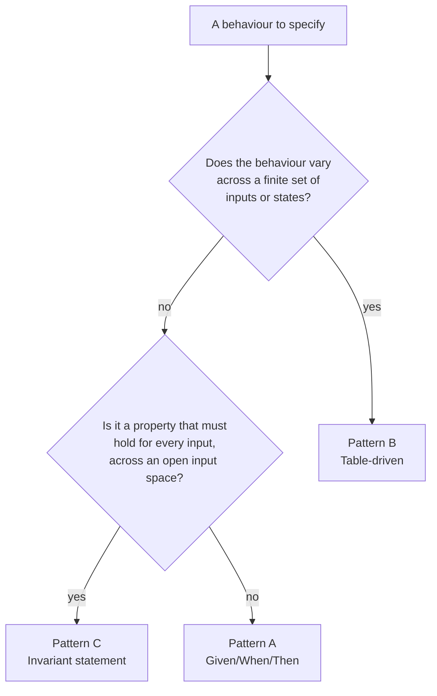

# Acceptance Criteria Patterns

**Status:** Draft
**Owner:** architect
**Audience:** architect, coder, tester
**Last Updated:** 2026-05-22
**Cross-references:** `14_Process_and_Traceability/02_STORY_FORMAT.md`, `14_Process_and_Traceability/03_TRACEABILITY.md`, `14_Process_and_Traceability/06_EDGE_CASE_TO_TEST_MAPPING.md`, `16_Engineering_Standards/07_TESTING_STANDARD.md`, `08_Cross_Cutting/08-I_edge_cases.md`

This document defines the three patterns an acceptance criterion may take — table-driven, Given/When/Then, and invariant — and the rule for choosing among them. An acceptance criterion in a story (`02_STORY_FORMAT.md`) is the precise, verifiable statement that a slice of behaviour is correct. Because the implementation agent derives a test directly from each criterion, the criterion must be written so that exactly one test can prove it pass or fail. Choosing the right pattern is what makes a criterion mechanically checkable rather than merely descriptive.

---

## Table of Contents

1. [Purpose and Scope](#1-purpose-and-scope)
2. [Properties of a Good Acceptance Criterion](#2-properties-of-a-good-acceptance-criterion)
3. [Pattern Selection Rule](#3-pattern-selection-rule)
4. [Pattern A — Given/When/Then](#4-pattern-a--givenwhenthen)
5. [Pattern B — Table-Driven](#5-pattern-b--table-driven)
6. [Pattern C — Invariant Statement](#6-pattern-c--invariant-statement)
7. [From Criterion to Test](#7-from-criterion-to-test)
8. [Anti-Patterns](#8-anti-patterns)

---

## 1. Purpose and Scope

A story's `acceptance_criteria:` front-matter lists criterion identifiers; the story body writes each one out in full (`02_STORY_FORMAT.md` Section 6). The test plan then names the test that proves each criterion, and `03_TRACEABILITY.md` records the criterion-to-test link. The criterion is the hinge of that chain, so its wording matters: a vague criterion produces a vague test that passes when the behaviour is wrong.

This document gives the three permitted patterns and a decision rule for picking one. Every acceptance criterion in every story uses exactly one of these three patterns.

## 2. Properties of a Good Acceptance Criterion

Regardless of pattern, an acceptance criterion is:

- **Verifiable** — a test can decide pass or fail with no human judgement.
- **Single-concept** — it asserts one logical thing. Two concerns are two criteria, mirroring the testing rule that a test asserts one logical concept (`16_Engineering_Standards/07_TESTING_STANDARD.md` Section 4).
- **Behavioural, not structural** — it states what the application does, not how the code is shaped. Structural rules are proven by architecture tests, not acceptance criteria.
- **Stable** — its identifier `STORY-NNN-AC-N` is permanent once assigned.
- **Self-contained** — it names the precondition it needs; it does not depend on a sibling criterion having run first.

## 3. Pattern Selection Rule



In words:

- A behaviour that **varies across a finite, enumerable set** of inputs or states — a status, a mode, an enum, a small matrix of conditions — uses **Pattern B, table-driven**. One criterion, one table, one parametrized test.
- A behaviour that is a **universal property** — something that must hold for *every* input across an open or large input space, such as a round-trip, a bound, or an ordering — uses **Pattern C, invariant statement**. The test is a Hypothesis property test.
- A behaviour that is a **single concrete flow** — one trigger, one expected outcome, with no enumerable variation and no universal claim — uses **Pattern A, Given/When/Then**.

When two patterns seem to fit, prefer the more specific one: prefer the table over a set of separate Given/When/Then criteria; prefer the invariant over a table that is really sampling an open space.

## 4. Pattern A — Given/When/Then

Use Given/When/Then for a single concrete behaviour: one precondition, one action, one observable outcome. It is the default pattern and the right choice for most UI-action and use-case criteria.

Form:

```markdown
### STORY-NNN-AC-N
Given <the precondition / starting state>,
when <the single action or trigger>,
then <the single observable, asserted outcome>.
```

Example:

```markdown
### STORY-017-AC-1
Given a run is in the in-memory RUNNING state,
when the user clicks Start,
then Start is a no-op and no second pipeline or run record is created.
```

This criterion maps to one unit or integration test that arranges the precondition, performs the action, and asserts the outcome — the Arrange-Act-Assert shape of `16_Engineering_Standards/07_TESTING_STANDARD.md` Section 4. Each Given/When/Then criterion has exactly one `when` and one `then`; a criterion with two `then` clauses is split into two criteria.

## 5. Pattern B — Table-Driven

Use a table when the behaviour varies across a finite, enumerable set of cases and the variation is the point — a per-status outcome, a per-mode visibility rule, a per-enum default, a small condition matrix. One table-driven criterion replaces a scatter of near-identical Given/When/Then criteria and maps to one `@pytest.mark.parametrize` test.

Form: a single criterion whose body is a table. Each row is one case; the columns are the inputs and the expected output.

Example:

```markdown
### STORY-042-AC-2
On resume, each persisted result row is treated per its status:

| Row status before resume | Action on resume |
|---|---|
| PENDING | re-run |
| RUNNING_INFERENCE | reset to PENDING, then re-run |
| AWAITING_KEYWORD_CHECK | re-run |
| AWAITING_COSINE_CHECK | re-run |
| AWAITING_JUDGE_CHECK | re-run |
| FAILED_INFERENCE | re-run only if the user selected it |
| FAILED_PROVIDER | re-run only if the user selected it |
| FAILED_TIMEOUT | re-run only if the user selected it |
| ERRORED | re-run only if the user selected it |
| COMPLETED (any verdict) | left untouched |
```

The proving test is one parametrized function; each table row is one parameter set. The test contains no loop over rows — the parametrize decorator carries the table (`16_Engineering_Standards/07_TESTING_STANDARD.md` Section 4, Section 13). A table-driven criterion is the natural home for an edge case whose specification is itself a table, and several edge cases in `08_Cross_Cutting/08-I_edge_cases.md` map to this pattern in `06_EDGE_CASE_TO_TEST_MAPPING.md`.

The table must be **total** over its case space: every member of the enumerated set has a row. A status enum with ten members has ten rows; a `(mode, section)` matrix has a row for every cell. Totality is what lets the criterion claim the behaviour is fully specified.

## 6. Pattern C — Invariant Statement

Use an invariant when the behaviour is a property that must hold for *every* input across an open or large input space — a round-trip identity, a numeric bound, a monotonic ordering, a conservation rule. An invariant is not checked by enumerating cases; it is checked by a Hypothesis property test that generates many inputs and asserts the property holds for all of them (`16_Engineering_Standards/07_TESTING_STANDARD.md` Section 10).

Form: a single universally-quantified statement.

```markdown
### STORY-NNN-AC-N
For every <input drawn from its full domain>, <the property that must hold>.
```

Examples:

```markdown
### STORY-055-AC-1
For every valid task file, parsing it and re-serialising it with the YAML
formatter yields a file that parses to the same task list — the round trip
is an identity on task content.

### STORY-061-AC-2
For every sequence of inference outcomes, the adaptive timeout the service
returns is always within the configured minimum and maximum timeout bounds,
inclusive.

### STORY-073-AC-1
For every set of result rows, the per-target counts in the Summary tab sum
to the total result count for that target — no row is counted twice and
none is dropped.
```

The proving test is a Hypothesis test whose strategy generates the input domain; for a stateful invariant — a store accumulating and removing items — it is a `RuleBasedStateMachine` with `@invariant` methods. An invariant criterion names the input domain precisely so the test's strategy can be derived from it.

## 7. From Criterion to Test

Each pattern maps to one test tier and shape:

| Pattern | Test shape | Typical tier |
|---|---|---|
| A — Given/When/Then | One Arrange-Act-Assert test function. | Unit, or integration when the flow crosses a real resource boundary. |
| B — Table-driven | One `@pytest.mark.parametrize` test; one row per case. | Unit, occasionally integration. |
| C — Invariant | One Hypothesis property test, or a `RuleBasedStateMachine` for a stateful invariant. | Unit (`property`-marked). |

The story's Test plan (`02_STORY_FORMAT.md` Section 6) names the test file and function for each criterion, and the test's docstring declares `Proves: STORY-NNN-AC-N` so `03_TRACEABILITY.md`'s generator can build the criterion-to-test link. A criterion that cannot be expressed in any of the three patterns is a sign the behaviour is under-specified — the fix is to sharpen the behaviour in the spec, not to invent a fourth pattern.

## 8. Anti-Patterns

| Anti-pattern | Why it is wrong | Correct approach |
|---|---|---|
| A criterion with two `then` clauses | Two concerns hidden as one; a test must assert one concept. | Split into two criteria. |
| A Given/When/Then repeated five times with one word changed | The variation is the behaviour; five criteria hide a table. | One table-driven criterion. |
| A table-driven criterion with rows missing from the case space | The criterion no longer specifies the behaviour fully. | Make the table total over its enumerated set. |
| An invariant written as a single example | An example proves one input, not the property. | State the universal claim; the test is a Hypothesis property. |
| A criterion that asserts code structure ("the controller is split into four sub-controllers") | Structure is proven by architecture tests, not acceptance criteria. | State the behaviour; let an architecture test cover the structure. |
| A criterion that depends on a sibling criterion having run first | Tests run in randomised order; the dependency breaks. | Make each criterion name its own precondition. |
| A criterion phrased as a wish ("the export should be fast") | Not verifiable; no test can decide it. | State the underlying invariant (for example, "the export runs in an executor worker so the GUI loop is not blocked") and let an architecture or concurrency test cover it. |
