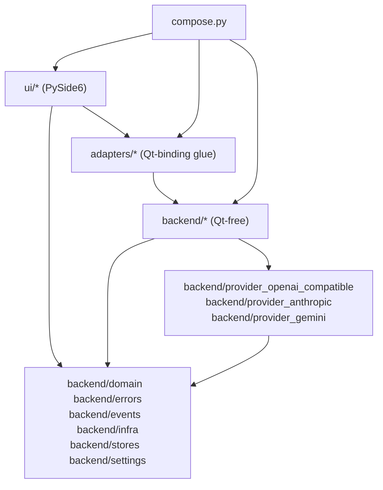

# Project Structure and Module Framework

**Status:** Draft
**Owner:** architect
**Audience:** architect, coder
**Last Updated:** 2026-05-22
**Cross-references:** `16_Engineering_Standards/02_TOOLCHAIN.md`, `16_Engineering_Standards/03_CODING_STANDARDS.md`, `16_Engineering_Standards/07_TESTING_STANDARD.md`, `08_Cross_Cutting/08-A_architecture_principles.md`, `14_Process_and_Traceability/01_MODULE_INVENTORY.md`

This document fixes the physical layout of the Ollama LLM Bench repository: the `src/` layout, the feature-first module framework, the small fixed public surface every module exposes, the single manual composition root, and the import boundaries that keep the Qt-free backend independent of the PySide6 UI. The layout is not advisory — it is enforced by `import-linter`, `ruff`, and architecture tests, and any deviation fails the pull-request gate.

---

## Table of Contents

1. Purpose and scope
2. Repository tree
3. The `src/` layout
4. The feature-first module framework
5. The module public surface
6. Sub-features and layering depth
7. The composition root
8. Import boundaries
9. Boundary enforcement
10. Required root files
11. Anti-patterns

---

## 1. Purpose and scope

The application is a single-process desktop monolith. It has no plugin system, no remote services, and no separately deployable components. Despite being one process, it is organised so that each feature is an independently understandable, independently testable unit, and so that the benchmarking backend can run headlessly under the test suite with no `QApplication` present.

This document defines *where code lives*. The rules for *what the code looks like* are in `03_CODING_STANDARDS.md`; the rules for *how it is tested* are in `07_TESTING_STANDARD.md`; the architectural rationale is in `08_Cross_Cutting/08-A_architecture_principles.md`.

## 2. Repository tree

```
ollama-llm-bench/
├── CLAUDE.md                       # Root project context for AI agents
├── README.md                       # User-facing project description
├── CHANGELOG.md                     # Keep-a-Changelog format
├── LICENSE
├── pyproject.toml                   # Single source of truth for tooling + metadata
├── uv.lock                          # COMMITTED lockfile for reproducible installs
├── .python-version                  # Single line: 3.13.3
├── .gitignore
├── .gitattributes                   # * text=auto eol=lf + binary markers
├── .editorconfig                    # UTF-8, LF, 4-space Python, 2-space TOML/YAML
├── justfile                         # Local task runner; every CI step has an equivalent
│
├── docs/
│   ├── architecture/
│   ├── adr/                         # Architecture Decision Records, MADR 4.0
│   └── development/
│
├── src/                             # SRC LAYOUT — never src-less
│   └── ollama_llm_bench/             # Top-level application package
│       ├── __init__.py
│       ├── __main__.py               # python -m ollama_llm_bench entry point
│       ├── compose.py                # The single composition root
│       │
│       ├── backend/                  # Qt-free backend (no PySide6 imports anywhere here)
│       │   ├── domain/                          # Shared DTOs (msgspec Structs) + enums
│       │   ├── errors/                          # Error taxonomy + redaction
│       │   ├── events/                          # Typed event bus CORE (Qt-free)
│       │   ├── infra/                           # Cross-cutting Qt-free infrastructure
│       │   ├── settings/                        # SettingsService + RunSnapshotBuilder Protocols
│       │   ├── stores/                          # Reactive state stores (psygnal; Qt-free)
│       │   │   └── inference_activity/          # Application-wide single-inference gate store
│       │   ├── persistence/                     # Per-aggregate SQLite stores + schema (SIX sub-features; no embedding_configs — D-R-13)
│       │   │   ├── runs/                        # RunsStore (BenchmarkRun aggregate)
│       │   │   ├── tasks/                       # TasksStore (BenchmarkTask aggregate)
│       │   │   ├── results/                     # ResultsStore (BenchmarkResult aggregate + recovery sweep)
│       │   │   ├── providers/                   # ProvidersStore (provider catalog; no embedding catalog — D-R-13)
│       │   │   ├── model_capabilities/          # ModelCapabilitiesStore (capability observation cache)
│       │   │   └── app_settings/                # AppSettingsStore (typed user-saved settings incl. the two embedding-selection keys + app_meta)
│       │   ├── platform/                        # Platform Detector
│       │   ├── concurrency/                     # CancellationToken, executors, scheduling helpers
│       │   ├── benchmark_pipeline/              # Five-phase batched orchestrator
│       │   ├── evaluation/                      # Rule + keyword + cosine + judge evaluation pipeline
│       │   ├── embedding/                       # Embedding service + cosine
│       │   ├── adaptive_timeout/                # Adaptive timeout service
│       │   ├── circuit_breaker/                 # Circuit breaker
│       │   ├── readiness/                       # Readiness probe + aggregator
│       │   ├── mode_visibility/                 # Mode-visibility policy
│       │   ├── run_drift/                       # Run-drift detector
│       │   ├── yaml_formatter/                  # Comment-preserving YAML formatter
│       │   ├── task_files/                      # Task-file loader + validator
│       │   ├── charts/                          # Chart aggregation service (Qt-free)
│       │   ├── csv_export/                      # CSV / Markdown table serializer
│       │   ├── html_rendering/                  # HTML renderer (string output; Qt-free)
│       │   ├── run_analysis/                    # Consolidated run-analysis service
│       │   ├── performance_task_generator/      # Synthetic-task generator for SYNTHETIC
│       │   ├── log_formatting/                  # Event -> display-string formatter
│       │   ├── log_file_writer/                 # Rotating + per-run log writers
│       │   ├── model_helpers/                   # Model name parser, capability service, embedding-model classifier
│       │   ├── retry/                           # Retry policy primitives
│       │   ├── provider_registry/               # Holds all LLMClient instances
│       │   ├── provider_openai_compatible/      # OpenAI-compatible (Ollama / LM Studio / llama.cpp / OpenAI / Azure)
│       │   ├── provider_anthropic/              # Anthropic provider adapter
│       │   └── provider_gemini/                 # Gemini provider adapter
│       │
│       ├── adapters/                 # Qt-binding glue between backend and ui
│       │   ├── qt_event_bus/                    # Qt delivery adapter — bridges the pure event bus to Qt signals
│       │   ├── qt_benchmark_flow/               # Qt-side facade over backend benchmark_pipeline
│       │   ├── qt_table_models/                 # QAbstractTableModel adapters (summary, details, providers)
│       │   ├── qt_runnables/                    # QRunnable wrappers for backend work units
│       │   ├── store_qt_bridge/                 # psygnal -> Qt signal bridge for cross-thread store observability
│       │   ├── qt_inference_activity_bridge/    # psygnal -> Qt signal bridge for InferenceActivityStore; re-emits as `_inference_activity_changed`
│       │   ├── workspace_controller/            # Workspace-switch coordinator (Qt-bound)
│       │   ├── notification_service/            # Qt-based notification (QStatusBar + QMessageBox)
│       │   ├── native_pickers/                  # NativePickers Protocol (save / open-file / open-folder)
│       │   ├── clipboard/                       # Clipboard Protocol (copy_text)
│       │   └── file_system_actions/             # FileSystemActions Protocol (open_in_file_manager)
│       │
│       └── ui/                       # PySide6 user interface
│           ├── theme/                            # Design tokens (typed Python objects) + the single QSS generator
│           ├── shared/                           # Shared visual primitives (BadgeLabel, HealthDot, MultiCheckFilterButton, …)
│           │   ├── provider_dropdown/            # Reusable QComboBox-backed enabled-providers dropdown
│           │   └── model_dropdown/               # Reusable QComboBox-backed models-of-a-provider dropdown
│           ├── main_window/                      # Application shell
│           ├── new_benchmark/                    # Benchmark workspace left panel: New tab (+ mode_specifics/)
│           ├── resume_benchmark/                 # Benchmark workspace left panel: Resume tab
│           ├── progress/                         # Benchmark workspace centre panel
│           ├── results/                          # Benchmark workspace right panel (+ tabs/)
│           ├── settings_dialog/                  # Settings dialog (+ sub_dialogs/)
│           ├── task_editor/                      # Task Editor workspace
│           └── common_dialogs/                   # Shared confirmation / summary dialogs
│
├── tests/
│   ├── conftest.py                   # Root fixtures: Qt parity rig, Hypothesis profile
│   ├── architecture/                 # import-linter wrappers + AST walkers
│   ├── unit/                         # Cross-module unit tests
│   ├── integration/                  # Multi-module behaviour tests
│   ├── e2e/                          # Full-app smoke tests
│   ├── perf/                         # Performance regression budgets
│   └── typing_negative/              # Files that MUST FAIL mypy --strict
│
├── scripts/                          # Project automation
└── packaging/                        # PyInstaller .spec files (macos / windows / linux)
```

Per-module unit tests are colocated inside each module (see Section 5); the top-level `tests/` directory holds cross-module, architecture, performance, and end-to-end tests.

## 3. The `src/` layout

The application package lives at `src/ollama_llm_bench/`. The `src/` directory is mandatory — a flat (src-less) layout is forbidden.

The reason is import correctness. With a `src/` layout, the package is only importable after installation into the environment. This prevents the test suite and the packaging step from accidentally importing the working-tree copy of the package and masking missing-dependency or missing-data-file bugs that would only surface in a packaged build.

`pyproject.toml` declares the package location and the test discovery roots:

```toml
[tool.uv.build-backend]
module-name = "ollama_llm_bench"
module-root = "src"

[tool.pytest.ini_options]
testpaths = ["src", "tests"]
pythonpath = ["src"]
```

The build backend is `uv_build` (see `02_TOOLCHAIN.md`). PyInstaller excludes the colocated `tests/` directories at build time via the `.spec` files.

## 4. The feature-first module framework

The unit of architecture is the **module**: a first-party Python package directory with a stable public surface, hidden internals, and an optional swap point. The repository is organised feature-first within a three-layer split — every package under `src/ollama_llm_bench/backend/`, `src/ollama_llm_bench/adapters/`, or `src/ollama_llm_bench/ui/` is either a feature package (`backend/benchmark_pipeline`, `backend/evaluation`, `backend/provider_openai_compatible`, `ui/results`, …) or a shared-infrastructure package (`backend/domain`, `backend/errors`, `backend/infra`, `backend/events`).

Feature-first means the top level is a list of *what the application does*, not a list of *technical layers*. There is no top-level `models/`, `services/`, or `controllers/` directory. Each feature contains its own models, its own logic, and — where it is a UI feature — its own view and controller.

Three rules govern the framework:

- **The module is the unit, not the file.** A 50-line utility and a 2000-line widget both occupy their own module directory with the same public surface. Single-file modules placed loosely in a parent package are not allowed.
- **Depth varies with complexity.** A simple module has a flat `_internal/` directory with a handful of files. A complex module layers its internals (for example `_internal/aggregators/`, `_internal/parsers/`) and may contain sub-feature packages. The public surface stays the same size regardless.
- **Features may contain sub-features.** `ui/results/` contains the sub-feature packages `summary_tab/`, `details_tab/`, `charts_tab/`, and `run_analysis_tab/`. A sub-feature is itself a module with the same public surface and the same internal rules; it is simply nested inside a parent feature.

## 5. The module public surface

Every module exposes a **small fixed set of public files** and hides everything else under an `_internal/` package. The public surface is at most these five files:

```
src/ollama_llm_bench/<feature>/
    __init__.py        # Thin facade: docstring + __all__ + re-exports from .api
    api.py             # Public functions, factories, Protocol re-exports — NO logic
    models.py          # msgspec.Struct DTOs and event types owned by this module
    protocols.py       # OPTIONAL — only when the module offers a swap point
    testing.py         # OPTIONAL — fakes / stubs / fixtures for downstream tests
    _internal/         # PRIVATE — all implementation
        __init__.py    # Docstring: "Private internals; do not import."
        *.py           # Implementation files; may be layered into sub-directories
    tests/             # Colocated unit tests scoped to THIS module only
        __init__.py
        conftest.py
        test_*.py
```

Contents and prohibitions per file:

| File | Contains | Must not contain |
|---|---|---|
| `__init__.py` | Module docstring, a literal `__all__: list[str]`, re-exports from `.api` | Implementation logic; any statement other than the docstring, imports, and `__all__` |
| `api.py` | Public functions and factories with `icontract` decorators; Protocol re-imports | Implementation bodies of non-trivial logic; private helpers not prefixed `_` |
| `models.py` | `msgspec.Struct(frozen=True, kw_only=True, gc=False)` DTOs; module-owned event types | Imports from `_internal/`; mutable module-level state |
| `protocols.py` | `typing.Protocol` definitions for swap points | Concrete implementations |
| `testing.py` | Fakes implementing the module's Protocols; canned fixtures | Real I/O, network, or database access |
| `_internal/*.py` | All implementation; may import `..models` and `..protocols` | Imports from `..api` (creates a cycle); module-level mutable globals |

**Consumers import from the package root only.** A consumer writes `from ollama_llm_bench.backend.csv_export import write_rows, CsvRow` and never reaches through `.api` or `._internal`:

```python
# Correct
from ollama_llm_bench.backend.csv_export import write_rows, CsvRow

# Forbidden — bypasses the public facade (ruff banned-api)
from ollama_llm_bench.backend.csv_export.api import write_rows

# Forbidden — reaches into private internals (import-linter)
from ollama_llm_bench.backend.csv_export._internal.writer import _write_rows_impl
```

`__all__` must be a literal `list[str]` written directly in `__init__.py`. A computed `__all__` assembled from sub-module `__all__` lists breaks under `mypy --strict` (which runs with `--no-implicit-reexport`), so it is forbidden.

The public API shape is chosen from the module's character:

| Module character | API shape |
|---|---|
| Pure transformation, no state, no swap point | Free function in `api.py` |
| Two or more interchangeable implementations | `Protocol` in `protocols.py` + concrete classes in `_internal/` |
| One implementation with constructor configuration | Class factory in `api.py` returning a Protocol type |
| Qt widget | Mountable widget factory in `api.py` returning a `QWidget` |
| Event publisher | Event types as frozen `msgspec.Struct` in `models.py`, owned by the publisher |

## 6. Sub-features and layering depth

Each layer of the application — backend, adapters, ui — is layered internally to a depth that matches the feature's complexity, but the public surface never changes shape:

- A **leaf utility** module (`backend/csv_export`) has a flat `_internal/` with two or three files.
- A **mid-complexity** module (`backend/adaptive_timeout`, `backend/embedding`) layers `_internal/` into a couple of files and keeps one `protocols.py` swap point.
- A **complex feature** (`backend/benchmark_pipeline`, `ui/results`) layers `_internal/` into sub-directories and contains nested sub-feature packages, each itself a full module.

A module whose `_internal/` directory grows beyond roughly 1500 lines, or whose public surface would need more than five files, is a signal to split it into a parent feature with sub-features. The split is structural only — it does not change how consumers import from it.

UI feature modules follow the MVC-family layout inside `_internal/`:

```
src/ollama_llm_bench/ui/new_benchmark/
    __init__.py
    api.py                       # make_new_benchmark_widget(...) -> QWidget
    models.py                    # frozen ViewModel Struct + UI event types
    _internal/
        view.py                  # QWidget subclass: rendering only
        controller.py             # store subscriptions + signal handlers
        view_model_select.py      # pure functions: store state -> ViewModel
    tests/
```

## 7. The composition root

There is exactly one composition root: `src/ollama_llm_bench/compose.py`. It is the single place where concrete implementations are constructed and wired together.

`compose.py` is roughly 50–200 lines of manual factory calls. It has no dependency-injection container, no `@inject` decorators, no `Annotated[..., Depends(...)]`, no service locator, and no reflection-based wiring. Dependencies are passed as plain keyword arguments to constructors and factories.

```python
# src/ollama_llm_bench/compose.py — illustrative fragment
def build_app(*, app: QApplication, loop: QEventLoop) -> AppHandle:
    # 1. Logging — configured once, before anything else.
    configure_logging()

    # 2. Persistence — one focused store per aggregate root, all sharing one SQLite handle.
    db_path = user_data_dir() / "backend.sqlite"
    runs_store               = make_runs_store(path=db_path)
    tasks_store              = make_tasks_store(path=db_path)
    results_store            = make_results_store(path=db_path)
    providers_store          = make_providers_store(path=db_path)
    model_capabilities_store = make_model_capabilities_store(path=db_path)
    app_settings_store       = make_app_settings_store(path=db_path)

    # 3. Settings + stores (composition order is fixed; see Section 8 cross-reference).
    settings = make_settings_service(app_settings_store=app_settings_store)
    run_snapshot_builder = make_run_snapshot_builder(settings=settings)
    run_registry = make_run_registry_store()
    bus = EventBus()

    # 4. Concrete backend services.
    registry = make_provider_registry(providers_store=providers_store, settings=settings, bus=bus)
    pipeline = make_benchmark_pipeline(
        registry=registry,
        runs_store=runs_store,
        tasks_store=tasks_store,
        results_store=results_store,
        run_snapshot_builder=run_snapshot_builder,
        bus=bus,
    )

    # 5. UI widgets — each receives only the stores and services it reads.
    window = make_main_window(run_registry=run_registry, settings=settings, bus=bus)

    return AppHandle(window=window, pipeline=pipeline, loop=loop)
```

`compose.py` is the **only** file allowed to import concrete provider adapters, the concrete persistence-store implementations (the six per-aggregate Stores), and concrete evaluators. Every other file imports Protocols. This rule is enforced by an `import-linter` `forbidden` contract.

`src/ollama_llm_bench/__main__.py` is the process entry point. It creates the single `QApplication`, calls `build_app`, shows the main window, and runs the Qt event loop. There is no asyncio/qasync loop (D-R-01). It contains no business logic.

## 8. Import boundaries

The application is split into three mutually layered packages over a shared Protocol set:

- **Backend layer** (`backend/*`) — pure Python, imports no PySide6 and no `adapters/` or `ui/`. Domain models, business logic, persistence, concurrency primitives, provider adapters, evaluators, and every other Qt-free service. Runs headlessly under `pytest` with no `QApplication`.
- **Adapters layer** (`adapters/*`) — the only layer that imports both `backend/*` and PySide6. Holds the Qt-binding glue: the Qt event-bus deliverer, `QAbstractTableModel` adapters, `QRunnable` wrappers, the psygnal-to-Qt store bridge, the Qt-bound workspace controller, the notification service, and the three OS-adapter Protocols (`NativePickers`, `Clipboard`, `FileSystemActions`).
- **UI layer** (`ui/*`) — depends on PySide6. Imports `ui/*`, `adapters/*`, and a strictly limited slice of `backend/*` (`domain`, `errors`, `events`, `stores`, `settings`, and Protocol re-exports). It must not import concrete backend implementations directly — those are wired only through `compose.py`.

Dependency direction is strictly inward. The UI imports the adapters and the backend Protocol surface; the adapters import the backend; the backend imports only its own siblings and third-party Qt-free libraries. The backend importing `ui/*` or `adapters/*` is forbidden; the UI importing concrete backend implementations is forbidden.



Folder import rules:

| Folder | May import | Must not import |
|---|---|---|
| `backend/domain/` | Python standard library, `msgspec` | Anything else project-internal |
| `backend/errors/` | standard library, `msgspec` | `ui`, `adapters`, provider adapters |
| `backend/infra/` | standard library, third-party infrastructure libraries | `ui`, `adapters`, higher-level `backend/*` services |
| `backend/events/` | standard library, `msgspec` | `ui`, `adapters`, provider adapters |
| `backend/settings/` | `backend/infra`, `backend/persistence/app_settings` Protocol, `msgspec` | `ui`, `adapters`, higher-level `backend/*` services |
| `backend/stores/` | `backend/infra`, `backend/events`, `backend/domain`, `msgspec`, `psygnal` | `ui`, `adapters` |
| `backend/persistence/runs/`, `/tasks/`, `/results/`, `/providers/`, `/model_capabilities/`, `/app_settings/` | `backend/domain`, `backend/infra`, `backend/errors`, `msgspec`, `sqlite3` | `ui`, `adapters`, other `backend/persistence/*` sub-features |
| `backend/benchmark_pipeline/`, `backend/evaluation/`, other `backend/*` services | `backend/domain`, `backend/infra`, `backend/events`, sibling `backend/*` Protocols | `ui`, `adapters`, concrete provider adapters |
| `backend/provider_openai_compatible/`, `backend/provider_anthropic/`, `backend/provider_gemini/` | their own SDK, `backend/domain`, `backend/errors`, `backend/infra`, `backend/events` | other `backend/provider_*` modules, `ui`, `adapters` |
| `adapters/*` | PySide6, any `backend/*` package | `ui` |
| `ui/theme/` | PySide6, standard library, `msgspec`, `backend/domain` | `ui/*` other widgets, `adapters`, concrete backend services |
| `ui/*` (widgets and dialogs) | PySide6, `adapters/*`, `ui/theme`, `ui/shared`, `backend/domain`, `backend/errors`, `backend/events`, `backend/stores`, `backend/settings`, Protocol re-exports | direct SQLite, concrete provider adapters, concrete `backend/*` implementations, any `_internal/` package |
| `compose.py` | everything | — |

Concrete provider adapters never import each other. They are independent and interchangeable through the `LLMClient` Protocol.

## 9. Boundary enforcement

Four layers of automated enforcement keep the structure intact. They are ordered by strength:

| Layer | Tool | Catches |
|---|---|---|
| Boundary contracts | `import-linter` | Layered dependency direction, private-internal access, provider independence, sole composition root |
| Per-file rules | `ruff` | Relative imports, banned-API imports through `.api`, dead re-exports |
| Type discipline | `mypy --strict` | `__all__` correctness under `--no-implicit-reexport`, full type coverage |
| Architecture tests | `pytest` AST walkers | Symbol-level rules: no module-level mutable globals, public-API contract presence |

The `import-linter` configuration lives in `pyproject.toml`. The contracts that pin this structure:

```toml
[tool.importlinter]
root_packages = ["ollama_llm_bench"]
include_external_packages = true

[[tool.importlinter.contracts]]
name = "Backend layer is Qt-free"
type = "forbidden"
source_modules = [
    "ollama_llm_bench.backend.domain", "ollama_llm_bench.backend.errors",
    "ollama_llm_bench.backend.events", "ollama_llm_bench.backend.infra",
    "ollama_llm_bench.backend.settings", "ollama_llm_bench.backend.stores",
    "ollama_llm_bench.backend.persistence.runs",
    "ollama_llm_bench.backend.persistence.tasks",
    "ollama_llm_bench.backend.persistence.results",
    "ollama_llm_bench.backend.persistence.providers",
    "ollama_llm_bench.backend.persistence.model_capabilities",
    "ollama_llm_bench.backend.persistence.app_settings",
    "ollama_llm_bench.backend.platform",
    "ollama_llm_bench.backend.concurrency",
    "ollama_llm_bench.backend.benchmark_pipeline", "ollama_llm_bench.backend.evaluation",
    "ollama_llm_bench.backend.embedding", "ollama_llm_bench.backend.adaptive_timeout",
    "ollama_llm_bench.backend.circuit_breaker", "ollama_llm_bench.backend.readiness",
    "ollama_llm_bench.backend.mode_visibility", "ollama_llm_bench.backend.run_drift",
    "ollama_llm_bench.backend.yaml_formatter", "ollama_llm_bench.backend.task_files",
    "ollama_llm_bench.backend.charts", "ollama_llm_bench.backend.csv_export",
    "ollama_llm_bench.backend.html_rendering", "ollama_llm_bench.backend.run_analysis",
    "ollama_llm_bench.backend.performance_task_generator",
    "ollama_llm_bench.backend.log_formatting", "ollama_llm_bench.backend.log_file_writer",
    "ollama_llm_bench.backend.model_helpers", "ollama_llm_bench.backend.retry",
    "ollama_llm_bench.backend.provider_registry",
    "ollama_llm_bench.backend.provider_openai_compatible",
    "ollama_llm_bench.backend.provider_anthropic",
    "ollama_llm_bench.backend.provider_gemini",
]
forbidden_modules = ["PySide6"]

[[tool.importlinter.contracts]]
name = "Module internals are private"
type = "forbidden"
source_modules = ["ollama_llm_bench"]
forbidden_modules = ["ollama_llm_bench.*._internal"]
ignore_imports = ["ollama_llm_bench.*.* -> ollama_llm_bench.*._internal.*"]

[[tool.importlinter.contracts]]
name = "Provider adapters are independent"
type = "independence"
modules = [
    "ollama_llm_bench.backend.provider_openai_compatible",
    "ollama_llm_bench.backend.provider_anthropic",
    "ollama_llm_bench.backend.provider_gemini",
]

[[tool.importlinter.contracts]]
name = "Only compose.py wires concrete adapters"
type = "forbidden"
source_modules = ["ollama_llm_bench.ui", "ollama_llm_bench.adapters"]
forbidden_modules = [
    "ollama_llm_bench.backend.provider_openai_compatible",
    "ollama_llm_bench.backend.provider_anthropic",
    "ollama_llm_bench.backend.provider_gemini",
]
```

The colocated per-module `tests/` directories are allowed to import that module's `_internal/` package — test code is given a higher access tier through `import-linter` `ignore_imports` entries and `ruff` per-file-ignores.

## 10. Required root files

| File | Required | Purpose |
|---|---|---|
| `pyproject.toml` | Yes | All tooling configuration, dependencies, project metadata |
| `uv.lock` | Yes — committed | Reproducible installs |
| `.python-version` | Yes | Single line, exact patch (`3.13.3`) |
| `README.md` | Yes | What / how / stack / quick-start / docs |
| `CHANGELOG.md` | Yes | Keep-a-Changelog format; `[Unreleased]` section maintained |
| `LICENSE` | Yes | SPDX identifier matching `pyproject.toml` |
| `.gitignore` | Yes | Build artifacts, caches, virtual environments |
| `.gitattributes` | Yes | `* text=auto eol=lf` plus binary markers |
| `.editorconfig` | Yes | UTF-8, LF, 4-space Python, 2-space TOML/YAML |
| `justfile` | Yes | Local task runner; every CI step has a local equivalent |

There is one project version, declared in `pyproject.toml`, and one top-level `CHANGELOG.md`. Modules do not carry their own `__version__` or `CHANGELOG.md`.

## 11. Anti-patterns

| Anti-pattern | Why it is wrong | Correct approach |
|---|---|---|
| A flat (src-less) package directory | Working-tree imports mask packaging bugs | `src/` layout |
| A loose single-file module | Bypasses the public-surface convention | Module directory with the five-file surface |
| A file named `interfaces.py` collecting unrelated Protocols | Becomes a god-interface; couples unrelated modules | One `protocols.py` per module, scoped to that module's swap point |
| A consumer importing through `.api` or `._internal` | Bypasses the facade; breaks under refactor | Import from the package root |
| A computed `__all__` | Breaks `mypy --no-implicit-reexport` | Literal `list[str]` in `__init__.py` |
| Concrete adapter constructed outside `compose.py` | Defeats the swap point; hides wiring | Construct in `compose.py`, pass the Protocol |
| `_internal/` importing `..api` | Creates an import cycle | `_internal/` imports `..models` and `..protocols` only |
| A dependency-injection container or service locator | Hides dependencies; reflection defeats `mypy` | Manual constructor wiring in `compose.py` |
| Top-level technical-layer directories (`services/`, `models/`) | Not feature-first; scatters one feature across the tree | Feature packages under `backend/`, `adapters/`, or `ui/`, each holding its own models and logic |
