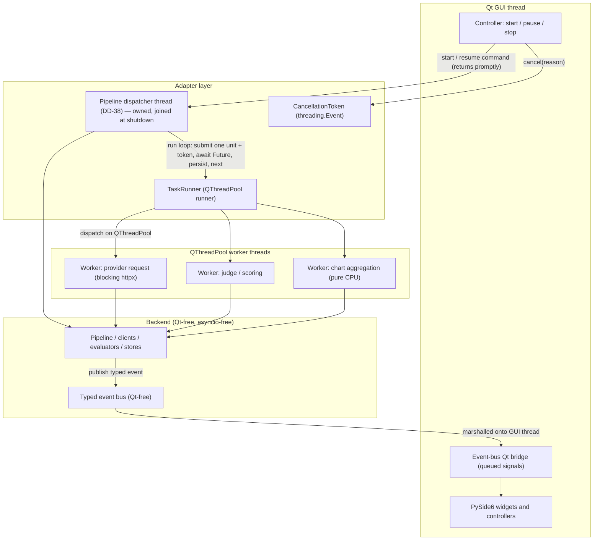

# Concurrency Standard

This standard defines the concurrency model for Ollama LLM Bench. The model is **a
synchronous, framework-agnostic backend driven by an adapter-owned thread-pool runner**.
The backend (pipeline, provider clients, evaluators, stores) is written as ordinary
**blocking** Python with no knowledge of Qt and no knowledge of `asyncio`. The PySide6
adapter layer runs backend work units on a bounded `QThreadPool` of worker threads.
Pipeline unit results are read by the dispatcher thread from each unit's `Future` (Section
4a); event-bus notifications and the results of UI-initiated work are marshalled onto the Qt
GUI thread through queued signal/slot connections. Cancellation is explicit and cooperative through a single
framework-agnostic `CancellationToken` type. No widget is ever touched from a worker
thread. Every engineer and the implementation agent must follow this model exactly — the
architecture tests in `12_Quality_and_NFRs/` enforce its hard rules.

> **Why this model (D-R-01).** The architecture requires a backend that is independent of
> the frontend *and* of the execution strategy (`08-A`). A synchronous backend is the only
> design in which the "task runner" is a swappable adapter concern: the Qt app runs it on a
> `QThreadPool`; a headless CLI runs it on a `concurrent.futures.ThreadPoolExecutor`; a test
> runs it inline — all against the same backend code, which never imports Qt or `asyncio`.

## Table of Contents

1. [Scope and Goals](#1-scope-and-goals)
2. [The Concurrency Model at a Glance](#2-the-concurrency-model-at-a-glance)
3. [The TaskRunner Port and the Qt Adapter](#3-the-taskrunner-port-and-the-qt-adapter)
4. [Bounded Concurrency for a Run](#4-bounded-concurrency-for-a-run)
4a. [The Dispatcher Thread (DD-38)](#4a-the-dispatcher-thread-dd-38)
5. [The CancellationToken](#5-the-cancellationtoken)
6. [Pause, Stop, and Resume Semantics](#6-pause-stop-and-resume-semantics)
7. [CPU-Bound Work](#7-cpu-bound-work)
8. [Thread-Boundary Rules](#8-thread-boundary-rules)
9. [UI-Update Coalescing](#9-ui-update-coalescing)
10. [Uncaught Exceptions on a Worker](#10-uncaught-exceptions-on-a-worker)
11. [Concurrency Stack: stdlib + Qt only — no asyncio, no anyio](#11-concurrency-stack-stdlib--qt-only--no-asyncio-no-anyio)
12. [Anti-Patterns](#12-anti-patterns)

---

## 1. Scope and Goals

Ollama LLM Bench drives long, I/O-bound benchmark runs against local and remote LLM
providers while keeping a responsive PySide6 desktop UI. The concurrency model exists to
satisfy five goals:

- **Backend independence.** The backend layer imports neither Qt nor `asyncio`. It runs
  headless in a test harness, a script, or behind an alternate frontend with no change.
- **Swappable execution.** *How* backend work is scheduled is an adapter decision behind a
  `TaskRunner` port. The Qt frontend supplies a `QThreadPool` runner; other frontends supply
  their own. Swapping the runner never touches the backend.
- **Responsiveness.** The GUI never freezes, even when several provider requests are in
  flight or a large result set is being aggregated for a chart. All blocking work runs on
  worker threads, never on the GUI thread.
- **Clean cancellation.** A user can pause or stop a run at any time, and shutdown can
  interrupt a run, with the application always reaching a consistent, fully resumable state
  and no orphaned threads.
- **Bounded simplicity.** Cross-thread shared state is kept to a tiny, explicitly-locked
  surface (the inference-activity gate and the single DB writer). Everything else is owned
  by exactly one thread.

The backend is **synchronous**. A run executes its work units **serially** — one at a time on
a worker thread (D-R-16, Section 4) — so the GUI thread stays free without any parallel
benchmark fan-out; there is no event loop and no coroutine scheduling anywhere in the
application. The run's orchestration loop — the **dispatcher** — runs on a single dedicated,
adapter-owned **dispatcher thread** (DD-38, Section 4a). The dispatcher thread is distinct
from both the GUI thread and the pool workers, and it is the **only** thread permitted to
block awaiting a work unit's `Future`.

> **The two serial domains (DD-40).** The serial / one-at-a-time restrictions apply to
> exactly two things, and nothing else:
>
> 1. **The benchmark run** — tasks are picked up one-by-one, stage-by-stage (D-R-16);
>    no parallel task execution inside a run.
> 2. **LLM inference, globally** — at most one inference-class call (a chat call, a judge
>    call, an embedding computation, a test inference) is in flight anywhere in the
>    application at any moment, regardless of which feature triggered it. The
>    single-inference gate enforces this across activity classes.
>
> Everything else is **unrestricted** and may run concurrently on the worker pool:
> network reachability handshakes and model-list fetches (they make no model compute
> anything and are NOT inferences), CPU-bound computations (chart aggregation, CSV/export
> assembly), and file I/O. The readiness probe's concurrent per-provider handshakes
> (`11_Services_and_Algorithms/09_READINESS_PROBE.md` §6.4) are the canonical example.

---

## 2. The Concurrency Model at a Glance



Key facts:

- There is **no event loop**. Backend work runs as blocking calls on `QThreadPool` worker
  threads owned by the adapter's `TaskRunner`.
- The run's orchestration loop runs on **one dedicated dispatcher thread** owned by the
  adapter (DD-38, Section 4a). It submits one unit at a time, blocks on that unit's
  `Future`, persists the result, emits run-domain events, and only then submits the next
  unit. It is the only thread that may block on a `Future`.
- A worker thread runs **only backend code**. It never touches a Qt widget.
- Backend→UI notifications travel on the **Qt-free typed event bus**; the adapter's Qt
  bridge re-emits each event onto the GUI thread via a **queued** signal/slot connection.
- The backend never imports Qt or `asyncio`; `QThreadPool`, `QRunnable`, and `Signal` exist
  only in the adapter and UI layers.

---

## 3. The TaskRunner Port and the Qt Adapter

The backend defines a `TaskRunner` **port** (a `Protocol` in the shared contracts). It does
not know how work is scheduled — only that it can submit a unit and observe completion or
cancellation.

```python
# shared contracts (Qt-free, asyncio-free)
class TaskRunner(Protocol):
    def submit(self, fn: Callable[[], T], *, token: CancellationToken) -> Future[T]:
        """Schedule a blocking unit of backend work; return a handle to its result."""
```

- **Qt frontend:** the adapter implements `TaskRunner` with a `QThreadPool` + `QRunnable`
  wrappers (`adapters/qt_runnables/`). The runnable's `run()` executes the backend callable
  in a `try/except` and completes the unit by calling `future.set_result(value)` /
  `future.set_exception(exc)` **directly on the worker thread** — `concurrent.futures.Future`
  is thread-safe, and a waiter blocked in `Future.result()` (the dispatcher, Section 4a)
  wakes via the Future's internal condition variable. **No Qt signal participates in the
  completion path**: the dispatcher runs no Qt event loop, so a queued signal aimed at it
  would never be delivered. Qt's role here is the thread pool only. The UI learns about
  progress and terminal states exclusively through the event bus (Section 7), never from a
  unit-completion signal.
- **Headless / CLI:** a `concurrent.futures.ThreadPoolExecutor`-backed runner.
- **Tests:** an inline runner that executes the callable synchronously, so backend logic is
  unit-tested with no threads and no Qt at all.

**Rules.**

- The composition root constructs exactly one `TaskRunner` and injects it where needed. No
  service constructs a runner inline; no backend module imports `QThreadPool`.
- The pool size is **fixed at `maxThreadCount = 4`** (DD-40), configured once at compose time. This bounds parallel non-inference work (handshakes, CPU aggregation) while the two serial domains (Section 1) are enforced by the dispatcher loop and the single-inference gate, not by pool capacity.
- The `QThreadPool` and its workers are owned by the adapter and are shut down cleanly at
  application exit (Section 6, Shutdown).
- `Future` here is the shared-contract result handle (a thin stdlib `concurrent.futures.Future`
  or an equivalent Qt-free wrapper). It carries a value, an exception, or a cancellation — it
  never carries a live Qt object.

---

## 4. Serial Execution for a Run (D-R-16)

A run executes its backend work units (for example, the eligible `(provider, model, task)`
units of the current phase) **strictly serially**: the dispatcher submits **one** unit to the
`TaskRunner`, awaits its `Future`, persists the result, then submits the next. There is **at
most one in-flight unit** across the whole application at any moment, and **no
`max_parallel_units` / `phase_concurrency` setting** — those knobs are removed. This is a
deliberate decision (D-R-16): local providers queue concurrent requests anyway, and parallel
calls distort the latency/throughput the tool measures. The unit still runs on a worker
thread so the GUI never blocks (Section 7).

```python
def run_phase(self, batch, token, runner):
    for u in batch:
        token.raise_if_cancelled()                     # safe checkpoint before each unit
        result = runner.submit(lambda: self._evaluate_one(u, token), token=token).result()
        # .result() re-raises a worker exception here for classification
        self._persist(result)                          # funnelled to the single DB writer
```

**Rules.**

- Exactly one unit is in flight at a time. A run never issues simultaneous provider calls;
  it submits one unit and waits for it before the next.
- A worker exception is captured on its `Future` and re-raised when the result is read on
  the owning thread; it is then classified per the error-handling standard. One unit's
  failure never silently disappears.
- To stop the remaining units of a phase on a fatal failure, the dispatcher stops
  submitting and cancels the token; the in-flight unit finishes at its next checkpoint
  (Section 6).
- Persistence of results is serialized through the single DB writer (Section 8).

---

## 4a. The Dispatcher Thread (DD-38)

The serial loop of Section 4 runs on a single, dedicated, long-lived **dispatcher thread**.
This thread is the answer to "which thread owns benchmark execution":

- **Identity.** One dispatcher thread exists per process. It is created by the composition
  root and owned by the adapter layer (alongside the `TaskRunner`), named
  (`pipeline-dispatcher`), and **joined at shutdown**. In the Qt frontend it may be a
  `QThread` or a plain `threading.Thread`; in a headless frontend it is a plain thread. The
  backend remains thread-agnostic: the pipeline is ordinary synchronous code that simply
  *runs on* the dispatcher thread when the adapter invokes it.
- **Command handoff.** `BenchmarkFlowApi.start(...)` / `resume(...)` are fast-synchronous on
  the GUI thread: they validate, enqueue a run command to the dispatcher thread, and return
  promptly. The dispatcher thread picks up the command and executes the pipeline's blocking
  run loop. Pause/Stop are *not* commands — they route through the `CancellationToken` as in
  Section 6.
- **What runs on the dispatcher thread.** The `run_phase` loop (Section 4): the per-unit
  token and circuit-breaker checks, obtaining the adaptive-timeout budget, submitting the
  unit, **blocking on the unit's `Future.result()`**, classifying the outcome, persisting the
  result through the single DB writer, reporting the outcome to the AdaptiveTimeoutService
  and ProviderCircuitBreaker, and emitting the run-domain events. The AdaptiveTimeoutService
  and the ProviderCircuitBreaker are touched **only** on this thread, which is what makes
  their lock-free single-owner design safe.
- **The dispatcher is the only sanctioned block-on-futures orchestrator (DD-40).** Any
  backend operation that fans work out to the `TaskRunner` and must wait for the results —
  today the benchmark run loop and the readiness `probe_all` batch
  (`11_Services_and_Algorithms/09_READINESS_PROBE.md` §6.4) — runs its orchestration on the
  dispatcher thread. Leaf units on the pool never submit-and-wait, so pool starvation is
  impossible by construction. The single-inference gate already guarantees a probe batch
  and a benchmark run never overlap, so the dispatcher is free whenever a batch can run.
  Nothing else may be put on the dispatcher thread.
- **Three thread categories.** The application has exactly three execution contexts:
  1. the **GUI thread** — UI events and marshalled results only; never blocks;
  2. the **dispatcher thread** — the only thread that blocks awaiting a unit's `Future`;
  3. the **pool worker threads** — run individual blocking units; a pool worker must
     **never** submit work to the `TaskRunner` and block awaiting its `Future` (that is the
     pool-starvation deadlock).
- **Rule exemption.** The "no raw `threading.Thread`" anti-pattern (Section 12) forbids
  ad-hoc threads *for work units*. The dispatcher thread is the single sanctioned standalone
  thread: it is owned, named, created once in the composition root, and joined at shutdown.
- **Enforcement.** An architecture test asserts that the breaker, the adaptive-timeout
  service, result persistence, and run-domain event emission are reachable only from the
  dispatcher thread, and that no `Future.result()` call occurs on the GUI thread or inside a
  pool worker.

---

## 5. The CancellationToken

Cancellation is cooperative and explicit through a single **framework-agnostic**
`CancellationToken`. It is backed by `threading.Event`s (NOT `asyncio.Event`), so it is
safe to set from the GUI thread and observe from any worker thread. It is the only
sanctioned way for UI/controller code to request that a run stop, and the only thing worker
code inspects to decide whether to keep going.

The token carries **two cancellation levels (DD-39)**, and the level is monotonic —
`NONE → SOFT → HARD`, never downgraded:

- **Soft** (`hard=False`; used by **Pause** and the automatic pauses) — the in-flight unit
  **finishes and is saved**; the halt happens at the next safe checkpoint. Pause exists to
  preserve work, so it never abandons a call in progress.
- **Hard** (`hard=True`; used by **Stop** and **Shutdown**) — the in-flight provider call is
  **aborted promptly**: the LLM client stops consuming at the next chunk boundary, and the
  token's hard-cancel abort hook closes the in-flight stream so even a silent
  (no-token-yet) period is interrupted. Nothing partial is persisted; the unit's result row
  simply stays `PENDING` and the run remains resumable. The abort completes within
  `provider.hard_cancel_max_ms` (default 2000 ms;
  `11_Services_and_Algorithms/02_LLM_CLIENT_PROTOCOL.md` §6.6).

```python
import threading

class CancellationToken:
    """Cooperative, two-level, thread-safe cancellation handle (DD-39).

    Qt-free, asyncio-free. Levels are monotonic: NONE -> SOFT -> HARD.
    Controller / UI code (GUI thread) calls `.cancel(reason=..., hard=...)`.
    Backend worker code calls `.raise_if_cancelled()` at safe checkpoints;
    the LLM client polls `.is_hard_cancelled` at chunk boundaries and
    registers an abort hook around each in-flight streaming call.
    """

    def __init__(self) -> None:
        self._lock = threading.Lock()
        self._event = threading.Event()         # set on ANY cancellation
        self._hard_event = threading.Event()    # set on HARD cancellation only
        self._reason: CancelReason | None = None
        self._hard_hooks: list[Callable[[], None]] = []

    def cancel(self, *, reason: CancelReason, hard: bool = False) -> None:
        hooks: tuple[Callable[[], None], ...] = ()
        with self._lock:
            upgraded = hard and not self._hard_event.is_set()
            if self._reason is None or upgraded:
                self._reason = reason            # first reason wins; a HARD upgrade overrides
            self._event.set()
            if upgraded:
                self._hard_event.set()
                hooks = tuple(self._hard_hooks)
        for hook in hooks:                       # invoked exactly once, outside the lock,
            _call_quietly(hook)                  # on the cancelling thread; never raises

    @property
    def is_cancelled(self) -> bool:
        return self._event.is_set()

    @property
    def is_hard_cancelled(self) -> bool:
        return self._hard_event.is_set()

    def raise_if_cancelled(self) -> None:
        # Read the flag and the reason under the same lock that cancel() writes them
        # (SPEC-104), so `_reason` is published with a proper happens-before even on a
        # free-threaded build; `_reason` is write-once/sticky (first reason wins, only a
        # HARD upgrade overrides — also under the lock), so the pair is always consistent.
        with self._lock:
            if not self._event.is_set():
                return
            reason = self._reason
        raise TaskCancelledError(reason)             # reason is always set when cancelled

    def wait(self, timeout: float | None = None) -> bool:
        return self._event.wait(timeout)

    def snapshot(self) -> tuple[CancelLevel, CancelReason | None]:
        """Atomically read the (level, reason) pair under the token's lock (DD-42).
        The dispatcher's outcome derivation uses exactly one snapshot per halt;
        a torn read (hard level with a stale soft reason) is impossible."""
        with self._lock:
            if self._hard_event.is_set():
                return (CancelLevel.HARD, self._reason)
            if self._event.is_set():
                return (CancelLevel.SOFT, self._reason)
            return (CancelLevel.NONE, None)

    def add_hard_cancel_hook(self, hook: Callable[[], None]) -> None:
        """Register an abort hook (with the lock held). If the token is ALREADY
        hard-cancelled, the hook is invoked immediately instead of registered."""

    def remove_hard_cancel_hook(self, hook: Callable[[], None]) -> None:
        """Unregister; called in the protected `finally` of the in-flight call."""
```

**Rules.**

- One `CancellationToken` is created per run and threaded through every work unit. It is
  never global and never reused across runs.
- The token is thread-safe in both directions: `cancel()` may be called on the GUI
  thread while workers observe `is_cancelled` / `is_hard_cancelled` /
  `raise_if_cancelled()`. Level transitions and the reason are guarded by the token's one
  internal lock; the level is monotonic (a later soft cancel never downgrades a hard one).
- Worker code calls `raise_if_cancelled()` at **safe checkpoints** — before starting a unit
  of work, and after it completes — never in the middle of a non-atomic operation. A soft
  cancellation is observed **only** at these checkpoints.
- `raise_if_cancelled()` raises `TaskCancelledError`, a user-category error (see the
  error-handling standard) carrying the `CancelReason`. There is exactly **one**
  `CancellationToken` type and one `TaskCancelledError`; no per-feature cancellation
  booleans.
- **The reason is a closed enum, not free text (DD-42).** `CancelReason`
  (`USER_PAUSE`, `AUTO_PAUSE`, `USER_STOP`, `APP_SHUTDOWN` —
  `10_Domain_and_Data/02_DTOS_AND_ENUMS.md` §4.23) is set under the lock together with the
  level; a HARD upgrade overrides a previously recorded soft reason. The dispatcher derives
  the run's halt outcome from exactly **one** `snapshot()` per halt, taken after the
  in-flight unit settles and before any terminal status is persisted or terminal event
  emitted — the outcome matrix is in `11_Services_and_Algorithms/16_CONCURRENCY_MODEL.md`
  §6.8. A cancel arriving after that snapshot is never lost: a run parked as `PAUSED`
  still holds its token, and a later hard cancel wakes the parked dispatcher through the
  `Paused → Stopping` transition, where the matrix is applied again.
- **Soft cancel (Pause):** a provider request already issued is **not** interrupted
  mid-flight; it returns (or hits its adaptive timeout) and is finished and saved.
- **Hard cancel (Stop / Shutdown):** the in-flight call is aborted promptly. The LLM client
  polls `is_hard_cancelled` at each chunk boundary, and registers a hard-cancel **abort
  hook** for the duration of each streaming call (removed in its `finally`). The hook
  closes the in-flight streaming response; it must be **idempotent, thread-safe, and
  non-raising**, because it runs on the cancelling thread. The aborted call raises
  `TaskCancelledError`; nothing is persisted; the cancelled attempt reports **no outcome**
  to the AdaptiveTimeoutService or the ProviderCircuitBreaker.

### Cancellation Propagation

```mermaid
sequenceDiagram
    participant UI as Controller (GUI thread)
    participant TOK as CancellationToken (two-level, DD-39)
    participant RUN as TaskRunner
    participant WRK as Worker thread (backend)

    Note over UI,WRK: Soft cancel (Pause) — work-preserving
    UI->>TOK: cancel(reason=CancelReason.USER_PAUSE)
    Note over WRK: in-flight call finishes and is saved
    WRK->>TOK: raise_if_cancelled() at checkpoint
    TOK-->>WRK: raise TaskCancelledError
    WRK-->>RUN: Future completes (cancelled)
    RUN-->>UI: queued signal -> run marked PAUSED on GUI thread

    Note over UI,WRK: Hard cancel (Stop / Shutdown) — prompt abort
    UI->>TOK: cancel(reason=CancelReason.USER_STOP, hard=True)
    TOK->>WRK: abort hook closes the in-flight stream
    Note over WRK: blocked read raises promptly; nothing persisted
    WRK-->>RUN: Future completes (cancelled, row stays PENDING)
    RUN-->>UI: queued signal -> run marked STOPPED on GUI thread
```

---

## 6. Pause, Stop, Resume, and Shutdown Semantics

Pause and Stop are user actions in the run-control UI; Shutdown is the app-close path. All
route through the `CancellationToken`, but at **different levels (DD-39)**: Pause is a
**soft** cancel whose defining property is that the in-flight unit of work is never
abandoned mid-flight; Stop and Shutdown are **hard** cancels whose defining property is a
**prompt, clean abort** of the in-flight call with nothing partial persisted.

### Pause (soft cancel — work-preserving)

1. The controller (GUI thread) calls `token.cancel(reason=CancelReason.USER_PAUSE)` (`AUTO_PAUSE` for an automatic boundary pause).
2. **Each currently in-flight unit runs to completion.** A provider request already issued
   is awaited to return, parsed, scored, and persisted exactly as if no pause had been
   requested.
3. After each in-flight unit's result is durably saved, the dispatcher's next
   `raise_if_cancelled()` checkpoint raises `TaskCancelledError`; no new units are submitted.
4. The pipeline halts cleanly: every worker that had started a unit finished and saved it;
   no worker thread is left running and no partial row is written.
5. The run's transient state becomes `PAUSED` (the persisted status stays `INCOMPLETE`).

The result is a **clean, fully resumable checkpoint**. Resuming re-reads the persisted
completed set and continues from the first not-yet-completed unit.

### Stop (hard cancel — prompt abort)

1. The controller (GUI thread) calls `token.cancel(reason=CancelReason.USER_STOP, hard=True)` after
   the Stop confirmation.
2. The in-flight provider call is **aborted promptly**: the client stops consuming at the
   next chunk boundary, and the token's abort hook closes the in-flight stream so even a
   silent (no-token-yet) wait is interrupted — within `provider.hard_cancel_max_ms`
   (default 2000 ms).
3. Nothing partial is persisted: the aborted unit's result row simply stays `PENDING`. The
   cancelled attempt reports no outcome to the AdaptiveTimeoutService or the
   ProviderCircuitBreaker. All *previously completed* units remain saved.
4. The dispatcher halts and the run is marked `STOPPED`. A `STOPPED` run remains resumable
   from the Resume widget (the aborted unit is simply re-run); its completed partial
   results remain available for inspection and reporting.

A Stop clicked while a Pause is still draining **upgrades the cancellation to hard**: the
draining call aborts promptly instead of being waited out, and the run settles to
`STOPPED` (see `11_Services_and_Algorithms/16_CONCURRENCY_MODEL.md` §6.8).

### Resume

Resume constructs a fresh `CancellationToken`, reads the persisted completion set, and
re-enters the pipeline, scheduling only not-yet-completed units. Because every completed
unit was saved before its checkpoint fired, resume never re-runs a saved unit.

### Shutdown (app close while a run is active)

1. The close handler shows the stop-and-quit confirmation; on confirm it calls
   `token.cancel(reason=CancelReason.APP_SHUTDOWN, hard=True)` and asks the `TaskRunner` to stop
   accepting new work. The in-flight call **aborts promptly** (abort hook + chunk-boundary
   poll, bounded by `provider.hard_cancel_max_ms`); nothing partial is persisted and the
   unit's row stays `PENDING`.
2. It waits a **bounded** time (`shutdown_timeout_ms`) for the aborted unit to settle and
   the `QThreadPool` to drain (`QThreadPool.waitForDone(timeout)`) — with the hard abort,
   this normally completes in a couple of seconds.
3. The run is left `INCOMPLETE` (orphan-recovery on next launch, per D-R-02), the dispatcher
   thread is joined, and the DB is checkpointed and closed.
4. Only if even the hard-abort path wedges and the timeout elapses does the application
   **force-quit** (`os._exit`). Force-quit (`os._exit`) is **deliberately minimal**: it skips the HTTP-client close, the database checkpoint/close, and the instance-lock release, because doing work on a wedged process risks hanging or crashing the exit itself. Each skipped step is individually safe to skip: the database remains consistent at its last committed transaction and SQLite performs **automatic WAL recovery on the next open** — finding `-wal`/`-shm` files after a force-quit is expected, not a defect; the operating system releases the advisory instance lock at process death (the data directory is local, so this is immediate); the abandoned in-flight HTTP call dies with the process; and the next launch's recovery sweep resets any non-terminal row. Before exiting, the application makes one best-effort log write naming the step that wedged. With DD-39
   this is a genuine last resort, not a routine path; the bounded force-quit still
   guarantees the app always exits.

### Why Pause finishes the in-flight unit — and Stop does not (DD-39)

The two cancellation levels match the two user intents. **Pause** exists to preserve work
(its primary use is swapping local models between groups), so interrupting its in-flight
request would throw away exactly what the user is trying to keep; letting the unit complete
makes every pause checkpoint land on a known-consistent boundary, at a bounded cost (the
single unit's remaining latency, capped by the adaptive per-attempt timeout). **Stop and
Shutdown** express exit intent — the user wants out *now* — so they abort the in-flight
call promptly instead. The abort is still clean, not indeterminate: nothing partial is ever
parsed, scored, or persisted; the aborted unit's row simply stays `PENDING` and is re-run
on resume. Either way, a checkpoint is always consistent — Pause achieves it by finishing
the unit, Stop by discarding it whole.

Detailed run-state transitions and the persisted checkpoint schema are specified in
`08_Cross_Cutting/08-B_benchmark_state_machine.md` and `11_Services_and_Algorithms/`.

---

## 7. CPU-Bound Work

A few backend operations are CPU-bound rather than I/O-bound — chart aggregation and
CSV/export assembly. These run on the **same `TaskRunner`** as I/O work: they are submitted
as ordinary backend callables and execute on a `QThreadPool` worker, off the GUI thread.

**Rules.**

- CPU-bound backend functions are pure: they take inputs as arguments, return a value, touch
  no Qt object, and touch no shared mutable state.
- They are submitted through the `TaskRunner` like any other unit; the result is marshalled
  to the GUI thread by the adapter.
- Code **must not** spawn raw `threading.Thread` objects for state-bearing work. All worker
  threads are owned by the `QThreadPool` and shut down with it.

---

## 8. Thread-Boundary Rules

- **Three execution contexts (DD-38).** The GUI thread (never blocks), the dispatcher
  thread (the only thread that blocks on a unit's `Future` — Section 4a), and the pool
  worker threads (run units; never submit-and-wait on the pool).
- **Never touch a widget from a worker thread.** Widget state changes only on the GUI
  thread. A worker result reaches the UI as a `Future` value or as a typed event; the
  adapter marshals it onto the GUI thread via a queued signal/slot connection.
- **The backend never imports Qt.** `QThreadPool`, `QRunnable`, `QObject`, and `Signal`
  appear only in the adapter and UI layers (`08-A`). The shared contracts (Protocols, DTOs,
  enums, event payloads, `CancellationToken`, `TaskRunner`) depend only on the standard
  library and `msgspec`.
- **Shared mutable state is a tiny, explicitly-locked surface.** Two objects are reachable
  from more than one thread and each owns one `threading.Lock`:
  - the **inference-activity gate** (`InferenceActivityStore`) — acquired/released around
    each inference activity;
  - the **single DB writer** — one write connection guarded by one lock (DD-41). Every
    SQLite write acquires the lock and runs its transaction (`BEGIN IMMEDIATE`)
    synchronously on the calling thread; a write is committed when the call returns. During
    a run, run-domain writes are issued only by the dispatcher thread (Section 4a); worker
    units never write. Readers use separate read-only connections.
  Every other store and view-model is owned by exactly one thread and needs no lock.
- **Blocking is expected on workers, forbidden on the GUI thread.** Synchronous HTTP,
  `time.sleep`, and file I/O run on worker threads. The GUI thread only handles UI events and
  marshalled results; it must never make a blocking backend call directly.

---

## 9. UI-Update Coalescing

The Qt event loop repaints at roughly 60 Hz. A benchmark run can produce thousands of
progress and streaming updates per second; emitting each one directly drowns the UI in
repaints.

**Rules.**

- High-frequency UI updates are coalesced at the **controller/adapter boundary**: the
  worker publishes events at their natural rate (or appends to an in-memory buffer), and the
  GUI side drains them into at most one repaint per frame.
- A backend emitter MAY produce progress at a fixed cadence (a ≥ 1 Hz heartbeat); that
  emission cadence is a backend concern, while the **repaint** cadence (≤ 1 per frame) is
  owned by the adapter/controller. The two are distinct (see `08-A` §7).
- Backend services never decide repaint timing and never import a Qt timer.

---

## 10. Uncaught Exceptions on a Worker

A backend worker callable runs inside the `TaskRunner`. The runner captures any exception on
the unit's `Future`; the dispatcher re-raises it on the owning thread and classifies it per
`16_Engineering_Standards/05_ERROR_HANDLING_STANDARD.md`. In addition:

- A **programmer-error** (the `BaseException`-rooted type from the error-handling standard)
  is never swallowed: the `QRunnable` wrapper and the thread-level excepthook route it to the
  process-terminal hook so the process crashes with a full diagnostic.
- Any other exception is redacted through the single redaction module and recorded on the
  application log stream.

The thread-level hook, the interpreter-level hook, and the Qt message handler form one
coherent set, specified together in the error-handling and logging standards.

---

## 11. Concurrency Stack: stdlib + Qt only — no asyncio, no anyio

The concurrency stack is the standard library (`threading`, `concurrent.futures`) plus Qt's
`QThreadPool`/`QRunnable` (adapter layer only) plus the application-defined
`CancellationToken` and `TaskRunner`. **`asyncio` is NOT used anywhere in the application,
and `anyio` is NOT a dependency.** This is binding per decision D-R-01, recorded as a
DD entry in `08_Cross_Cutting/08-F_spec_issues_log.md`; it supersedes the prior
`asyncio`/`qasync` model (the 2026-06-03 draft) and confirms the stdlib-only intent of D-027.

Cleanup that must complete even while a cancellation is propagating is expressed with
`try` / `finally`: a worker performs its persist-and-cleanup in a `finally` block so a
`TaskCancelledError` raised at a checkpoint cannot skip it. Because cancellation is
cooperative (a worker is never killed mid-call), there is no "cancel during cleanup" race to
shield against.

Engineers and the implementation agent must not introduce `asyncio`, `qasync`, `anyio`, or
any other event-loop/structured-concurrency runtime without a new ADR overturning D-R-01.

---

## 12. Anti-Patterns

| Anti-pattern | Why it is wrong | Correct approach |
|---|---|---|
| Importing Qt or `asyncio` in the backend | Breaks backend independence and the swappable-runner contract | Backend is plain blocking Python; scheduling lives behind the `TaskRunner` port |
| Spawning a raw `threading.Thread` for a work unit | Unmanaged lifetime; no clean shutdown | Submit through the `TaskRunner` (`QThreadPool`); the only sanctioned standalone thread is the adapter-owned dispatcher thread (Section 4a, DD-38) |
| Blocking on a unit's `Future` from the GUI thread or from a pool worker | Frozen UI; pool-starvation deadlock (a worker waiting on work that needs a worker) | Only the dispatcher thread blocks on unit `Future`s (Section 4a) |
| Parallel / fan-out provider calls in a run | Distorts the latency/throughput being measured; overruns local providers that queue anyway | Serial execution — exactly one in-flight unit at a time (D-R-16, Section 4) |
| A blocking call on the GUI thread | Freezes the UI | Run all blocking work on a worker via the `TaskRunner` |
| Touching a widget from a worker thread | Undefined Qt behaviour, crashes | Return a value or publish an event; the adapter marshals to the GUI thread |
| `asyncio.Event` (or any loop-affine primitive) for cancellation | No loop exists; not the model | The `threading.Event`-backed `CancellationToken` |
| Per-feature cancellation booleans | Fragmented, unobservable cancellation | The single `CancellationToken` type |
| Interrupting a provider request mid-flight on a **soft** cancel (Pause) | Throws away the work the pause exists to preserve | Soft cancel finishes and saves the in-flight unit; only a **hard** cancel (Stop/Shutdown) aborts mid-stream, via the token's abort hook (Section 5, DD-39) |
| Ad-hoc mid-stream aborts outside the token's hard-cancel hook | Indeterminate outcome and partial state | All mid-stream aborts go through `cancel(hard=True)` + the registered abort hook; nothing partial is ever persisted |
| A worker unit writing to the database | Breaks dispatcher write-affinity (DD-38/DD-41) and the persist-before-next durability point | Workers return data; the dispatcher persists run-domain rows; every write holds the single writer lock |
| A second shared mutable object without a lock | Data race | Only the gate and the DB writer are cross-thread, each with one `threading.Lock`; everything else is single-owner |
| Catching `BaseException` | Swallows the programmer-error type that must crash | Catch a specific category or leaf type |
| Missing `raise_if_cancelled()` between retry attempts | Cancellation ignored during backoff | Check the token inside every retry attempt |
| Completing a unit via a queued Qt signal | The dispatcher blocks in `Future.result()` with no Qt event loop — the signal is never delivered and the dispatcher hangs forever | `QRunnable.run()` sets the unit's thread-safe `Future` result/exception directly on the worker thread |
