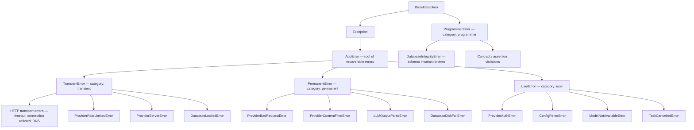
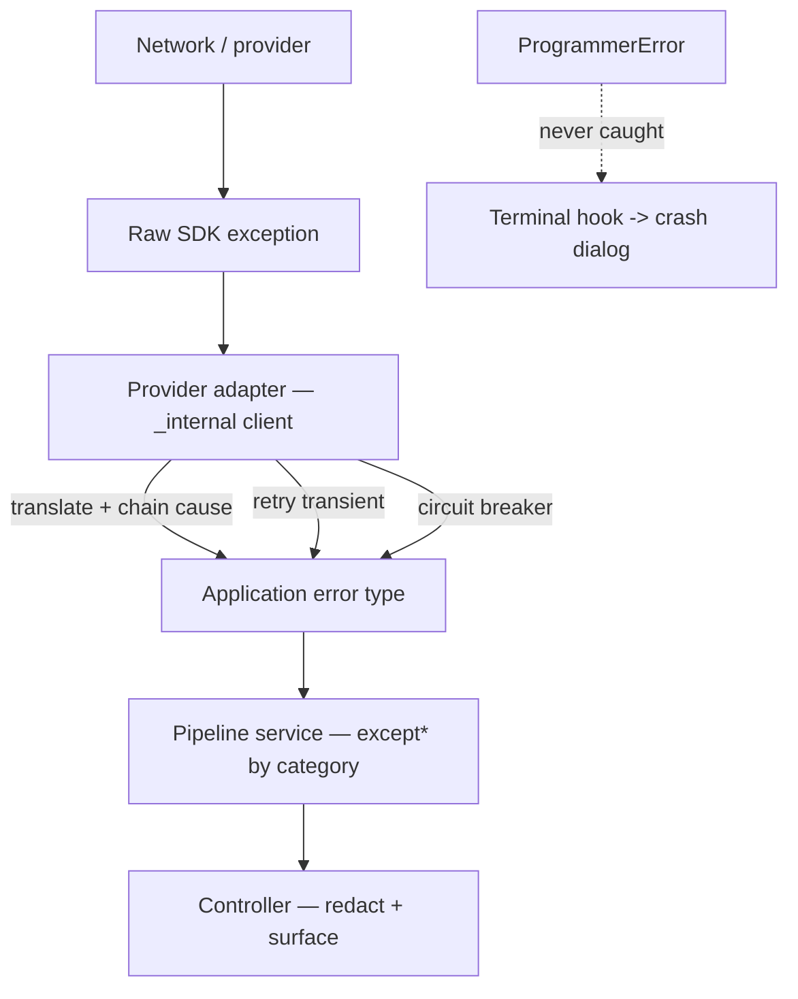
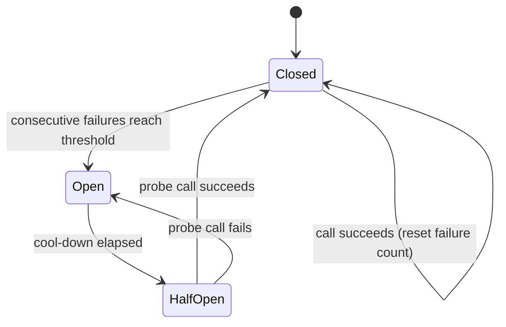
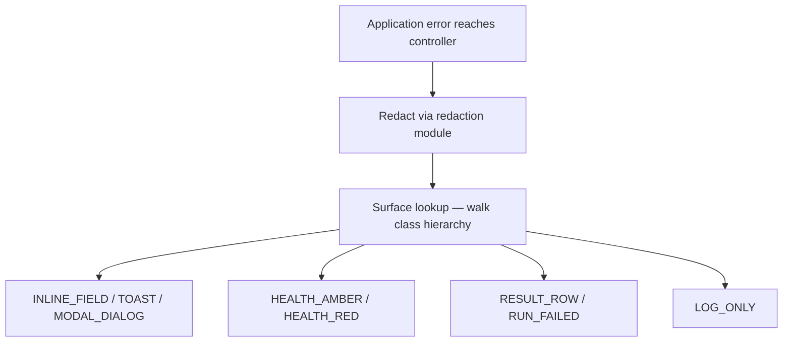
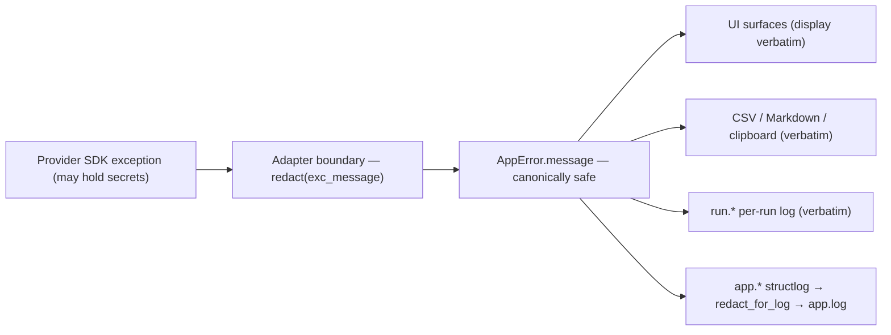

# Error Handling Standard

This standard defines how Ollama LLM Bench classifies, raises, propagates, retries, and
surfaces errors. Every error in the application belongs to one of four categories
(transient, permanent, user, programmer-error) expressed as a typed exception hierarchy.
Each provider adapter wraps the raw provider/SDK exceptions it encounters into the
application's own error types at the first point of contact. Retries apply only to
transient errors; a circuit breaker protects against a failing provider; and the
redaction module is applied at two surgical surfaces — app-log records and provider SDK
error-message wrapping at the adapter boundary —
specified in `10_Domain_and_Data/08_REDACTION_PATTERNS.md`. The architecture tests in
`12_Quality_and_NFRs/` enforce the hard rules below.

## Table of Contents

1. [Scope and Principles](#1-scope-and-principles)
2. [The Error Category Model](#2-the-error-category-model)
3. [The Exception Hierarchy](#3-the-exception-hierarchy)
4. [Error Context](#4-error-context)
5. [Adapter-Boundary Translation](#5-adapter-boundary-translation)
6. [Retry Policy](#6-retry-policy)
7. [Circuit-Breaker Policy](#7-circuit-breaker-policy)
8. [Error-to-UX Dispatch](#8-error-to-ux-dispatch)
9. [The Redaction Module](#9-the-redaction-module)
10. [Boundary Placement Summary](#10-boundary-placement-summary)
11. [Anti-Patterns](#11-anti-patterns)

---

## 1. Scope and Principles

Ollama LLM Bench talks to multiple LLM providers, parses model output, and persists
results to a local database. Every one of those activities can fail, and the failures
have very different meanings: a momentary network blip is not the same as an invalid API
key, which is not the same as a logic bug in the application itself.

The error-handling model rests on five principles:

- **Errors are typed and categorized.** Every failure is an instance of a class in one
  coherent hierarchy. The class encodes both *what failed* and *how the application must
  respond*.
- **Exceptions are the mechanism.** The application is exception-native. It does not use
  monadic result types — they force every call site to unwrap and cannot model a
  "this-must-crash" failure.
- **Programmer errors crash.** Logic bugs, broken invariants, and impossible states must
  reach the process-terminal hook and crash the application with a full diagnostic. They
  are never swallowed by a recovery handler.
- **Raw provider errors never travel.** A provider/SDK exception is translated into an
  application error type at the adapter boundary where it is born, and the original is
  chained as its cause.
- **Redaction is applied at the adapter boundary and in the app log.** Provider SDK
  exception messages are passed through `redact(text)` at the adapter boundary before
  being placed in `AppError.message`. From that point the message can flow through
  display, log, CSV, and clipboard surfaces without further redaction. The app-log
  structlog processor still applies redaction independently to catch anything that
  bypasses the adapter wrapping (third-party SDK debug output, traceback frames carrying
  raw request bodies, etc.). The two surfaces and the rationale are specified in
  `10_Domain_and_Data/08_REDACTION_PATTERNS.md`.

> **The binding stance, ratified (DD-44).** The application **uses exceptions** — that is
> standard Python behaviour — and the discipline is **controlled handling at every
> boundary**, in exactly three sanctioned shapes:
>
> 1. **Catch and return as data.** The failure-as-data surfaces — the benchmark pipeline,
>    `probe_health`, `test_inference`, the readiness probes — catch every internal
>    exception and return the outcome as a value (`§3a` of the pipeline contract,
>    `08_Cross_Cutting/08-E_interfaces_contracts.md` §11a, enumerates the pipeline's
>    containment). Their callers never see a raise.
> 2. **Catch, wrap, and re-raise.** Boundary translation: a provider SDK exception becomes
>    a typed taxonomy leaf at the adapter where it is born (original chained as cause);
>    the typed exception then drives the exception-based logic above it (retry filter,
>    breaker, classification).
> 3. **Never catch.** `ProgrammerError` propagates to the process-terminal hook and
>    crashes with a full diagnostic — by design.
>
> The user-facing guarantee that follows: **the user never sees the application break
> because of an uncaught exception** — every exception is either converted to data, a
> typed and handled error, or a deliberate, diagnosed crash. The application is NOT
> rewritten in a result-type ("Go-style") fashion; monadic result types remain banned
> (§11).

---

## 2. The Error Category Model

Every error belongs to exactly one of four categories. The category drives retry,
surfacing, and crash behaviour.

| Category | Meaning | Retry? | Reaches the user? | Crashes the app? |
|---|---|---|---|---|
| **Transient** | A momentary failure likely to succeed on retry — timeout, connection reset, provider 5xx, rate limit, database lock | Yes (bounded) | Only as a summary if it persists | No |
| **Permanent** | A real failure that retrying cannot fix — bad request, content-filter rejection, quota exhausted, disk full | No | Yes | No |
| **User** | A condition the user can fix and re-run — invalid configuration, a model that is not pulled, a user-initiated cancellation | No | Yes, with actionable guidance | No |
| **Programmer-error** | A bug — a broken invariant, an impossible state, a contract violation | No | Crash dialog only | Yes |

The first three categories are recoverable in the sense that the application keeps
running. The fourth is not: a programmer-error means the application's own assumptions are
false and continuing would produce wrong results.

---

## 3. The Exception Hierarchy

The hierarchy has a deliberate split. Recoverable errors descend from `AppError`, which
descends from `Exception`. The programmer-error root descends from `BaseException`
**outside** `Exception`, so it survives `except Exception:` catch-all nets and reaches the
terminal hook — the same design used by cancellation and keyboard-interrupt exceptions in
the standard library.

### Category roots

- `AppError(Exception)` — root of all recoverable errors. Every recoverable error carries
  a `category` and an `ErrorContext` (Section 4).
- `TransientError(AppError)` — the retry category. Retries are filtered on this root, not
  on leaf types (Section 6).
- `PermanentError(AppError)` — surfaced to the user; never retried.
- `UserError(AppError)` — the user can fix the cause and re-run; never retried.
- `ProgrammerError(BaseException)` — **not** under `Exception`. It must crash the process.
  It wraps contract violations, impossible-state assertions, and "this cannot happen"
  runtime errors.

### Mixed inheritance for multi-axis dispatch

Some leaf errors must be dispatched on two independent axes at once: their *category*
(which drives retry) and their *provider-health meaning* (which drives the status
indicator in the UI). Such leaves inherit from a category root **and** from a
provider-HTTP marker type.

For example, a provider authentication failure is both a `UserError` (the user must fix
the credential) and a provider-HTTP error (the provider-health indicator must turn red).
Declaring it as `ProviderAuthError(UserError, ProviderHTTPError)` lets one handler match
it as a `UserError` for retry policy and a different handler match it as a
`ProviderHTTPError` for the health indicator, simultaneously. Method resolution order is
left-to-right, so the category root listed first determines `category`.

### Per-provider leaf errors

Each provider adapter owns the leaf error types specific to its provider (for example, a
"model not loaded" error for a provider that requires explicit model loading, or an
"overloaded" error a provider returns when temporarily saturated). These leaves are
defined inside the owning provider module and inherit from the appropriate category root
plus the provider-HTTP marker. They are re-exported so the retry and dispatch tables can
reference them. The full provider-error catalogue is specified per provider in
`11_Services_and_Algorithms/`.

### Hard rules

- Recoverable errors **must** descend from `AppError`. Programmer-errors **must** descend
  from `ProgrammerError`, never from `Exception`.
- There is no single flat error class. A flat class loses category dispatch and the
  multi-axis matching that mixed inheritance provides.
- `except Exception` is forbidden outside a small, explicitly listed allowlist (the
  terminal hook, and any adapter wrapping a native library that has no typed exception
  hierarchy). An architecture-test AST scanner enforces this.

---

## 4. Error Context

Every `AppError` carries a frozen, structured `ErrorContext`. The context holds only
**redaction-safe** fields — values that can never contain a secret. Anything that might
contain a secret (a prompt, a base URL, an API key, an environment value) is never placed
in the context; it lives only on the raw exception arguments and is stripped by the
redaction module before any egress.

Redaction-safe context fields include:

- `provider_id` — the stable identifier of the provider that failed.
- `model_id_truncated` — the model identifier, truncated to a short prefix.
- `endpoint` — the logical endpoint name (not a full URL).
- `http_status` — the HTTP status code, if any.
- `provider_error_code` — a provider-supplied error code string, if any.
- `attempt` — the retry attempt number.
- `request_id` — a provider-supplied request identifier, if any.
- `correlation_id` — the run/operation correlation identifier (Section 9 and the logging
  standard).

The context is what makes a redacted error useful: it gives a developer enough to
diagnose the failure without exposing anything sensitive.

---

## 5. Adapter-Boundary Translation

Every provider adapter is the **sole** point where that provider's raw SDK exceptions are
allowed to exist. The adapter performs four steps, in order, at the boundary:

1. **Translate.** Catch the raw provider/SDK exception and raise the matching application
   error type, populated with an `ErrorContext`. Chain the original as the cause
   (`raise AppErrorSubtype(...) from original`) so the root cause is preserved for the
   per-run log.
2. **Retry.** Wrap the retryable call so transient failures are retried per the policy in
   Section 6.
3. **Break.** Wrap the call in the circuit breaker per Section 7.
4. **Surface upward.** Let the translated, possibly-retried error propagate to the
   service layer as an application error type.

**Rules.**

- A raw provider/SDK exception type **must not** appear outside the `_internal` package
  of its owning provider adapter. An architecture test enforces this per provider.
- The original exception is always chained with `from` so the per-run log retains the
  full diagnostic.
- Cooperative cancellation observed during a provider call (the `CancellationToken` raises `TaskCancelledError`) is surfaced
  to `TaskCancelledError` at this boundary, so the service layer only ever handles the
  application's own cancellation type. See
  `16_Engineering_Standards/04_CONCURRENCY_STANDARD.md`.
- A native library with no typed exception hierarchy may be wrapped with a broad catch
  inside its adapter only; that adapter is one of the explicitly allowlisted locations.

---

## 6. Retry Policy

Retries are applied **only** to transient errors and **only** at the adapter boundary.
Permanent errors, user errors, and programmer-errors are never retried.

The retry filter matches on the **category root** (`TransientError`), not on individual
leaf types. Adding a new transient leaf therefore never requires editing the retry policy.

Each retry uses exponential backoff with jitter and a total time budget. The defaults are
keyed by category; specific leaf types may carry tuned parameters.

| Error class | Attempts | Initial wait | Max wait | Jitter | Total budget |
|---|---|---|---|---|---|
| `TransientError` (default) | 4 | 0.5 s | 8.0 s | ±1.0 s | 60 s |
| Provider "overloaded" transient leaf | 5 | 2.0 s | 30.0 s | ±2.0 s | 120 s |
| `DatabaseLockedError` | 8 | 0.02 s | 0.5 s | ±0.05 s | 5 s |
| `ProviderRateLimitedError` | 4 | 1.0 s (or provider-supplied retry delay) | 20.0 s | ±1.0 s | 90 s |

**Rules.**

- The retry filter is `TransientError`. Absence of a leaf from this table means it falls
  back to the default transient policy; absence of an *error category* from any retry
  wrapping means "do not retry".
- When a provider returns an explicit retry-after delay (for example, on a rate-limit
  response), that delay overrides the computed backoff for the next attempt.
- The cancellation token is checked at the start of **every** retry attempt. A pause or
  stop requested between attempts is honoured immediately; the backoff sleep is itself
  cancellation-aware.
- Contract-violation and other programmer-error types are never present in any retry
  filter. An architecture test asserts this.

The per-provider retry tuning and the streaming-vs-non-streaming retry considerations are
specified in `11_Services_and_Algorithms/`.

---

## 7. Circuit-Breaker Policy

A circuit breaker protects the application from hammering a provider that is consistently
failing. Each breaker is scoped to a `(provider_id, endpoint)` pair.

- **Closed.** Calls pass through normally. Consecutive failures are counted.
- **Open.** After a threshold of consecutive failures the breaker opens; subsequent calls
  fail fast for a cool-down period without contacting the provider.
- **Half-open.** When the cool-down expires, a single probe call is allowed. Success
  closes the breaker; failure re-opens it.

Default parameters: failure threshold 5, cool-down 60 s, one half-open probe.

**Rules.**

- The breaker scope is `(provider_id, endpoint)`. A per-provider scope conflates distinct
  endpoints; a per-`(provider, model)` scope makes the breaker useless during a
  multi-model benchmark sweep.
- Errors that indicate a user/configuration problem rather than provider instability (for
  example, authentication failures and bad-request errors) are **excluded** from the
  breaker's failure count — they would otherwise trip the breaker on a problem retrying
  cannot fix. Each adapter applies the exclusion with one consistent convention.
- An open breaker is surfaced to the user as a provider-health signal (Section 8): the
  status indicator pulses amber with a tooltip stating when the circuit will next probe
  and how many requests it is currently short-circuiting.
- The global status indicator turns red when two or more provider breakers are open
  simultaneously.

---

## 8. Error-to-UX Dispatch

Once an error reaches the controller layer, it is dispatched to one or more UI surfaces.
The mapping is data-driven: a table maps error types to a set of surface flags, and a
lookup walks the error's class hierarchy, taking the first explicit entry and falling back
to category defaults.

Available surfaces:

| Surface | Meaning |
|---|---|
| `INLINE_FIELD` | An inline validation message next to the offending input field |
| `TOAST` | A transient, non-blocking notification |
| `HEALTH_AMBER` | The provider-health indicator pulses amber (degraded) |
| `HEALTH_RED` | The provider-health indicator turns red (down) |
| `MODAL_DIALOG` | A blocking dialog the user must acknowledge |
| `RESULT_ROW` | The failure is recorded against the result row in the run table |
| `RUN_FAILED` | The whole run is marked failed |
| `LOG_ONLY` | Recorded in the logs with no direct UI surface |

Dispatch decision rules:

1. **In-flight transient errors during a long run are quiet.** They map to
   `LOG_ONLY | HEALTH_AMBER | RESULT_ROW` — no toast, no modal. The end-of-run report is
   the user-visible summary; mid-run transient noise is suppressed.
2. **First occurrence of an error category in a run shows a toast; repeats are
   suppressed.** Repeat suppression is keyed by `(provider_id, error_category)` so the
   user is informed once, not flooded.
3. **`RUN_FAILED` is set only when the whole run cannot continue** — for example, an
   authentication failure, quota exhaustion, or a full disk. A single failing result row
   is `RESULT_ROW`, not `RUN_FAILED`.
4. **`MODAL_DIALOG` is reserved for user-actionable errors** the user must resolve before
   starting another run.

The full surface map for every error leaf is specified alongside the run-control UI in
`11_Services_and_Algorithms/`; the responsiveness and noise-budget requirements are in
`12_Quality_and_NFRs/`.

---

## 9. The Redaction Module

The redaction module is applied at exactly two surfaces. The full specification —
including the regex denylist, the never-log key-name list, the placeholder token, the
length cap, the API surface, and the test cases — is in
`10_Domain_and_Data/08_REDACTION_PATTERNS.md`. The two surfaces, restated here so an
error-handling reader does not have to context-switch:

1. **App log records — the `app.*` log namespace.** A structlog processor
   (`redact_for_log`) is installed in the namespace's pipeline so every record written
   to the application log file passes through it. The processor catches secrets that
   bypassed the adapter-boundary wrapping — for example, raw HTTP request/response
   bodies dumped by a third-party SDK at its own DEBUG/TRACE level
   (`16_Engineering_Standards/06_LOGGING_STANDARD.md` §7).
2. **Provider SDK error-message wrapping at the adapter boundary.** When a provider
   adapter catches an SDK exception and constructs the app-typed `AppError`, the
   exception's message string is passed through `redact(text)` before being placed in
   `AppError.message`. From this wrap point onward the message is canonically safe and
   flows through display, log, CSV, and clipboard surfaces **without further
   redaction**.

**Rules.**

- The redaction module is installed at exactly these two surfaces. UI surfaces, the
  Result widget tables, the Run Analysis tab, the run-log panel/file, the CSV/Markdown
  exports, the clipboard, and the Generate-Analysis dialog's response excerpt all
  display content **without applying redaction** — the user wrote the prompts and the
  user's machine produced the responses. The threat model that supports this scope is
  in `12_Quality_and_NFRs/02_SECURITY_MODEL.md`.
- A raw provider/SDK exception type **must not** appear outside the `_internal` package
  of its owning provider adapter; the adapter's `redact + AppError(...)` wrap is the
  canonical entry point for error text into the rest of the application.
- The earlier purpose-specific egress wrappers (`redact_for_display`, `redact_for_csv`)
  are retired (`08_Cross_Cutting/08-F_spec_issues_log.md`). The active API surface is a
  single `redact(text)` plus the `redact_for_log` structlog processor.
- A property-based test fuzzes every leaf error type with randomly generated secrets
  embedded in its message and asserts that no denylist pattern survives the adapter
  wrap and the app-log processor.
- The per-run log stream (`run.*`, `<app-data>/logs/run/...`) retains un-redacted user
  prompts and model responses by design (the user's own data on the user's own
  machine); it stays on the user's machine and the application never packages or
  transmits it (the user may share a log file manually at their own discretion —
  `13_Distribution_and_Release/07_CRASH_REPORTING.md`).

---

## 10. Boundary Placement Summary

| Failure | Born at | Translated at | Caught at | Surfaced via |
|---|---|---|---|---|
| Connection timeout to a provider | HTTP client | Adapter → `HTTPTimeoutError` (transient) | Service `except* TransientError` | Health amber + result row |
| Provider rate-limit response | Provider SDK | Adapter → `ProviderRateLimitedError` | Retried; service if exhausted | Result row + circuit-open indicator |
| Provider authentication failure | Provider SDK | Adapter → `ProviderAuthError` (user) | Service `except* UserError` | Modal dialog + run failed |
| Invalid benchmark configuration | Config reader | Reader → `ConfigParseError` (user) | Controller before run start | Inline field + modal dialog |
| Unparseable model output | Output parser | Parser → `LLMOutputParseError` (permanent) | Service per result | Result row + log |
| Database lock contention | Persistence layer | Wrapper → `DatabaseLockedError` (transient) | Retried in the wrapper | Silent if it recovers |
| Database schema invariant broken | Persistence layer | Wrapper → `DatabaseIntegrityError` (programmer) | Not caught — terminal hook | Crash dialog |
| User pauses or stops a run | Pipeline checkpoint | Born as `TaskCancelledError` (user) | Service `except* TaskCancelledError` | Toast + result row + paused/stopped state |
| Broken contract / impossible state | Any contracted call | Born as `ProgrammerError` | Not caught — terminal hook | Crash dialog |

---

## 11. Anti-Patterns

| Anti-pattern | Why it is wrong | Correct approach |
|---|---|---|
| `except Exception` outside the allowlist | Swallows everything, including bugs that must crash | Catch a specific category root or leaf |
| Catching a contract-violation / programmer-error | A bug must crash, not be recovered | Let it propagate to the terminal hook |
| `raise NewError(...)` without `from original` | Loses the root cause for diagnosis | `raise NewError(...) from original` |
| One flat error class | No category dispatch, no multi-axis matching | Categorized hierarchy with mixed inheritance |
| A raw provider SDK exception leaving its adapter | Couples the whole app to one SDK; leaks SDK detail | Translate to an application error at the boundary |
| Retrying a permanent or user error | Wastes time, cannot succeed | Retry only `TransientError` |
| Putting a secret-bearing value in `ErrorContext` | The context is treated as redaction-safe and may egress | Keep secrets off the context; the adapter-boundary `redact` strips raw args from the message |
| A raw provider SDK exception message placed on `AppError.message` without `redact` | A bare SDK message can echo back an `Authorization: Bearer …` header to display, exports, and the clipboard | Apply `redact(exc_message)` at the adapter boundary before constructing the `AppError` (`10_Domain_and_Data/08_REDACTION_PATTERNS.md` surface 2) |
| A monadic result type for failures | Forces unwrap everywhere; cannot model must-crash | Exception-native handling |
| Tripping the circuit breaker on auth/bad-request errors | Disables a provider over a problem retrying cannot fix | Exclude user/config errors from the breaker count |
