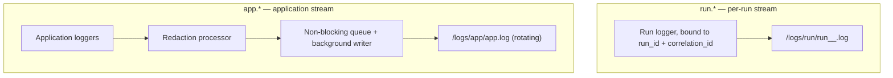
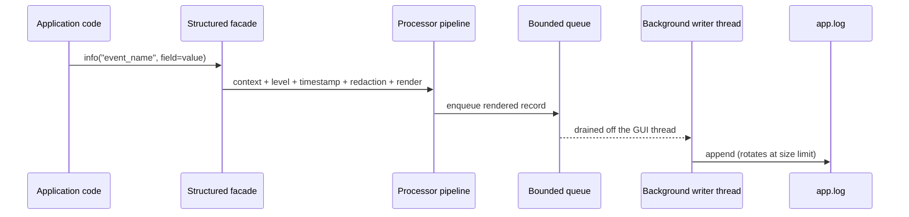

# Logging Standard

This standard defines structured logging for Ollama LLM Bench. The application emits two
independent log streams — a per-run benchmark event log and a rotating
application/system log — using a structured logging facade over the standard-library
logging transport. Log I/O is non-blocking so the GUI event loop is never stalled. The
redaction processor from the error-handling standard sits in the application stream's
pipeline so every record is scrubbed before it reaches disk. Interpreter, thread, Qt, and
event-loop exception hooks feed uncaught failures into logging. A user-initiated support
bundle is the only way logs leave the machine. The application emits **no telemetry**.

## Table of Contents

1. [Scope and Principles](#1-scope-and-principles)
2. [The Two Log Streams](#2-the-two-log-streams)
3. [Logging Configuration](#3-logging-configuration)
4. [Log Levels and Verbosity](#4-log-levels-and-verbosity)
5. [Message Format](#5-message-format)
6. [Bound Context and Correlation](#6-bound-context-and-correlation)
7. [The Redaction Processor](#7-the-redaction-processor)
8. [Exception Hooks](#8-exception-hooks)
9. [Rotation, Retention, and Locations](#9-rotation-retention-and-locations)
10. [No Telemetry](#10-no-telemetry)
11. [Anti-Patterns](#11-anti-patterns)

---

## 1. Scope and Principles

Logging in Ollama LLM Bench serves two distinct audiences with two distinct privacy
profiles. A benchmark run produces a detailed, technical event trail that a developer
needs to diagnose a provider or pipeline problem — that trail may contain sensitive
detail. The application as a whole produces a lifecycle trail — startup, user actions,
handled failures — that must be safe to share.

The model rests on five principles:

- **Structured, not free-text.** Every log record is a static event name plus typed
  key/value fields. Records are machine-readable and queryable.
- **Two independent streams.** Per-run detail and application lifecycle are separated so
  their different privacy profiles can be enforced independently.
- **Non-blocking I/O.** Log writes never block the GUI event loop, even under bursty
  load.
- **Redaction before disk.** Every record on the shareable stream passes through the
  redaction processor before it is written.
- **No telemetry.** Nothing is sent off the machine. Logs leave only inside a support
  bundle the user explicitly creates.

---

## 2. The Two Log Streams

The application maintains two logger namespaces with different destinations, retention,
and egress rules.

| Stream | Namespace | Destination | Content | Egresses |
|---|---|---|---|---|
| **Benchmark run log** | `run.*` | One file per run: `<app-data>/logs/run/run_<run_id>_<unix_ts>.log` | Per-run pipeline events, request/response timing, the chained provider exception detail (**run through `redact()` first** — SPEC-060), retry attempts, circuit-breaker transitions | Stays on the machine; the user may share a file manually at their discretion |
| **Application / system log** | `app.*` | A single rotating file: `<app-data>/logs/app/app.log` | Application lifecycle, user actions, UI events, redacted error summaries, settings changes, update checks | Rotated to disk; stays on the machine; the user may share it manually |



**Rules.**

- The two streams are fully independent. The `run.*` namespace **never** propagates to
  the application stream and never reaches `app.log`. Each run logger is configured so its
  records do not bubble up to the root logger.
- The `app.*` stream is **always pre-redacted** by the `redact_for_log` structlog
  processor (Section 7). The `run.*` stream has **no redaction processor** — it logs
  user prompts and model responses as plain text, by design
  (`10_Domain_and_Data/08_REDACTION_PATTERNS.md` §1, `12_Quality_and_NFRs/02_SECURITY_MODEL.md`).
- A `run.*` logger is created per run, bound with the run identifier and correlation
  identifier, and writes to that run's own file. It is closed when the run ends.
- The `app.*` namespace is a single shared logger hierarchy for the whole application.

---

## 3. Logging Configuration

Logging is configured **once**, in the composition root (`compose.py`), before the
`QApplication` is constructed and before any worker exists.

The configuration establishes:

- The structured logging facade over the standard-library logging transport.
- A **non-blocking sink**: application-stream records are placed on a bounded in-memory
  queue, and a single background thread drains that queue to the rotating file. The GUI
  event loop never performs file I/O for logging.
- The processor pipeline for the structured facade, in order:
  1. merge bound context variables (run/correlation context) into the record,
  2. add the log level,
  3. add an ISO-8601 UTC timestamp,
  4. **the redaction processor** (Section 7),
  5. render the record as a structured line.
- The rotating-file handler for `app.log` with UTF-8 encoding, a size limit, and a backup
  count (Section 9).



**Rules.**

- Logging configuration happens exactly once, in `compose.py`. No other module configures
  logging.
- Loggers are obtained at module scope, not inside object constructors — obtaining a
  logger must not be a side effect of constructing a class.
- The benchmark-run stream is created and torn down per run via a dedicated context
  manager that opens the run file, binds the run logger, yields it, and closes the file
  on exit.

---

## 4. Log Levels and Verbosity

| Level | Use for |
|---|---|
| `CRITICAL` | The process cannot continue and is shutting down |
| `ERROR` | An unexpected failure that requires investigation |
| `WARNING` | An unexpected condition that was handled gracefully (a retry, a fallback) |
| `INFO` | A significant lifecycle or benchmark event |
| `DEBUG` | Diagnostic detail — variable state, decision branches |

**Rules.**

- `ERROR` is reserved for genuinely unexpected failures. It is **not** used for: user
  input validation, an expected empty result, or a timeout that was handled by a retry —
  those are `WARNING` or `INFO`.
- In a release build the application stream's effective level is `INFO`; `DEBUG` is
  disabled. The per-run benchmark stream is always at `DEBUG` so a run file captures the
  full pipeline trail.
- The application-stream verbosity is a user-exposed setting. The benchmark-run stream's
  verbosity is fixed and not user-tunable.
- Inside an `except` block, use the facade's exception-logging call so the full traceback
  is captured. For any one `except` block, **either** log the failure **or** re-raise it —
  never both. Doing both produces double-handling and duplicate records.

---

## 5. Message Format

Every log call is a static event name followed by structured fields.

```python
log.info("run_started", run_id=run_id, provider_id=provider_id, model_count=model_count)
log.warning("provider_retry", provider_id=provider_id, attempt=attempt, wait_s=wait_s)
log.exception("persistence_failed", run_id=run_id, table="benchmark_result")
```

**Rules.**

- The first argument is a **static, snake_case event name** — treat the set of event
  names as an enumeration of event kinds. It never contains interpolated data.
- All variable data is passed as keyword arguments. An f-string or `%`-formatted string is
  never built inside a log call.
- Field names are stable and snake_case. Reusing the same field name for the same concept
  across event types keeps the streams queryable.

---

## 6. Bound Context and Correlation

Run-scoped and operation-scoped context is bound **once** at the start of a run or
operation and then automatically attached to every record emitted within that scope —
including records emitted by the run's worker threads.

- A run binds a `run_id` and a `correlation_id` at run start.
- The context binding uses context variables, so it propagates correctly through the
  worker-thread/unit hierarchy of the run described in
  `16_Engineering_Standards/04_CONCURRENCY_STANDARD.md`.
- The `correlation_id` ties together every record across both streams for a single
  logical operation, and is the same identifier carried on the `ErrorContext` in
  `16_Engineering_Standards/05_ERROR_HANDLING_STANDARD.md`, so a single operation's
  records can be cross-referenced across both log files.

---

## 7. The Redaction Processor

The redaction processor — `redact_for_log` — is the structlog stage installed in the
`app.*` namespace's processor pipeline (`10_Domain_and_Data/08_REDACTION_PATTERNS.md`
§7.2). It is attached to the `app.*` namespace **ONLY**, **NOT to `run.*`**. Because it
is a pipeline stage on the `app.*` side, **every** record written to the application
stream passes through it — there is no way to write an un-redacted record to `app.log`.

The processor walks the record's fields and:

- replaces the value of any field whose name (case-insensitively) is on the never-log
  list (`10_Domain_and_Data/08_REDACTION_PATTERNS.md` §4) with the placeholder, and
- after the record is serialised to its log-line form, scrubs the line against the
  secret denylist (provider API keys, bearer tokens, `api_key=` / `authorization:`
  fragments, `Bearer …` tokens, JWTs, the high-entropy catch-all), and applies the
  4000-character length cap.

**Rules.**

- The redaction processor is present in the `app.*` pipeline **only**. The `run.*`
  namespace has **no redaction processor** — it logs user prompts and model responses
  as plain text. This is by design: the prompts are the user's own, the responses come
  from the user's own machine, and the file stays on the machine — the application never
  packages or transmits it (the user may share a log file manually at their own
  discretion). The threat model that supports this split is in
  `12_Quality_and_NFRs/02_SECURITY_MODEL.md`.
- A property-based test fuzzes records with randomly embedded secrets and asserts no
  denylist pattern survives a pass through the `app.*` pipeline.

---

## 8. Exception Hooks

Uncaught failures must not vanish silently. The composition root installs a coherent set
of hooks that route every uncaught failure into logging:

| Hook | Catches |
|---|---|
| Interpreter exception hook | Uncaught exceptions on the main thread |
| Thread exception hook | Uncaught exceptions on any non-main thread |
| Thread excepthook | Uncaught exceptions inside `TaskRunner` worker threads |
| Qt message handler | Messages emitted by the Qt framework itself, re-tagged into the `app.qt.*` namespace |

Behaviour:

- A programmer-error (the `BaseException`-rooted type) is logged at `CRITICAL` with its
  full traceback and then allowed to crash the process — it surfaces the crash dialog
  (Section 10). The application generates **no** support bundle and sends nothing off the
  machine; the user reports a defect manually (`13_Distribution_and_Release/07_CRASH_REPORTING.md`).
- Any other uncaught exception is logged at `ERROR` with its full traceback.
- The event-loop handler specifically routes a programmer-error to the interpreter hook
  so the crash path is uniform regardless of where the exception originated.

The hook set is installed once, in `compose.py`. The error-categorisation behaviour of the
hooks is defined in `16_Engineering_Standards/05_ERROR_HANDLING_STANDARD.md`; the
event-loop handler is described in `16_Engineering_Standards/04_CONCURRENCY_STANDARD.md`.

---

## 9. Rotation, Retention, and Locations

All log files live under the per-user application data directory, resolved per OS:

- macOS: `~/Library/Application Support/OllamaLLMBench/`
- Linux: `~/.local/share/OllamaLLMBench/`
- Windows: `%LOCALAPPDATA%\OllamaLLMBench\`

Layout under that directory:

```
<app-data>/
  logs/
    app.log            application stream (rotating)
    app.log.1 .. .5    rotated backups
    runs/
      run_<run_id>_<unix_ts>.log   one file per benchmark run
```

**Rules.**

- `app.log` rotates at a fixed size and keeps a bounded number of backups; the oldest
  backup is discarded on rotation. The size and backup count are fixed configuration.
- Run files are written one per run and are **not** auto-deleted — a benchmark run's log
  is part of its evidence. A user may clear them manually; the application offers a
  housekeeping action to do so.
- All log files are UTF-8 encoded.
- The exact rotation size, backup count, and run-log housekeeping policy are specified as
  non-functional requirements in `12_Quality_and_NFRs/`.

---

## 10. No Telemetry

Ollama LLM Bench collects and transmits **no telemetry**, performs **no** automatic crash
reporting, and generates **no** support bundle.

- There is no analytics service, no crash-reporting service, no usage reporting, and no
  background "phone-home" of any kind.
- All log data stays in the per-user application data directory on the local machine.
- The application never packages, archives, or transmits diagnostic data. Logs leave the
  machine only if the user **manually** shares a log file at their own discretion (for
  example, attaching `app.log` to a GitHub issue — see
  `13_Distribution_and_Release/07_CRASH_REPORTING.md`).

This is a binding product decision and applies to every build and every release channel.

---

## 11. Anti-Patterns

| Anti-pattern | Why it is wrong | Correct approach |
|---|---|---|
| `print(...)` for diagnostics | No level, no structure, no destination | Structured facade with an event name |
| An f-string built inside a log call | Defeats structured fields; can interpolate a secret | Static event name plus keyword fields |
| Logging the raw string of an exception after `except` | Loses the traceback | The facade's exception-logging call |
| Logging a failure *and* re-raising it | Double-handling, duplicate records | Choose exactly one per `except` block |
| Logging a credential-bearing string to **any** stream | Leaks a secret into a shareable file | `app.*` is redacted by the processor; the **chained provider-exception detail written to `run.*` is passed through `redact()` first** (SPEC-060) — user prompts and model responses in `run.*` stay verbatim, only the SDK-exception string is redacted |
| Letting the `run.*` stream propagate to the root logger | Run detail leaks into `app.log` | Configure the run logger so it does not propagate |
| Obtaining a logger inside a class constructor | Makes construction side-effecting | Obtain loggers at module scope |
| Sending any log data off the machine | Violates the no-telemetry decision | The application never transmits logs; any sharing is manual and user-initiated |
| File I/O for logging on the GUI thread | Stalls the event loop under bursty load | The non-blocking queue plus background writer |
