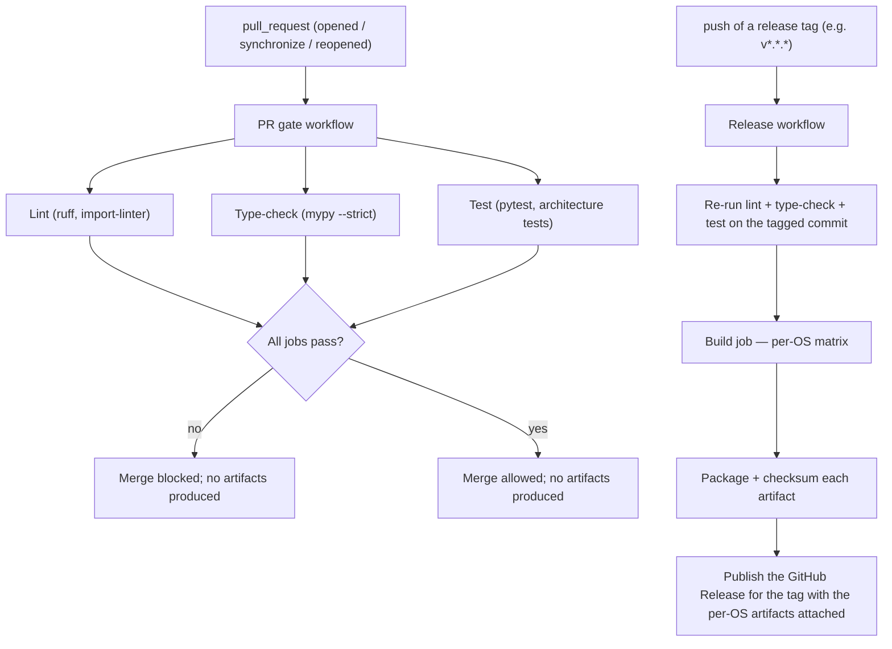
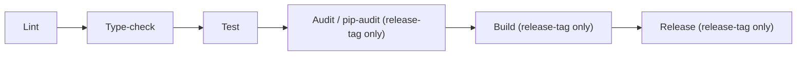
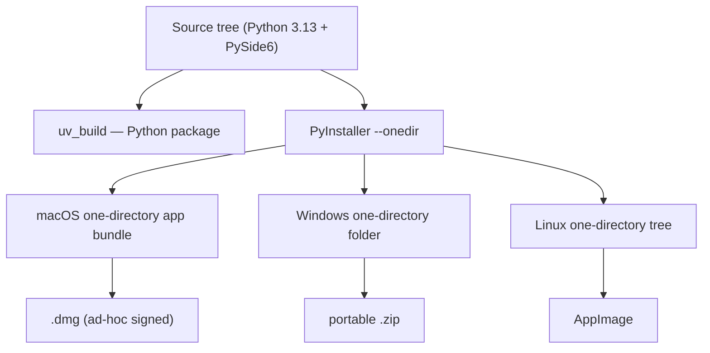

# CI/CD and Packaging Standard

This standard defines how Ollama LLM Bench is continuously integrated, built, packaged,
and released. Continuous integration runs on GitHub Actions within the free-tier minute
budget: it lints, type-checks, tests, builds, and releases the application. The package is
built with the `uv_build` backend; desktop binaries are produced with PyInstaller in
one-directory mode. Each operating system receives a tailored artifact — a macOS `.dmg`, a
Windows portable `.zip` (no installer), and a Linux AppImage. All binaries are
**unsigned**; this standard documents the first-run OS-security experience that follows
from that. Releases carry SHA256 checksums; the application itself has **no auto-update
mechanism** (see DD-36 in `08_Cross_Cutting/08-F_spec_issues_log.md`) and users obtain new
versions by manually downloading the next release artifact from the GitHub Releases page.

## Table of Contents

1. [Scope and Constraints](#1-scope-and-constraints)
2. [Project Identity](#2-project-identity)
3. [CI/CD Overview](#3-cicd-overview)
4. [CI Jobs](#4-ci-jobs)
5. [Free-Tier Minute Budget](#5-free-tier-minute-budget)
6. [Build Backend and Packaging](#6-build-backend-and-packaging)
7. [Per-OS Artifacts](#7-per-os-artifacts)
8. [Checksums and Reproducibility](#8-checksums-and-reproducibility)
9. [Unsigned Distribution and First-Run UX](#9-unsigned-distribution-and-first-run-ux)
10. [No Auto-Update](#10-no-auto-update)
11. [Minimum OS Versions](#11-minimum-os-versions)
12. [No Crash Reporting and No Telemetry](#12-no-crash-reporting-and-no-telemetry)
13. [Anti-Patterns](#13-anti-patterns)

---

## 1. Scope and Constraints

This standard covers everything between a committed change and an installed application:
the CI quality gate, the build and packaging pipeline, the released artifacts, and the
update mechanism.

It operates under fixed constraints:

- **Free tier only.** CI runs on the GitHub Actions free-tier minute budget. No paid CI
  services, no self-hosted runners, no paid developer accounts.
- **Unsigned binaries.** There is no Apple Developer ID and no Windows Authenticode
  certificate. Binaries are not notarized and not code-signed by an OS-trusted authority.
- **Windows is portable-only.** Windows is distributed as a portable `.zip`. There is no
  Windows installer.
- **No telemetry.** Nothing in the pipeline or the shipped application reports usage or
  crashes to a remote service.
- **Latest stable dependencies.** Dependencies track their latest stable releases,
  resolved and locked by the package manager; the lockfile is committed and CI builds
  against it.

---

## 2. Project Identity

These identity values are fixed and are consumed throughout the build and packaging
pipeline.

| Field | Value |
|---|---|
| Application name | Ollama LLM Bench |
| Python package | `ollama_llm_bench` |
| Author | sanyokkua |
| Bundle identifier (macOS) | `com.sanyokkua.ollamallmbench` |
| GitHub owner | `sanyokkua` |
| Target runtime | Python 3.13, PySide6 |

---

## 3. CI/CD Overview

CI/CD is implemented as GitHub Actions workflows triggered by **exactly two events** (DD-36):

1. A **pull request** to the main branch (events `opened`, `synchronize`, `reopened`).
2. A **push of a version tag** matching the release-version pattern (for example `v*.*.*`).

There is no `schedule` trigger, no nightly cron, no `workflow_dispatch` manual trigger, no
push-to-main artifact build, and no separate weekly or smoke build. Every CI invocation
falls into one of the two categories above.



- **PR gate.** Runs on every pull request to the main branch. It must pass before a merge
  is allowed. It runs the lint, type-check, and test jobs against the head SHA of the PR.
  It produces **no release artifacts**.
- **Release.** Runs when a version tag matching the release pattern is pushed. It re-runs
  the quality gate against the tagged commit, then builds and packages the per-OS
  artifacts and publishes them on the GitHub Release for that tag. Artifact builds happen
  **only** on a release-tag push.

CI runs against the committed lockfile so the build is reproducible and local runs match
CI runs.

The minimal workflow shape — illustrative only; concrete YAML lives in the repository — is:

```yaml
# .github/workflows/pr-gate.yml
on:
  pull_request:
    types: [opened, synchronize, reopened]
    branches: [main]

# .github/workflows/release.yml
on:
  push:
    tags:
      - 'v*.*.*'
```

No other `on:` entries are permitted. Adding `schedule`, `workflow_dispatch`, a
`push.branches` filter that targets `main`, or any other trigger is a defect against
DD-36.

---

## 4. CI Jobs

### Lint

Runs the project's single linter/formatter in check mode over the source and tests, and
runs the import-architecture checker. The lint job is the cheapest gate and runs first so
failures surface fast. It also runs a **Mermaid diagram lint**: every fenced ` ```mermaid ` block in the spec/docs is parsed headlessly (e.g. `@mermaid-js/mermaid-cli`) and the job fails on any parse error. This guards against the diagram-syntax pitfalls fixed under SPEC-085/086 — an unquoted `;` acting as a statement separator inside a sequence message, state label, or node label, and unquoted parentheses inside a `[...]` node label — which render blank rather than erroring in many viewers and so escape visual review.

### Type-check

Runs the static type checker in strict mode over the source tree. Strict type-checking is
a hard gate — a type error blocks the merge.

### Test

Runs the test suite: the architecture tests first (fast, high-signal), then unit and
integration tests, with coverage measured. Qt-based tests run headless using an offscreen
display platform so they need no graphical environment on the runner. Coverage thresholds
are enforced on one runner of the matrix. Test scope, coverage thresholds, and the
headless-Qt rig are specified in `12_Quality_and_NFRs/`.

The test matrix spans the supported operating systems on Python 3.13. To stay within the
minute budget (Section 5) the slowest matrix entries can be trimmed from the PR matrix and
exercised only on the release-tag run, which re-runs the full quality gate before
building. There is no nightly workflow to absorb slow tests.

### Audit (release-tag only)

Runs `uv run pip-audit` (executed **inside the uv-managed environment**, never a bare `pip` that could shadow uv's resolution — SPEC-063) against the resolved, frozen dependency set (`uv export` / `uv.lock`) as a
gating step in the **release-tag workflow only**, after the quality gate passes and before
the Build job. No PR-gate or scheduled audit is added: the dependency-currency policy ("latest stable at the time of implementation") is an **implementation-time** practice — the maintainer pulls current versions via `uv` when doing the work — not a promise of continuous CVE monitoring; the late-discovery cost is accepted and recorded in R-014. A reported vulnerability fails the release before any artifact is built, so a
known-CVE dependency never ships in a release binary. This respects the no-background-jobs
decision (DD-36): there is **no** `schedule` / nightly run — the audit is gated on the
release-tag build, which is the moment a vulnerable dependency would actually reach users.
`pip-audit` may still be run locally on demand by the maintainer at any time (see
`16_Engineering_Standards/07_TESTING_STANDARD.md` §12); the release-tag run is the
**enforced** gate.

### Build

Runs only in the release workflow, after the quality gate and the Audit step pass. It builds
and packages one artifact per operating system (Sections 6 and 7). The build job is **only
ever triggered by a release-tag push** — never by a pull request and never by a push to main.

### Release

Runs only in the release workflow, after the build job. It collects the per-OS artifacts
and their checksums and publishes them on the GitHub Release for the tag. If any step
fails, the workflow cleans up the partially published release and the tag so a release is
never left half-published.



---

## 5. Free-Tier Minute Budget

GitHub Actions free-tier minutes are a hard constraint, and macOS runners consume minutes
at a multiplied rate. The pipeline is designed to stay within budget:

- The PR gate cancels superseded in-progress runs when a new commit is pushed to the same
  pull request, so only the latest commit consumes minutes.
- The lint job runs first and fast so a trivial failure does not consume the more
  expensive jobs' minutes.
- The slowest matrix entries — in particular the costliest macOS runner — can be dropped
  from the PR matrix if the PR matrix's macOS minute consumption approaches the budget;
  the release-tag workflow re-runs the full quality gate before building, so the trimmed
  legs are still exercised before each release.
- No paid runners and no self-hosted runners are used.

The concrete minute thresholds that trigger trimming the PR matrix are recorded in
`12_Quality_and_NFRs/`.

---

## 6. Build Backend and Packaging

### Build backend

The Python package is built with the **`uv_build`** backend. The build backend, the
package metadata, and the dependency set are declared in the project manifest; the
dependency lockfile is committed and every build resolves against it.

### Desktop bundling

Desktop binaries are produced with **PyInstaller in one-directory mode**. One-directory
mode produces a folder containing the executable and its dependencies. It is used in
preference to single-file mode because single-file mode extracts the whole application to
a temporary directory on every launch, which measurably slows startup.

There is one PyInstaller specification per operating system. The three specifications
share the same Python entry point and differ only in per-OS bundle metadata — icon,
identity fields, minimum-OS declaration, and the OS-specific packaging wrapper. Test code
is excluded from every bundle.



---

## 7. Per-OS Artifacts

Each operating system receives one tailored artifact.

| OS | Artifact | Packaging notes |
|---|---|---|
| macOS | `.dmg` disk image | Built from the one-directory app bundle. The app bundle is **ad-hoc signed** — signed with no identity — so the OS recognises it as internally consistent. Ad-hoc signing is **not** notarization and does not suppress the first-run Gatekeeper prompt (Section 9). |
| Windows | Portable `.zip` | The one-directory folder is zipped. The user unzips it and runs the executable directly. **There is no Windows installer.** |
| Linux | AppImage | The one-directory tree is packaged into a single self-contained AppImage that runs without installation. |

The macOS release artifact is **arm64 only** (DD-69): the macOS build runner targets Apple silicon and produces a single arm64 `.dmg`; no Intel (x86-64) macOS artifact is built (Apple has dropped Intel from current macOS). The release build produces these artifacts in a per-OS matrix so each is built on its
native runner (the macOS artifact is arm64 only, DD-69). The detailed artifact naming scheme and the release-notes format are
specified in `13_Distribution_and_Release/`.

---

## 8. Checksums and Reproducibility

- Every published artifact is accompanied by a **SHA256** checksum file. A user can verify
  a download by computing the SHA256 of the downloaded file and comparing it to the
  published checksum.
- The build sets the environment values that make the build tamper-evident given the same
  runner image and the same source revision: the source-date timestamp is pinned to the
  commit time and hash randomization is made deterministic. "Reproducible" here means
  tamper-evident for the same runner image and revision — not bit-for-bit identical across
  unrelated runner-image refreshes.
- There is no update feed; SHA256 checksums are the only release-side integrity record the
  user consults when manually downloading a new version (Section 10).
- **Integrity, not authenticity (release-integrity decision D-R-11b).** The `SHA256SUMS`
  file detects accidental corruption or an incomplete download: it confirms the bytes match
  what the release published. It is **not** a cryptographic authenticity guarantee — it is
  unsigned, so an actor who could alter the release artifacts could also regenerate the
  checksum file. The trust anchor is therefore the HTTPS GitHub Releases page itself (TLS
  transport plus GitHub account control), not a signature. The project deliberately ships
  **no** signed checksums (GPG) and **no** signed artifacts (Ed25519 or otherwise);
  certificate- or key-based signing is an explicitly deferred option, re-evaluated only at a
  sustained user-base milestone (see `12_Quality_and_NFRs/02_SECURITY_MODEL.md` and risk
  R-002 in `15_Risks_and_Open_Questions/01_RISK_REGISTER.md`).

---

## 9. Unsigned Distribution and First-Run OS-Security UX

The binaries are unsigned. There is no Apple Developer ID and no Windows Authenticode
certificate, and paid developer accounts are explicitly out of scope. As a consequence,
each OS shows a security prompt on first launch. This is expected and is documented for
users in `13_Distribution_and_Release/`.

| OS | First-run experience | What the user does |
|---|---|---|
| macOS | Gatekeeper warns that the application is from an unidentified developer. | The user opens the application through System Settings → Privacy & Security → "Open Anyway" on first launch, after which the OS remembers the choice. |
| Windows | SmartScreen warns about an unrecognised application. | The user clicks "More info" and then "Run anyway". SmartScreen reputation accrues over time and softens the warning, but cannot be eliminated without a certificate. |
| Linux | The AppImage runs directly; the user marks the file executable if their environment has not done so. | No security prompt; the user makes the AppImage executable and runs it. |

**Rules.**

- The first-run security experience is treated as a known, documented behaviour, not a
  defect.
- The macOS app bundle is ad-hoc signed so the OS treats it as internally consistent;
  this does not change the Gatekeeper prompt.
- Notarization, Authenticode signing, and any paid signing service are out of scope. They
  may be re-evaluated only if the user base grows enough to justify the recurring cost; no
  such commitment exists.

---

## 10. No Auto-Update

The application has **no auto-update mechanism** of any kind (DD-36). The release workflow
produces per-OS artifacts and attaches them to a GitHub Release; updating an existing
installation is a deliberate user action against those artifacts.

**Rules.**

- The application performs **no** update check — neither on startup, nor on a schedule,
  nor on a user action. There is no "Check for updates" menu entry, button, or dialog.
- The release workflow publishes **no** update feed, **no** `updates.json`, and **no**
  remote version manifest. The only release-side integrity record is the SHA256 checksum
  file (Section 8).
- There is **no** signing key topology for updates and no public key embedded in the
  application for update verification, because the application fetches no updates.
- Users learn about new versions out of band — by visiting the project's GitHub Releases
  page or by GitHub's "watch releases" notification — and install them by downloading the
  next artifact and replacing the existing installation. The data directory survives
  untouched (see `13_Distribution_and_Release/02_INSTALLATION.md`).

The manual-download update procedure is documented for end users in
`13_Distribution_and_Release/02_INSTALLATION.md`.

---

## 11. Minimum OS Versions

The published artifacts declare and target these minimum operating-system versions:

| OS | Minimum version | Notes |
|---|---|---|
| macOS | macOS 11 | The macOS bundle declares this minimum-system version. |
| Windows | Windows 10 (build 1809 or later) | Also runs on Windows 11. |
| Linux | A glibc 2.35 baseline | The Linux artifact is built on a runner whose glibc floor is 2.35 so it runs on that and newer distributions. |

The Linux artifact is deliberately built on an older-baseline runner so its glibc
requirement is as low as practical, widening the set of distributions it runs on.

---

## 12. No Crash Reporting and No Telemetry

The application performs **no** automatic crash reporting, sends **no** telemetry, and
generates **no** support bundle. When an uncaught failure occurs, it is written to the
application log (`<app-data>/logs/app/app.log`) and the application exits cleanly
(`08_Cross_Cutting/08-M_app_lifecycle.md` §8). Nothing is transmitted automatically and
nothing is packaged. To report a bug, a user can open a GitHub issue (the repository link
is shown in the About dialog) and, if they choose, manually attach their `app.log` file.
There is no crash-reporting service, no analytics service, and no background reporting of
any kind (see `13_Distribution_and_Release/07_CRASH_REPORTING.md`).

---

## 13. Anti-Patterns

| Anti-pattern | Why it is wrong | Correct approach |
|---|---|---|
| PyInstaller single-file mode | Extracts to a temporary directory on every launch; slow startup | One-directory mode |
| Shipping a Windows installer | Out of scope; Windows distribution is portable-only | Portable `.zip` only |
| Pursuing notarization or Authenticode signing | Requires paid developer accounts that are out of scope | Accept the documented first-run prompts |
| Building the Linux artifact on a newer-baseline runner | Raises the glibc floor and narrows compatibility | Build on the older-baseline runner |
| Bundling test code into a release artifact | Bloat; risk of a test runner being invoked from a shipped build | Exclude test code in the PyInstaller specification |
| Adding a `schedule` / cron trigger, a `workflow_dispatch` trigger, or a push-to-main artifact build to CI | Violates DD-36; CI runs only on PR and release-tag events | Keep CI workflows triggered exclusively by `pull_request` and a release-tag `push` |
| Adding an in-app update check, "Check for updates" affordance, or update-feed reader | Violates DD-36; the application has no auto-update | Direct users to the GitHub Releases page; updating is manual |
| Adding a paid CI service or self-hosted runner | Violates the free-tier-only constraint | Stay on free-tier GitHub Actions |
| Publishing an artifact without a SHA256 checksum | Users cannot verify their download | Publish a checksum file with every artifact |
| Sending crash data to a remote service | Violates the no-telemetry decision | No automatic reporting; the user may manually share their `app.log` in a GitHub issue |
